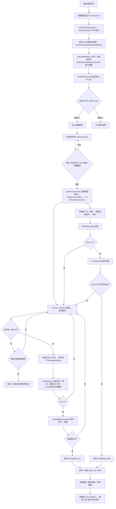

# 攻打战斗系统（Battle System）

> fish 项目（ClashMaster，部落冲突风格）的“攻打其他部落”战斗玩法：基地训练军队 → 地图面板选关卡 → 进入战斗场景放兵攻打敌方基地 → 防御塔反击 / 兵拆建筑（受击显示血条）→ 摧毁城镇大厅胜利或军队全灭失败 → 掠夺金币+药水入账 → 结算面板回基地。
> 代码位置：`src/projects/fish/gameplay/`（`level/FishLevelGameMode.ts` 战斗 GameMode、`battle/` 兵/弹丸/HUD/结算脚本、`base/ClashBuildingTypes.ts` 建筑类型表、`common/comp/TrainingComponent.ts` 军队组件、`FishGameInstance.ts` 阶段路由）、`src/projects/fish/asset/`（`fish_level*.scene.json` 战斗场景、`blueprints/ui/battle_*.widget.json` 战斗 UI）。
> 相关文档：[`level_system.md`](./level_system.md)（关卡入口与切换流程，本文档承接其"关卡场景"环节）、[`../engine/gameflow_system.md`](./engine/gameflow_system.md)、[`../engine/ui_system.md`](./engine/ui_system.md)、[`../engine/input_physics_script_system.md`](./engine/input_physics_script_system.md)。

## 1. 概述

战斗系统把 3 个空壳关卡场景改造为**战斗场景**（场景资产内置敌方基地，随 `SwitchToScene` 加载），关卡玩法 = 战斗玩法：玩家在基地兵营训练军队（金币扣费 + 训练倒计时），通过地图面板点关卡进入战斗，底部兵种卡片选兵 + 点战场放置，兵自动直线移动攻击敌方建筑（被城墙挡则攻击城墙、飞行兵越过城墙），敌方防御塔在射程内自动攻击最近兵（弹丸命中扣血）。胜负判定后掠夺资源一次性入账并弹出结算面板。

关键角色与职责：

| 角色 | 职责 |
|---|---|
| `FishGameInstance` | 阶段路由（`enterLevel` / `returnToBase`）、资源组件（金币+药水）、训练组件持有者、`window.__fishBattle` 调试桥 |
| `FishLevelGameMode` | 战斗权威：收集敌方建筑/hp 表/血条组件、兵索敌与碰撞、防御塔开火、放兵交互、胜负判定、掠夺入账、结算面板 |
| `BattleTroopActor` | 兵 Actor：直线移动 + 被挡攻击阻挡物 + 远程站桩 + preferred 索敌 + 飞行越墙（模型为蓝图胶囊体子 Actor） |
| `BuildingHealthBarComponent` | 建筑血条组件：默认隐藏、受击显示、3 秒无受击自动隐藏（全权自管，GameMode 只调 onDamaged） |
| `BattleProjectileActor` | 弹丸 Actor：直线飞行、命中扣血（建筑/兵双目标）、超出路程自毁 |
| `BattleHudScript` | 战斗 HUD：兵种卡片（数量/禁用/放置高亮）+ 已部署统计，每帧刷新 |
| `BattleResultScript` | 结算面板：胜负标题 + 掠夺明细 + 回基地按钮 |
| `ClashBuildingTypes.ts` | 建筑类型单一数据源：新增 hp/lootCoins/lootElixir/defense/blocksGround |
| `TrainingComponent` | 训练军队组件：新增 `deployTroop`（放兵消耗）/`isArmyEmpty`（失败判定）/`debugAddArmy`（调试注入） |
| `fish_level{1,2,3}.scene.json` | 战斗场景：草地地面 + 敌方基地建筑 ref 节点（10~15 个） |

与相邻功能边界：**建造系统**（基地 `FishBaseGameMode` 放置/移动建筑）与战斗无关，敌方基地直接以场景资产存在；**出海捕鱼**（`FishGameMode`）仍走 `startGameplay()`（`_levelId=null`），与战斗互斥；**训练**（`BarracksUiScript` → `trainTroop`）在基地阶段完成，战斗只消耗军队。

## 2. 核心类 / 模块

| 类 / 模块 | 说明 |
|---|---|
| `FishLevelGameMode`（`gameplay/level/FishLevelGameMode.ts`） | 战斗 GameMode（mode="level" 注册）：`collectBuildings`/`attachHealthBar`（挂 `BuildingHealthBarComponent`）、`damageBuilding`/`onBuildingDestroyed`、`getBestTargetFor`/`findBlockerAt`/`fireTroopAttack`、防御塔 `Tick` 索敌、`onScreenDown`/`spawnTroopActor`（蓝图预检 + 放兵）、`finishBattle` 胜负+入账+结算面板 |
| `BattleTroopActor`（`gameplay/battle/BattleTroopActor.ts`） | 覆写 `Tick` 的兵：射程内站桩攻击（间隔 0.5s，伤害=dps×0.5）；射程外直线移动；地面兵 AABB 碰撞阻挡回退；`takeDamage` 死亡回调；模型 = 蓝图胶囊体子 Actor（构造时 attachTo） |
| `BuildingHealthBarComponent`（`gameplay/common/comp/BuildingHealthBarComponent.ts`） | 建筑血条组件（继承 ActorComponent）：BeginPlay 建背景/前景条（初始不可见）；`onDamaged(ratio)` 显示+刷新+重置 3s 计时；`Tick` 超时直接隐藏 |
| `CapsuleMeshComponent`（`src/engine/rendering/CapsuleMeshComponent.ts`） | 引擎胶囊体网格组件（继承 MeshComponent）：properties `radius`/`length`/`color`，已注册 ComponentRegistry + assetLint 检查器 |
| 兵种蓝图 × 10（`asset/blueprints/troops/*.blueprint.json`） | 每兵种一个：`Actor`（注册表注册名，GenericActor 实例）+ `TransformComponent`（贴地 y 偏移 = radius+length/2）+ `CapsuleMeshComponent`（颜色写死）；`TroopType.blueprint` 字段引用 |
| `BattleProjectileActor`（`gameplay/battle/BattleProjectileActor.ts`） | 弹丸：构造指定起终点/速度/伤害/目标；Tick 直线飞行；命中 <0.4 或超出总路程 → 结算自毁 |
| `BattleHudScript`（`gameplay/battle/BattleHud.script.ts`） | HUD 脚本（script id `gameplay/battle/BattleHud`）：读兵种表生成卡片（复用 `troop_card.blueprint.json`）、数量/禁用/放置中刷新 |
| `BattleResultScript`（`gameplay/battle/BattleResult.script.ts`） | 结算脚本（script id `gameplay/battle/BattleResult`）：读 `getBattleResult()` 填充标题/明细、绑定回基地 |
| `ClashBuildingType`（`gameplay/base/ClashBuildingTypes.ts`） | 类型表加战斗字段：hp（城镇大厅 1000/城墙 250 等）、lootCoins/lootElixir（掠夺量）、defense（防御塔 range 9/damage 30/cooldown 1s）、blocksGround |
| `FishLevelPlayerController`（`gameplay/level/`） | 鼠标转发：`OnPointerDownScreen` → `onScreenDown`（放兵）；`OnPointerMoveScreen` → 相机云台鼠标位置 |
| `BaseCameraActor`（`gameplay/base/BaseCameraActor.ts`） | 战斗相机复用：透视 + 滚轮缩放 + 右键平移（关边缘滚动，panLimit ±24） |
| `battle_hud.widget.json` / `battle_result.widget.json`（`asset/blueprints/ui/`） | 战斗 HUD（CoC 木条底栏 + 8 列卡片 grid + 统计）与结算面板（CoC 面板 + 回基地按钮） |

## 3. 使用方法

### 3.1 玩家入口（正常流程）

```ts
// 基地 → 地图面板（MapPanel.script.ts 关卡卡片点击）
cardBtn.onClick = () => inst?.enterLevel(id)
// → FishGameInstance.enterLevel：查 levels.table.json → _levelId → switchToPhase('game')
// → 场景 mode="level" → FishLevelGameMode → 战斗开始（敌方基地 + 战斗 HUD）

// 战斗 HUD 卡片点击 → 放置模式（BattleHudScript 内）
troopBtn.onClick = () => gm.selectTroop(id)
// → 点击战场（±24、禁叠建筑）→ FishLevelGameMode.onScreenDown 部署兵（训练军队 -1）

// 结算面板「回基地」（BattleResultScript 内）
backBtn.onClick = () => inst.returnToBase()
```

### 3.2 AI 调试直跳入口（Playwright 验证）

```ts
// FishGameInstance.start() 安装 window.__fishBattle
;(window as any).__fishBattle.enterLevel('level1')          // 直跳关卡战斗（跳过基地/地图面板）
;(window as any).__fishBattle.addArmy('barbarian', 10)      // 调试注入军队（绕过训练队列）
;(window as any).__fishBattle.getState()                    // { phase, levelId, coins, elixir, army }
```

### 3.3 触发时机

- **进入战斗**：地图面板点关卡卡片（或 `__fishBattle.enterLevel`）→ `enterLevel` → `switchToPhase('game')`
- **放兵**：HUD 卡片点击（`selectTroop`）→ 战场空地左键（`InputSys` 未被 Clickable 消费 → `OnPointerDownScreen` → `onScreenDown`）；Esc / 再次点卡片 / 右键平移取消放置模式
- **兵攻击**：`BattleTroopActor.Tick`（World 驱动）索敌 → 攻击间隔 0.5s → `fireTroopAttack` 弹丸
- **防御塔攻击**：`FishLevelGameMode.Tick` 冷却计时 → 射程内最近兵 → 弹丸
- **胜负结算**：摧毁城镇大厅（`onBuildingDestroyed`）或军队全灭（`Tick`/`onTroopDied`）→ `finishBattle` → 掠夺入账 + 结算面板
- **返回基地**：结算面板按钮 → `returnToBase`（复用三阶段清理流程）

### 3.4 使用前提

- 军队非空：兵种在基地兵营训练完成（或 `__fishBattle.addArmy` 注入），否则无法放兵、全灭立即判负
- 场景资产 mode 必须为 `"level"`（GameModeRegistry → FishLevelGameMode）；敌方基地以 `type: "ref"` 节点写在场景 `objects` 中
- 战斗场景的 3D 血条由 GameMode 在 BeginPlay 时动态挂载（无需在蓝图/场景中声明）：`BuildingHealthBarComponent` 默认隐藏、受击显示、3 秒无受击自动隐藏
- 兵种模型蓝图必须可解析（`TroopType.blueprint` 路径），否则放兵被拒（严格模式，军队不消耗）

## 4. 工作流程

### 4.1 主流程



### 4.2 分阶段说明

| 阶段 | 触发点 | 关键调用 | 产物 |
|---|---|---|---|
| 场景加载 | `SwitchToScene` | `loadSceneAsActors`（ref → `SpawnActorFromBlueprint`） | 敌方建筑 Actor（ClashBuildingActors 类实例） |
| 战斗初始化 | `FishLevelGameMode.BeginPlay` | `collectBuildings` / `attachHealthBar`（挂 `BuildingHealthBarComponent`） | hp 表、血条组件（默认隐藏） |
| HUD 装配 | HUD Actor BeginPlay | `BattleHudScript.onStart`：`spawnUIActor(troop_card)` × 8 | 兵种卡片 + grid 布局 + 统计文本 |
| 放兵 | 空地左键 | `onScreenDown` → `spawnTroopActor`（蓝图模型预检 → `deployTroop` → `SpawnActor(BattleTroopActor)`） | 场上兵（胶囊体模型子 Actor）+ 军队 -1 |
| 兵战斗 | `BattleTroopActor.Tick` | `getBestTargetFor` / `findBlockerAt` / `fireTroopAttack` | 移动/攻击/弹丸 |
| 防御塔反击 | `FishLevelGameMode.Tick` | `findNearestTroopInRange` → `SpawnActor(BattleProjectileActor)` | 炮弹命中兵扣血 |
| 胜负结算 | 城镇大厅摧毁 / 兵全灭 | `finishBattle` | `battleEnded=true`、掠夺入账、结算面板 |

### 4.3 设计要点

- **敌方基地 = 场景资产**：建筑以 `type: "ref"` 节点写在 `fish_level*.scene.json`，随场景切换加载/销毁（复用 `DestroyAllActors` 清理），GameMode 只读不建；每关卡 ~15 个建筑（L1 城墙横列、L2 城墙围城、L3 双塔 + 城墙横列）
- **血条 = 运行时挂组件（组件优先）**：不修改建筑蓝图/类，GameMode 在 BeginPlay 给每个建筑挂 `BuildingHealthBarComponent`（组件全权自管：默认隐藏、受击 `onDamaged(ratio)` 显示 + 前景 scale.x 缩水 + <30% 变红 + 重置 3s 计时、`Tick` 超时直接隐藏无动画）；所有建筑（城墙/防御塔/金矿/水库/城镇大厅）规则统一
- **兵模型 = 蓝图胶囊体**：每个兵种一个 `asset/blueprints/troops/{id}.blueprint.json`（`Actor` + `TransformComponent` 贴地 y 偏移 + `CapsuleMeshComponent`，颜色写死）；`TroopType.blueprint` 字段引用（`DEFAULT_TROOPS`/`troop.table.json`/transform 三处同步，缺失按行键回退路径 + 告警）。放兵时 `spawnTroopActor` 先 `SpawnActorFromBlueprint` 预检模型（严格模式：失败 = 放兵失败、军队不消耗、无兵生成），成功则模型子 Actor attach 到 `BattleTroopActor`。碰撞仍用 `troop.size` 半宽 AABB，飞行兵悬空 y=2 不变
- **建筑点击回调兼容**：`ClashBuildingBaseActor` 的点击回调硬编码 cast 成 `FishBaseGameMode` 调 `onBuildingClick`——战斗 GameMode 必须提供同名方法（空实现），否则点击敌方建筑抛 TypeError
- **放兵走 InputSys 消费链**：UI 按钮与建筑（有 ClickableComponent）的点击被 `PhySys.raycastClick` 消费；草地无 Clickable → 未被消费 → `controller.OnPointerDownScreen` → 放兵。禁叠建筑由 AABB 检查兜底
- **攻击数值自洽**：兵每 0.5s 打一击，每击伤害 = `dps × 0.5`（每秒总伤害 = dps）；防御塔 `defense.damage/cooldown` 独立配置
- **掠夺只结算一次**：`lootSettled` 标志防重复入账（胜利后残余弹丸命中不再改变掠夺）；掠夺量按建筑类型固定（金矿 +150 金币、水库 +150 药水），摧毁即累计、结束一次性 `resources.add`
- **失败判定双触发**：`Tick`（场上兵 0 且军队耗尽）与 `onTroopDied` 都检查，保证防御塔击杀最后一个兵时立即判负
- **healer（dps=0）不生成战斗卡片**：治疗超范围，避免无攻击能力的兵放上场

## 5. 边界条件

| 条件 | 行为/后果 | 处理方式 |
|---|---|---|
| 军队为空进入战斗 | 无法放兵；不部署任何兵则战斗持续等待（不判负） | HUD 卡片全部置灰；`deployTroop` 返回 false 并日志 |
| 部署过兵且军队耗尽+场上兵 0 | 判负 → 结算面板 | `deployedCount > 0` 且 `troops.length === 0` 且 `isArmyEmpty()` |
| 放兵点超出 ±24 | 拒绝部署（军队不扣除） | `spawnTroopActor` 范围校验 + warn 日志 |
| 放兵点与建筑重叠 | 拒绝部署 | AABB 相交检查（type.size 半宽 + 兵半宽） |
| 兵种模型蓝图缺失/解析失败 | 该次放兵失败：`logger.error` + 军队不消耗、无兵生成（严格模式，无 BoxMesh 兜底） | `spawnTroopActor` 在 `deployTroop` 之前 `SpawnActorFromBlueprint` 预检 |
| 建筑受击 | 血条立即显示 + 刷新比例/低血量变红 + 重置 3s 隐藏计时 | `BuildingHealthBarComponent.onDamaged` |
| 建筑 3 秒无受击 | 血条自动隐藏（直接 `visible=false` 无动画） | 组件 `Tick` 倒计时归零隐藏 |
| 点击敌方建筑 | 无交互（不选中/不移动） | `onBuildingClick` 空实现防崩溃 |
| 地面兵直线路径被挡 | 位置不动（贴包围盒边缘）+ 改目标攻击阻挡物 | `findBlockerAt` 命中 → `setTroopTargetOverride` |
| 飞行兵 | 无视阻挡直接飞越 | `troop.flying` 跳过碰撞检测（出生 y=2 悬空） |
| 目标建筑被摧毁 | 兵重新索敌（覆盖目标自动清除） | `getBestTargetFor` 检查 `bPendingDestroy` |
| 战斗结束（胜负已判） | 兵/防御塔停火，弹丸停止扣血 | `battleEnded` 标志（`Tick`/`damageBuilding`/`fireTroopAttack` 前置检查） |
| 重复触发结算 | 只入账一次 | `lootSettled` 标志 |
| 战斗不中途暂停 | Esc = 取消放置模式（不再弹暂停菜单） | `spawnPlayerInternal` 绑定 `battle-cancel` |
| 战斗相机 | 透视俯瞰（12,16,18）+ 滚轮缩放 + 右键平移，panLimit ±24 | 复用 `BaseCameraActor`（关边缘滚动） |
| 无兵种表（配置未加载） | HUD 卡片列表为空 | BattleHudScript warn 跳过 |
| 兵种 dps=0（治疗师） | 不生成卡片、无法放兵 | 生成时 `troop.dps <= 0` 过滤 |

## 6. 依赖关系 / 注册机制

```
FishGameInstance（资源/训练组件 + 阶段路由）
  └─ enterLevel(id) → switchToPhase('game')
       └─ World.SwitchToScene(关卡场景, mode="level")
            ├─ GameModeRegistry('level') → FishLevelGameMode
            ├─ loadSceneAsActors → ref 节点 → SpawnActorFromBlueprint
            │     └─ BlueprintRegistry('asset/blueprints/buildings/*.blueprint.json')
            │           └─ ActorRegistry（TownhallActor 等，register.ts 批量注册）
            └─ HUDClass 'asset/blueprints/ui/battle_hud.widget.json'
                  └─ UIScriptComponent script='gameplay/battle/BattleHud'
                        └─ ScriptRegistry（asset/index.ts import.meta.glob 自动注册 .script.ts）
```

- 建筑/弹丸/兵均为场景 Actor，由 `World.SpawnActor` 托管生命周期（`DestroyAllActors` 统一回收，MeshComponent.EndPlay 自动释放网格资源）；兵模型子 Actor 经 `attachTo` 挂树随兵递归销毁，蓝图根 TransformComponent 的贴地偏移在 `SpawnActorFromBlueprint` 实例化时应用
- 结算面板为运行时 `world.ui.spawnUIActor` 动态生成（挂 HUD，World 销毁时统一回收）
- 新资产全部自动注册（glob），无需改 `register.ts` / `asset/index.ts`

## 7. 踩坑记录

- `World` 不暴露 `gameInstance` 属性：战斗 GameMode 取共享组件（resources/training）用 `GameInstance.current as FishGameInstance`，不能写 `this.world.gameInstance`
- `FishGameInstance.getActiveCamera()` 的 game 分支原只查 `_gameMode`（出海），关卡阶段相机返回 null 导致战斗画面黑屏——需改为 `(this._gameMode ?? this._levelGameMode)`
- 场景 ref 节点与蓝图/actor 节点不同：顶层 `position/rotation/scale` 是 ref 节点 schema 的合法字段（node:ref 检查器允许），不要套用 actor 节点的"组件优先"规则
- 弹丸/兵是场景 Actor，`Tick` 由 World 驱动；建筑血条组件挂到建筑 Actor 上（建筑是 ref 实例，`bActive` 隐藏整个子树会连带隐藏血条），组件 Tick 由建筑 Actor 的 Tick 驱动
- **近战兵 AABB 边缘死锁**（Playwright 实测发现）：兵移动步长（speed×dt，哥布林 32/30fps≈1.07）大于攻击距离余量时，被挡在 AABB 外不动的兵永远"够不到"阻挡物（只挨塔打不拆墙）。修复：① 攻击距离判定 = `range + 目标半宽`（换算兵中心到建筑中心的 gap）；② 被挡时用 slab 法沿移动方向把兵**贴到 AABB 边缘**（距离 = 半宽+兵半宽 ≤ 攻击距离），下一帧即可攻击
- **碰撞半宽传错**：`findBlockerAt` 曾传入兵全宽（`size[0]`）而非半宽（`size[0]/2`），碰撞盒双倍大导致放兵/移动判定异常——统一传半宽
- hidden 页面 rAF/setInterval 会被浏览器深度节流（setInterval 可降至 ~1 次/分钟）：调试桥 `stepTicks(n)` 同步批量推进 n×(1/30)s 游戏时间，Playwright 断言不依赖实时等待（`startTickDriver` 仅作真实时间兜底）
- 浏览器环境 assetLint 降级为内存态扫描（`RegistryAssetSource`，无 electronAPI 时），扫描日志见 `[AssetLint] 扫描完成`；新建资产零 lint 错误即通过
