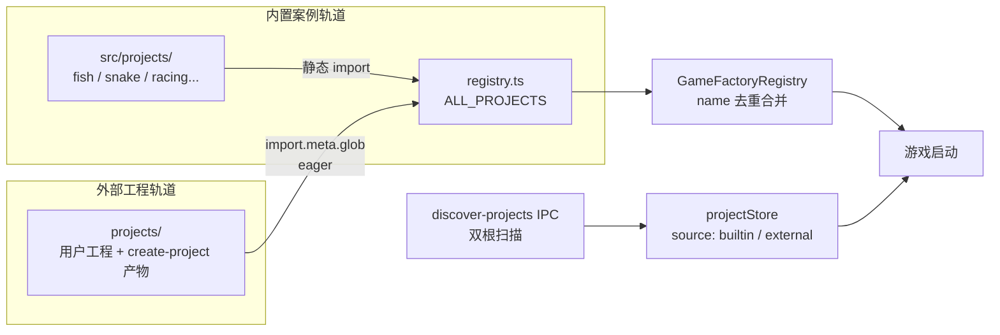

# 外部根目录工程支持方案（External Project Roots）

> **一句话定位**：在保留 `src/projects/` 全部现有工程为"内置案例"的前提下，新增仓库根下 `projects/` 作为第二个工程根，供 `create-project` 落盘与用户自建工程，两条根通过 `import.meta.glob` 与双根扫描汇入同一套注册与发现机制。
> **什么时候会用到你**：实现"新建工程不再写进 `src/projects/`"改造时；排查"外部工程不被发现/资产读不到/蓝图保存路径错误"问题时；后续评估"任意磁盘目录作为工程根"二期方案时。
> **代码位置**：`src/projects/registry.ts`、`electron/main.ts`、`src/stores/projectStore.ts`、`src/stores/editorStore.ts`、`src/editor/MockElectronAPI.ts`、`tsconfig.json`、`.gitignore`

**状态**：方案已定稿待实施（2026-09-04）。文中"现状"均经源码逐条核实（read_file / grep 验证），"改造点"为待实施项。

---

## 1. 先记住这几个文件

| 文件 | 一句话职责 | 你要改它的场景 |
|---|---|---|
| [`registry.ts`](../../src/projects/registry.ts) | 项目模块注册中心：`ProjectModule` 契约（registry.ts:27）+ `ALL_PROJECTS` 静态数组（registry.ts:52）+ 延迟配置加载 | 给外部工程并入注册表加 glob 收集逻辑时 |
| [`main.ts`](../../electron/main.ts) | 主进程 IPC：工程发现/资产列表/文件读写/创建工程全部在此 | 双根扫描、`asset-file-ops` 路径校验、`create-project` 改落盘根时 |
| [projectStore.ts](../../src/stores/projectStore.ts) | 工程列表 state + `discoverProjects` 发现逻辑 + `DEFAULT_PROJECTS` 兜底 | 加 `source` 字段区分内外部、Mock 模式适配时 |
| [editorStore.ts](../../src/stores/editorStore.ts) | `Project` 类型定义地 + `setCurrentProject` 打开工程链路（editorStore.ts:219） | `Project` 加 `source`、按 source 解析 defaultScene 时 |

**关键心智模型**：这不是一次"迁移"，而是一次"分流"。`src/projects/` 一个字都不动，它继续作为内置案例轨道；外部工程走全新通道，两条轨道在两个汇合点（`GameFactoryRegistry` 工厂注册、工程发现列表）合流。所有改造点都围绕"单根假设"展开——把写死的 `src/projects` 换成"根数组遍历"。

---

## 2. 为什么是仓库根下 `projects/`（关键设计决策）

外部工程的代码（`register.ts`/gameplay 脚本）必须被 Vite 编译才能运行，而 Vite 只能可靠处理仓库根以内的文件。因此外部根目录定为仓库根下的 `projects/`（即 `E:\DemoStudio\projects\`），它天然满足三个条件：

1. **在 Vite root 内**：dev 可直接 serve，`import.meta.glob('/projects/*/register.ts')` 在 build 时也会把匹配文件打进产物
2. **`ProjectModule` 契约原样复用**：外部工程只是换一种方式收集，注册接口（registry.ts:27 `ProjectModule`）零改动
3. **Electron 文件 IO 无需跨盘符安全边界**：现有各 IPC 的路径校验只需从"单个根"改为"根数组"，不引入新的安全模型

**关键设计：内置静态 + 外部 glob 的混合注册**。内置项目保留静态 import（`ALL_PROJECTS` 数组不动），外部工程用一条 glob 动态并入同一个注册表：

```ts
// src/projects/registry.ts 追加（或独立 externalRegistry.ts）
const externalModules = import.meta.glob('/projects/*/register.ts', { eager: true })
for (const [path, mod] of Object.entries(externalModules)) {
  // 从 path 推导工程名 → 并入 projectModuleMap + GameFactoryRegistry
}
```

用 `eager: true` 的原因：`createGameInstance` 是同步契约（见 registry.ts:33 注释"World.sceneComp.scene 在 World 内部获取"），`GameFactoryRegistry` 的工厂签名是同步的，懒加载会破坏该契约。代价是新增外部工程后需重启 dev server（或整页刷新）才能被发现——这符合"创建工程"的交互节奏，可接受。

**命名冲突策略**：外部工程覆盖内置同名工程并 `logger.warn`。这刻意支持一个高价值工作流——把 fish 复制到 `projects/` 后随便改，不污染案例库。

## 3. 双轨架构总览



---

## 4. 现状链路：一个工程从被发现到被打开（真实代码逐段）

### 4.1 谁调用了发现入口

`discover-projects` IPC（main.ts:1344）是发现的唯一入口，编辑器启动时由 projectStore 的 `discoverProjects()` 触发。现状代码（main.ts:1344 起）：

```ts
ipcMain.handle('discover-projects', async () => {
  try {
    const projectsDir = path.join(__dirname, '..', 'src', 'projects')
    if (!fs.existsSync(projectsDir)) return []

    const entries = fs.readdirSync(projectsDir, { withFileTypes: true })
    const projects: Array<{ name: string; description: string; version: string; tags: string[]; folder: string; renderMode?: '2d' | '3d'; defaultScene?: string }> = []

    for (const entry of entries) {
      if (!entry.isDirectory()) continue
      const jsonPath = path.join(projectsDir, entry.name, 'project.json')
      if (!fs.existsSync(jsonPath)) continue
      // ...读取 project.json 填充元数据（略）
    }

    return projects
  } catch (err) {
    console.error('扫描工程目录失败:', err)
    return []
  }
})
```

讲解：单根硬编码在 `path.join(__dirname, '..', 'src', 'projects')` 这一行。返回结构里**没有 `source` 字段**——双轨改造的第一件事就是抽 `PROJECT_ROOTS` 常量遍历两次，并在返回值上加 `source: 'builtin' | 'external'`。

前端侧消费（projectStore.ts:56 起）：

```ts
discoverProjects: async () => {
  set({ loading: true })
  try {
    // 优先通过 Electron IPC 扫描文件系统
    if (window.electronAPI?.discoverProjectsScan) {
      const scanned = await window.electronAPI.discoverProjectsScan()
      if (scanned.length > 0) {
        set({ projects: scanned, loading: false })
        return
      }
    }
  } catch {
    // IPC 失败则回退到预设列表
  }
  // 回退：确保 Snake 始终在列表中
  ...
}
```

讲解：`DEFAULT_PROJECTS` 兜底列表（projectStore.ts:11 起）在 IPC 不可用时生效，五个内置工程在这里写死。改造时兜底条目需补 `source: 'builtin'`，Mock 模式下外部工程的兜底为空列表（Mock 无磁盘）。

### 4.2 打开工程时发生了什么

工程切换入口在 editorStore 的 `setCurrentProject`（editorStore.ts:219 起）：

```ts
setCurrentProject: (project) => {
  void import('../projects/registry')
    .then(({ registerProjectAssets, clearProjectAssets }) => {
      // 先注册/清空资产，再切换 currentProject，保证状态一致（资产就绪后才对外可见）
      if (project) {
        registerProjectAssets(project.name)
      } else {
        clearProjectAssets()
      }
      set({ currentProject: project, dynamicTabs: [], activeTabId: 'scene', assetSelection: null })
    })
    .catch((err) => { ... })
}
```

讲解：`void` 不 await 是刻意的——动态 import 斩断 agent 独立窗口（agent.html）对 `projects/registry` 的依赖边（见源码注释），microtask 按序执行保证连续切换无竞态。这条链路对双轨**天然兼容**：`registerProjectAssets(name)` 走 registry 内的 `projectModuleMap`，只要外部工程的 `ProjectModule` 并入了 map，资产注册零改动。

registry 侧的资产注册（registry.ts:119 起）：

```ts
export function registerProjectAssets(name: string): void {
  // 清空上一个工程的资产
  clearProjectAssets()

  const project = projectModuleMap.get(name)
  if (project?.registerAssets) {
    project.registerAssets()
  }
}
```

讲解：`projectModuleMap` 是内外部工程的唯一合流点。外部工程并入此 map 后，配置延迟加载（registry.ts:105 `initProjectConfigs`）、资产注册、游戏工厂全部自动生效——这就是"汇入同一套注册机制"的含义。

### 4.3 浏览器 Mock 模式的路径翻译（最易漏的回归盲区）

Mock 模式（浏览器无 `electronAPI`）里，`import.meta.glob` 返回的 key 与 IPC 期望的路径形式不同，靠 `normalizePath` 翻译（MockElectronAPI.ts:68 起）：

```ts
function normalizePath(globPath: string): string {
  // import.meta.glob 返回 key 如 "../projects/fish/project.json"
  // readJsonFile 期望的路径如 "src/projects/fish/asset/fish_menu.scene.json"
  // Windows 上 glob key 可能含反斜杠 \，统一转正斜杠再处理
  return globPath.replace(/\\/g, '/').replace(/^\.\.\//, 'src/')
}
```

讲解：现在的规则是"剥掉一层 `../` 换成 `src/`"。引入外部根后，Mock 的 glob 会同时匹配到 `../projects/...`（→ `src/projects/...`）与 `../../projects/...`（→ `projects/...`）两种前缀，`normalizePath` 必须区分这两种情况做双前缀翻译，否则外部工程的资产在浏览器调试模式下全部 404。这是整个方案里**最隐蔽的改造点**，测试清单里单独列了一条。

### 4.4 创建工程的现状

`create-project`（main.ts:1053 起）现状只生成两个文件且落 `src/projects/`：

```ts
ipcMain.handle('create-project', async (_event, projectName: string, mode: '2d' | '3d' = '3d') => {
  try {
    const projectDir = path.join(__dirname, '..', 'src', 'projects', projectName.toLowerCase())
    if (fs.existsSync(projectDir)) {
      return { success: false, error: `工程 "${projectName}" 已存在` }
    }
    // ...project.json + index.ts 模板写入（略）
```

讲解：注意现状模板**没有生成 `register.ts`**——新工程连 `ProjectModule` 都没有，`project.json` 的 `main` 字段也指向一个不存在实际内容的 `index.ts`。双轨改造时模板需升级为自带 `register.ts` + `asset/index.ts`（相对 glob 零改动即可注册），否则创建出的外部工程既不被发现也不可运行。

---

## 5. 改造点清单

### 5.1 Electron 侧（main.ts）

| 改造点 | 现状锚点 | 改法 |
|---|---|---|
| 工程根常量 | 各 handler 各自 `path.join(__dirname, '..', 'src', 'projects', ...)` | 抽 `PROJECT_ROOTS = ['src/projects', 'projects']`，统一从常量推导 |
| 工程发现 | `discover-projects`（main.ts:1344）单根扫描 | 双根遍历，返回值加 `source: 'builtin' \| 'external'`；同 folder 名冲突时外部覆盖内置并 warn |
| 资产/源码列表 | `list-project-assets`（main.ts:1383）、`list-project-src`（main.ts:1481） | baseDir 改按根数组遍历匹配 folder |
| 资产文件操作 | `asset-file-ops`（main.ts:1417） | 路径校验从"必须位于 src/projects 下"改为"位于任一根下" |
| 资产监听 | `watch-project-assets`（main.ts:1542） | watch 目标按 folder 所在根解析 |
| JSON 读写 | `read-json-file`（main.ts:1110）、`write-json-file`（main.ts:1150） | 相对路径解析按根数组匹配；逃逸防护保留 |
| 创建工程 | `create-project`（main.ts:1053） | 落盘根改为 `projects/`；模板升级自带 `register.ts` + `asset/index.ts` |

### 5.2 前端侧

| 文件 | 改造点 |
|---|---|
| [editorStore.ts](../../src/stores/editorStore.ts) | `Project` 类型加 `source: 'builtin' \| 'external'`；`setCurrentProject` 链路按 source 解析 defaultScene 路径 |
| [projectStore.ts](../../src/stores/projectStore.ts) | `DEFAULT_PROJECTS` 兜底条目补 `source`；`discoverProjects` 合并双轨结果 |
| [MockElectronAPI.ts](../../src/editor/MockElectronAPI.ts) | `normalizePath`（MockElectronAPI.ts:68）双前缀翻译：`../projects/` → `src/projects/`，`../../projects/` → `projects/`；Mock 模式 glob 扩到 `/projects/**` |

### 5.3 配置与工具链

| 文件 | 改造点 |
|---|---|
| `tsconfig.json` | include 加 `"projects"`（现状 include 为 `["src", "electron", "tests"]`，不加则外部工程游离在 `npx tsc --noEmit` 类型检查门外） |
| `.gitignore` | 加 `projects/*/data/`（对齐现状 `src/projects/*/data/*` 规则，.gitignore:53）；`src/projects/*/data/` 保留 |
| `.github/instructions/projects.instructions.md` | `applyTo` 扩到 `projects/**` |
| `harness/ds-instructions` | 路径前缀映射（`harness/ds-instructions/src/config.ts`）加一条 `projects` 映射，否则 AI agent 改外部工程时不会自动注入规范 |
| `editor/mcp-server.mjs`、`scripts/ui-compiler-*` | 路径前缀按根数组适配 |
| `AGENTS.md`、[system_overview.md](../system_overview.md) | 目录地图与统计补 `projects/` 条目 |

### 5.4 天然免疫项（验证它们真的不用改）

| 免疫项 | 原因 |
|---|---|
| assetLint / codeLint 扫描 | 走 folder 参数定位项目，folder 定位逻辑改为按根数组解析后自动兼容 |
| 资产预览层的磁盘路径→资产 key 截取 | 以 `/asset/` 为锚点截取，不关心 `/asset/` 之前是哪条根 |
| 项目内部 `import.meta.glob('./...')` | 相对模式，工程目录整体搬家不影响 |

---

## 6. 流程影响：牵动哪些功能

### 上游：谁驱动本方案

| 上游 | 怎么驱动 | 相关文档 |
|---|---|---|
| `create-project` IPC | 创建动作落盘根从 `src/projects/` 改为 `projects/`，模板升级 | 本文档 §4.4 |
| 编辑器启动 / projectStore | 启动时 `discoverProjects()` 双根扫描合流 | 本文档 §4.1 |
| Mock 浏览器调试模式 | glob 前缀双轨翻译 | 本文档 §4.3 |

### 下游：本方案波及谁

| 下游功能 | 波及点 | 相关文档 |
|---|---|---|
| 游戏启动链路 | 外部工程 `ProjectModule` 并入 `projectModuleMap` 后 `GameFactoryRegistry` 自动可启动 | [gameflow_system.md](../engine/gameflow_system.md) |
| 资产注册链路 | `registerProjectAssets` 按名查 map，双轨自动生效 | [asset_tools_system.md](../engine/asset_tools_system.md) |
| 资产浏览器 / assetLint | 双根文件列表与路径校验 | [asset_preview_lint_system.md](../editor/asset/asset_preview_lint_system.md) |
| codeLint 源码扫描 | 扫描根扩为根数组 | [code_lint_system.md](../editor/asset/code_lint_system.md) |
| MCP 工具 | `editor/mcp-server.mjs` 路径前缀适配 | [mcp_integration.md](../editor/integration/mcp_integration.md) |
| DSH agent 指令注入 | ds-instructions 前缀映射加 `projects` | [dsh_instructions_prd_revised.md](../harness/dsh_instructions_prd_revised.md) |

---

## 7. 二期展望（本期不做）：任意磁盘目录作为工程根

支持用户任选磁盘目录（如 `D:\MyGames\`）作为工程根需要：

- Vite `server.fs.allow` 放行目标目录
- `import(/* @vite-ignore */)` 运行时动态 import

硬限制：**生产构建无法包含 root 外的代码**，只适合 dev 场景。建议等一期验证稳定后再评估。

---

## 8. 边界条件

| 条件 | 行为 | 怎么应对 |
|---|---|---|
| 外部工程与内置工程同名 | 外部覆盖内置，`logger.warn` 提示 | 刻意支持（复制 fish 到 `projects/` 魔改的工作流）；文档明示 |
| 新增外部工程后不重启 | glob 收集不到新 `register.ts` | 重启 dev server 或整页刷新；模板创建流程本身会触发刷新 |
| `project.json` 缺失或解析失败 | 该目录不进入工程列表（与现状 discover 行为一致） | 单个工程损坏不影响其他工程 |
| Mock 模式打开外部工程 | 无磁盘 IO，资产走 glob 内存缓存 | `normalizePath` 双前缀翻译正确是唯一前提（§4.3） |
| 外部工程游离在 tsc 门外 | `npx tsc --noEmit` 不检查外部工程代码 | tsconfig include 加 `"projects"`（§5.3） |
| 仓库根 `projects/` 目录不存在 | 视为空外部轨，一切照旧 | 目录懒创建：`create-project` 时 `mkdirSync recursive` |

---

## 9. 验证计划

`npx tsc --noEmit` 全量过 → 自启动 `npm run electron:dev` → Electron 模式验证：双轨工程发现、create-project 落 `projects/`、外部工程打开/资产浏览器/蓝图编辑保存/游戏启动、fish 案例回归 → 浏览器 Mock 模式复验双前缀路径翻译（§4.3，最易漏的回归盲区）→ assetLint / codeLint 零错误。

方案本身不改动任何现有项目代码，风险集中在 electron 路径处理函数的根数组化这一处。
