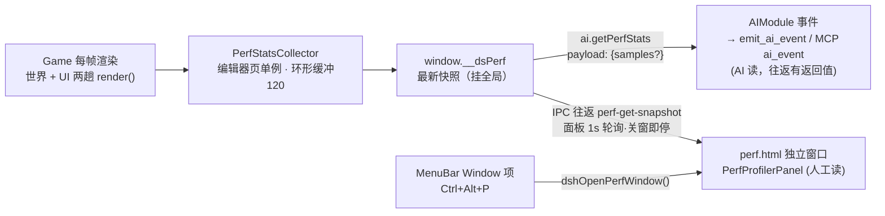

# 性能分析器方案（Performance Profiler：人工面板 + AI 读数）

> **一句话定位**：引擎侧常驻性能采集器（FPS / draw call / 三角形 / 场景可见 mesh / JS 堆 / 长任务）+ 两条消费通道——顶部菜单栏 Window 项打开的**独立面板窗口**（人工），`ai.getPerfStats` 事件（AI），同一条数据、同一份快照。
> **什么时候会用到你**：UI/渲染优化前采基线（如 [UI 合批方案](./ui_batching_plan.md) P0）；排查「卡」时先分清 draw call 还是 JS（warm 2026-09-16 定案的标准动作）；AI 自主开发时量化验证「改动前后性能」。
> **代码位置**：新增 `src/engine/debug/PerfStatsCollector.ts`、`perf.html` + `src/perf-main.tsx` + `src/components/PerfProfilerPanel.tsx`；改造 [MenuBar.tsx](../../src/components/MenuBar.tsx)、[electron/main.ts](../../electron/main.ts)、[electron/preload.ts](../../electron/preload.ts)、[AIEvents.ts](../../src/engine/ai/AIEvents.ts)、[registerBuiltinAIHandlers.ts](../../src/engine/ai/registerBuiltinAIHandlers.ts)、[EditorInitializer.ts](../../src/editor/EditorInitializer.ts)、[vite.config.ts](../../vite.config.ts)

**状态**：已实施（2026-09-21，P1 采集器 + AI 通道、P2 菜单 + 独立窗口 + 面板全部落地；单测 10 绿 + e2e 5 绿）。P3 诊断开关未做（按需启动）。实装与方案的差异见 §12。

**实装文件**：`src/engine/debug/perf/`（PerfTypes / builtinModules / PerfStatsCollector / index）、`src/types/perf.ts`（共享类型）、`perf.html` + `src/perf-main.tsx` + `src/components/PerfProfilerPanel.tsx` + `src/styles/perfPanel.css`；改造 `Game.ts`（启停挂钩）、`AIEvents.ts` + `registerBuiltinAIHandlers.ts`（ai.getPerfStats）、`EditorInitializer.ts`（perf-collect 应答）、`MenuBar.tsx`（Window 项）、`electron/main.ts`（openPerfWindow + perf-get-snapshot 往返）、`electron/preload.ts`、`MockElectronAPI.ts`、`electron.d.ts`、`vite.config.ts`（三入口）；测试 `tests/perfStatsCollector.test.ts`（10 例）、`e2e/perf/profiler.spec.ts`（5 例）。

---

## 1. 先记住这几个文件

| 文件 | 一句话职责 | 你要改它的场景 |
|---|---|---|
| [MenuBar.tsx](../../src/components/MenuBar.tsx) | React 自定义菜单栏：`menuItems` 数组（:98-145）+ `handleAction` switch（:40-84） | 加 Window 顶级项和 `open-perf-window` case |
| [electron/main.ts](../../electron/main.ts) | `openAgentWindow()`（:2289）独立窗口样板；HTTP 往返 API（:1650 起） | 照抄一个 `openPerfWindow()` + perf 快照转发 |
| [registerBuiltinAIHandlers.ts](../../src/engine/ai/registerBuiltinAIHandlers.ts) | `ai.*` 处理器注册（`ai.getState` 样板 :247） | 注册 `ai.getPerfStats` |
| [DashboardPanel.tsx](../../src/components/DashboardPanel.tsx) | 只读轮询面板范式：展开才轮询、收起即停（:33-49） | perf 窗口的轮询生命周期照此办 |

**关键心智模型**：**一个采集器，两个消费者**。采集器只活在编辑器页（游戏渲染发生地），把最新快照挂到 `window.__dsPerf`（同 `window.__ai_console` 模式）；AI 与面板都只**读快照**，面板对引擎零写入（Dashboard「只读不写」纪律），诊断开关是唯一例外且独立分区（§7）。

---

## 2. 需求与指标定义

需求三条：① 人工从顶部菜单栏 Window 项打开；② 面板是独立窗口（不占编辑器布局）；③ AI 可读同一份数据。

快照结构（采集器输出、两条通道共用）：

```ts
interface PerfSnapshot {
  ts: number
  game: { running: boolean; project?: string }
  fps: number                 // rAF 间隔 EMA
  frameMs: number             // 最近一帧总耗时
  render: {                   // three renderer.info（世界+UI 两趟之和，见 §3 autoReset 坑）
    calls: number             // draw call
    triangles: number
    geometries: number
    textures: number
  }
  scene: {                    // 可见 mesh 计数（降频采集，§5）
    worldVisible: number; worldTotal: number
    uiVisible: number; uiTotal: number
  }
  js: { heapUsedMB: number; heapTotalMB: number; longTasks: number }  // Chromium only
}
```

---

## 3. 挂靠点调研（全部已核对源码）

**菜单栏是 React 的，不是 Electron 的**：主进程已隐藏原生菜单（electron/main.ts:273-274 `Menu.setApplicationMenu(null)`，注释「使用 React 自定义菜单栏」）。加菜单 = 改 `MenuBar.tsx` 两处：`menuItems` 数组加 `{ label: 'Window', items: [{ label: '性能分析器', shortcut: 'Ctrl+Alt+P', action: 'open-perf-window' }] }`（插在 Agent 项后），`handleAction` 加 case。现有 `open-agent-window` case（:60-72）是完整样板：取 `window.electronAPI`、浏览器模式降级提示、`.then` 打日志。

**独立窗口有现成范式**（agent.html 三件套）：

```ts
// vite.config.ts:144-149 —— MPA 双入口
//   主编辑器（index.html）+ Agent 独立窗口（agent.html）
// electron/main.ts:2289 openAgentWindow() —— 新建 BrowserWindow
//   dev:  loadURL(`${VITE_URL}/agent.html`)   (:2339)
//   prod: loadFile(path.join(__dirname, '../dist/agent.html'))  (:2341)
// electron/preload.ts:191  dshOpenAgentWindow: () => ipcRenderer.invoke('dsh-open-agent-window')
// electron/main.ts:911     ipcMain.handle('dsh-open-agent-window', () => { openAgentWindow() })
```

perf 窗口照抄此四点成 `perf.html` + `openPerfWindow()` + `dshOpenPerfWindow` + `dsh-open-perf-window`。

**AI 通道现成**：`ai.*` 事件经 `AIModule` 注册（[AIEvents.ts](../../src/engine/ai/AIEvents.ts) 常量 + [registerBuiltinAIHandlers.ts](../../src/engine/ai/registerBuiltinAIHandlers.ts)），`ai_event` 命令在 MCP **往返白名单**（[mcp_integration.md](../editor/integration/mcp_integration.md) §1：有返回值、20s 超时）——AI 侧用现有 `emit_ai_event` 工具即可拿到返回 JSON，**DSH 插件零改动**。

**数据入口**：`getRunningWorld()`（SelectionManager，DashboardPanel 同款直通口）→ `world.gameRenderer`（World.ts:90-91）→ `renderer`（SceneRendererComponent.ts:61 `public renderer: THREE.WebGLRenderer`）→ `renderer.info`。

---

## 4. 架构总图



---

## 5. 采集器设计（PerfStatsCollector）

- **落点**：`src/engine/debug/PerfStatsCollector.ts`，单例；Game 启动时 `start(world)`、停止时冻结（挂接点与 `PhySys.setupUI` 同款生命周期位置，Game.ts 启停处）；世界不存在时快照 `game.running: false`。

- **⚠️ 最大实现坑：`renderer.info.autoReset`**。three 默认每次 `render()` 结束即重置 info，而本引擎每帧渲染**两趟**（世界场景 + UI 场景叠加：SceneRendererComponent.ts:92/:396、UICamera.ts:118-119 `autoClear=false + clearDepth`）。直接读 info **只会拿到 UI 那一趟的数字**（draw call 严重偏小）。必须：采集器启动时 `renderer.info.autoReset = false`，每帧采样完成后手动 `renderer.info.reset()`。这直接影响 [UI 合批方案](./ui_batching_plan.md) P0 基线的正确性。

- **采样频率分层**（采集器不能反过来打帧率）：
  | 指标 | 频率 | 成本 |
  |---|---|---|
  | fps / frameMs / renderer.info | 每帧 | O(1) 读字段 |
  | scene 可见 mesh 计数（遍历场景树） | 500ms | O(n) 遍历，降频摊薄 |
  | js.heap / longTasks（PerformanceObserver） | 1s | 廉价 |

- **环形缓冲 120 样本**（约 2 分钟 @1s 采样粒度），供面板 sparkline 与 AI `samples` 参数。

## 6. AI 读取通道

1. `AIEvents.ts` 加 `AI_EVENT_GET_PERF_STATS = 'ai.getPerfStats'`；
2. `registerBuiltinAIHandlers.ts` 注册（照 `ai.getState` :247 样板）：payload `{ samples?: number }`，**默认 0 不带历史**（AI 读数控上下文体积，要趋势时显式要 N 条）；返回 `{ current: PerfSnapshot, history?: PerfSnapshot[] }`；
3. 消费端零新增：DSH 现有 `emit_ai_event` 工具直发 `ai.getPerfStats`（`ai_event` 在 MCP 往返白名单，拿得到返回值）；游戏内 GM 控制台亦可触发。专用 DSH 工具（照 `get_hud` 模式）留待使用频率证明必要后再加。

## 7. 人工通道（菜单 + 独立窗口 + 面板）

- **菜单**：§3 所述 MenuBar 两处改动；快捷键 `Ctrl+Alt+P`（KeyboardShortcuts.tsx 同步注册，照 agent 窗口快捷键先例 :17）。
- **独立窗口**：§3 四件套照抄 agent 模式；**重复打开时聚焦已有窗口**（对齐 `openAgentWindow` 的防重行为，实施时核对其现有逻辑并保持一致）。
- **依赖闭包红线**：perf 窗口组件（PerfProfilerPanel）**禁止 import 引擎 barrel**——agent 独立入口已为此立过规矩（Logger.ts:202-204、PluginControlCenter.tsx:8-9 注释：「barrel 会把整个引擎拉进依赖图」），perf 面板只依赖 React + 类型定义 + preload API，快照类型单独放 `src/types/perf.ts` 共享。
- **数据拉取**：preload 加 `perfGetSnapshot(): Promise<PerfSnapshot>` → `ipcMain.handle('perf-get-snapshot')` 转发编辑器窗口 → EditorInitializer 加 `perf-collect` 命令分支读 `window.__dsPerf` 回传。**新命令必须进主进程往返模式 if 名单**（往返/发射后不管的语义分界，漏加则拿不到数据）。
- **面板布局**（自上而下）：大数字行（FPS / 帧耗时 / draw calls / 三角形）→ canvas sparkline ×2（fps、draw calls，环形缓冲直绘）→ render 明细（geometries/textures）→ scene 计数（world/ui × visible/total，与 warm 诊断口径一致）→ JS 堆 + 长任务 → 采样间隔设置。1s 轮询、关窗即停（Dashboard 范式）。
- **P3 诊断开关**（面板唯一写操作，独立分区并显式标注）：主场景 / uiScene `visible` 一键二分（warm 2026-09-16 定案的诊断法）、游戏暂停。

## 8. 实施阶段与验收

| 阶段 | 内容 | 验收标准 |
|---|---|---|
| P1 引擎采集 + AI 读 | PerfStatsCollector + `window.__dsPerf` + `ai.getPerfStats` | `emit_ai_event` 拿到快照；draw calls 数值 = 两趟之和（与 Info 视觉对照）；游戏停止后 `running:false`；e2e：编辑器页直读 `window.__dsPerf` 断言字段 |
| P2 菜单 + 独立窗口 | Window 项 + perf.html 三件套 + IPC 往返 + 面板 UI | 菜单/快捷键开窗；面板数字与 AI 读数一致；关窗后轮询停止（零残留）；重复打开聚焦不新建；e2e 照 agent.html spec 模式直开 `/perf.html` |
| P3 诊断增强 | 场景二分开关 + 长任务 + JSON 导出 | 二分开关切换后 draw calls 变化与预期一致 |

全分支 e2e 清单：游戏运行/停止两态 × 快照字段存在性；AI 事件带/不带 `samples`；菜单开窗/重复打开/浏览器模式降级提示；面板轮询启停；autoReset 修正后的数值正确性专项。

## 9. 风险与踩坑预防

1. **autoReset 坑**（§5）——不修则所有 draw call 数字静默错误，P1 验收专项覆盖。
2. **往返 if 名单**——`perf-get-snapshot` 漏进主进程往返名单 = invoke 拿不到结果（既有教训：新增编辑器命令必须进往返模式 if 列表）。
3. **barrel 依赖闭包**——perf 窗口误引引擎 barrel 会拉进整个引擎（体积 + HMR 波及），照 agent 入口红线执行。
4. **采集自重**——可见 mesh 遍历降频；sparkline 用 canvas 直绘不触发 React 重渲染；面板收起/关窗零采集。
5. **浏览器模式**——`electronAPI` 不可用时菜单项降级提示（照 MenuBar.tsx:62-64 agent 先例），P2 可选页内浮层兜底。
6. **验证纪律**——断言用数值（draw call/fps）不用像素；改引擎 TS 后 Stop→Launch 重开再验证（模块缓存）；数值断言须与基线做差值而非绝对数（每事件双 console 行同款坑）。

## 10. 边界条件

| 条件 | 行为 | 应对 |
|---|---|---|
| 游戏未运行 | 快照照常输出，`running:false`、render 全 0 | AI 据此先启动游戏再测 |
| 多次 render pass（后处理等） | info 为所有 pass 累计 | autoReset=false 天然覆盖 |
| WebGL 上下文丢失 | info 清零、恢复后重新累计 | 依赖既有 `restoreAllTextures()`，快照无特殊处理 |
| 非 Chromium 环境 | `performance.memory` 不存在 | js 段置空并标注 `unavailable` |
| 面板打开时游戏启动/停止 | 下一轮询周期自然切换 | 无需特殊处理 |
| 长任务统计 | PerformanceObserver 不含 GPU 耗时 | 文档标注口径为 JS 主线程 |

## 11. 相关文档

- [页面状态 Live Dashboard](../editor/ui/dashboard_panel_system.md) —— 只读轮询面板范式与 `getRunningWorld` 直通口
- [MCP 集成与调试桥](../editor/integration/mcp_integration.md) —— 往返/发射后不管语义、ai_event 白名单
- [GM 命令系统](../engine/gm_system.md) —— 游戏内控制台（ai 事件的另一触发面）
- [UI 合批优化方案](./ui_batching_plan.md) —— P0 基线采集的本方案消费者
- [E2E 回归框架](../testing/e2e_framework.md) —— 多项目测试接入方式

## 12. 实装差异（2026-09-21 实施后回填）

1. **快照结构 modules 化（超出原方案）**：应用户"高拓展性、以后会加更多分析模块"要求，快照从固定平铺字段改为 `{ ts, game, modules: Record<模块名, 数据> }` + `IPerfModule` 注册式扩展点——新分析模块 = 实现 IPerfModule + register()，AI 自动可读、面板走通用键值段零改动展示（方案 §5 的固定 PerfSnapshot 形状由内置四模块的数据形状替代，见 `src/types/perf.ts`）。
2. **perf-collect 走独立 IPC 通道**而非 MCP 命令：自实现 requestId 挂起 + 5s 超时往返（语义同 MCP 往返，教训同源）；samples 参数首帧 120 带历史、后续 0 只传增量，面板本地续写趋势缓冲。
3. **未做**：快捷键（菜单项无快捷键标签）、P3 场景二分诊断开关、JSON 导出。
4. **验证口径**：单测直驱 `collector._tick(now)`（rAF 在 node 环境被守卫跳过）+ `resetForTest()` 用例隔离；e2e B2 用"运行时替换 electronAPI.perfGetSnapshot 喂合成快照"验证面板渲染与未知模块通用段，不依赖真实采集。
5. **Electron 窗口链路验证前置**：main.ts/preload.ts 改动需重启编辑器主进程才生效——首次人工验证"菜单 → Window → 性能分析器"开窗前必须重启（浏览器 e2e 覆盖不到该分支）。
