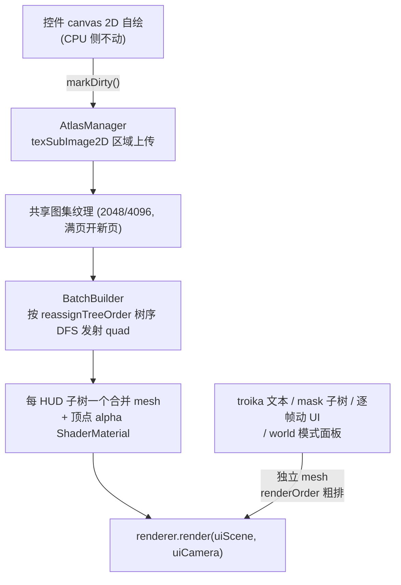

# UI 合批优化方案（UI Canvas Batching：Unity UGUI 式图集合批）

> **一句话定位**：把「每控件一张 CanvasTexture + 一个 mesh = 一次 draw call」的 UI 渲染通路，改造为 Unity UGUI 同款的「共享图集 + 按树序合并 mesh + 顶点 alpha」批渲染通路——CPU 侧 canvas 自绘与射线命中体系完全不动，UI draw call 从 O(可见控件数) 降到 O(批数)。
> **什么时候会用到你**：实施本方案各阶段时；评估「UI 多了掉帧要不要合批」时；合批落地后排查渲染回归（层级错乱/裁剪失效/透明度不对）时。
> **代码位置**：改造主体 [CanvasUIComponent.ts](../../src/engine/rendering/CanvasUIComponent.ts)；关联 [UIManager.ts](../../src/engine/ui/UIManager.ts)、[UIMaskComponent.ts](../../src/engine/ui/UIMaskComponent.ts)、[TweenSystem.ts](../../src/engine/ui/TweenSystem.ts)、[UITextComponent.ts](../../src/engine/ui/UITextComponent.ts)

**状态**：方案落盘待实施（2026-09-18）。未写任何实现代码；§7 P0 实测为开工前置门槛。

**既有事实澄清**：warm 项目 2026-09-16 的「月球全息卡死」实测根因就是本方案要解决的问题——UI draw call 过多（18 widget 常驻 3403 mesh / 2665 draw call → 20fps），而非当时误诊的「渲染帧饥饿」。当天已落地第一道防线（二级面板整树失活，空闲可见 mesh 352→117，见 `tests/uiPanelDeactivate.test.ts`），但**可见的那 100+ mesh 仍是一控件一 draw call**，这是本方案的剩余收益空间。

---

## 1. 先记住这几个文件

| 文件 | 一句话职责 | 你要改它的场景 |
|---|---|---|
| [CanvasUIComponent.ts](../../src/engine/rendering/CanvasUIComponent.ts) | UI 渲染根组件：离屏 canvas → CanvasTexture → plane mesh，每控件独立纹理/材质/mesh | **改造主体**：GPU 通路图集化 + 进批/出批 |
| [UIManager.ts](../../src/engine/ui/UIManager.ts) | `reassignTreeOrder`（UIManager.ts:615）按大纲树序写 zOrder——**批发射顺序的权威来源** | 批构建器挂钩重建触发、树序变化通知 |
| [UIMaskComponent.ts](../../src/engine/ui/UIMaskComponent.ts) | 裁剪：GL scissor（onBeforeRender 逐对象设/恢复）+ SDF 圆角 shader 注入 | 决定「mask 子树必须独立成批」的批边界规则 |
| [TweenSystem.ts](../../src/engine/ui/TweenSystem.ts) | `fade`（TweenSystem.ts:318）遍历子树逐组件改 `opacity`（材质 uniform） | 透明度通路迁移到顶点属性时同步改造 |

**关键心智模型**：这套 UI 的层级真相**已经是树序**（`reassignTreeOrder` 从大纲树序生成 zOrder），Unity UGUI 的核心契约「Hierarchy 顺序 = 绘制顺序」在数据层面早已成立——本方案只是把这个真相从「排序键」前推为「几何发射顺序」。改的是渲染通路，不是层级模型。

---

## 2. 现状：为什么一控件一 draw call

每控件独立渲染资源，全在 `CanvasUIComponent` 构造函数里：

```ts
// CanvasUIComponent.ts:144 —— 每组件一张独立纹理
this.texture = new THREE.CanvasTexture(this.canvas)
// CanvasUIComponent.ts:173-174 —— 每组件一套独立几何与材质
const geo = new THREE.PlaneGeometry(1, 1)
const mat = new THREE.MeshBasicMaterial({ /* map: this.texture, transparent: true, ... */ })
```

每帧整场景一次提交（[UICamera.ts:118](../../src/engine/rendering/UICamera.ts)）：

```ts
renderer.clearDepth()
renderer.render(this._scene, this.camera)
```

但 three.js 内部**排序粒度 = mesh**：透明物按 `renderOrder` → 深度逐 mesh 排序后逐个绘制，不同纹理/材质之间必然断批。全仓 `src/` grep `BatchedMesh|InstancedMesh|mergeGeometries` 零命中——引擎没有任何合批设施（three 依赖为 `^0.170.0`，`package.json:34`，其 `BatchedMesh` r159+ 原语可用但未使用）。

层级写入两处（[CanvasUIComponent.ts:270](../../src/engine/rendering/CanvasUIComponent.ts)）：

```ts
set zOrder(v: number) {
  this._zOrder = v
  if (this.hitMesh) this.hitMesh.position.z = v * 0.001
  if (!this.panel) return
  this.panel.renderOrder = this._renderOrderBias + v
  // z 偏移分层：zOrder 每 +1 对应 0.001 世界单位前移（正交相机下无透视变形）
  this.panel.position.z = v * 0.001
}
```

树序权威（[UIManager.ts:615](../../src/engine/ui/UIManager.ts)）：

```ts
reassignTreeOrder(): void {
  let order = 0
  const walk = (a: Actor, base: number): void => {
    // 特殊层 HUD（GM 控制台等）：子树整体抬升其层基准（子树内相对顺序不变）
    const nodeBase = a instanceof HUD && a.layerBaseZ > 0 ? a.layerBaseZ : base
    // 同节点多个 canvas 组件（UIText/UIImage/UIMarker）共享同一层级，
    // 靠各自 position.z 微偏移（UIText +0.0002）区分渲染前后
    for (const comp of a.getComponents(CanvasUIComponent)) {
      comp.zOrder = nodeBase + order
    }
    order += 1
    for (const child of a.getChildren()) walk(child, nodeBase)
  }
  for (const a of this._uiActors) {
    if (a.parent) continue
    walk(a, 0)
  }
}
```

> 这段是本方案的基石：**发射顺序不需要新发明**——`walk` 的 DFS 遍历序就是合批后 quad 的写入顺序，`layerBaseZ` 的子树抬升对应批级 `renderOrder`，语义与 Unity 的 Canvas `sortingOrder` 同构。

---

## 3. 核心约束：合批后「z 排序」失效的原理

**现在为什么行**：N 个 mesh = N 个排序键，three 每帧给每个面板单独排名次，层级是渲染时动态算的。

**合批后为什么不行**：N 个 quad 合进一个 mesh = 一次 draw call = 一个排序键，three 对批内 quad 的先后**完全不可见**。批内定序只剩两条硬件通路：

1. **z-buffer**：要求 depthTest + depthWrite 全开。但 UI 是 alpha 混合——混合不满足交换律（红盖蓝 ≠ 蓝盖红），z-buffer 只管深浅不管混合顺序，叠色必错；半透明像素写深度还会挡出硬边光晕。所以 UI 必须关 depthWrite，**深度通路已废弃是有代码定论的**（[CanvasUIComponent.ts:470](../../src/engine/rendering/CanvasUIComponent.ts) 注释：「内部前后定序完全交给 renderOrder——zOrder×0.001 的 z 偏移经根缩放后低于透视相机深度量化精度，同层元素会 z-fighting 闪烁，深度通路就此废弃」，落点 `enableWorldRendering` 的 `depthWrite = false`，:481）。
2. **绘制顺序（painter 算法）**：单次 draw call 内 GPU 按索引缓冲顺序光栅化——批内层级 = 构建几何时 quad 的发射顺序，构建期定死。

**UE / Unity 的既有答案**（殊途同归：层级权威从「空间 z」换成「声明顺序」，z-buffer 留给 3D）：

| 引擎 | 层级权威 | 合批策略 | 顺序变更的代价 |
|---|---|---|---|
| UE（UMG/Slate） | widget 树 paint 序（每帧重算，立即模式） | 保守：只合并「同 layer + 同材质 + 绘制序相邻连续」的 run，顺序有歧义就拆 draw call | 无（每帧重发射） |
| Unity（UGUI） | Hierarchy 兄弟序（DFS），Rect z 明确不参与 | 激进：Canvas 内同图集同材质合一个 mesh，quad 按遍历序写入顶点缓冲 | Canvas rebuild（整批重算顶点）→ 拆子 Canvas 控制 rebuild 范围 |

本方案取 Unity 的契约 + UE 的保守边界：**按树序发射（Unity），mask/动态控件处拆批（UE）**。

---

## 4. 可行性前提：引擎已具备的四块地基

1. **树序真相已存在**：`reassignTreeOrder`（§2）——Unity 契约的数据层已成立。
2. **内容重绘是按需的**：`markDirty()`（CanvasUIComponent.ts:460，`texture.needsUpdate = true`）——合批后语义平移为「图集区域局部上传」，**不触发网格重建**，最高频操作反而更便宜。
3. **元素全是标准 quad**：1×1 平面靠 scale（`setWorldSize` 只改 scale），几何高度统一，天然适合合并/实例化。
4. **渲染与命中解耦**：命中走 `ClickableComponent` + `PhySys` 射线（候选集合 + zOrder 仲裁），与渲染 mesh 无关——rebatch 不影响点击，`SAME_PLANE_EPS` 射线同面判定也不依赖渲染 z 的存废。

---

## 5. 目标方案：四步改造



### 5.1 纹理图集化（AtlasManager）

- GPU 侧从「每控件一张 CanvasTexture」改为共享图集：控件 canvas 照常 2D 自绘，`markDirty()` 改为「canvas → `texSubImage2D` 上传到图集区域」，quad UV 指向区域角点。
- 区域分配/回收（控件销毁还区域）、尺寸档位 2048/4096、满页开新页 = 新增一个批。
- **收益核心**：内容重绘从「不动」变「只传一小块」，且永不触发网格重建。

### 5.2 批构建器（BatchBuilder = Unity 的 Canvas）

- **批单位 = HUD 子树**（对应 Unity 拆子 Canvas 控制 rebuild 范围；`layerBaseZ` 特殊层天然是独立批基准）。
- 按 `reassignTreeOrder` 同款树序 DFS 发射 quad，层级即发射顺序。
- **重建触发器清单**（改造中逐条挂钩，缺一条就是渲染回归）：

| 变更 | 现状动作 | 合批后动作 | 是否重建批 |
|---|---|---|---|
| 内容重绘 `markDirty()` | 纹理重传 | 图集区域上传 | **否** |
| 透明度补间 `fade` | `material.opacity` | 顶点 alpha 局部写 4 顶点 | **否** |
| 尺寸 `setWorldSize` | 改 scale | quad 顶点重排 | 是（所在子树批） |
| 树序变化 `reassignTreeOrder` | 写 renderOrder/z | 重新发射 | 是 |
| 显隐 `active` 级联 | `visible` 整树 | quad 剔除/恢复 | 是（或退化 quad） |
| 增删控件 | spawn/destroy | quad 增删 + 图集区域分配/回收 | 是 |
| 逐帧位置（screen 锚定） | 每帧投影写位 | **排除在批外**（§5.4） | — |

### 5.3 顶点 alpha ShaderMaterial

现在 `opacity` 是 per-material uniform，`fade` 逐组件驱动（[TweenSystem.ts:318](../../src/engine/ui/TweenSystem.ts)：`walk` 收集子树全部 `CanvasUIComponent`，跳过 `isMarkerOnly`/`isClickOnly`，逐组件 `fromTo(comp, {opacity}, {opacity})`）。合批后一个批一个材质，per-quad 透明度下沉为**顶点属性**（顶点色 alpha，Unity UGUI 同款）。改动面：新 ShaderMaterial 替换 MeshBasicMaterial；fade 改为局部写目标 quad 的 4 个顶点 + 局部 bufferUpdate；`UIMaskComponent` 的圆角 SDF 注入（UIMaskComponent.ts:267-268，往材质插 `sdUIRoundBox(...) > 0.0 → discard`）移植进新 shader。

### 5.4 排除清单（不进批，保持独立 mesh + renderOrder 粗排）

| 排除项 | 原因 | 依据 |
|---|---|---|
| troika 文本 mesh | 矢量轮廓三角化 + 自带 font atlas，物理上合不进图集批 | [UITextComponent.ts:193](../../src/engine/ui/UITextComponent.ts) `new TroikaText()`，zOrder 覆写已带 `+0.5/+0.0002` 微调（:310-317），本身即 renderOrder 语义 |
| UIMask 子树 | 裁剪是 **GL scissor per-drawcall 状态**（onBeforeRender 设/恢复，UIMaskComponent.ts:67-70、:184），一次 draw call 中途无法切 scissor | Unity 用 stencil 同样在 mask 边界拆批，结论一致 |
| 逐帧动位置的 UI | `UIWorldAnchorComponent` screen 模式每帧投影写位，进批 = 每帧 rebuild（Unity 经典陷阱） | 血条/名牌/伤害数字保持独立 |
| world 模式面板 | 进主场景 + 透视深度语义（mipmap/depthWrite 适配已特化，CanvasUIComponent.ts:474-483） | 保持独立 |
| 命中层（`isClickOnly`/marker hitMesh） | `colorWrite:false` 纯命中体，无视觉输出，进批无收益 | PreviewManager 过滤逻辑不动 |

---

## 6. 备选方案对比

| 方案 | 改造量 | draw call 收益 | 局限 |
|---|---|---|---|
| 不做（维持现状 + 整树失活） | 0 | 已从 2665 压到 ~117（warm 实测） | 可见面板继续增多则回升 |
| 静态子树烘焙（合并画进父 canvas） | 小 | 中（粒度=烘焙组） | 丢控件级重绘粒度，子树内任一变化全组重画 |
| **Unity 式图集合批（本方案）** | 中大 | 高（批粒度=HUD 子树） | 图集管理 + shader + 重建触发器，千行级 |
| BatchedMesh 变体（r159+） | 中 | 高，且把「整批重建」升级为「逐 quad 增删/移位」 | instanceColor 无 alpha 通道，透明度需着色器 workaround |

P1 落地后若 rebuild 实测成为瓶颈（动态增删频繁的场景），P3 再评估 BatchedMesh 变体。

---

## 7. 实施阶段与验收

| 阶段 | 内容 | 验收标准 |
|---|---|---|
| **P0 实测（开工前置）** | 性能分析器采集 `renderer.info.render.calls` / triangles，采集 warm 空闲 HUD、全息面板打开两组基线（工具方案见 [性能分析器](./perf_profiler_plan.md)，落地前可临时用 CDP 直读 `renderer.info`） | 拿到 before 数据；draw call 收益模型有实测锚点 |
| **P1 图集 + 静态 HUD 子树合批** | AtlasManager + BatchBuilder + ShaderMaterial（静态透明度=1 路径） | warm 空闲 UI draw call 显著下降（对照 P0）；渲染像素对照；层级/显隐/点击/缩放全分支 e2e 绿 |
| **P2 顶点 alpha + fade 迁移** | 顶点 alpha 属性 + TweenSystem.fade 改顶点通路 + mask SDF 注入移植 | fade 全链路 e2e（淡入/中断/kill）绿；mask 嵌套裁剪像素对照 |
| **P3（按需）** | BatchedMesh 变体消 rebuild | 以 P1 后 profile 数据决定是否启动 |

**验证注意**：改引擎 TS 后 Stop→Launch 重开游戏再验证（vite 动态 import 有模块缓存，热路径可能仍跑旧代码，断言前先确认新代码已生效）；断言一律用数值（draw call/fps/mesh 数），不用像素肉眼判。

---

## 8. 风险与回归点

1. **mask 嵌套裁剪**：scissor 交集逻辑（UIMaskComponent.ts:9-10「嵌套 mask = 链上矩形求交」）依赖每 draw call 状态，批边界必须含 mask 子树整棵——漏一条就是「裁剪失效/裁错批」。
2. **层级错乱**：同节点多 canvas 组件靠 z 微偏移区分（UIManager.ts:620-621 注释），合批后该语义迁移为「发射顺序 + 批级 renderOrder」，troika `+0.5` 偏移的相对关系要保真。
3. **fade 与显隐竞态**：`fade` 跳过 `isClickOnly` 的语义（TweenSystem.ts:322）在顶点 alpha 通路下必须保留，否则透明点击层会被补间可见。
4. **world/alwaysOnTop**：`setAlwaysOnTop` 的 depthTest 开关 + renderOrder 基准偏移（CanvasUIComponent.ts:492-498）作用于独立 mesh，排除清单外的面板不受影响，但要防误迁移。
5. **图集溢出/碎片**：区域回收后碎片化，需分配策略（首次适应 + 页扩容）；溢出表现是「突然多一批」而非报错，P0 基线要能区分。
6. **纯运行时改造**：不新增资产字段、不改 widget 编译产物——assetLint 与三 PreviewManager 的过滤逻辑零改动；「组件优先、非必要不改 owner 类」以 CanvasUIComponent 子类为落点。

---

## 9. 边界条件

| 条件 | 行为 | 应对 |
|---|---|---|
| 控件 canvas 尺寸 > 图集页 | 无法分配区域 | 该控件降级为独立纹理 mesh（走排除清单路径） |
| HUD 子树全 markerOnly（无视觉 quad） | 批为空 | 不创建批 mesh，不进 draw 路径 |
| 批内控件 opacity=0（fade 中间态） | 顶点 alpha=0，仍占 draw call | 可接受；连续为 0 时由上层 `bActive` 整树失活兜底（既有机制） |
| 控件在 mask 内且跨批引用 | mask 只作用于本批 | mask 子树整棵独立成批，不允许跨批挂靠 |
| 图集区域上传与批重建同帧 | 先传纹理后重建，均幂等 | 挂同一 dirty 队列按序消费 |
| WebGL 上下文丢失 | 图集纹理与批几何全部失效 | 复用 `restoreAllTextures()` 恢复路径并重建全部批 |

---

## 10. 相关文档

- [CanvasUIComponent：把 UI 贴进 3D 世界](../engine/ui_canvas_component.md) —— 现状渲染链路/命中/踩坑的权威描述
- [世界 UI 系统](../engine/ui_system.md) —— UIManager/HUD/树序分配
- [UI 布局与容器](../engine/ui_layout_components.md) —— UIMask 裁剪
- [渲染系统](../engine/rendering_system.md) —— 双层场景叠加渲染
