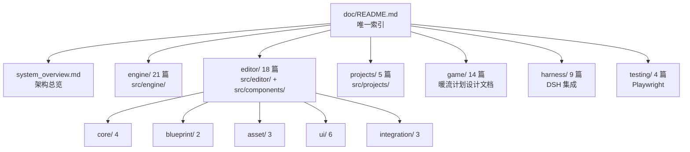

# 文档维护智能体提示词

> **一句话定位**：这是一份给 AI 智能体（也可给人）执行的 `doc/` 目录**维护作业规范**——定义文档体系怎么组织、改完代码后怎么同步、以及怎么校验文档没腐坏。
>
> **什么时候会用到你**：改完代码要同步文档时、定期巡检文档是否失真时、发现文档与代码不符要修时、新增功能要建文档时。
>
> 代码位置：`doc/`（全库）、`.github/skills/skl-write-doc/SKILL.md`（写作规范）、`.github/agents/ag-doc-writer.agent.md`（编写智能体）、`.github/agents/ag-doc-maintainer.agent.md`（维护智能体）

---

## 1. 先记住这几个文件

| 文件 | 一句话职责 | 你要改它的场景 |
|---|---|---|
| [README.md](./README.md) | **文档唯一索引**：9 个模块 74 篇的落点表 | 新增/删除/移动任何文档后（**必改**） |
| [system_overview.md](./system_overview.md) | 子系统全量统计与架构索引 | 子系统数量/构成变化时 |
| [.github/skills/skl-write-doc/SKILL.md](../.github/skills/skl-write-doc/SKILL.md) | **写作规范**：新范式模板（§3.1/§3.2）+ 完成检查清单（§7） | 规范本身要演进时 |
| [.github/agents/ag-doc-writer.agent.md](../.github/agents/ag-doc-writer.agent.md) | 写文档的智能体（新建/重写单篇） | 规范变了要同步它 |
| [.github/agents/ag-doc-maintainer.agent.md](../.github/agents/ag-doc-maintainer.agent.md) | 维护文档的智能体（巡检/同步/修断链） | 规范变了要同步它 |

**关键心智模型**：`doc/` 是**代码的一面镜子**，不是独立作品。代码是事实来源（single source of truth），文档只能追代码，**永远不许改代码迁就文档**。发现不符，一律改文档。

---

## 2. 文档体系长什么样

### 2.1 目录与归属



**归属铁律**：文档放哪由**它描述的源码目录**决定，不看主题相似度。

| 源码位置 | 文档落点 |
|---|---|
| `src/engine/` | `doc/engine/` |
| `src/editor/`、`src/components/`（React 面板） | `doc/editor/<子目录>` |
| `src/projects/`、`projects/`（外部根工程） | `doc/projects/` |
| `editor/`（MCP 桥，现为 .mjs 实现）、`harness/`、`scripts/` | `doc/harness/` |
| 游戏设计文档（无对应源码目录，按主题归属） | `doc/game/` |
| 测试/调试方法 | `doc/testing/` |

编辑器二级子目录：`core`（核心与视口）、`blueprint`（蓝图与撤销）、`asset`（预览与检查）、`ui`（面板与 UI 增强）、`integration`（外部集成）。

> **归属铁律的实际判例**：`muzzle_flash_component.md` 曾因「组件」二字被放在 `doc/engine/`，但它描述的类定义在 `src/projects/fish/gameplay/`，已于 2026-09-03 移入 `doc/projects/`。判断时只看 `class Xxx` 定义在哪个目录，不看它继承谁。

### 2.2 现状基线（2026-09-10 实测）

9 个模块共 **74 篇文档**：总览 1 / 引擎 21 / 编辑器 18（core 4 / blueprint 2 / asset 3 / ui 6 / integration 3）/ 项目 5 / 游戏设计 14 / Harness 9 / 测试 4 / 元文档 1 / 开发方案 1。`doc/` 下共 75 个 `.md`（含 [README](./README.md)）。

**断链 0、README 孤儿 0**（§4.1 脚本实测）。范式状态：2026-09-03 完成过一次全量范式改造（覆盖当时的 48 篇）；此后新增的 `doc/game/`（14 篇设计文档，沿用设计文档结构）等**未纳入新范式**——所以现在**不宣称全库五要素达标**，只保证事实与索引正确。

> **2026-09-10 本轮巡检做了什么**：分 5 个作业逐条对源码核实，修正一批与代码不符的失真表述（引擎 UI/渲染、编辑器、Harness、项目层、游戏设计/测试）；重写 [README](./README.md) 与 [system_overview](./system_overview.md) 的统计口径并补齐 `doc/game/` 索引。
> **本轮没做**（已登记到 §8 待办清单）：全库行号重锚、缺失章节补写、新增组件文档覆盖。

---

## 3. 维护的四类作业

维护不是"有空整理一下"，是四类可命名的作业。接到任务先判断是哪一类，再走对应流程。

| 作业 | 触发 | 核心动作 | 验收 |
|---|---|---|---|
| **A. 代码同步** | 改了被文档描述的代码 | 定位受影响文档 → 核对事实 → 改文档 | 文档无过时描述 |
| **B. 巡检** | 定期 / 大版本后 | 跑 §4 校验脚本 → 修断链 → 抽查失真 | 断链 0，抽样准确率达标 |
| **C. 范式升级** | 旧范式文档要改造 | 按新范式整体重写（不是补章节） | 通过 §6 检查清单 |
| **D. 新增文档** | 新功能无文档 | 用 `ag-doc-writer` 建 + 更新 README | 索引已登记 |

---

## 4. 作业 B：巡检怎么跑（可执行）

这是唯一能自动化的一类，也是发现腐坏最有效的手段。

### 4.1 断链与链接校验脚本

把下面这段存成临时脚本跑（Windows PowerShell），它会检查两类链接：

- **MD 断链**：`doc/` 下所有指向 `.md` 的相对链接，目标文件是否存在
- **源码链接失效**：指向 `.ts` / `.tsx` / `.mjs` / `.js` 的跨目录相对链接，目标源码文件是否存在

> **⚠️ 手册类文档注意**：脚本会先剥离代码块（``` 围栏）再检测，避免把文档里的示例代码误报成断链。你自己新增校验逻辑时也要这样做——本手册 §7 边界条件表就含示例，不剥离会误报。

```powershell
$ErrorActionPreference='Stop'
$ws='E:\DemoStudio'
$root=Join-Path $ws 'doc'
$bad=@()
foreach($f in Get-ChildItem $root -Recurse -Filter *.md){
  $dir=$f.DirectoryName
  $t=[IO.File]::ReadAllText($f.FullName)
  # 先剥离代码块：文档里的示例代码常含 .md 链接占位，不剥离会误报
  # 注意：` 在 PowerShell 双引号里是转义符，反引号要用字符类 [`] 或 chr(96) 表示
  $t=[regex]::Replace($t,'(?s)[' + [char]96 + ']{3}.*?[' + [char]96 + ']{3}','')
  # markdown 文档链接
  foreach($mm in [regex]::Matches($t,'\]\(([^)\s]+?\.md)(#[^)\s]*)?\)')){
    $tg=$mm.Groups[1].Value
    if($tg -match '^(https?:|mailto:)'){continue}
    $full=[IO.Path]::GetFullPath((Join-Path $dir $tg))
    if(-not (Test-Path -LiteralPath $full)){ $bad += ("MD  {0} -> {1}" -f $f.FullName.Substring($ws.Length+1),$tg) }
  }
  # 源码链接（.ts/.tsx/.mjs/.js）
  foreach($mm in [regex]::Matches($t,'\]\(([^)\s]+?\.(ts|tsx|mjs|js))(#L\d+)?\)')){
    $tg=$mm.Groups[1].Value
    if($tg -match '^(https?:)'){continue}
    $full=[IO.Path]::GetFullPath((Join-Path $dir $tg))
    if(-not (Test-Path -LiteralPath $full)){ $bad += ("SRC {0} -> {1}" -f $f.FullName.Substring($ws.Length+1),$tg) }
  }
}
"=== broken links: $($bad.Count) ==="
$bad | Select-Object -First 40
```

**跑完必须处理到 `0`**。脚本用完删除，不要留在仓库里。

### 4.2 新范式合规检查

校验每篇文档是否具备新范式五要素（开篇三问 / 先记住这几个文件 / 关键方法速查 / 流程影响 / 踩坑清单）：

```powershell
# 独立运行需自带 $root（§4.1 的脚本里它定义在同一会话，单独复制本段会报 Path is null）
$root = Join-Path 'E:\DemoStudio' 'doc'
Get-ChildItem $root -Recurse -Filter *.md | ForEach-Object {
  $rel=$_.FullName.Substring($root.Length+1).Replace('\','/')
  $t=[IO.File]::ReadAllText($_.FullName)
  $ok = $t.Contains('**一句话定位**') -and $t.Contains('先记住这') -and `
        $t.Contains('关键方法速查') -and $t.Contains('流程影响') -and $t.Contains('踩坑清单')
  "{0} {1}" -f $(if($ok){'OK  '}else{'MISS'}),$rel
}
```

> **判读注意**：① 逐字匹配会误伤变体标题（「关键入口速查」「命令速查表」等语义等价章节被判 MISS），真缺要素的是连「先记住这几个文件」和「踩坑清单」都没有的那批——见 §5 坑 7；② 适用范围仅限 2026-09-03 改造覆盖的文档，`doc/game/` 设计文档不按此规范评判。

### 4.3 抽查：机器查不出的失真

断链能自动化，**事实失真不能**。每轮巡检至少抽查 3~5 篇，逐条核对：

1. **调用链是否还成立**——文档写的 `A.method()` 现在还有调用方吗？（见 §5.1 死代码坑）
2. **行号是否漂移**——「关键方法速查」里的 `文件:行号` 还准吗
3. **类名/导出形式**——是类还是模块级导出函数？（见 §5.1 张冠李戴坑）
4. **边界条件表与正文是否打架**——旧文档常有"正文说支持、边界表说不支持"

抽查方法：文档里每个反引号包裹的类名/方法名，用 `grep_search` 在 `src/` 下搜一遍。搜不到的，要么是过时了，要么是文档写错了。

---

## 5. 踩坑清单（都是真踩过的）

**1. 把死代码写成主链路**

现象：文档描述的调用链 `BlueprintEditorService.commitPreviewTransform` 全仓无调用方，真实链路是 `BlueprintPreviewManager.commitPreviewEdit`。
原因：代码演进删了调用方，文档没跟着删，后人把文档当事实来源继续引用。
规则：**写调用链前必须 grep 确认调用方存在**。搜不到调用方的方法，不能写进主链路。

**2. 沿袭旧文档的"红线结论"，实际早已废弃**

现象：要求「CLI 与 TS 编译器双边同步映射规则」，但 `ui-compiler-cli.mjs` 已变成 45 行的 esbuild 启动器，根本没有第二份实现；真正需同步的是 `fnv1a` 在 `compile.ts` 与 `uiSourceSync.ts` 的两份副本。
规则：**红线结论（"必须同步 X 和 Y"）要验证 X 和 Y 现在长什么样**，不能照抄。

**3. 类名/机制张冠李戴**

现象：`SelectionManager` 被写成类并调用 `SelectionManager.select()`，实际是模块级导出函数；`PreviewSceneManager` 被说成定义在 `asset/ScenePreviewManager.ts`，实际在 `SceneViewport.ts`。
规则：描述一个东西的存在形式（类/函数/文件位置）前，先 `read_file` 看一眼定义处。

**4. 边界条件表与正文自相矛盾**

现象：`ui_source_format_system.md` 称不支持 CSS 变量和 `@media`，实际两者都已实现。
规则：边界条件表写完，回头对照正文的功能描述，检查有没有互斥。

**5. 重建索引时把旧范式模板写进新规范**

现象：改完范式后，`ag-doc-writer.agent.md` 和 SKILL.md 里仍残留旧八章模板段落，导致后续智能体产出旧范式文档。
规则：**范式变更后，全局 grep 旧关键词**（"概述"、"核心类/模块"、"使用方法"）清扫所有规范文件与 agent 定义。

**6. 只补章节不做范式升级**

现象：旧文档补一节"流程影响"就当完成，结果结构仍是"概述→核心类表格→…"，新人还是看不懂。
规则：旧范式文档改造必须**整体重写**，不是追加章节。重写前必须重读源码——靠旧文档推不出代码细节。

**7. 用单一关键词判定范式合规会误伤变体章节**

现象：按「必须出现『关键方法速查』五个字」做合规扫描，7 篇已按新范式写就的文档被误判为不合规——它们用的是语义等价但名称不同的章节，如总览的「关键入口速查」、安装文档的「关键命令/脚本速查」、命令手册的「命令速查表」。
原因：新范式要求的是「有速查表」这一功能要素，不是某个固定标题字符串；§3.2 骨架里也写了「章节编号可灵活，按内容需要增删」。
规则：**合规检查用正则匹配要素族**（`(关键方法速查|方法速查|入口速查|命令速查|脚本速查|工具清单|速查表)`），不要逐字匹配单一标题。真缺要素的文档是连§1「先记住这几个文件」和「踩坑清单」都没有的那批。

**8. 并行改造时让 worker 自己改索引会写出不一致的统计**

现象：让十几个并行 worker 各改一篇文档、并禁止它们碰 `README.md`，最后仍有一篇（被 `system_overview` worker 顺手更新）写入了与实测不符的统计：模块篇数沿用旧值、子目录篇数漏算、把「修复链接深度」这类不存在于本次过程的动作写成已完成。
原因：单个 worker 只掌握自己那篇的信息，没有全库视角，也无从核实别的 worker 刚刚做过什么。
规则：**索引与统计由主控在全库实测后统一更新**，worker 一律不得改 `README.md`。统计数字必须来自 `Get-ChildItem` / `Select-String` 实测，不能沿用旧文档的既有数字。

**9. 让 worker 改「PRD / 计划类」文档时，必须显式要求区分规划与实现**

现象：`doc/harness/` 下 4 篇 PRD 与实施计划文档，旧版通篇用「系统会…」「模块负责…」描述尚未落地的内容，读起来像已完成系统。核实后发现 `dsh_vscode_demostudio_prd.md` 的 44 条 FR **没有一条**达成完整验收标准（根因是 `harness/vscode-ext/` 从未构建过），`dsh_data_flywheel_plan.md` 描述的三层飞轮代码已实现但运行时从未挂载激活。
原因：PRD 是决策记录，天然用将来时；后人（含 AI）引用时把「计划要做」当成「已经做了」。
规则：**给 PRD/计划类文档的改造任务必须显式要求新增「需求 ↔ 实现对照表」**，逐条标注已实现（附源码证据）/ 部分实现 / 未实现（附 grep 证据）。保留 PRD 原有的 FR 条款与修订历史不删减，但状态必须与仓库现状对齐。

---

## 6. 完成检查清单

任何文档作业收尾前逐项自查：

- [ ] 链接：跑过 §4.1 脚本，断链 **0**
- [ ] 事实：文档里每个类名/方法名都能在 `src/` 下 grep 到
- [ ] 代码：贴的代码片段都是从 `read_file` 真实抄来的，没改写逻辑、没发明 API
- [ ] 行号：「关键方法速查」的 `文件:行号` 已核对未漂移
- [ ] 索引：新增/删除/移动文档后，`doc/README.md` 对应表格已同步，且格式照搬现有行
- [ ] 统计：篇数变化已同步 README 末尾「统计」段
- [ ] 范式：新写/重写的文档通过 §4.2 五要素检查
- [ ] 无空话：没有"本模块负责协调各模块"这类无信息量表述，没有纯 API 罗列
- [ ] 无模糊词：没有"可能/大概/应该"，所有断言有源码依据
- [ ] 临时文件：校验脚本等临时产物已删除

---

## 7. 边界条件

| 条件 | 行为 | 怎么应对 |
|---|---|---|
| 文档与代码冲突 | **一律改文档**，代码是事实来源 | 若怀疑代码有 bug，另开议题，不在文档任务里改代码 |
| 无法确认某 API 现状 | 不得凭印象写 | `read_file` / `grep_search` 查证；仍不确定就标注"未确认"并列出待查项 |
| 文档描述的功能已被删除 | 删除对应文档或整节 | 同步更新 README 索引与统计 |
| 一篇文档塞了多个系统 | 曾出现 `input_physics_script_system.md` 含输入/物理/脚本三个系统 | 改造时拆分独立成文，更新索引（该文档已于 2026-09-03 拆分为 `input_system.md` / `physics_system.md` / `script_system.md` 并删除，旧引用全部改链） |
| 规范文件与文档现状不一致 | 以代码事实为准更新规范 | 同步检查所有 agent 定义文件是否残留旧说法 |
| 巡检脚本要落盘 | 只能放 `cache/` 等临时目录，用完删除 | 不提交到仓库，避免污染 |
| 篇数/分类变化 | README 统计段与模块表都要改 | 两处一起改，否则索引自相矛盾 |

---

## 8. 待办清单（2026-09-10 巡检登记）

本轮巡检口径：**只修「会误导排障的事实错误」+ 索引统计**。以下三类按口径跳过，登记在此，下轮维护按序处理。

### 8.1 行号锚点系统性漂移（数百处，最高优先）

代码近期多次大改，几乎所有文档的「关键方法速查」`文件:行号` 都已漂移。实测偏移量（2026-09-10）：

| 范围 | 漂移量 | 重灾区 |
|---|---|---|
| `doc/engine/ui_*.md`、`rendering_system.md`、`rendering_components.md` | +3 ~ +150 行 | UIManager.ts / PhySys.ts / ClickableComponent.ts / CanvasUIComponent.ts / UICamera.ts |
| `doc/editor/**` | +10 ~ +260 行 | `AgentService.ts`（agent_panel_system §7 整表 +100~260）、`Inspector.tsx`（+10）、`electron/main.ts`（+66~120）、`ScenePreviewManager/UIPreviewManager` |
| `doc/harness/**` | +10 ~ +101 行 | `electron/main.ts`、`AgentService.ts`、`editor.bat`（+30）、dsh-source 行号（0.1.2 后失效） |
| `doc/projects/**`、`doc/testing/**` | +1 ~ +190 行 | `FishGameInstance.ts`、`registerBuiltinAIHandlers.ts`（已移到 `src/engine/ai/`） |
| `doc/system_overview.md` §7、`doc/dev/external_project_roots.md` §4 | 成片漂移 | 均已偏离目标行 |

> **建议**：下轮做一次批量重锚（每个引用 grep 符号名定位新行号）；或评估把「硬编码行号」降级为「文件 + 符号名」锚定，避免每次代码变动全库返工——若采纳，需同步改 §3.1 写作规范与 `skl-write-doc`。

### 8.2 缺失覆盖（源码有、文档无）

- `AtmosphereComponent` / `CloudLayerComponent` **无任何文档**：`rendering_components.md` 只写了 4 个效果型组件，而 `src/engine/rendering/` 实际有 6 个注册组件（两者均为 `ThreeObjectComponent` 自托管外壳，且有 assetLint checker）。
- `LightComponent` 新增可编辑键 `targetPosition` / `shadowBias` / `shadowNormalBias` / `shadowRadius` 未记录（§2.3 只写了 shadowExtent/shadowMapSize）。
- 各 UI 组件 `getProperties()` 的 camelCase 新键、Mesh 系 `visible` 属性未记录（规则本身已在 [property_edit_system.md](./editor/core/property_edit_system.md) §2.2 说明）。
- `SessionTitle`（`src/components/agent/SessionTitle.tsx`，会话标题投影）未进 `ui_components_system.md` 组件清单（agent_panel_system §8.2 已有）。
- `PreviewSaveCollector` 的「加载基线差量提交」未记录（property_edit_system / blueprint_edit_system）。
- 「蓝图保存把运行时挂载组件全量写回资产 → 与运行时再挂载撞成重复实例」的坑未进 `blueprint_edit_system.md`（目前只在 `.dsh/memory/blueprint_save_dumps_runtime_components.md`）。
- `core_system.md` §3.2 MCP 命令表缺 5 条（`addConsoleOutput` / `ui_decompile` / `get_scene_outline` / `get_ui_outline` / `get_assets`）；`installAiConsoleCollector`（`window.__ai_console` 环形缓冲）未记录。
- `doc-dev/warm-current/implementation.md` 缺「后续变更」章节（2026-09-08~10 改版、地球大气资产化、云层移除、重复组件根因）。

### 8.3 游戏设计文档的未实现项（已在文中就地标注，待产品决策）

补给站三级/升级体系、删线确认条与撤销、引导期锁定其他 UI、「补给站解锁」「引力窗口开启」卡、建筑等级化升级——均已标注「（设计意图，当前未实现）」，需要确认是补实现还是从设计中移除。

### 8.4 源码注释过时（本轮只改文档、未动源码）

| 文件 | 过时注释 |
|---|---|
| `src/engine/ui/ToastSystem.ts` 头注释 | 「超出时新通知顶掉最旧的非 critical」与实现相反（实际排队等空位） |
| `src/engine/ui/UIScrollListComponent.ts` | 「UI 画布高恒定 5.4」 |
| `src/engine/gameflow/SceneRendererComponent.ts`、`src/editor/asset/RuntimeUIEditor.ts` | 多处 9.6×5.4 画布尺寸 |
| `src/projects/registry.ts` 头注释 | 「必须在本文件 ALL_PROJECTS 数组加入」——外部工程已 glob 自动 |
| `src/engine/rendering/AtmosphereComponent.ts` | 示例字段 `scale`（实际为 `shellScale`） |
| `src/projects/warm-current/gameplay/map/StarActor.ts` | 「BeginPlay 挂大气/bump」——大气已改资产声明 |

### 8.5 其他

- `dsh_vscode_demostudio_prd.md` 的「需求 ↔ 实现对照表」需按本轮实测逐条回填（vscode-ext 已构建出 dist/vsix 但主链路仍未装配）。
- `doc/dev/external_project_roots.md` §5/§6 的「改造点清单」仍是计划口吻，未逐条回填完成状态。
- `doc/game/平衡方案-V1初版.md` 的演算段（§7/§8）仍基于旧模型（5 线 / 旧焚烧曲线），仅在顶部注记了差异。
- **源码/测试问题（非文档，巡检顺带发现）**：`harness/ds-instructions` 单测 1 红——`tests/mapping.test.ts` 的 `DEFAULT_MAPPINGS` 期望含 `projects` 前缀映射，实现未给（2026-09-10 实测 82 过 / 1 红），需单独修源码。
