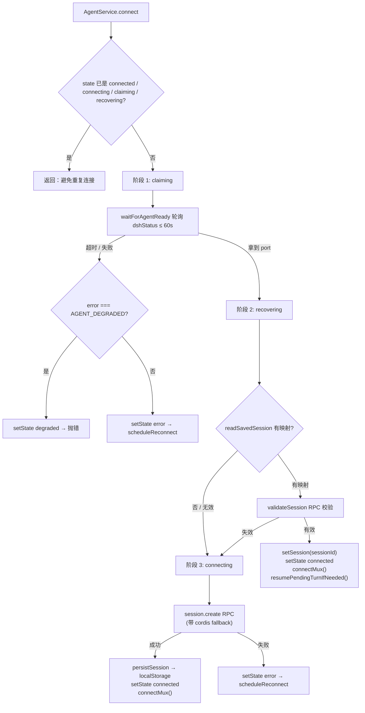
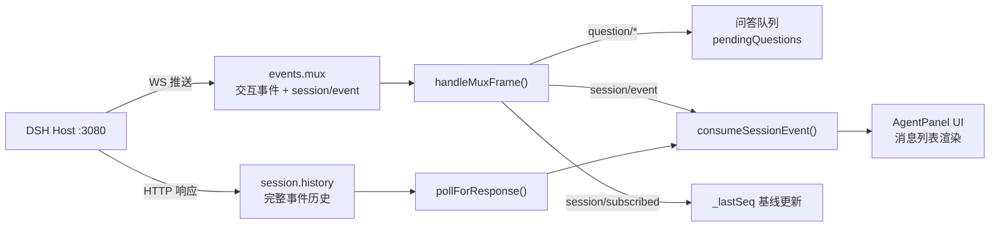
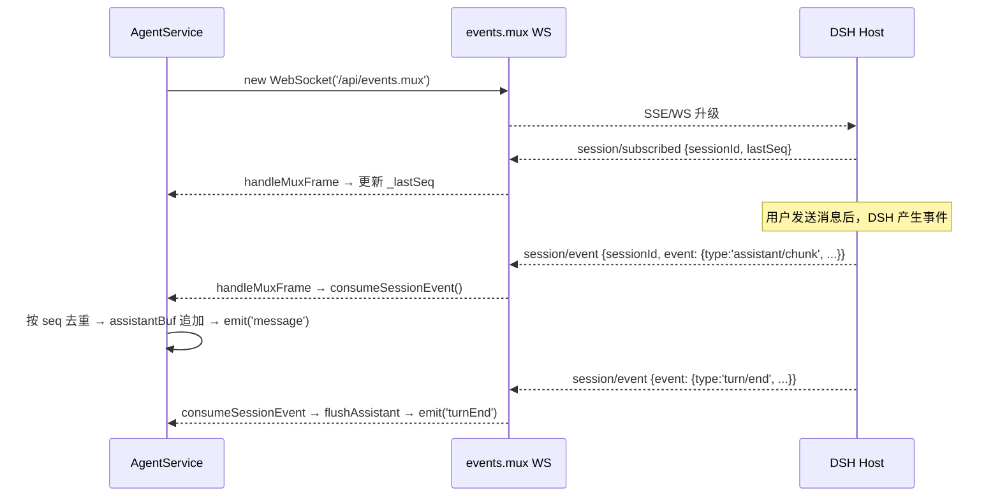
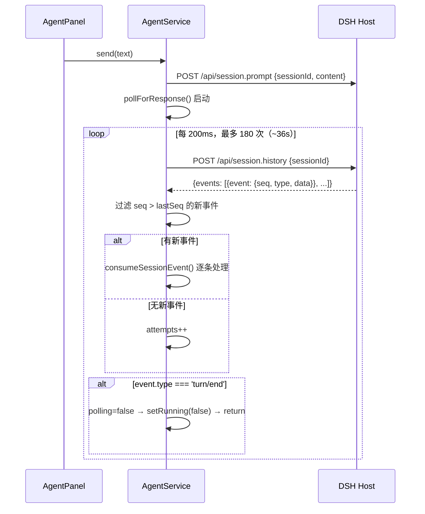
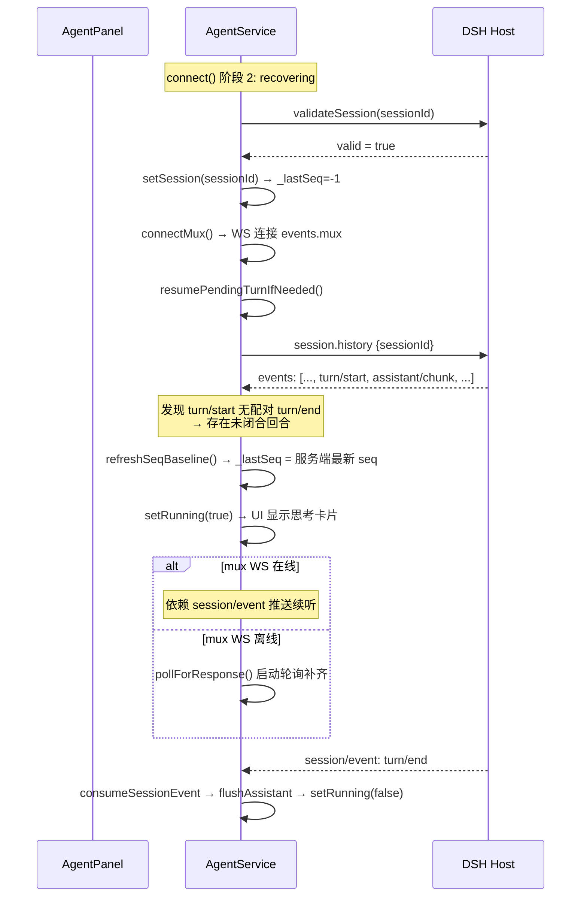
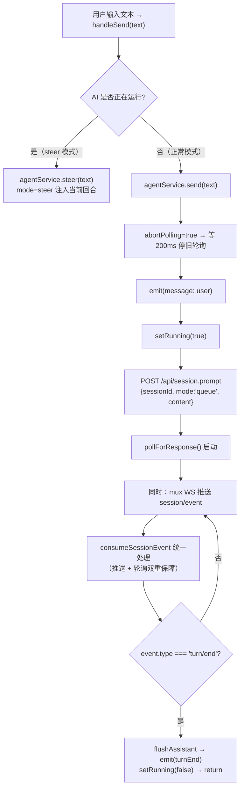

# Agent 面板与事件流系统（Agent Panel & Event Streaming）

> 编辑器侧的 DSH Agent 通信层：连接状态机、双通道事件流（mux WS + history 轮询）、会话恢复与断档续听。
> 代码位置：`src/editor/AgentService.ts`（通信服务）、`src/components/AgentPanel.tsx`（UI 面板）、`src/components/agent/SessionSidebar.tsx`（会话侧边栏）
> 相关文档：[`harness/dsh_engine_integration.md`](../harness/dsh_engine_integration.md)（agent 常驻化架构）、[`harness/harness_system.md`](../harness/harness_system.md)（Harness 工程总览）

---

## 1. 概述

Agent 面板是 DemoStudio 编辑器与 DSH（DeepSeek Harness）内核之间的通信桥梁。DSH 内核以独立进程运行在 `:3080`，提供 LLM 会话管理、工具调用、子代理等能力；Agent 面板负责：

- **连接管理**：三阶段状态机（claiming → recovering → connecting）确保编辑器与 DSH 内核可靠握手
- **双通道事件流**：通过 WebSocket（`events.mux`）接收实时推送事件 + HTTP 轮询（`session.history`）获取 AI 回复内容
- **会话生命周期**：新建 / 切换 / 删除 / 恢复会话，localStorage 持久化映射
- **问答交互**：处理 DSH 的 `question/requested`（权限确认、模型选择等交互请求）

### 职责表

| 角色 | 职责 | 不做 |
|------|------|------|
| `AgentService`（通信层） | 连接状态机、RPC 调用、mux WS 管理、事件消费与分发、轮询补齐 | 不决定 agent 进程生死（由 Electron main 管理） |
| `AgentPanel`（UI 层） | 渲染消息列表、输入框、会话侧边栏、问答卡片、连接状态指示器 | 不直接调用 DSH RPC，所有通信经由 `AgentService` |
| `SessionSidebar` | 会话列表展示、新建 / 切换 / 删除操作 | 不持有连接状态 |
| DSH Host（`:3080`） | 提供 RPC 端点（`session.*`、`agentPreset.*`）、SSE 事件流（`events.mux`、`events.host`） | 不感知编辑器 UI |

### 与相邻功能的边界

| 功能 | 归属文档 |
|------|----------|
| agent 进程引导、所有权、崩溃自愈 | [`harness/dsh_engine_integration.md`](../harness/dsh_engine_integration.md) |
| agent 面板 UI 通信与事件流 | **本文档** |
| DSH 插件系统、preset 创作 | [`harness/harness_system.md`](../harness/harness_system.md) |

---

## 2. 核心类 / 模块

| 类 / 模块 | 说明 |
|-----------|------|
| `AgentService` | 单例通信服务。维护连接状态机、sessionId、mux WS、事件 seq 基线、轮询回路、问答队列。所有 DSH RPC 均经由此类发出。 |
| `AgentPanel` | React 面板组件。消费 `AgentService` 的事件流渲染消息列表，处理用户输入与会话管理 UI。 |
| `SessionSidebar` | 会话列表侧边栏。展示所有会话、支持新建 / 切换 / 删除操作。 |
| `InputBox` | 输入框组件。支持发送消息、停止 AI、模型选择。 |
| `QuestionCard` | 问答卡片。DSH 发起 `question/requested` 时渲染交互式问答 UI。 |
| `ConnectionIndicator` | 连接状态指示器（绿点 / 黄点 / 红点）。显示当前连接状态，支持点击重连。 |

---

## 3. 使用方法

### 3.1 入口与打开方式

```ts
// 方式 1：菜单栏
// Agent → 「打开 Agent」

// 方式 2：快捷键
// Ctrl+Shift+A → dsh-open-agent-window IPC → openAgentWindow()

// Agent 独立窗口加载 ?agentWindow=1 参数
// App.tsx 检测后仅渲染 <AgentPanel />，不初始化引擎
```

### 3.2 AgentService 核心 API

```ts
class AgentService {
  // 连接 / 断开
  async connect(): Promise<void>         // 三阶段连接（claiming→recovering→connecting）
  disconnect(): void                     // 断开连接，清理 WS 与轮询

  // 消息发送
  async send(text: string): Promise<void>       // 发送用户消息（mode=queue）
  async steer(text: string): Promise<void>      // 引导 AI（mode=steer，AI 运行中注入）
  async stop(): Promise<void>                   // 停止当前回合

  // 会话管理
  async createSession(): Promise<string | null> // 新建会话
  async switchSession(id: string): Promise<void>// 切换会话（仅切换本地标记）
  async deleteSession(id: string): Promise<boolean> // 归档会话

  // 问答
  async answerQuestion(rpcId: string, answer: QuestionAnswer): Promise<boolean>

  // 状态查询
  getSessionId(): string | null
  isRunning(): boolean
  isConnected(): boolean
  getState(): ConnectionState

  // 事件订阅
  on(cb: (event: AgentEvent) => void): () => void
  onState(cb: (state: ConnectionState) => void): () => void
}
```

### 3.3 连接状态

| 状态 | 含义 |
|------|------|
| `idle` | 初始状态，未开始连接 |
| `claiming` | 等待 Electron main 完成 agent 引导（探测 / 认领 / spawn） |
| `recovering` | 有 localStorage 映射，正在校验旧会话是否有效 |
| `connecting` | 无映射或映射失效，正在创建新会话 |
| `connected` | 已连接，可正常通信 |
| `error` | 连接失败，等待重试 |
| `degraded` | agent 自愈超限，需手动重启 |

---

## 4. 工作流程

### 4.1 连接流程（三阶段状态机）



### 4.2 双通道事件流架构

DSH 内核运行时持续产生事件。AgentService 通过两个通道接收事件：

| 通道 | 协议 | 承载内容 | 特点 |
|------|------|----------|------|
| **mux WS**（`events.mux`） | WebSocket | `question/requested`、`question/resolved`、**`session/event`**（AI 回复事件）、`session/subscribed`（基线 seq） | 实时推送，连接即订阅 |
| **history 轮询**（`session.history`） | HTTP POST（200ms 间隔） | 完整事件历史（按 seq 增量拉取） | Pull 模式，兜底补齐 |



#### 4.2.1 mux WS 推送通道



#### 4.2.2 history 轮询通道（兜底）



### 4.3 事件消费（consumeSessionEvent）

`consumeSessionEvent()` 是推送与轮询两条通道的**统一分发入口**，按 seq 去重后根据事件类型分发：

| 事件类型 | 处理 |
|----------|------|
| `turn/start` | emit(`turnStart`) |
| `turn/end` | `flushAssistant()` → emit(`turnEnd`) → `setRunning(false)` → 退出轮询 |
| `step/start` | emit(`stepStart`) |
| `step/end` | `flushAssistant()` → emit(`stepEnd`) |
| `assistant/chunk` | `text-delta` 追加到 `assistantBuf`；`reasoning-delta` 追加到 `reasoningBuf` |
| `assistant/message` | 提取 reasoning 部分（如果还没收集到） |
| `tool/call` | 先 `flushAssistant()`，emit(`toolCall`)，记录 `pendingTools` |
| `tool/result` | 从 `pendingTools` 取工具名，emit(`toolResult`) |
| `command/run` | emit(`commandRun`) |
| `command/done` | emit(`commandDone`) |
| `compaction/*` | 压缩相关事件，emit 对应状态 |
| `todo/write` | emit(`todoUpdate`) |
| `request/header` | 记录模型信息（provider/model） |
| `question/requested` | 通过 mux 帧直接处理（不经过 consumeSessionEvent） |

### 4.4 会话恢复与断档续听

编辑器刷新 / 重连时，DSH 内核可能仍在运行（有未完成的 AI 回合）。恢复流程确保不丢失事件：



**关键设计**：`resumePendingTurnIfNeeded()` 在恢复时检查 `session.history` 最后几个事件——如果发现 `turn/start` 但没有配对的 `turn/end`，说明有未完成回合，会自动进入续听模式。

### 4.5 消息发送流程



### 4.6 设计要点

#### 为什么用双通道而非单一方案

- **mux WS 推送**：实时性高，DSH 产生事件后立即到达。但仅在 WS 连接期间有效——断线重连期间的事件会丢失。
- **history 轮询**：可靠性高，基于 seq 增量拉取，不依赖连接稳定性。但有 200ms 延迟且产生 HTTP 请求。
- **双通道互补**：推送保证实时性，轮询保证不丢事件。`consumeSessionEvent()` 的 seq 去重确保两条通道的事件不重复处理。

#### seq 去重机制

所有事件携带单调递增的 `seq` 编号。`_lastSeq` 记录已消费的最大 seq，新到达的事件只有 `seq > _lastSeq` 才会被处理。三条路径共用同一个 `_lastSeq`：

1. mux WS 推送 → `consumeSessionEvent`
2. history 轮询 → `consumeSessionEvent`
3. 心跳轮询 → `consumeSessionEvent`

#### `clearLiveBuffers()` 的作用

在会话切换 / 发送新消息 / 停止 AI 时调用，清空 `assistantBuf` 和 `reasoningBuf`，防止旧会话 / 旧回合的半截文本污染新内容。

---

## 5. 边界条件

| 条件 | 行为 / 后果 | 处理方式 |
|------|-------------|----------|
| DSH 未就绪时调用 `connect()` | `claiming` 阶段超时（≤60s），进入 `error` 或 `degraded` | 自动重连（指数退避，最多 5 次）或提示手动重启 |
| localStorage 会话映射失效 | `recovering` 阶段校验失败 | 自动清除映射，回退到 `connecting` 阶段创建新会话 |
| `session.create` 默认 preset 找不到 | RPC 报错 `agent-preset-not-found` | fallback 到 `cordis` preset 重试 |
| `session.create` cwd 非绝对路径 | DSH 报错 `cwd must be an absolute path` | `resolveWorkspaceCwd()` 优先使用 `electronAPI.getAppInfo().appRoot` |
| mux WS 断线 | 3 秒后自动重连；重连期间事件靠 history 轮询兜底 | `connectMux` 的 `ws.onclose` 触发重连 |
| history 轮询超时（180 次 / ~36s） | `pollForResponse` 退出循环 | 如果 mux WS 的 `session/event` 仍在推送，UI 不受影响 |
| 新建会话后立即发消息 | `createSession` 设置 `sessionId`，但 DSH 侧 session 可能尚未完全就绪 | `send()` 内的 `session.prompt` RPC 会等待 session 就绪 |
| 同时收到推送与轮询的相同事件 | seq 去重保证不重复处理 | `_lastSeq` 单调递增，已被消费的 seq 不会再次触发 |
| `setSession()` 重置 `_lastSeq=-1` | 旧会话的迟到事件不会抑制新会话的事件 | 配合 `pendingTools.clear()` 避免跨会话工具配对混乱 |
| DSH 内核崩溃重启 | mux WS 断开 → 自动重连 → 新连接触发 `session/subscribed` | 重连后 `resumePendingTurnIfNeeded` 检查是否有未完成回合 |

---

## 6. 依赖关系 / 注册机制

### 上游依赖

| 依赖 | 用途 |
|------|------|
| `electronAPI.dshRpc()` / `fetch('/api/*')` | DSH RPC 通信（Electron IPC 或 Vite 代理） |
| `electronAPI.onDshMuxFrame()` / `WebSocket('/api/events.mux')` | mux WS 事件推送 |
| `electronAPI.dshStatus()` / `dshOpenAgentWindow()` | agent 进程状态查询 / 独立窗口 |
| `localStorage['demostudio.dsh.session']` | 会话映射持久化 |

### 下游消费者

| 消费者 | 消费事件 |
|--------|----------|
| `AgentPanel` | `message`、`turnStart`、`turnEnd`、`toolCall`、`toolResult`、`questionRequest`、`questionResolved`、`error`、`ready` |
| `SessionSidebar` | 通过 `agentService.listSessions()` 获取会话列表 |
| `InputBox` | 通过 `agentService.isRunning()` / `getModels()` 控制输入状态 |
