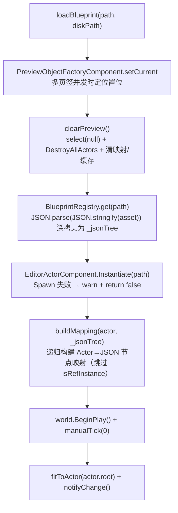
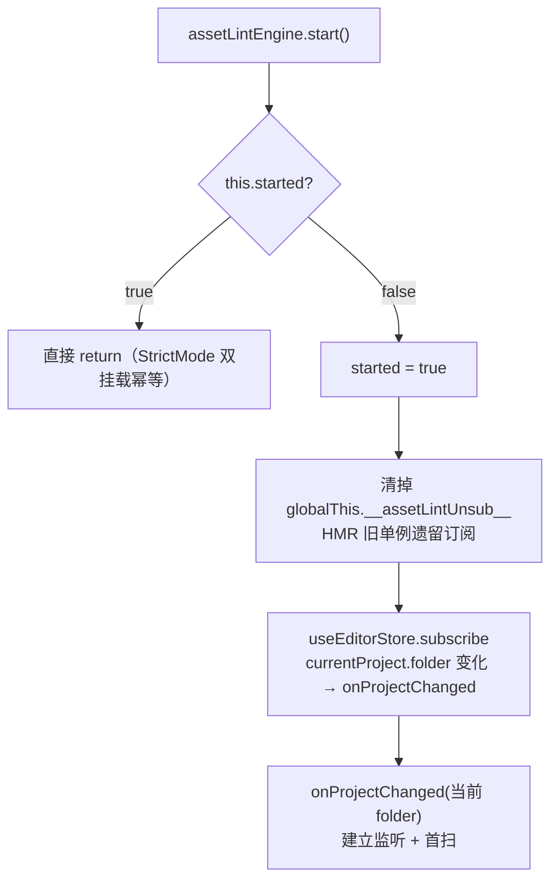

# 资产预览与 assetLint 检查系统（Asset Preview & AssetLint）

> **一句话定位**：编辑器里「把资产 JSON 变成可交互预览」和「把资产 JSON 变成违规列表」这两件事——前者管 `AssetPreviewManager` 及其三个预览管理器（蓝图 / 场景 / UI widget），后者管 `assetLintEngine`（模块级单例，事件驱动）。
>
> **什么时候会用到你**：排查「大纲树不刷新 / 拖拽后撤销按钮不亮 / 场景保存后 Outline 变空 / 资产违规一直不消失」；新增资产类型或组件字段后要同步检查器；给 AI 加资产校验入口。
>
> 代码位置：`src/editor/asset/AssetPreviewManager.ts`、`src/editor/asset/{Blueprint,Scene,UI}PreviewManager.ts`、`src/editor/asset/assetLint/`

---

## 1. 先记住这几个文件

| 文件 | 一句话职责 | 你要改它的场景 |
|---|---|---|
| [AssetPreviewManager.ts](../../../src/editor/asset/AssetPreviewManager.ts) | 路径 → 预览实例的静态注册表（含「活动实例」与「待恢复选中」） | 加一种预览类型；改注册/激活/选中恢复语义 |
| [BlueprintPreviewManager.ts](../../../src/editor/asset/BlueprintPreviewManager.ts) | 蓝图 & widget 之外的 3D 预览：加载、保存数据收集、拖拽提交、undo/redo | 改蓝图预览的加载或回写逻辑 |
| [ScenePreviewManager.ts](../../../src/editor/asset/ScenePreviewManager.ts) | 场景预览：`loadSceneAsset` 构建 Actor↔JSON 映射，结构编辑增删复制重命名 | 改场景预览、大纲节点结构编辑 |
| [AssetLintEngine.ts](../../../src/editor/asset/assetLint/AssetLintEngine.ts) | 资产检查引擎：工程监听 + 去抖 + 内容指纹 + 检查器调度 + 结果发布 | 加检查触发时机；改缓存/发布策略 |

**关键心智模型**：预览和 assetLint **不互相调用**，它们唯一的交汇点是「都盯着同一批 `.scene.json` / `.blueprint.json` / `.widget.json` 文件」。预览改的是内存里的 JSON 深拷贝 + 服务层工作副本，assetLint 读的是磁盘（Electron 环境）——所以预览没保存时，assetLint 完全看不到你的编辑；反过来 assetLint 报违规也绝不会动预览一根手指。

---

## 2. 预览链路：从 `loadBlueprint` 到大纲树刷新

### 2.1 谁调用了它

蓝图页签在 `data` 变化时重建预览（[BlueprintEditor.tsx:147](../../../src/components/BlueprintEditor.tsx)），**加载成功后才注册**，且页签激活时立刻 `activate`：

```ts
const isUi = isWidgetAsset(assetPath)
const mgr = isUi
  ? new UIPreviewManager(previewContainerRef.current)
  : new BlueprintPreviewManager(previewContainerRef.current)
previewMgrRef.current = mgr

const ok = mgr.loadBlueprint(assetKey, assetPath)
if (ok) {
  AssetPreviewManager.register(assetPath, mgr)
  setPreviewReady(true)
  if (isTabActive) {
    mgr.activate(assetPath)
  }
}
```

> **为什么 `activate` 要在这里直接调，而不交给下面的 `[isTabActive, previewReady]` effect**：`previewReady` 的 `false→true` 会被 React 批处理合并掉，状态值可能不变、effect 不触发，新实例的 `_undoKey` 就一直是 `null` → 撤销按钮失效。这是真实踩过的 bug，源码注释写得很清楚。

### 2.2 `loadBlueprint` 内部做的 6 件事



逐段讲代码（[BlueprintPreviewManager.ts:341](../../../src/editor/asset/BlueprintPreviewManager.ts)）：

**① 预览工厂置位 + 清空**

```ts
loadBlueprint(path: string, diskPath?: string): boolean {
  // 本次 spawn 全程使用本管理器的预览工厂（多页签并发时覆盖 current）
  PreviewObjectFactoryComponent.setCurrent(this.previewFactory)
  this.clearPreview()
```

`PreviewObjectFactoryComponent` 是**静态单例**的"当前预览工厂"，多个页签同时存在时会互相覆盖。所以每次 spawn 前必须重新置位，否则页签 A 的 Actor 会被创建到页签 B 的 World 里，表现为"我在 A 里改的东西跑到 B 里去了"。

**② 深拷贝为工作 JSON 树**

```ts
  const asset = BlueprintRegistry.get(path)
  this._jsonTree = asset ? (JSON.parse(JSON.stringify(asset)) as Record<string, unknown>) : null
```

必须深拷贝。注册表里那份是**共享基准**，预览要在上面原地写回 transform（见 §2.4），共用引用会把注册表污染掉，undo 基准也跟着失效。

**③ Spawn 失败直接返回 false**

```ts
  const actor = this.world.getComponent(EditorActorComponent)!.Instantiate(path, undefined)
  if (!actor) {
    logger.warn(`[BlueprintPreview] SpawnActorFromBlueprint("${path}") 失败`)
    return false
  }
```

返回 `false` 时调用方不注册、不 `activate`。所以排查"大纲空白"先看日志里有没有这条 warn。

**④ 构建 Actor → JSON 节点映射**

```ts
  this._actorJsonMap = new Map()
  const buildMapping = (a: Actor, jsonNode: Record<string, unknown>) => {
    this._actorJsonMap!.set(a, jsonNode)
    const childActors = a.getChildren().filter((c) => !c.isRefInstance)
    const jsonChildren = (jsonNode.children as Array<Record<string, unknown>> | undefined) ?? []
    for (let i = 0; i < Math.min(childActors.length, jsonChildren.length); i++) {
      buildMapping(childActors[i], jsonChildren[i])
    }
  }
  buildMapping(actor, this._jsonTree)
```

两个反直觉点：一是**按索引配对**（`Math.min` 取交集）——运行时子节点数可能与 JSON 不一致（代码动态生成的子节点），索引配对保证不会错位；二是**过滤 `isRefInstance`**——ref 引用的子 Actor 属于另一个资产文件，不能就地写回本资产，映射里没有它们，`collectSaveData` 也就自然跳过了。

**⑤ 跑一帧让组件就位**

```ts
  this.world.BeginPlay()
  this.world.manualTick(0)
```

`manualTick(0)` 用 0 时间步跑一帧，只为让 `BeginPlay` 的副作用（组件初始化、布局计算）发生。不等这一帧，后面 `fitToActor` 读到的包围盒是空的。

**⑥ 收尾置位**

```ts
  this._currentBlueprintKey = path
  this._currentBlueprintDiskPath = diskPath ?? null
  this.fitToActor(actor.root)
  this.notifyChange()
```

`_currentBlueprintDiskPath` 是后续所有"回写工作副本"操作的钥匙——没传 `diskPath` 时 `commitPreviewEdit` 会 warn 跳过。

### 2.3 大纲树是怎么刷新的

注册时挂了一个监听（[AssetPreviewManager.ts:26](../../../src/editor/asset/AssetPreviewManager.ts)）：

```ts
static register(path: string, instance: PreviewInstance): void {
  AssetPreviewManager._instances.set(path, instance)
  // 监听预览 World 的 Actor 变化 → 刷新大纲（清树缓存 + 递增 selectionKey）
  watchWorldActorChanges(instance.world, () => instance.invalidateActorTree())
}
```

`watchWorldActorChanges`（[SelectionManager.ts:265](../../../src/editor/SelectionManager.ts)）做两件事：

```ts
export function watchWorldActorChanges(
  world: import('../engine').World | null | undefined,
  invalidate?: () => void,
): void {
  if (!world || _watchedWorlds.has(world)) return
  _watchedWorlds.add(world)
  world.onActorListChanged(() => {
    invalidate?.()
    notifySelectionChange()
  })
}
```

`_watchedWorlds` 是 `WeakSet`（[SelectionManager.ts:227](../../../src/editor/SelectionManager.ts)）——同一 World 只连一次、且不阻止 GC，否则一次 Actor 变化会触发 N 次刷新。`invalidate()` 清 `_actorTreeCache`，`notifySelectionChange()` 递增 `selectionKey` 让 React 重渲染。两者缺一不可：只清缓存不通知，React 不会重读；只通知不清缓存，读到的还是旧树。

三个管理器的 `invalidateActorTree` 都是一行 `this._actorTreeCache = null`（如 [BlueprintPreviewManager.ts:402](../../../src/editor/asset/BlueprintPreviewManager.ts)）。

### 2.4 预览态如何回写工作副本：`collectSaveData`

这是预览链路的核心出口——把运行时 Actor 的实时状态写回 JSON 树（[BlueprintPreviewManager.ts:464](../../../src/editor/asset/BlueprintPreviewManager.ts)）：

```ts
collectSaveData(): Record<string, unknown> | null {
  if (!this._jsonTree || !this._actorJsonMap) return null

  for (const treeNode of this.getActorTree()) {
    const actor = treeNode.actor
    const jsonNode = actor ? this._actorJsonMap.get(actor) : undefined
    if (!actor || !jsonNode) continue
```

先按大纲树遍历（而不是遍历 World 的全部 Actor），这样 ref 实例、代码生成节点自动被 `getActorTree` 的过滤规则挡掉。

**组件属性回写**：

```ts
    const jsonComps = (jsonNode.components as Array<Record<string, any>> | undefined) ?? []
    for (const comp of actor.getAllComponents() as ActorComponent[]) {
      if (!comp.persistType) continue
      // 跳过运行时自动生成的内部组件（如 UIButton 透明点击层 UIImageComponent，isClickOnly=true）：
      // 不写进资产，避免保存后出现重复 image 组件
      if ((comp as unknown as { isClickOnly?: boolean }).isClickOnly) continue
      const target = jsonComps.find((c) => c.baseClass === comp.persistType)
      if (!target) continue
      const props = (target.properties ?? {}) as Record<string, unknown>
      const persist = comp.getPersistentProps()
      // 合入（不删除现有键，避免丢失 JSON 中只读/代码配置的属性）
      for (const [k, v] of Object.entries(persist)) {
        props[k] = v
      }
    }
```

三个约定值得记住：`persistType` 为空的组件不持久化（`UIButton` 的透明点击层就是靠 `isClickOnly` 额外挡掉的，否则保存后资产里会多出一个 `image` 组件，再打开就重复）；回写是**合入不是替换**，JSON 里那些代码配置的只读属性必须保留；`getPersistentProps()` 由组件自己声明要写哪些键。

**transform 回写——组件优先，顶层冗余字段直接删**：

```ts
    const tf = actor.getComponent(TransformComponent)
    if (!tf) {
      jsonNode.position = [actor.position.x, actor.position.y, actor.position.z]
      jsonNode.rotation = [actor.rotation.x, actor.rotation.y, actor.rotation.z]
      jsonNode.scale = [actor.scale.x, actor.scale.y, actor.scale.z]
      continue
    }
    delete jsonNode.position
    delete jsonNode.rotation
    delete jsonNode.scale
    const target = jsonComps.find((c) => c.baseClass === 'TransformComponent' || c.baseClass === 'UITransformComponent')
    if (target) {
      const props = (target.properties ?? {}) as Record<string, unknown>
      props.position = [actor.position.x, actor.position.y, actor.position.z]
      props.rotation = [actor.rotation.x, actor.rotation.y, actor.rotation.z]
      props.scale = [actor.scale.x, actor.scale.y, actor.scale.z]
    }
  }

  return JSON.parse(JSON.stringify(this._jsonTree)) as Record<string, unknown>
}
```

有 transform 组件时**顶层三个字段被 `delete`**——引擎加载时组件是权威，留着冗余字段只会造成"改了组件没生效"的假象。返回前再深拷贝一次，是为了让调用方拿到的快照不被后续原地写回污染（这个"深拷贝分离"在整条链路上反复出现，见 §6 坑 2）。

`UIPreviewManager` 的版本多了一层：全屏 widget 根节点的 `worldWidth/worldHeight` 不写回——尺寸由视口比例驱动，资产里存的是设计基准值，写回会把根画布"固化"成当前视口比例（[UIPreviewManager.ts:1001](../../../src/editor/asset/UIPreviewManager.ts)）。

### 2.5 场景预览保存后为什么必须重新 `activate`

场景保存的完整序列（[ScenePreviewEditor.tsx:264](../../../src/components/ScenePreviewEditor.tsx)）：

```ts
const saveData = mgr.collectSaveData()
if (!saveData) return
// ... 记住摄像机位姿与选中节点
await writeJsonFile(assetPath, saveData)

// 保存后内存/磁盘一致：刷新撤回基准（之后拖拽 push 的动作前快照 = 保存后的状态）
previewMgrRef.current?.markCommitted(saveData)

// 重新加载预览
mgr.loadSceneAsset(saveData as unknown as SceneAsset)

// loadSceneAsset 内部 clearPreview 会清掉 _currentScenePath，
// 必须重新 activate 恢复路径，否则 Outline 判断 currentScenePath==null 返回空树
mgr.activate(assetPath)
```

原因链：`loadSceneAsset` 第一行就是 `this.clearPreview()`，而 `clearPreview` 里有一句 `this._currentScenePath = null`（[ScenePreviewManager.ts:464](../../../src/editor/asset/ScenePreviewManager.ts)）。Outline 拿场景大纲时判的是 `currentScenePath`，它为 `null` 就返回空树。而 `activate` 不只置回路径，还顺带重建 `_undoKey` 与撤回基准：

```ts
activate(assetPath?: string): void {
  if (assetPath) {
    this._currentScenePath = assetPath
    this._undoKey = diskPathToAssetKey(assetPath)
    // 首次激活：建立撤回基准（加载后的未编辑状态）。注意基准必须是独立深拷贝，
    // 不能直接引用 _sceneAsset（collectSaveData 会原地写回污染它）。
    const base = this.collectSaveData()
    if (this._lastCommitted === null && base) {
      this._lastCommitted = JSON.parse(JSON.stringify(base))
    }
    AssetPreviewManager.setActive(assetPath)
  }
  this.notifyChange()
  notifySelectionChange()
}
```

蓝图预览不会踩这个坑，因为它的 `activate` 不持有 `_currentScenePath`——蓝图靠 `AssetPreviewManager.register` 时登记的路径 key 查找实例。

### 2.6 结构编辑提交：为什么要"全量重建预览"

场景的增删/复制/重命名（[ScenePreviewManager.ts:855](../../../src/editor/asset/ScenePreviewManager.ts) 的 `addSceneObject` / `removeSceneObject` / `duplicateSceneObject` / `renameSceneObject`）最终都走 `commitStructuralEdit`：

```ts
private commitStructuralEdit(selectName: string | null): void {
  const key = this._undoKey
  if (!key) {
    logger.warn('[ScenePreview] 结构编辑提交跳过（无撤销 key，activate 未调用）')
    return
  }
  const cur = this.collectSaveData()
  if (!cur) return
  // ... 对比基准 push 撤销点
  // 全量重建预览（结构变更）
  const path = this._currentScenePath
  this.loadSceneAsset(JSON.parse(JSON.stringify(cur)) as unknown as SceneAsset)
  if (path) this.activate(path)
```

注意最后两行——**重建后同样要 `activate`**，同一个坑。而 transform / 属性编辑不走这里，它们走 `commitPreviewEdit` / `commitPropertyEdit`，原地更新 `_sceneAsset` 后调 `_rebindJsonMap()` 重绑映射即可，不重建（重建会丢掉选中、gizmo 与相机位姿）。

蓝图侧的结构编辑（[BlueprintPreviewManager.ts:841](../../../src/editor/asset/BlueprintPreviewManager.ts)）多一步 bump：

```ts
const diskPath = this._currentBlueprintDiskPath
if (diskPath) {
  // 同步服务层工作副本（注册表随之更新）→ bump 触发 BlueprintEditor 重建预览并消费选中
  await BlueprintEditorService.updateFromPreview(diskPath, data as unknown as BlueprintAsset)
  if (selectName) AssetPreviewManager.setPendingSelection(diskPath, selectName)
  useEditorStore.getState().bumpBlueprintEdit(diskPath)
}
```

`setPendingSelection` + `bumpBlueprintEdit` 是一对：bump 让 `BlueprintEditor` 重建预览，重建后由 `takePendingSelection` 消费待恢复选中，实现"右键新建节点后自动选中它"。

---

## 3. assetLint 链路：从 `start()` 到结果发布

### 3.1 谁调用了它

编辑器启动时（`Editor.init` 第 ④ 步）：

```ts
assetLintEngine.start()   // 资产格式检查（单例）
codeLintEngine.start()    // 代码扫描检查（单例）
```

`Editor.destroy()` **故意不停**这两个引擎——模块级单例，跟随整个应用生命周期。

### 3.2 `start()`：幂等 + globalThis 守卫



```ts
start(): void {
  if (this.started) return // 本实例已启动，幂等（StrictMode 重复 start 直接返回）
  this.started = true

  const g = globalThis as Record<string, unknown>
  // 清掉 HMR 旧单例遗留的 store 订阅（仅本实例首次启动时）
  if (g[GLOBAL_UNSUB_KEY]) {
    ;(g[GLOBAL_UNSUB_KEY] as () => void)()
  }

  this.storeUnsub = useEditorStore.subscribe((state, prev) => {
    const cur = state.currentProject?.folder ?? null
    const old = prev.currentProject?.folder ?? null
    if (cur !== old) this.onProjectChanged(cur)
  })
  g[GLOBAL_UNSUB_KEY] = this.storeUnsub

  // 对当前工程（若有）立即建立监听 + 首扫
  this.onProjectChanged(useEditorStore.getState().currentProject?.folder ?? null)
}
```

**为什么需要 `globalThis` 守卫**：`started` 是实例字段，HMR 重载模块时会 `new` 出一个全新实例、`started` 重置为 `false`，于是旧实例的 store 订阅还挂着、新的又加一条。把取消函数存到 `globalThis` 上，新实例启动时先把旧的掐掉，全局始终只有一份订阅。

**工程目录从 store 直接读**，不缓存：

```ts
private get folder(): string | null {
  return useEditorStore.getState().currentProject?.folder ?? null
}
```

源码注释写明了动机——"避免多实例/订阅时序导致的 folder desync"。

### 3.3 工程切换：停旧 → 清面板 → 建新监听 + 首扫

```ts
private onProjectChanged(folder: string | null): void {
  this.stopWatch()
  // 切换工程：清空面板资产问题（避免展示上一工程的违规）
  useCodeLintStore.getState().setAssetIssues([])
  // 无有效工程：停止扫描与监听（防御：空字符串也视为无效）
  if (!folder) {
    logger.info('[AssetLint] 工程切换: 无工程 → 停止扫描与监听')
    return
  }
  this.startWatch(folder)
  void this.scanOnce()
}
```

`getter` 里那句 `?? null` 就是配合这个 `if (!folder)` 的——空字符串也会被当成无效工程，不会去扫一个空目录。

### 3.4 文件监听：与 codeLint 共用一条 IPC，两个事件通道

```ts
private startWatch(folder: string): void {
  const api = window.electronAPI
  if (!api?.watchProjectAssets || !api?.onAssetChanged) return
  this.watchedFolder = folder
  void api.watchProjectAssets(folder)
  this.changeUnsub = api.onAssetChanged((changedFolder) => {
    // 只响应当前监听的工程（切换工程瞬间的旧通知忽略）
    if (changedFolder !== this.watchedFolder) return
    this.scheduleScan()
  })
}
```

这里有个容易看漏的事实：**assetLint 和 codeLint 调的是同一个 IPC `watchProjectAssets`**，主进程一次监听、按扩展名分流成两个事件（[electron/main.ts:1540](../../../electron/main.ts)）：

```ts
ipcMain.handle('watch-project-assets', async (_event, folder: string) => {
  closeProjectWatchers()
  const projectRoot = path.join(__dirname, '..', 'src', 'projects', folder)
  if (!fs.existsSync(projectRoot)) return { ok: false }
  try {
    // 1) 资产目录监听（只在 asset 目录存在时建立）
    const assetRoot = path.join(projectRoot, 'asset')
    if (fs.existsSync(assetRoot)) {
      assetWatcher = fs.watch(assetRoot, { recursive: true }, (_eventType, filename) => {
        if (!filename) return
        // 只关心场景/蓝图/widget 资产；代码/其它文件忽略
        if (!/\.(scene|blueprint|widget)\.json$/i.test(filename)) return
        // 去抖：编辑器保存常触发多次事件
        if (assetWatchDebounce) clearTimeout(assetWatchDebounce)
        assetWatchDebounce = setTimeout(() => {
          mainWindow.webContents.send('asset-changed', { folder })
          publishSSE('scene.change', { event: 'asset-changed', folder, filename, kind, ts: Date.now() })
        }, 300)
      })
    }
    // 2) 源码目录监听（工程根目录递归，含 asset/ 下的 *.script.ts；JSON 资产被扩展名过滤自然忽略）
    srcWatcher = fs.watch(projectRoot, { recursive: true }, (_eventType, filename) => { /* → src-changed */ })
    return { ok: true }
  } catch (err) { /* ... */ }
})
```

两个后果：一是**去抖是双层的**（主进程 300ms + 引擎 300ms），保存一次资产最多 600ms 后才开扫；二是 `stop-watch-project-assets` 会**同时关掉** asset 与 src 两个 watcher——因为 `closeProjectWatchers()` 不分你我。所以 assetLint 与 codeLint 任何一个调 `stopWatch`，另一个的增量监听也一起没了（它仍能在工程切换时首扫，但不再有保存增量）。

### 3.5 去抖：300ms 合并连续保存

```ts
scheduleScan(delay = RESCHEDULE_DELAY): void {   // RESCHEDULE_DELAY = 300
  if (this.scanDebounce) clearTimeout(this.scanDebounce)
  this.scanDebounce = setTimeout(() => void this.scanOnce(), delay)
}
```

`clearTimeout` 在**设置新的之前**执行——这就是去抖而非节流：连续 N 次文件事件只有最后一次会真正触发扫描。为什么必须去抖：编辑器保存一个资产常触发多次 fs 事件，不去抖会在同一个文件上跑 N 遍完整 walk + schema，UI 线程直接卡住。

### 3.6 扫描主体：指纹比对 + 检查器调度

```ts
private async scanInternal(folderOverride?: string): Promise<LintIssue[]> {
  if (this.running) return []
  const folder = folderOverride ?? this.folder
  if (!folder) return [] // 无工程：静默
  this.running = true
  try {
    const files = await this.source.list(folder)
    const all: LintIssue[] = []

    for (const f of files) {
      const hash = f.ok ? hashOf(f.doc) : '<unparseable>'
      // 内容指纹未变 → 复用上次 issue，跳过 walk+schema（"md5 变了才检查"）
      const cached = this.fileCache.get(f.path)
      if (cached && cached.hash === hash) {
        all.push(...cached.issues)
        continue
      }
      // 变化 / 新增 / 解析失败 → 重新校验
      const issues = f.ok ? this.validateDoc(f) : [this.parseError(f)]
      this.fileCache.set(f.path, { hash, issues })
      all.push(...issues)
    }

    this.pruneDeleted(files)
    // 旁路扫描（非当前打开工程）：结果只经返回值输出，不覆盖面板
    if (!folderOverride || folderOverride === this.folder) {
      this.reportNew(folder, files.length, all)
    } else {
      logger.info(`[AssetLint] 旁路扫描完成 ${folder}: ${files.length} 文件，共 ${all.length} 个问题（不更新面板）`)
    }
    return all
  } catch (err) {
    logger.warn(`[AssetLint] 扫描异常: ${errMsg(err)}`)
    return []
  } finally {
    this.running = false
  }
}
```

四个设计点：

**防重入锁在最前面**。`if (this.running) return []` 位于 `try` 之外、`running` 置位之前——扫描中再来一次请求直接返回空数组。注意这意味着**并发调用会静默丢结果**，MCP 侧要稍后重试。

**指纹是 djb2 哈希，不是 md5**：

```ts
function hashOf(doc: unknown): string {
  try {
    const s = JSON.stringify(doc)
    let h = 5381
    for (let i = 0; i < s.length; i++) h = ((h << 5) + h + s.charCodeAt(i)) | 0
    return `h${(h >>> 0).toString(36)}`
  } catch {
    return 'unhashable'
  }
}
```

`| 0` 和 `>>> 0` 是把它压回 32 位整数（JS 位运算本身的语义），否则会溢出成浮点失去哈希性质。解析失败的文件统一用 `'<unparseable>'` 作指纹——这样"一直解析失败"的文件只会在第一次真跑一次（产出 error issue 后命中缓存），不会每次扫都重跑。

**删除的文件靠 `pruneDeleted` 清缓存**：

```ts
private pruneDeleted(files: AssetFile[]): void {
  const live = new Set(files.map((f) => f.path))
  for (const key of [...this.fileCache.keys()]) {
    if (!live.has(key)) this.fileCache.delete(key)
  }
}
```

遍历的是 `[...this.fileCache.keys()]` 的副本——边遍历边删原 Map 会漏项。

**旁路语义**：带 `folderOverride` 且不等于当前工程时，只 `logger.info` 不写 store。面板永远跟随当前打开工程。

### 3.7 检查器调度：walk → 派发 → run

```ts
private validateDoc(f: AssetFile): LintIssue[] {
  const issues: LintIssue[] = []
  const { rootKind, tasks } = walkDocument(f.doc)

  if (!rootKind) {
    issues.push(
      this.makeIssue(f.path, '<根>', '-', 'unknown-doc', 'warn', '无法识别文档根（既非 scene 也非 blueprint）'),
    )
    return issues
  }

  for (const t of tasks) {
    const checker = getChecker(t.kind)
    if (!checker) {
      issues.push(
        this.makeIssue(f.path, t.nodePath, '-', 'unknown-kind', 'warn',
          `未注册的检查器 '${t.kind}'，跳过深度校验`),
      )
      continue
    }
    const ctx = this.makeContext(f.path, t.nodePath)
    issues.push(...checker.run(t.node, ctx))
  }

  // widget 资产（UI 蓝图）：额外跑游戏 UI 设计级检查（字号/触控/阴影/zOrder，全部 warn）
  if (f.path.endsWith('.widget.json')) {
    const designChecker = getChecker('doc:ui-design')
    if (designChecker) {
      issues.push(...designChecker.run(f.doc, this.makeContext(f.path, '<widget 根>')))
    }
  }
  return issues
}
```

组件属性还额外跑一层「未声明字段」校验（[schemaEngine.ts:211](../../../src/editor/asset/assetLint/schemaEngine.ts)）：

```ts
* 未声明的 key 就报 unknown-property 违规（error），防止资产出现 schema 外脏字段
```

这条是组件字段同步约定（§6 坑 8）的另一半：**组件加了字段而 checker 没加，写进资产后会被判 `unknown-property` error**。所以它不只是"防脏字段"，也是强制字段同步的兜底闸门。

`walkDocument`（[AssetWalker.ts:21](../../../src/editor/asset/assetLint/AssetWalker.ts)）负责把一棵文档树摊平成一串 `DispatchTask`，每个 task 带 `kind` 与可读的 `nodePath`：

- 场景根（`name` + `objects` 数组）→ `doc:scene` + 每个 objects 节点 `node:<type>`；`actor` 节点递归派发其 `components` 与 `children`，`ref` 节点递归派发其实例级 `children`
- 蓝图根（`name` + `baseClass`）→ `doc:blueprint` + 根 `components[]` 的 `comp:<baseClass>` + 递归 `children`
- 都认不出 → `rootKind: null`

`kind` 用命名空间前缀消歧义——`blueprint` 既是文档根类型又是节点 type，没有 `doc:` / `node:` / `comp:` 前缀就会撞车。

检查器本体是声明式的（[AbstractAssetChecker.ts:11](../../../src/editor/asset/assetLint/AbstractAssetChecker.ts)）：

```ts
run(node: unknown, ctx: CheckerContext): LintIssue[] {
  const schemaIssues = validateBySchema(node, this.schema, ctx)
  const customIssues = this.validate ? this.validate(node, ctx) : []
  return [...schemaIssues, ...customIssues]
}
```

子类只声明 `schema: FieldSpec[]`；跨字段 / 跨资产的关系校验覆写可选钩子 `validate()`。注册是幂等的，同 kind 只保留首次（防 HMR 重复注册）：

```ts
export function registerAssetChecker(kind: CheckerKind, Ctor: CheckerCtor): void {
  if (registry.has(kind)) return
  registry.set(kind, Ctor)
}
```

新增检查器两步：写文件 + 在 [checkers/index.ts](../../../src/editor/asset/assetLint/checkers/index.ts) 加一行 import。当前已注册 **30 个 kind**：`doc:scene` / `doc:blueprint` / `doc:ui-design`、`node:ref` / `node:actor`、以及 25 个 `comp:*`。

> 旧格式几何节点（`box` / `plane` / `sphere` / `sprite` / `checkerFloor` / `gridLines` / `pillar` / `wallRing`）的检查器**已完全移除**——现在遇到它们会报「未注册的检查器 'node:box'」**error**（lint 不通过，必须迁移到 `type: actor` / `type: ref` 新格式），见 [nodeCheckers.ts](../../../src/editor/asset/assetLint/checkers/nodeCheckers.ts) 头部注释。

### 3.8 结果发布：面板全量覆盖，日志只报增量

```ts
private reportNew(folder: string, fileCount: number, all: LintIssue[]): void {
  // 面板数据：整体覆盖（面板渲染全量，不受 log 去重影响），与 CodeLintEngine 共用 store
  useCodeLintStore.getState().setAssetIssues(all.map(toAssetIssueView))

  const fps = all.map((i) => `${i.filePath}::${i.nodePath}::${i.field}::${i.ruleId}`)
  const fresh: LintIssue[] = []
  for (let i = 0; i < all.length; i++) {
    if (!this.knownFingerprints.has(fps[i])) fresh.push(all[i])
  }
  this.knownFingerprints = new Set(fps)

  for (const i of fresh) {
    const line = `[AssetLint] ${i.filePath} > ${i.nodePath} [${i.field}] ${i.message} (${i.ruleId})`
    // 直接以 logger 实例调用，避免摘取方法引用导致 this 丢失（this.write 报错）
    if (i.severity === 'error') logger.error(line)
    else logger.warn(line)
  }

  if (fresh.length === 0) {
    logger.debug(`[AssetLint] 扫描完成 ${folder}: ${fileCount} 文件，无新问题`)
    return
  }
  logger.info(`[AssetLint] 扫描完成 ${folder}: ${fileCount} 文件，${fresh.length} 个新问题（共 ${all.length}）`)
}
```

**这是最容易误解的一处：面板和日志走的不是同一套去重。** 面板每次整表覆盖（`setAssetIssues`），所以修好了的违规会从面板消失；日志用 `filePath::nodePath::field::ruleId` 指纹集比对，只有**上次没出现过**的才打。原因很实际：文件监听去抖后重扫是全量的，但指纹缓存让未变文件复用旧 issue——如果日志不去重，每扫一次就把所有历史违规重打一遍，日志文件会被同一批 warn 淹没。

还有一句容易删错的注释：**必须 `logger.error(line)` 而不是 `const f = logger.error; f(line)`**——摘走方法引用会丢 `this`，`logger` 内部的 `this.write` 直接报错。

### 3.9 资产来源：Electron 真磁盘 vs 浏览器内存降级

```ts
export function createAssetSource(): AssetSource {
  if (typeof window !== 'undefined' && window.electronAPI) {
    return new ElectronAssetSource()
  }
  return new RegistryAssetSource()
}
```

`ElectronAssetSource` 走 `listProjectAssets` + `readJsonFile`，能抓到**解析失败的文件**（`ok: false` → `parseError` 产出 error 级 issue）。`RegistryAssetSource` 只遍历内存注册表，抓不到解析失败的文件（它们压根没注册成功），只能校验已加载资产。浏览器 Playwright 调试时就是这个降级态——且 `MockElectronAPI` 里 `watchProjectAssets` 返回 `{ ok: false }`、`onAssetChanged` 永不触发，**浏览器模式下 assetLint 只有首扫、没有增量**。

两者都按 `/\.(scene|blueprint|widget)\.json$/i` 过滤。

---

## 4. 关键方法速查

| 方法 | 位置 | 干什么 | 注意 |
|---|---|---|---|
| `AssetPreviewManager.register` | `AssetPreviewManager.ts:26` | 登记路径→实例 + 挂 `watchWorldActorChanges` | 同 World 只连一次；key 用磁盘相对路径 |
| `AssetPreviewManager.setActive` / `getActive` | `AssetPreviewManager.ts:57` | 活动实例的读写 | 由各管理器 `activate()` 内部调用 |
| `AssetPreviewManager.setPendingSelection` / `takePendingSelection` | `AssetPreviewManager.ts:62` / `:68` | 预览重建后待恢复选中的存取 | `take` 读后即删；配合 `bumpBlueprintEdit` 使用 |
| `BlueprintPreviewManager.loadBlueprint` | `BlueprintPreviewManager.ts:341` | 加载蓝图 → 建 `_jsonTree` + `_actorJsonMap` | Spawn 失败返回 `false`，调用方不注册 |
| `BlueprintPreviewManager.collectSaveData` | `BlueprintPreviewManager.ts:464` | 实时状态回写 JSON 树并返回深拷贝 | 有 transform 组件时删顶层冗余字段 |
| `BlueprintPreviewManager.commitPreviewEdit` | `BlueprintPreviewManager.ts:519` | Gizmo 松手提交：对比基准 push 撤销点 | 无 `_currentBlueprintDiskPath` 则 warn 跳过 |
| `BlueprintPreviewManager.commitStructureEdit` | `BlueprintPreviewManager.ts:841` | 结构编辑：`updateFromPreview` + bump 重建 | 蓝图侧走 bump，场景侧走本地重建 |
| `ScenePreviewManager.loadSceneAsset` | `ScenePreviewManager.ts:337` | 加载场景，构建 Actor→JSON 节点/路径映射 | 内部 `clearPreview` 会把 `_currentScenePath` 置 null |
| `ScenePreviewManager.activate` | `ScenePreviewManager.ts:523` | 置回 `_currentScenePath` + 建 `_undoKey` | 保存/重建后**必须**再调一次 |
| `ScenePreviewManager.commitPreviewEdit` | `ScenePreviewManager.ts:561` | 拖拽松手提交 | 无 `_sceneAsset` 时 `collectSaveData` 返回 null |
| `ScenePreviewManager.markCommitted` | `ScenePreviewManager.ts:597` | 保存后刷新撤回基准 | 基准必须独立深拷贝 |
| `ScenePreviewManager.commitStructuralEdit` | `ScenePreviewManager.ts:975` | 结构编辑 → 全量重建 + 重新 activate | 增删/复制/重命名都走这里 |
| `UIPreviewManager.loadBlueprint` | `UIPreviewManager.ts:780` | 加载 widget（正交预览） | 与蓝图同接口，`fitToWidget` 代替 `fitToActor` |
| `UIPreviewManager.collectSaveData` | `UIPreviewManager.ts:1001` | widget 回写 | 全屏根不写回 `worldWidth/worldHeight` |
| `assetLintEngine.start` | `AssetLintEngine.ts:75` | 幂等启动 + 订阅工程切换 | `globalThis` 守卫清 HMR 旧订阅 |
| `assetLintEngine.scheduleScan` | `AssetLintEngine.ts:136` | 300ms 去抖触发扫描 | 连续事件只有最后一次生效 |
| `assetLintEngine.scanOnce` | `AssetLintEngine.ts:163` | 扫一次（走指纹缓存） | 防重入，重入返回空 |
| `assetLintEngine.runNow(folderOverride?)` | `AssetLintEngine.ts:172` | MCP 手动全量重扫（先清缓存） | 非当前工程 = 旁路，不写面板 |
| `AssetLintEngine.scanInternal` | `AssetLintEngine.ts:178` | 扫描主体：指纹比对 + 派发 + 发布 | 无工程返回空数组（静默） |
| `AssetLintEngine.validateDoc` | `AssetLintEngine.ts:218` | walk → getChecker → run | widget 额外跑 `doc:ui-design` |
| `AssetLintEngine.reportNew` | `AssetLintEngine.ts:272` | 面板全量覆盖 + 日志增量 | logger 必须实例调用 |
| `hashOf(doc)` | `AssetLintEngine.ts:28` | djb2 内容指纹 | 解析失败统一 `<unparseable>` |
| `walkDocument(doc)` | `AssetWalker.ts:21` | 文档 → `DispatchTask[]` | 认不出根返回 `rootKind: null` |
| `registerAssetChecker` / `getChecker` | `AssetCheckerRegistry.ts:19` / `:25` | 检查器注册 / 取用（每次 new 一个） | 幂等：同 kind 只保留首次 |
| `createAssetSource` | `AssetSource.ts:80` | 按环境选磁盘扫描 / 内存降级 | 浏览器模式抓不到解析失败文件 |
| `watchWorldActorChanges` | `SelectionManager.ts:265` | World Actor 变化 → 清缓存 + 通知刷新 | 同 World 只连一次 |

---

## 5. 流程影响：牵动哪些功能

### 上游：谁驱动它

| 上游 | 怎么驱动 | 相关文档 |
|---|---|---|
| 编辑器核心 | `Editor.init` 里 `assetLintEngine.start()`；`Editor.destroy` 故意不停它 | [编辑器核心](../core/core_system.md) |
| Electron 主进程 | `fs.watch` 双层去抖后推 `asset-changed`；与 `src-changed` 共用一条监听 IPC | [MCP 集成](../integration/mcp_integration.md) |
| 蓝图编辑 | `bumpBlueprintEdit` → `BlueprintEditor` 重建预览；`updateFromPreview` 同步工作副本 | [蓝图编辑](../blueprint/blueprint_edit_system.md) |
| Gizmo 拖拽 | 松手 `commitPreviewEdit` / `commitPreviewTransform` → 预览态回写 + 推撤销栈 | [选择与变换](../core/selection_transform_system.md) |
| 撤销/重做 | `undo()` / `redo()` → 原地回滚或全量重建预览 | [撤销/重做](../blueprint/undo_redo_system.md) |
| UI 锚点 | 拖锚点把手 / 角把手 resize → `UIPreviewManager` 回写 widget 资产 | [UI 锚点](../ui/ui_anchor_system.md) |
| MCP 调试桥 | `run_asset_lint` → `assetLintEngine.runNow(folder)`，可带 `project` 参数 | [MCP 集成](../integration/mcp_integration.md) |

### 下游：它波及谁

| 下游功能 | 波及点 | 相关文档 |
|---|---|---|
| 检查面板与状态栏 | 资产违规经 `setAssetIssues` 写进 `useCodeLintStore`，与代码问题分节显示、徽标合计 | [代码检查](./code_lint_system.md) |
| 大纲 / Inspector | `AssetPreviewManager.register` 挂监听 → 树即时刷新；`getActivePath()` 供 `ai.selectActor` 优先查活动预览 | [UI 面板组件](../ui/ui_components_system.md) |
| 蓝图编辑服务层 | `commitPreviewEdit` 后 `updateFromPreview` 同步工作副本（不写盘、不产生撤销点、不 bump） | [蓝图编辑](../blueprint/blueprint_edit_system.md) |
| 撤销栈 | 对比 `_lastCommitted` 有变化才 `UndoManager.push`；拖回原位不产生空撤销点 | [撤销/重做](../blueprint/undo_redo_system.md) |
| UI widget 编译 | `uiCompiler` 经 `lintBridge.validateWidgetDoc` 复用同一套 walk + checker 做编译后校验 | [UI 源码格式](../ui/ui_source_format_system.md) |
| 日志 / 控制台 | `logger.warn/error` 带 `[AssetLint]` 前缀，log 级指纹去重后写入 `logs/console_*.log` | [编辑器核心](../core/core_system.md) |
| 资产创建流程 | 「零 lint 错误」是资产创建的硬性门槛，组件新增字段必须同步更新资产样例与检查器 | [代码检查](./code_lint_system.md) |

---

## 6. 踩坑清单（都是真踩过的）

**1. 场景预览保存后 Outline 变空树** —— `loadSceneAsset` 内部 `clearPreview()` 把 `_currentScenePath` 置为 `null`，Outline 判空返回空树。规则：**任何调用 `loadSceneAsset` 的地方，后面必须跟 `if (path) this.activate(path)`**。`ScenePreviewManager` 内部两处（`reloadFromSnapshot`、`commitStructuralEdit`）和 `ScenePreviewEditor.handleSave` 都遵守了这条。

**2. 撤回基准被 `collectSaveData` 原地写回污染** —— `collectSaveData` 是把实时 transform **原地**写进 `_jsonTree` / `_sceneAsset` 的。若 `_lastCommitted` 与它们是同一引用，第二次编辑时"基准"早已跟着变了，对比恒"无变化"，**第一次提交之后所有编辑都进不了撤销栈**。规则：所有基准赋值都要 `JSON.parse(JSON.stringify(...))` 深拷贝分离（`commitPreviewEdit` / `markCommitted` / `undo` / `redo` 里都有这句，且源码专门写了长注释）。

**3. `activate` 不能只交给 React effect** —— `BlueprintEditor` 重建预览时 `previewReady` 的 `false→true` 会被 React 批处理合并，effect 可能不触发，新实例 `_undoKey` 为 `null` → 撤销按钮失效。规则：重建预览成功后**立即同步调用** `mgr.activate(assetPath)`，不依赖 effect。

**4. 预览工厂是静态单例** —— 多个蓝图页签常驻挂载（`display:none` 切换），`PreviewObjectFactoryComponent.setCurrent()` 会被最后创建的页签覆盖。规则：每次 `loadBlueprint` / `loadSceneAsset` 的**第一行**就重新 `setCurrent(this.previewFactory)`，否则 Actor 会 spawn 到别的页签 World 里。

**5. 浏览器调试模式下 assetLint 只有首扫** —— `MockElectronAPI` 里 `watchProjectAssets: async () => ({ ok: false })`、`onAssetChanged: () => (() => {})`。assetLint 会降级成 `RegistryAssetSource` 扫内存注册表。后果：抓不到 JSON 解析失败的文件（它们没注册成功），也永远收不到文件变化。规则：验证资产检查必须在 Electron 环境里做。

**6. 日志里看不到"修好了"的违规，但面板会消失** —— `reportNew` 对面板是整表覆盖、对日志是增量去重。排查"日志没打这条 warn"不能直接断定没检查到，要看面板或 `runNow` 的返回值。

**7. `stop-watch-project-assets` 一次关掉两个 watcher** —— 主进程 `closeProjectWatchers()` 同时关 `assetWatcher` 与 `srcWatcher`。assetLint 与 codeLint 任一调 `stopWatch()`，另一个的保存增量监听也没了（工程切换时仍会各自首扫）。

**8. 组件新增字段不同步检查器会误报** —— 组件属性会被 `validateUnknownProperties` 逐键比对 checker 的 `FieldSpec[]`，schema 外的键直接判 `unknown-property` **error**（`schemaEngine.ts:211`）。组件加了字段而 checker 没加，保存进资产后就会被这条拦下。规则：组件新增字段必须同步更新资产样例与资产检查器（项目约定的硬性要求）。反过来说，这条也是防止资产里混入 schema 外脏字段的兜底闸门。

**9. 扫描中重入会静默返回空数组** —— `scanInternal` 开头 `if (this.running) return []`，没有排队也没有报错。MCP `run_asset_lint` 连续调用时第二次可能拿到空列表，只能稍后重试。

---

## 7. 边界条件

| 条件 | 行为 | 怎么应对 |
|---|---|---|
| `loadBlueprint` 蓝图未注册 / Spawn 失败 | `warn` + 返回 `false`，调用方不注册不 activate | 看日志 `[BlueprintPreview] SpawnActorFromBlueprint(...) 失败` |
| `loadBlueprint` 未传 `diskPath` | `_currentBlueprintDiskPath` 为 null → 拖拽提交时 warn 跳过 | 调用方必须传磁盘路径 |
| ref 实例（`isRefInstance`） | 不入 `_actorJsonMap`，`collectSaveData` 跳过，无法就地提交 | 引擎内置过滤；跨资产编辑要打开被引用的蓝图 |
| `collectSaveData` 遇无 transform 组件的节点 | 只写顶层 `position/rotation/scale` 三字段 | 旧格式节点的既有行为 |
| 全屏 widget 根节点 | 不写回 `worldWidth/worldHeight`，保留 JSON 设计基准 | 根画布尺寸由视口比例驱动，非资产值 |
| `fitToScene` 包围盒过小（< 0.01） | 相机回默认 `(5,4,5)` 看原点 | 引擎内置 |
| 无 `electronAPI`（浏览器模式） | `AssetSource` 降级为 `RegistryAssetSource`；`startWatch` 静默 return | 验证资产检查要用 Electron 环境 |
| 无工程打开 | `onProjectChanged` 清空面板并停止监听；`scanInternal` 返回空数组 | 引擎内置静默语义 |
| 未知文档根 | `unknown-doc` warn：`无法识别文档根（既非 scene 也非 blueprint）` | 检查资产是否缺 `name` / `objects` / `baseClass` |
| 未知节点/组件 kind | `unknown-kind` warn：`未注册的检查器 'X'，跳过深度校验` | 旧格式几何节点（box/plane/sphere…）会命中此条，是新格式迁移提醒 |
| JSON 解析失败 | `parse` error 级 issue：`JSON 解析失败: ...` | 仅 Electron 磁盘扫描能抓到；浏览器降级抓不到 |
| MCP `run_asset_lint` 无工程且无 `project` 参数 | 返回 `{ total:0, errors:0, warns:0, issues:[] }` | 传 `project`（folder 或显示名）或先打开工程 |
| MCP `run_asset_lint` 指定无效工程 | `{ status:'error', message:'未找到工程: X，可用: ...' }` | 用 message 里列出的可用 folder |
| MCP `run_asset_lint` 指定非当前工程 | 正常扫描（旁路），只经返回值输出，不覆盖面板 | 结果以返回值为准 |
| MCP `run_asset_lint` 扫描中重入 | 防重入返回空数组 | 稍后重试 |
| 场景同父重名 | `duplicate-name` **error**：`name "X" 与同父节点 objects[i] 重复` | 只约束同一父节点下唯一；场景顶层允许与嵌套子对象同名 |
| 蓝图 child id 重复 | `duplicate-child-id` error（全资产唯一） | 与场景的"同父唯一"规则不同，蓝图要求全局唯一 |
| 一个 Actor 挂多个 mesh 组件 | `multi-mesh-component` error | 组合网格要拆成子 Actor |
| 组件 properties 出现 schema 外字段 | `unknown-property` **error**（`validateUnknownProperties`） | 组件新增字段必须同步更新检查器 `FieldSpec[]` |
| 同一节点多个 `UIImageComponent` | `duplicate-image-component` error | UIButton 的点击层由运行时生成，`isClickOnly` 的会被跳过不写入资产 |
| `ScenePreviewManager.dispose()` | `world.Destroy()`（终局销毁，非 `clearPreview` 的容器复用语义） | 防 World 三件套泄漏 |
