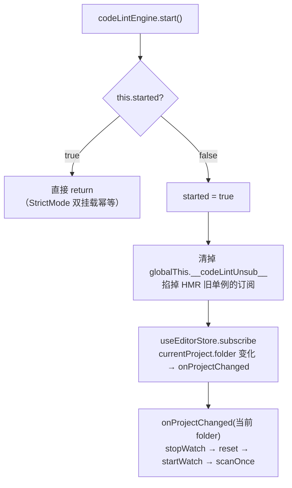

# 代码扫描检查系统（CodeLint）

> **一句话定位**：扫描当前工程 `src/projects/<folder>/` 下的 `.ts/.tsx` 源码，用轻量 TS 语法树找出违反项目约定的写法（`addComponent(new X)` 旧写法、裸 `new THREE.Mesh`），违规列表进面板、新违规进日志。
>
> **什么时候会用到你**：新增/修改一条源码规则检查器时；排查「面板里的代码问题不消失 / 保存源码后不重扫 / MCP `run_code_lint` 返回空」时；理解「为什么资产变化和源码变化不会互相触发重扫」时。
>
> 代码位置：`src/editor/codeLint/`

相关文档：[资产预览与检查](./asset_preview_lint_system.md)（共用 store 与面板的姊妹系统） / [编辑器核心](../core/core_system.md)（启动点） / [MCP 集成](../integration/mcp_integration.md)（`run_code_lint`）

---

## 1. 先记住这几个文件

| 文件 | 一句话职责 | 你要改它的场景 |
|---|---|---|
| [CodeLintEngine.ts](../../../src/editor/codeLint/CodeLintEngine.ts) | 引擎本体：启动订阅、工程切换全扫、`src-changed` 去抖增量、指纹缓存、结果发布 | 加触发时机；改缓存/去抖/发布策略 |
| [CodeCheckerRegistry.ts](../../../src/editor/codeLint/CodeCheckerRegistry.ts) | 检查器注册中心：kind → 构造器，幂等自注册 | 加注册入口或改幂等语义（一般不用动） |
| [CodeSource.ts](../../../src/editor/codeLint/CodeSource.ts) | 源码来源：Electron 真磁盘扫描 / 无 API 静默禁用 | 改扫描范围或文件读取方式 |
| [checkers/](../../../src/editor/codeLint/checkers/) | 内置规则 barrel + 两个检查器（`addComponent` / `bareThree`） | **加新规则只动这里** |

**关键心智模型**：codeLint **没有定时器**，它只在两件事发生时动——① 打开/切换工程（全量首扫）、② 主进程推来 `src-changed`（去抖后增量重扫）。「增量」不是只扫变化的文件，而是**全量列举文件、用内容指纹跳过没变文件的 AST 解析**。这个区别很重要：面板每次刷新的都是全量结果。

第二个容易误解的点：codeLint 与 assetLint 是两个**完全独立的引擎**（各自的指纹缓存、各自的监听订阅），但写进**同一个 store**、显示在**同一个面板**。它们唯一的耦合点就是 `useCodeLintStore`。

---

## 2. 启动与首扫：从 `start()` 到结果落面板

### 2.1 谁调用了它

`Editor.init()` 第 4.6 步，紧跟 assetLint 之后（[Editor.ts:91](../../../src/editor/Editor.ts)）：

```ts
// 4.5 启动资产格式检查器（单例：首扫 + 30s 定时；...）
assetLintEngine.start()

// 4.6 启动代码扫描检查器（单例：事件驱动，工程切换全扫 + src-changed 去抖增量重扫；
//     内置规则检查器由 CodeLintEngine 模块加载时经 checkers barrel 自注册）
codeLintEngine.start()
```

`Editor.destroy()` **故意不停**它——模块级单例，跟随整个应用生命周期，重复 `init`/`destroy` 不会重复启动。

### 2.2 `start()` 内部做的三件事



逐段讲代码（[CodeLintEngine.ts:95](../../../src/editor/codeLint/CodeLintEngine.ts)）：

**① `started` 幂等 + `globalThis` 守卫**

```ts
start(): void {
  if (this.started) return // 本实例已启动，幂等（StrictMode 重复 start 直接返回）
  this.started = true

  const g = globalThis as Record<string, unknown>
  // 清掉 HMR 旧单例遗留的 store 订阅（仅本实例首次启动时）
  if (g[GLOBAL_UNSUB_KEY]) {
    ;(g[GLOBAL_UNSUB_KEY] as () => void)()
  }
```

为什么光有 `started` 实例字段还不够：`started` 是**实例**字段，HMR 重载模块时会 `new` 出一个全新实例、`started` 重置回 `false`，于是旧实例的 store 订阅还挂着、新的又加一条 —— 一次工程切换触发两遍扫描。把取消函数挂到 `globalThis`（键 `__codeLintUnsub__`），新实例启动时先把旧的掐掉，全局始终只有一份订阅。

**② 订阅工程切换**

```ts
  this.storeUnsub = useEditorStore.subscribe((state, prev) => {
    const cur = state.currentProject?.folder ?? null
    const old = prev.currentProject?.folder ?? null
    if (cur !== old) this.onProjectChanged(cur)
  })
  g[GLOBAL_UNSUB_KEY] = this.storeUnsub
```

工程目录**不缓存成实例字段**，每次从 store 直接读（[CodeLintEngine.ts:75](../../../src/editor/codeLint/CodeLintEngine.ts)）：

```ts
private get folder(): string | null {
  return useEditorStore.getState().currentProject?.folder ?? null
}
```

源码注释写明了动机——「避免多实例/订阅时序导致的 folder desync」。缓存成字段就得手动维护同步，而订阅回调的时序并不总是可靠的。

**③ 对当前工程（若有）立即建监听 + 首扫**

```ts
  // 对当前工程（若有）立即建立监听 + 首扫
  this.onProjectChanged(useEditorStore.getState().currentProject?.folder ?? null)
}
```

注意订阅只能捕获**变化**。如果启动时 store 里已经有工程（恢复上次工程的情况），不会有 `folder` 变化事件，所以必须手动补一次首扫。漏了这行就表现为「编辑器刚打开时面板是空的，切换一次工程才有数据」。

### 2.3 工程切换：停旧 → 清面板 → 建新监听 + 首扫

```ts
private onProjectChanged(folder: string | null): void {
  this.stopWatch()
  this.autoShownFolder = null
  // 切换工程：清空面板与 issues（避免展示上一工程的违规）
  useCodeLintStore.getState().reset()
  // 无有效工程：停止扫描与监听（防御：空字符串也视为无效）
  if (!folder) {
    logger.info('[CodeLint] 工程切换: 无工程 → 停止扫描与监听')
    return
  }
  logger.info(`[CodeLint] 工程切换: ${this.projectLabel(folder)} → 全量扫描 src/projects/${folder}/`)
  this.startWatch(folder)
  void this.scanOnce()
}
```

两个细节：

`reset()` 清的是**整个 store**（`issues` + `assetIssues` + `panelOpen`），不是只清代码那部分。这是 codeLint 与 assetLint 不对称的地方 —— assetLint 的 `onProjectChanged` 只调 `setAssetIssues([])`（[AssetLintEngine.ts:100](../../../src/editor/asset/assetLint/AssetLintEngine.ts)），而 codeLint 调 `reset()`，会**顺带把资产问题和面板展开状态一起清掉**。两个引擎都在工程切换时 fire，所以最终效果是干净的。

`void this.scanOnce()` 故意**不 await**：`onProjectChanged` 是 store 订阅回调，同步等待一次全工程 AST 扫描会卡住 store 的后续通知。扫描结果异步回填 store。

---

## 3. 增量重扫：`src-changed` 是怎么流进来的

### 3.1 双通道：一条 IPC，两个事件，按扩展名分流

codeLint 建立监听时调的是 `watchProjectAssets`（[CodeLintEngine.ts:133](../../../src/editor/codeLint/CodeLintEngine.ts)）：

```ts
private startWatch(folder: string): void {
  const api = window.electronAPI
  if (!api?.watchProjectAssets || !api?.onSrcChanged) {
    logger.debug(`[CodeLint] ${this.projectLabel(folder)}: 无文件监听通道（electronAPI 缺失）→ 仅全量首扫，不做保存增量`)
    return
  }
  this.watchedFolder = folder
  // 复用 assetLint 的 watch-project-assets IPC：主进程同时监听 asset 与 src 目录
  void api.watchProjectAssets(folder)
  this.changeUnsub = api.onSrcChanged((changedFolder) => {
    // 只响应当前监听的工程（切换工程瞬间的旧通知忽略）
    if (changedFolder !== this.watchedFolder) return
    logger.debug(`[CodeLint] src-changed: ${changedFolder} → 300ms 去抖后增量重扫`)
    this.scheduleScan()
  })
  logger.info(`[CodeLint] 建立源码监听: src/projects/${folder}/（src-changed 300ms 去抖）`)
}
```

**这就是 codeLint 与 assetLint 唯一的运行期耦合点**：两个引擎调的是**同一条 IPC** `watch-project-assets`。主进程一次调用建两个 watcher，按扩展名分流成两个事件（[electron/main.ts:1540](../../../electron/main.ts)）：

```ts
ipcMain.handle('watch-project-assets', async (_event, folder: string) => {
  closeProjectWatchers()
  const projectRoot = path.join(__dirname, '..', 'src', 'projects', folder)
  if (!fs.existsSync(projectRoot)) return { ok: false }
  try {
    // 1) 资产目录监听（只在 asset 目录存在时建立）
    const assetRoot = path.join(projectRoot, 'asset')
    if (fs.existsSync(assetRoot)) {
      assetWatcher = fs.watch(assetRoot, { recursive: true }, (_eventType, filename) => {
        if (!filename) return
        // 只关心场景/蓝图/widget 资产；代码/其它文件忽略
        if (!/\.(scene|blueprint|widget)\.json$/i.test(filename)) return
        // 去抖：编辑器保存常触发多次事件
        if (assetWatchDebounce) clearTimeout(assetWatchDebounce)
        assetWatchDebounce = setTimeout(() => { /* → asset-changed */ }, 300)
      })
    }

    // 2) 源码目录监听（工程根目录递归，含 asset/ 下的 *.script.ts；JSON 资产被扩展名过滤自然忽略）
    srcWatcher = fs.watch(projectRoot, { recursive: true }, (_eventType, filename) => {
      if (!filename) return
      if (!/\.(ts|tsx)$/i.test(filename)) return
      if (/\.d\.ts$/i.test(filename)) return // 排除声明文件
      if (srcWatchDebounce) clearTimeout(srcWatchDebounce)
      srcWatchDebounce = setTimeout(() => {
        if (mainWindow && !mainWindow.isDestroyed()) {
          mainWindow.webContents.send('src-changed', { folder })
        }
      }, 300)
    })
    return { ok: true }
  } catch (err) { /* ... */ }
})
```

**双通道隔离就是靠这两个正则**：`srcWatcher` 只认 `.ts/.tsx`（排除 `.d.ts`），`assetWatcher` 只认 `.scene/.blueprint/.widget.json`。所以保存 JSON 资产不会触发 codeLint 重扫，保存源码也不会触发 assetLint 重扫 —— 尽管两个 watcher 监听的目录是包含关系（`projectRoot` 递归包含 `asset/`）。

副产品：工程根目录是**递归**监听的，所以 `asset/` 下的 `*.script.ts` 脚本文件也归 src 通道，会被 codeLint 扫到。

### 3.2 去抖是双层的，不是一层

主进程 300ms（`srcWatchDebounce`）+ 引擎 300ms（`scheduleScan`）：

```ts
scheduleScan(delay = RESCHEDULE_DELAY): void {   // RESCHEDULE_DELAY = 300
  if (this.scanDebounce) clearTimeout(this.scanDebounce)
  this.scanDebounce = setTimeout(() => void this.scanOnce(), delay)
}
```

`clearTimeout` 在**设置新的之前**执行，所以这是去抖而非节流 —— 连续 N 次文件事件只有最后一次真正触发扫描。为什么必须去抖：编辑器保存一个文件常触发多次 fs 事件（写入 + rename + chmod），不去抖会在同一批文件上跑 N 遍 `createSourceFile` + AST 遍历，主线程直接卡住。代价是保存一次最多 600ms 后才开扫。

### 3.3 指纹缓存：为什么叫「增量」

扫描主体（[CodeLintEngine.ts:207](../../../src/editor/codeLint/CodeLintEngine.ts)）：

```ts
private async scanInternal(folderOverride?: string): Promise<CodeIssue[]> {
  if (this.running) return []
  const folder = folderOverride ?? this.folder
  if (!folder) return [] // 无工程：静默（已由 onProjectChanged 保证只在有工程时触发）
  this.running = true
  try {
    const files = await this.codeSource.list(folder)
    // 旁路扫描非当前打开工程时不算工程标签（projectLabel 只认当前工程），直接用 folder
    const label = folderOverride && folderOverride !== this.folder ? folder : this.projectLabel(folder)
    logger.info(`[CodeLint] 开始扫描 ${label}: ${files.length} 个源码文件`)
    const all: CodeIssue[] = []

    for (const f of files) {
      const text = 'text' in f ? f.text : ''
      const hash = 'text' in f ? hashOf(f.text) : '<unreadable>'
      // 内容指纹未变 → 复用上次 issue，跳过 AST 解析（"指纹变了才检查"）
      const cached = this.fileCache.get(f.path)
      if (cached && cached.hash === hash) {
        all.push(...cached.issues)
        continue
      }
      // 变化 / 新增 / 读取失败 → 重新校验
      const issues = 'text' in f ? this.validateFile(f) : [this.readError(f)]
      this.fileCache.set(f.path, { hash, issues })
      all.push(...issues)
    }
```

四个设计点：

**防重入锁在 `try` 之外**。`if (this.running) return []` 位于置位之前 —— 扫描中再来一次请求直接返回空数组，**不排队也不报错**。MCP 连续调 `run_code_lint` 时第二次可能拿到空列表。

**指纹是 djb2，直接哈希文本**：

```ts
function hashOf(text: string): string {
  let h = 5381
  for (let i = 0; i < text.length; i++) h = ((h << 5) + h + text.charCodeAt(i)) | 0
  return `h${(h >>> 0).toString(36)}`
}
```

`| 0` 和 `>>> 0` 把它压回 32 位整数（JS 位运算本身的语义），否则会溢出成浮点、失去哈希性质。注意这里和 assetLint 不一样 —— assetLint 是 `hashOf(JSON.stringify(doc))`，codeLint 直接哈希源码文本，因为源码本身就是字符串。

**读取失败的文件统一用 `'<unreadable>'` 作指纹**。这样「一直读不到」的文件只会在第一次真跑一次（产出 `read` issue 后命中缓存），不会每扫一次都重试 IO。

**`pruneDeleted` 清已删除文件的缓存**，遍历的是 key 的副本：

```ts
private pruneDeleted(files: CodeFileEntry[]): void {
  const live = new Set(files.map((f) => f.path))
  for (const key of [...this.fileCache.keys()]) {
    if (!live.has(key)) this.fileCache.delete(key)
  }
}
```

`[...this.fileCache.keys()]` 的展开是必须的 —— 边遍历边删原 Map 会漏项。

---

## 4. 检查器是怎么跑起来的

### 4.1 barrel 副作用自注册

引擎文件顶部一行 `import './checkers'`（[CodeLintEngine.ts:26](../../../src/editor/codeLint/CodeLintEngine.ts)），注释写的是「side-effect：注册所有内置代码规则检查器（engine 与 checker 集合永远同加载）」。barrel 本体只有两行（[checkers/index.ts:10](../../../src/editor/codeLint/checkers/index.ts)）：

```ts
import './addComponentChecker'
import './bareThreeChecker'
```

每个 checker 文件末尾自己调 `registerCodeChecker`（[addComponentChecker.ts:41](../../../src/editor/codeLint/checkers/addComponentChecker.ts)）：

```ts
registerCodeChecker('addComponent', AddComponentChecker)
```

注册中心幂等，同 kind 只保留首次（[CodeCheckerRegistry.ts:18](../../../src/editor/codeLint/CodeCheckerRegistry.ts)）：

```ts
export function registerCodeChecker(kind: string, Ctor: CheckerCtor): void {
  if (registry.has(kind)) return
  registry.set(kind, Ctor)
}
```

为什么用「副作用注册」而不是注册表数组：新增规则只需「新建文件 + barrel 加一行 import」，引擎、注册中心、面板**零改动**。幂等是为了防 HMR —— 模块重载时 `registry` 这个 `const` 会重建，但如果不幂等、且 barrel 被重复求值，同一 kind 会被反复覆盖。

### 4.2 调度：不建 Program 的轻量语法树

```ts
private validateFile(f: CodeFileEntry & { text: string }): CodeIssue[] {
  const issues: CodeIssue[] = []
  try {
    const scriptKind = /\.tsx$/i.test(f.path) ? ts.ScriptKind.TSX : ts.ScriptKind.TS
    // 不建 Program、不做 typecheck；fileName 用相对路径（报告定位用）
    const sourceFile = ts.createSourceFile(
      f.path,
      f.text,
      ts.ScriptTarget.Latest,
      /* setParentNodes */ false,
      scriptKind,
    )
    const ctx: CheckerContext = { projectFolder: this.folder ?? '' }
    for (const kind of registeredKinds()) {
      const checker = getChecker(kind)
      if (!checker) continue
      issues.push(...checker.check(sourceFile, ctx))
    }
  } catch (err) {
    // 解析异常：记 warn 并产出一条 parse issue，不中断全扫
    logger.warn(`[CodeLint] ${f.path} 解析失败: ${errMsg(err)}`)
    issues.push({ file: f.path, line: 1, col: 1, message: `解析失败: ${errMsg(err)}`, rule: 'parse' })
  }
  return issues
}
```

三个必须这么写的理由：

`ts.createSourceFile` 而不是 `ts.createProgram` —— 建 Program 要解析 import 图、做类型检查，单文件几十毫秒量级，一个工程上百个文件直接卡死编辑器。这里只要语法树做模式匹配，`createSourceFile` 是微秒级。代价是**做不了类型相关的规则**（不知道变量指向哪个类）。

`setParentNodes = false` —— 建 parent 指针要额外遍历和内存，而检查器只用 `forEachChild` 自上而下走，用不到 parent。

`fileName` 传 `f.path`（相对路径如 `src/projects/fish/gameplay/foo.ts`）而不是绝对路径。因为检查器产 issue 时用的是 `sourceFile.fileName`，面板和日志直接拿它显示 —— 用相对路径才不会把用户机器的绝对路径泄进面板。

**注意 `ctx.projectFolder` 取的是 `this.folder`（当前打开工程）**，不是 `folderOverride`。MCP 旁路扫描另一个工程时，checker 拿到的 `projectFolder` 仍是当前工程。目前两个内置 checker 都把 ctx 写成 `_ctx` 忽略掉了，所以没暴露问题 —— 但**新 checker 如果要用 ctx，旁路扫描下会拿到错误的工程名**。

`getChecker(kind)` 每次 `new` 一个实例（[CodeCheckerRegistry.ts:24](../../../src/editor/codeLint/CodeCheckerRegistry.ts)），不缓存 —— checker 是无状态的，构造成本极低，缓存反而要处理 HMR 失效。

### 4.3 内置的两条规则

| kind | 位置 | 匹配什么 |
|---|---|---|
| `addComponent` | [addComponentChecker.ts:18](../../../src/editor/codeLint/checkers/addComponentChecker.ts) | `xxx.addComponent(new Xxx(...))` —— 实例版旧写法，应改类版 `addComponent(Xxx, ...args)` |
| `bareThree` | [bareThreeChecker.ts:32](../../../src/editor/codeLint/checkers/bareThreeChecker.ts) | `new THREE.<黑名单>` 直链，正则 `^(Mesh\|Group\|Line\|LineSegments\|Sprite\|Points\|\w*Geometry\|\w*Material)$` |

两条都是纯语法匹配（`ts.forEachChild` 递归 + 节点类型判断），不做类型解析。

`bareThree` 的豁免列表在文件头注释里写明：`Vector2/3/4`、`Color`、`Plane`、`Ray`、`Raycaster`、`Matrix4`、`Quaternion`、`Euler`、`Box3`、`Sphere`、`CanvasTexture`、`Texture`、`TextureLoader`、`Scene`、`Camera`、`Light` 等**不报** —— 判据是「是否创建可渲染对象」，数学工具类和纹理类不属于，引擎自身也大量使用，且 `ThreeFactoryComponent` 没有对应方法。

### 4.4 新增规则：两步，零改引擎

```ts
// 1. 新建 src/editor/codeLint/checkers/yourRuleChecker.ts
class YourChecker extends AbstractCodeChecker {
  readonly kind = 'yourRule'
  check(sourceFile: ts.SourceFile, ctx: CheckerContext): CodeIssue[] {
    const issues: CodeIssue[] = []
    const visit = (node: ts.Node): void => {
      // ...命中违规时：
      const { line, col } = this.posOf(node, sourceFile)
      issues.push({ file: sourceFile.fileName, line, col, message: '...', rule: this.kind })
      ts.forEachChild(node, visit)
    }
    visit(sourceFile)
    return issues
  }
}
registerCodeChecker('yourRule', YourChecker)

// 2. src/editor/codeLint/checkers/index.ts 加一行
import './yourRuleChecker'
```

基类提供 `posOf(node, sourceFile)`（[AbstractCodeChecker.ts:21](../../../src/editor/codeLint/AbstractCodeChecker.ts)）把节点起始位置转成 1 起的行列号 —— 手写 `getLineAndCharacterOfPosition` 容易忘 `+1`。

`CodeIssue` **没有 severity 字段**（[types.ts:10](../../../src/editor/codeLint/types.ts) 的接口定义只有 `file` / `line` / `col` / `message` / `rule` 五项），一律按 error 处理。这和 assetLint 的 `LintIssue`（有 `severity: 'error' | 'warn'`）不同，写新 checker 时不要试图塞 severity 进去。

---

## 5. 结果写哪去了：与 assetLint 共用 store

发布逻辑（[CodeLintEngine.ts:291](../../../src/editor/codeLint/CodeLintEngine.ts)）：

```ts
private publish(folder: string, fileCount: number, all: CodeIssue[]): void {
  const store = useCodeLintStore.getState()
  // 面板数据：整体覆盖（面板渲染全量，不受 log 去重影响）
  store.setIssues(all)

  // log 级增量：只报新指纹
  const fps = all.map((i) => `${i.file}::${i.line}::${i.col}::${i.rule}::${i.message}`)
  const fresh: CodeIssue[] = []
  for (let i = 0; i < all.length; i++) {
    if (!this.knownFingerprints.has(fps[i])) fresh.push(all[i])
  }
  this.knownFingerprints = new Set(fps)

  for (const i of fresh) {
    // 直接以 logger 实例调用，避免摘取方法引用导致 this 丢失
    logger.error(`[CodeLint] ${i.file}:${i.line}:${i.col} ${i.message}`)
  }
```

**这是最容易误解的一处：面板和日志走的不是同一套去重。** 面板每次整表覆盖 `setIssues(all)`，所以修好了的违规会从面板消失；日志用 `file::line::col::rule::message` 指纹集比对，只有**上次没出现过**的才打。原因很实际：重扫是全量列举（指纹缓存只是跳过 AST），如果日志不去重，每扫一次就把所有历史违规重打一遍，`logs/console_*.log` 会被同一批 error 淹没。

还有一句容易删错的注释：**必须 `logger.error(line)` 而不是 `const f = logger.error; f(line)`** —— 摘走方法引用会丢 `this`，`logger` 内部的 `this.write` 直接报错。

**自动弹面板只发生一次**：

```ts
  // 打开工程首扫且有问题 → 自动弹出 tips；同一工程后续重扫不重复弹（手动收起后不打扰）
  if (all.length > 0 && this.autoShownFolder !== folder) {
    this.autoShownFolder = folder
    store.setPanelOpen(true)
  }
}
```

`autoShownFolder` 记录已自动弹过的工程。首扫有违规就弹一次，之后你手动收起、再改十次代码重扫，面板**不会再自己弹开** —— 只在切换工程（`onProjectChanged` 里置 `null`）后才重新获得「弹一次」的资格。

### 5.1 双引擎同 store 的写入分工

| 写入方 | 方法 | 清空的时机 |
|---|---|---|
| CodeLintEngine | `setIssues(all)` | 工程切换时 `reset()`（清 `issues` + `assetIssues` + `panelOpen`） |
| AssetLintEngine | `setAssetIssues(all.map(toAssetIssueView))` | 工程切换时 `setAssetIssues([])`（只清资产部分） |

面板侧（[CodeLintPanel.tsx:16](../../../src/components/CodeLintPanel.tsx)）和状态栏（[StatusBar.tsx:12](../../../src/components/StatusBar.tsx)）都只订阅 store，不感知数据来源：

```ts
const codeLintIssueCount = useCodeLintStore((s) => s.issues.length)
const assetLintIssueCount = useCodeLintStore((s) => s.assetIssues.length)
const totalIssueCount = codeLintIssueCount + assetLintIssueCount
```

徽标显示**合计**，title 写「代码 X · 资产 Y」。面板分两节渲染（`代码问题（N）` / `资产问题（N）`），`copyAll` 把两节合并成纯文本进剪贴板。

### 5.2 旁路扫描：MCP 扫别的工程不污染面板

```ts
      this.pruneDeleted(files)
      // 旁路扫描（非当前打开工程）：结果只经返回值输出，不覆盖面板（面板跟随当前打开工程）
      if (!folderOverride || folderOverride === this.folder) {
        this.publish(folder, files.length, all)
      } else {
        logger.info(`[CodeLint] 旁路扫描完成 ${folder}: ${files.length} 文件，共 ${all.length} 个问题（不更新面板）`)
      }
      return all
```

`runNow(folderOverride)` 走的就是这条路。判据是 `folderOverride === this.folder` —— 只有扫的是当前打开工程才写面板。否则你 MCP 扫一下别的工程，当前工程的面板就被别人的结果覆盖了。

---

## 6. 关键方法速查

| 方法 | 位置 | 干什么 | 注意 |
|---|---|---|---|
| `codeLintEngine.start()` | `CodeLintEngine.ts:95` | 幂等启动 + 订阅工程切换 + 当前工程首扫 | `globalThis` 守卫清 HMR 旧订阅 |
| `CodeLintEngine.onProjectChanged` | `CodeLintEngine.ts:117` | 停旧监听 → `reset()` → 建新监听 → `void scanOnce()` | `reset()` 会连带清 assetIssues 与 panelOpen |
| `CodeLintEngine.startWatch` | `CodeLintEngine.ts:133` | 调 `watchProjectAssets` + 订阅 `onSrcChanged` | 与 assetLint **同一条 IPC** |
| `CodeLintEngine.stopWatch` | `CodeLintEngine.ts:152` | 退订 + `stopWatchProjectAssets()` | 会**同时**关掉 asset 侧 watcher |
| `CodeLintEngine.scheduleScan` | `CodeLintEngine.ts:164` | 300ms 去抖触发扫描 | 连续事件只有最后一次生效 |
| `CodeLintEngine.scanOnce` | `CodeLintEngine.ts:192` | 扫一次（走指纹缓存） | 防重入，重入返回空数组 |
| `CodeLintEngine.runNow(folderOverride?)` | `CodeLintEngine.ts:201` | MCP 手动全量重扫（**先清缓存**） | 非当前工程 = 旁路，不写面板 |
| `CodeLintEngine.scanInternal` | `CodeLintEngine.ts:207` | 扫描主体：指纹比对 + 派发 + 发布 | 无工程返回空数组（静默） |
| `CodeLintEngine.validateFile` | `CodeLintEngine.ts:251` | `createSourceFile` → 逐 checker `check()` | 不建 Program；`ctx.projectFolder` 旁路时不准 |
| `CodeLintEngine.publish` | `CodeLintEngine.ts:291` | 面板全量覆盖 + 日志增量 + 首扫自动弹窗 | `logger` 必须实例调用 |
| `CodeLintEngine.clearCache` | `CodeLintEngine.ts:89` | 清 `fileCache` + `knownFingerprints` | 清 `knownFingerprints` 会让下次全量重报日志 |
| `CodeLintEngine.destroy` | `CodeLintEngine.ts:177` | 停监听 + 退订 + 清缓存 + `started=false` | Editor 不调它（单例跟应用） |
| `hashOf(text)` | `CodeLintEngine.ts:33` | djb2 内容指纹 | 读取失败统一 `<unreadable>` |
| `registerCodeChecker` / `getChecker` | `CodeCheckerRegistry.ts:18` / `:24` | 检查器注册 / 取用（每次 `new`） | 幂等：同 kind 只保留首次 |
| `registeredKinds()` | `CodeCheckerRegistry.ts:30` | 已注册 kind 列表 | 引擎逐规则遍历用 |
| `AbstractCodeChecker.posOf` | `AbstractCodeChecker.ts:21` | 节点 → 1 起行列 | 已含 `+1`，别再手动加 |
| `createCodeSource()` | `CodeSource.ts:67` | 按环境选 Electron 通道 / Null 兜底 | 惰性调用，模块加载时不解析 |
| `CodeSource.list` | `CodeSource.ts:31` | 列文件 + 逐个读文本 | 返回 `{path,text}` 或 `{path,error}` |
| `useCodeLintStore.reset` | `useCodeLintStore.ts:54` | 清 issues + assetIssues + panelOpen | 只被 codeLint 的 `onProjectChanged` 调用 |

主进程侧：

| 处理器 | 位置 | 干什么 |
|---|---|---|
| `list-project-src` | `electron/main.ts:1479` | 递归列 `src/projects/<folder>` 下 `.ts/.tsx`，排除 `.d.ts` |
| `watch-project-assets` | `electron/main.ts:1540` | 建 asset(1549) + src(1577) 两个 watcher，按扩展名分流 |
| `closeProjectWatchers` | `electron/main.ts:1516` | **同时**关 asset + src watcher 与两个去抖定时器 |
| `stop-watch-project-assets` | `electron/main.ts:1596` | 调 `closeProjectWatchers()`，不区分来源 |

---

## 7. 流程影响：牵动哪些功能

### 上游：谁驱动它

| 上游 | 怎么驱动 | 相关文档 |
|---|---|---|
| 编辑器核心 | `Editor.init()` 第 4.6 步 `codeLintEngine.start()`；`Editor.destroy()` 故意不停它 | [编辑器核心](../core/core_system.md) |
| Electron 主进程 | `fs.watch(projectRoot, {recursive:true})` 按扩展名过滤后 300ms 去抖，推 `src-changed` | [MCP 集成](../integration/mcp_integration.md) |
| 工程切换 | `useEditorStore.currentProject.folder` 变化 → `onProjectChanged` → 全量首扫 | [编辑器核心](../core/core_system.md) |
| MCP 调试桥 | `run_code_lint` → `codeLintEngine.runNow(lintFolder)`，可带 `project` 参数 | [MCP 集成](../integration/mcp_integration.md) |

### 下游：它波及谁

| 下游功能 | 波及点 | 相关文档 |
|---|---|---|
| 检查面板 / 状态栏 | `setIssues` 写进 `useCodeLintStore`，与资产问题分节显示、徽标显示合计 | [React 面板组件](../ui/ui_components_system.md) |
| 资产检查 assetLint | 共用同一 store 与面板；**共用同一条监听 IPC**，任一 `stopWatch()` 会关掉双方的 watcher | [资产预览与检查](./asset_preview_lint_system.md) |
| 控制台 / 日志文件 | `logger.error` 带 `[CodeLint]` 前缀，指纹去重后写入 `logs/console_*.log` | [编辑器核心](../core/core_system.md) |
| MCP `run_code_lint` 调用方 | `runNow` 返回全量 `CodeIssue[]` 经 requestId 往返回传 | [MCP 集成](../integration/mcp_integration.md) |

> assetLint **反向不受** codeLint 影响：源码变化只触发 `src-changed`，assetLint 订阅的是 `asset-changed`，两个 watcher 按扩展名互斥，见 §3.1。

---

## 8. 踩坑清单（都是真踩过的）

**1. `stop-watch-project-assets` 一次关掉两个 watcher** —— 主进程 `closeProjectWatchers()`（[main.ts:1516](../../../electron/main.ts)）不分你我地关 `assetWatcher` + `srcWatcher` + 两个去抖定时器，而 `stop-watch-project-assets` 处理器只是简单地调它。所以 codeLint 与 assetLint **任何一个**调 `stopWatch()`，另一个的保存增量监听也一起没了。规则：把「停止监听」当成全局操作，不要指望只停自己这一路；工程切换时两者各自会重新建监听（`startWatch` 里 `watchProjectAssets` 又调一次），所以最终状态仍然正确，但切换过程中会有一个短暂的双停窗口。

**2. 浏览器调试模式下 codeLint 只有首扫，没有增量** —— `MockElectronAPI` 里 `onSrcChanged: () => (() => {})`（[MockElectronAPI.ts:347](../../../src/editor/MockElectronAPI.ts)）永不触发，`watchProjectAssets` 返回 `{ ok: false }`。引擎的 `startWatch` 会打一条 debug 日志直接 return。规则：验证保存增量必须在 Electron 环境里做；浏览器里只能用 MCP `run_code_lint` 手动触发。

**3. 读源码不能用 `fetch('/path?raw')`** —— Vite dev 对 `.ts` 的 `?raw` 响应是**模块代码**（`export default "..."` 包装），不是纯文本，直接 fetch 拿到的字符串会让 AST 解析出一堆假 issue。Mock 里因此专门用 `import.meta.glob<string>(..., { query: '?raw', import: 'default' })`（[MockElectronAPI.ts:53](../../../src/editor/MockElectronAPI.ts)），靠 loader 在运行时取 `default`。规则：任何「读源码原始文本」的需求都走 `rawSrcModules` 通道；文件枚举则复用既有的 `allFileKeys`（[MockElectronAPI.ts:48](../../../src/editor/MockElectronAPI.ts)）按 folder 前缀过滤 —— 不新增全工程 glob，避免把其它工程的源码卷进 Vite 模块图（引发无关工程增删文件时整页刷新）。

**4. CodeSource 必须惰性创建** —— `window.electronAPI` 在浏览器 Mock 下是在 `main.tsx` 里注入的，**晚于所有静态 import 的模块求值**。若在模块加载时就 `createCodeSource()`，会拿到 `NullCodeSource`，表现为「0 个文件、面板永远空」。引擎用 getter 推迟到首次扫描（[CodeLintEngine.ts:51](../../../src/editor/codeLint/CodeLintEngine.ts)）。

**5. 扫描中重入会静默返回空数组** —— `scanInternal` 开头 `if (this.running) return []`，没有排队也没有报错。MCP `run_code_lint` 连续调用时第二次可能拿到空列表。规则：调用方要稍后重试，不要拿空结果当「工程很干净」。

**6. `runNow()` 会顺带重置日志去重** —— 它开头调 `clearCache()`，清掉的不只是 `fileCache` 还有 `knownFingerprints`。于是这次扫描**所有**问题都会被当成「新」打一遍 `logger.error`，下一轮定期扫描时又因为指纹集刚重建过、历史问题已不在集合里而**再打一遍**。规则：日志里看到同一批 `[CodeLint]` 重复出现，先回想是不是刚跑过 MCP `run_code_lint`。

**7. `logger` 必须实例调用** —— `logger.error(line)` 不能写成 `const f = logger.error; f(line)`，摘走方法引用会丢 `this`，`logger` 内部的 `this.write` 直接报错。这条在 `publish` 里有专门注释，assetLint 侧同样有。

**8. 手动收起面板后不会再自动弹** —— `autoShownFolder` 只在工程切换时重置。规则：想再看到面板就点状态栏徽标手动展开，别等着它自己弹。

**9. `typescript` 是 devDependency**（[package.json:47](../../../package.json)）—— 引擎 `import * as ts from 'typescript'` 在 dev 下没问题，但打包产物里若未把 typescript 打进去，运行时会直接崩。当前 `build.files` 只含 `dist/**` 与 `dist-electron/**`，**未验证**打包后 codeLint 是否可用。规则：要做打包验证时优先查这一项。

---

## 9. 边界条件

| 条件 | 行为 | 怎么应对 |
|---|---|---|
| 无工程打开 | `onProjectChanged` 清空面板并停止监听；`scanInternal` 静默返回空数组 | 引擎内置静默语义 |
| 无 `electronAPI`（打包环境未注入 Mock） | `createCodeSource` 返回 `NullCodeSource`，`list` 返回空列表 | 静默禁用，不报错不阻塞编辑器 |
| 浏览器 dev（MockElectronAPI） | 首扫可用（走 `allFileKeys` 枚举 + `rawSrcModules` 读文本）；`onSrcChanged` 永不触发 | 增量验证要用 Electron 环境 |
| 文件读不到 / 非 UTF8 | 单条 `read` issue（`rule: 'read'`，`line:1 col:1`），不中断全扫 | 指纹固定为 `<unreadable>`，不会反复重试 IO |
| 语法解析异常 | `logger.warn` + 单条 `parse` issue，跳过该文件继续 | 看日志 `[CodeLint] <path> 解析失败:` |
| 文件被删除 | `pruneDeleted` 从 `fileCache` 移除，issue 自然消失 | 引擎内置 |
| 保存但内容未变 | 指纹不变 → 复用缓存跳过 AST，不重复报错 | 引擎内置 |
| 重复 `start()` / 重复注册 checker | 幂等忽略 | `started` 字段 + registry `has` 判断 |
| 切换工程瞬间的旧 `src-changed` | 回调比对 `watchedFolder`，不匹配直接 return | 引擎内置 |
| HMR / StrictMode 双挂载 | `globalThis.__codeLintUnsub__` 守卫保留一份订阅 | 引擎内置 |
| 扫描中重入 | `if (this.running) return []`，静默返回空 | 稍后重试 |
| MCP `run_code_lint` 无工程且无 `project` 参数 | `runNow(undefined)` → `scanInternal` 返回空，`total: 0` | 传 `project`（folder 或显示名）或先打开工程 |
| MCP `run_code_lint` 指定无效工程 | `{ status:'error', message:'未找到工程: X，可用: ...' }` | 用 message 里列出的可用 folder |
| MCP `run_code_lint` 指定非当前工程 | 正常扫描（旁路），只经返回值输出，不覆盖面板 | 结果以返回值为准 |
| 旁路扫描时 checker 的 `ctx.projectFolder` | 取的是**当前打开工程**而非被扫工程 | 新 checker 依赖 ctx 时要注意 |
| `addComponent` 别名/变量间接调用 | 不报（只匹配直链 `xxx.addComponent(new ...)`） | 已知限制，不做类型追踪 |
| `import * as T from 'three'; new T.Mesh` | 不报（仅直链 `new THREE.Xxx`） | 已知限制 |
| `const { Mesh } = THREE; new Mesh()` | 不报（不追踪解构） | 已知限制 |
| `new THREE.Vector3/Color/Plane/CanvasTexture` | 不报（数学工具类/纹理类不在黑名单） | 规则只匹配可渲染对象构造 |
| 注释/字符串里的 `new THREE.Mesh` | 不报（AST 只走真实表达式节点） | 天然规避 |
| `.d.ts` 声明文件 | 主进程 `list-project-src` 与 `srcWatcher` 双端排除 | 双端过滤 |
| JSON 资产变化 | 只触发 `asset-changed`，codeLint 不重扫 | 双通道按扩展名隔离 |
| `asset/` 下的 `*.script.ts` | **会**被扫（工程根目录递归监听 + `.ts` 匹配） | 预期行为 |
| 保存一次源码到开扫的延迟 | 主进程 300ms 去抖 + 引擎 300ms 去抖，最多 600ms | 双击保存不会重复扫 |
