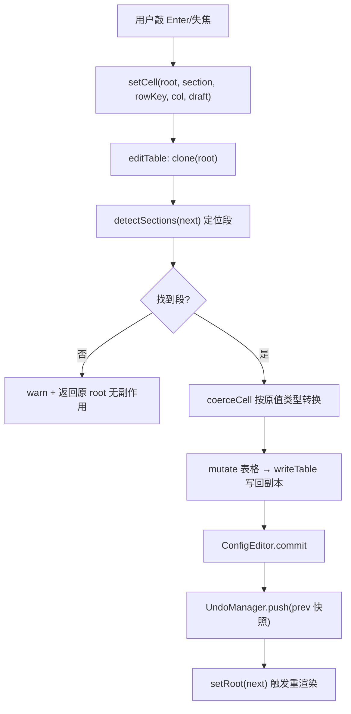

# 配置编辑器数据模型（configEdit / configModel）

> **一句话定位**：把任意形态的配置 JSON（`*.config.json` / `*.table.json`）派生成"段 → 表格"视图的**纯函数编辑模型**，ConfigEditor.tsx 表格 UI 的全部逻辑都在这里，UI 组件只做渲染。
> **什么时候会用到你**：给配置编辑加新表格操作（批量改列/导入导出）时；排查"改单元格没生效/撤销错乱/下划线键被误删"时；理解配置编辑器为何"每次从 root 重新派生"时。
> 代码位置：`src/editor/configEdit/configModel.ts`（模型）、`src/components/ConfigEditor.tsx`（唯一消费 UI）

## 1. 先记住这几个文件

| 文件 | 一句话职责 | 你要改它的场景 |
|---|---|---|
| [configModel.ts](../../../src/editor/configEdit/configModel.ts) | 全部数据逻辑：段检测 / 纯函数编辑 / 类型转换 | 加表格操作、改类型推断规则 |
| [ConfigEditor.tsx](../../../src/components/ConfigEditor.tsx) | 唯一 UI 消费者：渲染段/表格 + commit 接撤销 | 加工具栏按钮、改交互 |
| [UndoManager.ts](../../../src/editor/blueprintEdit/UndoManager.ts) | 与蓝图共用的撤销栈（按资产路径隔离） | 撤销行为异常时 |
| [asset_tools_system.md](../../engine/asset_tools_system.md) | 配置资产的加载链路（ConfigRegistry/DataTable） | 理解编辑的数据从哪来 |

**关键心智模型**：**模型是纯函数，UI 是薄壳**。每个编辑操作（`setCell`/`addRow`/`removeColumn`…）都接受当前 root、返回新 root，不改入参——头注释三条设计要点之二："所有编辑操作是纯函数：接受当前 root，返回新 root（调用方负责撤销快照）"。撤销、保存、脏检查全部由 ConfigEditor 侧的 `commit` 统一收口。

## 2. 段检测：一份 JSON 如何变成表格

### 2.1 三种段

```ts
// configModel.ts:99
export function detectSections(root: Record<string, unknown>): ConfigSection[] {
  const entries = Object.entries(root).filter(([k]) => !isMetaKey(k))
  ...
  // 根行表：所有顶层值都是纯对象（DataTable 行表）
  if (entries.every(([, v]) => isPlainObject(v))) {
    sections.push({ id: '', label: '数据表', kind: 'rows', table: buildTable('', 'rows', entries), scalars: [] })
    return sections
  }
  // 标量段（混合形态的 config.json）
  ...
  // 表格段：数组字段 / 对象字段（保持原字段顺序）
  ...
}
```

判定规则（`kind` 三态）：

| root 形态 | 检测结果 | 典型文件 |
|---|---|---|
| 顶层全是纯对象 | 单一"数据表"段（id=`''`） | `*.table.json`（键=行 id） |
| 顶层有标量 | "基础字段"段（id=`@scalars`） | `*.config.json` |
| 顶层数组/对象字段 | 每个字段一个表格段 | 混合 config |

`SCALARS_ID = '@scalars'` 和 `KEY_COLUMN = '@key'` 都是含 `@` 的伪 id——**不可能是真实字段名**，这是避免与业务键冲突的命名技巧。下划线开头的键（`_comment`/`_meta`）是元数据：不进表格、保存时原样保留（`isMetaKey` 过滤贯穿所有读写路径）。

### 2.2 标量的"value 包装"往返

```ts
// configModel.ts:92（buildTable 内）
// 数组元素为标量时包装成 { value }，写回时自动还原
cells: isPlainObject(value) ? clone(value) : { value: value ?? null },

// configModel.ts:150（writeTable 的 array 分支）
root[table.id] = table.rows.map((row) => {
  // 标量包装还原：仅剩 value 一列时存回标量
  if (Object.keys(row.cells).length === 1 && 'value' in row.cells) return row.cells.value
  return clone(row.cells)
})
```

数组段里的标量元素（如 `[1, 2, 3]`）进表格时被包装成 `{value: 1}` 才有"单元格"概念；写回时只剩唯一 `value` 列的行自动还原为标量。**不对称点要知道**：如果用户给标量行加了一列，写回后就永久变对象了——这是表格化编辑的固有语义，不算 bug。

### 2.3 表格视图不做双向同步

```ts
// configModel.ts:11（头注释）
// 表格视图每次从 root 重新派生，**不做双向同步**，杜绝序列化丢键风险
```

UI 里的 `useMemo(() => detectSections(root), [root])`（[ConfigEditor.tsx:109](../../../src/components/ConfigEditor.tsx)）每次 root 变化全量重建视图。为什么不缓存"表格对象、改表格、同步回 root"？因为对象键有顺序与缺列问题——行 A 有 `hp` 列而行 B 没有，双向同步很容易把"缺列"写成"删键"。重新派生 + 整体写回牺牲一点性能（配置表都小），换序列化零丢失。

## 3. 编辑链路：一次单元格提交的全过程



### 3.1 类型强制转换 coerceCell

```ts
// configModel.ts:237
export function coerceCell(raw: string, prev: unknown): { value: unknown; ok: boolean } {
  const text = raw.trim()
  // 原值是数组/对象 → 必须解析成合法 JSON
  if (Array.isArray(prev) || isPlainObject(prev)) {
    try { return { value: JSON.parse(text), ok: true } catch { return { value: prev, ok: false } } }
  }
  if (typeof prev === 'number') { ... }        // 数字列：非数字输入拒绝
  if (typeof prev === 'boolean') { ... }       // 布尔列：true/1/yes/on 宽松解析
  // 字符串 / 空值：允许就地升级为 JSON 结构（如把 "1" 改成 [1,2]）
  if (text.startsWith('[') || text.startsWith('{')) { try { return { value: JSON.parse(text), ... } } }
  if (text === '') return { value: null, ok: true }
  if (!Number.isNaN(Number(text))) return { value: Number(text), ok: true }
  ...
}
```

转换规则由**原值类型**驱动而非输入猜测：数字列填 "abc" 返回 `ok:false` 保留原值（UI 给红框提示）；字符串列填 `[1,2]` 会**就地升级**为 JSON 数组（注释明示的特性）；空字符串统一存 `null`。`ok=false` 时 `setCell` 返回原 root，UI 无变化——**失败编辑零副作用**，这是纯函数模型的直接收益。

### 3.2 commit 收口：撤销快照在这里压

```ts
// ConfigEditor.tsx:113
const commit = useCallback(
  (next) => {
    if (prev) UndoManager.push(undoKey(assetPath), prev)   // 纯函数语义：调用方负责快照
    setRoot(next)
    ...
  }, ...)

// ConfigEditor.tsx:164
const handleSave = useCallback(async () => {
  const writeJsonFile = window.electronAPI?.writeJsonFile
  ...
  const res = await writeJsonFile(assetPath, root)
  editorBus.emit(EditorEvent.BLUEPRINT_SAVED, assetPath)
```

`commit(next)` 做两件事：把**变更前**的 root 压进 UndoManager（key = 资产路径，与蓝图编辑共用一套撤销栈，见 [undo_redo_system.md](../blueprint/undo_redo_system.md)）、`setRoot` 触发重渲染。保存就是原样 `writeJsonFile(assetPath, root)`——模型层不做任何持久化，写盘策略完全在 UI 层。浏览器模式无 IPC 时保存按钮失效（与 SaveSlot 同一套降级逻辑）。

## 4. 关键方法速查

| 方法 | 位置 | 干什么 | 注意 |
|---|---|---|---|
| `detectSections(root)` | [configModel.ts:99](../../../src/editor/configEdit/configModel.ts) | root → 段列表 | 每次全量派生，勿缓存 |
| `coerceCell(raw, prev)` | [configModel.ts:237](../../../src/editor/configEdit/configModel.ts) | 按原值类型强转输入 | ok=false 保留原值 |
| `setCell(...)` | [configModel.ts:284](../../../src/editor/configEdit/configModel.ts) | 改单元格 | 返回 {root, ok} |
| `setRowKey(...)` | [configModel.ts:303](../../../src/editor/configEdit/configModel.ts) | 重命名行键 | 重名拒绝（静默） |
| `addRow / removeRow` | [configModel.ts:320](../../../src/editor/configEdit/configModel.ts) | 增删行 | 新行按现有列置空 |
| `moveRow(..., delta)` | [configModel.ts:331](../../../src/editor/configEdit/configModel.ts) | 行上移/下移 | 数组段才有意义 |
| `renameColumn(...)` | [configModel.ts:349](../../../src/editor/configEdit/configModel.ts) | 重命名列 | 逐行重排 cells 保持键顺序 |
| `setScalar / addScalar / removeScalar` | [configModel.ts:404](../../../src/editor/configEdit/configModel.ts) | 顶层标量编辑 | 元数据键拒绝编辑 |
| `cloneRoot(root)` | [configModel.ts:72](../../../src/editor/configEdit/configModel.ts) | 深拷贝 | 撤销快照/编辑前副本用 |
| `getComment(root)` | [configModel.ts:142](../../../src/editor/configEdit/configModel.ts) | 取 `_comment` | 元数据不进表格 |

## 5. 流程影响：牵动哪些功能

### 上游：谁驱动它

| 上游 | 怎么驱动 | 相关文档 |
|---|---|---|
| ConfigEditor.tsx | 唯一 UI 入口：打开资产 → load root → 表格渲染 → commit | [ui_components_system.md](../ui/ui_components_system.md) |
| UndoManager | commit 压快照 / Ctrl+Z 还原（与蓝图共用栈） | [undo_redo_system.md](../blueprint/undo_redo_system.md) |
| Electron writeJsonFile IPC | 保存唯一通道（.json 校验 + 逃逸防护） | [mcp_integration.md](../integration/mcp_integration.md) |

### 下游：它波及谁

| 下游功能 | 波及点 | 相关文档 |
|---|---|---|
| ConfigRegistry / DataTable 运行时 | 编辑保存后重启游戏才重新加载（glob 注册链路） | [asset_tools_system.md](../../engine/asset_tools_system.md) |
| 游戏数值 | 兵种/炮台/节奏表都从这里改，改错直接改变游戏行为 | [battle_system.md](../../projects/battle_system.md) |
| 配置资产创建 skill | `skl-create-config-asset` 生成的文件即本模型的输入形态 | [asset_tools_system.md](../../engine/asset_tools_system.md) |

## 6. 踩坑清单（都有代码依据）

**1. 编辑单元格没生效，也没有报错** —— 原因：`editTable` 定位段失败时 `logger.warn` 后返回**原 root**（无副作用设计），段 id/kind 对不上就静默跳过。规则：程序化调用编辑函数时确认 section 来自同一次 `detectSections(root)`，别用旧 root 的段对象操作新 root。

**2. 数字列填了文本，值悄悄没变** —— 原因：`coerceCell` 对 number 原值遇非数字输入返回 `ok:false` + 原值，UI 红框提示一闪而过。规则：批量导入/脚本改配置时自己先过一遍类型检查，模型层不会替你兜底报错。

**3. 标量行加了列，写回变对象** —— 原因："仅剩 value 一列才还原标量"（`writeTable` 注释），加过列的行已经是对象语义。规则：数组段想保持标量元素就别给那些行加列；需要结构化就整体转对象形态。

**4. `_comment` 在表格里找不到** —— 原因：`isMetaKey` 过滤，下划线开头键不进任何段。规则：想看/改注释用 `getComment`，或直接编辑 JSON 源文件；别试图通过表格 API 编辑元数据键（`setScalar` 也拒绝 meta 键）。

**5. 撤销后保存，文件还是新值** —— 原因：撤销只回滚内存 root，`handleSave` 写的是当前 root；如果撤销后又点了保存，写的就是撤销后的值——这是正确行为。真正的坑是**切页签**：`undoKey(assetPath)` 按路径隔离，但 `UndoManager.clear` 在关闭页签时清栈（[ConfigEditor.tsx:93](../../../src/components/ConfigEditor.tsx)），撤销历史不跨会话。规则：重要中间态靠保存，别指望撤销栈常驻。

## 7. 边界条件

| 条件 | 行为 | 怎么应对 |
|---|---|---|
| root 为空对象 | detectSections 返回 [] | UI 显示空态 |
| 段定位失败 | warn + 返回原 root | 调用方检查 root 引用是否变化 |
| 重名行键/列名 | setRowKey/renameColumn 静默拒绝 | uniqueName 用于自动命名场景 |
| 输入含 JSON 语法 | 字符串列就地升级为数组/对象 | 想存字面量 "[1,2]" 需转义处理（当前无通道） |
| meta 键编辑 | 所有 API 拒绝 | 只能直接编辑 JSON |
| 浏览器模式 | 保存按钮失效（无 IPC），编辑/撤销正常 | 落盘验证去 Electron |
