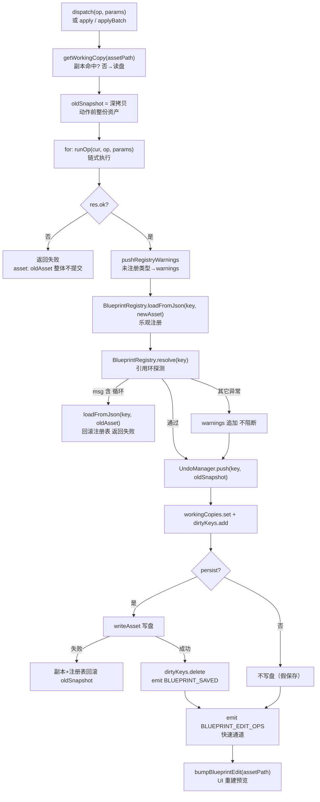
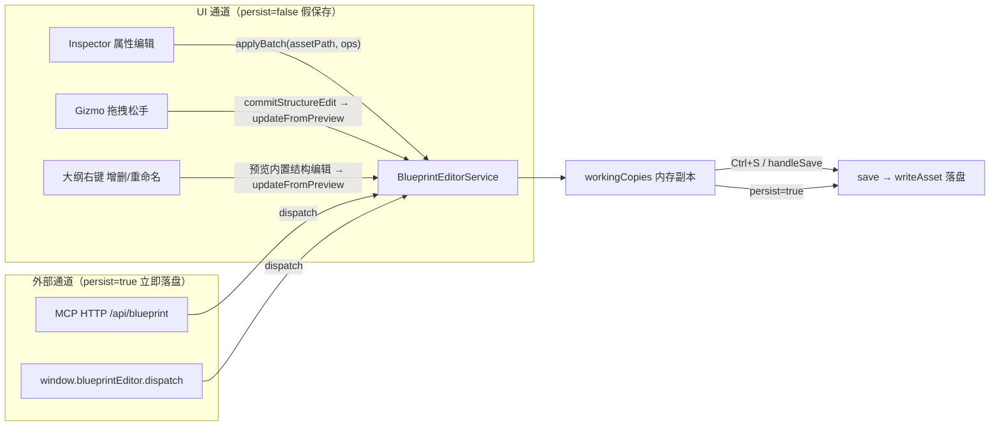

# 蓝图编辑系统（Editor Blueprint Edit）

> **一句话定位**：蓝图资产（`.blueprint.json` / `.widget.json`）的**唯一写入闸门**——把「改 JSON 字段」变成一组带校验的结构化 op，统一管工作副本、撤销栈、注册表与写盘。
>
> **什么时候会用到你**：Inspector 改一个组件属性、Gizmo 拖完松手、大纲右键增删/重命名节点、Ctrl+S 保存、外部 AI 经 MCP 改蓝图、控制台 `window.blueprintEditor` 脚本改资产、排查「改了没生效 / 撤销回到错误状态 / 关页签后修改还在 / 报引用环」。
>
> 代码位置：`src/editor/blueprintEdit/`

---

## 1. 先记住这几个文件

| 文件 | 一句话职责 | 你要改它的场景 |
|---|---|---|
| [BlueprintEditorService.ts](../../../src/editor/blueprintEdit/BlueprintEditorService.ts) | 编排层：`dispatch` / `apply` / `applyBatch` / `save` / `undo` / `redo` | 加新 op、改持久化语义、改校验与回滚策略 |
| [blueprintOps.ts](../../../src/editor/blueprintEdit/blueprintOps.ts) | 纯函数 op 集：直接改 `BlueprintAsset` 结构并返回 `OpResult` | 新增/修改某个 op 的实际数据结构改动 |
| [UndoManager.ts](../../../src/editor/blueprintEdit/UndoManager.ts) | 快照式撤销栈（全资产整份 JSON 快照，上限 50） | 改撤销粒度/栈深，排查栈分裂 |
| [windowApi.ts](../../../src/editor/blueprintEdit/windowApi.ts) | 暴露 `window.blueprintEditor`（脚本通道） | 给脚本/调试加新入口 |

**关键心智模型**：调用方**永远不直接碰 JSON 文件**，统一走 `dispatch(op, params)` 或 `apply(assetPath, op, params)`。服务层持有一份**内存工作副本**，UI 编辑只改副本（假保存），只有 `persist=true`（MCP/脚本）或显式 `save()` 才落盘。

**第二个心智模型**：`apply` 不是「执行一个 op」，它是 `applyBatch` 的单元素包装。一次调用 = **一个撤销点 + 一次 bump 重建**，无论里面塞了几个 op。

---

## 2. 主链路：一次 `applyBatch` 从入口到生效



### 2.1 谁调用了它

三条通道，两类持久化语义：

| 通道 | 入口 | persist | 代码位置 |
|---|---|---|---|
| UI 交互 | `BlueprintEditorService.apply / applyBatch` | **false**（假保存） | `Inspector.tsx:146` |
| MCP（外部 AI） | `electronAPI.onBlueprintRequest` → `dispatch` | **true** | `EditorInitializer.ts:639` |
| 脚本 | `window.blueprintEditor.dispatch` | **true** | `windowApi.ts:45` |

MCP 通道在主进程侧是 HTTP 往返（`electron/main.ts:1865` 收 `POST /api/blueprint`），渲染进程处理完回传：

```ts
if (window.electronAPI.onBlueprintRequest) {
  blueprintMcpCleanup = window.electronAPI.onBlueprintRequest(async (requestId, op, params) => {
    let result
    try {
      result = await BlueprintEditorService.dispatch(op, params ?? {})
    } catch (err) {
      result = { ok: false, error: String(err) }
    }
    window.electronAPI?.sendBlueprintResponse(requestId, result)
  })
}
```

`try/catch` 包住整段是为了**不让异常吞掉 HTTP 响应**——没有它，渲染进程一抛错 `requestId` 永远收不到回包，主进程侧只能等 20s 超时（见 §7）。

### 2.2 入口 `dispatch`：op 的分流规则

```ts
static async dispatch(op: string, params: Record<string, unknown> = {}): Promise<BlueprintEditResult> {
  if (op === 'listTypes') return { ok: true, types: this.listTypes() }
  if (op === 'read') {
    const assetPath = params.assetPath as string | undefined
    if (!assetPath) return { ok: false, error: 'read 需要 assetPath' }
    return this.read(assetPath)
  }
  const assetPath = params.assetPath as string | undefined
  if (!assetPath) return { ok: false, error: `${op} 需要 assetPath` }
  // 外部入口（MCP / window API）：保持"立即落盘"语义
  if (op === 'save') return this.save(assetPath)
  if (op === 'undo') return this.undo(assetPath)
  if (op === 'redo') return this.redo(assetPath)
  // 关闭资产：清理工作副本/撤销栈并恢复注册表到磁盘版本（与页签关闭同语义）
  if (op === 'close') {
    this.closeAsset(assetPath)
    return { ok: true, types: this.listTypes() }
  }
  return this.apply(assetPath, op, params, { persist: true })
}
```

注意 `listTypes` 和 `read` 在取 `assetPath` **之前**就分流了——只有这两个 op 允许不带 `assetPath`。最后一行是全文最关键的一句：**dispatch 兜底的所有 op 都带 `persist: true`**，这就是「MCP/脚本改一下就落盘、UI 改一下只在内存」差异的全部来源。

### 2.3 op 是怎么注册的：`runOp` 的 switch

op 没有注册表，没有 `registerOp()`。所谓「注册」就是**在 `runOp` 的 switch 里加一个 case**（`BlueprintEditorService.ts:136`），它负责把外部传来的扁平参数归一化后转调 `blueprintOps` 的纯函数：

```ts
export function runOp(asset: BlueprintAsset, op: string, p: Record<string, unknown>): OpResult {
  switch (op) {
    case 'addComponent':
      return ops.addComponent(asset, (p.baseClass ?? p.type) as string, (p.properties ?? p.props) as PropertyPatch | undefined, p.id as number | undefined, p.name as string | undefined)
    case 'removeComponent':
      return ops.removeComponent(asset, (p.baseClass ?? p.type) as string)
    case 'setComponentProps':
      return ops.setComponentProps(asset, (p.baseClass ?? p.type) as string, (p.properties ?? p.patch ?? p.props) as PropertyPatch)
    case 'addChildToParent': {
      const parentName = typeof p.parentName === 'string' && p.parentName ? p.parentName : null
      return ops.addChildToParent(asset, parentName, pickChildDef(p))
    }
    case 'removeChildDeep':
      return ops.removeChildDeep(asset, p.name as string)
    case 'renameChildById':
      return ops.renameChildById(asset, p.id as number, p.newName as string)
    case 'updateChild': {
      const loc = pickLocator(p)
      if (!loc) return { ok: false, error: 'updateChild 需要 name 或 index 定位' }
      return ops.updateChild(asset, loc, pickChildDef(p))
    }
    default:
      return { ok: false, error: `未知操作: ${op}` }
  }
}
```

**加一个新 op 要做三件事**：在 `blueprintOps.ts` 写纯函数 → 在 `runOp` switch 加 case → （可选）在 `logParams` 加一行日志摘要。漏第三步不影响功能，但 applyBatch 的开始日志会退化成「参数键名列表」，排查时看不出改了什么。

两个归一化辅助函数值得记住，它们决定了 op 参数的宽容度：

```ts
function pickChildDef(p: Record<string, unknown>): BlueprintChildDef {
  if (p.child && typeof p.child === 'object') return p.child as BlueprintChildDef
  const def: BlueprintChildDef = {}
  if (typeof p.ref === 'string') def.ref = p.ref
  if (typeof p.baseClass === 'string') def.baseClass = p.baseClass
  if (typeof p.name === 'string') def.name = p.name
  if (p.overrides && typeof p.overrides === 'object') def.overrides = p.overrides as PropertyPatch
  return def
}

function pickLocator(p: Record<string, unknown>): ChildLocator | null {
  if (typeof p.index === 'number') return { index: p.index }
  if (typeof p.name === 'string' && p.name) return { name: p.name }
  return null
}
```

`pickChildDef` **刻意不读 `p.position` / `p.rotation` / `p.scale`**——这是「组件优先约定」的强制点：新子节点的位置必须写在 `transform`/`uitransform` 组件的 properties 里，顶层 transform 字段已废弃。`pickLocator` 让 `updateChild` / `removeChild` / `setChildComponentProps` 同时接受 `index`（数组下标）和 `name`（具名合并键）两种定位。

### 2.4 `applyBatch` 内部做的 6 件事

**① 建工作副本 + 拍动作前快照**

```ts
const wc = await this.getWorkingCopy(assetPath)
if (!wc.ok) return { ok: false, error: wc.error, types: this.listTypes() }
const { key } = wc
const oldAsset = wc.asset
// 动作前快照（深拷贝），供撤销回退（所有 op 共用一个快照 = 原子撤销）
const oldSnapshot = JSON.parse(JSON.stringify(oldAsset)) as BlueprintAsset
```

`getWorkingCopy` 命中内存副本就直接返回，**不重新读盘**——这保证连续编辑是叠加的，不会互相覆盖。`oldSnapshot` 是**整份资产**的动作前深拷贝，不是单字段 diff：这是「一次 applyBatch = 一个撤销点」的实现基础，也是内存开销的来源（大蓝图每个撤销点都是一份完整 JSON）。

**② 链式执行 op，任一失败整体不提交**

```ts
let cur: BlueprintAsset = oldAsset
const warnings: string[] = []
for (const { op, params } of ops) {
  const res = runOp(cur, op, params ?? {})
  if (!res.ok) {
    logger.warn(`[BlueprintEdit] applyBatch 被拒: ${op} → ${key}: ${res.error}（整体不提交）`)
    return { ok: false, error: `${op}: ${res.error}`, asset: oldAsset, types: this.listTypes() }
  }
  cur = res.asset!
  warnings.push(...(res.warnings ?? []))
}
```

`cur = res.asset!` 把上一个 op 的结果喂给下一个——**链式**而非各自作用于原资产。某个 op 失败时直接 return，此时 `workingCopies` 还没被 `set`，所以「整体不提交」是天然的，不需要额外回滚。错误信息拼成 `${op}: ${res.error}` 是为了让调用方知道批量里挂的是哪一个。

**③ 乐观注册 + 引用环探测（唯一会主动回滚的校验）**

```ts
BlueprintRegistry.loadFromJson(key, newAsset)
try {
  BlueprintRegistry.resolve(key)
} catch (e) {
  const msg = String((e as Error)?.message ?? e)
  if (msg.includes('循环')) {
    // 命中环：回滚注册表与副本，不提交
    BlueprintRegistry.loadFromJson(key, oldAsset)
    logger.warn(`[BlueprintEdit] applyBatch 回滚（引用环）: → ${key}: ${msg}`)
    return { ok: false, error: `蓝图引用存在循环: ${msg}`, asset: oldAsset, types: this.listTypes() }
  }
  // 非环异常（通常是依赖了尚未注册的蓝图）→ 仅告警
  warnings.push(`resolve 探测跳过（可能依赖尚未注册的蓝图）: ${msg}`)
}
```

这段有三个反直觉设计：

- **先 `loadFromJson` 再 `resolve`** 叫「乐观注册」。不注册就没法探测环，但注册本身有副作用（覆盖注册表里的资产），所以失败必须 `loadFromJson(key, oldAsset)` 手动还原。
- **靠 `msg.includes('循环')` 判定环**，不是靠错误类型。判据来自引擎侧 `BlueprintRegistry.resolveChildren` 抛的 `检测到 Blueprint ref 循环引用: ${chdef.ref}`（`BlueprintRegistry.ts:96`）。改那条消息文本会直接打断这里——**这是通过字符串耦合的隐式契约**。
- **非环异常只告警不阻断**。典型场景是依赖了尚未注册（可能稍后延迟注册）的蓝图，此时阻断会误伤。

**④ 提交副本 + 撤销点 + 脏标记**

```ts
UndoManager.push(key, oldSnapshot)
this.workingCopies.set(key, newAsset)
this.dirtyKeys.add(key)
```

顺序是固定的：先 `push`（`UndoManager.push` 内部会清空 redo 栈），再改副本，再标脏。三行都在同一个同步块里，中间没有 await，所以不存在「撤销点进了但副本没改」的中间态。

**⑤ 写盘（`persist=true` 才有）+ 失败回滚**

```ts
if (persist) {
  const written = await writeAsset(assetPath, newAsset)
  if (!written.ok) {
    // 写盘失败：回滚副本 + 注册表
    this.workingCopies.set(key, oldSnapshot)
    BlueprintRegistry.loadFromJson(key, oldAsset)
    logger.error(`[BlueprintEdit] applyBatch 写盘失败，回滚: ${key}: ${written.error}`)
    return { ok: false, error: written.error, asset: oldAsset, types: this.listTypes() }
  }
  this.dirtyKeys.delete(key)
  editorBus.emit(EditorEvent.BLUEPRINT_SAVED, assetPath)
}
```

注意这里回滚**没有 `UndoManager.pop`**——撤销点是 ④ 已经 push 进去的。严格说这会留下一个「撤销后内容没变」的空撤销点，这是已知的不完美处。写盘成功后才 `dirtyKeys.delete` 并发 `BLUEPRINT_SAVED`，页签上的未保存星标靠这个事件清掉。

**⑥ 快速通道广播 + bump 重建**

```ts
try {
  editorBus.emit(
    EditorEvent.BLUEPRINT_EDIT_OPS,
    assetPath,
    ops.map((o) => ({ op: o.op, params: JSON.parse(JSON.stringify(o.params ?? {})) as Record<string, unknown> })),
  )
} catch (e) {
  logger.warn(`[BlueprintEdit] 快速通道广播异常（忽略，走常规重建）: ${key}: ${e}`)
}

useEditorStore.getState().bumpBlueprintEdit(assetPath)
```

先广播 ops 让打开的预览**就地应用**（免销毁重建，保住相机/选中/大纲展开），`bumpBlueprintEdit` 再无条件触发一次 nonce 递增。「先广播后 bump」的顺序不能反：广播必须在重建发生前到达，否则预览实例已经被销毁了。`params` 每次都深拷贝是因为**消费方会持有这份引用**（预览管理器会把它写进自己的 jsonTree）。整个广播包在 `try/catch` 里且只 warn——快速通道是纯优化，炸了必须退化到常规重建而不是让编辑失败。

### 2.5 快速通道的取舍：谁能就地应用

预览管理器 `applyEditOps`（`BlueprintPreviewManager.ts:638`）自己再判一次能不能吃：

```ts
const STRUCTURAL = new Set([
  'addComponent', 'removeComponent', 'addChild', 'addChildToParent', 'addChildToParentById',
  'updateChild', 'removeChild', 'removeChildDeep', 'removeChildById',
  'renameChildDeep', 'renameChildById', 'setBaseClass', 'replace',
])
if (ops.some((o) => STRUCTURAL.has(o.op))) return false
// 属性类 op 白名单：其余 op 一律回退（含未识别 op，安全兜底）
const PROPAGATE = new Set(['setComponentProps', 'setChildComponentProps', 'setPosition', 'setRotation', 'setScale'])
if (!ops.every((o) => PROPAGATE.has(o.op))) return false
```

**结构类 op 一律回退重建**——树身份变了，就地应用的风险（actor 引用失效、映射错位）远大于收益。第二行是**白名单而非黑名单**：未识别的新 op 默认回退，安全兜底。所以新增属性类 op 时如果不把它加进 `PROPAGATE`，功能照常工作，只是每次编辑都走全量重建（表现为相机/选中丢失、大蓝图卡顿）。

### 2.6 关闭资产：为什么必须异步读盘

```ts
static closeAsset(assetPath: string): void {
  const key = diskPathToAssetKey(assetPath)
  this.workingCopies.delete(key)
  this.dirtyKeys.delete(key)
  UndoManager.clear(key)
  // 恢复注册表到磁盘版本（apply 时注册表被更新为修改版，必须回滚）
  readAsset(assetPath).then((read) => {
    if (read.ok) {
      BlueprintRegistry.loadFromJson(key, read.asset)
      logger.info(`[BlueprintEdit] 关闭资产，注册表已恢复磁盘版本: ${key}`)
    } else {
      logger.warn(`[BlueprintEdit] 关闭资产时读盘失败，注册表可能残留修改版: ${key}: ${read.error}`)
    }
  })
  useEditorStore.getState().markBlueprintClean(assetPath)
}
```

这是全文件最容易踩坑的设计。工作副本可以同步删，但**注册表不行**——`apply` 时 `BlueprintRegistry` 已经被改成了修改版，不还原的话「关闭未保存页签」之后重新打开，读到的还是残留的修改版，**未保存的修改会「复活」**。还原必须读盘（拿磁盘版本），而读盘是异步 IPC，所以 `closeAsset` 是 `void` 返回、内部用 `.then` 兜着。调用方（`Viewport.tsx:578` 关页签）不 await 它。

---

## 3. 三条入口通道与两种持久化语义



### 3.1 UI 通道：假保存

Inspector 改一个属性时，构造的是**批量 ops**（`Inspector.tsx:104` 附近），而不是单个 op：

```ts
const buildProps = (c: Component, overrideKey?: string, overrideVal?: unknown) => {
  const p: Record<string, unknown> =
    (c.getPersistentProps ? c.getPersistentProps() : {}) as Record<string, unknown>
  if (overrideKey) p[overrideKey] = overrideVal
  return p
}
const makeOpParams = (baseClass: string, props: Record<string, unknown>) =>
  assetTarget.root
    ? { baseClass, properties: props }
    : { name: assetTarget.childName, baseClass, properties: props, strict: true }
const opName = assetTarget.root ? 'setComponentProps' : 'setChildComponentProps'
const ops: Array<{ op: string; params: Record<string, unknown> }> = []
if (currentComp) {
  ops.push({ op: opName, params: makeOpParams(assetTarget.baseClass, buildProps(currentComp, prop.key, v)) })
}
for (const sibling of siblingComponents ?? []) {
  if (!sibling.persistType || sibling.persistType === assetTarget.baseClass) continue
  ops.push({ op: opName, params: makeOpParams(sibling.persistType, buildProps(sibling)) })
}
BlueprintEditorService.applyBatch(assetTarget.assetPath, ops)
```

**为什么一个属性要发多个 op**：只写当前这一个 key 的话，其它持久化字段（如 `UITextComponent` 的派生系数 `fontSizeScale`）会在预览重建后丢失；改控件尺寸时不同步固化同节点文本的字号系数，重建后字号就会随新尺寸漂移。所以提交的是「当前组件全量 persistentProps + 同 Actor 其它组件的 persistentProps」。子节点 op 一律带 `strict: true`，防止 ref 子节点被误建成覆盖节点（见 §7）。

### 3.2 Gizmo 拖拽：撤销点由预览管理器管，不走 `applyBatch`

这条链路**不经过 `applyBatch`**。拖拽松手时 `BlueprintPreviewManager.commitPreviewEdit`（`BlueprintPreviewManager.ts:519`）自己做：

```ts
UndoManager.push(key, this._lastCommitted)
// 注意：基准必须独立深拷贝（防与 _jsonTree 同引用被 collectSaveData 写回污染）
this._lastCommitted = JSON.parse(JSON.stringify(data))
// 同步工作副本（不 bump：预览已是内存最新，重建只会浪费并丢引用）
const diskPath = this._currentBlueprintDiskPath
if (diskPath) {
  await BlueprintEditorService.updateFromPreview(diskPath, data as unknown as BlueprintAsset)
}
editorBus.emit(EditorEvent.BLUEPRINT_TRANSFORM_DIRTY, diskPath ?? '')
```

拖拽**过程中每帧都不产生撤销点**，只有松手才 push 一次。基准必须深拷贝——`collectSaveData()` 是原地回写到 `_jsonTree` 的，如果 `_lastCommitted` 和 `_jsonTree` 同引用，基准会被下一次 collect 污染，撤销就回到错误状态。

结构编辑（大纲右键增删节点）走同构的 `commitStructureEdit`（`BlueprintPreviewManager.ts:841`），同样自己 `UndoManager.push` + `updateFromPreview`，区别是结尾多发一次 `bumpBlueprintEdit`（树身份变了必须重建）。

### 3.3 MCP / 脚本通道：persist=true

两者共用 `dispatch`，差别只在传输层。脚本侧（`windowApi.ts:38`）：

```ts
export function installBlueprintWindowApi(): void {
  if (typeof window === 'undefined') return
  if (window.blueprintEditor) return
  window.blueprintEditor = {
    read: (assetPath) => BlueprintEditorService.read(assetPath),
    listTypes: () => BlueprintEditorService.listTypes(),
    apply: (assetPath, op, params) => BlueprintEditorService.apply(assetPath, op, params),
    dispatch: (op, params) => BlueprintEditorService.dispatch(op, params),
  }
}
```

`if (window.blueprintEditor) return` 是**幂等守卫**——HMR 重载模块时会重复执行安装，没有它每次热更新都会换掉 window 上的对象（虽然功能等价，但持有旧引用的调试代码会失效）。注意这里的 `apply` 是**不带 persist 的**（默认 false），而 `dispatch` 走 persist=true——**同一份 API 里两个方法语义不同**，脚本里选错就会得到「改了没落盘」或「没想落盘却落了盘」。

---

## 4. 关键方法速查

| 方法 | 位置 | 干什么 | 注意 |
|---|---|---|---|
| `dispatch(op, params)` | `BlueprintEditorService.ts:574` | 统一入口，路由到 read/save/undo/redo/close/apply | 兜底分支固定 `persist: true` |
| `apply(assetPath, op, params, opts)` | `BlueprintEditorService.ts:260` | 单 op 编辑 | 只是 `applyBatch` 的包装；`persist` 默认 false |
| `applyBatch(assetPath, ops, opts)` | `BlueprintEditorService.ts:282` | 原子批量编辑（核心实现） | 全部成功才提交；一个撤销点；一次 bump |
| `runOp(asset, op, p)` | `BlueprintEditorService.ts:136` | op 名 → 纯函数（op「注册表」） | 加新 op 改这里；未知 op 返回 `未知操作: X` |
| `getWorkingCopy(assetPath)` | `BlueprintEditorService.ts:233` | 取内存副本，无则读盘建立 | 命中副本**不重新读盘**，连续编辑叠加 |
| `read(assetPath)` | `BlueprintEditorService.ts:217` | 读资产 + 确保注册 | 返回**深拷贝**，防调用方污染副本 |
| `save(assetPath)` | `BlueprintEditorService.ts:387` | flush 工作副本落盘 | 无副本直接失败；**不 bump**（调用方决定时机） |
| `undo / redo(assetPath)` | `BlueprintEditorService.ts:490` / `:510` | 快照回退 + 重建预览 | 无历史返回 `没有可撤销的历史` |
| `closeAsset(assetPath)` | `BlueprintEditorService.ts:544` | 清副本/脏标记/撤销栈 + 恢复注册表 | **异步读盘**收尾，返回 void，不能 await |
| `clearCache()` | `BlueprintEditorService.ts:564` | 清空全部副本与撤销栈 | 切换工程时调（`Viewport.tsx:181`） |
| `isDirty(assetPath)` | `BlueprintEditorService.ts:530` | 副本是否与磁盘不一致 | 只看 `dirtyKeys`，不比对文件内容 |
| `updateFromPreview(assetPath, data)` | `BlueprintEditorService.ts:473` | 预览内存态兜底同步进副本 | **不写盘、不产生撤销点、不 bump** |
| `commitPreviewTransform(...)` | `BlueprintEditorService.ts:424` | 拖拽松手批量提交 | **当前无调用方**，见 §6 坑 6 |
| `pushRegistryWarnings(...)` | `BlueprintEditorService.ts:597` | 未注册类型软告警 | 只补 warnings，不阻断 |
| `diskPathToAssetKey(diskPath)` | `BlueprintEditorService.ts:54` | 磁盘路径 → 注册 key（`asset/...`） | 找不到 `/asset/` 原样返回 |
| `installBlueprintWindowApi()` | `windowApi.ts:38` | 安装 `window.blueprintEditor` | 幂等守卫；`apply` 与 `dispatch` 语义不同 |
| `UndoManager.push/undo/redo` | `UndoManager.ts:33` / `:45` / `:54` | 快照栈操作 | push 会**清空 redo**；栈深上限 50 |
| `addComponent / setComponentProps` | `blueprintOps.ts:73` / `:123` | 组件增删改 | 本地无该 type 时新建（继承覆盖语义） |
| `setChildComponentProps` | `blueprintOps.ts:504` | 子节点组件属性 | `strict=true` 时找不到子节点直接失败 |
| `setPosition / setRotation / setScale` | `blueprintOps.ts:580` / `:585` / `:590` | 根变换 | **写入 transform 组件**，资产缺变换组件则失败 |
| `validateAssetShape(a)` | `blueprintOps.ts:54` | 资产顶层形状校验 | 只查 `name` / `baseClass` 非空 |
| `validateChildDef(child)` | `blueprintOps.ts:159` | 子节点定义校验 | 顶层 position/rotation/scale **硬拒绝** |
| `uniqueNodeName / nextChildId` | `nodeTemplates.ts:379` / `:388` | 唯一命名 / 唯一 id | 调用方负责，服务层不保证 |

---

## 5. 流程影响：牵动哪些功能

### 上游：谁驱动它

| 上游 | 怎么驱动 | 相关文档 |
|---|---|---|
| Inspector 属性编辑 | `applyBatch(assetPath, ops)`（批量：当前组件 + 同 Actor 兄弟组件） | [属性编辑](../core/property_edit_system.md) |
| Gizmo 拖拽松手 | `commitPreviewEdit` → `UndoManager.push` + `updateFromPreview` | [选择与变换](../core/selection_transform_system.md) |
| 大纲右键结构编辑 | `addChildNode` / `removeChildNode` / 重命名 → `commitStructureEdit` | [选择与变换](../core/selection_transform_system.md) |
| MCP 调试桥 | `POST /api/blueprint` → `onBlueprintRequest` → `dispatch`（persist=true） | [MCP 集成](../integration/mcp_integration.md) |
| 脚本 / 控制台 | `window.blueprintEditor.dispatch`（persist=true） | [MCP 集成](../integration/mcp_integration.md) |
| UI 源编译（ui_compile） | `compileUiSourceToAsset` → `updateFromPreview` + `save` | [资产预览与检查](../asset/asset_preview_lint_system.md) |
| 编辑器核心启动 | `installBlueprintWindowApi()` 在 `EditorInitializer` 内安装 | [编辑器核心](../core/core_system.md) |
| 页签关闭 / 切换工程 | `closeAsset` / `clearCache` | [编辑器核心](../core/core_system.md) |

### 下游：它波及谁

| 下游功能 | 波及点 | 相关文档 |
|---|---|---|
| 撤销/重做 | `UndoManager.push(key, oldSnapshot)`；拖拽/结构编辑由预览管理器自行 push | [撤销/重做](./undo_redo_system.md) |
| 蓝图注册表 | 每次提交 `BlueprintRegistry.loadFromJson` + `resolve` 探测，命中环则回滚 | [资产与工具](../../engine/asset_tools_system.md) |
| 预览系统 | `bumpBlueprintEdit(assetPath)` → `blueprintEditNonce` 递增触发重建；快速通道可跳过 | [资产预览与检查](../asset/asset_preview_lint_system.md) |
| 资产检查 assetLint | 落盘后文件变化 → `asset-changed` → `scheduleScan`（去抖 300ms）重扫 | [资产预览与检查](../asset/asset_preview_lint_system.md) |
| 编辑器事件总线 | `BLUEPRINT_SAVED` / `BLUEPRINT_TRANSFORM_DIRTY` / `BLUEPRINT_EDIT_OPS` | [编辑器核心](../core/core_system.md) |
| 编辑器 store | `bumpBlueprintEdit` / `markBlueprintClean` 写 `blueprintEditNonce` 与 `dirtyBlueprints` | [编辑器核心](../core/core_system.md) |
| UI 源双向同步 | `save` 且路径以 `.widget.json` 结尾 → `decompileBackOnSave` 回写 `.widget.html` | [资产预览与检查](../asset/asset_preview_lint_system.md) |
| 属性编辑（下游回读） | 重建后 Inspector 依 `blueprintEditNonce` 重读资产 | [属性编辑](../core/property_edit_system.md) |

---

## 6. 踩坑清单（都是真踩过的）

**1. 关掉未保存的页签，修改还是会「复活」**

现象：编辑后不保存直接关页签，重新打开看到的还是修改版。原因：`apply` 时 `BlueprintRegistry` 已被 `loadFromJson` 改成修改版，只删工作副本不管注册表，重新打开 `loadBlueprint` 读到的就是残留。规则：`closeAsset` 必须异步读盘覆盖注册表（`BlueprintEditorService.ts:544`）；新增任何「放弃修改」入口都要照做。

**2. 撤销栈在 HMR 下会分裂成两份**

现象：热更新后撤销失效或回到错误状态。原因：Vite 下模块以裸 URL 与 `?t=` 时间戳两份实例并存，`UndoManager` 的 `static` 字段会分裂成互不可见的「幽灵副本」。规则：栈存储挂 `globalThis.__demostudioUndoStacks`（`UndoManager.ts:29`），不要改成类内 static 字段。

**3. 拖拽提交后撤销回到错误状态**

现象：拖完松手再撤销，位置回到的不是拖动前。原因：`_lastCommitted` 基准与 `_jsonTree` 同引用，被 `collectSaveData()` 的**原地回写**污染。规则：基准必须独立深拷贝 —— `BlueprintPreviewManager.ts:541` 与 `UIPreviewManager.ts:1105` 两处注释都写明「防与 `_jsonTree` 同引用被 `collectSaveData` 写回污染」。

**4. 改控件尺寸后，同节点文本字号漂移**

现象：调整 UI 控件大小，重建预览后文字字号跟着变了。原因：只提交了变换组件，`UITextComponent` 的 `fontSizeScale` 派生系数没固化，重建时按新尺寸重算。规则：一次编辑必须批量提交**当前组件全量 `getPersistentProps()` + 同 Actor 其它组件的 persistentProps**（`Inspector.tsx:104` 附近注释），`commitPreviewTransform` 也是按「节点内所有组件」批量提交。

**5. 引用环判定靠字符串匹配**

现象：改了引擎侧报错文案后，环检测失效、脏数据被写进注册表。原因：`msg.includes('循环')` 依赖 `BlueprintRegistry.ts:96` 抛的 `检测到 Blueprint ref 循环引用: ...` 文本。规则：改那条消息必须同步改 `applyBatch` 的判定条件——这是一处隐式字符串契约。

**6. `commitPreviewTransform` 当前是死代码**

现象：以为拖拽提交走它，实际没有。原因：全仓 grep 只有定义（`BlueprintEditorService.ts:424`）没有调用方，真正路径是 `BlueprintPreviewManager.commitPreviewEdit` / `commitStructureEdit` 自行 `UndoManager.push` + `updateFromPreview`。规则：改拖拽提交逻辑**去预览管理器改**，改这个方法不会有任何效果。

**7. MCP 通道没有 try/catch 会让 HTTP 挂到超时**

现象：`/api/blueprint` 请求 20s 后才返回 504。原因：渲染进程 `dispatch` 抛异常时没人回包，主进程侧 `BLUEPRINT_REQ_TIMEOUT`（`electron/main.ts:121`，20000ms）兜底。规则：`onBlueprintRequest` 回调必须整体包 try/catch 并 `sendBlueprintResponse` 错误结果（`EditorInitializer.ts:636`）。

**8. 顶层 transform 字段已废弃，写了直接失败**

现象：`addChild` 报「顶层 position/rotation/scale 已废弃」。原因：`validateChildDef`（`blueprintOps.ts:159`）硬拒绝，`pickChildDef`（`:117`）也刻意不读这些字段；根变换由 `setTopTransform` 写进 `transform`/`uitransform` 组件的 properties。规则：位置一律写在变换组件里，这是「组件优先约定」。

**9. `window.blueprintEditor.apply` 和 `dispatch` 语义不同**

现象：脚本里调 `apply` 改了资产但磁盘没变（或反之）。原因：windowApi 的 `apply` 透传 `BlueprintEditorService.apply`（persist 默认 false），`dispatch` 走 persist=true。规则：脚本想立即落盘用 `dispatch`，想和 UI 一样假保存用 `apply`。

**10. 快速通道白名单是「允许列表」不是「排除列表」**

现象：新增属性类 op 后每次编辑都全量重建，相机/选中丢失。原因：`PROPAGATE` 用 `ops.every(...)` 判定，未识别 op 一律回退重建（`BlueprintPreviewManager.ts:652`）。规则：新增属性类 op 要同步加进 `PROPAGATE`；结构类 op 就保持回退。

---

## 7. 边界条件

| 条件 | 行为 | 怎么应对 |
|---|---|---|
| 未知 op | `runOp` default → `{ ok:false, error:'未知操作: X' }` | 检查 op 名拼写 |
| `dispatch` 编辑类 op 缺 `assetPath` | `{ ok:false, error:'X 需要 assetPath' }` | 补齐；仅 `read` / `listTypes` 可不带 |
| `applyBatch` 传入空数组 | `{ ok:false, error:'applyBatch 需要至少一个 op' }` | 调用方先判空，别发空批 |
| `applyBatch` 中任一 op 失败 | 整体不提交，返回 `asset: oldAsset` | 引擎内置原子性，无需手动回滚 |
| 命中 ref 引用环 | 回滚注册表 + 副本，返回失败，**不产生撤销点** | 改资产引用关系 |
| `resolve` 非环异常（依赖未注册蓝图） | 仅 warnings，不阻断 | 可能是延迟注册，观察即可 |
| `persist=true` 写盘失败 | 副本 + 注册表回滚旧资产 | 引擎内置；**撤销点未弹出**，可能留下空撤销点 |
| `save` 无工作副本 | `{ ok:false, error:'没有打开的工作副本（请先编辑再保存）' }` | 先 apply 建立副本 |
| `undo` / `redo` 无历史 | `{ ok:false, error:'没有可撤销/重做的历史' }` | UI 用 `canUndo` / `canRedo` 禁用按钮 |
| 撤销栈超 50 | `s.undo.shift()` 丢弃最旧 | 长会话早期历史不可恢复 |
| `setChildComponentProps` 找不到子节点且 `strict=true` | 返回失败，不新建覆盖节点 | ref 引用实例无法就地编辑，改源蓝图 |
| `setPosition` 时资产缺变换组件 | 返回失败（组件优先约定） | 先 `addComponent` 加 transform/uitransform |
| 子节点同时给 `ref` 与 `baseClass` | `validateChildDef` 报「ref / baseClass 互斥」 | 二选一 |
| 无 Electron 环境（浏览器调试） | `readAsset` / `writeAsset` 返回「需要 Electron 环境」 | `electronAPI` 不可用时全链路不可用 |
| MCP 请求渲染进程超时 | 主进程返回 504（`BLUEPRINT_REQ_TIMEOUT` 20000ms） | 检查渲染进程是否卡在 IO |
| 磁盘路径不含 `/asset/` | `diskPathToAssetKey` 原样返回，注册 key 与预览侧不一致 | 资产必须放在项目 `asset/` 下 |
| `closeAsset` 读盘失败 | 只 warn，注册表残留修改版 | 重新打开页签前手动确认文件内容 |
| 落盘后 | `asset-changed` → `scheduleScan`（去抖 300ms）→ 新违规进检查面板 | 无需手动触发 |
