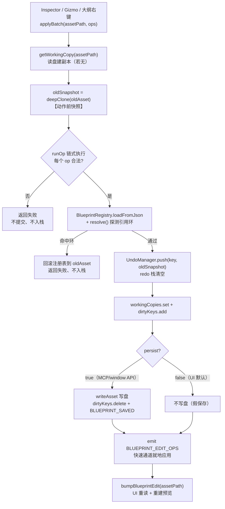

# 蓝图撤销/重做系统（Blueprint Undo/Redo）

> **一句话定位**：以蓝注册 key（`asset/...`）为粒度的**整份资产快照栈**——编辑前把资产深拷贝入栈，撤销/重做时把快照**原地回写**到正在运行的预览 Actor 上，全程不碰磁盘。
>
> **什么时候会用到你**：新增任何一条会改蓝图的编辑入口（必须决定「什么时候 push 快照」）、排查「撤销没反应 / 撤销栈不增长 / 撤销后视角或选中丢失 / 撤销后又变回来」、理解「页签带 `*` 但关闭却不弹窗」。
>
> 代码位置：`src/editor/blueprintEdit/UndoManager.ts`、`src/editor/blueprintEdit/BlueprintEditorService.ts`、`src/editor/asset/BlueprintPreviewManager.ts`、`src/components/BlueprintEditor.tsx`

---

## 1. 先记住这几个文件

| 文件 | 一句话职责 | 你要改它的场景 |
|---|---|---|
| [UndoManager.ts](../../../src/editor/blueprintEdit/UndoManager.ts) | 纯内存双栈（undo/redo），只管存取快照 | 改栈容量、加去重/合并策略、加新查询方法 |
| [BlueprintEditorService.ts](../../../src/editor/blueprintEdit/BlueprintEditorService.ts) | 编排层：`applyBatch` 里 push 动作前快照；`undo/redo/save/closeAsset` 维护工作副本与脏标记 | 加新编辑入口、改落盘时机、改关闭语义 |
| [BlueprintPreviewManager.ts](../../../src/editor/asset/BlueprintPreviewManager.ts) | 预览侧执行者：`_lastCommitted` 基准、`commitPreviewEdit` 提交、`_applySnapshotInPlace` 原地回滚 | 改拖拽提交逻辑、改回滚策略、改基准推进规则 |
| [BlueprintEditor.tsx](../../../src/components/BlueprintEditor.tsx) | UI 联动：快捷键、按钮禁用态、重建后恢复相机/选中 | 加撤销入口、改按钮状态刷新时机 |

> widget 资产（`.widget.json`）走 [UIPreviewManager.ts](../../../src/editor/asset/UIPreviewManager.ts)，场景资产走 [ScenePreviewManager.ts](../../../src/editor/asset/ScenePreviewManager.ts)，三者撤回系统与 `BlueprintPreviewManager` **同构同栈**（方法名一致），本文以蓝图为主线，差异处会点名。

**关键心智模型**：这是**快照式**撤销，不是命令式（不存「反向操作」）。快照是**动作的「前」状态**——`push` 进去的是「编辑之前长什么样」，所以 `undo` 直接把这份旧资产套回去就行，不需要知道刚才做了什么操作。代价是每次编辑都存一份整资产深拷贝（栈上限 50 份）。

第二个反直觉点：**撤销有两条执行路径，UI 走的是「不重建」那条**。

| 路径 | 入口 | 是否重建预览 | 谁在用 |
|---|---|---|---|
| 预览侧原地回滚 | `BlueprintPreviewManager.undo()` | **否**（原地回写 Actor） | UI 快捷键 / 撤销按钮（主路径） |
| 服务层整份替换 | `BlueprintEditorService.undo()` | 是（`bumpBlueprintEdit`） | MCP / `window.blueprintEditor` |

---

## 2. 栈结构：快照是什么、存在哪

### 2.1 栈的定义与 globalThis 挂载

```ts
const MAX_STACK = 50

interface AssetStacks {
  undo: unknown[]
  redo: unknown[]
}

function clone<T>(v: T): T {
  return JSON.parse(JSON.stringify(v)) as T
}

/**
 * 栈存储挂到 globalThis：Vite/HMR 下模块会以裸 URL 与 `?t=` 时间戳两份实例并存
 * （ScenePreviewManager 热更新后 import 到的是 `?t=` 版本，与其他组件的裸版本不同实例），
 * 类内 static 字段会分裂成互不可见的"幽灵副本"。挂全局保证任意模块图共享同一份栈。
 */
const g = globalThis as typeof globalThis & { __demostudioUndoStacks?: Map<string, AssetStacks> }
const stacks: Map<string, AssetStacks> = (g.__demostudioUndoStacks ??= new Map())
```

① **快照就是资产的纯 JSON**。`clone` 用 `JSON.parse(JSON.stringify(...))` 深拷贝——蓝图资产本来就是可 JSON 化的结构（Actor 节点树 + 组件 `properties`），没必要写结构化克隆。深拷贝是必须的：不拷的话栈里存的是工作副本的同一引用，后续编辑会**顺带改写历史里的快照**，撤销就撤不回去了。

② **栈挂 `globalThis` 而不是 `static` 字段**，这是踩过坑的写法。Vite 热更新时，改动过的模块会以带 `?t=` 时间戳的 URL 重新加载，而没改动的文件仍持有裸 URL 的旧模块——**同一个文件在内存里存在两份实例**。类内 `static` 字段跟着类走，于是分裂成两份互不可见的栈：从 A 模块 `push`，在 B 模块 `depth()` 读到 0，症状是「push 明明执行了，撤销按钮却一直是灰的」。挂到 `globalThis` 后，无论哪个模块图访问到的都是同一个 `Map`（`??=` 保证首次创建、后续复用）。

### 2.2 push / undo / redo：三个动作的实际语义

```ts
export class UndoManager {
  /** 操作前调用：保存动作前快照（自动清空 redo） */
  static push(key: string, snapshot: unknown): void {
    let s = stacks.get(key)
    if (!s) {
      s = { undo: [], redo: [] }
      stacks.set(key, s)
    }
    s.undo.push(clone(snapshot))
    if (s.undo.length > MAX_STACK) s.undo.shift()
    s.redo.length = 0
  }

  /** 撤销：传入当前状态（压入 redo 栈），返回要恢复的快照；无历史返回 null */
  static undo(key: string, current: unknown): unknown | null {
    const s = stacks.get(key)
    if (!s || s.undo.length === 0) return null
    const snap = s.undo.pop()!
    s.redo.push(clone(current))
    return clone(snap)
  }

  /** 重做：传入当前状态（压回 undo 栈），返回要恢复的快照；无重做记录返回 null */
  static redo(key: string, current: unknown): unknown | null {
    const s = stacks.get(key)
    if (!s || s.redo.length === 0) return null
    const snap = s.redo.pop()!
    s.undo.push(clone(current))
    return clone(snap)
  }
```

③ **注意 `undo(key, current)` 要传「当前状态」**。栈本身不知道资产现在什么样，是调用方把当前状态喂进来压进 redo 栈的——这就是为什么「撤销 → 重做」能原样回来。这也意味着 `undo` 有副作用：调一次就同时改了两个栈。

④ **`push` 里 `s.redo.length = 0`** 是标准撤销语义：撤销几步之后一旦产生新编辑，原来的 redo 分支就作废了。忘了清就会出现「撤销后改一下，再重做跳到一个从没见过的状态」。

⑤ **返回前再 `clone` 一次**（`return clone(snap)`）。入栈时已经拷过了，这里为什么又拷？因为应用方（见 §3.3）会把快照对象**直接占为新的 `_jsonTree`**，如果返回的是栈里那个对象，后续编辑就改在栈内元素上，redo 栈里同一对象的另一份引用也会跟着变。栈内元素必须与外泄对象彻底隔离。

### 2.3 栈的生命周期：谁清它

| 时机 | 调用 | 位置 |
|---|---|---|
| 关闭蓝图页签 | `UndoManager.clear(key)` | `BlueprintEditorService.closeAsset` |
| 场景预览销毁 | `UndoManager.clear(this._undoKey)` | `ScenePreviewManager.dispose` |
| 关闭配置页签 | `UndoManager.clear(undoKey(assetPath))` | `ConfigEditor.tsx` |
| 切换工程 | `UndoManager.clearAll()` | `BlueprintEditorService.clearCache` |

`clear` 是 `stacks.delete(key)`——整条历史连同 redo 一起消失，重新打开页签是**干净的零历史状态**，不复用上次的撤销记录。

---

## 3. 主流程：一次编辑是怎么变成撤销点的



### 3.1 push 的时机：op 全部成功之后、提交之前

```ts
    const wc = await this.getWorkingCopy(assetPath)
    if (!wc.ok) return { ok: false, error: wc.error, types: this.listTypes() }
    const { key } = wc
    const oldAsset = wc.asset
    // 动作前快照（深拷贝），供撤销回退（所有 op 共用一个快照 = 原子撤销）
    const oldSnapshot = JSON.parse(JSON.stringify(oldAsset)) as BlueprintAsset
```

① 快照在 **`runOp` 之前**抓，在 **`runOp` 成功之后**入栈。顺序不能反：如果先 push 再跑 op，op 一旦失败栈里就多了一个「和现在一样」的空撤销点，用户撤销一次什么都没变。

② 批处理（一次改多个组件属性）**共用一个快照**，所以 `undo` 一次把所有 op 一起回滚。这是 `applyBatch` 存在的理由——逐 op 调 `apply` 会产生碎片化撤销点（改个控件尺寸要按三次 Ctrl+Z）。

下面这段是提交点，注意它排在引用环探测之后：

```ts
    // 提交到工作副本 + 撤销快照（动作前状态；一次批处理 = 一个撤销点）
    UndoManager.push(key, oldSnapshot)
    this.workingCopies.set(key, newAsset)
    this.dirtyKeys.add(key)
```

③ 引用环检测失败时**不入栈**（`return` 在 push 之前）：

```ts
    } catch (e) {
      const msg = String((e as Error)?.message ?? e)
      if (msg.includes('循环')) {
        // 命中环：回滚注册表与副本，不提交
        BlueprintRegistry.loadFromJson(key, oldAsset)
        logger.warn(`[BlueprintEdit] applyBatch 回滚（引用环）: → ${key}: ${msg}`)
        return { ok: false, error: `蓝图引用存在循环: ${msg}`, asset: oldAsset, types: this.listTypes() }
      }
```

一次失败的编辑不该在历史里留痕——否则用户撤销一次，看到的是「什么都没发生」，再撤销一次才回到真正的前一步。

### 3.2 拖拽提交：与基准对比去重

Gizmo 拖拽每帧只改运行时 Actor 的 transform，**不走 `apply`、不产生撤销点**；松手才提交一次：

```ts
  async commitPreviewEdit(target: Actor | null): Promise<void> {
    const key = this._undoKey
    if (!key) {
      logger.warn(`[BlueprintPreview] 拖拽提交跳过（无撤销 key，activate 未调用）`)
      return
    }
    if (!target) return
    // 先把 actor 实时 transform 回写进 jsonTree（collectSaveData 原地回写），后续对比才能取到拖拽后的值
    const data = this.collectSaveData()
    if (!data) return
    if (this._lastCommitted === null) {
      // 无基准（理论上 activate 已建立）：以当前为基准（独立拷贝），不产生撤销点
      this._lastCommitted = JSON.parse(JSON.stringify(data))
      logger.info(`[BlueprintPreview] 拖拽提交（首帧基准）: ${key}`)
      return
    }
    // 内容无变化（拖动后松手位置与基准一致）→ 跳过，避免空撤销点
    if (JSON.stringify(data) === JSON.stringify(this._lastCommitted)) {
      logger.info(`[BlueprintPreview] 拖拽提交跳过（内容无变化）: ${key}`)
      return
    }
    UndoManager.push(key, this._lastCommitted)
    // 注意：基准必须独立深拷贝（防与 _jsonTree 同引用被 collectSaveData 写回污染）
    this._lastCommitted = JSON.parse(JSON.stringify(data))
```

① **基准（`_lastCommitted`）是「最近一次已提交状态」**，由 `activate()` 首次激活时建立。它同时也是 push 的内容——因为拖拽期间工作副本从未被改过，`_lastCommitted` 就等于「这次拖拽之前的样子」。

② **对比用 `JSON.stringify` 全量比较**，而不是逐字段 diff。资产不大，全量比较最省事且不会漏字段。目的是去重：用户抓住把手抖一下又拖回原位，不该产生撤销点（撤销一次毫无变化，用户会以为撤销坏了）。

③ **基准必须是独立深拷贝**——这是本系统最容易踩的坑（详见 §6 坑 2）。`collectSaveData()` 会把实时 transform **原地写回** `_jsonTree`，如果 `_lastCommitted` 指向同一对象，它会被一起改掉，导致「对比恒等 → 永远判定内容无变化 → 从第二次编辑起再也不进栈」。

最后两行把预览态同步回服务层并通知 UI 刷新按钮：

```ts
    const diskPath = this._currentBlueprintDiskPath
    if (diskPath) {
      await BlueprintEditorService.updateFromPreview(diskPath, data as unknown as BlueprintAsset)
    }
    editorBus.emit(EditorEvent.BLUEPRINT_TRANSFORM_DIRTY, diskPath ?? '')
```

④ 走 `updateFromPreview` 而不是 `apply`——因为它**不能再 push 一次**（撤销点已经在上面 push 过了），也不 `bump`（预览已是内存最新，重建纯属浪费还会丢 Actor 引用）。

### 3.3 撤销执行：为什么不销毁重建

UI 快捷键与按钮走的是预览管理器，不是服务层：

```ts
  /** 撤销：从内存栈取动作前快照 → 原地回滚（不重建预览，actor 引用/选中/相机保持）；无可撤历史返回 false */
  undo(): boolean {
    const key = this._undoKey
    if (!key || !this.canUndo()) {
      logger.warn(`[BlueprintPreview] undo 无历史可撤: ${key ?? '无 key'}`)
      return false
    }
    const cur = this.collectSaveData() ?? this._lastCommitted
    const snap = UndoManager.undo(key, cur)
    if (snap == null) return false
    // snap 作为新基准；传入 _applySnapshotInPlace 的必须是深拷贝——原地回滚内部
    // 会把 _jsonTree 指向深拷贝快照，若与基准同引用，下次 collectSaveData
    // 原地写回又会污染基准（undo → 新编辑 → 被判"无变化"不进栈的残余路径）。
    this._lastCommitted = snap as Record<string, unknown>
    const applied = this._applySnapshotInPlace(JSON.parse(JSON.stringify(snap)) as Record<string, unknown>)
    if (!applied) {
      // 结构变更（增删节点/重命名）：注册表回滚 + 全量重建预览
      logger.info(`[BlueprintPreview] undo 结构变更 → 重建预览: ${key}`)
      BlueprintRegistry.loadFromJson(key, snap as unknown as BlueprintAsset)
      this.loadBlueprint(key, this._currentBlueprintDiskPath ?? undefined)
    }
    // 同步工作副本（不 bump）：保证服务层与预览一致（Inspector 后续 apply 不会基于旧值覆盖回滚结果）
    void this.syncWorkingCopy()
    logger.info(`[BlueprintPreview] undo: ${key}（undo 栈 ${UndoManager.depth(key).undo}）`)
    return true
  }
```

① **基准与回滚输入刻意分成两个对象**：`_lastCommitted = snap`（栈弹出来的那份），而传给 `_applySnapshotInPlace` 的是 `JSON.parse(JSON.stringify(snap))`。因为原地回滚会把 `_jsonTree` 指向传入对象，若二者同一，下次 `collectSaveData` 原地写回又把基准改了——又回到「判定无变化、不进栈」的死循环。

② **原地回滚失败才降级为重建**。`_applySnapshotInPlace` 只在结构对不上时返回 `false`（快照里有增删/重命名的节点），此时才 `loadBlueprint` 全量重建。属性与 transform 编辑是绝大多数场景，永远走原地路径。

③ **`void this.syncWorkingCopy()`** —— 故意不 await（`syncWorkingCopy` 是 async）。撤销是同步的用户操作，不能为了等一次内存赋值和注册表同步而卡住；而且后续 Inspector 编辑依赖工作副本已是回滚后状态，这个同步必须做，但不值得等。

原地回滚的核心：

```ts
  private _applySnapshotInPlace(snap: Record<string, unknown>): boolean {
    const entries = Array.from(this._actorJsonMap?.entries() ?? [])
    // 结构一致性检查：节点数一致且每个 map 节点名都能在快照树中找到唯一对应
    const snapByName = new Map<string, Record<string, unknown>>()
    const walkSnap = (node: Record<string, unknown>): boolean => {
      const name = node.name as string | undefined
      if (name) {
        if (snapByName.has(name)) return false
        snapByName.set(name, node)
      }
      const children = (node.children as Array<Record<string, unknown>> | undefined) ?? []
      for (const c of children) {
        if (!walkSnap(c)) return false
      }
      return true
    }
    if (!walkSnap(snap)) {
      logger.warn(`[BlueprintPreview] 原地回滚跳过（快照节点名缺失/重复）`)
      return false
    }
```

④ **按节点名匹配，不按索引**。快照是一棵独立的树，与运行中的 Actor 没有引用关系，唯一稳定的锚点是节点名。`walkSnap` 同时校验「名字唯一」——重名的话按名匹配会张冠李戴，直接放弃原地回滚更安全。

⑤ **这里为什么不销毁重建**？重建意味着 `dispose()` 掉整个预览再 `loadBlueprint()` 一次：WebGL 资源全部重建（卡顿），且**选中状态、Gizmo 附着、相机位姿、包围盒全部丢失**。原地回写让 Actor 对象引用保持不变，用户撤销时视角纹丝不动、选中框还在原处。这也是为什么整个回滚逻辑值得写这 80 行。

属性回写部分：

```ts
      for (const comp of actor.getAllComponents() as ActorComponent[]) {
        if (!comp.persistType) continue
        // 运行时自动生成的内部组件（透明点击层）不参与回滚
        if ((comp as unknown as { isClickOnly?: boolean }).isClickOnly) continue
        const target = jsonComps.find((c) => (c.baseClass as string | undefined) === comp.persistType)
        if (!target) continue
        const props = (target.properties ?? {}) as Record<string, unknown>
        for (const p of comp.getEditableProperties()) {
          if (p.key in props && !p.readonly) {
            try {
              p.set(props[p.key] as never)
            } catch (e) {
              logger.warn(`[BlueprintPreview] 原地回滚属性失败 ${comp.persistType}.${p.key}: ${e}`)
            }
          }
        }
      }
```

⑥ **只回写「可编辑属性」**（`getEditableProperties()` 且非 `readonly`），并且走 `p.set()` 而不是直接赋值属性——因为 `set` 会触发组件内部的重建逻辑（比如改了尺寸要重算布局）。`try/catch` 逐属性兜底：单个属性写失败不该让整棵树的回滚中断。

⑦ 跳过 `isClickOnly` 组件：那是运行时自动加的透明点击层，资产 JSON 里没有对应项，参与回滚只会被误判为「结构不匹配」。

最后收尾：

```ts
    // 同步工作副本：_jsonTree 与快照分离深拷贝（防后续 collectSaveData 原地写回污染基准）
    this._jsonTree = JSON.parse(JSON.stringify(snap)) as Record<string, unknown>
    this._rebindJsonMap()
    // gizmo 坐标轴强制刷新（hidden 页 rAF 停摆时 matrixWorld 陈旧）：重算矩阵 + 重新同步 + 立即渲染一帧
    this.scene.updateMatrixWorld(true)
    if (this.gizmo.visible) this.gizmo.syncTransform()
    this.renderer.render(this.scene, this.camera)
```

⑧ **`_jsonTree` 被整个替换后必须 `_rebindJsonMap()`**。`_actorJsonMap` 里存的还是**旧树**的节点对象引用，不重绑的话后续 `collectSaveData` 的写回全落在旧对象上，新树永远是旧值——表现为「第一次提交后，所有编辑都不再进撤销栈」。

⑨ **手动渲染一帧**：蓝图页签常驻挂载（`display:none` 切换），隐藏页的 `requestAnimationFrame` 是停摆的，`matrixWorld` 不会自动更新。不手动 `updateMatrixWorld` + `render`，Gizmo 坐标轴会停在旧位置。

### 3.4 基准从哪来：`activate`

```ts
  activate(assetPath?: string): void {
    if (assetPath) {
      this._undoKey = diskPathToAssetKey(assetPath)
      // 首次激活：建立撤回基准（加载后的未编辑状态）。基准必须是独立深拷贝，
      // 不能直接引用 _jsonTree（collectSaveData 会原地写回污染它）。
      const base = this.collectSaveData()
      if (this._lastCommitted === null && base) {
        this._lastCommitted = JSON.parse(JSON.stringify(base))
        logger.info(`[BlueprintPreview] 撤回基准建立: ${this._undoKey}`)
      }
      AssetPreviewManager.setActive(assetPath)
    }
    this.notifyChange()
    notifySelectionChange()
  }
```

`_undoKey` 在这里建立，`_lastCommitted` 只在 `null` 时建立一次（后续激活不覆盖当前基准）。这就是为什么 §6 坑 1 里重建预览后必须重新 `activate`——新实例的两个字段都是 `null`。

---

## 4. 关键方法速查

| 方法 | 位置 | 干什么 | 注意 |
|---|---|---|---|
| `UndoManager.push(key, snap)` | `UndoManager.ts:33` | 入 undo 栈、清 redo 栈、超 50 丢最旧 | **必须在 op 成功后调用**，失败编辑不入栈 |
| `UndoManager.undo(key, current)` | `UndoManager.ts:45` | 弹 undo 快照、当前态压入 redo | 有副作用（同时动两个栈）；无历史返回 `null` |
| `UndoManager.redo(key, current)` | `UndoManager.ts:54` | 弹 redo 快照、当前态压回 undo | 无 redo 记录返回 `null` |
| `UndoManager.canUndo/canRedo(key)` | `UndoManager.ts:62` / `:66` | 按钮禁用态查询 | 只查栈深，不校验 `_undoKey` |
| `UndoManager.clear(key)` | `UndoManager.ts:71` | 整条历史删除（含 redo） | 关闭页签 / 预览 dispose 时调 |
| `UndoManager.clearAll()` | `UndoManager.ts:76` | 切工程时清空全部 | — |
| `UndoManager.depth(key)` | `UndoManager.ts:81` | 返回 `{ undo, redo }` 栈深 | 调试用，日志里到处在打 |
| `BlueprintEditorService.applyBatch` | `BlueprintEditorService.ts:282` | 原子提交多 op + 唯一撤销点 + 单次 bump | `apply` 只是它的单 op 包装 |
| `BlueprintEditorService.undo/redo` | `BlueprintEditorService.ts:490` / `:510` | 服务层撤销（bump 重建） | **UI 不走这里**，MCP/window API 走 |
| `BlueprintEditorService.closeAsset` | `BlueprintEditorService.ts:544` | 清副本+脏标记+撤销栈，异步恢复注册表 | 静默丢弃，无确认弹窗 |
| `BlueprintEditorService.clearCache` | `BlueprintEditorService.ts:564` | 切工程清空全部 | 调 `UndoManager.clearAll()` |
| `BlueprintPreviewManager.activate` | `BlueprintPreviewManager.ts:1136` | 建 `_undoKey` 与 `_lastCommitted` 基准 | 重建预览后必须重新调（坑 1） |
| `BlueprintPreviewManager.commitPreviewEdit` | `BlueprintPreviewManager.ts:519` | 拖拽松手提交：对比基准去重后 push | 内容无变化跳过；不 bump |
| `BlueprintPreviewManager._applySnapshotInPlace` | `BlueprintPreviewManager.ts:878` | 原地回写属性/transform，不重建 | 结构不匹配返回 `false` 触发降级重建 |
| `BlueprintPreviewManager._rebindJsonMap` | `BlueprintPreviewManager.ts:969` | 树替换后重绑 Actor→JSON 节点引用 | 漏了会导致「编辑不再进栈」 |
| `ScenePreviewManager.commitPropertyEdit` | `ScenePreviewManager.ts:611` | 场景 Inspector 属性直改进栈 | 场景预览对应入口 |
| `ScenePreviewManager.markCommitted` | `ScenePreviewManager.ts:597` | 保存后把基准推进到已保存状态 | 基准独立深拷贝 |
| `UIPreviewManager.commitPreviewEdit` | `UIPreviewManager.ts:1082` | widget 拖拽松手提交 | 与蓝图版同构 |

---

## 5. 流程影响：牵动哪些功能

### 上游：谁驱动它

| 上游 | 怎么驱动 | 相关文档 |
|---|---|---|
| 蓝图编辑（Inspector / 大纲右键） | `applyBatch` 成功 → push 动作前快照 | [蓝图编辑](./blueprint_edit_system.md) |
| 属性编辑 | 批量改组件属性 → 一个撤销点 | [属性编辑](../core/property_edit_system.md) |
| Gizmo 拖拽 | 松手 `commitPreviewEdit`，与基准对比去重后 push | [选择与变换](../core/selection_transform_system.md) |
| 全局快捷键 | `shortcut-undo` / `shortcut-redo` 事件（Ctrl+Z / Ctrl+Y / Ctrl+Shift+Z） | [编辑器核心](../core/core_system.md) |
| MCP / window API | `dispatch('undo'\|'redo')` → 服务层 `undo/redo`（bump 重建） | [MCP 集成](../integration/mcp_integration.md) |
| 配置编辑器 | 复用同一 `UndoManager`，key 为 `cfg:${assetPath}` 前缀隔离（见 `ConfigEditor.tsx:54`） | [资产预览与检查](../asset/asset_preview_lint_system.md) |

### 下游：它波及谁

| 下游功能 | 波及点 | 相关文档 |
|---|---|---|
| 预览系统 | `_applySnapshotInPlace` 原地回滚，不销毁重建 → 选中/Gizmo/相机零丢失 | [资产预览与检查](../asset/asset_preview_lint_system.md) |
| 属性编辑快速通道 | `applyEditOps` 复用 `_applySnapshotInPlace`，成功后推进 `_lastCommitted` | [属性编辑](../core/property_edit_system.md) |
| 选择与变换 | 回滚后 `updateMatrixWorld` + `gizmo.syncTransform()` 强制刷新坐标轴 | [选择与变换](../core/selection_transform_system.md) |
| 页签 UI | `historyVersion` 驱动重查 `canUndo/canRedo`；`historyBusy` 防连点；`dirtyBlueprints` 显示 `*` | [UI 组件](../ui/ui_components_system.md) |
| BlueprintRegistry | 回滚后 `loadFromJson` + `resolve`，保证运行时 spawn 用回滚后数据 | [蓝图编辑](./blueprint_edit_system.md) |
| MCP 集成 | `dispatch` 的 undo/redo 与 UI 共享同一栈 | [MCP 集成](../integration/mcp_integration.md) |

---

## 6. 踩坑清单（都是真踩过的）

**1. 预览重建后撤销按钮失效 —— 重建必须重新 `activate`**

现象：编辑后预览重建，撤销按钮变灰、Ctrl+Z 无反应。原因：`_undoKey` / `_lastCommitted` 是**实例字段**，`loadBlueprint` 重建后新实例这两个值都是 `null`，`canUndo()` 直接返回 `false`；而 `[isTabActive, previewReady]` effect 因为 `previewReady` 的 false→true 被 React 批处理合并可能**根本不触发**。规则：创建预览的 effect 里，页签激活时**直接调** `mgr.activate(assetPath)`，不要依赖那个 effect。见 [BlueprintEditor.tsx:173-178](../../../src/components/BlueprintEditor.tsx)（源码注释已写明"不能只依赖下方 `[isTabActive, previewReady]` effect"）。

**2. 第二次编辑起再也不进栈（"内容无变化"误判）—— 基准必须与工作树是两个对象**

现象：第一次拖拽能撤销，之后所有编辑都进不了撤销栈。原因：`collectSaveData()` 会**原地写回** `_jsonTree`，若 `_lastCommitted` 与它同引用，基准被一起改写，`JSON.stringify(data) === JSON.stringify(this._lastCommitted)` 恒等成立。规则：所有给 `_lastCommitted` 赋值处（`activate` / `commitPreviewEdit` / `undo` / `redo` / `applyEditOps` / `markCommitted`）都必须 `JSON.parse(JSON.stringify(...))`。场景侧同源注释见 `ScenePreviewManager.ts:585`。

**3. `_jsonTree` 替换后不重绑 `_actorJsonMap` → 所有编辑失效**

现象：原地回滚成功后，后续拖拽/属性改动都不再产生撤销点。原因：`_applySnapshotInPlace` 末尾 `this._jsonTree = JSON.parse(JSON.stringify(snap))` 把树整个换了，但 `_actorJsonMap` 里还指向旧树的节点对象，`collectSaveData` 的写回落在已被丢弃的旧对象上。规则：树一换就必须 `_rebindJsonMap()`（按名重绑，见 `BlueprintPreviewManager.ts:969`）。

**4. HMR 后撤销栈"分裂" —— 栈必须挂 globalThis**

现象：热更新后 `push` 明明执行了（日志打了栈深），`depth()` 却读到 0，按钮始终灰。原因：Vite 下模块以裸 URL 和 `?t=` 时间戳两份并存，类内 `static` 字段分裂成互不可见的副本。规则：栈存储用 `globalThis.__demostudioUndoStacks`，`??=` 首次创建。新增任何模块级可变状态前先想一遍 HMR。

**5. 隐藏页签回滚后 Gizmo 坐标轴停在旧位置**

现象：切回页签，Gizmo 把手位置与 Actor 错位。原因：页签常驻挂载，`display:none` 时 `requestAnimationFrame` 停摆，`matrixWorld` 不更新。规则：回滚末尾手动 `scene.updateMatrixWorld(true)` + `gizmo.syncTransform()` + `renderer.render()` 补一帧（见 `BlueprintPreviewManager.ts:957-959`）。

**6. 关闭页签不弹确认，未保存修改静默丢弃**

现象：页签带 `*`，点关闭直接消失，修改没了。原因：`closeAsset` 的语义就是"丢弃"——删工作副本、删脏标记、`UndoManager.clear`、同步 `markBlueprintClean` 清星标，全程无确认分支。规则：这是**既定语义**（注释写明"重新打开同一资产时回到干净的磁盘状态，撤回历史不复用"），不要当成 bug 去加弹窗。

**7. `closeAsset` 必须异步恢复注册表，否则"关闭未保存的修改仍然生效"**

现象：关掉没保存的页签，重新打开看到的还是修改后的内容。原因：`apply` 时 `BlueprintRegistry.loadFromJson` 已把注册表改成修改版；清工作副本不会回滚注册表，重新打开 `loadBlueprint` 读到的仍是残留修改版。规则：`closeAsset` 里 `readAsset(assetPath).then(...)` 异步读盘覆盖注册表（见 `BlueprintEditorService.ts:550`，异步执行不阻塞关闭流程）。

---

## 7. 边界条件

| 条件 | 行为 | 怎么应对 |
|---|---|---|
| 无历史可撤 / 无可重做历史 | 预览侧 `undo/redo()` 返回 `false`；服务层返回 `{ ok:false, error:'没有可撤销的历史' }` | UI 用 `canUndo/canRedo` 禁用按钮，不抛异常 |
| `_undoKey` 为 `null`（未 `activate`） | `canUndo/canRedo` 返回 `false`；`commitPreviewEdit` 打警告日志并 return | 重建预览后补调 `activate`（坑 1） |
| 快照结构与当前树不匹配（增删/重命名节点） | `_applySnapshotInPlace` 返回 `false` → 降级为 `loadBlueprint` 全量重建 | 已内置降级；重建会丢选中/相机，由 UI 用 `pendingSelectRef` 恢复 |
| 快照节点名重复或缺失 | `walkSnap` 返回 `false`，放弃原地回滚 | 节点名必须唯一（资产规范约束） |
| 单个属性回写抛异常 | `try/catch` 逐属性告警，继续回写其余属性 | 看 `[BlueprintPreview] 原地回滚属性失败` 日志 |
| 拖拽后松手位置与基准一致 | 判定"内容无变化"，跳过 push | 预期行为，避免空撤销点 |
| 撤销栈超过 50 条 | 丢弃最旧快照（`s.undo.shift()`） | 引擎内置；大资产内存线性增长，可考虑增量快照 |
| 撤销/重做本身 | **不写盘**，只改内存；`dirtyKeys.add(key)` 保留脏标记 | 需显式 Ctrl+S 才落盘 |
| `ref` 引用实例（无本资产 JSON 节点） | `commitPreviewTransform` 跳过提交并告警 | 引用实例的属性要在被引用的蓝图里改 |
| 撤销后产生新编辑 | `push` 清空 redo 栈 | 标准撤销语义 |
| 浏览器调试模式 | `readJsonFile` 不可用 → `readAsset` 返回"需要 Electron 环境" | 用 Electron 环境测撤销链路 |
| 配置页签（ConfigEditor） | 复用同一 `UndoManager`，key 为 `cfg:${assetPath}` 前缀隔离 | 与蓝图栈互不干扰 |
