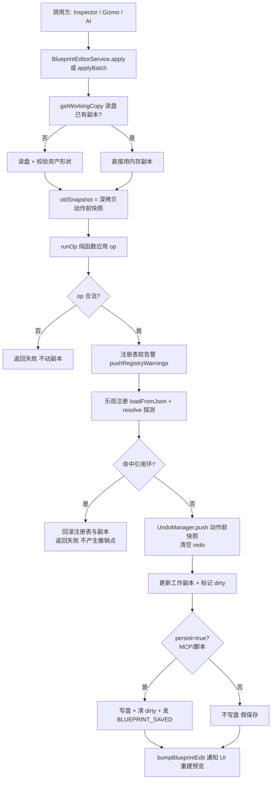

# 蓝图编辑系统（Editor Blueprint Edit）

> 蓝图资产（.blueprint.json）的编辑编排：读盘 → 应用 op → 注册表同步 → 撤销/重做。
> 代码位置：`src/editor/blueprintEdit/`
> 相关文档：[撤销/重做系统设计](../undo_redo_system.md) / [属性修改系统](./property_edit_system.md) / [系统总览](../system_overview.md)

## 1. 概述

蓝图编辑系统把 `blueprintOps` 的纯函数包装成完整编辑流程，供三类调用方共用：

- 交互式 UI（Inspector / BlueprintEditor）
- 外部 AI（经 MCP 服务器 → HTTP `/api/blueprint` → 渲染进程）
- 代码脚本（`window.blueprintEditor`）

**原则**：调用方永远不直接碰 JSON 文件，统一走 `dispatch(op, params)`。

## 2. 核心模块

| 模块 | 说明 |
|---|---|
| `BlueprintEditorService` | 编辑编排层：读盘 → 应用 op → 注册表同步 → 通知刷新。对外统一 `dispatch(op, params)` 返回 `BlueprintEditResult` |
| `UndoManager` | 快照式撤销/重做栈（每资产独立栈，上限 50 条；不碰磁盘） |
| `blueprintOps/` | 纯函数操作集：对 BlueprintAsset 结构做增删改（组件/子 Actor/默认值） |
| `windowApi.ts` | 蓝图编辑器窗口桥接（`window.blueprintEditor`） |

## 3. 使用方法

### 3.1 入口 API（BlueprintEditorService，全静态）

| 方法 | 签名 | 说明 |
|---|---|---|
| 统一入口 | `dispatch(op, params): Promise<BlueprintEditResult>` | MCP/脚本通道；`save/undo/redo/close` 走各自路径；**其余编辑 op 一律 `apply(..., { persist: true })` 立即落盘** |
| 编辑 | `apply(assetPath, op, params, opts?: { persist? })` | 委托 applyBatch；**persist 默认 false**（UI 编辑假保存） |
| 批量编辑 | `applyBatch(assetPath, ops: {op, params}[], opts?)` | **原子批量**：全部成功才提交，一个撤销点；任一失败整体不提交 |
| 读取 | `read(assetPath): Promise<BlueprintEditResult>` | 有工作副本返回副本（深拷贝防污染）；无则读盘 + 校验 + 注册 |
| 保存 | `save(assetPath)` | flush 工作副本落盘；无副本报错 |
| 撤销/重做 | `undo(assetPath)` / `redo(assetPath)` | 无历史返回 `{ ok:false, error:'没有可撤销的历史' }` |
| 关闭 | `closeAsset(assetPath)` | 清工作副本/脏标记/撤销栈 + **异步读盘恢复注册表到磁盘版本** |
| 拖拽提交 | `commitPreviewTransform(assetPath, target, jsonTree, actorJsonMap)` | 预览拖拽松手提交（批量提交节点内所有组件属性，一次拖拽一个撤销点） |
| 保存兜底 | `updateFromPreview(assetPath, data)` | 保存前同步预览内存态（不写盘、不产生撤销点） |
| 查询 | `isDirty(assetPath)` / `listTypes()` | 脏标记 / 注册表快照 `{ actors, components, blueprints }` |

### 3.2 使用示例

```ts
// Inspector 属性编辑（批量通道，一个撤销点）
BlueprintEditorService.applyBatch(assetTarget.assetPath, ops)

// Inspector 根 transform
BlueprintEditorService.apply(assetPath, 'setPosition', { position: [...] })

// MCP / 脚本（window.blueprintEditor）
window.blueprintEditor.dispatch('addComponent', { assetPath, type: 'SpriteComponent', props: {...} })

// 保存（先 updateFromPreview 兜底再 save）
BlueprintEditorService.updateFromPreview(assetPath, mgr.collectSaveData())
BlueprintEditorService.save(assetPath)
```

### 3.3 使用前提

- `apply`/`read` 前资产已注册到 `BlueprintRegistry`（未注册时 read 内部 `loadFromJson`）
- 编辑成功后统一 `useEditorStore.getState().bumpBlueprintEdit(assetPath)`（一次 bump = 一次预览重建）

## 4. 工作流程

### 4.1 编辑流程（apply）



### 4.2 校验策略（三层）

| 层级 | 策略 |
|---|---|
| 结构校验 | 在 blueprintOps 内硬阻断（非法参数直接失败） |
| 注册表校验 | 补 warnings（未注册类型可能是延迟注册，不阻断） |
| 继承/引用环 | 乐观注册后 resolve 探测；命中环则回滚并返回失败 |

### 4.3 写盘失败回滚

`persist=true` 时写盘失败 → 副本恢复 oldSnapshot + 注册表恢复 oldAsset（`'写盘失败，回滚'`）。

## 5. 边界条件

| 条件 | 行为/后果 | 处理方式 |
|---|---|---|
| 未知 op | `{ ok: false, error: '未知操作: X' }` | 检查 op 名 |
| `dispatch` 缺 assetPath（编辑类 op） | `'X 需要 assetPath'` | 补齐参数 |
| `save` 无工作副本 | `'没有打开的工作副本（请先编辑再保存）'` | 先 apply 建立副本 |
| `undo`/`redo` 无历史 | `{ ok: false, error: '没有可撤销/重做的历史' }` | UI 用 canUndo/canRedo 禁用按钮 |
| applyBatch 任一 op 失败 | 整体不提交，返回 `{ ok:false, error:'${op}: ${res.error}', asset: oldAsset }` | 引擎内置原子性 |
| 蓝图 ref 循环引用 | resolve 探测命中 → 回滚注册表与副本，不产生撤销点 | 引擎内置 |
| resolve 非环异常（依赖未注册蓝图） | 仅 warning（设计容错，可能延迟注册） | 引擎内置 |
| 写盘失败 | 副本 + 注册表回滚旧资产 | 引擎内置 |
| 无 Electron 环境 | `'读取蓝图需要 Electron 环境（readJsonFile 不可用）'` | 仅编辑器环境可用 |
| 未注册组件类型/Actor 类/ref | 仅 warnings 不阻断（可能延迟注册） | 引擎内置 |
| `commitPreviewTransform` ref 实例 | 无 JSON 节点可映射 → warn 跳过，不产生无效撤销点 | 引擎内置 |
| 无 diskPath 的预览 | `commitPreviewEdit` 静默跳过拖拽提交 | loadBlueprint 传 diskPath |

## 6. 依赖关系

```
BlueprintEditorService → blueprintOps / UndoManager / BlueprintRegistry
BlueprintEditorService → ComponentRegistry / ActorRegistry（注册表快照与校验）
BlueprintEditorService → editorBus（BLUEPRINT_* 事件）
windowApi → BlueprintEditorService（window.blueprintEditor 暴露）
MCP 服务器 → HTTP /api/blueprint → windowApi（AI 通道）
```
