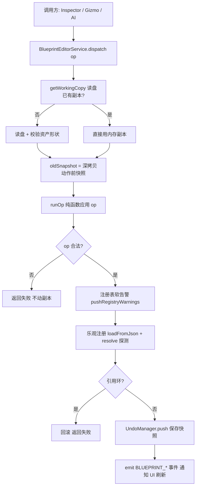

# 蓝图编辑系统（Editor Blueprint Edit）

> 蓝图资产（.blueprint.json）的编辑编排：读盘 → 应用 op → 注册表同步 → 撤销/重做。
> 代码位置：`src/editor/blueprintEdit/`
> 相关文档：[撤销/重做系统设计](../undo_redo_system.md) / [系统总览](../system_overview.md)

## 1. 概述

蓝图编辑系统把 `blueprintOps` 的纯函数包装成完整编辑流程，供三类调用方共用：

- 交互式 UI（Inspector / BlueprintEditor）
- 外部 AI（经 MCP 服务器 → HTTP `/api/blueprint` → 渲染进程）
- 代码脚本（`window.blueprintEditor`）

**原则**：调用方永远不直接碰 JSON 文件，统一走 `dispatch(op, params)`。

## 2. 核心模块

| 模块 | 说明 |
|---|---|
| `BlueprintEditorService` | 编辑编排层：读盘 → 应用 op → 注册表同步 → 通知刷新。对外统一 `dispatch(op, params)` 返回 `BlueprintEditResult` |
| `UndoManager` | 快照式撤销/重做栈（每资产独立栈，上限 50 条；不碰磁盘） |
| `blueprintOps/` | 纯函数操作集：对 BlueprintAsset 结构做增删改（组件/子 Actor/默认值） |
| `windowApi.ts` | 蓝图编辑器窗口桥接（`window.blueprintEditor`） |

## 3. 核心接口

### BlueprintEditResult

```ts
interface BlueprintEditResult {
  ok: boolean
  error?: string
  asset?: BlueprintAsset        // 操作后的资产（失败时为回滚后的旧资产）
  warnings?: string[]
  types?: BlueprintTypes        // actors / components / blueprints 注册表快照（供 AI 选型）
}
```

### 校验策略（三层）

| 层级 | 策略 |
|---|---|
| 结构校验 | 在 blueprintOps 内硬阻断（非法参数直接失败） |
| 注册表校验 | 补 warnings（未注册类型可能是延迟注册，不阻断） |
| 继承/引用环 | 乐观注册后 resolve 探测；命中环则回滚并返回失败 |

## 4. 编辑流程



## 5. 撤销/重做

快照式撤销：每次编辑前把完整资产 JSON 深拷贝保存为快照，撤销/重做就是"整份资产替换"。

| 决策 | 说明 |
|---|---|
| 假保存（persist=false） | UI 编辑只改内存工作副本 + 撤销栈，不写盘；显式保存（Ctrl+S / MCP 调用）才落盘 |
| 按资产独立栈 | 以蓝图注册 key 为粒度维护独立撤销/重做栈，多页签互不干扰 |
| 上限 50 条 | 超出丢弃最旧快照 |
| 操作前快照 | `push` 保存动作前状态；`undo` 弹出恢复 |
| 新操作清空 redo | 标准撤销语义 |
| 关闭即丢弃 | 关闭页签/切工程清空缓存 |

> 完整设计见 [doc/undo_redo_system.md](../undo_redo_system.md)

## 6. 依赖关系

```
BlueprintEditorService → blueprintOps / UndoManager / BlueprintRegistry
BlueprintEditorService → ComponentRegistry / ActorRegistry（注册表快照与校验）
BlueprintEditorService → editorBus（BLUEPRINT_* 事件）
windowApi → BlueprintEditorService（window.blueprintEditor 暴露）
MCP 服务器 → HTTP /api/blueprint → windowApi（AI 通道）
```
