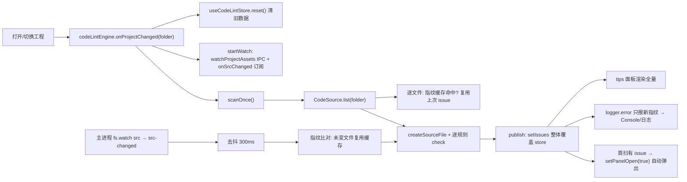

# 代码扫描检查系统（CodeLint）

> 扫描工程 TS 源码中违反项目约定的写法（addComponent 旧写法、裸 new THREE），架构完全对称 assetLint（插件式高扩展）。
> 右下角状态栏入口与 tips 面板为**代码 + 资产检查共用**：`CodeLintPanel` 分节渲染 `codeLint` 问题与 `assetLint` 问题（详见 §4.4）。
> 代码位置：`src/editor/codeLint/` + Electron 通道 `electron/main.ts` / `electron/preload.ts` + UI `src/components/CodeLintPanel.tsx` / `src/stores/useCodeLintStore.ts`
> 相关文档：[系统总览](../system_overview.md) / [资产预览与检查](./asset_preview_lint_system.md) / [编辑器核心](./core_system.md)

## 1. 概述

DemoStudio 有两类"检查器"守护资产与代码的约定：

| 检查器 | 扫描对象 | 位置 | 技术 |
|---|---|---|---|
| `assetLint` | JSON 资产（scene/blueprint/widget/config） | `src/editor/asset/assetLint/` | JSON schema + walk |
| `codeLint` | 工程 TS 源码（`src/projects/<folder>/**`） | `src/editor/codeLint/` | TypeScript 轻量 AST（不建 Program） |

codeLint 解决的问题：项目约定（如"组件添加改用类版 `addComponent(Xxx, ...)`"、"项目代码禁止裸 `new THREE.Xxx`，程序化生成必须走 World 工厂/引擎组件"）此前只能靠人工遵守，无工具守护。codeLint 在**打开工程时自动全扫**、**保存源码后增量重扫**，发现违规自动弹 tips 面板并输出 Console，新增规则只需"新建 checker 文件 + barrel 加一行 import"，引擎/注册中心/面板零改动。

责任分工：

| 角色 | 职责 |
|---|---|
| `CodeLintEngine` | 单例引擎：工程切换全扫 + `src-changed` 去抖增量重扫 + 指纹缓存 + 防重入 + 结果发布 |
| `CodeSource` | 源码来源：Electron 磁盘扫描 / 浏览器 Mock 同签名实现（复用 allFileKeys + fetch ?raw）/ 无 API 静默禁用 |
| `CodeCheckerRegistry` | 检查器注册中心（幂等自注册 + barrel 副作用注册） |
| `AbstractCodeChecker` | 规则基类：子类声明 kind + 实现 `check(sourceFile, ctx)` |
| `useCodeLintStore` | 独立 zustand store：`issues`（代码）全量 + `assetIssues`（资产）全量 + 面板开合状态 |
| `CodeLintPanel` / `StatusBar` | tips 悬浮面板 + 状态栏入口（计数徽标；代码 + 资产合计） |
| Electron 主进程 | `list-project-src` / `read-text-file` IPC + `fs.watch` 推送 `src-changed` |

与相邻功能边界：JSON 资产校验归 `assetLint`（[asset_preview_lint_system.md](./asset_preview_lint_system.md)），codeLint 只扫 `.ts/.tsx`（排除 `.d.ts`），不扫 `src/engine/`、`src/editor/` 自身。

## 2. 核心模块

| 模块 | 说明 |
|---|---|
| `CodeLintEngine.ts` | 检查核心引擎（模块级单例，事件驱动，无定时器；对齐 AssetLintEngine） |
| `CodeCheckerRegistry.ts` | 检查器注册中心（幂等，同 kind 只保留首次） |
| `AbstractCodeChecker.ts` | 规则基类（kind + check + posOf 行列推导工具） |
| `CodeSource.ts` | 源码来源（ElectronCodeSource：Electron/Mock 同通道 / NullCodeSource 兜底） |
| `types.ts` | `CodeIssue` / `CheckerContext` / `CodeFileEntry` 类型 |
| `checkers/` | 内置规则检查器 barrel（addComponent / bareThree） |
| `useCodeLintStore.ts` | UI 状态 store（`issues` / `assetIssues` 整体覆盖 + panelOpen） |
| `CodeLintPanel.tsx` | tips 悬浮面板（不占布局，状态栏上方；分节渲染代码 + 资产问题） |

## 3. 使用方法

### 3.1 入口 API

```ts
// src/editor/codeLint/CodeLintEngine.ts
export const codeLintEngine = new CodeLintEngine()
codeLintEngine.start()                  // 启动：订阅工程切换 + 当前工程首扫（幂等）
codeLintEngine.scheduleScan(delay?)     // 去抖触发一次扫描（默认 300ms）
codeLintEngine.scanOnce(): Promise<void> // 立即扫描一次（防重入）
codeLintEngine.clearCache()             // 清指纹缓存（下次扫描全量重报）
codeLintEngine.stop() / destroy()       // 停监听 / 彻底清理（模块单例跟随应用生命周期）

// 新增规则（零改引擎）：
// 1. 新建 src/editor/codeLint/checkers/YourChecker.ts：
//    class YourChecker extends AbstractCodeChecker { readonly kind = 'yourRule'; check(sf, ctx) {...} }
//    registerCodeChecker('yourRule', YourChecker)
// 2. src/editor/codeLint/checkers/index.ts 加一行 import './YourChecker'
```

### 3.2 调用示例

```ts
// Editor.init() 内启动（与 assetLintEngine.start() 并列）
codeLintEngine.start()

// 面板与状态栏只订阅 store，不直接调引擎
const issues = useCodeLintStore((s) => s.issues)            // 最近一次扫描的全部代码违规
const assetIssues = useCodeLintStore((s) => s.assetIssues)  // 最近一次扫描的全部资产违规（AssetLintEngine 发布）
const panelOpen = useCodeLintStore((s) => s.panelOpen)
useCodeLintStore.getState().setPanelOpen(true)       // 手动展开 tips
```

### 3.3 触发时机

| 时机 | 动作 |
|---|---|
| 打开/切换工程 | `onProjectChanged` → 清面板旧数据 → 建监听 + 全量扫描 |
| 保存 `.ts/.tsx` 源码 | 主进程 `fs.watch` 去抖 300ms → `src-changed` → 增量重扫（指纹未变文件跳过 AST） |
| 打开工程首扫完成且有 issue | tips 面板自动弹出（同一工程后续重扫不重复弹） |

### 3.4 使用前提

- 引擎由 `Editor.init()` 启动（`src/editor/Editor.ts`）；规则集随引擎模块加载经 barrel 自注册
- Electron 环境需要主进程新 IPC（`list-project-src` / `read-text-file` / `src-changed`）；`typescript` 为 devDependency，dev 模式运行可用（vite build 打包前需迁移到 dependencies，本次不做）
- 浏览器 dev 由 `MockElectronAPI` 提供同签名 `listProjectSrc` / `readTextFile`（枚举复用其既有 `allFileKeys` 按 folder 过滤、内容用 `import.meta.glob ?raw` loader 读纯文本——**不能 fetch `/path?raw`**，Vite dev 对 `.ts` 的 `?raw` 响应是模块代码 `export default "..."` 包装而非原始文本）

## 4. 工作流程

### 4.1 主流程



### 4.2 分阶段说明

| 阶段 | 触发点 | 关键调用 | 产物 |
|---|---|---|---|
| 环境选择 | 模块加载 | `createCodeSource()` | ElectronCodeSource（`electronAPI` 有 `listProjectSrc`+`readTextFile`，Electron 与 Mock 同通道）/ NullCodeSource（静默禁用） |
| 监听建立 | 工程切换 | `window.electronAPI.watchProjectAssets(folder)` + `onSrcChanged` | 主进程双 watcher（asset + src），src 变化推送 `src-changed` |
| 文件列举 | 每次扫描 | `source.list(folder)` | `CodeFileEntry[]`（`{path, text}` 或 `{path, error}`） |
| 指纹判定 | 逐文件 | `hashOf(text)`（djb2）比对 `fileCache` | 未变文件跳过 AST 直接复用 issue |
| AST 校验 | 变化/新增文件 | `ts.createSourceFile`（ScriptTarget.Latest，不 setParentNodes，tsx 用 ScriptKind.TSX）+ 全部注册 checker 的 `check()` | `CodeIssue[]` |
| 结果发布 | 全部文件扫完 | `publish()` | store 覆盖 issues + logger 增量上报 + 自动弹面板 |

### 4.3 设计要点

- **数据流向**：主进程 fs.watch → `src-changed` → CodeLintEngine → CodeSource 读文本 → createSourceFile → checkers → `useCodeLintStore`（面板）与 `logger`（Console/日志文件）双通道输出
- **双通道读源码**：Electron 走 IPC `list-project-src` + `read-text-file`（真磁盘扫描）；浏览器 dev 由 `MockElectronAPI` 提供同签名实现——枚举复用其既有 `allFileKeys`（keys-only glob，assetLint 资产枚举已在用）按 folder 前缀过滤、内容用 `import.meta.glob ?raw` loader 按需读纯文本。两条通道产出一致的 `{path, text}` 结构，path 统一为 `src/projects/...` 形式；codeLint 自身不注册全工程 glob，避免把其它工程源码卷进 Vite 模块图（引发无关工程增删文件整页刷新 / 打包体积膨胀）
- **source 惰性创建**：`CodeLintEngine` 的 CodeSource 在首次扫描时才解析环境（`window.electronAPI` 在浏览器 Mock 注入于 `main.tsx`，晚于所有静态 import 模块求值）——若在模块加载时创建会拿到 NullCodeSource 导致 0 文件
- **指纹缓存增量**：`fileCache: Map<path, {hash, issues}>`；内容指纹未变直接复用上次 issue 跳过 AST 解析；`knownFingerprints` 集合做 log 级去重（Console 只报新增，面板显示全量）
- **弹窗不打扰**：`autoShownFolder` 记录已自动弹过的工程——同一工程后续重扫（如保存文件）不重复弹，手动收起后不打扰；切换工程才重置
- **日志定位约定**：`[CodeLint] <相对路径>:<行>:<列> <message>`，一律 `logger.error`（无 severity 分级）
- **全局守卫**：`started` 幂等 + `globalThis.__codeLintUnsub__` 守卫（StrictMode 双挂载 / HMR 只保留一份 store 订阅与监听）

### 4.4 资产检查共用面板（AssetLint 发布）

右下角"代码/资产检查"是 codeLint 与 assetLint 的**共用入口**，资产问题由 `AssetLintEngine` 发布到同一 store：

- **发布链路**：`AssetLintEngine.reportNew(all)` 开头整体覆盖 `useCodeLintStore.getState().setAssetIssues(all.map(toAssetIssueView))`（`toAssetIssueView` 把 `LintIssue` 映射为 `{file, nodePath, field, rule, severity, message}` 视图结构）；`onProjectChanged` 开头先 `setAssetIssues([])` 清空旧工程数据
- **无 store 依赖方向问题**：store 是独立模块，AssetLintEngine 单向 import store（与 CodeLintEngine 一致）；`StatusBar`/`CodeLintPanel` 仍只订阅 store，不感知数据来源
- **面板分节渲染**：标题"代码/资产检查 CodeLint + AssetLint"；`代码问题（N）` / `资产问题（N）` 两个分节（`.codelint-section` + `.codelint-section-title` sticky 顶）；资产项 key 前缀 `asset-`，定位格式 `file > nodePath [field]`，规则类 `asset-sev-error`（--error 红）/ `asset-sev-warn`（#f0a500 黄）
- **状态栏计数**：`totalIssueCount = codeLintIssueCount + assetLintIssueCount`，徽标显示合计，title 含"（代码 X · 资产 Y）"
- **复制全部**：`copyAll` 合并代码行与资产行（`[规则] message` + 定位行）

## 5. 边界条件

| 条件 | 行为/后果 | 处理方式 |
|---|---|---|
| 无工程打开 | `scanOnce` 静默跳过（folder 为 null） | 引擎内置 |
| 文件读不到/非 UTF8 | 单条 `read` issue（`rule: 'read'`），不中断全扫 | 修复文件 |
| 语法解析异常 | `logger.warn` + 单条 `parse` issue，跳过该文件继续 | 修复文件 |
| 文件被删除 | `pruneDeleted` 从缓存移除，issue 自然消失 | 引擎内置 |
| 保存未修改内容的文件 | 指纹不变 → 复用缓存跳过 AST，不重复报错 | 引擎内置 |
| 无 `electronAPI`（打包环境等） | `createCodeSource` 返回 NullCodeSource，`list` 返回空列表，静默不报错不阻塞 | 引擎内置 |
| 重复 start / 重复注册 checker | 幂等忽略 | 引擎/注册中心内置 |
| 切换工程瞬间旧通知 | `src-changed` 回调比对 `watchedFolder`，不匹配忽略 | 引擎内置 |
| 关闭工程 | `stopWatchProjectAssets` 主进程关闭全部 watcher + 引擎退订 | 引擎内置 |
| `addComponent` 别名/变量间接调用 | 不追踪（只匹配直链 `xxx.addComponent(new ...)` 语法） | 已知限制 |
| `import * as T from 'three'; new T.Mesh` | 不报（仅直链 `new THREE.Xxx`） | 按需求约定的已知限制 |
| `new THREE.Vector3/Color/Plane/CanvasTexture` 等 | 不报（数学工具类/纹理类不在黑名单，不属于"创建几何体"；World 工厂无对应方法） | 规则只匹配 `Mesh` / `*Geometry` / `*Material` |
| 保存 `.d.ts` | 主进程 watch 与 list 均排除声明文件 | 双端过滤 |
| JSON 资产变化 | 只触发 `asset-changed`（src watcher 按扩展名过滤），codeLint 不重扫 | 双通道隔离 |

## 6. 依赖关系 / 注册机制

```
CodeLintEngine → CodeSource → window.electronAPI（listProjectSrc / readTextFile / onSrcChanged / watchProjectAssets）
CodeLintEngine → useEditorStore（currentProject.folder）/ useCodeLintStore / logger
AssetLintEngine → useCodeLintStore（setAssetIssues 全量发布，共用面板）
CodeLintEngine → CodeCheckerRegistry → checkers barrel（副作用注册，engine 模块加载即生效）
CodeLintPanel / StatusBar → useCodeLintStore（订阅渲染，不直接调引擎）
Electron main → fs.watch(src/projects/<folder>) → src-changed → preload.onSrcChanged → CodeLintEngine
```

注册机制：`registerCodeChecker(kind, Ctor)` 幂等自注册（同 kind 只保留首次），barrel `checkers/index.ts` 触发各 checker 模块副作用注册，与 `AssetCheckerRegistry` 范式一致。
