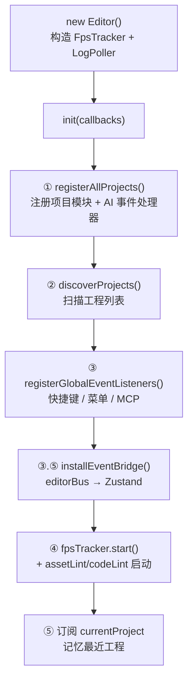
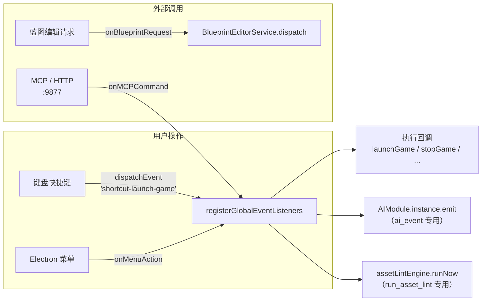

# 编辑器核心系统（Editor Core）

> **一句话定位**：编辑器核心是「UI 层（React）」与「底层能力」之间的**唯一装配点**——它不实现具体功能，只负责把各个子系统接起来、把底层事件翻译成 UI 能订阅的状态。
>
> **什么时候会用到你**：新增编辑器级功能（新菜单/快捷键/AI 事件）、排查「功能没生效/事件没响应/面板不刷新」、理解编辑器启动到底做了什么。
>
> 代码位置：`src/editor/Editor.ts`、`src/editor/EditorInitializer.ts`、`src/editor/EditorEvents.ts`、`src/editor/EditorEventNames.ts`

---

## 1. 先记住这三个文件

新人只需要先认三个文件，其余遇到再看：

| 文件 | 一句话职责 | 你要改它的场景 |
|---|---|---|
| [Editor.ts](../../../src/editor/Editor.ts) | 生命周期主人：`init` 按顺序把子系统拉起来，`destroy` 收摊 | 加一个「随编辑器启动/停止」的东西 |
| [EditorInitializer.ts](../../../src/editor/EditorInitializer.ts) | 装配工：注册项目、装事件桥接、注册 AI 事件处理器、接 Electron 菜单与 MCP | 加菜单项 / MCP 命令 / AI 事件 |
| `EditorEventNames.ts` + `EditorEvents.ts` | 事件字典：定义底层能发哪些事件 | 加一个新的编辑器事件 |

**关键心智模型**：底层模块（SelectionManager、BlueprintEditorService…）**只发事件不碰 UI**；`EditorInitializer` 把事件翻译成 Zustand store 更新；React 组件订阅 store 自动重渲染。这是个**单向流**，反着走就会死循环。

---

## 2. 启动流程：从 `new Editor()` 到能用

### 2.1 谁调用了它

`App.tsx` 在 `useEffect([])` 里调一次（**必须保证只调一次**，见 §5 坑 1）：

```ts
const editor = new Editor()
editor.init({
  addConsoleOutput,
  setShowProjectSelector,
  launchGame: () => { /* gameState 判断启动/停止 */ },
  stopGame,
  setAppInfo,
  setLoading,
})
```

### 2.2 `init` 内部做的 6 件事



逐段讲代码（[Editor.ts](../../../src/editor/Editor.ts) `init` 方法）：

**① 注册项目 + AI 事件处理器**

```ts
registerAllProjects(addConsoleOutput)
```

内部两件事（`EditorInitializer.ts` 底部）：

```ts
export function registerAllProjects(log: InitLogger = console.log): void {
  registerAllProjectModules(log)          // 委托 projects/registry.ts 自动扫描注册
  if (!_editorAIHandlersInstalled) {      // 模块级标记，HMR 重载后仍幂等
    _editorAIHandlersInstalled = true
    registerEditorAIHandlers()
  }
}
```

> **为什么有个 `_editorAIHandlersInstalled` 标记**：HMR 重载模块时变量会重置，但 `AIModule` 是单例、旧处理器还在。没有这个标记，处理器会累积（历史上 `ai.selectActor` 累积到过 10 个，一次 emit 执行 10 遍）。`registerEditorAIHandlers` 内部还额外做了 `ai.clearEvent('ai.selectActor')` 双保险。

**② 扫描工程**

```ts
const { discoverProjects } = useProjectStore.getState()
void discoverProjects()
```

注意 `void`——**故意不 await**。启动时不自动恢复上次工程，改为弹出全屏选择器让用户选。这是异步的，别在这里假设工程已就绪。

**③ 接全局事件（快捷键 / Electron 菜单 / MCP）**

```ts
const cleanupEvents = registerGlobalEventListeners({ ... })
this.cleanupFns.push(cleanupEvents)   // 收集清理函数，destroy 时统一执行
```

**③.⑤ 装事件桥接**（这是新人最容易忽略、又最该懂的一段）

```ts
export function installEventBridge(): () => void {
  const unsubs: Array<() => void> = []
  unsubs.push(editorBus.on(EditorEvent.SELECTION_CHANGED, () => {
    useEditorStore.getState().bumpSelectionNonce()
  }))
  unsubs.push(editorBus.on(EditorEvent.BLUEPRINT_TRANSFORM_DIRTY, (path: string) => {
    useEditorStore.getState().markBlueprintDirty(path)
  }))
  unsubs.push(editorBus.on(EditorEvent.BLUEPRINT_SAVED, (path: string) => {
    useEditorStore.getState().markBlueprintClean(path)
  }))
  return () => unsubs.forEach((u) => u())
}
```

只有 3 条映射，但覆盖了「选中 / 脏标记 / 保存」三类最常用的 UI 反馈。**要加新的底层→UI 通知，就在这里加一行。**

**④ 启动轮询与检查器**

```ts
this.fpsTracker.start((info) => {
  setAppInfo({ renderFps: info.renderFps, logicFps: info.logicFps, project: info.projectName })
  const gs = useEditorStore.getState().gameState
  if (window.electronAPI?.reportGameState) {        // 可选链：浏览器模式静默跳过
    window.electronAPI.reportGameState({ running: gs.running, score: gs.score })
  }
})
assetLintEngine.start()   // 资产格式检查（单例）
codeLintEngine.start()    // 代码扫描检查（单例）
```

**⑤ 记忆当前工程**

```ts
const unsubProject = useEditorStore.subscribe((state, prev) => {
  if (state.currentProject !== prev.currentProject && state.currentProject) {
    useEditorPrefsStore.getState().setLastProject(state.currentProject.folder)
    useEditorPrefsStore.getState().pushRecent(state.currentProject.folder)
  }
})
this.cleanupFns.push(unsubProject)
```

### 2.3 收摊：`destroy()`

```ts
destroy(): void {
  this.fpsTracker.stop()
  this.logPoller.destroy()
  // 资产检查器为模块级单例，生命周期跟随整个应用，此处不停止
  this.cleanupFns.forEach((fn) => fn())
  this.cleanupFns = []
}
```

**注意**：`assetLintEngine` / `codeLintEngine` **故意不停**——它们是模块级单例，跟随整个应用生命周期。重复 `init`/`destroy` 不会重复启动它们。

---

## 3. 事件与命令是怎么流进来的

这是本系统最实用的部分。三条入口路径：



### 3.1 快捷键：走 `window` 事件

`registerGlobalEventListeners` 里注册的 6 个（都在 `window` 上）：

| 事件名 | 动作 |
|---|---|
| `shortcut-toggle-console` | 开关控制台 |
| `shortcut-open-project` | 弹工程选择器 |
| `shortcut-new-project` | 仅打印日志（未实现） |
| `shortcut-launch-game` | 启动游戏 |
| `shortcut-stop-game` | 停止游戏 |
| `shortcut-toggle-agent` | `electronAPI.dshOpenAgentWindow()` |

### 3.2 MCP 命令：`onMCPCommand` 的 switch

支持这些命令（完整清单见 [MCP 集成](../integration/mcp_integration.md)）：

| 命令 | 做什么 | 是否往返 |
|---|---|---|
| `start_game` / `launchGame` | 启动游戏，可带 `params.project` 指定工程 | 否 |
| `stop_game` / `stopGame` | 停止游戏 | 否 |
| `toggle_game` | 同 `launchGame` | 否 |
| `ai_event` | `AIModule.instance.emit(event, payload)` | **是**（requestId） |
| `run_asset_lint` | `assetLintEngine.runNow(folder)` | **是** |
| `run_code_lint` | `codeLintEngine.runNow(folder)` | **是** |
| `ai_list_events` | 列出已注册 AI 事件 | **是** |
| `ui_compile` | 编译 `.widget.html` 源 | 是 |
| `send_input` | 合成 `KeyboardEvent` | 否 |

**`start_game` 有个 600ms 等待**，这是踩过坑的设计：

```ts
if (needWait) await new Promise((r) => setTimeout(r, 600))
onLaunchGame()
```

原因：切换工程会触发 Viewport 的停止流程（异步 effect），不等它完成就启动会竞争。带 `project` 参数或当前无工程时才会 `needWait = true`。

**`ai_event` 的返回值汇总逻辑**——取**最后一个非 undefined** 的结果，且兼容 async 处理器：

```ts
let ret: unknown = undefined
if (result.handled) {
  for (let i = result.results.length - 1; i >= 0; i--) {
    const r = result.results[i]
    if (r !== undefined && r !== null) {
      ret = typeof r === 'object' && r !== null && typeof (r as any).then === 'function'
        ? await (r as Promise<unknown>)
        : r
      break
    }
  }
}
```

### 3.3 AI 事件：`registerEditorAIHandlers`

注册了 **2 个事件**（`EditorInitializer.ts` 内）：

**编辑器操作类**（操作选中与 gizmo）
- `ai.selectActor` — 按名字选中 Actor，**优先查活动预览**（`AssetPreviewManager.getActivePath()`），找不到才回退场景树
- `ai.dragActor` — 拖动，支持 `position` 覆盖或 `axis + delta` 增量

> 原「文件读写类」（`ai.readJsonFile` / `ai.writeFile`）与「UI 结构化操作类」（`editor.getState` / `editor.togglePanel` 等 11 个）已于 2026-09-03 移除：编辑器控制由 demostudio-editor MCP 的 CDP 工具承担，文件读写改走主进程 MCP HTTP 直处理命令（`read_json_file` / `write_json_file`）。

最后挂了浏览器调试入口：

```ts
;(window as any).__ai = {
  emit: (event: string, payload?: unknown) => ai.emit(event, payload),
  listEvents: () => ai.listEvents(),
}
```

> Playwright 调试时用 `window.__ai.emit('ai.selectActor', { name: 'X' })` 直接触发，比走 HTTP 链路可靠。

---

## 4. 关键方法速查

| 方法 | 位置 | 干什么 | 注意 |
|---|---|---|---|
| `Editor.init(callbacks)` | `Editor.ts:38` | 编辑器启动入口 | **无幂等保护**，只能调一次 |
| `Editor.onViewportReady()` | `Editor.ts:114` | 通知 Electron 关加载窗口 | 内部 `electronAPI.sendAppReady?.()` |
| `Editor.getLogPoller()` | `Editor.ts:121` | 取日志轮询器 | Console 面板用 |
| `Editor.destroy()` | `Editor.ts:126` | 停 FPS + LogPoller + 执行 cleanupFns | 重复调用安全；**不停 lint 引擎** |
| `registerAllProjects(log)` | `EditorInitializer.ts` | 注册项目模块 + AI 处理器 | 幂等（`_editorAIHandlersInstalled`） |
| `installEventBridge()` | `EditorInitializer.ts` | editorBus → Zustand 映射 | 加新事件通知改这里 |
| `registerEditorAIHandlers()` | `EditorInitializer.ts` | 注册 15 个 AI 事件 | 内部先 `clearEvent` 防重复 |
| `registerGlobalEventListeners(cb)` | `EditorInitializer.ts` | 快捷键 + 菜单 + MCP | 返回清理函数 |

---

## 5. 流程影响：牵动哪些功能

### 上游：谁驱动它

| 上游 | 怎么驱动 | 相关文档 |
|---|---|---|
| React 应用入口 | `new Editor().init(callbacks)`，唯一启动点 | [React 面板组件](../ui/ui_components_system.md) |
| Electron 主进程 | 菜单事件 / IPC 推送 | [MCP 集成](../integration/mcp_integration.md) |
| 项目注册表 | `registerAllProjectModules` 自动扫描 | [gameplay 代码规范](../../projects/gameplay_code_standard.md) |

### 下游：它波及谁

| 下游功能 | 波及点 | 相关文档 |
|---|---|---|
| 资产检查 assetLint | `init` 内 `assetLintEngine.start()`，随应用常驻 | [资产预览与检查](../asset/asset_preview_lint_system.md) |
| 代码检查 codeLint | `codeLintEngine.start()`，与 assetLint 并列 | [代码检查](../asset/code_lint_system.md) |
| 蓝图编辑 | `installBlueprintWindowApi()` 暴露 `window.blueprintEditor`；`onBlueprintRequest` 转 `BlueprintEditorService.dispatch` | [蓝图编辑](../blueprint/blueprint_edit_system.md) |
| 选择与变换 | `ai.selectActor` / `ai.dragActor` 复用其能力 | [选择与变换](./selection_transform_system.md) |
| React 全部面板 | `installEventBridge` 把事件写进 store | [React 面板组件](../ui/ui_components_system.md) |
| 状态栏 / 控制台 | FpsTracker 上报、LogPoller 轮询 `logs/console_*.log` | [React 面板组件](../ui/ui_components_system.md) |
| Agent 面板 | `shortcut-toggle-agent` → `dshOpenAgentWindow()` | [Agent 面板](../integration/agent_panel_system.md) |
| AI 事件系统 | `ai_event` → `AIModule.instance.emit` | [AI 事件系统](../../engine/ai_system.md) |

---

## 6. 踩坑清单（都是真踩过的）

**1. `init` 没有幂等保护**

重复调用会重复注册监听。React StrictMode 下 `useEffect` 会双挂载，所以**必须**写成 `useEffect(() => { ... }, [])` 且不加任何依赖。

**2. 浏览器调试模式下大量能力静默失效**

所有 `electronAPI` 调用都是可选链（`window.electronAPI?.xxx`），浏览器里没有 `electronAPI` 就**什么都不做也不报错**。表现为：LogPoller 回调"仅支持 Electron 环境"、F12 无反应、MCP 命令收不到。用 [MockElectronAPI](../../../src/editor/MockElectronAPI.ts) 只模拟了部分能力。

**3. HMR 会让 AI 事件处理器累积**

模块重载后 `_editorAIHandlersInstalled` 重置，但 `AIModule` 单例还留着旧处理器。`registerEditorAIHandlers` 开头的 `ai.clearEvent(...)` 就是为此存在的。

**4. IPC 返回值不能带 undefined 属性**

经 IPC/MCP 往返的返回值不能带 undefined 属性（结构化克隆会直接抛错）。原 `ai.readJsonFile` / `ai.writeFile` 处理器里专门构造 `clean` 对象剔除 undefined（2026-09-03 已移除这两个事件，规则对新的 MCP 通道依然适用）。

**5. `start_game` 切换工程后必须等 600ms**

不等会和 Viewport 的停止 effect 竞争，导致启动失败或状态错乱。

**6. 控制台缓冲只保留最近 200 条**

诊断长会话问题别看控制台面板，直接读 `logs/console_*.log`。

---

## 7. 边界条件

| 条件 | 行为 | 怎么应对 |
|---|---|---|
| 浏览器模式（无 electronAPI） | 全链路可选链跳过，静默失效 | 用 Electron 环境或 `window.__ai` 桥 |
| MCP `start_game` 无项目 | 自动选第一个；都失败输出 `[MCP] start_game: 无可用项目` | 先创建项目 |
| MCP `ai_event` 缺 event | `{ status:'error', message:'缺少 event 参数' }` | 补 `event` 参数 |
| 快捷键时输入框聚焦 | `INPUT/TEXTAREA` 直接 return 不拦截 | 引擎内置防护 |
| F12 | `electronAPI?.toggleDevTools?.()`，浏览器无操作 | — |
| 未知控制台命令 | `未知命令: X。输入 help 查看可用命令。` 不抛异常 | — |
| `start_game` 已运行 / `stop_game` 未运行 | 提示 `⚠ 游戏已在运行中` / `⚠ 游戏未在运行` | — |
| 未知 MCP 命令 | 打印 `[MCP] 未知命令: X` | 检查命令名 |
