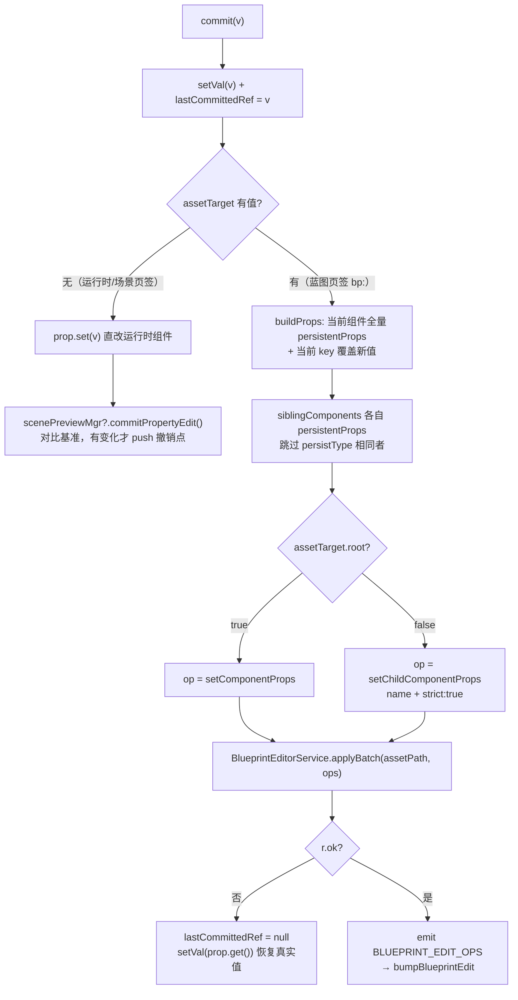

# 属性编辑系统（Inspector Property Edit）

> **一句话定位**：Inspector 把「组件里注册的可编辑属性」渲染成输入控件，并把用户输入按当前页签语义分流——蓝图页签写资产工作副本（进撤销栈），运行时/场景页签直改组件（补撤回点）。
>
> **什么时候会用到你**：给组件加一个可在 Inspector 里改的字段（改完不显示输入框 / 显示但不生效 / 撤销后丢值）、排查「改了属性没反应」「值被弹回」「颜色拖动卡死」「撤销一次只回滚一半」。
>
> 代码位置：`src/components/Inspector.tsx`、`src/engine/entity/ActorComponent.ts`、`src/editor/blueprintEdit/BlueprintEditorService.ts`、`src/editor/SelectionManager.ts`

---

## 1. 先记住这几个文件

| 文件 | 一句话职责 | 你要改它的场景 |
|---|---|---|
| [ActorComponent.ts](../../../src/engine/entity/ActorComponent.ts) | 定义 `EditableProperty` 契约 + `getEditableProperties()` / `getPersistentProps()` 默认实现 | 给组件加/改一个可编辑属性 |
| [Inspector.tsx](../../../src/components/Inspector.tsx) | 渲染属性行、`EditablePropertyInput` 各类型控件、`commit()` 双通道分流 | 加控件类型 / 改提交时机 / 改防护逻辑 |
| [BlueprintEditorService.ts](../../../src/editor/blueprintEdit/BlueprintEditorService.ts) | `applyBatch` 原子提交：改工作副本 + push 撤销快照 + 广播 | 改提交语义 / 加快捷通道 |
| [SelectionManager.ts](../../../src/editor/SelectionManager.ts) | 模块级选中状态与 `onSelectionChange` 多槽回调（Inspector 的刷新来源） | 查「Inspector 为什么不刷新」 |

**关键心智模型**：`getEditableProperties()` 是「能不能编辑」的**唯一决定权**，`getProperties()` 只决定「有没有这一行」。组件有字段、assetLint 也认这个字段，但只要没在 `getEditableProperties()` 里注册，Inspector 就只会渲染成一行灰色只读文本——而且**不报错**。

---

## 2. 显示链路：从选中到出现输入框

### 2.1 Inspector 靠什么刷新（两条通知路径的核实结论）

`SelectionManager` 是**模块级导出函数集合，不是类**。选中通知有两个入口，但只有一条能驱动 Inspector：

```ts
// SelectionManager.ts:166
export function select(obj: Selectable | null): void {
  _selected = obj
  _selectionKey++
  for (const cb of _onChangeCallbacks) cb()
  // ... gizmo 挂载逻辑 ...
  gizmos.refresh()
}

// SelectionManager.ts:217
export function notifySelectionChange(): void {
  _selectionKey++
  for (const cb of _onChangeCallbacks) cb()
  // 通过事件总线通知（不再直接耦合 Zustand store）
  editorBus.emit(EditorEvent.SELECTION_CHANGED)
}
```

两个函数都遍历同一个 `_onChangeCallbacks`（一个 `Set<() => void>` 多槽集合，Outline / Inspector / UiOutline 各自注册互不覆盖）。差别在最后一行：`select()` 额外做 gizmo 挂载并调 `gizmos.refresh()`；`notifySelectionChange()` 额外 emit `editorBus` 的 `SELECTION_CHANGED`。

Inspector 订阅的是**回调槽**，不是事件总线：

```ts
// Inspector.tsx:1008
useEffect(() => {
  const unsub = onSelectionChange(() => {
    setSelectionKey(getSelectionKey())
    // 切换选中对象时清空搜索，避免残留旧的过滤状态
    setSearchQuery('')
  })
  return unsub
}, [])
```

> **核实结论**：Inspector **靠 `onSelectionChange()` 回调刷新**，两条路径（`select()` 与 `notifySelectionChange()`）都会触发它，因为它俩都会遍历 `_onChangeCallbacks`。`editorBus` 的 `SELECTION_CHANGED` 走的是另一条路——`EditorInitializer.ts:71` 把它映射成 `useEditorStore.getState().bumpSelectionNonce()`，Inspector 从没订阅过 `selectionNonce`。所以：
> - 只 emit `editorBus` 而**不**调 `notifySelectionChange()` → Inspector 不刷新；
> - 只改 `_selected` 而不调回调 → Inspector 不刷新；
> - `getSelectionKey()` 返回 `_selectionKey + _sceneKey`，场景切换也会强制重渲染。

### 2.2 属性行：key 来自 `getProperties()`，控件来自 `getEditableProperties()`

```ts
// Inspector.tsx:329
function ComponentPropertyRow({ comp, k, v, onEdited, assetTarget, siblingComponents, scenePreviewMgr }) {
  const editable = (comp.getEditableProperties ? comp.getEditableProperties() : [])
    .find((p) => p.key === k)
  // 组件声明为非持久化的运行时派生值（persistent=false）→ 不注入资产通道，保持 prop.set
  const target = assetTarget && editable && editable.persistent !== false ? assetTarget : null
```

这段是全文最该记住的三行。**行从哪来**：父组件遍历 `comp.getProperties()` 的 `Object.entries()`，每个 key 渲染一行。**有没有框**：拿这个 `k` 去 `getEditableProperties()` 里 `find(p => p.key === k)`，找不到就渲染 `displayValue(v)` 灰色文本。

两个反直觉点：

- **`getProperties()` 的键必须和 `getEditableProperties()` 的 `key` 对得上**，对不上就静默变成只读行。所以 `getProperties()` 里的 `lineHeight`、`renderScale` 这类派生值，如果没注册可编辑属性，就只是「给你看的」。
- **`persistent: false` 不是「不落盘」而已，它同时切断了资产通道**（`target` 被置 `null`），蓝图模式下这类属性会退回 `prop.set()` 直改运行时——改完重建就没了。语义是「运行时派生值，不该写进资产」。

`EditableProperty` 还有一个旧文档漏掉的字段 `readonly`（[ActorComponent.ts:51]）：

```ts
  /**
   * 是否只读（默认 false）。true → Inspector 渲染为禁用输入框，仍显示当前值。
   * 用于由系统/视口推导、不应由用户手改的属性（如 widget 根节点的视口尺寸）。
   */
  readonly?: boolean
```

`readonly` 与「没注册」的区别：前者仍渲染成输入框（禁用 + `title="由视口比例决定，不可修改"`，值可见可复制），后者渲染成灰色文本。选哪个看你想不想让人看清这个值。

### 2.3 `assetTarget` 怎么构造出来的（决定走哪个 op）

```ts
// Inspector.tsx:384
const childName = actor.root?.name || undefined
const isRoot = !!assetPath && !actor.parent
const makeTarget = (baseClass: string): EditablePropertyAssetTarget | undefined =>
  assetPath && childName ? { assetPath, childName, baseClass, root: isRoot } : undefined
```

三个字段决定了提交时的一切：`assetPath` 来自页签 id 去掉前缀（`activeTabId.slice(3)`，`bp:` 蓝图 / `sp:` 场景预览）、`childName` 取 `actor.root.name`（大纲名，不是 Actor 名）、`root` 用 `!actor.parent` 判定。

> **为什么 `childName` 用 `actor.root.name`**：资产 JSON 里子节点是按 `name` 定位的，而场景树里用户看到的名字就是 `root.name`。两者一致才有后面按名递归查找的可能。
>
> **为什么 `root` 判 `!actor.parent`**：无 parent 的顶层 Actor 就是资产根节点，它的组件写在 `asset.components` 上，走 `setComponentProps`；其余都是 children 里的子节点，走 `setChildComponentProps`。

⚠️ 这段 `makeTarget` 在文件里出现**两次**且完全重复——[Inspector.tsx:385]（`ActorComponentsView`，正常浏览）和 [Inspector.tsx:491]（`ComponentSearchResults`，搜索过滤态）。改定位逻辑必须两处都改，否则搜索时提交会走错通道。

---

## 3. 提交链路：双通道分流 + 批量原子提交

### 3.1 `commit()` 的三条去向



分流的第一行代码：

```ts
// Inspector.tsx:97
const commit = (v: unknown) => {
  setVal(v)
  // 提交保护：在外部值确认前保持显示提交值（修复蓝图模式下复选框/输入被 useEffect 弹回）
  lastCommittedRef.current = v
  if (assetTarget) {
```

`setVal` + `lastCommittedRef` 在分流**之前**无条件执行，这是两个通道共用的乐观更新（详见 §4.3）。

### 3.2 蓝图通道为什么要批量，而不只写一个 key

```ts
// Inspector.tsx:113
      const buildProps = (c: Component, overrideKey?: string, overrideVal?: unknown) => {
        const p: Record<string, unknown> =
          (c.getPersistentProps ? c.getPersistentProps() : {}) as Record<string, unknown>
        if (overrideKey) p[overrideKey] = overrideVal
        return p
      }
      const makeOpParams = (baseClass: string, props: Record<string, unknown>) =>
        assetTarget.root
          ? { baseClass, properties: props }
          : { name: assetTarget.childName, baseClass, properties: props, strict: true }
      const opName = assetTarget.root ? 'setComponentProps' : 'setChildComponentProps'
```

```ts
// Inspector.tsx:139
      // 同 actor 其它组件：各自 persistentProps 全量持久化（跳过与当前组件重复的 baseClass）
      for (const sibling of siblingComponents ?? []) {
        if (!sibling.persistType || sibling.persistType === assetTarget.baseClass) continue
        ops.push({
          op: opName,
          params: makeOpParams(sibling.persistType, buildProps(sibling)),
        })
      }
```

**为什么不只写 `{ [prop.key]: v }`**：只写一个 key，重建后同组件其它持久化字段会读回资产里没被覆盖的旧值或与新值不匹配的派生值（源码注释点名 `fontSizeScale`）。所以提交的是「当前组件的全量 `persistentProps`，其中当前 key 用新值覆盖」。

**为什么连兄弟组件一起提交**：改 UITransform 尺寸时，同节点的 UIText 字号系数是按尺寸重算的派生量。不一起固化，重建时按新尺寸重算会导致字号漂移。兄弟组件用 `persistType` 去重（`sibling.persistType === assetTarget.baseClass` 跳过），避免和当前组件的 op 撞车。

**`strict: true` 的意义**：子节点按 name 递归定位，找不到就返回错误而**不新建节点**——防止 ref 引用实例的子节点被误建成一个空的覆盖节点。见 [blueprintOps.ts:504]：

```ts
// blueprintOps.ts:527
  if (!node) {
    if (!('name' in locator)) return fail(`子节点索引越界: ${locator.index}`)
    if (strict) {
      return fail(`子节点 "${locator.name}" 不在本资产中（可能是 ref 引用实例，无法就地编辑）`)
    }
```

递归定位本身在 [blueprintOps.ts:482]，深度优先，所以按钮里嵌的文本控件也能命中：

```ts
function findChildNodeDeep(
  children: BlueprintChildDef[] | undefined,
  name: string,
): { arr: BlueprintChildDef[]; idx: number } | null {
  if (!children) return null
  const idx = children.findIndex((c) => c.name === name)
  if (idx >= 0) return { arr: children, idx }
  for (const child of children) {
    if (!child.children || child.children.length === 0) continue
    const found = findChildNodeDeep(child.children, name)
    if (found) return found
  }
  return null
}
```

### 3.3 `applyBatch` 内部：一处失败，整体不提交

```ts
// BlueprintEditorService.ts:291
    const wc = await this.getWorkingCopy(assetPath)
    if (!wc.ok) return { ok: false, error: wc.error, types: this.listTypes() }
    const { key } = wc
    const oldAsset = wc.asset
    // 动作前快照（深拷贝），供撤销回退（所有 op 共用一个快照 = 原子撤销）
    const oldSnapshot = JSON.parse(JSON.stringify(oldAsset)) as BlueprintAsset
```

```ts
// BlueprintEditorService.ts:307
    for (const { op, params } of ops) {
      const res = runOp(cur, op, params ?? {})
      if (!res.ok) {
        logger.warn(`[BlueprintEdit] applyBatch 被拒: ${op} → ${key}: ${res.error}（整体不提交）`)
        return { ok: false, error: `${op}: ${res.error}`, asset: oldAsset, types: this.listTypes() }
      }
      cur = res.asset!
      warnings.push(...(res.warnings ?? []))
    }
```

要点逐个说：

- **快照在循环外拍一次**，不是每个 op 拍一次 → undo 一次把所有 op 一起回滚，这就是「一次编辑 = 一个撤销点」。
- **链式执行**：每个 op 应用到前一个 op 的结果上，所以 op 顺序有意义。
- **任一 op 失败立刻 `return oldAsset`**，没有半提交状态。Inspector 侧靠 `r.ok === false` 解除提交保护并 `setVal(prop.get())` 恢复真实值（§4.3）。
- **写的是工作副本，不碰磁盘**（`persist` 默认 false）。`persist=true` 只有 MCP/脚本 `dispatch` 会传；UI 编辑是「假保存」，Ctrl+S 才落盘。
- **还有一个引用环探测**：提交后 `BlueprintRegistry.resolve(key)` 抛含「循环」的异常会回滚注册表和副本，整体不提交。改 ref 引用时踩得到。

### 3.4 提交之后：快速通道优先，重建是退路

**这是旧文档完全没有的一条链路。** `applyBatch` 成功后不是直接重建，而是先广播 ops 让已打开的预览实例**就地应用**：

```ts
// BlueprintEditorService.ts:365
    try {
      editorBus.emit(
        EditorEvent.BLUEPRINT_EDIT_OPS,
        assetPath,
        ops.map((o) => ({ op: o.op, params: JSON.parse(JSON.stringify(o.params ?? {})) as Record<string, unknown> })),
      )
    } catch (e) {
      logger.warn(`[BlueprintEdit] 快速通道广播异常（忽略，走常规重建）: ${key}: ${e}`)
    }

    // 通知打开的编辑器刷新数据 + 预览（单次 bump = 单次重建）
    useEditorStore.getState().bumpBlueprintEdit(assetPath)
```

`params` 做了深拷贝隔离——消费方会持有引用并可能改写。

预览侧接住这个广播（[BlueprintEditor.tsx:89]），就地应用成功就登记 `skipNextRebuildRef`：

```ts
// BlueprintEditor.tsx:90
      const mgr = previewMgrRef.current
      if (!mgr?.applyEditOps || !previewReady) {
        // 预览未就绪（首开/重建中）：暂存，重建 effect 尾部消费；新 ops 到达时覆盖旧值
        pendingOpsRef.current = { assetPath: path, ops }
        return
      }
      const applied = mgr.applyEditOps(path, ops)
      if (applied) {
        skipNextRebuildRef.current = true
        console.log(`[BlueprintEditor] 快速通道已就地应用 ${ops.length} ops，跳过重建: ${path}`)
      }
```

`applyEditOps`（[BlueprintPreviewManager.ts:638]）自己决定要不要接：

```ts
    const STRUCTURAL = new Set([
      'addComponent', 'removeComponent', 'addChild', 'addChildToParent', 'addChildToParentById',
      'updateChild', 'removeChild', 'removeChildDeep', 'removeChildById',
      'renameChildDeep', 'renameChildById', 'setBaseClass', 'replace',
    ])
    if (ops.some((o) => STRUCTURAL.has(o.op))) return false
    // 属性类 op 白名单：其余 op 一律回退（含未识别 op，安全兜底）
    const PROPAGATE = new Set(['setComponentProps', 'setChildComponentProps', 'setPosition', 'setRotation', 'setScale'])
    if (!ops.every((o) => PROPAGATE.has(o.op))) return false
```

白名单是**双保险的兜底设计**：结构类 op 直接拒绝，非白名单 op 也拒绝（包括未来新增的、这里没列到的 op）。拿不准就不就地应用，宁可重建。

就地应用走的是 `_applySnapshotInPlace`（[BlueprintPreviewManager.ts:878]），与 undo/redo 完全同源——按节点名匹配 + 遍历 `getEditableProperties()` 调 `p.set()`，Actor 引用不变所以选中/gizmo/相机零丢失：

```ts
// BlueprintPreviewManager.ts:919
        for (const p of comp.getEditableProperties()) {
          if (p.key in props && !p.readonly) {
            try {
              p.set(props[p.key] as never)
            } catch (e) {
              logger.warn(`[BlueprintPreview] 原地回滚属性失败 ${comp.persistType}.${p.key}: ${e}`)
            }
          }
        }
```

> **这里反推出一条硬规则**：`getEditableProperties()` 不决定能不能改，它同时是**资产 → 运行时回写的唯一通道**。快速通道（属性编辑）、撤销/重做、预览重建全都靠遍历它把 JSON 值 `set` 回组件。注册了但 `set` 实现不对 → 界面上改着挺好，撤销一次就露馅。

### 3.5 真的要重建时：相机与选中怎么保住

快速通道返回 `false` 时，重建 effect 才会真的跑。恢复靠两个 `useRef`，而**保存动作写在 cleanup 里**：

```ts
// BlueprintEditor.tsx:219
    return () => {
      ro.disconnect()
      // ⚠️ 必须在 dispose() 之前保存选中：dispose() 内部 select(null) 会清空全局选中，
      // 之后 getSelectedActor() 永远返回 null → 重建后选中丢失（大纲高亮 + Inspector 重置）
      const sel = getSelectedActor()
      if (sel) lastSelectRef.current = sel.root.name
      // 重建前记忆相机位姿（重建后恢复：编辑/撤销/重做不再重置视角）
      if (previewMgrRef.current) {
        lastCamRef.current = {
          pos: previewMgrRef.current.camera.position.clone(),
          quat: previewMgrRef.current.camera.quaternion.clone(),
          zoom: previewMgrRef.current.camera.zoom,
        }
      }
      mgr.dispose()
```

**顺序是不能换的**：`mgr.dispose()` 内部会 `select(null)`，一旦先 dispose，`getSelectedActor()` 恒为 null，选中记忆就永久丢失。存的是**名字**不是 Actor 引用——Actor 马上就被销毁了，存引用只会拿到一具尸体。

恢复侧优先消费外部显式指定的，最后才用记忆值：

```ts
// BlueprintEditor.tsx:183
      const cam = pendingCamRef.current ?? lastCamRef.current
      if (cam) {
        mgr.restoreCamera(cam.pos, cam.quat, cam.zoom)
        pendingCamRef.current = null
      }
      const selName = AssetPreviewManager.takePendingSelection(assetPath) ?? pendingSelectRef.current ?? lastSelectRef.current
      if (selName) {
        pendingSelectRef.current = null
        // 通过 getActorTree() 遍历场景图查找（GetAllActors 可能漏掉递归子 Actor）
        const tree = mgr.getActorTree()
        const node = tree.find((n) => n.name === selName && n.actor)
        if (node?.actor) {
          mgr.selectActor(node.actor)
        }
      }
```

三档优先级：`takePendingSelection`（大纲右键创建/复制/重命名后自动选中新节点）→ `pendingSelectRef`（保存时显式指定）→ `lastSelectRef`（重建前记忆）。查找用 `getActorTree()` 而不是 `GetAllActors`，注释写明后者会漏掉递归子 Actor。

### 3.6 场景预览通道（`sp:` 页签）

旧文档写「游戏模式 → `prop.set` 直接改运行时组件（**不进撤销系统**）」，这句话现在不准确。`scenePreviewMgr` 是后加的第三档：

```ts
// Inspector.tsx:1000
  // 场景预览页签（sp: 前缀）：属性直改走 ScenePreviewManager.commitPropertyEdit 进撤回系统
  const isScenePreviewTab = activeTabId.startsWith('sp:')
  const scenePreviewMgr = isScenePreviewTab
    ? AssetPreviewManager.get<import('../editor/asset/ScenePreviewManager').ScenePreviewManager>(activeTabId.slice(3))
    : null
```

```ts
// Inspector.tsx:163
      prop.set(v)
      // 场景预览模式：直改已生效，补一个撤回点（对比基准有变化才 push，不重建预览）
      scenePreviewMgr?.commitPropertyEdit()
```

`commitPropertyEdit`（[ScenePreviewManager.ts:611]）先跑 `collectSaveData()` 拿到当前全量状态，和基准 `_lastCommitted` 比：内容一样（改回原值了）就不产生撤销点，不一样才 push。可选链意味着非场景页签时这行是 no-op——游戏运行时依然是真的不进撤销栈。

---

## 4. 输入框的三道防护

三个 `useRef` 各管一种历史 bug，都是「不加就会复现」的。

### 4.1 `editingRef`：聚焦中跳过外部同步

```ts
// Inspector.tsx:80
  useEffect(() => {
    if (editingRef.current) return
```

不跳过会怎样：用户输入 → `onChange` 触发 `setVal` → 重渲染 → 这个 effect 跑 → `setVal(prop.get())` 把**组件里的旧值**塞回去，光标内容被吞。每个输入框都有 `onFocus={() => { editingRef.current = true }}` / `onBlur={() => { editingRef.current = false; commit(...) }}` 成对出现。

### 4.2 `colorDebounceRef`：颜色控件 400ms 防抖

```ts
// Inspector.tsx:251
      const debouncedCommit = (v: string) => {
        setVal(v)
        if (!assetTarget) { commit(v); return } // 游戏模式即时改组件，无重建，无需防抖
        if (colorDebounceRef.current !== null) window.clearTimeout(colorDebounceRef.current)
        colorDebounceRef.current = window.setTimeout(() => {
          colorDebounceRef.current = null
          commit(v)
        }, 400)
      }
```

**为什么只有颜色需要防抖**：`<input type="color">` 拖动时 `onChange` 是连续的，而蓝图模式下每次 `commit` 都是一次 `applyBatch` → 一次重建（销毁 World + 重新实例化 + troika 字体重载）。连续拖动 = 连续全量重建 = 卡死。游戏/场景模式直改组件没有重建，所以第一行的 `if (!assetTarget)` 直接即时提交，**不为防抖牺牲即时反馈**。

注意防抖只加在 color picker 那个 `<input type="color">` 上，旁边的十六进制**文本框**走的是普通 `onBlur → commit(c)` 路径，没有防抖。

### 4.3 `lastCommittedRef`：提交窗口期的竞态保护

```ts
// Inspector.tsx:80
  useEffect(() => {
    if (editingRef.current) return
    const next = prop.get()
    const committed = lastCommittedRef.current
    if (committed !== null) {
      // 外部值已追上提交值（游戏模式立即 / 蓝图重建后）→ 解除保护，接管为外部值
      if (JSON.stringify(next) === JSON.stringify(committed)) {
        lastCommittedRef.current = null
        setVal(next)
      }
      // 否则保持提交值显示（蓝图重建完成前的窗口期）
      return
    }
    setVal((prev: unknown) => (JSON.stringify(prev) === JSON.stringify(next) ? prev : next))
  }, [prop])
```

**这个竞态是怎么来的**：蓝图模式下 `applyBatch` 只改资产工作副本，**运行时组件的值根本没动**。从 `commit` 返回到重建真正把新值 `set` 回组件，中间有一段窗口期，这段时间内 `prop.get()` 返回的还是旧值。若不加保护，下一次重渲染就会把用户刚填的值弹回旧值——表现为「改了没反应 / 点一下又跳回去」。

**解除条件是「外部值追上提交值」而不是定时器**：用 `JSON.stringify` 深度比较，追上了才解除并接管。游戏模式因为 `prop.set` 已经同步，第一次比较就相等，保护立刻解除。

**失败路径必须主动解除**，否则界面会永久停在一个没生效的假值上：

```ts
// Inspector.tsx:148
          if (!r.ok) {
            console.warn(`[Inspector] ${assetTarget.root ? '根组件' : '子控件'}属性写入资产失败: ${assetTarget.childName}.${prop.key} → ${r.error}`)
            // 写入失败：解除提交保护并恢复真实值，避免界面停留在错误的提交值上
            lastCommittedRef.current = null
            setVal(prop.get())
          }
```

最后那行 `setVal` 用**函数式更新 + JSON 值比较**：`JSON.stringify(prev) === JSON.stringify(next)` 时返回 `prev` 原引用。vec2/vec3 的值是数组，每次 `get()` 都新建，不比较引用就会陷入「setVal 新数组 → 重渲染 → effect 再 setVal」的无限循环。

### 4.4 各类型提交时机

| 类型 | 控件 | 提交时机 | 源码位置 |
|---|---|---|---|
| number | `<input type="number">` | blur / Enter（Enter 内部转 blur） | Inspector.tsx:171 |
| string | `<input type="text">` | blur / Enter | Inspector.tsx:197 |
| boolean | checkbox | 即时 `commit` | Inspector.tsx:213 |
| enum | `<select>` | 即时 `commit` | Inspector.tsx:229 |
| color | color picker | **蓝图模式 400ms 防抖**；游戏模式即时 | Inspector.tsx:251 |
| color | 十六进制文本框 | blur / Enter（无防抖） | Inspector.tsx:270 |
| vec2 / vec3 | 分量数字框 | 任一分量 blur / Enter | Inspector.tsx:282 |

`readonly` 属性全部走 `disabled` + `title="由视口比例决定，不可修改"`，提交路径不变（本来就提交不了）。

---

## 5. 落盘：`getPersistentProps()`

```ts
// ActorComponent.ts:122
  getPersistentProps(): Record<string, unknown> {
    const out: Record<string, unknown> = {}
    for (const p of this.getEditableProperties()) {
      out[p.key] = p.get()
    }
    return out
  }
```

默认实现直接遍历 `getEditableProperties()`，所以**注册即落盘**——新增一个可编辑属性不用改保存逻辑。这条链在 §3.1 的 `buildProps()` 里也被复用了：提交时写进资产的就是这份 `persistentProps`，不是手写的单 key。

`persistType` 是资产里的 `baseClass` 标识，默认 `this.constructor.name`（[ActorComponent.ts:88]），组件零标记：

```ts
  get persistType(): string {
    return this.constructor.name
  }
```

`TransformComponent` 是**故意违反默认实现**的例外：

```ts
// TransformComponent.ts:96
  /**
   * 持久化：position/rotation/scale 由 collectSaveData 统一回写
   * （含 gizmo 拖拽 / 角把手拖拽结果，与 actor 实时变换一致），此处不输出。
   */
  override getPersistentProps(): Record<string, unknown> {
    return {}
  }
```

原因写在注释里：gizmo 拖拽产生的结果活在 Actor 的实时 transform 上，不走 `EditableProperty.set`。若这里也输出，就会和 `collectSaveData` 的双写撞车——拖拽后保存可能写回一个过时的值。

保存主链路：`Ctrl+S` → `mgr.collectSaveData()`（[BlueprintPreviewManager.ts:464] / [UIPreviewManager.ts:1001] / [ScenePreviewManager.ts:1082]）→ 遍历所有组件 → 按 `persistType` 匹配 JSON 里的 `baseClass` → 输出 `getPersistentProps()` → transform 由 `collectSaveData` 专用回写 → `BlueprintEditorService.save()` 落盘。注意 `collectSaveData` 是**原地写回**的，所以基准快照必须独立深拷贝（源码里多处 `JSON.parse(JSON.stringify(...))` 就是这个原因）。

---

## 6. 关键方法速查

| 方法 | 位置 | 干什么 | 注意 |
|---|---|---|---|
| `getEditableProperties()` | `ActorComponent.ts:112` | 返回可编辑属性列表，基类默认 `[]` | **能不能编辑的唯一决定权**；同时是资产→运行时的回写通道 |
| `getProperties()` | `ActorComponent.ts:102` | 只读展示键值对 | 决定有哪些行；key 与可编辑属性对不上 → 静默变只读 |
| `getPersistentProps()` | `ActorComponent.ts:122` | 落盘属性，默认遍历可编辑属性 | `TransformComponent.ts:99` 故意返回 `{}` 防双写 |
| `persistType` | `ActorComponent.ts:88` | 资产里的 `baseClass`，默认类名 | 也是兄弟组件去重键 |
| `EditablePropertyInput` | `Inspector.tsx:48` | 按 `type` 渲染控件 + `commit()` 分流 | 三道防护全在这里 |
| `commit(v)` | `Inspector.tsx:97` | 双通道分流入口 | 无条件先 `setVal` + 置 `lastCommittedRef` |
| `ComponentPropertyRow` | `Inspector.tsx:329` | 单行：`getProperties` 的 key 配 `getEditableProperties` 的控件 | `persistent:false` 在此切断资产通道 |
| `ActorComponentsView` | `Inspector.tsx:363` | 组件分组列表 + 构造 `assetTarget` | `makeTarget` 在 `ComponentSearchResults:491` 有一份副本 |
| `ComponentSearchResults` | `Inspector.tsx:476` | 搜索态的属性列表 | 与上面重复实现，改定位逻辑要改两处 |
| `Inspector` | `Inspector.tsx:991` | 主面板，按 `activeTabId` 前缀分流三种模式 | `bp:` 蓝图 / `sp:` 场景预览 / 其余运行时 |
| `select(obj)` | `SelectionManager.ts:166` | 改选中目标 + 遍历回调 + `gizmos.refresh()` | 不发 `editorBus` |
| `notifySelectionChange()` | `SelectionManager.ts:217` | 遍历回调 + emit `SELECTION_CHANGED` | 不改 `_selected` |
| `onSelectionChange(cb)` | `SelectionManager.ts:209` | 注册多槽回调，返回取消函数 | **Inspector 的刷新来源** |
| `getSelectionKey()` | `SelectionManager.ts:204` | `_selectionKey + _sceneKey` | 场景切换也触发重渲染 |
| `applyBatch(assetPath, ops)` | `BlueprintEditorService.ts:282` | 原子提交：改工作副本 + 一个撤销点 + 广播 | 任一 op 失败整体不提交；默认不写盘 |
| `setChildComponentProps` | `blueprintOps.ts:504` | 按 name 递归定位子节点写组件属性 | `strict:true` 找不到就报错，不新建节点 |
| `findChildNodeDeep` | `blueprintOps.ts:482` | 深度优先递归查找具名子节点 | 支持嵌套（按钮内文本） |
| `applyEditOps(path, ops)` | `BlueprintPreviewManager.ts:638` / `UIPreviewManager.ts:1202` | 快速通道就地应用，返回 false 则走重建 | 结构类/非白名单 op 一律拒绝 |
| `_applySnapshotInPlace(snap)` | `BlueprintPreviewManager.ts:878` | 按节点名匹配 + `p.set()` 回写 | 与 undo/redo 同源；跳过 `p.readonly` |
| `commitPropertyEdit()` | `ScenePreviewManager.ts:611` | 场景页签直改后补一个撤回点 | 与基准相同则不产生撤销点 |
| `collectSaveData()` | `BlueprintPreviewManager.ts:464` | 收集全量保存数据（原地写回） | 基准快照必须独立深拷贝 |

---

## 7. 流程影响：牵动哪些功能

### 上游：谁驱动它

| 上游 | 怎么驱动 | 相关文档 |
|---|---|---|
| 选择与变换 | `select()` / `notifySelectionChange()` → `onSelectionChange` 回调 → Inspector 重渲染 | [选择与变换](./selection_transform_system.md) |
| 组件定义 | `getEditableProperties()` 注册决定有没有输入框；`persistType` 决定资产匹配 | [实体系统](../../engine/entity_system.md) |
| 编辑器核心 | `installEventBridge` 把 `SELECTION_CHANGED` 映射为 `bumpSelectionNonce`（Inspector 不用，给 store 订阅者） | [编辑器核心](./core_system.md) |
| React 面板 | `activeTabId`（`bp:` / `sp:` 前缀）决定走哪个提交通道 | [面板组件](../ui/ui_components_system.md) |
| 组件注册器 | 构造器/应用器回调决定重建时新值能不能透传回来 | [资产工具](../../engine/asset_tools_system.md) |

### 下游：它波及谁

| 下游功能 | 波及点 | 相关文档 |
|---|---|---|
| 蓝图编辑服务 | `applyBatch` 原子提交：工作副本 + 撤销快照 + 引用环探测 | [蓝图编辑](../blueprint/blueprint_edit_system.md) |
| 撤销/重做 | 一次 `applyBatch` = 一个撤销点；`commitPropertyEdit` 按内容变化决定是否入栈 | [撤销/重做](../blueprint/undo_redo_system.md) |
| 预览重建 | 快速通道就地应用优先（跳过重建，相机/选中/展开态零丢失）；失败才全量重建并用 `lastCamRef`/`lastSelectRef` 恢复 | [蓝图编辑](../blueprint/blueprint_edit_system.md) |
| 场景预览 | `sp:` 页签直改 + `commitPropertyEdit` 补撤回点，不重建 | [资产预览与检查](../asset/asset_preview_lint_system.md) |
| 资产检查 assetLint | 落盘后文件变化触发重扫；新增可编辑字段须同步 schema，否则报 unknown-property | [资产预览与检查](../asset/asset_preview_lint_system.md) |
| gizmo 变换 | 拖拽结果走 `collectSaveData` 回写，与 `getPersistentProps` 双写冲突由 `TransformComponent` 规避 | [选择与变换](./selection_transform_system.md) |
| 面板渲染 | Inspector 内部 `editNonce` 递增强制刷新联动值；`blueprintEditNonce` 触发蓝图数据重读 | [面板组件](../ui/ui_components_system.md) |

---

## 8. 踩坑清单（都是真踩过的）

**1. 组件有字段、assetLint 也认，Inspector 就是不出输入框**

`getEditableProperties()` 没注册。`getProperties()` 只决定有没有这一行，控件是靠 `find(p => p.key === k)` 匹配出来的，匹配不上就静默渲染成灰色文本，**没有任何报错**。规则：加可编辑属性的完整链路是「组件字段 + getter/setter → `getEditableProperties()` 注册 → 注册器构造器+应用器透传 → assetLint schema」，缺第二步就白干。

**2. 首次打开值是对的，撤销/重做后值丢了**

注册器只写了构造器回调，漏了应用器回调。构造器只在新建组件时跑一次，重建/撤销/重做走的是应用器（`(c, p) => { if (p.xxx !== undefined) t.xxx = p.xxx }`）。以 `lineHeight` 为例，[registerBuiltinComponents.ts:380] 是构造器透传，[registerBuiltinComponents.ts:398] 是应用器透传，两个都得有。

**3. 颜色拖动卡死 / 每次都全量重建**

蓝图模式下 `<input type="color">` 的 `onChange` 是连续的，而每次 `commit` 都触发一次重建（销毁 + 重新实例化 + troika 字体重载）。400ms 防抖是为此存在的，且**只在有 `assetTarget` 时启用**——游戏模式没有重建，防抖反而会牺牲即时反馈。规则：给连续型控件加提交前先问「这次 commit 会不会触发重建」。

**4. 改完值立刻被弹回（「点一下没反应」）**

蓝图模式 `applyBatch` 只改资产工作副本，运行时组件值在重建完成前不变，这段窗口期里 `prop.get()` 返回旧值。`lastCommittedRef` 保护显示提交值直到外部值追上。规则：任何「提交后异步生效」的通道都要配这个保护，且**失败时必须主动解除**（`Inspector.tsx:151`），否则界面停在假值上。

**5. 输入被旧值覆盖（「输入打架」）**

外部同步 effect 在每次重渲染时跑，`setVal(prop.get())` 把组件里的旧值塞回输入框。`editingRef` 在聚焦期间跳过同步。规则：受控输入框只要存在外部同步 effect，就必须配聚焦跳过。

**6. vec3 输入框无限重渲染**

`prop.get()` 每次返回新数组，直接 `setVal(next)` 会导致「setVal → 重渲染 → effect → setVal」死循环。规则：函数式更新 + `JSON.stringify` 值比较，相等就返回 `prev` 原引用。

**7. 重建后选中丢失、大纲不高亮**

`lastSelectRef` 的保存写在 cleanup 里，且**必须在 `mgr.dispose()` 之前**——`dispose()` 内部会 `select(null)`，之后 `getSelectedActor()` 恒为 null。另外存的是 `root.name` 字符串而不是 Actor 引用，因为 Actor 马上被销毁。

**8. 编辑嵌套子控件属性静默失败**

旧版 `setChildComponentProps` 只查顶层 children。现在 `findChildNodeDeep` 是深度优先递归，按钮里的文本控件能命中。但 `strict: true` 下，ref 引用实例的子节点在本资产没有 JSON 节点，找不到就返回错误而**不新建节点**（防止误建空覆盖节点）。表现是提交失败、值弹回，控制台有 `[Inspector] 子控件属性写入资产失败`。

**9. 兄弟组件的值在改了一个属性后漂移**

只提交当前 key 会导致同组件其它持久化字段、同节点兄弟组件的派生值（如 `fontSizeScale`）在重建后按新值重算而漂移。规则：蓝图层面的属性提交一律走 `applyBatch` 批量，把当前组件全量 `persistentProps` + 兄弟组件 `persistentProps` 一起固化，共用一个快照 = 一个撤销点。

**10. 编辑锚点节点的 position 无效**

锚点节点（anchor 非 null）的 position 由 `applyAnchor()` 按父容器尺寸重算覆盖，改了也白改。要改就改 `anchorOffset`。`stretch` 全锚是例外（offset 不参与定位，用 position 直接驱动）。这条在 UIPreviewManager 和 RuntimeUIEditor 里各有一份 `dragViaAnchorOffset` 判断，逻辑一致。

**11. `makeTarget` 有两份，改一漏一**

[Inspector.tsx:385]（`ActorComponentsView`）和 [Inspector.tsx:491]（`ComponentSearchResults`）各写了一遍完全相同的 `makeTarget`。只改一处会导致「浏览时提交正常，搜索状态下提交走错通道」。

---

## 9. 边界条件

| 条件 | 行为 | 怎么应对 |
|---|---|---|
| 属性未在 `getEditableProperties()` 注册 | 渲染为灰色只读文本，不报错 | 补注册（§8 坑 1） |
| `getProperties()` 的 key 与可编辑属性 `key` 不一致 | 同上（匹配不上） | 保证 key 完全一致（camelCase） |
| `persistent: false` | 不注入 `assetTarget`，蓝图模式退回 `prop.set`，不写资产不进撤销 | 只用于运行时派生值 |
| `readonly: true` | 渲染禁用输入框 + 提示，值仍可见 | 用于系统推导、不可手改的值 |
| 组件无 `assetPath`（非蓝图页签） | 走 `prop.set` 直改运行时 | 游戏运行时的正常语义 |
| `sp:` 场景预览页签 | `prop.set` + `commitPropertyEdit()` 补撤回点，不重建 | 与基准内容相同则不产生撤销点 |
| 蓝图模式下子节点是 ref 引用实例 | `strict:true` → `applyBatch` 返回错误，值弹回，不新建节点 | 无法就地编辑 ref 实例，去源蓝图改 |
| `applyBatch` 任一 op 失败 | 整体不提交（无半提交），Inspector 解除保护恢复真实值 | 看控制台 `[Inspector] … 属性写入资产失败` |
| 蓝图引用成环 | `resolve` 抛「循环」→ 回滚注册表与副本，整体不提交 | 检查 ref 引用关系 |
| 输入框聚焦中 | 跳过外部同步 | 引擎内置（`editingRef`） |
| 提交后重建窗口期 | 保持显示提交值直到外部值追上 | 引擎内置（`lastCommittedRef`） |
| 蓝图模式颜色连续拖动 | 400ms 防抖，停止后才提交 | 引擎内置；游戏模式即时 |
| 编辑锚点节点 position | 被 `applyAnchor()` 覆盖，编辑无效 | 改 `anchorOffset`（`stretch` 除外） |
| 新值触发兄弟组件派生量重算 | 不批量提交会漂移 | 走 `applyBatch` 全量固化（§3.2） |
| `TransformComponent` 的 transform | `getPersistentProps()` 返回 `{}`，由 `collectSaveData` 统一回写 | 防止与 gizmo 拖拽结果双写 |
| 搜索状态下编辑属性 | 走 `ComponentSearchResults` 的独立 `makeTarget` | 改定位逻辑记得改两处（§8 坑 11） |
| 快速通道 `applyEditOps` 返回 false | 回退全量重建，相机/选中由 ref 恢复 | 安全兜底，无需干预 |
