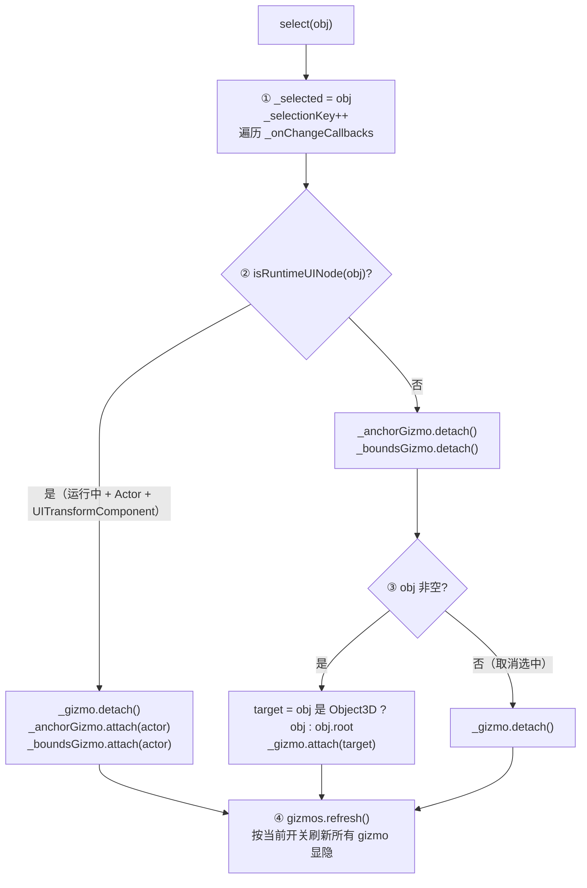
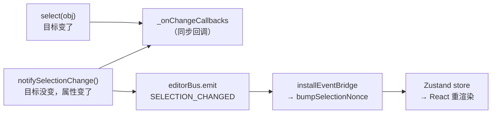
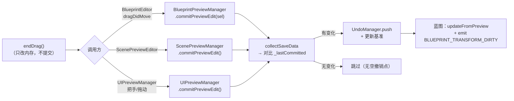

# 选择与变换系统（Editor Selection & Transform）

> **一句话定位**：编辑器里「选中谁 + 用什么工具拖它」的唯一中枢——`select()` 按对象类型分发到三套 Gizmo，拖拽走 `hitTest → startDrag → updateDrag → endDrag` 四步协议，松手才由预览管理器 `commitPreviewEdit` 提交成撤销点。
>
> **什么时候会用到你**：点击大纲/视口选中没反应、Gizmo 不显示或画错位、拖完松手属性没写回/撤销栈多了空点、运行时 UI 节点该出锚点却出了三轴箭头、拖拽时相机跟着乱飞。
>
> 代码位置：`src/editor/SelectionManager.ts`、`src/editor/TransformGizmo.ts`、`src/editor/AnchorGizmo.ts`、`src/editor/SelectionBoundsGizmo.ts`、`src/engine/tools/Gizmos.ts`（全局开关）

---

## 1. 先记住这几个文件

| 文件 | 一句话职责 | 你要改它的场景 |
|---|---|---|
| [SelectionManager.ts](../../../src/editor/SelectionManager.ts) | 模块级选中状态 + 三套 Gizmo 单例 + 选中分发 | 加新的 gizmo 类型、改选中判定规则、加大纲树过滤 |
| [TransformGizmo.ts](../../../src/editor/TransformGizmo.ts) | 3D 三轴箭头：命中检测 + 拖拽协议 + 相机冻结 | 改 3D 拖拽手感、加旋转/缩放轴、改高亮 |
| [AnchorGizmo.ts](../../../src/editor/AnchorGizmo.ts) | UI 锚点图标（父容器范围 + 风车/四角三角） | 改锚点图标布局、改父容器查找语义 |
| [SelectionBoundsGizmo.ts](../../../src/editor/SelectionBoundsGizmo.ts) | UI 节点青色范围框 + 8 把手 + 尺寸标签 | 改范围框/把手显示、改尺寸标签 |

**关键心智模型**：SelectionManager **只管"选中了谁 + 该显示哪个 gizmo"**，它**不负责提交**。拖拽过程中只改内存里的 Object3D 变换，松手由**调用方**（Viewport / BlueprintEditor / 各预览管理器）决定怎么提交。所以"拖完属性没保存"永远是调用方的问题，不是 gizmo 的问题。

第二个反直觉点：全局 `getTransformGizmo()` / `getAnchorGizmo()` / `getSelectionBoundsGizmo()` 是**单例**，但 `UIPreviewManager` 和 `RuntimeUIEditor` **各自 new 了自己的实例**（`UIPreviewManager.ts:218`、`RuntimeUIEditor.ts:134`），不复用全局单例。改全局单例的行为不会影响这两个页签。

---

## 2. 选中流程：从 `select(obj)` 到 Gizmo 显示

### 2.1 谁调用了它

大纲点击（[Outline.tsx](../../../src/components/Outline.tsx)）、UI 大纲（[UiOutline.tsx](../../../src/components/UiOutline.tsx)）、AI 事件 `ai.selectActor`（[EditorInitializer.ts](../../../src/editor/EditorInitializer.ts)）、各预览管理器的拾取。典型调用：

```ts
// Outline.tsx:333 —— 再点一次同一节点 = 取消选中
onClick={() => select(isSelected ? null : node.actor)}
```

### 2.2 `select()` 内部做的 4 件事



**① 记录选中并广播回调**（[SelectionManager.ts:166](../../../src/editor/SelectionManager.ts)）

```ts
export function select(obj: Selectable | null): void {
  _selected = obj
  _selectionKey++
  for (const cb of _onChangeCallbacks) cb()
```

`_selectionKey` 是**模块级递增计数器**，不是 React state。React 组件靠 `getSelectionKey()`（返回 `_selectionKey + _sceneKey`）当 deps 触发重渲染，`onSelectionChange(cb)` 是多槽 `Set`（`SelectionManager.ts:209`），Outline 和 Inspector 各注册一个互不覆盖。

**② 运行时 UI 节点分流判定**

```ts
function isRuntimeUINode(obj: Selectable | null): obj is Actor {
  if (!obj) return false
  if (!_runningWorld) return false
  if (obj instanceof THREE.Object3D) return false
  const actor = obj as Actor
  return !!actor.getComponent(UITransformComponent)
}
```

三个条件**全部**满足才走 UI 分支：游戏在运行（`_runningWorld` 非空）、目标是 Actor（不是裸 Object3D）、身上挂了 `UITransformComponent`。缺任何一个都落到 3D 分支——**包括游戏未运行时点 UI 节点**，此时走的是三轴箭头。

**③ 两条分支互斥，且都先清对面**

```ts
  if (isRuntimeUINode(obj)) {
    _gizmo.detach()
    const actor = obj as Actor
    _anchorGizmo.attach(actor)
    _boundsGizmo.attach(actor)
  } else {
    // 取消旧 UI 选中辅助（避免从 UI 节点切到 3D 节点时残留）
    _anchorGizmo.detach()
    _boundsGizmo.detach()

    if (obj && _gizmo) {
      const target = obj instanceof THREE.Object3D ? obj : (obj as Actor).root
      _gizmo.attach(target)
    } else {
      _gizmo.detach()
    }
  }
```

两个 else 分支都**先 detach 对面的 gizmo**——这是防"从 UI 节点切到 3D 节点后锚点图标还挂在屏幕上"。注意 Actor 分支取的是 `obj.root`（Actor 的 THREE 根 Group），gizmo 挂在 root 上而不是 Actor 对象本身。

**④ `gizmos.refresh()` —— 最容易被漏掉的一步**

```ts
  // 主动触发 gizmos 开关委托：新 attach/detach 的 gizmo 立即按当前开关刷新可见性
  // （点击大纲节点 → select → 这里广播，所有注册委托的 gizmo 物体立即显示/隐藏）
  gizmos.refresh()
}
```

为什么必须有这行：gizmo 的显隐是**委托驱动**的，每个 gizmo 在构造/setup 时注册 `gizmos.onEnabledChanged(cb)`，只有开关**变化**时才会被回调。而 `attach()` 里写的是 `this.group.visible = gizmos.enabled`——读的是当前值。如果全局开关是关的，新 attach 的 gizmo 正确保持隐藏；但如果代码里直接改过 `group.visible`，就必须靠 `refresh()` 广播一次把状态拉回一致。

### 2.3 选中通知的两条路

`select()` 走的是**回调**（`_onChangeCallbacks`），**不发事件总线**。事件总线的 `SELECTION_CHANGED` 由另一个函数发：

```ts
export function notifySelectionChange(): void {
  _selectionKey++
  for (const cb of _onChangeCallbacks) cb()
  // 通过事件总线通知（不再直接耦合 Zustand store）
  editorBus.emit(EditorEvent.SELECTION_CHANGED)
}
```

`notifySelectionChange()` 是"选中目标不变、只是属性变了"的通知——**Gizmo 拖拽每帧**都调它（经 `gizmo.onDragMove`），Inspector 靠它实时刷新 Transform 数值。它比 `select()` 多一步 `editorBus.emit`。



事件桥接只有 3 条映射（选中 / 脏标记 / 保存），见 [编辑器核心](./core_system.md) `installEventBridge` 段落。

---

## 3. TransformGizmo 拖拽：四步协议全链路

### 3.1 相机冻结是怎么接进来的

Gizmo 自己不知道怎么冻结相机，是两个回调在 `setup()` 时注入的（[SceneSetup.ts:52](../../../src/editor/SceneSetup.ts)）：

```ts
  const gizmo = getTransformGizmo()
  gizmo.setup(
    shared,
    sceneMgr.camera,
    sceneMgr.renderer,
    // 拖拽时冻结 Scene 视口输入
    () => sceneMgr.setInputEnabled(false),
    () => sceneMgr.setInputEnabled(true),
  )
```

`_inputBlocker` / `_inputRestorer` 在 `startDrag` / `endDrag` 里被调用。注意：三个预览管理器（`BlueprintPreviewManager.ts:161`、`ScenePreviewManager.ts:149`、`UIPreviewManager.ts:220`）调 `setup()` 时**都没传**这两个回调——它们的 gizmo 拖拽期间相机输入是**不冻结**的。

`setup()` 里还有个 `??=` 的防重复写法：

```ts
    // 监听全局 gizmos 开关（编辑器按钮 setEnabled → 委托触发关闭/显示），
    // 注册时立即回调当前值（同步初始状态）；??= 防重复注册（重挂载）
    this._unsubGizmosToggle ??= gizmos.onEnabledChanged((v) => {
      if (this._target) this.group.visible = v
    })
```

`??=` 而不是 `=`：预览管理器会重复调 `setup()`（切工程/重载预览），没有它每次都会往 `_enabledListeners` 里塞一个新回调，旧回调永不移除 → 委托集合无限膨胀。

### 3.2 命中检测 `hitTest`

```ts
  hitTest(clientX: number, clientY: number): THREE.Vector3 | null {
    if (!this._camera || !this._renderer || !this.group.visible) return null

    const rect = this._renderer.domElement.getBoundingClientRect()
    this.pointer.x = ((clientX - rect.left) / rect.width) * 2 - 1
    this.pointer.y = -((clientY - rect.top) / rect.height) * 2 + 1

    this.raycaster.setFromCamera(this.pointer, this._camera)

    // 收集所有箭头网格（shaft + cone）
    const meshes: THREE.Mesh[] = []
    for (const a of this.arrows) {
      meshes.push(a.shaft, a.cone)
    }

    const hits = this.raycaster.intersectObjects(meshes, false)
    if (hits.length === 0) return null
```

守卫第一行就 require `this.group.visible`——**gizmo 不可见时 hitTest 直接返回 null**，所以调用方不用先判 visible（但 Viewport 还是判了，见 §3.5）。

坐标换算用 `getBoundingClientRect()` 而不是 canvas 尺寸：canvas 可能被 CSS 缩放或有偏移，用 `offsetWidth` 会算错 NDC。

命中集合是 **shaft + cone 两个 mesh**（不是整个 Group），所以只有箭头本体可点，轴之间的空隙点不到。返回值是**轴方向单位向量**（`a.axis.clone()`），不是交点位置。

### 3.3 `startDrag` → `updateDrag` → `endDrag`

```ts
  startDrag(axis: THREE.Vector3, clientX: number, clientY: number) {
    if (!this._target) return

    this._isDragging = true
    this._dragAxis.copy(axis).normalize()
    this._dragStartPos.copy(this._target.position)

    // 计算鼠标在过拖拽起点的相机垂直平面上的投影
    this._updatePlaneHit(clientX, clientY, this._dragStartPos)
    this._planeHitStart.copy(this._planeHit)

    // 冻结摄像机输入
    this._inputBlocker?.()
  }
```

起点存的是 `this._target.position`——**局部坐标**，不是世界坐标。整条拖拽链路都在这个局部坐标系里算，最后直接写回 `position`。这决定了 §5 坑 3 的行为。

```ts
  updateDrag(clientX: number, clientY: number) {
    if (!this._isDragging || !this._target || !this._dragAxis) return

    // 在过起点位置的相机垂直平面上计算鼠标投影
    this._updatePlaneHit(clientX, clientY, this._dragStartPos)

    // 计算平面上从起点到当前点的偏移
    const delta = new THREE.Vector3().copy(this._planeHit).sub(this._planeHitStart)
    // 将偏移投影到拖拽轴上
    const dot = delta.dot(this._dragAxis)

    // 新位置 = 起点 + 轴方向 × 投影量
    const newPos = new THREE.Vector3().copy(this._dragStartPos).addScaledVector(this._dragAxis, dot)
    this._target.position.copy(newPos)
    console.log(`[Gizmo] 拖动: ${this._target.name} pos=${newPos.x.toFixed(3)}, ${newPos.y.toFixed(3)}, ${newPos.z.toFixed(3)}`)
    this.syncTransform()
    this.onDragMove?.()
  }
```

核心是**二次投影**：鼠标射线先打到"过起点、法线 = 视线方向"的平面上得到 `_planeHit`，算出相对起点的 `delta`，再把 `delta` 投影到拖拽轴上取 `dot`。这样即使鼠标偏离轴线很远，物体也只会沿轴移动。`updateDrag` 是**幂等**的（每帧都从 `_dragStartPos` 重算，不累积误差）。

`onDragMove` 回调就是给外面挂 `notifySelectionChange` 用的，让 Inspector 每帧刷新坐标。

`_updatePlaneHit` 的回退分支：

```ts
    const hit = this.raycaster.ray.intersectPlane(this._dragPlane, this._planeHit)
    if (!hit) {
      // 回退：射线与平面平行时，取射线起点
      this._planeHit.copy(this.raycaster.ray.origin)
    }
```

射线与平面平行（相机几乎正对拖拽轴）时 `intersectPlane` 返回 null，不回退会让 `_planeHit` 保留上一帧的值导致物体突然卡住。

`endDrag` 很简单——**不做任何提交**：

```ts
  endDrag() {
    if (!this._isDragging) return
    this._isDragging = false
    this._inputRestorer?.()
    this.resetArrowHighlight()
  }
```

三个方法开头都有状态守卫（`!this._target` / `!this._isDragging`），重复调用静默 return。

### 3.4 每帧同步 `syncTransform`

```ts
  syncTransform() {
    if (!this._target || !this._camera) return

    // 计算目标中心
    this._box3.setFromObject(this._target)
    this._box3.getCenter(this._center)
    this.group.position.copy(this._center)

    // 常量屏幕尺寸（世界单位根据距离缩放）
    const dist = this._camera.position.distanceTo(this._center)
    const s = Math.max(dist * this._screenScale, 0.3)
    this.group.scale.setScalar(s)

    // 世界空间轴向（不跟随目标旋转）
    this.group.rotation.set(0, 0, 0)
  }
```

`Math.max(dist * 0.08, 0.3)` 保证 gizmo 在屏幕上**恒定大小**——相机拉远时 gizmo 跟着放大，不会缩成一个点。`rotation.set(0,0,0)` 让三轴箭头**永远对齐世界轴**，不跟随目标旋转（目标旋转 45° 时箭头仍然水平/垂直）。

### 3.5 调用方：Viewport 的事件绑定

```ts
    const onPointerDown = (e: PointerEvent) => {
      if (e.button !== 0) return // 仅左键
      if (!gizmo.visible) return

      const axis = gizmo.hitTest(e.clientX, e.clientY)
      if (axis) {
        gizmo.startDrag(axis, e.clientX, e.clientY)
        canvas.setPointerCapture(e.pointerId)
        e.preventDefault()
      }
    }

    const onPointerMove = (e: PointerEvent) => {
      gizmo.hoverTest(e.clientX, e.clientY)
      if (gizmo.isDragging) {
        gizmo.updateDrag(e.clientX, e.clientY)
      }
    }

    const onPointerUp = (e: PointerEvent) => {
      if (gizmo.isDragging) {
        gizmo.endDrag()
        try { canvas.releasePointerCapture(e.pointerId) } catch { /* ignore */ }
      }
    }
```

（[Viewport.tsx:456-489](../../../src/components/Viewport.tsx)）三个要点：

- `pointermove` 里**恒调 `hoverTest`**（拖拽时也调），保证高亮跟随；`updateDrag` 只在 `isDragging` 时调。
- `setPointerCapture` / `releasePointerCapture` 成对，鼠标拖出 canvas 外也能继续收到事件。`releasePointerCapture` 包了 `try/catch`——指针已被浏览器隐式释放时会抛错。
- 这个 effect 的守卫是 `if (activeTabId !== 'scene' || editorState.running) return`，**只在 Scene 页签且游戏未运行时**绑定。清理函数里还会兜底 `if (gizmo.isDragging) gizmo.endDrag()`。

---

## 4. 松手提交：走 `commitPreviewEdit`，不是 `commitPreviewTransform`

> ⚠️ **旧文档此处有事实错误**：`BlueprintEditorService.commitPreviewTransform`（`BlueprintEditorService.ts:424`）是**死代码**，全仓 grep 只有定义处（`:424`）和一句注释引用（`:471`），**没有任何调用方**。真实提交链路是预览管理器的 `commitPreviewEdit`。

### 4.1 蓝图：BlueprintEditor 的提交

```ts
    const onPointerUp = async (e: PointerEvent) => {
      if (gizmo.isDragging) {
        gizmo.endDrag()
        if (dragDidMove) {
          // 3D 蓝图拖动松手：本次拖拽目标（= 当前选中节点）的属性变化走 apply 统一链路提交，
          // 撤回点（动作前快照）在 apply 内部 push = 松手才进撤回系统，且不写盘
          const sel = getSelectedActor()
          await mgr.commitPreviewEdit?.(sel)
        }
        try { canvas.releasePointerCapture(e.pointerId) } catch { }
      }
    }
```

（[BlueprintEditor.tsx:330-341](../../../src/components/BlueprintEditor.tsx)）`dragDidMove` 标志在 `onPointerMove` 里置 true——**光按下不移动，松手不提交**，避免点一下箭头就产生撤销点。

### 4.2 `BlueprintPreviewManager.commitPreviewEdit` 内部

```ts
    // 先把 actor 实时 transform 回写进 jsonTree（collectSaveData 原地回写），后续对比才能取到拖拽后的值
    const data = this.collectSaveData()
    if (!data) return
    if (this._lastCommitted === null) {
      // 无基准（理论上 activate 已建立）：以当前为基准（独立拷贝），不产生撤销点
      this._lastCommitted = JSON.parse(JSON.stringify(data))
      logger.info(`[BlueprintPreview] 拖拽提交（首帧基准）: ${key}`)
      return
    }
    // 内容无变化（拖动后松手位置与基准一致）→ 跳过，避免空撤销点
    if (JSON.stringify(data) === JSON.stringify(this._lastCommitted)) {
      logger.info(`[BlueprintPreview] 拖拽提交跳过（内容无变化）: ${key}`)
      return
    }
    UndoManager.push(key, this._lastCommitted)
    // 注意：基准必须独立深拷贝（防与 _jsonTree 同引用被 collectSaveData 写回污染）
    this._lastCommitted = JSON.parse(JSON.stringify(data))
```

（[BlueprintPreviewManager.ts:519](../../../src/editor/asset/BlueprintPreviewManager.ts)）三道闸：无 `_undoKey` → 跳过；无基准 → 建基准不进栈；内容无变化 → 跳过。最后 `JSON.stringify` 全量对比，所以**拖出去再拖回原位不产生撤销点**。

两处 `JSON.parse(JSON.stringify(...))` 深拷贝是硬性要求——`collectSaveData()` 会**原地写回** `_jsonTree`，基准若与它同引用，下次编辑时基准已被污染，对比恒等，第二次起所有编辑都进不了撤销栈。

### 4.3 场景：ScenePreviewManager 的同构实现

```ts
    UndoManager.push(key, this._lastCommitted)
    // 注意：cur 与 _sceneAsset 必须是两个对象——collectSaveData 会把实时 transform
    // 原地写回 _sceneAsset 的 JSON 节点，若基准(_lastCommitted)与 _sceneAsset 同引用，
    // 下次编辑时基准被污染，对比恒"无变化"，第二次起所有编辑都进不了撤销栈。
    this._lastCommitted = JSON.parse(JSON.stringify(cur))
    this._sceneAsset = cur as unknown as SceneAsset
    this._rebindJsonMap()
```

（[ScenePreviewManager.ts:561](../../../src/editor/asset/ScenePreviewManager.ts)）与蓝图版逻辑同构，差别是它**同步**（不 async）——不调 `BlueprintEditorService.updateFromPreview`，只更新内存 `_sceneAsset` 并 `_rebindJsonMap()`。

调用方在 [ScenePreviewEditor.tsx:174](../../../src/components/ScenePreviewEditor.tsx)：`previewMgrRef.current?.commitPreviewEdit()`。

### 4.4 UI：把手/拖动结束各提交一次

[UIPreviewManager.ts:487](../../../src/editor/asset/UIPreviewManager.ts) 和 `:503` 两处（改尺寸把手、拖节点）各调一次 `this.commitPreviewEdit()`，注释一致：`// 松手 = 一个撤销点（同步工作副本，不写盘）`。

### 4.5 提交链路汇总



Viewport（Scene 页签）的 3D 拖拽**没有提交步骤**——它拖的是编辑器共享场景里的对象，本来就不是资产数据。

---

## 5. 关键方法速查

| 方法 | 位置 | 干什么 | 注意 |
|---|---|---|---|
| `select(obj)` | `SelectionManager.ts:166` | 设置选中 + 分发 gizmo + `gizmos.refresh()` | **不发事件总线**；Actor 取 `.root` 挂 gizmo |
| `notifySelectionChange()` | `SelectionManager.ts:217` | key++ + 回调 + `emit(SELECTION_CHANGED)` | 拖拽每帧调它，比 `select` 多一步 emit |
| `isRuntimeUINode(obj)` | `SelectionManager.ts:157` | UI 分支判定：运行中 + Actor + 有 UITransformComponent | 三条件全满足才走 UI 分支 |
| `getSelectedActor()` | `SelectionManager.ts:146` | Object3D 带 `userData.actorRef` 时转 Actor | 裸 Object3D 会原样返回，类型上不安全 |
| `onSelectionChange(cb)` | `SelectionManager.ts:209` | 多槽订阅，返回取消函数 | `Set` 实现，不覆盖其他订阅者 |
| `getSceneTree()` | `SelectionManager.ts:286` | 遍历场景生成大纲树 | 跳过灯光/Grid/Axes/`TransformGizmo`；`isRefInstance` 不展开 |
| `setRunningWorld(world)` | `SelectionManager.ts:246` | 记录运行中 World；传 null 时 detach 两个 UI gizmo | 是 `isRuntimeUINode` 的前置条件 |
| `watchWorldActorChanges(world, invalidate?)` | `SelectionManager.ts:265` | World Actor 增删 → 自动刷新大纲 | `WeakSet` 防重复注册，空 World 直接 return |
| `TransformGizmo.setup(...)` | `TransformGizmo.ts:164` | 挂场景 + 存相机/渲染器 + 注入冻结回调 | `??=` 防委托重复注册；后两个参数可省 |
| `TransformGizmo.hitTest(x, y)` | `TransformGizmo.ts:246` | 射线打 shaft+cone，返回轴向量 | gizmo 不可见时直接 null |
| `TransformGizmo.startDrag(axis, x, y)` | `TransformGizmo.ts:305` | 记起点 + 调 `_inputBlocker` | 无 target 静默 return |
| `TransformGizmo.updateDrag(x, y)` | `TransformGizmo.ts:321` | 二次投影算新位置 + `onDragMove` | 幂等（每帧从起点重算）；有每帧 console.log |
| `TransformGizmo.endDrag()` | `TransformGizmo.ts:341` | 恢复相机 + 重置高亮 | **不提交**，提交在调用方 |
| `TransformGizmo.syncTransform()` | `TransformGizmo.ts:221` | 跟中心 + 常量屏幕尺寸 + 世界轴向 | 常量 `max(dist*0.08, 0.3)` |
| `AnchorGizmo.update(worldPerPx)` | `AnchorGizmo.ts:179` | 父容器线框 + 锚点三角跟随 | `worldPerPx` 非有限值直接 return |
| `AnchorGizmo.findParentContainer(actor)` | `AnchorGizmo.ts:319` | 向上找最近父容器（UITransform 显式尺寸优先，兜底真实画布） | markerOnly 画布不算容器 |
| `SelectionBoundsGizmo.update(worldPerPx)` | `SelectionBoundsGizmo.ts:130` | 范围框 + 把手 + 尺寸标签跟随 | `_showHandles=false` 时只画框不画把手 |
| `SelectionBoundsGizmo.setShowHandles(v)` | `SelectionBoundsGizmo.ts:104` | 切可编辑/只读模式 | 只有 `RuntimeUIEditor` 显式置 true |
| `gizmos.setEnabled(v)` | `Gizmos.ts:57` | 全局开关 + 通知所有委托 | 值相同时直接 return |
| `gizmos.onEnabledChanged(cb)` | `Gizmos.ts:69` | 注册开关委托，**立即回调当前值** | 返回取消函数 |
| `gizmos.refresh()` | `Gizmos.ts:81` | 不改值，广播当前开关 | `select()` 末尾靠它同步新 attach 的 gizmo |

---

## 6. 流程影响：牵动哪些功能

### 6.1 上游：谁驱动它

| 上游 | 怎么驱动 | 相关文档 |
|---|---|---|
| 视口（Scene 页签） | `pointerdown/move/up` → `hitTest → startDrag → updateDrag → endDrag` | [视口系统](./viewport_system.md) |
| 大纲 / UI 大纲 | `select(node.actor)` 点击选中与取消 | [UI 组件系统](../ui/ui_components_system.md) |
| 蓝图预览 | `BlueprintEditor.tsx` 绑 gizmo，松手 `commitPreviewEdit` | [蓝图编辑系统](../blueprint/blueprint_edit_system.md) |
| 场景 / UI 预览 | `ScenePreviewManager` / `UIPreviewManager` 各自持有 gizmo 实例 | [资产预览与检查](../asset/asset_preview_lint_system.md) |
| 游戏运行时 | `setRunningWorld(world)` 打开 UI 分支；`attachAnchorGizmoToScene(null)` 停止时清理 | [视口系统](./viewport_system.md) |
| AI 事件 | `ai.selectActor` / `ai.dragActor` 复用 select + notify | [编辑器核心](./core_system.md) |

### 6.2 下游：它波及谁

| 下游功能 | 波及点 | 相关文档 |
|---|---|---|
| Inspector 属性面板 | `SELECTION_CHANGED` → `bumpSelectionNonce`；拖拽每帧 `notifySelectionChange` 刷新坐标 | [属性编辑系统](./property_edit_system.md) |
| 撤销/重做 | 松手 `commitPreviewEdit` → `UndoManager.push`（有变化才 push） | [撤销/重做系统](../blueprint/undo_redo_system.md) |
| 蓝图编辑 | 蓝图提交走 `updateFromPreview` + `emit(BLUEPRINT_TRANSFORM_DIRTY)` | [蓝图编辑系统](../blueprint/blueprint_edit_system.md) |
| UI 锚点 | `AnchorGizmo` 显示父容器范围与锚点图标；布局算法在锚点文档 | [UI 锚点系统](../ui/ui_anchor_system.md) |
| 大纲 / UI 大纲 | `getSceneTree()` 数据源 + `watchWorldActorChanges` 运行时刷新 | [UI 组件系统](../ui/ui_components_system.md) |
| 全局 Gizmos 开关 | 编辑器按钮 `gizmos.setEnabled` → 委托批量改三套 gizmo 显隐 | [编辑器核心](./core_system.md) |
| 页签脏标记 | 蓝图拖拽 → `BLUEPRINT_TRANSFORM_DIRTY`；保存后 `BLUEPRINT_SAVED` 清脏 | [编辑器核心](./core_system.md) |

---

## 7. 踩坑清单（都是真踩过的）

**1. Gizmo 画错位：用 `root.position` 而不是 `getWorldPosition`**

源码里三处注释都在警告同一件事（`AnchorGizmo.ts:193`、`AnchorGizmo.ts:230`、`SelectionBoundsGizmo.ts:192`）：

```
// ⚠️ 关键：parentBounds/triangles 直接挂在 overlayScene 根下（无父变换），其 position 世界坐标 = 本地坐标，
//    必须用 getWorldPosition（世界坐标）。子节点选中时父容器在世界非原点，读 root.position（局部）
//    会画在错误位置。
```

原因：gizmo 的 `group` 挂在 overlay Scene 的**根节点下**，没有父变换，所以给它设的 `position` 就是世界坐标。而 `actor.root.position` 是**局部坐标**——选中嵌套子节点且父节点不在原点时，两者差一个父变换，gizmo 就画到别处去了。规则：**取位置一律 `root.updateWorldMatrix(true, false)` + `root.getWorldPosition()`**。`AnchorGizmo.attach` 里专门打了 local vs world 对照日志来排查这个。

**2. `attach()` 里临时 new Vector3，而 `update()` 里复用模块级 `_tmpV1`**

`AnchorGizmo.attach` 用 `new THREE.Vector3()`，`update` / `layoutStretch` / `layoutPoint` 用模块级 `_tmpV1`（`AnchorGizmo.ts:31` 注释：`getWorldPosition 出参，避免每帧 new 产生 GC 压力`）。规则：**每帧路径上不要 new 向量**，只在 attach 这种低频路径上允许。

**3. `startDrag` 存的是局部坐标，父节点有变换时拖拽会偏**

`this._dragStartPos.copy(this._target.position)` 取的是局部坐标，整条链路都在局部坐标系算。目标挂在有位移/旋转的父节点下时，世界轴向与局部轴向不一致，鼠标拖 1 单位物体不会走 1 单位。这是已知的语义选择（保持与 `_target.position` 直接写回一致），改之前先确认父子结构。

**4. `commitPreviewTransform` 是死代码，别照着它改**

`BlueprintEditorService.ts:424` 定义了完整的批量提交逻辑（`applyBatch` + 逐组件 op），但全仓无调用方——只有 `:471` 的注释还提到它。真实链路是各预览管理器的 `commitPreviewEdit`。规则：**新功能走 `commitPreviewEdit`，不要复活 `commitPreviewTransform`**；要删的话记得同步改 `:471` 那句注释。

**5. 撤销基准必须深拷贝，否则第二次编辑起全进不了栈**

`BlueprintPreviewManager` / `ScenePreviewManager` 都用 `JSON.parse(JSON.stringify(...))` 建基准，且都写了大段注释解释：`collectSaveData()` 会**原地写回** `_jsonTree` / `_sceneAsset`，基准与它们同引用的话下次对比恒"无变化"。这是最容易在重构时无意破坏的点。

**6. `worldPerPx` 可能是 Infinity，必须先判有限**

两个 UI gizmo 的 `update` 首行都是 `if (!actor || !isFinite(worldPerPx) || worldPerPx <= 0) return`。来源：隐藏视口 `clientHeight = 0` 时 `(cam.top - cam.bottom) / clientHeight` 得到 Infinity，写进 position 会让整个 group 变 NaN 并污染包围球。`updateAnchorGizmo`（`SelectionManager.ts:88`）外层也判了一次。

**7. UI gizmo 必须挂独立 overlay Scene，不能挂游戏 UI 场景**

`SelectionManager.ts:45` 的注释：挂进 `world.ui.scene` 会被 `World.Destroy` 的泄漏检测当成"未被 Actor 跟踪的 THREE 对象"告警。所以全局两个 UI gizmo 常驻 `_runtimeUiOverlayScene`，由 Viewport 经 `SceneRendererComponent.onAfterRender` 用 UICamera 叠加渲染。`attachAnchorGizmoToScene(scene)` 的 `scene` 参数**已无实际作用**，只有传 null 时触发 detach。

**8. 全局单例与预览管理器的实例是两套**

`UIPreviewManager.ts:218` 自己 `new TransformGizmo()`（挂自己的 `overlayScene`），`UIPreviewManager.ts:222` / `RuntimeUIEditor.ts:135` 各自 `new AnchorGizmo()`，`RuntimeUIEditor.ts:138` 自己 `new SelectionBoundsGizmo()`——都不复用 `getTransformGizmo()` / `getAnchorGizmo()` / `getSelectionBoundsGizmo()` 全局单例。改了全局单例的构造参数或默认行为，UI 预览与 UIScene 页签**不会**跟着变。

**9. `RuntimeUIEditor.syncSelection` 故意不调 `select()`**

源码注释（`RuntimeUIEditor.ts:230`）：`只更新自身 gizmo 目标，不调用 select()——避免与全局选中广播形成循环`。它是"外部选中 → 我跟上"的单向同步，反过来调 `select()` 会再触发一次广播形成死循环。调用方是 [UISceneView.tsx:83](../../../src/components/UISceneView.tsx)：

```ts
  // 全局选中变化（UI 大纲点击 / Inspector 操作）→ 同步到 UIScene 编辑器
  // （RuntimeUIEditor.syncSelection 内部防同目标跳过，且不调 select 防循环）
  useEffect(() => {
    const unsub = onSelectionChange(() => {
      const editor = editorRef.current
      if (!editor) return
      editor.syncSelection(getSelectedActor())
    })
    return unsub
  }, [])
```

`syncSelection` 开头还有 `if (this.boundsTarget === actor) return` 同目标防抖，双重保险防循环。

**10. `updateDrag` 每帧 `console.log`**

`TransformGizmo.ts:336` 每帧打印拖动坐标。调试期方便，但高频刷屏——排查性能或日志噪音问题时先想到它。

---

## 8. 边界条件

| 条件 | 行为 | 怎么应对 |
|---|---|---|
| `hitTest` 时 gizmo 不可见 / 无 camera / 无 renderer | 返回 null | 调用方判空；拖动不会启动 |
| `startDrag` 无 target | 静默 return | 引擎内置 |
| `updateDrag` / `endDrag` 非拖拽中 | 静默 return（幂等） | 引擎内置 |
| 射线与拖拽平面平行 | 回退取 `ray.origin` | 引擎内置，物体短暂卡住属正常 |
| 按下箭头但未移动（`dragDidMove=false`） | 蓝图松手**不提交**，无撤销点 | 符合预期，点一下不产生历史 |
| 拖出去再拖回原位 | `JSON.stringify` 对比无变化 → 跳过 push | 无空撤销点 |
| `_undoKey` 为空（`activate` 未调用） | 打 warn 日志并跳过提交 | 检查预览管理器 activate 流程 |
| 游戏未运行时点 UI 节点 | `_runningWorld` 为空 → 走 3D 三轴箭头分支 | 先启动游戏才有锚点语义 |
| 无 `UITransformComponent` 的 UI 节点 | 走 3D 分支（非 UI 编辑语义） | 引擎内置判定 |
| `setEditorScene(null)` | `_sceneKey++` + 广播回调 + `_gizmo.detach()` | 切工程时清理 |
| `setRunningWorld(null)` / `attachAnchorGizmoToScene(null)` | 两个 UI gizmo 同时 detach | 游戏停止路径 |
| `watchWorldActorChanges` 传空 World 或已注册 World | 直接 return（`WeakSet` 防重复） | 引擎内置 |
| `worldPerPx` 为 Infinity / 0 / 负数 | 两个 UI gizmo 跳过更新并隐藏子物体 | 引擎内置防御 |
| Scene 页签游戏运行中 | Viewport 的 gizmo 交互 effect 不绑定（`activeTabId !== 'scene' \|\| running` 直接 return） | 运行中不可拖 3D gizmo |
| 预览管理器的 gizmo 拖拽 | `setup()` 未传 inputBlocker/Restorer → **相机不冻结** | 需要冻结时补传回调 |
| `SelectionBoundsGizmo._showHandles=false` | 只画青色范围框，不画 8 把手（Game 窗口只读态） | `setShowHandles(true)` 开可编辑 |
| 目标是 ref 引用实例 | `getSceneTree` 不展开子 Actor；蓝图提交跳过（无 JSON 节点） | 引擎内置 |
