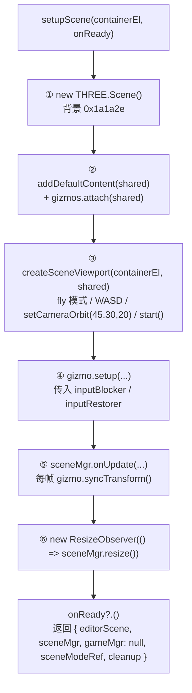
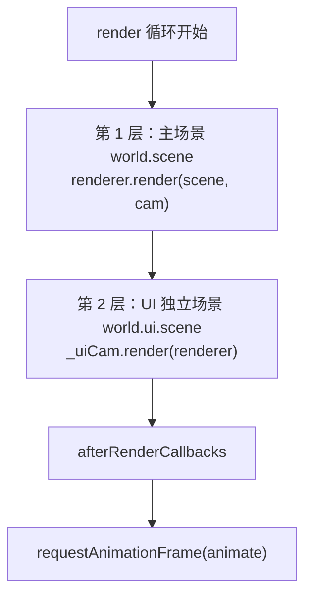
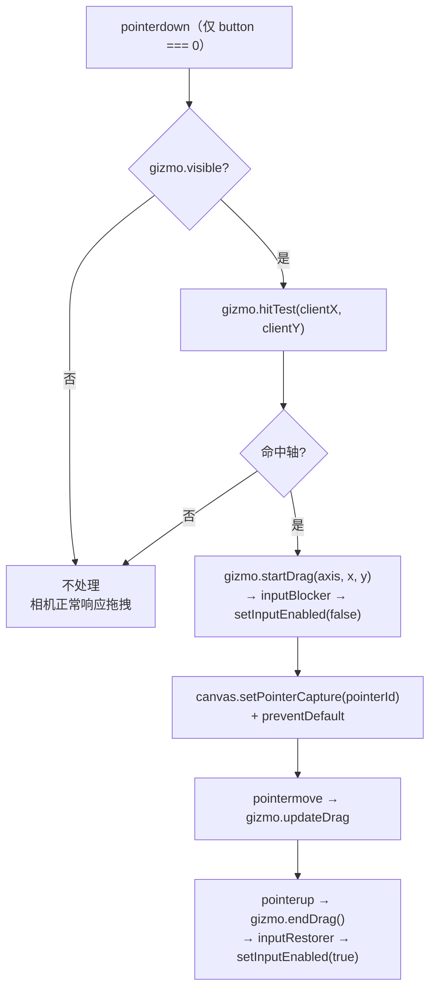

# 编辑器视口系统（Editor Viewport：Scene / Game 双视口）

> **一句话定位**：视口系统是两个**各自独立持有 WebGL 上下文**的画布——Scene 视口归编辑器自己（用于编辑观察），Game 视口归运行时游戏（由 `World` 创建）——外加一层 `InputRouter` 决定键鼠事件该交给谁。
>
> **什么时候会用到你**：视口黑屏/画面拉伸/黑边不对、鼠标点不中或坐标偏移、拖拽 Gizmo 时相机跟着乱转、游戏里按键或点击没反应、切换页签后画面卡住不刷新、切换工程后残留旧场景。
>
> 代码位置：`src/editor/SceneSetup.ts`、`src/editor/SceneViewport.ts`、`src/editor/GameViewport.ts`、`src/editor/InputRouter.ts`、`src/components/Viewport.tsx`

---

## 1. 先记住这四个文件

| 文件 | 一句话职责 | 你要改它的场景 |
|---|---|---|
| [SceneSetup.ts](../../../src/editor/SceneSetup.ts) | 装配工：建共享 `THREE.Scene`、装 Scene 视口、接 Gizmo、挂 ResizeObserver，返回 `cleanup` | 改视口初始化顺序 / 加一个随视口生命周期的东西 |
| [SceneViewport.ts](../../../src/editor/SceneViewport.ts) | Scene 视口的全部：`PreviewSceneManager` 渲染器 + fly 相机 + WASD 漫游 | 改编辑相机操作、letterbox、坐标转换、渲染循环 |
| [GameViewport.ts](../../../src/editor/GameViewport.ts) | Game 视口的**输入转发**（键鼠 → `InputSys`）+ 坐标转换，不含渲染器 | 改游戏输入键位、输入转发目标 |
| [Viewport.tsx](../../../src/components/Viewport.tsx) | 编排者：页签、所有 `useEffect` 生命周期（启动/停止游戏、切工程、挂监听） | 加页签、改启动停止时序、加视口工具栏 |

**关键心智模型**：两个视口不是"同一个渲染器切模式"，而是**两个独立的 `WebGLRenderer`**。Scene 视口的 `PreviewSceneManager` 在 `setupScene` 时就建好且**永不销毁**；Game 视口的 `SceneRendererComponent` 是**每次启动游戏新建、停止即销毁**。所以 `gameMgr` 在停止游戏后是 `null`，所有对它的调用都要走 `?.`。

---

## 2. 装配流程：从 `setupScene()` 到画面出现

### 2.1 谁调用了它

`Viewport.tsx` 的一次性 effect（依赖数组为空，**必须只跑一次**）：

```ts
useEffect(() => {
  if (!sceneContainerRef.current || !gameContainerRef.current) return

  const { editorScene, sceneMgr, gameMgr, cleanup } = setupScene(
    sceneContainerRef.current,
    onReady,
  )

  editorSceneRef.current = editorScene
  sceneRef.current = sceneMgr
  gameSceneRef.current = gameMgr
  cleanupRef.current = cleanup
  setEditorScene(editorScene)
  setSceneMgr(sceneMgr)

  return () => {
    setEditorScene(null)
    setSceneMgr(null)
    cleanup()
    // ... 清空所有 ref
  }
}, [])
```

注意 `setEditorScene` / `setSceneMgr` 是往编辑器模块写全局单例——选择与变换、大纲等模块靠它们拿到视口。卸载时必须**先置 null 再 cleanup**，否则残留引用会指向已 `dispose` 的渲染器。

### 2.2 `setupScene` 内部做的 6 件事



**①②③ 共享场景与默认内容**（[SceneSetup.ts:33](../../../src/editor/SceneSetup.ts)）

```ts
const shared = new THREE.Scene()
shared.background = new THREE.Color(0x1a1a2e)
addDefaultContent(shared)
gizmos.attach(shared)
```

`addDefaultContent` 把四盏灯**做成 Actor**（`GenericActor` + `LightComponent`）挂在名为 `Default` 的容器 Actor 下，网格是裸 `GridHelper`。做成 Actor 是为了让大纲树显示真实名字且可选中——裸 THREE 对象没有 `userData.actorRef`，大纲只能显示类型名还不能选中。

**③ 创建 Scene 视口**（[SceneViewport.ts:23](../../../src/editor/SceneViewport.ts)）

```ts
export function createSceneViewport(
  containerEl: HTMLElement,
  editorScene?: THREE.Scene,
): PreviewSceneManager {
  const mgr = new PreviewSceneManager(containerEl, {
    controlMode: 'fly',
    editorScene,
    addDefaultContent: false,
  })
  mgr.setWASDControl(true)
  mgr.setCameraOrbit(45, 30, 20)
  mgr.start()
  return mgr
}
```

`addDefaultContent: false` 是**关键**：默认内容已经由 `setupScene` 用 Actor 化方式加进共享场景了。若这里再传 `true`，`PreviewSceneManager` 会往同一场景塞第二套**裸 THREE 灯光**（见 `setupLighting`），结果是灯翻倍、大纲里多出四个无法选中的同名节点。这正是编辑器里存在两套"加默认内容"代码路径（`SceneDefaults.addDefaultContent` 与 `PreviewSceneManager.setupLighting`）的原因，前者是编辑器正式路径，后者服务于独立场景预览。

**④ Gizmo 接线**（[SceneSetup.ts:48](../../../src/editor/SceneSetup.ts)）

```ts
const gizmo = getTransformGizmo()
gizmo.setup(
  shared,
  sceneMgr.camera,
  sceneMgr.renderer,
  () => sceneMgr.setInputEnabled(false),
  () => sceneMgr.setInputEnabled(true),
)
```

后两个回调就是「拖拽 Gizmo 时冻结相机」的实现：`TransformGizmo.startDrag` 调 `inputBlocker`，`endDrag` 调 `inputRestorer`。详见 §5。

**⑤⑥ 每帧同步与尺寸监听**

```ts
const removeGizmoFlush = sceneMgr.onUpdate(() => {
  if (gizmo.visible) {
    gizmo.syncTransform()
  }
})

const obs1 = new ResizeObserver(() => sceneMgr.resize())
obs1.observe(sceneContainerEl)
```

`syncTransform` 每帧跑，保证选中对象被游戏逻辑移动后坐标轴跟得上。`ResizeObserver` 只挂 Scene 容器——Game 容器的尺寸监听由 `SceneRendererComponent` 自己在构造时挂（[SceneRendererComponent.ts:156](../../../src/engine/gameflow/SceneRendererComponent.ts)）。

### 2.3 收摊：`cleanup()`

```ts
const cleanup = () => {
  obs1.disconnect()
  removeGizmoFlush()
  sceneMgr.dispose()
  gizmos.detach(shared)
  gizmo.detach()
}
```

顺序有讲究：先停观察者和帧回调（否则可能在 `dispose` 之后还触发 `resize`），再销毁渲染器，最后分离 Gizmo 目标。`dispose` 内部必须**先 `forceContextLoss()` 再 `renderer.dispose()`**：

```ts
this.renderer.forceContextLoss()
this.renderer.dispose()
this.renderer.domElement.remove()
this.uiLayer.remove()
```

不 `forceContextLoss` 的话 WebGL 上下文不会真正释放，反复 mount/unmount 会耗尽浏览器的上下文配额（Chrome 一般上限 16 个）后画面全黑。

---

## 3. 两个视口的分工

| 维度 | Scene 视口 | Game 视口 |
|---|---|---|
| 渲染器类 | `PreviewSceneManager`（编辑器层） | `SceneRendererComponent`（引擎层，挂 `World`） |
| 创建时机 | `setupScene` 时，一次 | 每次 `Game.launch()`，经 `World.ensureGameRenderer()` |
| 生命周期 | 跟随编辑器，永不销毁 | 启动创建、停止 `dispose` |
| 相机来源 | **自己创建并持有**（`createCamera`） | **每帧从游戏委托取**（`setCameraProvider`） |
| 控制模式 | `fly`（左键转视角、右键平移、滚轮推拉）+ WASD | OrbitControls，但 `enableRotate/Pan/Zoom` 全关、`enabled = false` |
| 渲染的场景 | `viewScene`（默认共享场景；运行时切为游戏场景**只读**） | `world.scene`（游戏自建场景） |
| 输入去向 | WASD → 相机位移；指针 → TransformGizmo | 键鼠 → `GameInstance.inputSys` |

### 3.1 Game 视口的相机是"借"来的

这是最容易误解的一点。`SceneRendererComponent` **不创建主相机**，它每帧向游戏索要：

```ts
setCameraProvider(
  provider: (() => THREE.PerspectiveCamera | THREE.OrthographicCamera | null) | null,
): void {
  this.cameraProvider = provider
  this.camera = provider ? provider() : null
  if (this.controls) {
    this.controls.dispose()
    this.controls = null
  }
  if (this.camera) {
    this.controls = new OrbitControls(this.camera, this.renderer.domElement)
    this.controls.enableRotate = false
    this.controls.enablePan = false
    this.controls.enableZoom = false
    this.controls.enableDamping = false
    this.controls.enabled = false
  }
  this.resize()
}
```

`Game.launch()` 里注册的是 `() => inst.getActiveCamera()`。既然相机完全由游戏控制，为何还要建 OrbitControls？只为保留 `controls` 引用与 `resetView()` 能力，所有交互开关都关掉了——**Game 视口不接受手动相机操作**。

### 3.2 Scene 视口在游戏运行时改看游戏场景

```ts
const bridge = inst.getComponent(EditorGameBridgeComponent)
setRunningBridge(bridge)
sceneRef.current?.setViewScene(bridge?.scene ?? null)
if (bridge?.scene) attachTransformGizmoToScene(bridge.scene)
```

`setViewScene` 让 Scene 视口渲染游戏场景——**同一个 `THREE.Scene` 对象，但用 Scene 视口自己的相机看**。好处是游戏运行时切到 Scene 页签能自由飞越观察，且因为 TransformGizmo 也跟着 `attachToScene` 迁移过去，点击大纲节点仍能看到坐标轴。停止游戏时反向恢复：

```ts
setRunningWorld(null)
setRunningBridge(null)
sceneRef.current?.setViewScene(null)
if (editorSceneRef.current) attachTransformGizmoToScene(editorSceneRef.current)
```

`EditorGameBridgeComponent` 的注释把这条边界讲得很清楚：编辑器**只读**游戏场景，绝不注入任何编辑器内容，避免污染游戏的 Actor 归属与泄漏检测。

---

## 4. 渲染：分层渲染与渲染循环

### 4.1 分层渲染

Game 视口每帧依次渲染两层，顺序即遮挡关系：



第 2 层由 `UICamera` 承载，它是**独立的正交相机**，与游戏主相机解耦：

```ts
render(renderer: THREE.WebGLRenderer): void {
  if (!this._scene) return
  const prevAutoClear = renderer.autoClear
  renderer.autoClear = false
  renderer.clearDepth()
  renderer.render(this._scene, this.camera)
  renderer.autoClear = prevAutoClear
}
```

`autoClear = false` + `clearDepth()` 是叠加渲染的标准手法：不清颜色缓冲（保留第 1 层画面），只清深度（让 UI 不参与 3D 深度测试，永远在最上层）。UI 场景的挂载与相机的创建都在 `attachUIScene` 里，传 `null` 即分离并终态化：

```ts
attachUIScene(scene: THREE.Scene | null): void {
  if (scene && !this._uiCam) {
    this._uiCam = new UICamera()
    this.resize()
  }
  this._uiCam?.attach(scene)
  if (!scene) {
    // 分离即终态（BObject.EndPlay：markDestroyed + 注册表注销），下次挂载重建
    this._uiCam?.EndPlay()
    this._uiCam = null
  }
}
```

视锥按 **contain 模式**算，保证 9.6×5.4 的 UI 画布完整居中显示、非 16:9 时留空而不裁切：

```ts
setCanvasSize(canvasW: number, canvasH: number): void {
  const scale = Math.min(canvasW / UI_CANVAS_W, canvasH / UI_CANVAS_H)
  const halfW = canvasW / scale / 2
  const halfH = canvasH / scale / 2
  this.camera.left = -halfW
  this.camera.right = halfW
  this.camera.top = halfH
  this.camera.bottom = -halfH
  this.camera.updateProjectionMatrix()
}
```

第 3 层 overlay 场景（`_runtimeUiOverlayScene`）承载 `AnchorGizmo` 与 `SelectionBoundsGizmo`。它**故意不挂进游戏 UI 场景**——源码注释写明了原因：挂进去会被 `World.Destroy` 的泄漏检测判定为"未被 Actor 跟踪的 THREE 对象"而误报告警。

> **当前 Game 视口并没有渲染这一层**：全局检索 `getRuntimeUIOverlayScene` 只有 `SelectionManager.ts` 的定义与 `editor/index.ts` 的导出两处命中，`SceneRendererComponent.start()` 里也没有对应的 `render` 调用。也就是说运行时 UI 锚点框目前**不会出现在 Game 视口画面里**，"用 `onAfterRender` 经 `UICamera` 叠加渲染"只是源码注释描述的设计意图。真正的三场景分层（主场景 → UI 场景 → overlay）目前只在 UI 预览编辑器里落地，见 `UIPreviewManager` 的渲染循环：

```ts
// 第 3 层：编辑器覆盖层（gizmo/包围盒/把手/标签）——始终最顶层，不被 UI 面板遮挡
if (this.overlayScene.children.length > 0) {
  const prevAutoClear = this.renderer.autoClear
  this.renderer.autoClear = false
  this.renderer.clearDepth()
  this.renderer.render(this.overlayScene, this.camera)
  this.renderer.autoClear = prevAutoClear
}
```

排查"游戏运行时选中 UI 节点看不到锚点框"时先确认这一点，不要去查 Gizmo 的 `attach` 逻辑。

### 4.2 Scene 视口的渲染循环

```ts
start() {
  this.lastTime = performance.now()
  const animate = (time: number) => {
    // 上下文丢失期间跳过渲染，避免对失效 GL 上下文上传纹理报错
    if (this.contextLost) {
      this.animationId = requestAnimationFrame(animate)
      return
    }
    const dt = (time - this.lastTime) / 1000
    this.lastTime = time

    this.updateWASD(dt)
    this.controls?.update()

    for (const cb of this.updateCallbacks) {
      cb(dt)
    }

    this.renderer.render(this.viewScene, this.camera)

    for (const cb of this.afterRenderCallbacks) {
      cb()
    }
    this.animationId = requestAnimationFrame(animate)
  }
  this.animationId = requestAnimationFrame(animate)
}
```

三处要留意。一是 `contextLost` 时**继续排下一帧而不是停止循环**——保持 rAF 存活，等浏览器恢复后原地续上，不需要外部重新 `start()`。二是 `updateCallbacks` 排在 `controls.update()` 之后、渲染之前，所以**游戏逻辑 tick 也在这一段**（`Game.launch` 把 `inst.tick(dt)` + `inst.drawGizmos()` 挂在这里）。三是渲染的是 `this.viewScene` 而非 `this.scene`，这是 `setViewScene` 生效的地方。

`SceneRendererComponent.start()` 结构相同，多了一段每帧同步宽高比到游戏相机——因为相机是借来的，游戏自己改 `orthoSize` 时渲染器不能覆盖它，只能按 `top` 反推半宽：

```ts
} else if (cam instanceof THREE.OrthographicCamera) {
  const halfH = cam.top
  const halfW = halfH * this._aspect
  if (cam.right !== halfW || cam.top !== halfH) {
    cam.left = -halfW
    cam.right = halfW
    cam.top = halfH
    cam.bottom = -halfH
    cam.updateProjectionMatrix()
  }
}
```

---

## 5. letterbox 缩放与 `clientToWorld` 坐标转换

### 5.1 强制画面比例：canvas 物理缩放 + CSS 居中

```ts
resize() {
  const width = this.container.clientWidth
  const height = this.container.clientHeight
  if (width === 0 || height === 0) return

  let canvasW: number
  let canvasH: number
  let aspect: number

  if (this.targetAspect) {
    const containerAspect = width / height
    if (containerAspect > this.targetAspect) {
      canvasH = height
      canvasW = height * this.targetAspect
    } else {
      canvasW = width
      canvasH = width / this.targetAspect
    }
    aspect = this.targetAspect
  } else {
    canvasW = width
    canvasH = height
    aspect = width / height
  }

  this._aspect = aspect
  const cam = this.camera
  if (cam instanceof THREE.PerspectiveCamera) {
    cam.aspect = aspect
  } else {
    const halfH = this.orthoSize
    const halfW = halfH * aspect
    cam.left = -halfW
    cam.right = halfW
    cam.top = halfH
    cam.bottom = -halfH
  }

  const w = Math.round(canvasW)
  const h = Math.round(canvasH)
  this.renderer.setSize(w, h)
  cam.updateProjectionMatrix()

  this.uiLayer.style.width = `${w}px`
  this.uiLayer.style.height = `${h}px`
}
```

黑边不是画上去的：canvas 被缩到目标比例，居中由 CSS 的 `.viewport-container-game { display: flex; align-items: center; justify-content: center }` 完成，容器 `background: #000` 透出来就是黑边。

`width === 0 || height === 0` 直接 return 是必要的——页签用 `display: none` 隐藏，隐藏容器 `clientWidth` 为 0，此时算 `aspect` 会得到 `NaN`，一路污染到投影矩阵后画面永久损坏且难以恢复。代价是**切回页签必须手动补一次 `resize()`**，`Viewport.tsx` 里有专门的 effect 做这件事：

```ts
useEffect(() => {
  if (activeTabId === 'scene') {
    sceneRef.current?.resize()
  } else if (activeTabId === 'game') {
    gameSceneRef.current?.resize()
  }
}, [activeTabId])
```

末尾同步 `uiLayer` 尺寸同样重要：UI 层要对齐**画面矩形**而非含黑边的容器，否则 React HUD 会飘到黑边上。

### 5.2 `clientToWorld`：屏幕坐标 → 世界坐标

```ts
clientToWorld(clientX: number, clientY: number, out: THREE.Vector3 = _worldOut): THREE.Vector3 {
  const rect = this.renderer.domElement.getBoundingClientRect()
  _ndc.set(
    ((clientX - rect.left) / rect.width) * 2 - 1,
    -((clientY - rect.top) / rect.height) * 2 + 1,
  )
  _raycaster.setFromCamera(_ndc, this.camera)
  _raycaster.ray.intersectPlane(_planeZ0, out)
  return out
}
```

三点决定它能不能算对。其一，用 `getBoundingClientRect()` 而**不是** `container.clientWidth`——rect 是 canvas 缩放后的真实屏幕矩形，天然含 letterbox 偏移，换成容器尺寸就会在黑边区域算出偏移坐标。其二，Y 轴取反（`-((clientY - rect.top) / rect.height) * 2 + 1`），因为 DOM 的 Y 向下、NDC 的 Y 向上。其三，`Raycaster.setFromCamera` 对透视和正交相机都成立，所以同一份代码服务 2D/3D 项目。

模块级复用 `_raycaster` / `_planeZ0` / `_ndc` / `_worldOut` 四个临时对象，避免每次鼠标移动都分配——`handlePointerMove` 是每帧高频调用。

> **默认参数 `out = _worldOut` 是个陷阱**：它是模块级共享向量，两次连续调用若不清空，第二次会覆盖第一次的结果。传 `_ptrWorld`（`SceneDefaults.ts` 导出的另一个共享缓冲）也一样。需要同时持有多个世界坐标时必须传自己的 `THREE.Vector3`。

Game 侧做了一层薄封装，未启动游戏时原样返回传入缓冲（不做 null 防护）：

```ts
export function clientToWorld(
  clientX: number,
  clientY: number,
  gameMgr: SceneRendererComponent | null,
  _ptrWorld: THREE.Vector3,
): THREE.Vector3 {
  return gameMgr?.clientToWorld(clientX, clientY, _ptrWorld) ?? _ptrWorld
}
```

引擎侧 `SceneRendererComponent.clientToWorld` 多一层 `if (this.camera)` 判空——相机为 null（游戏未提供主相机）时 `out` 保持原值不变，不抛异常。

---

## 6. 输入路由：Gizmo 命中优先于相机控制

### 6.1 键盘：按页签分流

`InputRouter` 只做一件事——按 `activeTabId` 把事件丢给对应视口，非 scene/game 页签（`bp:*`、`uiScene`）**返回 false 不消费**：

```ts
export function handleKeyDown(e: KeyboardEvent, ctx: InputRouterContext): boolean {
  if (ctx.activeTabId === 'scene') {
    return handleSceneKeyDown(e, ctx.sceneMgr)
  }
  if (ctx.activeTabId !== 'game') return false
  return handleGameKeyDown(e, ctx.game)
}
```

Scene 侧先过滤按键集合，只认 WASD/QE，其余一律放行给编辑器快捷键：

```ts
const SCENE_WASD_KEYS = new Set([
  'w', 'W', 'a', 'A', 's', 'S', 'd', 'D', 'q', 'Q', 'e', 'E',
])

export function handleSceneKeyDown(e: KeyboardEvent, mgr: PreviewSceneManager | null): boolean {
  if (!SCENE_WASD_KEYS.has(e.key)) return false
  mgr?.onWASDKeyDown(e.key)
  e.preventDefault()
  return true
}
```

鼠标事件不分流——全部走 Game 路径（`handleMouseMove` 直接调 `handleGameMouseMove`），因为只有游戏需要鼠标输入，Scene 视口的鼠标由 `PreviewSceneManager.setupFlyMouse` 在 canvas 上自己监听，不经过 React。

键盘监听只在 `viewportFocused` 为真时挂到 `window` 的**捕获阶段**（第三个参数 `true`），这样能抢在 canvas 和面板之前拿到按键；失焦时 `clearWASDKeys()` 清空按键状态，防止卡键导致相机一直漂移。

### 6.2 Gizmo 命中优先：先 `hitTest`，命中就冻结相机



```ts
const onPointerDown = (e: PointerEvent) => {
  if (e.button !== 0) return
  if (!gizmo.visible) return

  const axis = gizmo.hitTest(e.clientX, e.clientY)
  if (axis) {
    gizmo.startDrag(axis, e.clientX, e.clientY)
    canvas.setPointerCapture(e.pointerId)
    e.preventDefault()
  }
}
```

`hitTest` 未命中时**什么都不做**——既不 `preventDefault` 也不 `setPointerCapture`，事件继续冒泡，fly 相机的 `mousedown` 照常接管，于是"拖空白处 = 转视角、拖轴 = 移动物体"。命中则 `startDrag` 内部触发 `inputBlocker`（即 `setInputEnabled(false)`），`endDrag` 再恢复。

`setInputEnabled` 的实现有个反直觉之处：

```ts
setInputEnabled(v: boolean) {
  this._inputEnabled = v
  if (this.controls) {
    this.controls.enabled = v
  }
}
```

它只影响 `mousemove`/`wheel` 的处理，而 `mousedown`/`mouseup` **始终记录按键状态**：

```ts
canvas.addEventListener('mousedown', (e) => {
  // 始终记录鼠标状态（即使 inputEnabled=false 也要正确跟踪按键）
  if (e.button === 0) {
    this.isLeftDown = true
    this.prevMouseX = e.clientX
    this.prevMouseY = e.clientY
  }
  // ...
})
```

这是刻意的：若冻结期间不更新 `prevMouseX/Y`，恢复输入后第一帧的 `dx/dy` 会是"从冻结点到当前位置"的巨大差值，相机会瞬间甩飞。

### 6.3 Game 输入如何转发给 `inputSys`

鼠标三个 handler 结构一致：转世界坐标 → 转发，且**按键号显式透传**：

```ts
export function handleGameMouseDown(
  e: MouseEvent,
  game: Game | null,
  gameMgr: SceneRendererComponent | null,
  _ptrWorld: THREE.Vector3,
): void {
  logger.debug(`[GameViewport] mousedown button=${e.button} at (${e.clientX}, ${e.clientY})`)
  const inst = game?.instance
  if (!inst) return
  const controller = inst.controller
  const worldPos = clientToWorld(e.clientX, e.clientY, gameMgr, _ptrWorld)
  inst.inputSys.handlePointerDown(e.clientX, e.clientY, worldPos, controller, e.button)
}
```

键盘要先格式化键名，且**包含修饰键前缀**：

```ts
function _formatKey(e: KeyboardEvent): string {
  const parts: string[] = []
  if (e.ctrlKey) parts.push('Ctrl')
  if (e.shiftKey) parts.push('Shift')
  if (e.altKey) parts.push('Alt')
  const base = e.key.length === 1 ? e.key : (e.code.startsWith('Key') ? e.key : e.code)
  parts.push(base)
  return parts.join('+')
}
```

`e.key.length === 1` 走 `e.key`（保留大小写，A 与 a 区分），否则用 `e.code`（`Backspace`、`ArrowLeft` 等）。拼成 `Shift+ArrowLeft` 这种组合串，UI 输入控件才能识别。

`InputSys` 内部的消费优先级（[InputSys.ts:36](../../../src/engine/input/InputSys.ts)）：

```ts
const consumed = button === 0 ? PhySys.raycastClick(screenX, screenY) : false
controller?.inputComponent.ProcessMouseButton(button, 'pressed')
if (consumed) return true
if (button === 0) {
  controller?.OnPointerDownScreen(screenX, screenY)
  if (worldPos) controller?.OnPointerDown(worldPos)
}
```

即：**UI 点击检测优先于地面逻辑**。左键点中 UI 按钮后不再下发给 controller，避免一次点击同时触发按钮和场景交互。右键不参与点击检测，只广播给 `BindMouseButton` 订阅者（如摄像机右键平移）。

鼠标监听只绑在 game canvas 上，但 `mousemove` / `mouseup` 绑在 `window` 上——拖出画布外也要继续收到事件，否则拖到一半松手会卡在拖拽态。

---

## 7. WebGL 上下文丢失与恢复

两个渲染器都实现了同一套机制（代码几乎一致）：

```ts
this._onContextLost = (e: Event) => {
  e.preventDefault()
  this.contextLost = true
  this.stop()
  logger.warn('[PreviewSceneManager] WebGL 上下文丢失，已暂停渲染，等待浏览器恢复…')
}
this._onContextRestored = () => {
  logger.info('[PreviewSceneManager] WebGL 上下文已恢复，重建纹理并恢复渲染')
  this.restoreAllTextures()
  this.contextLost = false
  this.start()
}
this.renderer.domElement.addEventListener('webglcontextlost', this._onContextLost, false)
this.renderer.domElement.addEventListener('webglcontextrestored', this._onContextRestored, false)
```

`e.preventDefault()` 是**必需**的：不调用它，浏览器默认行为是永久销毁该上下文并且**永远不会触发 `webglcontextrestored`**，视口就彻底黑了。调用后浏览器才会在 GPU 资源可用时尝试重建。

`stop()` 只是 `cancelAnimationFrame`，不销毁渲染器；同时渲染循环里还有 `contextLost` 早退分支，双保险。恢复后必须重建纹理——GPU 显存里的纹理数据全部失效，但 CPU 侧的 `THREE.Texture` 对象还在，置 `needsUpdate` 即可让 three.js 重新上传：

```ts
private restoreAllTextures() {
  this.scene.traverse((obj) => {
    const mesh = obj as THREE.Mesh
    const mat = (mesh as THREE.Mesh).material
    if (!mat) return
    const mats = Array.isArray(mat) ? mat : [mat]
    for (const m of mats) {
      const anyMat = m as THREE.Material & Record<string, unknown>
      for (const key of Object.keys(anyMat)) {
        const value = anyMat[key]
        if (value instanceof THREE.Texture) {
          value.needsUpdate = true
        }
      }
    }
  })
}
```

用 `Object.keys(anyMat)` 遍历而非硬编码 `map` / `normalMap` 等字段名，这样新增材质类型自动覆盖。引擎侧版本遍历的是 `[this.scene, this._uiCam?.scene]` 两个场景——UI 场景的纹理同样会失效。

---

## 8. 关键方法速查

| 方法 | 位置 | 干什么 | 注意 |
|---|---|---|---|
| `setupScene(containerEl, onReady?)` | `SceneSetup.ts:33` | 建共享场景 + Scene 视口 + Gizmo + ResizeObserver | 返回 `gameMgr` 恒为 `null`（游戏启动前无渲染器） |
| `createSceneViewport(containerEl, editorScene?)` | `SceneViewport.ts:23` | fly 模式创建 + WASD + 初始视角 + `start()` | `addDefaultContent: false`，重复加灯会翻倍 |
| `PreviewSceneManager.resize()` | `SceneViewport.ts:440` | letterbox 缩放 + 投影矩阵 + uiLayer 尺寸 | 容器 0 尺寸直接 return，**需外部补调** |
| `PreviewSceneManager.start()` | `SceneViewport.ts:494` | rAF 主循环（WASD → controls → 回调 → 渲染） | `contextLost` 时仍排队下一帧 |
| `PreviewSceneManager.clientToWorld()` | `SceneViewport.ts:639` | 屏幕→世界（z=0 平面求交） | 默认 `out` 是共享缓冲，会被下次调用覆盖 |
| `PreviewSceneManager.setViewScene(scene)` | `SceneViewport.ts:123` | 切换渲染主场景（运行时看游戏场景） | 只读引用，不注入编辑器内容 |
| `PreviewSceneManager.setInputEnabled(v)` | `SceneViewport.ts:162` | 冻结/恢复相机输入 | `mousedown/up` 仍记录按键状态（防甩飞） |
| `PreviewSceneManager.setTargetAspect(ratio)` | `SceneViewport.ts:173` | 设强制画面比例，`null` = 自由拉伸 | 内部自动 `resize()` |
| `PreviewSceneManager.setCameraMode(mode)` | `SceneViewport.ts:311` | 切透视/正交，重建相机与 OrbitControls | 先存 `controls.enabled`，重建后恢复 |
| `PreviewSceneManager.onAfterRender(cb)` | `SceneViewport.ts:547` | 注册渲染后回调（叠加层用） | 返回反注册函数 |
| `PreviewSceneManager.dispose()` | `SceneViewport.ts:740` | 停循环 + 摘监听 + `forceContextLoss` + 移除 DOM | **必须先 `forceContextLoss`**，否则上下文泄漏 |
| `handleSceneKeyDown(e, mgr)` | `SceneViewport.ts:50` | WASD/QE 漫游键，返回是否消费 | 非 WASD 键返回 `false` 放行给快捷键 |
| `handleGameKeyDown(e, game)` | `GameViewport.ts:24` | 键名格式化 → `inputSys.handleKeyDown` | 修饰键拼成 `Shift+X` |
| `handleGameMouseDown(e, game, gameMgr, out)` | `GameViewport.ts:89` | 转世界坐标 → `inputSys.handlePointerDown` | 透传 `e.button`（0=左，2=右） |
| `clientToWorld(...)` | `GameViewport.ts:139` | Game 侧坐标转换封装 | `gameMgr` 为 null 时原样返回传入缓冲 |
| `handleKeyDown(e, ctx)` | `InputRouter.ts:33` | 按 `activeTabId` 分流键盘 | 非 scene/game 返回 `false` 不消费 |
| `SceneRendererComponent.setCameraProvider(fn)` | `SceneRendererComponent.ts:51` | 注册相机委托，每帧取游戏主相机 | 相机非自己创建；OrbitControls 全禁用 |
| `SceneRendererComponent.attachUIScene(scene)` | `SceneRendererComponent.ts:373` | 挂载 UI 独立场景并建 `UICamera` | 传 `null` 即分离并终态化 |
| `SceneRendererComponent.clientToWorld()` | `SceneRendererComponent.ts:503` | Game 侧屏幕→世界 | 相机为 null 时 `out` 保原值 |
| `addDefaultContent(scene)` | `SceneDefaults.ts:28` | 四盏 Actor 化灯 + GridHelper，挂 `Default` 容器 | 编辑器正式路径，与 `setupLighting` 二选一 |
| `getRuntimeUIOverlayScene()` | `SelectionManager.ts:56` | 取编辑器 overlay 场景（锚点 + 范围框） | 刻意不挂游戏 UI 场景避免泄漏误报；**当前 Game 视口未渲染它** |
| `InputSys.handlePointerDown(...)` | `InputSys.ts:36` | UI 射线优先，未命中才下发 controller | 只有左键参与点击检测 |

---

## 9. 流程影响：牵动哪些功能

### 上游：谁驱动它

| 上游 | 怎么驱动 | 相关文档 |
|---|---|---|
| React 视图容器 | `Viewport.tsx` 调 `setupScene()`；`editorState.running` / `launchCount` / `activeTabId` 驱动全部生命周期 effect | [UI 组件](../ui/ui_components_system.md) |
| 编辑器核心 | `onViewportReady()` 通知 Electron 关加载窗口 | [编辑器核心](./core_system.md) |
| 选择与变换 | `gizmo.hitTest` / `startDrag` 反向冻结相机输入；`attachTransformGizmoToScene` 迁移 Gizmo 归属场景 | [选择与变换](./selection_transform_system.md) |
| 游戏流程 | `Game.launch()` 建 Game 视口渲染器、注册相机委托、挂 tick | [游戏流程](../../engine/gameflow_system.md) |
| 引擎渲染 | `UICamera` 提供 UI 叠加相机与点击射线；`CameraOverlayRenderer` 复用 `onAfterRender` 钩子 | [引擎渲染](../../engine/rendering_system.md) |

### 下游：它波及谁

| 下游功能 | 波及点 | 相关文档 |
|---|---|---|
| 选择与变换 | `clientToWorld` 供 Gizmo 命中检测；`setInputEnabled` 由 Gizmo 拖拽回调驱动；overlay 场景承载锚点框 | [选择与变换](./selection_transform_system.md) |
| 编辑器核心 | `onReady` 回调链；视口销毁时 `setEditorScene(null)` / `setSceneMgr(null)` 清全局引用 | [编辑器核心](./core_system.md) |
| 资产预览 | 各预览编辑器（`ScenePreviewManager` / `BlueprintPreviewManager` / `UIPreviewManager`）用同样的 `autoClear=false` + `clearDepth` 叠加手法与独立 overlay 场景约定 | [资产预览与检查](../asset/asset_preview_lint_system.md) |
| 引擎渲染 | 主场景渲染后 `UICamera` 叠加 UI 场景；`SceneRenderHost` 接口由 `PreviewSceneManager` 实现 | [引擎渲染](../../engine/rendering_system.md) |
| 游戏流程 | `inst.tick(dt)` / `drawGizmos()` 挂在 Scene 视口 `onUpdate`；输入经 `inputSys` 进 Controller | [游戏流程](../../engine/gameflow_system.md) |
| 输入物理脚本 | `PhySys.raycastClick` / `raycastHover` / `setupUI(uiCamera)` 的射线检测依赖视口坐标系 | [输入物理脚本](../../engine/input_physics_script_system.md) |
| UI 组件 | 页签切换决定监听挂载与 `resize` 补调；比例下拉框 → `setTargetAspect` | [UI 组件](../ui/ui_components_system.md) |

---

## 10. 踩坑清单（都是真踩过的）

**1. 页签 `display:none` 后 `resize()` 算出 `NaN`，切回来画面永久损坏**

现象：切到别的页签再切回 Scene，画面比例错乱或全黑，且此后 resize 再也修不好。原因：隐藏容器 `clientWidth` 为 0，`aspect = 0/0 = NaN` 写进投影矩阵，NaN 会一路传播且无法用后续正常值覆盖。规则：`resize()` 开头 `if (width === 0 || height === 0) return`，代价是切回页签必须手动补调 `resize()`——`Viewport.tsx` 的 `activeTabId` effect 就是干这个的。

**2. 拖拽 Gizmo 时相机跟着转**

现象：拖坐标轴箭头，视角同时旋转。原因：Gizmo 与 fly 相机都监听 canvas 的指针事件，未做互斥。规则：`pointerdown` 先 `gizmo.hitTest`，命中才 `startDrag` + `preventDefault` + `setPointerCapture`；`startDrag` 内部调 `inputBlocker` 冻结相机。未命中时**绝不能** `preventDefault`，否则相机也收不到事件。

**3. 冻结相机输入期间不更新 `prevMouseX/Y`，恢复后视角瞬间甩飞**

现象：拖完 Gizmo 松手，相机猛地转向。原因：`mousemove` 里 `if (!this._inputEnabled) return` 提前返回，`prevMouse` 停在冻结前的位置，恢复后第一帧 `dx/dy` 是累积的大差值。规则：`mousedown`/`mouseup` 的按键状态记录**不受 `inputEnabled` 影响**，永远更新坐标（源码里两处注释都写了"即使 inputEnabled=false 也要正确跟踪按键"）。

**4. `dispose()` 不调 `forceContextLoss()`，反复开关视口后画面全黑**

现象：多次 mount/unmount 或反复启停游戏后，新视口黑屏。原因：WebGL 上下文未真正释放，浏览器有上下文数量上限（Chrome 约 16 个）。规则：`dispose()` 顺序固定为 `stop()` → 摘上下文监听 → `renderer.forceContextLoss()` → `renderer.dispose()` → 移除 DOM。

**5. 上下文丢失时不 `preventDefault()`，视口永久黑屏**

现象：GPU 重置后画面黑掉，日志只有 `warn` 没有 `info`。原因：浏览器默认永久销毁上下文，且**不触发** `webglcontextrestored`。规则：`_onContextLost` 第一行必须 `e.preventDefault()`。

**6. 坐标转换用容器尺寸而非 canvas rect，黑边区域点击偏移**

现象：开 16:9 letterbox 后，点击黑边附近的对象选不中或偏移。原因：`container.clientWidth` 是含黑边的容器宽度，不含 canvas 居中的偏移。规则：`clientToWorld` 必须用 `renderer.domElement.getBoundingClientRect()`（源码注释已注明"已含 letterbox 缩放"）。

**7. `clientToWorld` 默认输出缓冲是共享的，连续调用会互相覆盖**

现象：同一次事件里取的两个世界坐标变成同一个值。原因：默认参数 `_worldOut`（Scene 视口）与 `_ptrWorld`（Game 侧）都是模块级单例。规则：需要同时保留多个坐标时，传入自己的 `THREE.Vector3`。

**8. Scene 视口重复添加默认灯光**

现象：大纲出现两套 `AmbientLight`，场景过曝。原因：`PreviewSceneManager` 构造时 `addDefaultContent` 默认 `true`，会往已有共享场景再塞一套**裸 THREE 灯光**。规则：编辑器路径一律传 `addDefaultContent: false`，由 `SceneDefaults.addDefaultContent` 统一以 Actor 形式添加。

**9. `setupScene` 返回的 `gameMgr` 恒为 `null`**

现象：初始化后立刻调 `gameMgr.xxx` 报空。原因：Game 视口渲染器由 `Game.launch()` 经 `World.ensureGameRenderer()` 创建，构造参数是 `GameInstance.current.viewport.container`。规则：取渲染器要在 `game.launch()` 之后从 `world.gameRenderer` 拿（见 `Viewport.tsx:270`），且所有调用走 `?.`。

**10. 游戏运行时编辑器辅助网格泄漏到游戏画面**

现象：游戏画面里出现编辑器那套 40×40 网格。原因：`GridHelper` 挂在共享的 `editorScene` 上，游戏运行时 Scene 视口仍渲染它。规则：启动时 `setEditorGridVisible(false)` 遍历场景把 `obj.type === 'GridHelper'` 隐藏，停止时恢复。

**11. 新建 Game 视口渲染器不继承编辑器当前比例**

现象：启动游戏后画面比例跳回 Free。原因：`gameAspectRatio` 的 effect 只在值变化时触发，不会覆盖新创建的渲染器。规则：启动 effect 末尾手动补一次 `setTargetAspect` + `setCameraMode`（源码注释已写明）。

**12. 视口失焦不清 WASD 按键，相机一直飘**

现象：按住 W 时切走窗口，回来后相机持续前进。原因：`keyup` 丢失，按键集合里残留 `'w'`。规则：`viewportFocused` 变 false 时 `sceneRef.current?.clearWASDKeys()`。

---

## 11. 边界条件

| 条件 | 行为 | 怎么应对 |
|---|---|---|
| 容器宽或高为 0（`display:none` 页签） | `resize()` 直接 return，不更新投影 | 切回页签手动补 `resize()` |
| `setTargetAspect(null)` | canvas 铺满容器，无黑边 | 比例下拉框选 Free |
| `clientToWorld` 的 `gameMgr` 为 null | 原样返回传入缓冲（`?? _ptrWorld`），不抛错 | 调用方保证传入有效向量 |
| `SceneRendererComponent` 无相机 | `clientToWorld` 返回 `out` 原值；渲染走 `renderer.clear()` | 检查 `Game` 是否提供主相机 |
| WebGL 上下文丢失 | `preventDefault` + `stop()` + warn；循环仍排队等待 | 等浏览器恢复，自动 `restoreAllTextures()` + `start()` |
| WebGL 上下文恢复 | 重建全部纹理后重启渲染 | 引擎内置 |
| 非 scene/game 页签（`bp:*` / `uiScene`） | 键盘 `handleKeyDown` 返回 `false` 不消费 | 交给编辑器快捷键链路 |
| Scene 视口非 WASD 键 | `handleSceneKeyDown` 返回 `false`，不 `preventDefault` | 快捷键正常生效 |
| Game 视口 `game` 为 null | 键盘仍 `preventDefault` 且返回 `true`；鼠标静默 return | 游戏未运行时鼠标监听本就不挂载 |
| 鼠标拖出画布外 | `mousemove`/`mouseup` 绑在 `window` 上，继续收到 | 不会卡拖拽态 |
| 游戏运行中切 Scene 页签 | 渲染游戏场景（Scene 视口自己的相机），Gizmo 迁移到游戏场景 | 停止游戏自动恢复编辑器场景 |
| 切换工程 | 先停游戏、销毁预览 World、重置背景与 Gizmo、再按 `renderMode` 切相机 | 引擎内置 |
| 停止游戏 | `gameMgr = null`，canvas 与 uiLayer `display:none`，恢复网格与 Gizmo 归属 | 引擎内置 |
| OrthographicCamera 模式 | `_aspect` 由渲染器统一维护（正交相机无 `aspect` 字段）；Game 侧不覆盖游戏设定的 `orthoSize` | 半宽按 `top * aspect` 反推 |
| 焦点在输入框/下拉框 | `mousedown` 捕获阶段跳过 `BUTTON/INPUT/SELECT/TEXTAREA`，不抢焦点 | 引擎内置 |
