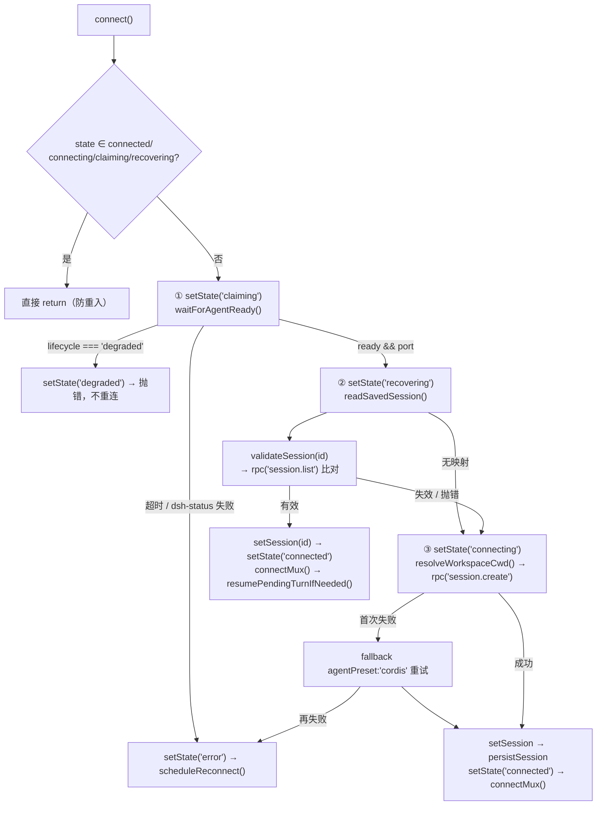

# Agent 面板通信与事件流（Agent Panel Communication & Event Streaming）

> **一句话定位**：Agent 面板是渲染进程与 DSH 内核（`:3080`）之间**唯一的通信层**——它管连接状态机、会话映射、事件去重与输入语义，把 DSH 的 48 种 SessionEvent 折叠成 UI 能订阅的少量事件。
>
> **什么时候会用到你**：排查「Agent 面板连不上/消息不刷/消息重复/停止后还在打字/刷新后丢消息」、新增一种 DSH 事件的处理、改连接或重连策略、给输入框加新的输入语义。
>
> 代码位置：`src/editor/AgentService.ts`、`src/components/AgentPanel.tsx`、`src/components/agent/`、`src/types/agent.ts`

---

## 1. 先记住这几个文件

| 文件 | 一句话职责 | 你要改它的场景 |
|---|---|---|
| [AgentService.ts](../../../src/editor/AgentService.ts) | 通信层全部：状态机、mux 下行流、seq 去重、会话映射、RPC 代理 | 加事件类型 / 改重连策略 / 改输入语义 |
| [AgentPanel.tsx](../../../src/components/AgentPanel.tsx) | UI 宿主：订阅事件流、渲染消息队列与侧边栏、把用户动作转调 service | 改面板交互 / 改消息上屏时机 |
| [agent.ts](../../../src/types/agent.ts) | 契约层：`ConnectionState` 八态、`AgentEventType` 全部事件、问答/审批结构 | 加状态或事件类型时先改这里 |
| [ConnectionIndicator.tsx](../../../src/components/agent/ConnectionIndicator.tsx) | 状态灯 + 点击行为；`degraded` → 手动重启入口 | 改状态展示 / 改点击语义 |

**关键心智模型（最容易误解的一条）**：`AgentService` **不决定 agent 进程的生死**。它只在 `claiming` 阶段**等**主进程把 agent 引导好，拿到端口就走；agent 的探测/认领/崩溃自愈/手动重启全部归 Electron 主进程（`bootstrapDSH` / `onDshChildExited` / `dsh-restart` IPC）。所以你在这份代码里**找不到任何 spawn/kill agent 的调用**，也不要试图在这里加重试重启——那是越界。详见 §8。

---

## 2. 连接状态机：从 `idle` 到 `connected`

### 2.1 谁调用了它

`AgentPanel` 挂载时调一次（[AgentPanel.tsx:556-573](../../../src/components/AgentPanel.tsx)）：

```ts
const autoConnect = async () => {
  try {
    await agentService.connect()
    addConsoleOutput('[Agent] 已自动连接到 DSH Agent')
  } catch {
    // 连接失败不提示，用户可手动重试
  }
}

const currentState = agentService.getState()
setConnectionState(currentState)
if (currentState === 'idle') {
  autoConnect()
} else if (currentState === 'connected') {
  // HMR 后 AgentService 存活且已连接 → 从 DSH 恢复历史消息
  restoreHistory()
}
```

**为什么要先看 `currentState`**：`agentService` 是模块级单例（`AgentService.ts:2182`），HMR 热替换后旧实例的连接状态会被搬到新实例上（见 §9 坑 4）。此时状态已经是 `connected`，再调 `connect()` 会被守卫挡掉，必须改走 `restoreHistory()` 重新拉取历史消息——否则面板是空的。

### 2.2 八个状态（`types/agent.ts:158`）

| 状态 | 含义 | 谁会进 |
|---|---|---|
| `idle` | 未连接 / 已断开 | 初始、`disconnect()` |
| `claiming` | 等主进程引导 agent（探测/认领/spawn） | `connect()` 阶段 1 |
| `recovering` | 有 localStorage 映射，正在校验旧会话 | `connect()` 阶段 2 |
| `connecting` | 正在新建会话 / 重连中 | `connect()` 阶段 3、`reconnect()` |
| `connected` | 可正常通信 | 阶段 2/3 成功、`reconnect()` 成功 |
| `disconnected` | 显式断开 | — |
| `error` | 一次性错误，**可自动重连** | claiming 超时、session.create 失败、重连失败 |
| `degraded` | 终态故障：主进程自愈超限，**需手动重启** | `waitForAgentReady` 抛 `AGENT_DEGRADED` |

> **注意**：任务描述里提到的 `ready` **不是**连接状态——它是 `AgentEventType` 里的一个事件（`connect()` 成功后 `emit({ type: 'ready' })`）。真实状态名是 `connected`。

### 2.3 `connect()` 的三阶段



**① claiming：等主进程把 agent 引导好**

```ts
private async waitForAgentReady(): Promise<number> {
  const api = window.electronAPI
  if (!api?.dshStatus) return DSH_DEFAULT_PORT

  const deadline = Date.now() + AGENT_READY_WAIT_TIMEOUT_MS
  while (Date.now() < deadline) {
    let status: Awaited<ReturnType<typeof api.dshStatus>>
    try {
      status = await api.dshStatus()
    } catch (err) {
      console.error(`[${logTime()}]`, '[AgentService] dsh-status 查询失败:', err)
      status = undefined as unknown as Awaited<ReturnType<typeof api.dshStatus>>
    }
    if (status?.ready && status.port) return status.port
    if (status?.lifecycle === 'degraded') throw new Error('AGENT_DEGRADED')
    await new Promise(r => setTimeout(r, MAIN_READY_POLL_INTERVAL_MS))
  }
  throw new Error(`等待 agent 就绪超时(${AGENT_READY_WAIT_TIMEOUT_MS}ms)`)
}
```

三个反直觉点：

- **`!api?.dshStatus` 直接返回默认端口 `3080`**——浏览器调试模式没有 `dshStatus` IPC，假定 Vite 代理（`/api` → `:3080`）可用，压根不进入等待循环。所以在浏览器里永远看不到 `claiming` 卡住，但 Electron 里冷启动 spawn 要 30s 量级，这个 60s 上限（`AGENT_READY_WAIT_TIMEOUT_MS`）就是为它准备的。
- **`dsh-status` 抛错不中断循环**，只是把 `status` 置为 `undefined` 继续下一轮——主进程启动早期 IPC handler 可能还没注册，瞬时失败必须容忍。
- **`lifecycle === 'degraded'` 立刻抛 `AGENT_DEGRADED` 而不等满 60s**——degraded 是主进程自愈 5 次都失败后的终态，再等没有意义。

**② recovering：localStorage 映射决定走哪条路**

```ts
const saved = this.readSavedSession()
if (saved?.sessionId) {
  this.setState('recovering')
  try {
    const valid = await this.validateSession(saved.sessionId)
    if (valid) {
      this.setSession(saved.sessionId)
      this.setState('connected')
      this.reconnectAttempts = 0
      this.emit({ type: 'ready', payload: { sessionId: this.sessionId, recovered: true, restored: true } })
      this.connectMux()
      this.resumePendingTurnIfNeeded()
      return
    }
    console.warn(`[${logTime()}] [AgentService] 持久化会话已失效，回退新建: ${saved.sessionId}`)
    this.clearPersistedSession()
  } catch (err) {
    console.warn(`[${logTime()}]`, '[AgentService] 会话恢复尝试失败，回退新建会话:', err)
  }
}
```

注意 `validateSession` 的实现是拉**全量 `session.list` 再比对 id**（`AgentService.ts:402`），而不是专门的 validate RPC；并且它把「网络级失败」用 `throw` 抛出去、把「会话不存在」用 `return false` 区分开——但这里 `catch` 里两种都一并回退新建，因为新建路径会把网络错误自然暴露出来。

**③ connecting：新建会话带 cordis 兜底**

```ts
const cwd = await this.resolveWorkspaceCwd()
let createValue: { sessionId?: string } | null = null
try {
  createValue = (await this.rpc('session.create', { cwd })) as { sessionId?: string }
} catch (firstErr) {
  // 默认 preset 可能不存在，回退 cordis
  console.warn(`[${logTime()}]`, '[AgentService] 首次 session.create 失败，尝试 fallback preset cordis:', firstErr)
  createValue = (await this.rpc('session.create', { cwd, agentPreset: 'cordis' })) as { sessionId?: string }
}
if (!createValue?.sessionId) throw new Error('session.create 未返回 sessionId')
```

`cwd` 必须是绝对路径，否则 DSH 报 `cwd must be an absolute path`。`resolveWorkspaceCwd()` 三级回退：`electronAPI.getAppInfo().appRoot` → vite define 注入的 `__DEMOSTUDIO_ROOT__` → `'.'`。

### 2.4 失败分支：`error` 自动重连 vs `degraded` 手动重启

```ts
if (error instanceof Error && error.message === 'AGENT_DEGRADED') {
  this.setState('degraded')
  this.emit({ type: 'error', payload: { message: 'DSH Agent 故障（自愈失败），请在面板手动重启' } })
  throw error          // ← 注意：不调 scheduleReconnect()
}
this.setState('error')
this.emit({ type: 'error', payload: { message: ... } })
this.scheduleReconnect()
throw error
```

**为什么 degraded 不排重连**：重连解决不了进程已死的问题，只会每 16s 打一次日志。degraded 的唯一出口是用户在状态灯上点一下 → `handleRestartAgent()` → `electronAPI.dshRestart()`（主进程 IPC），面板再轮询 lifecycle 最长 90s 等它回到 `running`/`claimed`。

重连本身是指数退避（`scheduleReconnect`，`AgentService.ts:875`）：基数 1000ms、上限 16000ms、最多 5 次，超次后彻底停止并 warn。

---

## 3. 双通道事件流：mux 推送 + history 兜底

### 3.1 先纠正一个常见误解：Electron 模式下轮询回路根本不启动

```ts
/** mux 下行流是否在线（Electron 模式由 main 进程托管连接与 5s 自动重连） */
private isMuxAlive(): boolean {
  if (window.electronAPI?.onDshMuxFrame) return true
  return this.muxWs?.readyState === WebSocket.OPEN
}
```

Electron 模式下 `onDshMuxFrame` 存在，`isMuxAlive()` **恒为 `true`**——而 `send()` 和 `resumePendingTurnIfNeeded()` 都是 `if (!this.isMuxAlive()) await this.pollForResponse()`。所以：

| 模式 | mux 通道 | history 轮询回路 `pollForResponse` | 回合内心跳 `startTurnWatchdog` |
|---|---|---|---|
| Electron | main 进程托管 WS → IPC 转发 | **不启动** | 启动（静默 >1.5s 时拉一次 history） |
| 浏览器 | 直连 `ws://host/api/events.mux` | 启动（200ms 间隔） | 启动 |

也就是说 **Electron 模式下的"兜底"是 3s 心跳，不是 200ms 轮询**；200ms 轮询只存在于浏览器调试模式。别按旧文档的"两路并发"去理解。

### 3.2 mux 帧分派：`handleMuxFrame`

```ts
private handleMuxFrame(frame: unknown): void {
  const f = frame as { type?: string; rpcId?: string; method?: string; payload?: Record<string, unknown> }
  const method = f.method || f.type
  const payload = (f.payload || f) as Record<string, unknown>
  const rpcId = f.rpcId

  if (method === 'question/requested' && rpcId) {
    const questions = payload.questions as QuestionItem[] | undefined
    const sessionId = payload.sessionId as string | undefined
    if (questions && sessionId) {
      // 只处理当前会话的问题（mux 可能推送其他会话的 pending 帧）
      if (sessionId !== this.sessionId) return
      const req: PendingQuestionRequest = { rpcId, sessionId, questions }
      this.pendingQuestions.set(rpcId, req)
      this.emit({ type: 'questionRequest', payload: req })
    }
    return
  }
  // ... question/resolved、approval/requested、approval/resolved、session/event、
  //     session/projection、session/subscribed
}
```

`method = f.method || f.type` 这个 fallback 是因为帧有两套形状（外层 `server-request` 信封 vs 原始帧），`payload = f.payload || f` 同理。

**`session/projection` 分支（投影实时推送）**：DSH host 在投影（`title`/`sessionStats` 等）变化时主动推 `{ type: 'session/projection', sessionId, key, value, seq }` 帧——这是 DSH WebUI 会话标题实时刷新的同一机制。编辑器侧把它合并进会话列表缓存并广播 `sessionsUpdated` 事件：`mergeProjectionFrame`（纯函数）按 `${sessionId}:${key}` 记 seq 水位做 last-wins 去重（`seq <= 水位` 的帧丢弃，对齐 WebUI `projectionStore.apply`）；会话不在缓存（blank→listed 过渡）或未跟踪键走 300ms 防抖 `listSessions()` 全量刷新。`session/subscribed` 分支同时做水位截断（对齐 WebUI `projectionStore.truncate`）：agent 重启后基线回退，高于 `lastSeq` 的本地水位不可信，丢弃后防抖全量重种。

**每个分支都先比 `sessionId !== this.sessionId` 再 return**——mux 是整个连接的**多路复用**流，会把同一 DSH 上其他会话的 pending 帧一起推过来（编辑器内嵌面板和独立窗口共享 :3080）。少了这道判断，A 会话会渲染出 B 会话的问答卡片。

`session/subscribed` 分支是订阅握手，它带的 `lastSeq` 用来前跳 `_lastSeq` 基线：

```ts
if (sid === this.sessionId && typeof lastSeq === 'number') {
  const before = this._lastSeq
  this._lastSeq = Math.max(this._lastSeq, lastSeq)
  // [Trace] 订阅握手是异步的：若基线在 fold 之后才前跳并越过回合收尾，
  // 收尾事件被 seq 去重抑制 → 半截结论永远等不到补全（头号嫌疑取证点）
  if (this._lastSeq > before) {
    console.log(`[${logTime()}] [Trace][baseline] ${this.instanceId} session/subscribed 基线前跳: ${before} → ${this._lastSeq} (lastSeq=${lastSeq})`)
  }
}
```

源码直接把这段标为"头号嫌疑取证点"——见 §9 坑 2。

### 3.3 汇合点：`consumeSessionEvent` 按 seq 去重

这是三条路径（mux 推送 / history 轮询 / 回合心跳）**唯一的共同入口**：

```ts
private consumeSessionEvent(event: DshEvent): boolean {
  if (this.abortPolling) return false // stop 语义：中止后不再派发任何事件
  if (typeof event?.seq !== 'number' || event.seq <= this._lastSeq) {
    // [Trace] 收尾/整段/用户消息被基线抑制 = 恢复竞态的直接证据（chunk 被抑制是常态，不打）
    // 只记录 turn/end 事件，避免过多日志
    if (event?.type === 'turn/end') {
      console.log(`[${logTime()}] [Trace][baseline] ${this.instanceId} 基线跳过事件: type=${event?.type}, seq=${event?.seq}, _lastSeq=${this._lastSeq}`)
    }
    return false
  }
  this._lastSeq = event.seq
  this.lastEventAt = Date.now()
  return this.handleSessionEvent(event)
}
```

**为什么 `abortPolling` 要在最前面**：`stop()` 会置 `abortPolling = true`。此时还在途的推送事件必须被彻底丢弃，否则用户点了停止，助手文本还会继续往 UI 里灌。

**为什么 `seq <= this._lastSeq` 用 `<=` 而不是 `<`**：`seq` 从 0 起，`_lastSeq` 初值 `-1`；用 `<=` 保证 `seq === 0` 的第一条事件不会被漏掉，同时已消费的最大 seq 不会被重复处理。`_lastSeq` 是**会话维度**的，`setSession()` 会把它归零。

返回值是「是否为回合收尾事件」——调用方据此决定是否结束轮询/心跳。

`handleSessionEvent`（`AgentService.ts:1107`）负责按 48 种类型分发，关键几类：

| 事件类型 | 处理 | 说明 |
|---|---|---|
| `turn/start` | emit(`turnStart`) | 面板在此清空 todo（放在 start 而非 end，让上一轮结果留着回看） |
| `turn/end` | `flushAssistant(reasonKind === 'completed', reason, seq)` → emit(`turnEnd`) → `setRunning(false)` | **先提交消息再通知结束**，保证视觉顺序 = 事件顺序 |
| `step/end` | `flushAssistant(false, undefined, seq)` → emit(`stepEnd`) | 没有工具的普通 step 也要在边界显示完整消息 |
| `assistant/chunk` | `text-delta` 累加进 `assistantBuf`；`reasoning-delta` 累加进 `reasoningBuf` 并 `scheduleReasoningEmit()` | 推理走 60ms 节流**全量**下发（不是增量），乱序/丢帧可自愈 |
| `tool/call` | **先 `flushAssistant()`** → emit(`toolCall`)，记 `pendingTools` | 工具会把 assistant 段切开，不先提交则后续文本失去归属 |
| `tool/result` | 从 `pendingTools` 取工具名配对 → emit(`toolResult`)；`extractDiffsFromMeta(d.meta)` 提取 write/edit 的已应用差异一并下发 | 差异数据入口见 §12 |
| `user/message` | `source.kind !== 'user'` 时 emit(`context`) | 插件注入的上下文卡片；`surfaceOp !== 'append'` 与 `plugin === 'compact'` 跳过 |
| `session.idle` | `flushAssistant(true)` → `setRunning(false)` | 旧版兼容 |

### 3.4 兜底轮询 `pollForResponse`（浏览器模式）

```ts
private async pollForResponse(): Promise<void> {
  if (this.polling) return
  this.polling = true

  let attempts = 0
  try {
    await this.refreshSeqBaseline()
    while (attempts < MAX_POLL_ATTEMPTS && !this.abortPolling) {
      await new Promise(r => setTimeout(r, POLL_INTERVAL))
      if (this.abortPolling) break
      attempts++
      let events: Array<{ event: DshEvent }> = []
      try {
        const hist = (await this.rpc('session.history', { sessionId: this.sessionId })) as { events?: Array<{ event: DshEvent }> }
        events = hist?.events ?? []
      } catch { continue }
      const newEvents = events.filter(e => e.event.seq > this._lastSeq)
      if (!newEvents.length) continue
      attempts = 0                                   // ← 有增量就重置计数
      for (const { event } of newEvents) {
        if (this.consumeSessionEvent(event)) return   // 回合收尾，停止轮询
      }
    }
  } finally {
    // session.cancel 会设置 abortPolling。中止路径不能再 flush 缓冲区，
    // 否则停止后会重新派发 assistant 消息并触发前端打字机。
    if (!this.abortPolling) this.flushAssistant()
    this.polling = false
  }
}
```

三个要点：

- **`attempts = 0` 在有新事件时归零**——这个上限是「连续无事件」上限，不是总时长上限。流式回答持续输出时永远不会退出循环。
- **`finally` 里 `if (!this.abortPolling) this.flushAssistant()`**——停止路径绝不能再提交缓冲，否则停止后助手又补一段文本并触发打字机动画。
- `if (this.polling) return` 是重入守卫：同一时刻只允许一个轮询回路。切换会话时要靠 `drainPollingLoop()` 等它自然退出（见 §5.3）。

> 常量口径核对：`MAX_POLL_ATTEMPTS = 180`（`AgentService.ts:31`）与 `POLL_INTERVAL = 200`（`:30`），连续空转上限应为 **180 × 200ms = 36s**；源码注释写的 `~144s` 与算式对不上，按代码走。

### 3.5 回合心跳 `startTurnWatchdog`（两种模式都跑）

```ts
private startTurnWatchdog(): void {
  if (this.watchdogTimer) return
  this.watchdogTimer = setInterval(() => {
    if (!this._isRunning || !this.sessionId || this.polling || this.abortPolling) return
    if (Date.now() - this.lastEventAt < WATCHDOG_IDLE_MS) return
    void (async () => {
      try {
        const hist = (await this.rpc('session.history', { sessionId: this.sessionId })) as { events?: Array<{ event: DshEvent }> }
        for (const { event } of hist?.events ?? []) {
          if (this.abortPolling) return
          if (this.consumeSessionEvent(event)) return // 回合已收尾（setRunning(false) 会停心跳）
        }
      } catch { /* 下个心跳再试 */ }
    })()
  }, WATCHDOG_INTERVAL_MS)
}
```

心跳由 `setRunning()` 起停（`AgentService.ts:1455`）：`running` 变 true 时开，变 false 时关。它每 3s 检查一次，只有「距上次事件超过 1.5s」才真正发 RPC——推送正常流动时自动空转，零额外开销。这是 Electron 模式下**唯一的**丢事件兜底。


---

## 4. 会话恢复：localStorage 映射决定 recovering 还是 connecting

### 4.1 映射的存与读

```ts
const SESSION_STORAGE_KEY = 'demostudio.dsh.session'   // localStorage: { sessionId, port, savedAt }

private persistSession(): void {
  if (!this.sessionId) return
  try {
    localStorage.setItem(SESSION_STORAGE_KEY, JSON.stringify({
      sessionId: this.sessionId,
      port: this._agentPort || DSH_DEFAULT_PORT,
      savedAt: Date.now(),
    }))
  } catch { /* 隐私模式等场景写入失败可容忍 */ }
}
```

映射在三个时刻写：`connect()` 阶段 3 新建成功后、`switchSession()`、`createSession()`。读取失败（`try/catch` 包 `JSON.parse`）一律当无映射处理，回落到新建路径。

**注意 `port` 只是记录、不参与判定**——`readSavedSession()` 把 `port` 读出来了，但 `connect()` 阶段 2 里**没有任何代码比对 `saved.port` 与当前 `_agentPort`**。是否 recover 只看 `validateSession()` 能否在 `session.list` 里找到这个 id。agent 换了端口但会话还在，照样恢复。

### 4.2 `setSession` 是一次"全清"

```ts
/** 绑定会话并重置实时流状态（seq 基线 / 半截缓冲 / 工具配对表），防止旧会话 seq 抑制新会话事件 */
private setSession(id: string | null): void {
  this.sessionId = id
  this._lastSeq = -1
  this.clearLiveBuffers()
  this.lastFlushSeq = undefined
  this.pendingTools.clear()
}
```

新会话的 seq 从 0 起，而旧会话的 `_lastSeq` 可能已经很大——**不清零的话新会话的全部事件都会被去重挡掉**，表现为"切了会话后发消息毫无反应"。`pendingTools` 同理要清，否则新会话的 `tool/result` 会配对到旧会话的同名 `callId`。

### 4.3 断档续听：`resumePendingTurnIfNeeded`

刷新/重连接管后，DSH 里可能还有一个正在跑的回合。这段决定要不要续听：

```ts
private resumePendingTurnIfNeeded(): void {
  if (!this.sessionId || this.polling) return
  void (async () => {
    try {
      const hist = await this.rpc('session.history', { sessionId: this.sessionId }) as {
        events?: Array<{ event: { type: string; seq?: number } }>
      }
      const events = hist?.events ?? []
      if (!events.length) return
      const tailEvent = events[events.length - 1].event
      // 从尾向头找回合边界（scanUnclosedTurn）：先遇 turn/end = 已闭合；
      // 先遇 turn/start = 未闭合；都未遇到 = 历史中无回合，无需续听
      const unclosedTurn = scanUnclosedTurn(events)
      if (!unclosedTurn) return
      console.log(`[${logTime()}]`, '[AgentService] 检测到未完成回合，启动断档续听（热刷新期间结果将补齐显示）')
      await this.refreshSeqBaseline()
      this.setRunning(true)
      // mux 在线：session/event 推送 + 心跳兜底自动续听；离线才启动轮询回路
      if (!this.isMuxAlive()) await this.pollForResponse()
    } catch (err) {
      console.warn(`[${logTime()}]`, '[AgentService] 断档续听探测失败:', err)
    }
  })()
}
```

**为什么是"从尾向头找边界"而不是"看最后一条是不是 turn/end"**：末尾事件可能是 `assistant/chunk`、`tool/result` 之类，得往前找到真正的回合边界才能判断。三种结局：先撞 `turn/end` = 已闭合；先撞 `turn/start` = 未闭合要续听；两个都没有（新会话只有 permission/approval 这类固定事件）= 无回合可言。

**为什么先 `refreshSeqBaseline()` 再 `setRunning(true)`**：基线把 `_lastSeq` 顶到服务端最新，续听只收"基线之后"的新增量，不回放已有事件。顺序反了的话，历史事件会被当成新事件重放一遍。副作用见 §9 坑 2。

`if (this.polling) return` 这个守卫意味着：如果上一次轮询回路还没退出，续听会被**静默跳过**——所以 `switchSession()` 必须先 `drainPollingLoop()`。

### 4.4 历史 fold 与实时缓冲的衔接：`seedPendingTurn`

面板侧 `restoreHistory()` 拉到的尾页 fold 里可能包含"未闭合回合的半截段"，要续回实时缓冲继续累加（对齐 WebUI 的 PartialAccumulator）：

```ts
seedPendingTurn(partial: PendingTurnPartial): void {
  // 已提交过比 fold 末尾更新的段：半截前缀留在面板作历史，不再续入（防重复）
  if (this.lastFlushSeq !== undefined && this.lastFlushSeq > partial.throughSeq) return

  const adopt = (current: string | undefined, currentLastSeq: number | undefined, piece: string) => {
    if (!current) return { text: piece, lastSeq: piece ? partial.throughSeq : currentLastSeq }
    // fold 覆盖了 live 缓冲累积的全部区间（普遍情形：fold 比 live 更接近回合头部）→ 覆盖式采纳
    if (currentLastSeq !== undefined && partial.throughSeq >= currentLastSeq) return { text: piece, lastSeq: partial.throughSeq }
    // 罕见竞态：live 已越过 fold 末尾，文本无法按 seq 切分，退化为拼接（可能重复重叠段）
    console.warn(`[${logTime()}]`, '[AgentService] seedPendingTurn: live 缓冲已越过 fold 末尾，拼接采纳')
    return { text: piece + current, lastSeq: currentLastSeq }
  }
  // ... 分别采纳 assistant / reasoning 两段
}
```

三个分支讲清了 fold 与 live 缓冲的三重关系，判定全靠 `throughSeq` 与缓冲末 chunk 的 seq 比较。最后一个分支是**已知会重复**的退化路径，源码用 `console.warn` 明说了——排查"消息重复"时搜这条 warn 就能定位。

### 4.5 附带产物：上下文占用 fold 与输入框进度圈

输入框底部的上下文进度圈（`ContextRing`，对齐 DSH WebUI 的 ContextMeter）的数据链路是一条**独立的轻量 fold**，与消息 fold 同源不同算：

```
DSH 事件流 ──┬─ request/context      → _ctxWindow（分母，last-wins，无声明时清除）
             ├─ assistant/chunk(usage) → _ctxUsedTokens（分子，早期采样）
             └─ assistant/message(usage)→ _ctxUsedTokens（分子，同一步权威值覆盖）
                        │
                        ▼
          emit('contextPressure', { usedTokens, contextWindow })
                        │
                        ▼
          AgentPanel case 'contextPressure' → setContextPressure → InputBox → ContextRing
```

要点三条：

- **分子口径**：`input + cacheRead + cacheWrite + output`，即"该步完成时的实际占用"，恰是下一步请求将看到的确定性近似。DSH 的 `projectedTokens` 依赖完整表面折算（响应 compaction 立时缩小），编辑器没有表面 meter，靠下一次 usage 采样自校正——compaction 后的第一步会把分子拉回真实值。
- **双路 seed 与重置**：实时路径在 `handleSessionEvent` 里三处采样；`loadHistory` 全量 fold 时按同口径回放 seed（分页 prepend 不回写，防旧值覆盖实时新值），fold 完成后 emit 一次让切换会话后进度圈立即可用。`setSession` 清零 fold 状态（已并入"全清"清单）。
- **无数据不出环**：`usedTokens` 或 `contextWindow` 任一缺失，`ContextRing` 返回 null（对齐 DSH ContextMeter 行为）——新会话首条消息前、模型未声明容量时，输入框不显示圈。

---

### 4.6 切换会话：`switchSession` 合并为单次 history RPC（2026-09-10）

点击侧边栏切会话曾经连发**三次** `session.history`（服务端对冷会话每次都要全量解压+解析整个 `session.jsonl.zstd`，大会话明显卡顿）：`refreshSeqBaseline`（基线前跳）+ `resumePendingTurnIfNeeded`（未闭合回合探测）+ `loadHistoryPage`（尾页加载）。现在合并为一次——尾页本就同时携带这三份信息：

```
switchSession(id)
  ├─ abortPolling → pendingQuestions/Approvals 清空 → clearLiveBuffers
  ├─ drainPollingLoop() → setRunning(false) → setSession(id) → persistSession
  ├─ switchHoldback = []          ← 切换窗口开启：mux 推流暂存不消费
  ├─ await loadHistoryPage()      ← 唯一一次 session.history
  │     fold 完成时原子推进 _lastSeq（loadHistory 内建语义）
  ├─ finally：重放暂存事件（seq ≤ 基线的被去重丢弃，真正的增量照常消费）
  ├─ resumePendingTurnFromPage()  ← 页内 unclosedTurn → setRunning(true)，mux 离线才启轮询
  └─ 返回 HistoryPage 给面板直接上屏（面板不再二次 loadHistoryPage）
```

**为什么需要 `switchHoldback` 暂存窗口**：`setSession` 把基线清到 -1，到尾页 fold 立起新基线之间有一个 RPC 往返的窗口；mux 在此期间仍在推目标会话的事件，若直接消费，「已随 fold 上屏的历史」会同时进实时缓冲造成双路径重复消费。暂存后按 seq 门限重放即可——持久化过的事件 seq ≤ 基线被去重，只有真正的新增量通过。日志标记：`[Trace][switch] 切换窗口暂存 N 条…`。

**为什么可以不先立基线**：`loadHistory` 在 fold 结束时会把 `_lastSeq` 原子推进到页尾 seq（fold 循环同步无 await，见源码「fold 与去重基线在同一原子时刻推进」注释）；连接恢复路径（`connect()` → 面板 `restoreHistory()`）从来就是靠这套语义，切会话沿用即可。未闭合回合的探测改由尾页事件扫描 `scanUnclosedTurn`（纯函数，见 §7）完成，与原探测同一盲区（只看窗口内边界事件），语义不变。

---

## 5. 三种输入语义：send / steer / stop

### 5.1 分流在面板侧，不在服务侧

`InputBox` 只是个受控输入框，**不判断用哪种语义**；真正的分流在 `AgentPanel.handleSend`（[AgentPanel.tsx:1237](../../../src/components/AgentPanel.tsx)）：

```ts
const handleSend = useCallback(async (text: string) => {
  const isRunning = agentService.isRunning()
  setMessages(prev => [...prev, { id: `u-${Date.now()}`, role: 'user', content: text, ts: Date.now() }])
  setTodos([])
  if (isRunning) {
    addConsoleOutput(`[Agent] 引导 AI: ${text}`)
    await agentService.steer(text)
    // steer 同样会进入等待期：本轮尚未有输出时显示思考卡片
    setIsAgentRunning(true)
  } else {
    setIsAgentRunning(true)
    await agentService.send(text)
    addConsoleOutput(`[Agent] 发送消息: ${text}`)
  }
  refreshSessions()
}, [addConsoleOutput, pushSystem, refreshSessions])
```

判据只有一个：`agentService.isRunning()`。UI 上 `InputBox` 只是把 placeholder 换成「AI 运行中，输入消息将引导 AI」、给按钮加 `composer__card--steer` 样式；`submit()` 里注释明写「允许在 running 状态下发送（steer 模式）」，不拦。

### 5.2 `send` —— `mode: 'queue'`

```ts
async send(text: string): Promise<void> {
  if (this.state !== 'connected' || !this.sessionId) throw new Error('未连接到 DSH')

  // 上一段轮询回路若仍在跑，先温和停掉（200ms 内自然退出）
  if (this.polling) {
    this.abortPolling = true
    await new Promise(r => setTimeout(r, 200))
  }
  this.abortPolling = false
  this.clearLiveBuffers()
  // 以服务端最新 seq 为去重基线，隔离上一次 stop 遗留的迟到事件
  await this.refreshSeqBaseline()

  this.emit({ type: 'message', payload: { role: 'user', content: text } })
  this.setRunning(true)

  try {
    await this.rpc('session.prompt', {
      sessionId: this.sessionId,
      mode: 'queue',
      content: [{ type: 'text', text }],
    })
    if (!this.isMuxAlive()) await this.pollForResponse()
  } catch (error) {
    this.setRunning(false)
    if (this.abortPolling) return       // ← 中止导致的不算错误，不报 error
    this.emit({ type: 'error', payload: { message: ... } })
  }
}
```

四处反直觉：

- **`abortPolling` 先置 true、等 200ms、再置 false**——这是一次"温和重置"。轮询循环每轮 `sleep(200)` 后检查 `abortPolling`，所以 200ms 足够它退出；紧接着置回 false 是为了让 `resumePendingTurnIfNeeded` / 心跳能正常工作。
- **`clearLiveBuffers()` 在发消息前**——上一次 stop 留下的半截文本绝不能混进新一轮。
- **`refreshSeqBaseline()` 在 emit 用户消息之前**——把基线顶到服务端最新，隔离上一次 stop 之后才姗姗来迟的事件。
- **catch 里 `if (this.abortPolling) return`**——用户按了停止导致的 RPC 中断不是错误，不该弹错误提示。

### 5.3 `steer` —— `mode: 'steer'`

```ts
async steer(text: string): Promise<void> {
  if (this.state !== 'connected' || !this.sessionId) throw new Error('未连接到 DSH')

  this.emit({ type: 'message', payload: { role: 'user', content: text } })

  try {
    const result = await this.rpc('session.prompt', {
      sessionId: this.sessionId,
      mode: 'steer',
      content: [{ type: 'text', text }],
    })
    console.log(`[${logTime()}] [AgentService] 引导消息已发送:`, result)
  } catch (error) {
    console.error(`[${logTime()}] [AgentService] 引导失败:`, error)
    this.emit({ type: 'error', payload: { message: ... } })
  }
}
```

**和 `send` 的差异就是全部要点**：`mode` 从 `queue` 变 `steer`；**不** `clearLiveBuffers()`、**不** `refreshSeqBaseline()`、**不** `setRunning(true)`、**不**启动轮询。因为回合还在跑、缓冲还有用、运行态本来就是 true、mux 本来就在监听——steer 只是往当前 turn 里插一句。

### 5.4 `stop` —— `session.cancel`

```ts
async stop(): Promise<void> {
  if (!this.sessionId) throw new Error('无活跃会话')

  // 先阻止轮询，再等待取消 RPC，避免 RPC 往返期间继续派发历史事件。
  this.abortPolling = true
  this.clearLiveBuffers() // 丢弃半截 assistant 缓冲（对齐旧轮询的中止语义）
  this.setRunning(false)
  try {
    const result = await this.rpc('session.cancel', { sessionId: this.sessionId })
    console.log(`[${logTime()}] [AgentService] 停止命令已发送:`, result)
  } catch (error) { /* ... */ }
}
```

**顺序是硬要求**：`abortPolling = true` 必须在 RPC 之前，否则 RPC 往返那几十毫秒里历史事件还会继续派发进 UI。`setRunning(false)` 顺带停掉回合心跳。

| 语义 | RPC | mode/动作 | 清缓冲 | 重立基线 | 改运行态 | 启轮询 |
|---|---|---|---|---|---|---|
| `send` | `session.prompt` | `queue` | 是 | 是 | →true | 仅 mux 离线时 |
| `steer` | `session.prompt` | `steer` | 否 | 否 | 不变 | 否 |
| `stop` | `session.cancel` | 协作式中止 | 是 | 否 | →false | 否（掐断） |

### 5.5 图片附件：粘贴 → 随消息发送（2026-09-10）

输入框支持 Ctrl+V 粘贴图片（截图/复制的图），随下一条消息一起发给模型：

```
Ctrl+V → InputBox.onPaste（clipboardData.items 取 kind==='file' 且 image/ 前缀）
        → AgentPanel.handleAddImages（MIME 白名单 png/jpeg/webp/gif + 每条 ≤9 张）
        → 草稿 PendingImage[]（按会话保留，blob URL 预览）
        → 发送时 AgentService.buildPromptContent：File → arrayBuffer → base64
          content = [{type:'image', mediaType, data, name?}..., {type:'text', text}?]
        → session.prompt（与 DSH WebUI sendSession 同一线上格式）
```

要点：

- **对齐 DSH WebUI**：image part 的线上格式（纯 base64、不带 `data:` 前缀）、MIME 白名单、图片在前文本在后的顺序，全部照抄 `dsh-client-ui-conversation` 的 `sendSession/encodeImage`；历史里图片以 attachmentId 落盘，请求构建时由 DSH 重编码内联（见记忆 `dsh_image_pipeline_anchors`）。
- **空文本带图可发**：`isEmpty = !text.trim() && images.length === 0`，只发图片时 content 只有 image parts；队列发送（排队消息）同样携带图片。
- **blob URL 生命周期**：发送后草稿清空但 **URL 不 revoke**（保留给上屏消息缩略图渲染，泄漏上限 = 会话内发送量）；仅未发送就手动移除的图片立即 revoke。
- **CSP 前置条件**：`agent.html` / `index.html` 的 `img-src` 必须含 `blob:`（2026-09-10 修复：原 `img-src 'self' data:` 把 blob 图片拦成空白缩略图）。断言图片真实加载要用 `img.complete && naturalWidth > 0`——CSP 拦截时 img 仍"可见"（容器有尺寸），`toBeVisible` 抓不住。
- **单测/e2e**：`tests/agentImagePaste.test.tsx`（白名单/编码/组装/paste 行为全分支）+ `tests/e2e/agent/image-paste.spec.ts`（页面内 fetch hook 拦截 `session.prompt` 断言请求体，无真回合副作用）。

---

## 6. 问答与审批：经 `rpcId` 回传

### 6.1 请求进来（`question/requested`）

mux 推来 `question/requested` 帧 → `handleMuxFrame` 存进 `pendingQuestions: Map<rpcId, PendingQuestionRequest>` 并 `emit({ type: 'questionRequest' })` → `AgentPanel` 存进 `pendingQuestions` state → 渲染 `QuestionCard`。

`PendingQuestionRequest` 三字段（`types/agent.ts:397`）：

```ts
export interface PendingQuestionRequest {
  /** mux 帧的 rpcId，也是 respond 的回执标识 */
  rpcId: string
  sessionId: string
  questions: QuestionItem[]
}
```

### 6.2 回答出去（`answerQuestion`）

`QuestionCard` 只产出 `answer` 结构，**不碰通信**；提交由 `AgentPanel.handleQuestionAnswer` 调服务：

```ts
const handleQuestionAnswer = useCallback(async (rpcId: string, answer: QuestionAnswer) => {
  const ok = await agentService.answerQuestion(rpcId, answer)
  if (ok) {
    setPendingQuestions(prev => prev.filter(q => q.rpcId !== rpcId))
    pushSystem('已提交回答')
  } else {
    pushSystem('回答提交失败')
  }
}, [pushSystem])
```

```ts
async answerQuestion(rpcId: string, answer: QuestionAnswer): Promise<boolean> {
  const req = this.pendingQuestions.get(rpcId)
  if (!req) {
    console.warn(`[${logTime()}] [AgentService] answerQuestion: rpcId=${rpcId} 不在 pending 列表中`)
    return false
  }
  const ok = await this.respond(rpcId, {
    ok: true,
    value: { sessionId: req.sessionId, answer },
  })
  if (ok) this.pendingQuestions.delete(rpcId)
  return ok
}
```

**为什么 `rpcId` 是唯一钥匙**：DSH 的问答是请求-响应配对，mux 只告诉客户端 `rpcId`，回执必须用同一个 id 发回去，DSH 才能把答案对上当时挂起的那个 `ask_user_question` 调用。不在 `pendingQuestions` 里的 rpcId 直接返回 `false`（例如已被 `question/resolved` 广播清掉、或属于别的会话）。

### 6.3 `respond` 走的是另一种信封

```ts
private async respond(rpcId: string, result: {...}): Promise<boolean> {
  const api = window.electronAPI
  const message = { type: 'client-response', rpcId, result }

  if (api?.dshRespond) {
    // Electron 模式：通过专用 IPC（client-response 信封，非 client-request）
    const resp = await api.dshRespond(message)
    return resp?.accepted === true
  }
  // 浏览器模式：直接 POST /api/respond（Vite 代理到 DSH :3080）
  // ...
}
```

**`respond` 不能用 `rpc()`**：`rpc()` 发的是 `client-request` 信封（新请求），而回答是 `client-response`（回执），两者协议不同，所以 preload 专门开了 `dshRespond` 通道（[preload.ts:172](../../../electron/preload.ts)）。

审批（`approval/requested` → `answerApproval(rpcId, outcome)`）走**完全相同**的 `respond` 通路，只是 `outcome` 限定为 `'allowed-once' | 'rejected'`；决议广播 `approval/resolved` 按 `approvalId` 反查并删除 pending，卡片随即移除。

---

## 7. 关键方法速查

| 方法 | 位置 | 干什么 | 注意 |
|---|---|---|---|
| `connect()` | AgentService.ts:513 | 三阶段连接（claiming→recovering/connecting） | 状态守卫防重入；`degraded` 不排重连 |
| `waitForAgentReady()` | AgentService.ts:419 | 轮询 `dshStatus` 至 ready，≤60s | 无 `dshStatus` 直接返回 3080；`degraded` 立即抛 |
| `validateSession(id)` | AgentService.ts:402 | 拉 `session.list` 比对 id | 网络级失败会 throw |
| `readSavedSession()` / `persistSession()` | AgentService.ts:346 / 358 | localStorage 会话映射读写 | `port` 只记录不判定 |
| `setSession(id)` | AgentService.ts:375 | 绑会话 + 重置 seq/缓冲/工具表 | **不清零新会话事件全被去重挡掉** |
| `refreshSeqBaseline()` | AgentService.ts:460 | 把 `_lastSeq` 顶到服务端最新 | 失败不阻塞主流程；**切会话已不再单独调用**（随 §4.6 合并） |
| `connectMux()` | AgentService.ts:620 | 建 mux 下行流（Electron IPC / 浏览器 WS） | 浏览器 WS 断线 3s 自动重连 |
| `isMuxAlive()` | AgentService.ts:655 | Electron 模式**恒 true** | 决定轮询回路是否启动 |
| `handleMuxFrame(frame)` | AgentService.ts:696 | mux 帧分派（question/approval/session.event/projection/subscribed） | 每分支先比对 sessionId |
| `consumeSessionEvent(ev)` | AgentService.ts:1090 | **三路汇合**：seq 去重后分发 | 返回是否为回合收尾 |
| `handleSessionEvent(ev)` | AgentService.ts:1107 | 48 种事件类型分发 | `tool/call` 前必须 flush |
| `flushAssistant(...)` | AgentService.ts:1059 | 提交 assistant 段为 `message` 事件 | 先发末次推理再提交 |
| `clearLiveBuffers()` | AgentService.ts:1080 | 丢弃半截缓冲（不派发 UI） | stop / send / 切会话前调 |
| `send(text)` | AgentService.ts:927 | `session.prompt` mode=`queue` | 清缓冲 + 重立基线 + 启轮询 |
| `steer(text)` | AgentService.ts:967 | `session.prompt` mode=`steer` | 四件事全不做 |
| `stop()` | AgentService.ts:995 | `session.cancel` 协作式中止 | `abortPolling` 必须在 RPC 前 |
| `pollForResponse()` | AgentService.ts:1403 | 兜底轮询（浏览器模式） | 有增量即重置 attempts；finally 里中止不 flush |
| `startTurnWatchdog()` | AgentService.ts:1373 | 回合内 3s 心跳补漏 | 静默 <1.5s 时空转 |
| `scheduleReconnect()` | AgentService.ts:875 | 指数退避重连，1s→16s，最多 5 次 | `autoReconnect` 关时不排 |
| `resumePendingTurnIfNeeded()` | AgentService.ts:520 | 断档续听探测（connect/reattach 路径） | `polling` 为真时**静默跳过**；切会话改走页内版 `resumePendingTurnFromPage` |
| `seedPendingTurn(partial)` | AgentService.ts:1905 | fold 半截段续入实时缓冲 | 罕见竞态会 warn「拼接采纳」 |
| `recordContextUsage(usage)` | AgentService.ts:1489 | 上下文占用分子采样（last-wins + 去重） | 变化才 emit，见 §4.5 |
| `emitContextPressure(seq, time)` | AgentService.ts:1505 | 下发占用快照（进度圈数据源） | 分子分母独立 last-wins |
| `answerQuestion(rpcId, ans)` | AgentService.ts:826 | 回传问答（走 `respond`） | 不在 pending 里返回 false |
| `answerApproval(rpcId, outcome)` | AgentService.ts:856 | 回传审批（同一 `respond` 通路） | outcome 仅 allowed-once/rejected |
| `scanUnclosedTurn(events)` | AgentService.ts:230 | 页内回合边界判定（纯函数，全分支单测） | 从尾向头：先遇 turn/end=闭合，先遇 turn/start=未闭合 |
| `loadHistoryPage(beforeSeq?)` | AgentService.ts:2086 | 尾页/翻页加载（每页 50 条消息） | 返回含 `pendingTurnPartial` / `unclosedTurn` |
| `switchSession(id)` | AgentService.ts:2204 | 切会话 + 尾页加载**合并为 1 次 RPC**（清缓冲→drain→holdback 暂存→单次加载→基线随 fold 立起→页内续听） | 见 §4.6 与 §9 坑 3 |
| `resumePendingTurnFromPage(page)` | AgentService.ts:2242 | 页内版断档续听（免二次 RPC） | `unclosedTurn` 才恢复运行态；mux 离线才启轮询 |
| `createSession()` | AgentService.ts:2250 | 新建会话（含 cordis fallback） | 复用 switchSession 的清理语义 |
| `releaseForHmr()` / `reattachLiveStream()` | AgentService.ts:672 / 684 | HMR 释放旧下行流 / 新实例重挂 | 见 §9 坑 4 |

---

## 8. 流程影响：牵动哪些功能

### 8.1 上游：谁驱动它

| 上游 | 怎么驱动 | 相关文档 |
|---|---|---|
| Electron 主进程（agent 引导/所有权/崩溃自愈） | `claiming` 阶段轮询 `dsh-status` 等引导完成；`degraded` 终态由主进程置位 | [DSH 引擎集成](../../harness/dsh_engine_integration.md) |
| Electron 菜单 / 快捷键 | `dsh-open-agent-window` → 独立窗口加载 `agent.html`（`agent-main.tsx`，只挂 `AgentPanel`，不初始化引擎） | [编辑器核心](../core/core_system.md) |
| MCP 调试桥（`:9877`） | `dsh-restart` 命令走主进程重启链路，与面板的手动重启同一出口 | [MCP 集成](./mcp_integration.md) |
| DSH Host（`:3080`） | mux WS 推 `session/event` / `question/*` / `approval/*`；RPC 响应驱动状态机 | [DSH 引擎集成](../../harness/dsh_engine_integration.md) |
| localStorage 会话映射 | 编辑器刷新后读取，决定走 `recovering`（续听）还是 `connecting`（新建） | 本文档 §4 |
| 编辑器面板挂载 | React 面板容器决定 `AgentPanel` 挂载位置与可见性 | [UI 面板组件](../ui/ui_components_system.md) |

### 8.2 下游：它波及谁

| 下游功能 | 波及点 | 相关文档 |
|---|---|---|
| `AgentPanel` 消息列表 | `onEvent(cb)` 订阅事件流；`message` / `reasoning.delta` / `turnStart` 驱动显示队列与打字机 | [UI 面板组件](../ui/ui_components_system.md) |
| `SessionSidebar` | `listSessions()` 拉列表；切换/新建/删除全部回写 localStorage 映射；按 `updatedAt` 自动分组——超过 3 天的会话收进「3 天前的会话（N）」折叠组（默认收起，点击展开，`sessionGrouping.ts` 纯逻辑），当前会话与缺 `updatedAt` 的会话始终平铺在近期组 | [UI 面板组件](../ui/ui_components_system.md) |
| `SessionTitle`（头部当前会话标题） | 头部左侧显示当前会话标题投影：`resolveSessionTitle` 纯函数解析——无会话回退「Agent」、blank 新会话或标题投影仍回退 sessionId 原文时显示「新会话」，其余显示标题原文；实时性由 `session/projection` 投影帧合并 → `sessionsUpdated` 事件驱动（§3.2），`turnEnd`/切换/连接时另有 `refreshSessions()` 全量对账 | [UI 面板组件](../ui/ui_components_system.md) |
| `InputBox` | `isRunning()` 决定 send/steer 分流与 placeholder；停止按钮仅 running 时出现 | [UI 面板组件](../ui/ui_components_system.md) |
| `ContextRing`（输入框进度圈） | `contextPressure` 事件驱动；分子分母任一缺失不出环（§4.5） | [UI 面板组件](../ui/ui_components_system.md) |
| `QuestionCard` / `ApprovalCard` | `question/requested`、`approval/requested` 渲染交互卡，回答经 `answerQuestion(rpcId)` 回传 | [UI 面板组件](../ui/ui_components_system.md) |
| `ConnectionIndicator` | 状态灯映射八态；`degraded` 点击 → `handleRestartAgent()` → `dshRestart()` IPC | [UI 面板组件](../ui/ui_components_system.md) |
| `ModelSelector` / `SettingsPanel` / `SkillManager` | 直接 import `agentService` 单例调 `getModels` / `selectModel` / `describeSettings` / `rpc('skill.list')` | [UI 面板组件](../ui/ui_components_system.md) |
| 插件服务 `PluginService` | `isConnected()` 作为插件操作的前置校验 | [编辑器核心](../core/core_system.md) |
| DSH 内核版本管理 | `dshCheckUpdate` 每 30 分钟轮询，`KernelUpdateModal` 提示升级 | [DSH 引擎集成](../../harness/dsh_engine_integration.md) |

### 8.3 边界：agent 生死不归这里管

这条单独拎出来，因为最容易误解：

| 能力 | 归属 | 入口 |
|---|---|---|
| 探测 / 认领 / spawn agent | **Electron 主进程** | `bootstrapDSH()`，main.ts:638 |
| 崩溃自愈（指数退避，最多 5 次） | **Electron 主进程** | `onDshChildExited()`，main.ts:604 |
| 手动重启（kill → 等端口释放 → 重引导） | **Electron 主进程** | `dsh-restart` IPC，main.ts:848 |
| 编辑器心跳 / 所有权注销 | **Electron 主进程** | `startDshEditorHeartbeat()`，main.ts:438 |
| 建立会话、发消息、收事件、重连 | **AgentService（本文档）** | `connect()` / `send()` / `connectMux()` |

`AgentService` 与 agent 进程的**唯一接触面**是只读的 `dshStatus()` 查询。它**不能**重启 agent，面板上的"重启"按钮也只是把请求转发给主进程 IPC（[AgentPanel.tsx:1203](../../../src/components/AgentPanel.tsx)），然后自己轮询 lifecycle 最长 90s 等结果：

```ts
const handleRestartAgent = useCallback(async () => {
  const api = window.electronAPI
  if (!api?.dshRestart || !api.dshStatus) {
    addConsoleOutput('[Agent] 当前环境不支持 agent 重启（浏览器模式）')
    return
  }
  await api.dshRestart()
  // 轮询 lifecycle 直至就绪（spawn 冷启动上限约 30s，留足余量）后自动重连
  const deadline = Date.now() + 90000
  const poll = window.setInterval(async () => {
    const status = await api.dshStatus()
    if (status?.ready && (status.lifecycle === 'running' || status.lifecycle === 'claimed')) {
      window.clearInterval(poll)
      await agentService.connect()
      // ...
    }
  }, 1000)
}, [addConsoleOutput, refreshSessions])
```

浏览器模式没有 `dshRestart`，直接提示"当前环境不支持 agent 重启"。

---

## 9. 踩坑清单（都是真踩过的）

**1. mux 是多路复用流，会推其他会话的帧**
现象：A 会话莫名弹出 B 会话的问答卡片。原因：mux 共享一条连接，pending 帧带 `sessionId` 但不保证是当前会话。规则：`handleMuxFrame` 每个分支开头必须 `if (sessionId !== this.sessionId) return`，新增帧类型时别忘了这一行。

**2. seq 基线前跳会永久抑制回合收尾（源码自标"头号嫌疑取证点"）**
现象：恢复/重连后 AI 的半截结论永远等不到补全，UI 卡在"运行中"。原因：`refreshSeqBaseline()` 或 `session/subscribed` 把 `_lastSeq` 顶到服务端最新，若此时 `turn/end` 已产生，它就会因 `seq <= _lastSeq` 被去重永久丢弃。规则：排查时搜日志里的 `[Trace][baseline]`——`consumeSessionEvent` 对 `turn/end` 被抑制有专门一行日志「基线跳过事件」，一旦出现即为命中。

**3. 切会话必须 drain 轮询回路，否则续听被静默跳过**
现象：切到正在跑的会话后不显示"运行中"。原因：续听入口开头 `if (this.polling) return`，而旧回路还没退出。规则：`switchSession()` 按 `abortPolling = true` → `drainPollingLoop()`（等 ≤1200ms）→ `setSession()` → `switchHoldback = []` → 单次 `loadHistoryPage()` → 重放暂存事件 → `resumePendingTurnFromPage()` 的顺序走（2026-09-10 起三次 history RPC 已合并为一次，见 §4.6）；`createSession()` 沿用同一套清理语义。新增切会话路径照抄这套。

**4. HMR 不会自动重挂 mux，必须显式重建**
现象：改完代码热更新后，面板不再收到实时事件（状态灯还显示已连接）。原因：WS 连接 / IPC 监听不会跨模块热替换存活。规则：模块底部 HMR 守卫先 `releaseForHmr()` 存状态并掐断旧实例复活路径，新实例再 `reattachLiveStream()` 重建 mux 并续听；`AgentPanel` 挂载时也要判 `currentState === 'connected'` 改走 `restoreHistory()`（见 §2.1）。

**5. 停止后不能再 flush 缓冲**
现象：点了停止，助手又补一段文本、打字机继续跑。原因：`pollForResponse` 的 `finally` 无条件 flush。规则：`finally` 里必须是 `if (!this.abortPolling) this.flushAssistant()`；`stop()` 里 `abortPolling = true` 必须排在 RPC 之前。

**6. `setSession()` 忘记清零 `_lastSeq`，新会话全部静音**
现象：新建/切换会话后发消息毫无反应。原因：新会话 seq 从 0 起，旧 `_lastSeq` 很大，全部事件被去重挡掉。规则：`setSession()` 必须一并清 `_lastSeq = -1`、`clearLiveBuffers()`、`lastFlushSeq = undefined`、`pendingTools.clear()`。

**7. 浏览器模式与 Electron 模式的通信通路完全不同**
现象：浏览器里能跑、Electron 里不行，或反之。原因：Electron 走 `dshRpc` / `dshMuxConnect` / `dshRespond` 三个独立 IPC 通道，浏览器走 Vite 代理 + 直连 WS + `POST /api/respond`。规则：新增 RPC 用 `rpc()`（内部自动分流）可以；但**回执类**调用必须走 `respond()`，因为它用的是 `client-response` 信封，与 `rpc()` 的 `client-request` 不同协议。

**8. `session.create` 的 cwd 必须是绝对路径**
现象：新建会话报 `cwd must be an absolute path`。原因：DSH 侧强校验。规则：用 `resolveWorkspaceCwd()` 三级回退（`getAppInfo().appRoot` → `__DEMOSTUDIO_ROOT__` → `'.'`），别手写相对路径。

---

## 10. 边界条件

| 条件 | 行为 | 怎么应对 |
|---|---|---|
| 无 `electronAPI.dshStatus`（浏览器模式） | `waitForAgentReady()` 立即返回 3080，不进 claiming 等待 | 靠 Vite `/api` 代理；无 agent 时后续 RPC 报错 |
| `dshStatus.lifecycle === 'degraded'` | 立即抛 `AGENT_DEGRADED` → `setState('degraded')`，**不排重连** | 点状态灯手动重启（浏览器模式不支持） |
| 60s 内 agent 未 ready | 抛超时错 → `error` → 指数退避重连（1s→16s，最多 5 次） | 超 5 次彻底停止并 warn，需手动重连 |
| localStorage 会话映射失效 | `validateSession` 返回 false → `clearPersistedSession()` → 回落 `connecting` 新建 | 用户无感，只是没有历史 |
| validateSession 网络级报错 | 一并 catch 回退新建，错误由新建路径暴露 | 看 `[AgentService] 会话恢复尝试失败` 日志 |
| `session.create` 默认 preset 不存在 | catch 后带 `agentPreset: 'cordis'` 重试一次 | 两次都失败才进 `error` |
| 已 `connected` / `connecting` / `claiming` / `recovering` 时调 `connect()` | 直接 return，不重连 | 需要重连走 `reconnect()` 或先 `disconnect()` |
| mux WS 断线（浏览器模式） | 3s 后自动重连；重连期间靠 `pollForResponse` 兜底 | Electron 模式由 main 托管 5s 自动重连，`isMuxAlive()` 恒 true |
| 浏览器轮询连续 180 次无新事件（~36s） | 退出循环；有增量时 `attempts` 归零，流式输出永不超时 | 真正卡住时 UI 停在"运行中"，靠心跳/重连恢复 |
| 回合内 mux 静默 >1.5s | 3s 心跳拉一次 `session.history` 补漏 | 推送正常时心跳空转，零开销 |
| 同时经两条通道收到同一事件 | `consumeSessionEvent` 按 `seq <= _lastSeq` 去重 | 基线前跳导致的抑制是无意的，见 §9 坑 2 |
| `stop()` 后仍在途的推送事件 | `abortPolling` 为 true，入口直接 return false 丢弃 | 保证了"停止即静默" |
| 新建会话后立即发消息 | `createSession()` 已走完 `setSession` + `refreshSeqBaseline` | 无额外等待需求，直接 `send()` 即可 |
| HMR 热替换 | 旧实例 `releaseForHmr()` 置 idle 掐断复活；新实例 `reattachLiveStream()` 重挂 | 面板挂载时判 `connected` 改走 `restoreHistory()` |
| Electron 独立窗口 | `agent.html` → `agent-main.tsx`，只挂 `AgentPanel`，不初始化引擎 | 与内嵌面板共享同一 :3080 与同一批会话 |
| `answerQuestion` 的 rpcId 不在 pending | 打 warn 并返回 `false`，面板提示「回答提交失败」 | 通常已被 `question/resolved` 广播清掉 |
| `seedPendingTurn` 遇 live 缓冲越过 fold 末尾 | 退化为文本拼接，warn「拼接采纳」，可能重复重叠段 | 搜这条 warn 可定位消息重复 |

---

## 11. 使用统计面板：Token 消耗统计（2026-09-10）

头部「更多」(⋮) 下拉菜单 → 「使用统计」→ `UsageStatsPanel` 模态弹窗。布局对齐产品级用量统计页：五格统计行（累计 Token / 单日峰值 / 累计回合 / 当前连续天数 / 最长连续天数）+ 近 38 周 Token 活动热力图（12px 固定格，`HEATMAP_WEEKS` 常量与月份标签 grid 同源）+ 近 7 日 / 近 30 日切换的每日 Token 趋势图（输入侧 / 输出侧两条折线）。

### 11.1 数据从哪来：一次 session.list，零日志加载

```
UsageStatsPanel 挂载
  → agentService.listSessionUsage()           // AgentService.ts，一次 session.list RPC
    → 每行取 projections.values.tokenUsage / sessionStats / title
    → 过滤：blank 会话、零用量会话、本地删除黑名单
  → usageStats.ts 纯函数聚合（框架无关，vitest 全分支覆盖）
```

关键点：DSH 的 `tokenUsage` 投影（`@deepseek-ai/dsh-token-meter`）本身就是**整日志累计值**（`uncachedInputTokens / outputTokens / cacheReadTokens / cacheWriteTokens` 四桶互斥），由 host 端投影注册表的 watermark 缓存随 `session.list` 行携带——不用翻任何一条历史事件，278+ 会话也是一次 RPC。

### 11.2 按日分桶的口径与近似

`usageStats.buildDailyUsage` 把每个会话的全部用量归到其 `updatedAt` 的**本地日期**（活跃日归属）。这是有意的近似：DSH 投影不携带逐事件时间分布，逐事件分桶需对全部会话全量拉历史，不可承受。长会话跨天时历史 token 会整体记在最后活跃日——面板上有口径说明文案，别把这当 bug 修。

连续天数：`computeStreaks` 基于从最早活跃日到今天的连续日序列；今天未活跃时宽限跳过一天从昨天起算（GitHub/Duolingo 同惯例）。热力图强度按单日最大值的四分位分 0-4 档（`heatmapLevel`）。

### 11.3 改动时注意

- **新文件**：`src/components/agent/usageStats.ts`（纯函数）/ `UsageStatsPanel.tsx`（组件）；入口接线在 `AgentPanel` 头部下拉（`showUsageStats` 状态）。样式在 `src/styles/editor.css` 的 `usage-stats-*` 区段。
- **面板是条件渲染**（`{showUsageStats && <UsageStatsPanel/>}`），每次打开重新拉数——不要改成常驻 `visible` prop 模式，否则数据陈旧。
- **测试分工**：纯函数与组件分支在 `tests/usageStats.test.tsx`（mock 掉 AgentService）；真实链路在 `tests/e2e/agent/usage-stats.spec.ts`（期望值用页面内同源 `fetch('/api/session.list')` 现场推导，不硬编码）。
- e2e 的 DSH 探测要带重试：Vite 代理首访预热可能超 3s，`isDshAlive` 现为 5s 超时 + 2 次尝试。

---

## 12. 工具卡片 diff 视图：write/edit 卡片（2026-09-10）

agent 面板里 write/edit 工具卡片**默认自动展开**，展开体不是 JSON 参数而是 diff 视图：文件路径行 + 带行号的 ctx/del/add 行（del 红底红号带 `-`、add 绿底绿号带 `+`、ctx 白号）、hover 右上角复制按钮。失败调用与非文件工具回退原来的「输入/输出」JSON 视图。

### 12.1 数据从哪来：两路，权威路优先

```
工具调用中（无 result）        settle 后（有 result）
deriveDiffsFromArgs(name,args)          d.meta.diffs（DSH 已应用 hunk）
   ↑ 入参派生"将要做的修改"                 ↑ write/edit 的 presentResult 产物
   edit → {old_string,new_string}          computeHunkDiffs 用 structuredPatch(context:3)
   write → {content}（整文件全 add）        产出 [{path,oldText,newText}]，**带 3 行上下文**
```

权威路才是"真正落到文件里的修改"（入参可能与实际不一致：工具报错、旧串不唯一、同文件多次编辑），所以 `ToolCard` 的取值是：

```ts
const diffs = tool.diffs?.length ? tool.diffs
  : (tool.status === 'running' || tool.status === 'pending') ? deriveDiffsFromArgs(tool.name, tool.args)
  : null   // 失败/无 diffs（旧会话回放）→ 通用 JSON 视图
```

`tool.diffs` 的入口是 `AgentService.extractDiffsFromMeta(meta)`（模块级纯函数，防御式收窄，对齐 DSH `dsh-tool-fs` 的 `diffsFromMeta`）：形状不符整表拒绝返回 `undefined`，宁可回退通用卡片也不渲染半份 diff。**实时路径（`handleSessionEvent` 的 `tool/result`）与历史 fold 路径（`loadHistory`）都要接**——两处都已接，漏一处就是"实时有、切会话后没了"。

### 12.2 行对齐：前缀/后缀切分而不是 LCS

`toolDiff.alignDiffRows` 不引入 diff 库：把 hunk 的 `oldText`/`newText` 按数组行做**公共前缀 + 公共后缀**切分，中段 old 侧全 `del`、new 侧全 `add`：

```
oldText: a b c OLD d e f      →  rows: ctx a@6 ctx b@7 ctx c@8
newText: a b c NEW d e f               del OLD@9
    前缀=3 后缀=3                       add NEW@9     ← 单 gutter：del 显旧号、add 显新号
                                       ctx d@10 ctx e@11 ctx f@12
```

够用且确定性好：DSH 给的 hunk 只有一处连续改动（context=3），前缀/后缀切分与 LCS 结果一致；代价是中段有多个分散改动时会显示为"先全删后全加"，不追求逐行配对。

### 12.3 绝对行号：读文件锚定，失败回退 1

hunk 里**没有起始行号**（`computeHunkDiffs` 丢掉了 `hunk.oldStart/newStart`），所以 `resolveDiffStartLines` 展开时异步读当前文件（`window.electronAPI.readTextFile`），用锚点文本定位：

- 锚点 = `newText`（纯删除时退回 `oldText`），按路径缓存文件内容、同文件多 hunk 用**游标顺序推进**（否则重复内容全命中第一处）；
- 读到的文件是 CRLF、DSH diff 基线是 LF → 定位前统一 `\r\n → \n` 归一；
- 任一环失败（无 electronAPI / 读不到 / 内容已被后续编辑覆盖）→ 该 hunk 无行号，渲染回退 1 起始。**这是 best-effort 装饰，不要让它阻塞渲染**。

### 12.4 三条验收行为（改这块别再改回去）

| 行为 | 决策 | 锁定它的测试 |
|---|---|---|
| 默认展开 | edit/write 卡片 `useState(() => isDiffToolName(tool.name))`，点击头部仍可收起 | `tests/toolCardDiff.test.tsx` 收起/再展开用例 |
| 不折叠 | 长 diff 全量渲染，**没有**「其余 N 行」折叠（DSH WebUI 默认折 16 行，这里按用户要求去掉） | 同上「30 行直接全部渲染」用例 |
| 行号配色 | ctx 白（`label-primary`）、del 红（`state-error-primary` + `-`）、add 绿（`state-success-primary` + `+`） | `tests/e2e/agent/tool-card-diff.spec.ts` 断言 computedStyle 精确 RGB |

### 12.5 文件与测试分工

- 纯函数：`src/components/agent/toolDiff.ts`（`isDiffToolName` / `deriveDiffsFromArgs` / `alignDiffRows` / `buildDiffRows` / `formatDiffRowsForCopy` / `resolveDiffStartLines`）→ `tests/toolDiff.test.ts` 全分支。
- 组件：`src/components/agent/ToolCard.tsx`（`DiffBody`）→ `tests/toolCardDiff.test.tsx`（自动展开/回退/复制/行号锚定）。
- 数据入口：`src/editor/AgentService.ts` 的 `extractDiffsFromMeta` → `tests/extractDiffsFromMeta.test.ts`。
- 真实链路：`tests/e2e/agent/tool-card-diff.spec.ts`——**用 `addInitScript` 把 `/api/*` 的 fetch 换成合成 RPC**（`session.list` / `session.history` 返回带 `meta.diffs` 的合成事件），因此不依赖 DSH 真身、无副作用；行号锚定的 `readTextFile` 也由页面内 stub 提供。这个"合成历史 + localStorage 命中恢复路径"的存根模式可复用到任何需要渲染既有转录的面板用例。
- 样式：`src/styles/editor.css` 的 `.tool-diff*` 区段（在 `.tool-card__details` 之后）。

---

## 13. 供应商设置：模型上下文与视觉配置（2026-09-11）

「更多」(⋮) → 「供应商设置」→ `SettingsPanel`。除 API Key 管理外，支持两层模型能力配置：

- **添加自定义第三方**：模型列表是行编辑器，每行 = 模型 ID + 上下文大小（token，可留空）+ 视觉勾选（= `input: ['text','image']`）；
- **编辑已有供应商**：卡片上的「编辑」按钮（仅 `settings.yaml` 里有用户级条目的供应商显示，纯内置目录不显示），可改显示名称 / Base URL / 模型行。写回走 `settings.mutate`（`op:'set', path:['providers', id]`），DSH 侧热加载即生效。

### 13.1 为什么需要：模态声明是 DSH 的收图门禁

DSH 判断"模型能否收图"看的是 `~/.dsh/settings.yaml` 里 `llm-pi-ai.providers.<id>.models[].input` 声明，**不是模型真实能力**。手工声明且 pi-ai 内置目录无同名条目的模型（如 glm-5.3-flash）`input` 缺省兜底 `["text"]`，请求带图直接被 `dsh-llm-pi-ai` 的门禁抛 "does not support image input"。此前只能手工改 settings.yaml，且该文件被重写时声明会丢；这个面板把两类字段（`contextWindow` / `input`）的产品化入口补上了。

### 13.2 写回语义（改这块别改回去）

`rowToModel` 以**原始旧条目为底**合并：保留 `maxTokens` 等未编辑字段；上下文留空/非法 → 删除 `contextWindow` 键（跟随目录默认，而不是继承旧值）；视觉勾选 → 写 `input:['text','image']`，取消 → **删除 `input` 键**（回退内置目录默认模态）。`handleSaveProviderConfig` 传给 `buildModelsFromRows` 的合并底必须是 `existing.models` 原始数组——换成裁剪过的投影对象会把未知字段静默丢掉（首版踩过，测试 `settingsPanelModels.test.tsx` 锁定）。

### 13.3 文件与测试分工

- 组件：`src/components/agent/SettingsPanel.tsx`（`ModelRowsEditor` 行编辑器 + `rowToModel` / `buildModelsFromRows` / `formatContextWindow` 等导出纯函数）；
- 样式：`src/styles/editor.css` 的 `.settings-panel__model-*` / `.settings-panel__config-edit` 区段；
- 单测：`tests/settingsPanelModels.test.tsx`（mock 掉 AgentService，断言 `settings.mutate` 载荷形状；vitest `globals:false` 下 testing-library 不自动清 DOM，必须手动 `afterEach(cleanup)`）；
- E2E：`e2e/agent/provider-model-config.spec.ts`——`addInitScript` hook `window.fetch` 按 RPC method 返回合成响应（`session.list` 命中 `demostudio.dsh.session` localStorage 映射走 recovering 路径），`settings.mutate` 只记录进 `window.__dshMutations` 不落真盘，全程无副作用。
