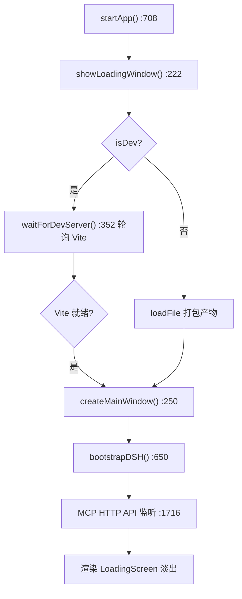

# Electron 主进程与 IPC（electron/）

> **一句话定位**：桌面壳的全部——无边框加载窗 → 编辑器主窗的启动编排、30+ 条 IPC 通道、MCP HTTP API 端口池、DSH agent 生命周期状态机，渲染进程与 Node/文件系统的唯一桥梁。
> **什么时候会用到你**：给渲染进程加新的系统能力（文件/对话框/进程）时；排查"白屏/加载卡住/agent 连不上/文件写不进去"时；想知道渲染进程某个 `electronAPI.xxx` 背后发生了什么时。
> 代码位置：`electron/main.ts`（主进程）、`electron/preload.ts`（IPC 桥）、`electron/projectRoots.ts`（工程根解析）

## 1. 先记住这几个文件

| 文件 | 一句话职责 | 你要改它的场景 |
|---|---|---|
| [main.ts](../../../electron/main.ts) | 主进程全部：窗口/IPC/日志/MCP/DSH | 加 IPC 通道、改启动流程 |
| [preload.ts](../../../electron/preload.ts) | contextBridge 白名单：渲染进程可见的 electronAPI | 加通道时必须同步在这里暴露 |
| [projectRoots.ts](../../../electron/projectRoots.ts) | 双工程根解析（内置 src/projects + 外部 projects/） | 改路径解析/逃逸防护规则 |
| [MockElectronAPI.ts](../../../src/editor/MockElectronAPI.ts) | 浏览器模式的 electronAPI 假实现 | 渲染侧新 API 需要浏览器调试时 |

**关键心智模型**：渲染进程**没有任何系统能力**，一切走 `preload.ts` 白名单 → `ipcMain.handle`。main.ts 头部注释写明启动编排："app 就绪后立即创建无边框加载窗口 (loading.html)，纯色底即时出窗 → 等待 Vite 开发服务器就绪 / 直接加载打包文件 → 就绪后关闭加载窗口，创建有边框编辑器主窗口"。加载窗先出是为了消灭白屏观感，不是装饰。

## 2. 启动流程：从 app.whenReady 到编辑器可用



两个值得知道的细节：

1. **Vite 轮询间隔 300ms**（`VITE_POLL_INTERVAL`，main.ts:350）——`waitForDevServer` 用 HTTP 探测 `http://localhost:5173`，端口被占用时 Vite 自动递增，此函数探测的是实际可达的 dev server。
2. **DSH 启动不在窗口路径上**——`bootstrapDSH` 探测/认领/spawn agent 是异步旁路，agent 挂了不影响编辑器窗口出现（详见 [dsh_engine_integration.md](../../harness/dsh_engine_integration.md)）。

## 3. IPC 通道全景

### 3.1 渲染 → 主（invoke/handle，preload.ts 白名单）

| 分类 | 通道 | 干什么 |
|---|---|---|
| 应用 | `get-app-info` / `toggle-dev-tools` | 版本信息 / 开发者工具 |
| 对话框 | `open-file-dialog` / `save-file-dialog` / `show-message-box` | 原生对话框三件套 |
| 文件 IO | `read-json-file` / `write-json-file` / `read-text-file` / `write-text-file` / `list-dir-files` | 项目内相对路径读写（有校验，见 §4） |
| 项目 | `create-project` / `discover-projects` / `list-project-assets` / `list-project-src` / `asset-file-ops` | 工程发现/资产列举/删除重命名 |
| 监听 | `watch-project-assets` / `stop-watch-project-assets` | fs.watch 替代轮询，变化推 `asset-changed`/`src-changed` |
| 日志 | `write-log-file` / `read-log-file` / `start-game-log` / `write-game-log` / `stop-game-log` | 控制台日志 + 游戏独立日志文件 |
| DSH | `dsh-status` / `dsh-rpc` / `dsh-mux-connect` / `dsh-respond` / `dsh-restart` / `dsh-list-versions` / `dsh-check-update` / `dsh-switch-version` | agent 状态/RPC 代理（绕 CORS）/版本管理 |
| 窗口 | `dsh-open-agent-window` | Agent 独立窗口（单例，随主窗级联关闭） |

### 3.2 主 → 渲染（事件推送）

| 事件 | 触发方 | 消费方 |
|---|---|---|
| `mcp-command` | MCP HTTP API 收到外部命令 | Editor.ts 命令分发 |
| `blueprint-request` | MCP 蓝图操作需要读编辑器状态 | BlueprintEditorService |
| `ai-chat` | 外部 AI 聊天请求 | AgentPanel |
| `game-input` | before-input-event 捕获的按键 | 游戏输入 |
| `menu-action` | 原生菜单点击 | Editor 菜单处理 |
| `asset-changed` / `src-changed` | fs.watch | assetLint / codeLint 重扫 |
| `dsh-mux-frame` / `dsh-update-progress` / `agent-log` | DSH WS / 更新流程 / agent 窗口 | AgentPanel / Console 面板 |

### 3.3 往返请求：pending map + 超时

```ts
// main.ts:129
const _blueprintPending = new Map<string, PendingBlueprintReq>()
const BLUEPRINT_REQ_TIMEOUT = 20000 // 渲染进程处理超时（含文件 IO）
```

MCP 工具要操作**活在渲染进程里的编辑器状态**（当前选择、UndoManager），走"主进程挂起 → `blueprint-request` 推给渲染 → `blueprint-response` 回传 → 唤醒挂起"的往返模式。`_blueprintPending` 按 requestId 存挂起者，20 秒超时兜底——渲染进程卡死/页签切换时 MCP 调用不会永久挂起。`mcp-command/mcp-response`、`ai-chat/ai-chat-response` 同构。完整往返链路见 [mcp_integration.md](./mcp_integration.md)。

## 4. 文件 IO 的安全边界

渲染进程的 `readJsonFile/writeJsonFile` 不是任意文件访问：

- **相对路径强制**：一律相对 `APP_ROOT`（`__dirname/..` = 仓库根）解析，[projectRoots.ts](../../../electron/projectRoots.ts) 统一处理
- **`.json` 后缀强校验**：writeJsonFile 拒绝非 .json 目标（SaveSlot/配置编辑器/蓝图写盘全部受益）
- **路径逃逸防护**：拒绝 `..` 等逃出项目根的路径——这就是为什么 SaveSlotComponent 的 filePath 必须在项目根内（[save_slot_component.md](../../engine/save_slot_component.md) 踩坑 3 的根源）
- **双工程根**：`resolveProjectRoots` 同时认内置 `src/projects/` 与外部 `projects/`（方案见 [external_project_roots.md](../../dev/external_project_roots.md)）

## 5. 日志与 MCP 端口池

```ts
// main.ts:164
const CONSOLE_LOG_FILE = path.join(LOG_DIR, `console_${timestamp}.log`)
// main.ts:170-172
const MAX_CONSOLE_LOG_FILES = 10
const MAX_GAME_LOG_FILES = 10
const MAX_DAILY_LOG_FILES = 10
```

主进程把渲染进程 console 全量转发到 `logs/console_YYYY-MM-DD_HHmmss.log`（每次启动独立文件），`cleanOldLogs` 按类型各保留 10 份——这就是"AI 可直接读日志诊断"约定（AGENTS.md 运行日志一节）的来源。游戏日志独立文件（`start-game-log` 三通道），随游戏启停开关。

```ts
// main.ts:1716-1717
const MCP_API_PORT_START = 9877
const MCP_API_PORT_MAX = 9927 // 最多尝试 50 个端口
```

MCP HTTP API 从 9877 起逐个探测空闲端口，最多 50 个——**多实例编辑器各占一个端口互不冲突**，这是 AGENTS.md"端口自动递增，支持多实例"的实现。MCP 工具清单见 [mcp_integration.md](./mcp_integration.md)。

## 6. 关键方法速查

| 方法 | 位置 | 干什么 | 注意 |
|---|---|---|---|
| `startApp()` | [main.ts:708](../../../electron/main.ts) | 启动总编排 | 加载窗 → Vite 等待 → 主窗 → DSH |
| `showLoadingWindow()` | [main.ts:222](../../../electron/main.ts) | 无边框加载窗 | 纯色底即时出窗 |
| `createMainWindow()` | [main.ts:250](../../../electron/main.ts) | 编辑器主窗 | 关闭加载窗后创建 |
| `waitForDevServer()` | [main.ts:352](../../../electron/main.ts) | 轮询 Vite 就绪 | 300ms 间隔 |
| `getSystemNodePath()` | [main.ts:87](../../../electron/main.ts) | 找系统 Node | DSH 必须 ≥22.19，Electron 内置 Node 不够 |
| `bootstrapDSH(source)` | [main.ts:650](../../../electron/main.ts) | 探测→认领→spawn agent | 状态机 off→probing→claimed/spawning→running |
| `onDshChildExited(code)` | [main.ts:616](../../../electron/main.ts) | 崩溃自愈入口 | 指数退避，5 次上限进 degraded |
| `stopDSHService()` | [main.ts:692](../../../electron/main.ts) | 停 agent | 认领的旧实例无句柄，只清所有权 |
| `connectMuxWs()` | [main.ts:911](../../../electron/main.ts) | DSH mux WS 下行桥 | question 事件帧推送 |
| `closeProjectWatchers()` | [main.ts:1583](../../../electron/main.ts) | 收敛 fs.watch | 窗口关闭时必须调用 |
| IPC 注册 | main.ts 各 `ipcMain.handle` | 30+ 通道 | 新通道须同步 preload.ts |

## 7. 流程影响：牵动哪些功能

### 上游：谁驱动它

| 上游 | 怎么驱动 | 相关文档 |
|---|---|---|
| `npm run electron:dev` | tsc 编译主进程 + electron 启动 + Vite dev server | [system_overview.md](../../system_overview.md) |
| 渲染进程 electronAPI 调用 | preload 白名单逐条 invoke | [ui_components_system.md](../ui/ui_components_system.md) |
| MCP 客户端（DSH/外部） | HTTP API → mcp-command 推给渲染 | [mcp_integration.md](./mcp_integration.md) |

### 下游：它波及谁

| 下游功能 | 波及点 | 相关文档 |
|---|---|---|
| DSH agent | spawn/心跳/自愈/所有权协议 | [dsh_engine_integration.md](../../harness/dsh_engine_integration.md) |
| Agent 面板 | dsh-rpc 代理 / mux 帧推送 / agent 窗口日志 | [agent_panel_system.md](./agent_panel_system.md) |
| 资产/代码检查 | fs.watch 变化事件驱动 assetLint/codeLint | [asset_preview_lint_system.md](../asset/asset_preview_lint_system.md) |
| 存档/配置/蓝图写盘 | writeJsonFile 通道 + 校验规则 | [save_slot_component.md](../../engine/save_slot_component.md) |

## 8. 踩坑清单（都有代码或文档依据）

**1. `editor.bat` 停在 pause 报错** —— 原因：主进程退出码非 0 会被脚本误判为出错。规则：主进程任何退出路径保证 exit code 0（AGENTS.md 已知坑），错误状态用日志表达而不是退出码。

**2. 新加了 ipcMain.handle 但渲染进程调不到** —— 原因：preload.ts 是 contextBridge **白名单**，main.ts 注册通道不会自动出现在 `window.electronAPI`。规则：加通道三件套——`ipcMain.handle` + preload `exposeInMainWorld` + 渲染侧类型（必要时 MockElectronAPI 补假实现，浏览器调试才能用）。

**3. 浏览器模式（Playwright）文件读写全失效** —— 原因：无 Electron 主进程，`window.electronAPI` 走 [MockElectronAPI.ts](../../../src/editor/MockElectronAPI.ts) 内存假实现，写盘类操作不落盘。规则：浏览器模式只验证 UI 逻辑；涉及真实文件/IPC 的验证去 Electron 窗口。

**4. DSH 起不来，报 Node 版本问题** —— 原因：Electron 内置 Node 版本不够（DSH 要求 ≥22.19）。规则：`getSystemNodePath()`（main.ts:87）已处理系统 Node 查找，spawn DSH 必须用它而不是 `process.execPath`。

**5. 第二个编辑器实例 MCP 连不上第一个的端口** —— 原因：MCP API 端口自动递增（9877→9927），每个实例端口不同。规则：多实例场景不要硬编码端口，从 `get-app-info` / 状态输出读实际端口。

**6. 改了资产但 assetLint 没反应** —— 原因：检查重扫由 fs.watch 的 `asset-changed` 事件驱动，watcher 在窗口关闭时由 `closeProjectWatchers` 收敛；如果 watch 建立失败会退化为不通知。规则：先看日志有没有 watch 建立记录，再手动触发重扫验证渲染侧逻辑。

## 9. 边界条件

| 条件 | 行为 | 怎么应对 |
|---|---|---|
| Vite 未就绪 | 轮询等待（300ms 间隔） | 卡住时查 Vite 端口/代理 |
| DSH 探测失败 | 进入 spawning 自行拉起 | 拉起失败重试退避，5 次后 degraded |
| DSH 已有实例（:3080 探测到） | claimed 认领复用，不重复 spawn | 多实例共享单 agent |
| 全部编辑器退出 | 心跳消失，watcher 宽限 30s 后收割孤儿 | 宽限期内核仍可被新实例认领 |
| 渲染进程 20s 未回响应答 | 挂起请求超时返回错误 | MCP 调用方收到失败而非挂死 |
| 写文件路径越界/非 json | IPC 拒绝并返回错误信息 | 用项目根内相对路径 |
| 日志超 10 份 | cleanOldLogs 删最旧 | 长期排查前先备份需要的日志 |
