# MCP 集成与调试桥（MCP Integration & Debug Bridges）

> **一句话定位**：外部 AI 控制编辑器的**外部通道层**——把 MCP stdio 调用翻译成 HTTP → IPC，送进渲染进程执行；页面内的 `window.__ai` 则是绕过这条链路的本地直连桥。
>
> **什么时候会用到你**：给 AI 客户端配 MCP 服务、新增一个 MCP 工具/命令、排查「工具调了但编辑器没反应」「返回值是 ack 不是结果」、多开编辑器实例连错了端口、浏览器调试模式下命令不通。
>
> 代码位置：`editor/mcp-server.mjs`、`electron/main.ts`（HTTP API，行 1650 起）、`electron/preload.ts`（IPC 桥）、`src/editor/EditorInitializer.ts`（渲染进程分发）

---

## 1. 先记住这几个文件

| 文件 | 一句话职责 | 你要改它的场景 |
|---|---|---|
| [mcp-server.mjs](../../../editor/mcp-server.mjs) | stdio MCP 服务器：声明工具清单，把工具调用转成 HTTP 请求 | 增删 MCP 工具、改工具 description（AI 靠它决定用不用） |
| [main.ts](../../../electron/main.ts) | HTTP API（:9877 起）：端口探测、判定往返/发射后不管、IPC 转发 | 加新命令、改端口策略、加主进程直处理命令 |
| [EditorInitializer.ts](../../../src/editor/EditorInitializer.ts) | 渲染进程命令分发：`onMCPCommand` 的 switch + `onBlueprintRequest` | 加命令分支、改执行结果结构 |
| [preload.ts](../../../electron/preload.ts) | `onMCPCommand` / `sendMCPResponse` 的 contextBridge 桥 | 改 IPC 通道名或签名时 |

**关键心智模型**：这条链路**不是一整条**，中间被 `requestId` 切成两种语义：

- **往返**（`ai_event` / `ai_list_events` / `run_asset_lint` / `run_code_lint` / `ui_compile`）：主进程生成 `requestId` + 挂起 HTTP 响应，渲染进程干完活 `sendMCPResponse` 回来才 resolve。**有返回值、有 20s 超时、窗口死了会 503。**
- **发射后不管**（`start_game` / `stop_game` / `send_input` / `addConsoleOutput`）：主进程立刻回 `200 { status:'ok', command }`，**拿不到执行结果**，且窗口已销毁时**照样返回 ok**。

想拿执行结果，就只能用往返类命令。这是本系统最容易踩的一处认知偏差。

---

## 2. 完整链路：从 AI 工具调用到 `AIModule.emit`

```mermaid
flowchart LR
    A["AI 客户端<br/>callTool(ai_event)"] -->|stdio| B["mcp-server.mjs<br/>CallToolRequestSchema:196"]
    B -->|"POST /api/command"| C["main.ts:1751<br/>JSON.parse(body)"]
    C --> D{"command 在<br/>往返白名单?"}
    D -->|"ai_event 等 5 个"| E["requestId = ai-N<br/>:1773 挂起 + 20s timer"]
    D -->|其他| F["webContents.send<br/>'mcp-command' :1852<br/>立即 200 ack"]
    E -->|"publishSSE('ai.event')"| G["SSE /api/events 旁路"]
    E --> H["webContents.send<br/>'mcp-command' + requestId :1797"]
    H --> I["preload.ts:37<br/>ipcRenderer.on('mcp-command')"]
    I --> J["EditorInitializer:431<br/>onMCPCommand switch"]
    J --> K["AIModule.instance.emit<br/>:486"]
    K --> L["sendMCPResponse :508"]
    L -->|"ipcRenderer.send 'mcp-response'"| M["main.ts:1629<br/>_blueprintPending.get(requestId)"]
    M --> N["pending.resolve<br/>HTTP 200"]
```



### 2.1 第一跳：MCP 服务器把工具调用摊平成 HTTP

`mcp-server.mjs` 自己**不认识任何编辑器语义**，它只做三件事：声明工具、拼 HTTP、把结果塞回 MCP content。核心就一个转发函数：

```js
async function callEditor(command, params = {}) {
  try {
    const resp = await fetch(`${EDITOR_API}/api/command`, {
      method: 'POST',
      headers: { 'Content-Type': 'application/json' },
      body: JSON.stringify({ command, params }),
    })
    if (!resp.ok) throw new Error(`HTTP ${resp.status}`)
    return await resp.json()
  } catch (err) {
    return { status: 'error', message: `编辑器不可达: ${err.message}` }
  }
}
```

> **为什么 catch 里返回一个"正常对象"而不是 throw**：MCP 客户端把 throw 当成工具崩溃，会把整个调用栈甩给用户；而"编辑器没开"是**预期内的常见状态**，应当让 AI 读到一句人话自己去启动编辑器。同理 `resp.ok` 为 false 时也主动 throw，好让 503/504 走同一个 catch 出口。

三个需要留意的分支写法：

```js
case 'toggle_game': {
  const status = await getEditorStatus()      // GET /api/status，不是 /api/command
  if (status.gameRunning) {
    return (await callEditor('stop_game'))
  } else {
    return (await callEditor('start_game'))
  }
}
```

> `toggle_game` **在服务器侧被拆成两次调用**：先查状态再决定发哪个命令。它**不会**发 `toggle_game` 给渲染进程——所以渲染进程里的 `toggle_game` 分支（`EditorInitializer.ts:471`）只在别的调用方（如直接 HTTP）才会走到，而那个分支无条件 `onLaunchGame()`，**没有停止能力**。这是历史遗留的不对称，别指望 `toggle_game` 能停游戏。

```js
case 'send_input': {
  const key = args?.key || ''
  await callEditor('send_input', { key })
  return {
    content: [{ type: 'text', text: JSON.stringify({ status: 'ok', key }, null, 2) }],
  }
}
```

> 这个 `{ status:'ok' }` 是 **MCP 服务器自己伪造的**，不是编辑器回的。因为 `send_input` 走发射后不管分支，编辑器那边即使窗口已销毁也照样回 ok。

```js
default:
  throw new Error(`未知工具: ${name}`)
```

> 新增工具时，**忘了在 `CallToolRequestSchema` 的 switch 里加 case，工具照样会出现在工具列表里**（因为 `ListToolsRequestSchema` 是独立的），只是调用时才抛"未知工具"。两个 switch 必须同步改——这就是历史上 `run_asset_lint` 出过的那个缺陷。

### 2.2 第二跳：主进程判定"往返还是发射后不管"

这是整条链路的**分水岭**，判定就是一行白名单：

```ts
if (cmd.command === 'ai_event' || cmd.command === 'ai_list_events' || cmd.command === 'run_asset_lint' || cmd.command === 'run_code_lint' || cmd.command === 'ui_compile') {
  // ai.event 转发（仅 ai_event 有事件语义；用于 ds-engine-tools 订阅；不影响原有的 renderer 往返）
  if (cmd.command === 'ai_event') {
    publishSSE('ai.event', {
      event: cmd.params?.event ?? cmd.params ?? 'unknown',
      payload: cmd.params?.payload,
      source: 'editor',
      ts: Date.now(),
    })
  }
  if (!mainWindow || mainWindow.isDestroyed()) {
    res.writeHead(503, { 'Content-Type': 'application/json' })
    res.end(JSON.stringify({ status: 'error', message: '编辑器窗口不可用' }))
    return
  }
  const requestId = `ai-${++_blueprintReqSeq}`
```

三点要讲清楚：

**① SSE 广播在 503 检查之前。** `publishSSE('ai.event', ...)` 是无条件先发的旁路广播，给 DSH 扩展订阅用。它**完全不影响** renderer 的往返，也**不保证**事件真的被执行了——即使后面窗口已销毁直接 503，SSE 订阅者照样收到了这条 `ai.event`。把它当成"发生了什么"的依据会误判。

**② 窗口存活检查只在往返分支有。** 发射后不管分支长这样：

```ts
if (mainWindow && !mainWindow.isDestroyed()) {
  mainWindow.webContents.send('mcp-command', cmd)
}
res.writeHead(200, { 'Content-Type': 'application/json' })
res.end(JSON.stringify({ status: 'ok', command: cmd.command }))
```

窗口死了 **IPC 不发，但 HTTP 照样 200 ok**。所以"命令返回 ok"根本不能证明命令被送达。

**③ requestId 前缀是硬编码的 `ai-`。** 同一个 `_blueprintReqSeq` 计数器还服务于蓝图（`bp-`）和 AI 聊天（`chat-`）：

```ts
const requestId = `bp-${++_blueprintReqSeq}`      // main.ts:1876  /api/blueprint
const requestId = `chat-${++_blueprintReqSeq}`    // main.ts:2040  /api/chat
```

> 三条链路**共用一张 `_blueprintPending` 表和同一个 20s 超时**，只是前缀不同。好处是 `mcp-response` 的监听对任意 requestId 通用（见 2.4）；代价是改 pending 表结构会同时影响三者。

### 2.3 第三跳：挂起响应与 20s 超时

```ts
const timer = setTimeout(() => {
  if (_blueprintPending.delete(requestId)) {
    try {
      res.writeHead(504, { 'Content-Type': 'application/json' })
      res.end(JSON.stringify({ status: 'error', message: `编辑器处理超时 (${BLUEPRINT_REQ_TIMEOUT}ms)` }))
    } catch { /* response already closed */ }
  }
}, BLUEPRINT_REQ_TIMEOUT)
_blueprintPending.set(requestId, {
  resolve: (result) => {
    try {
      res.writeHead(200, { 'Content-Type': 'application/json' })
      res.end(JSON.stringify(result))
    } catch { /* response already closed */ }
  },
  reject: (err) => { /* 500 */ },
  timer,
})
mainWindow.webContents.send('mcp-command', { ...cmd, requestId })
```

> `_blueprintPending.delete(requestId)` 当返回值用，是**防重入的关键技巧**：`Map.delete` 返回 true 说明这个请求还没被 resolve 过，本次调用抢到了写响应的权利。超时回调和 `mcp-response` 监听谁先到谁生效，后到的那个 `delete` 返回 false，直接跳过——避免 `res.end()` 二次调用抛 `ERR_STREAM_WRITE_AFTER_END`。所有 `res.writeHead/end` 都包在 `try/catch` 里，是同一层防御（客户端断开后写响应会抛错，不能让它掀翻主进程回调）。

超时值 `BLUEPRINT_REQ_TIMEOUT = 20000`（`main.ts:121`），**不是** 30s。名字里带 BLUEPRINT 是因为它最初只服务蓝图通道，后来被 MCP 复用。

### 2.4 往返的回路：一次监听，三种 requestId

```ts
ipcMain.on('mcp-response', (_event, payload: { requestId: string; result: unknown }) => {
  const pending = _blueprintPending.get(payload.requestId)
  if (!pending) return // 超时或已清理
  clearTimeout(pending.timer)
  _blueprintPending.delete(payload.requestId)
  pending.resolve(payload.result)
})
```

> 注意 `if (!pending) return` —— **迟到/重复的响应被静默丢弃**。渲染进程如果因为重入或 HMR 回了两次，第二次无声无息地消失，不会报错。这正是"我明明回了但 HTTP 没反应"类问题的藏身处。

### 2.5 第四跳：渲染进程执行 `ai_event`

```ts
case 'ai_event': {
  const event = params?.event as string | undefined
  if (!event) {
    const msg = { status: 'error', message: '缺少 event 参数' }
    addConsoleOutput('[MCP] ai_event: 缺少 event 参数')
    if (requestId) window.electronAPI?.sendMCPResponse?.(requestId, msg)
    break
  }
  const result = AIModule.instance.emit(event, params?.payload)
  addConsoleOutput(
    `[MCP][AI] 事件 ${event} → ${result.handled ? `已处理 (${result.results.length} 处理器)` : '无处理器（未注册）'}`,
  )
  // 汇总返回值：取最后一个非 undefined 结果（getState 等查询事件）
  // 处理器可能是 async（返回 Promise），需要 await
  let ret: unknown = undefined
  if (result.handled) {
    for (let i = result.results.length - 1; i >= 0; i--) {
      const r = result.results[i]
      if (r !== undefined && r !== null) {
        ret = typeof r === 'object' && r !== null && typeof (r as any).then === 'function'
          ? await (r as Promise<unknown>)
          : r
        break
      }
    }
  }
  const response = { status: 'ok', event, handled: result.handled, result: ret ?? null }
  // ...
  if (requestId) window.electronAPI?.sendMCPResponse?.(requestId, response)
  break
}
```

三个设计点：

**① 参数错误也要走 `requestId` 回传。** 如果不回，主进程那头 HTTP 会一直挂到 20s 超时才 504。所有提前 `break` 的分支（`run_asset_lint` 找不到工程、`ui_compile` 路径不合规……）**都必须先 `sendMCPResponse` 再 break**，这是硬约束。

**② 倒序遍历取最后一个非 undefined。** 一个事件可注册多个处理器，`result.results` 是数组，只有**倒序第一个非空的**会被采纳。所以如果两个处理器都返回值，生效的是**后注册**的那个。处理器支持 async，故对 thenable 做 `await`。

**③ `handled:false` 也是 `status:'ok'`。** 事件没注册不会报错，只是 `handled:false, result:null`。判断命令是否真生效要看 `handled`，不能只看 `status`。

---

## 3. 多实例端口探测

编辑器每开一个实例就占一个端口，从 9877 起自动递增，上限 9927（最多 50 个）：

```ts
const MCP_API_PORT_START = 9877
const MCP_API_PORT_MAX = 9927 // 最多尝试 50 个端口
let MCP_API_PORT = MCP_API_PORT_START

/** 从 start 开始寻找第一个可监听的端口（用于多实例自动分配 MCP 端口） */
function findFreePort(start: number): Promise<number> {
  return new Promise((resolve, reject) => {
    const tryPort = (port: number) => {
      if (port > MCP_API_PORT_MAX) {
        reject(new Error(`未找到可用端口（${MCP_API_PORT_START}-${MCP_API_PORT_MAX} 均被占用）`))
        return
      }
      const srv = net.createServer()
      srv.unref()
      srv.once('error', () => tryPort(port + 1))
      srv.listen(port, '127.0.0.1', () => {
        const addr = srv.address() as net.AddressInfo
        srv.close(() => resolve(addr.port))
      })
    }
    tryPort(start)
  })
}
```

> **探测手法是"真监听一次再关掉"**，不是读取已占用端口列表——这样连非 DemoStudio 进程占用的端口也能正确跳过。`srv.unref()` 避免这个临时 server 拖住进程退出。探测成功后主进程打印提示：
>
> ```
> [MCP-API] 注意：9877 已被其他实例占用，本实例使用端口 9878
> ```

MCP 服务器默认连 9877，要连第二个实例**必须显式传 `--port`**：

```js
function resolveEditorPort() {
  const idx = process.argv.indexOf('--port')
  if (idx !== -1 && process.argv[idx + 1]) {
    const port = Number(process.argv[idx + 1])
    if (Number.isInteger(port) && port > 0) return port
  }
  return 9877
}
```

```bash
node editor/mcp-server.mjs --port 9878
```

> **注意端口归属是"先到先得"而非"实例绑定"**：关掉第一个实例后，第二个实例仍占着 9878，新开的实例会重新拿到 9877。所以不要写死"我的项目就是 9878 端口"，每次都去日志里确认 `[MCP-API] HTTP 服务器已启动: http://127.0.0.1:PORT`。

还有一类命令**根本不进渲染进程**，由主进程直接处理：`dsh-restart`、`editor-restart`、`dsh-status`。它们写在往返白名单之后、IPC 转发之前：

```ts
if (cmd.command === 'dsh-status') {
  res.writeHead(200, { 'Content-Type': 'application/json' })
  res.end(JSON.stringify({
    status: 'ok',
    ready: _dshPort !== 0,
    port: _dshPort,
    enginePort: MCP_API_PORT,      // 本实例实际用的 MCP 端口
    lifecycle: _dshLifecycle,
  }))
  return
}
```

> `dsh-status` 返回的 `enginePort` 是**查端口最可靠的方式**——不用翻日志。另外 `editor-restart` 是先回 HTTP 再 `setTimeout(500ms)` 后 `app.relaunch()`，那个 500ms 是为了确保响应字节已经发出去再退出进程。

---

## 4. 页面内桥：`window.__ai` 与 `window.blueprintEditor`

浏览器调试模式（无 `electronAPI`）下，§2 那条链路整条断开，唯一能用的是挂在 `window` 上的两个直连桥：

```ts
// 浏览器调试入口（Playwright / 控制台验证用）：window.__ai.emit('ai.selectActor', { name })
;(window as any).__ai = {
  emit: (event: string, payload?: unknown) => ai.emit(event, payload),
  listEvents: () => ai.listEvents(),
}
```

```ts
// windowApi.ts:44
apply: (assetPath, op, params) => BlueprintEditorService.apply(assetPath, op, params),
```

```js
// Playwright 中调用
await page.evaluate(() => window.__ai.emit('ai.getState', {}))
await page.evaluate(() => window.__ai.listEvents())
await page.evaluate(() => window.blueprintEditor.apply('src/projects/fish/asset/blueprints/x.bp.json', 'addComponent', {...}))
```

**为什么 Playwright 下用它远比 HTTP 可靠**：

| 维度 | HTTP :9877 → IPC | `window.__ai` |
|---|---|---|
| 依赖 Electron 窗口 | 是（无窗口则 503 / 静默丢弃） | 否，同页面 JS 直调 |
| 依赖 `electronAPI` | 是（浏览器模式是 Mock，见下） | 否 |
| 端口/实例对不对 | 必须匹配，错了连到别的实例 | 无关 |
| 返回值 | 受 20s 超时与 pending 表约束 | 直接拿，同步返回 |
| 事件名拼错 | `handled:false`，需解析 JSON 才发现 | 同上，但少一层序列化 |

浏览器模式下 `MockElectronAPI` 把桥接整个短路掉了：

```ts
onMCPCommand: () => (() => {}),      // MockElectronAPI.ts:156
sendMCPResponse: () => {},           // MockElectronAPI.ts:158
```

> 这解释了"浏览器里 MCP 命令**既不生效也不报错**"：`onMCPCommand` 被注册成一个立刻返回空清理函数的桩，回调**永远不会被调用**。而 `EditorInitializer.ts:430` 的 `if (window.electronAPI.onMCPCommand)` 判断恒为 true（Mock 对象上有这个方法），所以连"没注册"的警告都不会打。

---

## 5. 关键方法速查

| 方法 | 位置 | 干什么 | 注意 |
|---|---|---|---|
| `resolveEditorPort()` | `mcp-server.mjs:27` | 解析 `--port`，缺省 9877 | 只接受正整数，非法值静默回落 9877 |
| `callEditor(command, params)` | `mcp-server.mjs:41` | POST `/api/command` 转发 | catch 内返回 `{status:'error'}` 而非 throw |
| `getEditorStatus()` | `mcp-server.mjs:55` | GET `/api/status`（**不是** command） | 返回 `{gameRunning, gameScore}` |
| `ListToolsRequestSchema` handler | `mcp-server.mjs:74` | 声明 10 个工具与 description | 与 CallTool switch 是**两张表**，必须同步 |
| `CallToolRequestSchema` handler | `mcp-server.mjs:196` | 工具名 → HTTP 命令分发 | 漏 case 会抛"未知工具" |
| `findFreePort(start)` | `main.ts:1713` | 9877 起真监听探测空闲端口 | 越界抛 `未找到可用端口` |
| `/api/command` 往返分支 | `main.ts:1751` | 白名单判定 + requestId + 挂起 | 白名单含 5 个命令，加命令要同步改这里 |
| `/api/command` 发射后不管分支 | `main.ts:1851` | 发 IPC 后立即 200 | 窗口已销毁**照样返回 ok** |
| `ipcMain.on('mcp-response')` | `main.ts:1629` | 按 requestId resolve 挂起响应 | `!pending` 时**静默丢弃** |
| `onMCPCommand(cb)` | `preload.ts:36` | contextBridge 暴露 mcp-command | 清理用 `removeAllListeners` |
| `sendMCPResponse(requestId, result)` | `preload.ts:46` | renderer → main 回传 | 结果**不能含 undefined 属性** |
| `onMCPCommand` switch | `EditorInitializer.ts:431` | 命令分发总入口 | 所有提前 break 分支须先回 requestId |
| `case 'start_game'` | `EditorInitializer.ts:435` | 切工程后等 600ms 再启动 | 只在切工程/无工程时 `needWait` |
| `case 'ai_event'` | `EditorInitializer.ts:477` | `AIModule.instance.emit`（`:486`） | 倒序取最后一个非 undefined 结果 |
| `case 'run_asset_lint'` | `EditorInitializer.ts:511` | `assetLintEngine.runNow(folder)` | 无效工程返回可用 folder 列表 |
| `case 'ui_compile'` | `EditorInitializer.ts:594` | 动态 import 编译 UI 源 | 路径必须是 `.widget.json` |
| `onBlueprintRequest` | `EditorInitializer.ts:636` | `BlueprintEditorService.dispatch` | **persist=true 立即落盘** |
| `BlueprintEditorService.dispatch` | `BlueprintEditorService.ts:592` | 外部入口，`apply(..., { persist: true })` | 与 UI 的 `apply` 语义不同，见 §7 坑 1 |
| `BlueprintEditorService.applyBatch` | `BlueprintEditorService.ts:282` | `const persist = opts.persist ?? false`（`:287`） | 缺省**不落盘** |

---

## 6. 流程影响：牵动哪些功能

### 6.1 上游：谁驱动它

| 上游 | 怎么驱动 | 相关文档 |
|---|---|---|
| AI 客户端（VS Code / Cursor / Knot） | stdio 启动 `mcp-server.mjs`，调工具 | [Agent 面板](./agent_panel_system.md) |
| 脚本 / 快速探测 | 直接 `POST /api/command`，与 MCP 共用端点语义 | [编辑器核心](../core/core_system.md) |
| Playwright 浏览器调试 | `page.evaluate` 调 `window.__ai` / `window.blueprintEditor`，不走 HTTP | [Playwright 手册](../../testing/playwright_commands.md) |
| 主进程自身的运维命令 | `dsh-restart` / `editor-restart` / `dsh-status` 由主进程直处理 | [Agent 面板](./agent_panel_system.md) |

### 6.2 下游：它波及谁

| 下游功能 | 波及点 | 相关文档 |
|---|---|---|
| AI 事件系统 | `ai_event` → `AIModule.instance.emit`；事件语义归该系统，本通道只负责送达 | [AI 事件系统](../../engine/ai_system.md) |
| 蓝图编辑 | `onBlueprintRequest` → `BlueprintEditorService.dispatch`（**persist=true**），与 UI 通道语义不同 | [蓝图编辑](../blueprint/blueprint_edit_system.md) |
| 资产检查 | `run_asset_lint` → `assetLintEngine.runNow()`，强制全量重扫 | [资产预览与检查](../asset/asset_preview_lint_system.md) |
| 代码检查 | `run_code_lint` → `codeLintEngine.runNow()`，同上语义 | [代码检查](../asset/code_lint_system.md) |
| UI 源编译 | `ui_compile` → 动态 `import('./asset/uiSourceActions')` 编译 `.widget.html` | [UI 源格式](../ui/ui_source_format_system.md) |
| 编辑器核心 | `onMCPCommand` 注册在 `registerGlobalEventListeners` 内，随编辑器 init 建立 | [编辑器核心](../core/core_system.md) |
| 游戏启停 | `start_game` / `stop_game` 委托给核心的 `launchGame` / `stopGame` 回调，发射后不管 | [游戏流程](../../engine/gameflow_system.md) |

---

## 7. 踩坑清单（都是真踩过的）

**1. `BlueprintEditorService.dispatch` 落盘，`window.blueprintEditor.apply` 不落盘**

现象：同样加一个组件，走 MCP（`/api/blueprint`）后磁盘上的 `.blueprint.json` 立刻变了；走页面里的 `window.blueprintEditor.apply` 后磁盘没动，刷新页面改动就没了。

原因：两者是同一个方法、不同默认参数：

```ts
// BlueprintEditorService.ts:592 —— 外部入口（MCP / window API）：保持"立即落盘"语义
return this.apply(assetPath, op, params, { persist: true })
```

```ts
// windowApi.ts:44 —— 不传 opts
apply: (assetPath, op, params) => BlueprintEditorService.apply(assetPath, op, params),
```

而 `applyBatch` 里是 `const persist = opts.persist ?? false`（`:287`）。源码注释把这套双语义写得很直白：

```
persist=false（默认，UI 编辑）：只改内存副本 + push 撤销快照，不碰磁盘（假保存）。
persist=true（MCP/脚本 dispatch）：保持旧语义立即落盘。
```

规则：**UI 编辑默认"假保存"**，由用户点保存才落盘，目的是让撤销/关闭页签能干净回退；**外部 AI 通道没有 UI 保存动作**，所以必须立即落盘才算数。写脚本时想模拟 UI 行为要显式 `{ persist: false }`，想让改动长期生效必须走 `dispatch` 或随后调 `save`。

**2. 浏览器调试模式下 MCP 命令静默失效**

现象：Playwright 打开 `http://localhost:5173/` 后发 HTTP 命令，编辑器毫无反应，也不报错。

原因：链路终点 `onMCPCommand` 依赖 `electronAPI`，浏览器模式下是 `MockElectronAPI`，其实现是 `onMCPCommand: () => (() => {})`（`MockElectronAPI.ts:156`）——回调永远不会被调用。`EditorInitializer.ts:430` 的 `if (window.electronAPI.onMCPCommand)` 恒为 true，所以连"未注册"的提示都没有。

规则：浏览器调试**只用 `window.__ai` / `window.blueprintEditor`**，见 §4。需要验证 HTTP 链路本身必须开 Electron 窗口。

**3. 配置键名不一致：VS Code 用 `servers`，Cursor/Knot 用 `mcpServers`**

现象：照抄另一份配置后服务**静默不加载**——不报错，但工具列表里看不到。

原因：`.vscode/mcp.json` 用 `servers`，`.cursor/mcp.json` 与 `%USERPROFILE%\.codebuddy\mcp.json` 用 `mcpServers`。

规则：按客户端选键名；写完**必须重启客户端**（MCP 服务在客户端启动时加载）；`args` 里用绝对路径配 `cwd`，避免工作目录不在项目根时找不到脚本。

**4. PowerShell 写配置引入 BOM**

现象：`Set-Content` / `ConvertTo-Json` 写 `mcp.json` 后，Node `JSON.parse` 报 `Unexpected token '\uFEFF'`，客户端读不到配置。

原因：PowerShell 默认写 UTF-8 with BOM。

规则：用 `[System.IO.File]::WriteAllText($p, $json, (New-Object System.Text.UTF8Encoding($false)))` 写无 BOM；改前先 `Copy-Item` 备份。

**5. 新增 AI 事件忘了同步工具 description，工具对 AI 不可见**

现象：引擎实际注册了 `ai.gmCommand`，但 `ai_event` 工具的 description 只列了其余事件，AI 完全不知道有 GM 通道，只能靠 `page.evaluate` 或读源码发现。

原因：`ai_event` 的 description 是**手写的一段长文本**（`mcp-server.mjs:143`），不是从 `AIModule.listEvents()` 动态生成的。

规则：**新增 AI 事件时必须同步更新该 description**，否则它只对知道事件名的人可用。

**6. 新增工具漏加 CallTool case，列表可见但调用抛"未知工具"**

现象：`run_asset_lint` 曾出现在工具列表里，一调用就抛 `未知工具: run_asset_lint`。

原因：`ListToolsRequestSchema`（`:74`）与 `CallToolRequestSchema`（`:196`）是**两个独立 switch**，加工具只改了前者。

规则：加工具时两处同步改；改完用 `ai_list_events` 或直接调用实测一遍。

**7. 误以为 `start_game` 的返回 ok 代表游戏已启动**

现象：`start_game` 返回 `{status:'ok'}`，但游戏没起来。

原因：它是发射后不管分支，主进程**发完 IPC 立即回 200**（`main.ts:1854`），连窗口销毁都照样回 ok。

规则：要确认启动结果，用往返命令 `ai_event({ event: 'ai.getState' })` 复查，或读 `/api/status`。

**8. 超时值记忆偏差**

初判往返超时为 30s，实际 `BLUEPRINT_REQ_TIMEOUT = 20000`（`main.ts:121`）。涉及具体数值一律回源码确认。

**9. 端口不是按实例固定分配的**

关掉第一个实例后新开实例会重新拿回 9877，而仍在运行的第二个实例停在 9878。规则：每次用 `[MCP-API] HTTP 服务器已启动` 日志或 `dsh-status` 的 `enginePort` 字段确认当前端口，不要写死。

---

## 8. 边界条件

| 条件 | 行为 | 怎么应对 |
|---|---|---|
| 编辑器未运行 | `{ status:'error', message:'编辑器不可达: ...' }`（MCP 服务器 catch 内合成） | 先 `npm run electron:dev` |
| 窗口已销毁 + 往返命令 | HTTP 503 `{ status:'error', message:'编辑器窗口不可用' }` | 重启编辑器 |
| 窗口已销毁 + 发射后不管命令 | IPC 不发，但**仍返回 200 `{status:'ok'}`** | 别信 ok，用往返命令复查 |
| 渲染进程 20s 未回传 | HTTP 504 `编辑器处理超时 (20000ms)`，pending 清理 | 查渲染进程是否卡死/重入 |
| 同一 requestId 重复回传 | 第二个响应 `!pending`，**静默丢弃** | 靠日志确认，不会报错 |
| `ai_event` 缺 `event` | `{ status:'error', message:'缺少 event 参数' }`（走 requestId 回传） | 补齐 `event` |
| `ai_event` 事件未注册 | `{ status:'ok', handled:false, result:null }` | 判 `handled`，别只看 `status` |
| `ui_compile` 路径非 `.widget.json` | `{ status:'error', message:'缺少 asset 参数（需 .widget.json 路径）' }` | 传 widget 资产路径 |
| lint 工具指定无效工程 | `{ status:'error', message:'未找到工程: X，可用: ...' }` | 用 message 列出的可用 folder |
| lint 工具指定非当前工程 | 正常扫描（旁路，不覆盖检查面板） | 结果以返回值为准 |
| `start_game` 无项目 | 自动选第一个；都无则控制台 `[MCP] start_game: 无可用项目` | 先创建项目 |
| `start_game` 需切工程 | `await 600ms` 等 Viewport 停止流程 | 勿删该等待，会竞争 |
| `toggle_game`（renderer 分支） | 无条件 `onLaunchGame()`，**不能停止游戏** | MCP 侧已改用 get_status 判定 |
| 未知命令 | 渲染进程输出 `[MCP] 未知命令: X`，HTTP 侧无返回 | 核对命令名 |
| 端口 9877-9927 全占用 | `未找到可用端口（9877-9927 均被占用）` | 关闭残留进程 |
| 浏览器调试模式 | `electronAPI` 为 Mock，HTTP→IPC 链不通 | 改用 `window.__ai` |
| 打包版本（`electron:build`） | 主进程改动需重新打包，无 HMR | 改主进程后用 dev 模式验证 |
| 事件注册顺序 | `listEvents()` 按注册顺序返回，**HMR 后顺序可能变** | 不要依赖先后位置 |
