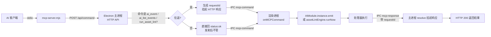

# MCP 集成与调试桥（MCP Integration & Debug Bridges）

> 外部 AI 经 MCP 服务器 / HTTP 控制编辑器的三层通道：配置挂载方式、命令往返语义、多实例端口选择。
> 代码位置：`editor/mcp-server.mjs`（MCP 服务器）、`electron/main.ts`（HTTP API，行 1290 起）、`src/editor/EditorInitializer.ts`（渲染进程命令分发）
> 相关文档：[AI 事件系统](../engine/ai_system.md) / [编辑器核心](./core_system.md) / [GM 命令系统](../engine/gm_system.md) / [Harness 工程](../harness/harness_system.md)

## 1. 概述

DemoStudio 对外暴露三种让 AI 驱动编辑器的通道，它们**不是同一个东西**，适用前提互不重叠：

1. **MCP 服务器**（`editor/mcp-server.mjs`）：stdio 协议的 MCP 服务器，暴露 8 个工具。客户端（VS Code / Cursor / Knot）启动它，它把工具调用翻译成 HTTP 请求打给 Electron 主进程。
2. **页面内桥**（`window.__ai` / `window.__fishBattle` / `window.blueprintEditor`）：挂在渲染进程 `window` 上的对象，只能在浏览器页面上下文里用 `page.evaluate` 访问，无独立传输层。
3. **直接 HTTP**：绕过 MCP 服务器，直接 `POST http://127.0.0.1:{port}/api/command`。

三者的职责划分：

| 通道 | 传输层 | 谁提供 | 能否拿到返回值 | 典型用途 |
|---|---|---|---|---|
| MCP 服务器 | stdio → HTTP → IPC | 客户端启动 `mcp-server.mjs` | 仅 `ai_event` / `ai_list_events` / `run_asset_lint` 为往返 | AI 客户端内的工具调用 |
| 页面内桥 | 无（同进程 JS） | 渲染进程挂 `window` | 直接返回 | Playwright 浏览器调试 |
| 直接 HTTP | HTTP | Electron 主进程 | 同 MCP（共用端点） | 脚本 / 快速探测 |

**边界划分**：事件**语义**归 [AI 事件系统](../engine/ai_system.md)（有哪些事件、payload 结构）；GM 命令**清单**归 [GM 命令系统](../engine/gm_system.md)；本文档只讲**通道怎么搭起来、命令怎么走、什么情况会失败**。

## 2. 核心模块

| 模块 | 说明 |
|---|---|
| `editor/mcp-server.mjs` | MCP 服务器（stdio），注册 8 个工具并转发到编辑器 HTTP API；`--port` 指定实例 |
| `electron/main.ts` MCP HTTP API | 内置 HTTP 服务，行 1290 起；端口 9877 起探测，仅绑定 `127.0.0.1` |
| `src/editor/EditorInitializer.ts` | 渲染进程命令分发：`onMCPCommand` 收到命令后 `switch` 分发到 `AIModule` / 编辑器动作 |
| `onMCPCommand` / `sendMCPResponse` | 主进程 ⇄ 渲染进程的 IPC 往返对；`requestId` 关联挂起的 HTTP 响应 |
| `AIModule` | 事件总线单例，见 [AI 事件系统](../engine/ai_system.md) |
| `BlueprintEditorService` | 蓝图编辑通道（`/api/blueprint`），见 [蓝图编辑](./blueprint_edit_system.md) |

## 3. 使用方法

### 3.1 工具清单（`mcp-server.mjs`）

| 工具 | 参数 | 往返 | 说明 |
|---|---|---|---|
| `start_game` | `project?` | 否 | 启动游戏，可指定项目名 |
| `stop_game` | — | 否 | 停止游戏 |
| `toggle_game` | — | 否 | 按 `get_status` 结果切换 |
| `get_status` | — | 是 | 编辑器状态（`gameRunning` / `gameScore`） |
| `run_asset_lint` | `project?` | 是 | 手动触发资产检查（assetLint 全量重扫），可选 `project`（folder 或显示名）指定目标工程，缺省=当前打开工程；返回 `{ total, errors, warns, issues[] }` |
| `run_code_lint` | `project?` | 是 | 手动触发代码检查（codeLint 全量重扫 src/projects/<folder>/ 源码），可选 `project` 参数同上；返回 `{ total, issues[] }`（规则：bareThree / addComponent） |
| `send_input` | `key` | 否 | 派发 `KeyboardEvent`（如 `ArrowUp`） |
| `ai_event` | `event`, `payload?` | 是 | 发 AI 事件，返回 `{ handled, result }` |
| `ai_list_events` | — | 是 | 返回 `{ events, count }` |

> 变更记录（2026-09-01）：移除 `send_command`（仅向控制台回显一行文本，无实际作用）与 `get_console_logs`（可用 Playwright `browser_console_messages` 或 `logs/console_*.log` 文件替代）；同日新增 `run_asset_lint`（手动触发资产检查并返回违规列表，见 [资产检查系统](./asset_preview_lint_system.md)）。底层 HTTP 通道不受影响：`/api/console-logs` 端点与 `addConsoleOutput` 命令仍保留，可按 §3.3 直接 HTTP 调用。
> 变更记录（2026-09-01 二）：修复 `run_asset_lint` 在 `mcp-server.mjs` switch 中遗漏 case 的缺陷（此前工具可见但调用抛"未知工具"）；新增 `run_code_lint`（手动触发代码检查，走 `codeLintEngine.runNow()`，往返模式与 `run_asset_lint` 一致）。
> 变更记录（2026-09-01 三）：`run_asset_lint` / `run_code_lint` 新增可选 `project` 参数（folder 或显示名，如 fish / FishMaster），无工程打开时也能直接扫描指定工程；指定非当前打开工程为旁路扫描（只经返回值输出，不覆盖检查面板），无效工程返回 `{ status:'error', message:'未找到工程: X，可用: ...' }`。

### 3.2 客户端配置

三种客户端的**配置键名不同**，这是最常见的配错点：

```jsonc
// VS Code / Codex —— .vscode/mcp.json（注意键名是 servers，不是 mcpServers）
{
  "servers": {
    "demostudio-editor": {
      "type": "stdio",
      "command": "node",
      "args": ["editor/mcp-server.mjs"],
      "cwd": "E:\\DemoStudio"
    }
  }
}
```

```jsonc
// Cursor —— .cursor/mcp.json；Knot / CodeBuddy —— %USERPROFILE%\.codebuddy\mcp.json
{
  "mcpServers": {
    "demostudio-editor": {
      "type": "stdio",
      "command": "node",
      "args": ["E:\\DemoStudio\\editor\\mcp-server.mjs"],
      "cwd": "E:\\DemoStudio"
    }
  }
}
```

路径用绝对路径配 `cwd`，避免客户端工作目录不在项目根时找不到脚本。写完后**必须重启客户端**——MCP 服务在客户端启动时加载，当前会话不会热加载新配置。

### 3.3 调用示例

```ts
// MCP 工具调用（客户端内）
ai_event({ event: 'ai.getState', payload: {} })
// → { status:'ok', event:'ai.getState', handled:true,
//     result:{ running:false, phase:'idle', score:0, gameOver:false, actorCount:0, actors:[] } }

ai_list_events({})
// → { status:'ok', command:'ai_list_events', events:['ai.selectActor', ...], count:16 }

run_asset_lint({})
// → { status:'ok', command:'run_asset_lint', total:12, errors:1, warns:11,
//     issues:[{ file:'asset/blueprints/ui/tips.widget.json', nodePath:'<widget 根>',
//               field:'properties.shadowColor', rule:'doc:ui-design', severity:'warn', message:'...' }] }
```

```js
// 直接 HTTP（脚本 / 快速探测）
fetch('http://127.0.0.1:9877/api/command', {
  method: 'POST',
  headers: { 'Content-Type': 'application/json' },
  body: JSON.stringify({ command: 'ai_event', params: { event: 'ai.getState', payload: {} } }),
})
```

```js
// 页面内桥（Playwright，见 testing/playwright_commands.md）
await page.evaluate(() => window.__ai.emit('ai.getState', {}))
```

### 3.4 使用前提与触发时机

- **编辑器必须运行**：MCP 服务器只做转发，编辑器没起时所有工具返回 `编辑器不可达`
- **游戏类事件需先 `start_game`**：`ai.selectActor` / `ai.dragActor` / `ai.getState` 无需运行，其余引擎事件未运行时返回 `{ ok:false, error:'游戏未运行' }`
- **`run_asset_lint` 需先打开工程**：无工程时返回空列表（assetLint 静默语义）
- 触发时机：AI 客户端主动调用；无自动轮询

## 4. 工作流程

### 4.1 主流程



### 4.2 分阶段说明

| 阶段 | 触发点 | 关键调用 | 产物 |
|---|---|---|---|
| 工具调用 | AI 客户端 | `callEditor(command, params)` | HTTP `POST /api/command` |
| 命令解析 | 主进程 | `JSON.parse(body)` 得 `MCPCommand` | `command` + `params` |
| 往返判定 | 主进程 | `cmd.command === 'ai_event' \|\| 'ai_list_events' \|\| 'run_asset_lint' \|\| 'run_code_lint'` | 生成 `requestId` 或立即 ack |
| 分发 | 渲染进程 | `onMCPCommand(command, params, requestId)` | `switch` 到对应分支 |
| 执行 | 渲染进程 | `AIModule.instance.emit(event, payload)` | `AIEmitResult` |
| 回传 | 渲染进程 | `sendMCPResponse(requestId, response)` | IPC `mcp-response` |
| resolve | 主进程 | `pending.resolve(payload.result)` | HTTP 200 |

### 4.3 设计要点

**双语义：往返 vs 发射后不管**

主进程只为 `ai_event`、`ai_list_events`、`run_asset_lint` 与 `run_code_lint` 生成 `requestId` 并挂起 HTTP 响应；其余命令（含 `start_game`、`send_input`）发完就返回 `{ status:'ok', command }`，**拿不到执行结果**。原因：`start_game` 等操作是异步的（切换项目需等待 Viewport 停止流程），不等它完成更符合编辑器交互模型；而 AI 事件需要返回值做断言，必须同步等。

`ai_list_events` 原本是发射后不管，只回 ack——AI 想列事件只能绕 `page.evaluate`。2026-08-28 改为往返模式，与主进程 `ai_event` 共用同一套 `requestId` + 超时 + pending 表（`_blueprintPending`），`mcp-response` 监听对任意 `requestId` 通用。

**多实例端口探测**

端口从 `MCP_API_PORT_START = 9877` 起调用 `findFreePort` 探测，上限 `MCP_API_PORT_MAX = 9927`（最多 50 个）。被占用时主进程打印 `[MCP-API] 注意：9877 已被其他实例占用，本实例使用端口 N`。MCP 服务器默认连 9877，连第二个实例需显式传参：

```bash
node editor/mcp-server.mjs --port 9878
```

**SSE 事件总线**

`/api/events` 是独立的 SSE 通道（类型 `game.lifecycle` / `game.error` / `scene.change` / `ai.event`），环形缓冲 100 条，支持 `Last-Event-ID` 续传重放。`ai_event` 命令会顺带 `publishSSE('ai.event', ...)`，但这条是**旁路广播**，不影响原有的 renderer 往返。

### 4.4 HTTP 端点清单

| 方法 | 路径 | 说明 |
|---|---|---|
| POST | `/api/command` | 主命令入口（MCP 服务器走这条） |
| POST | `/api/blueprint` | 蓝图编辑往返，见 [蓝图编辑](./blueprint_edit_system.md) |
| GET | `/api/status` | 编辑器状态 |
| GET | `/api/game-state` | 读取 `window.__snakeGameData` |
| GET | `/api/console-logs` | 控制台日志 |
| GET | `/api/events` | SSE 订阅 |
| POST | `/api/chat` | AI 聊天 |

## 5. 边界条件

| 条件 | 行为/后果 | 处理方式 |
|---|---|---|
| 编辑器未运行 | `{ status:'error', message:'编辑器不可达: ...' }` | 先启动 `npm run electron:dev` |
| 编辑器窗口已销毁 | HTTP 503 `{ status:'error', message:'编辑器窗口不可用' }` | 重启编辑器 |
| 渲染进程 20s 未回传 | HTTP 504 超时（`BLUEPRINT_REQ_TIMEOUT = 20000`），pending 清理 | 检查渲染进程是否卡死 |
| `ai_event` 缺 `event` | `{ status:'error', message:'缺少 event 参数' }` | 补齐参数 |
| 命令走非往返分支 | 只回 `{ status:'ok', command }`，**无执行结果** | 需要结果就用 `ai_event` |
| `start_game` 无项目 | 自动选第一个；都无则 `[MCP] start_game: 无可用项目` | 先创建项目 |
| `run_asset_lint` 无工程且无 `project` 参数 | 返回 `{ total:0, errors:0, warns:0, issues:[] }`（assetLint 静默语义） | 传 `project` 参数或先打开工程 |
| `run_asset_lint` 扫描中重入 | 防重入返回空数组（引擎 `running` 锁） | 稍后重试 |
| `run_code_lint` 无工程且无 `project` 参数 | 返回 `{ total:0, issues:[] }`（codeLint 静默语义） | 传 `project` 参数或先打开工程 |
| `run_code_lint` 扫描中重入 | 防重入返回空数组（引擎 `running` 锁） | 稍后重试 |
| 两个 lint 工具指定无效工程 | 返回 `{ status:'error', message:'未找到工程: X，可用: ...' }` | 用 message 列出的可用 folder |
| 两个 lint 工具指定非当前打开工程 | 正常扫描该工程（旁路，不覆盖检查面板） | 结果以返回值为准 |
| 未知命令 | 渲染进程输出 `[MCP] 未知命令: X` | 核对工具名 |
| 端口 9877-9927 全占用 | 启动失败 `未找到可用端口` | 关闭残留进程 |
| 浏览器调试模式 | `electronAPI` 为 Mock，HTTP→IPC 链不通 | MCP 通道依赖 Electron 窗口，与页面内桥是两回事 |
| 打包版本（`electron:build`） | 主进程改动需重新打包，无 HMR | 改主进程后用 dev 模式验证 |
| 事件注册顺序 | `listEvents()` 按注册顺序返回，**HMR 后顺序可能变** | 不要依赖先后位置 |

## 6. 依赖关系

```
AI 客户端
  └─(stdio)→ editor/mcp-server.mjs
                └─(HTTP :9877+)→ electron/main.ts MCP HTTP API
                                    ├─(IPC mcp-command)→ src/editor/EditorInitializer.ts
                                    │                       └─→ AIModule.instance.emit
                                    │                              ├─→ registerBuiltinAIHandlers（引擎层）
                                    │                              └─→ registerEditorAIHandlers（编辑器层）
                                    │                       └─→ assetLintEngine.runNow（run_asset_lint）
                                    │                       └─→ codeLintEngine.runNow（run_code_lint）
                                    ├─(IPC)→ mainWindow 蓝图/AI 聊天通道
                                    └─(SSE /api/events)→ DSH 扩展订阅
```

注册机制：AI 事件处理器注册见 [AI 事件系统](../engine/ai_system.md)；GM 命令注册（`*.gm.ts` 自动注册）见 [GM 命令系统](../engine/gm_system.md)。

## 7. 踩坑记录

**配置键名不一致（2026-08-28）**

VS Code / Codex 的 `.vscode/mcp.json` 用 `servers`，Cursor 与 Knot（`~/.codebuddy/mcp.json`）用 `mcpServers`。照抄另一份会导致服务静默不加载——不报错，但工具列表里看不到。

**PowerShell 写配置引入 BOM（2026-08-28）**

现象：`Set-Content` / `ConvertTo-Json` 写入 `mcp.json` 后，Node `JSON.parse` 报 `Unexpected token '\uFEFF'`，客户端读不到配置。
原因：PowerShell 默认写 UTF-8 with BOM。
处理：用 `[System.IO.File]::WriteAllText($p, $json, (New-Object System.Text.UTF8Encoding($false)))` 写无 BOM；改前先 `Copy-Item` 备份。

**`ai.gmCommand` 未写进工具描述（2026-08-28）**

现象：引擎实际注册 16 个事件，但 `ai_event` 工具的 description 只列了 15 个，漏了 `ai.gmCommand`。
影响：AI 不知道有 GM 通道可用，只能靠 `page.evaluate` 或读源码发现。
处理：已补进 `mcp-server.mjs` 的工具描述。**新增 AI 事件时必须同步更新该 description**，否则工具对 AI 不可见。

**超时值记忆偏差**

初判往返超时为 30s，实际 `BLUEPRINT_REQ_TIMEOUT = 20000`（20s）。涉及具体数值一律回源码确认。
