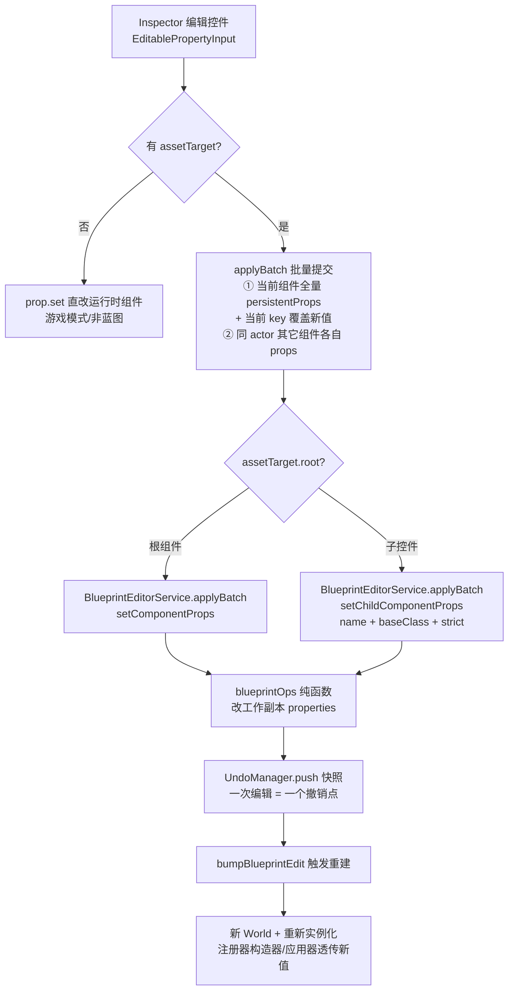
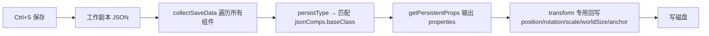

# 编辑器属性修改系统（Inspector Property Edit）

> Inspector 面板修改组件属性的完整链路：可编辑属性定义 → 双通道提交（蓝图资产 vs 运行时组件）→ 撤销/重做 → 落盘。
> 代码位置：`src/components/Inspector.tsx` / `src/engine/entity/ActorComponent.ts` / `src/editor/blueprintEdit/`
> 相关文档：[蓝图编辑系统](./blueprint_edit_system.md) / [撤销/重做系统设计](./undo_redo_system.md)

## 1. 概述

Inspector 选中 Actor 后按组件分组展示属性。每个属性有**两条显示通道**：

| 通道 | 数据来源 | 说明 |
|---|---|---|
| 只读展示 | `Component.getProperties()` | 扁平键值对，仅展示（含派生值，如 UIText 的 `render: '矢量（troika）'`） |
| 可编辑控件 | `Component.getEditableProperties()` | 返回 `EditableProperty[]`，Inspector 按 `type` 渲染对应输入控件 |

**关键规则**：**只有 `getEditableProperties()` 里注册的属性才能编辑**。组件有字段/资产检查器认字段，但漏了注册可编辑属性 → Inspector 不显示输入框（lineHeight 曾踩此坑，见 §7）。

提交时按场景走**双通道**：

- **蓝图预览模式**（Inspector 处于蓝图 tab，`assetPath` 非空）→ `BlueprintEditorService.applyBatch`：改工作副本 + 进撤销栈 + 触发预览重建（**不直接改运行时组件**）
- **游戏模式 / 非蓝图** → `prop.set(v)`：直接改运行时组件（不进撤销系统）

## 2. 核心接口（`src/engine/entity/ActorComponent.ts`）

### EditableProperty

```ts
interface EditableProperty<T = unknown> {
  key: string              // camelCase，与 TS 组件属性名 / JSON properties 键名完全一致
  type: EditablePropertyType  // 'number' | 'string' | 'boolean' | 'enum' | 'vec2' | 'vec3' | 'color'
  get: () => T             // 读取当前值（每次渲染调用，保证显示实时）
  set: (v: T) => void      // 写回组件（setter 内部应触发重绘/同步）
  options?: string[]       // enum 可选值
  min?: number; max?: number; step?: number
  persistent?: boolean     // 默认 true；运行时派生值/临时状态置 false（蓝图模式下跳过，不写资产不进撤销）
}
```

### EditablePropertyAssetTarget（蓝图资产持久化目标）

```ts
interface EditablePropertyAssetTarget {
  assetPath: string   // 蓝图资产路径（BlueprintEditorService.applyBatch 第一参）
  childName: string   // 资产 children 中定位子节点的名称（= actor.root.name）
  baseClass: string   // 组件 baseClass（完整 TS 类名，如 'UITextComponent'）
  root?: boolean      // true → 走 setComponentProps（资产根节点 components）；否则 → setChildComponentProps（递归定位 children）
}
```

### 组件侧三个方法

| 方法 | 默认实现 | 说明 |
|---|---|---|
| `persistType` | `this.constructor.name` | JSON 中 baseClass 标识，组件零标记 |
| `getProperties()` | `{}` | 只读展示属性（扁平键值对） |
| `getEditableProperties()` | `[]` | 可编辑属性列表（空 = 全部只读） |
| `getPersistentProps()` | 遍历 `getEditableProperties()` 取 `p.get()` | 保存时写回 JSON properties；子类可 override 增删 |

> 继承链合并模式：子类 `getProperties()`/`getEditableProperties()` 里 `const base = super.xxx(); return [...base, 自有项]`。

## 3. 给组件添加可编辑属性（四步，缺一不可）

以 UITextComponent 的 `lineHeight`（行高系数）为例：

**① 组件字段 + getter/setter**（`UITextComponent.ts`）：setter 内必须调用 `applyAll()` 同步 troika mesh，否则改了不生效。行高语义为 **fontSize 的倍数，内部 ×100 存储**：用户设置 1.4 → 内部 140；渲染行高 = fontSize × 1.4。

**② `getEditableProperties()` 注册**（决定 Inspector 是否出现输入框）：

```ts
{
  key: 'lineHeight', type: 'number', step: 0.01, min: 0.01,
  // 显示系数（2 位小数）；setter 内部 ×100 固化（用户设置后 ×100）
  get: () => Math.round(this._lineHeight / 100 * 100) / 100,
  set: (v) => { this.lineHeight = v as number },
}
```

**③ 组件注册器透传**（`src/engine/tools/registerBuiltinComponents.ts`）：
- 构造器回调：`new UITextComponent(asActor(owner), { lineHeight: p.lineHeight as number | undefined, ... })`
- 应用器回调（重建/重新实例化路径）：`if (p.lineHeight !== undefined) t.lineHeight = p.lineHeight as number`

> ⚠️ 漏了应用器透传：首次打开正常（构造器吃到值），但**重建路径**（撤销/重做/属性编辑触发的全量重建）会丢值。

**④ assetLint schema**（`src/editor/asset/assetLint/checkers/componentChecker.ts`）：`{ field: 'properties.lineHeight', type: 'number', min: 0, minExclusive: true, label: '行高系数（fontSize 倍数）' }` —— 校验资产文件字段合法性（kind 为 `comp:${完整类名}`）。

**⑤ 可选：`getProperties()` 只读展示**：`lineHeight: Math.round(this._lineHeight / 100 * 100) / 100` —— 显示系数（2 位小数）；属性行 label 来自 `getProperties()` 的键（`humanizeKey` camelCase → 空格分隔），编辑控件匹配 `getEditableProperties().find(p => p.key === k)`。

## 4. 提交链路（蓝图预览模式）



要点：

- **工作副本优先**：`apply` 前 `getWorkingCopy`（无则读盘建立），所有操作在内存副本进行，**不直接写盘**（假保存，Ctrl+S 才落盘）
- **批量原子提交（applyBatch）**：一次编辑 = 一个撤销点，原子防派生系数丢失（如 fontSizeScale）；任一 op 失败整体不提交
- **strict=true**：子节点按 name 递归定位（`findChildNodeDeep`），本地找不到返回错误，**不新建节点**（防止 ref 引用子节点被误建）
- **提交后重建**：apply 成功后 bump 版本 → 蓝图全量重建（销毁旧 World + new 预览 Manager + 重新 SpawnActorFromBlueprint）→ 新值经注册器透传生效，同时恢复相机/选中（见 `BlueprintEditor.tsx` lastCamRef/lastSelectRef）

### 子控件定位

- `childName = actor.root.name`（大纲名）
- `setChildComponentProps` 用 `findChildNodeDeep(children, name)` **递归深度优先**查找（嵌套子节点如按钮内文本也能命中）；顶层找不到才走 strict 失败
- `root` 判定：`!actor.parent`（无 parent 的顶层 Actor = 资产根节点 → 编辑 `asset.components`）

## 5. 保存落盘



- `getPersistentProps()` 默认遍历 `getEditableProperties()` 取 `p.get()`——**持久化范围自动跟随可编辑属性注册**（新增可编辑属性即自动落盘）
- `persistent: false` 的属性（运行时派生值/临时状态）不落盘
- Transform 的 position/rotation/scale 由 collectSaveData 专用回写（含 gizmo 拖拽结果），`TransformComponent.getPersistentProps()` 返回 `{}` 避免双写

## 6. 编辑器输入控件要点（Inspector.tsx EditablePropertyInput）

| 类型 | 控件 | 提交时机 |
|---|---|---|
| number | `<input type="number">` | blur / Enter（Enter 触发 blur） |
| string | `<input type="text">` | blur / Enter |
| boolean | checkbox | 即时 commit |
| enum | select | 即时 commit |
| color | color picker | **蓝图模式 400ms 防抖**（拖动停止后才提交，避免连续触发全量重建风暴） |
| vec2/vec3 | 多输入框 | blur |

防护机制（均为历史 bug 修复，勿删）：

- **editingRef**：聚焦中跳过外部同步（否则每次重渲染 `setVal(prop.get())` 旧值覆盖用户输入——"输入打架"）
- **lastCommittedRef 提交保护**：提交后保持显示提交值，直到外部组件值追上（重建完成）才解除；否则重建前 `prop.get()` 仍是旧值会把刚提交的值弹回（"点击无效"）
- **函数式 setVal + JSON 值比较**：值没变返回原引用，vec3/数组类型避免无限重渲染
- 渲染匹配：`getEditableProperties().find(p => p.key === k)` 匹配 `getProperties()` 的键；`persistent === false` 的属性不注入 assetTarget（不写资产不进撤销）

## 7. 边界条件

| 条件 | 行为/后果 | 处理方式 |
|---|---|---|
| 组件漏注册 `getEditableProperties()` | Inspector 不显示输入框（assetLint 认字段 ≠ 可编辑） | 补注册（§3 第二步） |
| 注册器漏透传（应用器回调） | 首次打开正常，但重建路径（撤销/重做/属性编辑全量重建）丢值 | 补透传（§3 第三步） |
| 编辑嵌套子节点属性 | `findChildNodeDeep` 递归定位；顶层找不到 + strict → 返回错误**不新建节点** | 引擎内置（防 ref 子节点误建） |
| 子节点是 ref 引用实例 | 无 JSON 节点可映射 → 提交失败/跳过 | 无法就地编辑 ref 实例 |
| `applyBatch` 任一 op 失败 | 整体不提交，返回错误 + 旧资产 | 引擎内置原子性 |
| 聚焦中输入框 | 跳过外部同步（防"输入打架"） | editingRef 防护 |
| 提交后重建窗口期 | 保持显示提交值直到外部值追上（防"点击无效"） | lastCommittedRef 防护；**提交失败自动解除保护恢复真实值** |
| 颜色连续拖动 | 蓝图模式 400ms 防抖（防全量重建风暴） | 引擎内置；游戏模式即时提交 |
| 编辑锚点节点 position | `applyAnchor()` 完全覆盖 position → 编辑无效 | **已知遗留**：需改 anchorOffset（见 §8） |
| `persistent: false` 属性 | 不注入 assetTarget、不写资产、不进撤销 | 引擎内置语义 |

## 8. 常见坑与排查

| 现象 | 根因 | 修复 |
|---|---|---|
| Inspector 不显示属性输入框 | 组件漏注册 `getEditableProperties()`（assetLint 认字段 ≠ 可编辑） | 补注册（§3 第二步） |
| 属性首次打开有值，撤销/重做后丢值 | 注册器应用器回调漏透传 | 补透传（§3 第三步） |
| 编辑嵌套子节点属性"静默失败" | 旧版 `setChildComponentProps` 只查顶层 children | 已改 `findChildNodeDeep` 递归 |
| 输入被旧值覆盖（"打架"） | 外部同步 effect 每次渲染触发 | editingRef 聚焦跳过 |
| 提交后值弹回（"点击无效"） | 重建窗口期 prop.get() 为旧值 | lastCommittedRef 提交保护 |
| 颜色拖动卡死 | 连续 onChange → 每次全量重建 | 蓝图模式 400ms 防抖 |
| 编辑锚点节点 position 无效 | `applyAnchor()` 完全覆盖 position | 需改 anchorOffset（遗留，见下） |

**已知遗留**：Inspector 输入框改锚点节点（anchor 非 null）的 position 会被 `applyAnchor()` 覆盖（编辑无效）；3D 蓝图 gizmo 拖动同问题。需要时改走 anchorOffset 或让 applyAnchor 尊重 position。
