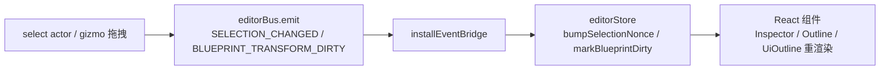

# 选择与变换系统（Editor Selection & Transform）

> 场景对象选择管理 + 三套 Gizmo 交互工具。
> 代码位置：`src/editor/SelectionManager.ts` `TransformGizmo.ts` `AnchorGizmo.ts` `SelectionBoundsGizmo.ts`
> 相关文档：[系统总览](../system_overview.md) / [视口与场景](./viewport_system.md) / [UI 锚点系统](../ui_anchor_system.md)

## 1. 概述

选择与变换系统负责编辑器交互核心：

- **选择管理**：模块级引用 + 递增 key 驱动 React 重渲染；Outline 选中 → Inspector 展示
- **TransformGizmo**：3D 场景三轴移动工具（对标 Unity Position Gizmo）
- **AnchorGizmo**：游戏运行时 UI 节点锚点工具（父容器范围 + 锚点图标）
- **SelectionBoundsGizmo**：游戏运行时 UI 节点范围框（青色框 + 把手 + 尺寸标签）

## 2. 核心模块

### SelectionManager

| 能力 | 说明 |
|---|---|
| `select(actor)` | 选中对象（emit `SELECTION_CHANGED` 事件） |
| `getSceneTree()` | 遍历场景对象生成大纲树（`SceneTreeNode`） |
| `notifySelectionChange()` | 通知选择变化（桥接到 editorStore.nonce） |
| 单例 Gizmo 访问器 | `getTransformGizmo()` / `getAnchorGizmo()` / `getSelectionBoundsGizmo()` |

### TransformGizmo（3D 场景）

- 选中对象中心显示三轴箭头（X=红 `0xff4444` / Y=绿 `0x44ff44` / Z=蓝 `0x4488ff`）
- 交互流程：
  ```
  1. 鼠标按下 → Raycaster 检测命中箭头
  2. 命中 → 开始拖拽，临时冻结 Scene 摄像机输入
  3. 鼠标移动 → 运动投影到拖拽轴，更新目标位置
  4. 鼠标释放 → 结束拖拽，恢复摄像机输入
  ```
- 支持 hover 高亮（记录 baseColor 恢复 emissive）

### AnchorGizmo（运行时 UI 节点）

- 显示父容器范围 + 锚点图标（单点锚风车形聚合 / stretch 四角分布）
- 用于游戏运行时 UI 节点的锚点调整
- 布局算法、拖动回写与 Inspector 编辑详见 [UI 锚点系统](../ui_anchor_system.md)

### SelectionBoundsGizmo（运行时 UI 节点）

- 青色范围框 + 8 个把手（0-3 角 TL/TR/BL/BR，4-7 边 T/R/B/L）
- 把手悬停光标切换（`nwse-resize` / `ns-resize` / `ew-resize` 等）
- 尺寸标签显示

## 3. 使用方法

### 3.1 入口 API

| 方法 | 签名 | 说明 |
|---|---|---|
| 选中 | `SelectionManager.select(obj: Selectable \| null)` | 分支：运行时 UI 节点 → anchor/bounds gizmo；否则 3D TransformGizmo；null → detach |
| 读取 | `getSelected(): Selectable \| null` / `getSelectedActor(): Actor \| null` | 当前选中（Object3D 带 actorRef 时转 Actor） |
| 订阅 | `onSelectionChange(cb): () => void` | 多槽订阅，返回取消函数 |
| 场景树 | `getSceneTree(): SceneTreeNode[]` | 大纲树（含过滤规则） |
| 相机 | `focusOn(target, distance?)` / `SelectionManager.focusOn` | 聚焦目标 |
| 世界关联 | `setRunningWorld(world \| null)` / `watchWorldActorChanges(world, invalidate?)` | 运行中 World 挂接 |
| Gizmo 拖拽 | `gizmo.hitTest(x, y): Vector3 \| null` → `startDrag(axis, x, y)` → `updateDrag(x, y)` → `endDrag()` | 手动拖拽协议（Viewport 调用） |

### 3.2 使用示例

```ts
// Outline.tsx：选中 → Inspector 展示
SelectionManager.select(actor)

// Viewport.tsx：Scene 页签且未运行时
gizmo.onDragMove = notifySelectionChange
// pointerdown 仅左键 + gizmo.visible 时 hitTest → startDrag + setPointerCapture
// pointermove 恒 hoverTest + 拖拽中 updateDrag
// pointerup endDrag + releasePointerCapture（try/catch 忽略）
```

### 3.3 触发时机与使用前提

- `select()` 时自动按对象类型分发 gizmo（运行时 UI 节点 vs 3D 对象），最后 `gizmos.refresh()` 广播显隐
- gizmo 显隐统一走 `gizmos.onEnabledChanged` 委托（全局开关），非每帧轮询
- gizmo 挂在 overlayScene 根下：position 是世界语义，**必须用 `getWorldPosition` 而非 `root.position`**（子节点嵌套画错位）

## 4. 工作流程

### 4.1 事件与桥接



- 蓝图编辑中 gizmo 拖拽会标记蓝图 dirty（`BLUEPRINT_TRANSFORM_DIRTY`），保存后 `BLUEPRINT_SAVED` 清 dirty
- AI 处理器 `ai.selectActor` / `ai.dragActor` 复用此系统（见 [AI 事件系统](../engine/ai_system.md)）

### 4.2 TransformGizmo 拖拽细节

- 命中检测 Raycaster 打在 shaft+cone 网格；拖拽平面法线 = 视线方向；射线与平面平行时回退 `ray.origin`
- 每帧：Box3 中心 + 常量屏幕尺寸 `max(dist * 0.08, 0.3)` + 世界轴向不旋转
- `startDrag`/`updateDrag`/`endDrag` 均有拖拽中状态守卫（非拖拽中静默 return）

### 4.3 选中分发规则

- 运行中 + Actor + 有 `UITransformComponent` → 运行时 UI 节点（anchor/bounds gizmo）
- 非运行 World 或无 UITransformComponent 的 Actor → 3D gizmo 分支
- `setRunningWorld(null)` / 游戏停止 → detach 两个 UI gizmo

## 5. 边界条件

| 条件 | 行为/后果 | 处理方式 |
|---|---|---|
| `hitTest` 无 camera/renderer 或 group 不可见 | 返回 null | 调用方判空 |
| `startDrag` 无 target | 静默 return | 引擎内置 |
| `updateDrag`/`endDrag` 非拖拽中 | 静默 return（幂等） | 引擎内置 |
| `getSelected()` 为 null | Inspector/Outline 显示空状态 | 引擎内置 |
| `setSharedScene(null)` | `_gizmo.detach()` | 引擎内置（切工程清理） |
| `watchWorldActorChanges` 空 World 或已注册 World | 直接 return（WeakSet 防重复） | 引擎内置 |
| 选中无 UITransformComponent 的 UI 节点 | 走 3D gizmo 分支（非 UI 编辑语义） | 引擎内置判定 |
| gizmo 高频拖拽日志 | `console.log('[Gizmo] 拖动: ...')` 每帧 | 调试期输出，勿依赖 |
| anchor/bounds gizmo 挂载 | 独立 overlay Scene（`getRuntimeUIOverlayScene`），避免被 World.Destroy 泄漏检测误报 | 引擎内置 |

## 6. 依赖关系

```
SelectionManager → TransformGizmo / AnchorGizmo / SelectionBoundsGizmo
SelectionManager → gizmos（引擎辅助对象）/ editorBus
Gizmo 场景 → overlayScene（编辑器覆盖层，渲染顺序最顶层）
BlueprintEditorService → 拖拽结果以 op 写入蓝图（apply）
```
