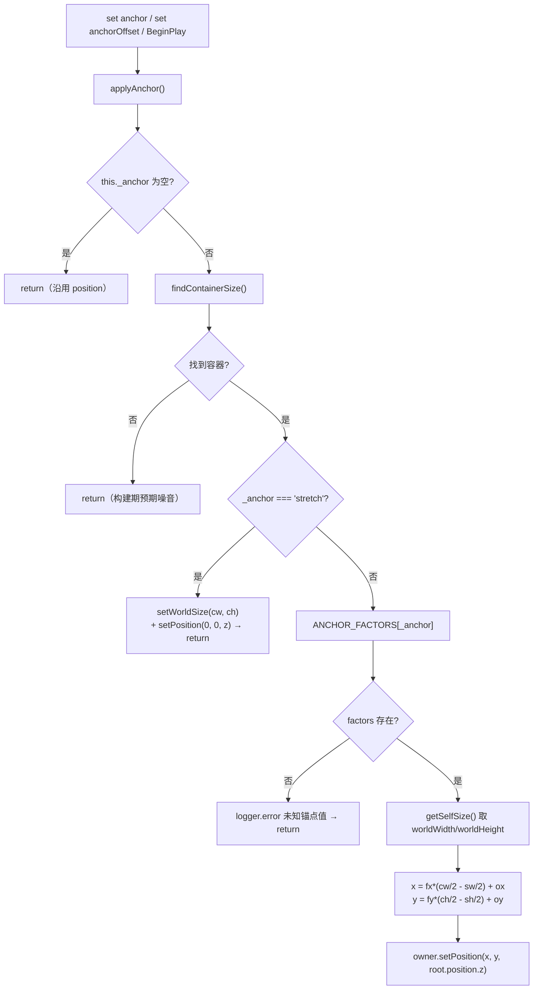
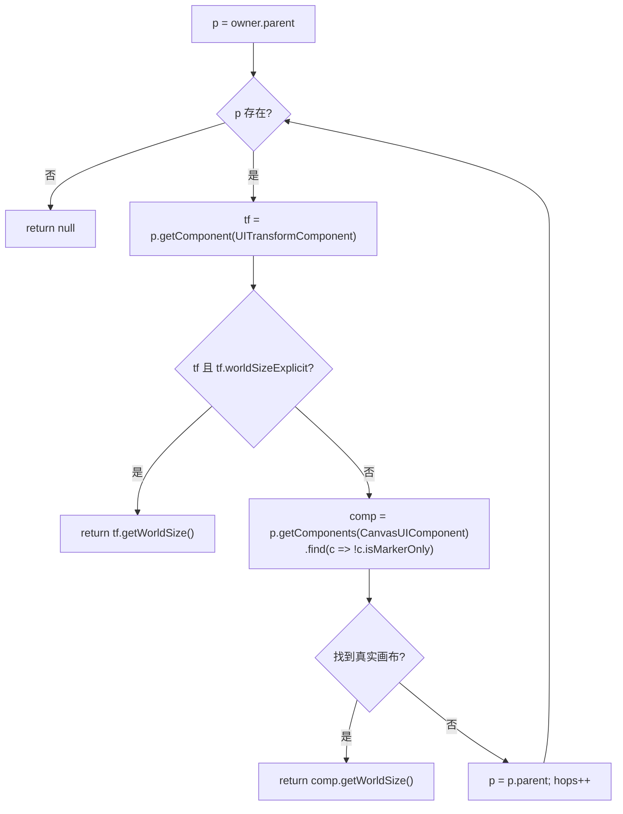

# UI 锚点布局系统（UI Anchor）

> **一句话定位**：把 UI 元素的**位置**从"手填 position"变成"声明锚在父容器九宫格的哪个点"，父容器尺寸一变（视口比例切换、面板缩放）位置自动跟着变。
>
> **什么时候会用到你**：写/改 widget 资产里的 `UITransformComponent.properties.anchor`；排查"控件位置不对/拖动后瞬移/全屏背景没铺满"；排查"选中 UI 节点却看不到锚点 gizmo（只见三轴箭头）"；新增 UI 组件需要跟随父容器自适应时。
>
> 代码位置：`src/engine/ui/UITransformComponent.ts`、`src/editor/AnchorGizmo.ts`、`src/editor/SelectionManager.ts`、`src/editor/asset/RuntimeUIEditor.ts`

---

## 1. 先记住这几个文件

| 文件 | 一句话职责 | 你要改它的场景 |
|---|---|---|
| [UITransformComponent.ts](../../../src/engine/ui/UITransformComponent.ts) | 锚点数据模型 + 布局算法：`applyAnchor` / `findContainerSize` / `syncAnchorOffset` + Inspector 属性 | 改锚点语义、加锚点枚举值、改容器查找优先级 |
| [AnchorGizmo.ts](../../../src/editor/AnchorGizmo.ts) | 可视化：父容器白色线框 + 4 个小三角形锚点图标 | gizmo 画错位、图标形态不对、锚点不显示 |
| [SelectionManager.ts](../../../src/editor/SelectionManager.ts) | 决定"选中 UI 节点时到底挂哪个 gizmo"——`isRuntimeUINode` 三条件 | 排查"锚点 gizmo 不出现" |
| [RuntimeUIEditor.ts](../../../src/editor/asset/RuntimeUIEditor.ts) / [UIPreviewManager.ts](../../../src/editor/asset/UIPreviewManager.ts) | 拖动 / 把手 resize 回写 `anchorOffset` | 改拖动语义、加新交互 |

**关键心智模型**：锚点模式下 `position` 是**计算产物**，不是数据。`applyAnchor()` 每次运行都会**整体覆盖** `position`，真正持久化的是 `anchor` + `anchorOffset` 两个字段。想挪控件就改 `anchorOffset`（或走 `syncAnchorOffset`），直接写 `position` 只会在下一次重算时被冲掉。

第二个心智模型：**锚点图标画在"父容器的参考点"上，不是元素身上**。`top-left` 锚点的图标出现在父容器左上角，与元素多大、`anchorOffset` 是多少完全无关（Unity Anchor 语义）。看图标判断"锚在哪"，看元素判断"在哪"。

---

## 2. 锚点语义：11 个枚举值 + null

类型定义在 [UITransformComponent.ts:30](../../../src/engine/ui/UITransformComponent.ts)：

```ts
export type AnchorPreset =
  | 'top-left' | 'top-center' | 'top-right'
  | 'middle-left' | 'middle-center' | 'center' | 'middle-right'
  | 'bottom-left' | 'bottom-center' | 'bottom-right'
  | 'stretch'
```

注意 `'center'` 和 `'middle-center'` **是两个值，因子完全相同**（都是 `[0, 0]`）。保留两者是为了兼容历史资产与 UI 源格式编译产物，别删任何一个。

对应的方向因子表（[UITransformComponent.ts:37](../../../src/engine/ui/UITransformComponent.ts)）：

```ts
const ANCHOR_FACTORS: Record<AnchorPreset, [number, number]> = {
  'top-left': [-1, 1], 'top-center': [0, 1], 'top-right': [1, 1],
  'middle-left': [-1, 0], 'middle-center': [0, 0], 'center': [0, 0], 'middle-right': [1, 0],
  'bottom-left': [-1, -1], 'bottom-center': [0, -1], 'bottom-right': [1, -1],
  // stretch 走 applyAnchor 的专用分支，不经过方向因子（占位）
  'stretch': [0, 0],
}
```

x 因子 `-1 左 / 0 中 / +1 右`，y 因子 `+1 上 / 0 中 / -1 下`（**y 是屏幕语义，上为正**）。`stretch` 的 `[0, 0]` 只是占位，`applyAnchor` 里在查表之前就 return 了，永远读不到它。

| 取值 | 语义 | 定位公式 |
|---|---|---|
| 9 个单点锚（`center` 与 `middle-center` 等价） | 元素中心贴到父容器九宫格对应点，**边缘贴合容器内边不溢出** | `x = fx*(cw/2 - sw/2) + ox` |
| `stretch` | 填满父容器，自身尺寸 = 容器尺寸，位置恒为 `(0, 0)` | 专用分支，见 §3.2 |
| `null` | 不自动定位，沿用 `position`（普通 3D 变换语义） | `applyAnchor` 直接 return |

`anchorOffset` 是在锚点基准上的**世界单位微调** `[ox, oy]`，默认 `[0, 0]`。

---

## 3. 布局算法：`applyAnchor()` 做了什么

### 3.1 谁调用了它

三个入口，全部落在 [UITransformComponent.ts](../../../src/engine/ui/UITransformComponent.ts)：

```ts
override BeginPlay(): void {
  super.BeginPlay()
  // 树构建完成（所有 attachTo 已就绪）后应用锚点定位
  this.applyAnchor()
}

set anchor(v: AnchorPreset | null) {
  this._anchor = v
  this.applyAnchor()
}

set anchorOffset(v: [number, number]) {
  this._anchorOffset = v
  this.applyAnchor()
}
```

**为什么 `BeginPlay` 才第一次算，构造期不算**：构造组件时父节点的 `attachTo` 还没执行，`findContainerSize()` 向上遍历必然找不到容器。构造期调 `applyAnchor` 是纯浪费，而且会打出一大堆"未找到父容器"的噪音——源码里那几行 `logger.warn` 被**故意注释掉**就是这个原因（下面 §3.3 会看到）。

**为什么两个 setter 都要触发重算**：Inspector 改下拉框、编辑器拖动、布局组件排布，全都走这两个 setter。setter 里重算保证了"改完立即看到结果"，调用方不用记得手动调一次。

### 3.2 主流程



**① 无锚点直接跳过**（[UITransformComponent.ts:141](../../../src/engine/ui/UITransformComponent.ts)）

```ts
applyAnchor(): void {
  if (!this._anchor) {
    return
  }
  const container = this.findContainerSize()
  if (!container) {
    // 注释：构建期必然触发（构造时树未建好），属预期噪音，不是真警告
    return
  }
```

`_anchor` 为 `null` 时整个函数什么都不干，`position` 保留原值——这就是"无锚点 = 普通 3D 变换"的实现方式。注意第二处 `return` 连日志都不打：构造期每个 UI Actor 都会走到这里，打 warn 会让日志被淹掉。

**② stretch 专用分支：offset 完全不参与定位**（[UITransformComponent.ts:155](../../../src/engine/ui/UITransformComponent.ts)）

```ts
if (this._anchor === 'stretch') {
  const [cw, ch] = container
  this.setWorldSize(cw, ch)
  this.owner.setPosition(0, 0, this.owner.root.position.z)
  return
}
```

这是**最容易踩坑的特例**：stretch 元素的位置被钉死在 `(0, 0)`，尺寸被强制等于容器。**`anchorOffset` 在这里根本没被读取**，所以给 stretch 元素设 offset 完全没有视觉效果。想要"铺满但留点边距"不能用 stretch + offset，得用 `center` 锚点配 `worldWidth/worldHeight`。

注意这里 `setWorldSize(cw, ch)` 会走完整个同步链路（见 §3.4），把面板 scale 也一起改掉，所以 stretch 是"尺寸 + 位置"一起被容器接管。

**③ 单点锚：边缘贴合容器**（[UITransformComponent.ts:162](../../../src/engine/ui/UITransformComponent.ts)）

```ts
const factors = ANCHOR_FACTORS[this._anchor]
if (!factors) {
  logger.error(`[UITransformComponent] "${this.name}" 未知锚点值 "${this._anchor}"，已跳过`)
  return
}
const self = this.getSelfSize()
const [fx, fy] = factors
const [cw, ch] = container
const [sw, sh] = self
const ox = this._anchorOffset[0] ?? 0
const oy = this._anchorOffset[1] ?? 0
const x = fx * (cw / 2 - sw / 2) + ox
const y = fy * (ch / 2 - sh / 2) + oy
this.owner.setPosition(x, y, this.owner.root.position.z)
```

公式里的 `(cw/2 - sw/2)` 是**"父半尺寸减自身半尺寸"**，这就是"边缘贴合不溢出"的数学表达：`fx = -1`（靠左）时元素左边缘正好贴容器左边缘，而不是中心跑到容器左边去。很多人第一反应会以为锚点是"中心对齐到角点"，那会有一半控件飞出容器外。

`setPosition` 的 z 传的是 `this.owner.root.position.z`——**锚点只接管 x/y，z 沿用当前值**，所以锚点不会打乱 UI 的层叠顺序。

### 3.3 容器查找 `findContainerSize()`



真实实现（[UITransformComponent.ts:220](../../../src/engine/ui/UITransformComponent.ts)）：

```ts
private findContainerSize(): [number, number] | null {
  let p = this.owner.parent
  let hops = 0
  while (p) {
    // 1. 父 Actor 显式设置的 uitransform 尺寸 → 容器基准
    const tf = p.getComponent(UITransformComponent)
    if (tf && tf.worldSizeExplicit) {
      const size = tf.getWorldSize()
      return size
    }
    // 2. 兜底：真实画布（非仅标记）——markerOnly 组件只作 UI 标识，不作为容器
    const comp = p.getComponents(CanvasUIComponent).find((c) => !c.isMarkerOnly)
    if (comp) {
      const size = comp.getWorldSize()
      return size
    }
    p = p.parent
    hops++
  }
  return null
}
```

**优先级 1 为什么要"显式 uitransform 尺寸"优先**：`markerOnly` 容器（如 `TopBar` / `BottomBar`）自身没有真实画布，但它在 JSON 里写了明确的 `worldWidth/worldHeight`，语义上就是子元素的布局容器。

**跳过 markerOnly 容器会怎样**：如果这里不认它、继续往上找到根画布，子元素的锚点基准就变成根画布尺寸；而父容器自己也有锚点偏移，两个偏移会**叠加**，子元素直接掉出画布。源码注释原话是"双重叠加掉出画布"。

**优先级 2 的 `!c.isMarkerOnly` 与优先级 1 看似矛盾，其实不矛盾**：优先级 1 认的是 **uitransform 上的显式尺寸**（markerOnly 容器也有），优先级 2 认的是**真实画布**（markerOnly 组件本身不是画布）。两者查的是不同对象。

`hops` 变量只服务于注释掉的 debug 日志，实际逻辑不用它——别误以为有跳数上限。

### 3.4 `syncAnchorOffset()`：position 与锚点状态互同步

锚点模式下 `position = 锚点基准 + offset`。若外部直接改了 `position` 而不同步 offset，下次 `applyAnchor()` 会用**旧 offset** 重算 → 控件瞬移回原位。逆推公式（[UITransformComponent.ts:191](../../../src/engine/ui/UITransformComponent.ts)）：

```ts
syncAnchorOffset(x: number, y: number): boolean {
  if (!this._anchor || this._anchor === 'stretch') return false
  const container = this.findContainerSize()
  if (!container) return false
  const factors = ANCHOR_FACTORS[this._anchor]
  const [cw, ch] = container
  const [sw, sh] = this.getSelfSize()
  const ox = x - factors[0] * (cw / 2 - sw / 2)
  const oy = y - factors[1] * (ch / 2 - sh / 2)
  this._anchorOffset = [ox, oy]
  this.owner.setPosition(x, y, this.owner.root.position.z)
  return true
}
```

这里**直接赋值 `_anchorOffset` 而不是走 setter**——走 setter 会再触发一次 `applyAnchor()`，而 `applyAnchor()` 又会用刚算好的 offset 重算一遍 position，虽然结果一致但是多一次父链遍历 + 面板重建。既然已经手动 `setPosition(x, y, ...)` 了，就不需要再重算。

**返回 `false` 的三种情况**（无锚点 / stretch / 找不到容器）调用方必须回退到直接 `setPosition`——否则拖动会整体失效。

### 3.5 `setWorldSize()` 的连带效应

锚点只管位置，尺寸由 `setWorldSize` 管，而它会同步 owner 上**所有** `CanvasUIComponent`（[UITransformComponent.ts:102](../../../src/engine/ui/UITransformComponent.ts)）：

```ts
setWorldSize(w: number, h: number, explicit = true) {
  this._worldW = w
  this._worldH = h
  if (explicit) {
    this._worldWExplicit = true
    this._worldHExplicit = true
  }
  this._worldSizeExplicit = true
  for (const ui of this.owner.getComponents(CanvasUIComponent)) {
    if (!ui.isMarkerOnly && ui.panel) ui.panel.scale.set(w, h, 1)
    ui.onWorldSizeChange()
  }
}
```

`explicit` 参数是个反直觉设计：`UILayout` 的 stretch 拉伸**传 `false`**，避免"被拉伸出来的尺寸"被当成作者显式意图——否则以后把锚点改回 `center` 之类，恢复不了基准尺寸。另外注意一旦调过 `setWorldSize`，`_worldSizeExplicit` 就永久为 `true`，这个 Actor 从此会**成为子元素的容器基准**（§3.3 优先级 1）。

---

## 4. 编辑期：拖动 / resize 怎么回写 anchorOffset

### 4.1 拖动：锚点节点写 offset，普通节点写 position

按下时先判定模式（[RuntimeUIEditor.ts:516](../../../src/editor/asset/RuntimeUIEditor.ts)）：

```ts
this.dragViaAnchorOffset = !!uiTf && !!uiTf.anchor
this.dragStartOffset = uiTf ? [...uiTf.anchorOffset] : [0, 0]
```

移动时按增量写（[RuntimeUIEditor.ts:555](../../../src/editor/asset/RuntimeUIEditor.ts)）：

```ts
if (this.dragViaAnchorOffset) {
  const uiTf = this.draggingActor.getComponent(UITransformComponent)
  if (uiTf) {
    uiTf.anchorOffset = [this.dragStartOffset[0] + dx, this.dragStartOffset[1] + dy]
    uiTf.applyAnchor()
  }
} else {
  this.draggingActor.setPosition(
    this.dragStartActorPos.x + dx,
    this.dragStartActorPos.y + dy,
    ...
  )
}
```

**为什么用"按下瞬间的 offset + 增量"而不是"当前 offset + 增量"**：每帧鼠标增量是相对按下点的，若基于当前值累加会随帧率漂移。存 `dragStartOffset` 快照再算增量是幂等的。

**为什么还要显式调一次 `applyAnchor()`**：setter 内部已经调过了，这里再调一次是冗余但无害的保险（拖动路径是高频改动区，历史上出过不同步）。

**stretch 特例在这里由 `UIPreviewManager` 单独处理**（[UIPreviewManager.ts:361](../../../src/editor/asset/UIPreviewManager.ts)）：

```ts
// 锚点节点：拖动偏移持久化到 anchorOffset（applyAnchor 重建会覆盖 position，offset 才能保留）。
// stretch 全锚例外：offset 不参与定位（applyAnchor 恒填满容器 + position(0,0)），用 position 直接驱动
this.dragViaAnchorOffset = !!uiTf && !!uiTf.anchor && uiTf.anchor !== 'stretch'
```

注意 `RuntimeUIEditor.ts:516` 那行**没有** `!== 'stretch'` 判断——两条路径的 drag 判定并不完全一致，运行时拖动 stretch 节点会走 offset 模式（视觉无效果）。这是现状，改之前先确认要动哪条。

### 4.2 把手 resize：改尺寸 + 同步中心位移到 offset

（[RuntimeUIEditor.ts:456](../../../src/editor/asset/RuntimeUIEditor.ts)）

```ts
uiTf.setWorldSize(newW, newH)
// 锚点节点：偏移增量写 anchorOffset（applyAnchor 重建会覆盖 position）
if (uiTf.anchor) {
  uiTf.anchorOffset = [
    uiTf.anchorOffset[0] + (cx - actor.position.x),
    uiTf.anchorOffset[1] + (cy - actor.position.y),
  ]
  uiTf.applyAnchor()
} else {
  actor.setPosition(cx, cy, actor.position.z)
}
```

拖把手时固定边不动、活动边跟着走，所以**中心会平移** `(cx - actor.position.x)`。这一项必须补进 offset，否则下一次 `applyAnchor()` 按新尺寸重算时中心会跑回锚点基准位，表现为"拖完把手控件弹回去"。

---

## 5. 锚点 gizmo：什么时候才出现

### 5.1 `isRuntimeUINode` 三条件（排查"gizmo 不出现"第一站）

选中逻辑在 [SelectionManager.ts:157](../../../src/editor/SelectionManager.ts)：

```ts
function isRuntimeUINode(obj: Selectable | null): obj is Actor {
  if (!obj) return false
  if (!_runningWorld) return false
  if (obj instanceof THREE.Object3D) return false
  const actor = obj as Actor
  return !!actor.getComponent(UITransformComponent)
}
```

**三个条件必须同时成立**：

1. `_runningWorld` 非空 —— **游戏正在运行**
2. 目标不是 `THREE.Object3D`（是 `Actor`）
3. 目标挂了 `UITransformComponent`

因此**游戏未运行时点 UI 节点，走的是下面这个 else 分支**——挂三轴箭头 `TransformGizmo`，不是锚点：

```ts
if (isRuntimeUINode(obj)) {
  _gizmo.detach()
  const actor = obj as Actor
  _anchorGizmo.attach(actor)
  _boundsGizmo.attach(actor)
} else {
  _anchorGizmo.detach()
  _boundsGizmo.detach()
  if (obj && _gizmo) {
    const target = obj instanceof THREE.Object3D ? obj : (obj as Actor).root
    _gizmo.attach(target)
  } else {
    _gizmo.detach()
  }
}
gizmos.refresh()
```

所以"锚点 gizmo 不出现"的排查顺序是：游戏跑起来了吗 → 选中的是 Actor 还是 Object3D → 有没有 uitransform 组件。**仅仅"资产预览里打开 widget"不算运行时**，那走的是 `UIPreviewManager` 自己的交互路径。

### 5.2 gizmo 画什么

`AnchorGizmo` 每帧 `update(worldPerPx)` 更新两块内容：

**① 父容器范围**——白色半透明线框（`opacity 0.5`），容器查找逻辑与引擎侧**完全同构**（[AnchorGizmo.ts:319](../../../src/editor/AnchorGizmo.ts)）：

```ts
private findParentContainer(actor: Actor): { actor: Actor; size: [number, number] } | null {
  let p = actor.parent
  while (p) {
    const tf = p.getComponent(UITransformComponent)
    if (tf && tf.worldSizeExplicit) {
      return { actor: p, size: tf.getWorldSize() }
    }
    const comp = p.getComponents(CanvasUIComponent).find((c) => !c.isMarkerOnly)
    if (comp) {
      return { actor: p, size: comp.getWorldSize() }
    }
    p = p.parent
  }
  return null
}
```

这份是**复制品**，不是调用引擎方法（引擎侧 `findContainerSize` 是 `private`）。改了引擎的优先级，gizmo 这份必须同步改，否则"看到的容器框"和"实际布局用的容器"会不一致。

**② 锚点图标**——4 个空心小三角形，`TRI_PX = 13` 屏幕像素恒定尺寸：

```ts
const size = AnchorGizmo.TRI_PX * worldPerPx

if (anchor === 'stretch') {
  this.layoutStretch(actor, uiTf, size)
} else {
  this.layoutPoint(actor, uiTf, container, size)
}
```

单点锚是风车形（`layoutPoint`），关键一行（[AnchorGizmo.ts:279](../../../src/editor/AnchorGizmo.ts)）：

```ts
x = pp.x + fx * (cw / 2)
y = pp.y + fy * (ch / 2)
```

注意这里是 `fx * (cw/2)`，**没有减自身半尺寸**——因为图标标示的是"锚在父控件上的哪个点"，与元素尺寸、`anchorOffset` 都无关。这和 `applyAnchor` 里的 `fx * (cw/2 - sw/2)` 是两个不同语义，别混淆。

stretch 是四角布局，尖端精确对齐元素四角（`layoutStretch`）。

### 5.3 防御分支

`update` 开头两道防御（[AnchorGizmo.ts:179](../../../src/editor/AnchorGizmo.ts)）：

```ts
if (!actor || !isFinite(worldPerPx) || worldPerPx <= 0) return
const uiTf = actor.getComponent(UITransformComponent)
if (!uiTf) {
  this.parentBounds!.visible = false
  for (const t of this.triangles) t.visible = false
  return
}
```

`worldPerPx` 在**视口隐藏（`clientHeight = 0`）时会变成 Infinity**，不拦住会让三角形 position 变成 `Infinity`，整块 gizmo 消失且难排查。没有 uitransform 组件则整体隐藏（`ensureTransformForActor` 会兜底补挂，见 §7）。

---

## 6. 关键方法速查

| 方法 | 位置 | 干什么 | 注意 |
|---|---|---|---|
| `applyAnchor()` | `UITransformComponent.ts:141` | 按父容器尺寸重算 position | **完全覆盖 position**；stretch 分支不读 offset |
| `findContainerSize()` | `UITransformComponent.ts:220` | 向上找父容器尺寸 | 显式 uitransform 尺寸优先 → 真实画布兜底；private |
| `syncAnchorOffset(x, y)` | `UITransformComponent.ts:191` | position → offset 逆推同步 | 返回 false 时调用方必须直接 `setPosition` |
| `set anchor` | `UITransformComponent.ts:120` | 设锚点并立即重算 | `'（无）'` 是 Inspector 占位，真实值是 `null` |
| `set anchorOffset` | `UITransformComponent.ts:128` | 设偏移并立即重算 | 高频调用路径，内部会走完整父链遍历 |
| `setWorldSize(w, h, explicit)` | `UITransformComponent.ts:102` | 改尺寸 + 同步所有面板 scale | 调用后 `worldSizeExplicit` 永久为 true |
| `BeginPlay()` | `UITransformComponent.ts:245` | 树就绪后首次应用锚点 | 构造期不算（树未建好） |
| `getEditableProperties()` | `UITransformComponent.ts:264` | 暴露 Inspector 下拉/数值控件 | 全屏根的尺寸字段是 `readonly` |
| `getPersistentProps()` | `UITransformComponent.ts:315` | 落盘字段 | `anchor` 输出原始 `null`，不输出 `'（无）'` |
| `ensureUITransformComponent(actor)` | `UITransformComponent.ts:336` | 保证 UI Actor 有 uitransform（替换旧 Transform） | **必须先查 UITransformComponent** 再查基类 |
| `ensureTransformForActor(actor)` | `UITransformComponent.ts:384` | 有 CanvasUIComponent → UI 版，否则普通版 | World 等通用实例化入口用 |
| `AnchorGizmo.attach(actor)` | `AnchorGizmo.ts:125` | 挂 gizmo 并打印 local/world 对照日志 | 由 `SelectionManager.select` 调用 |
| `AnchorGizmo.update(worldPerPx)` | `AnchorGizmo.ts:179` | 每帧跟随父容器 + 锚点图标 | 非有限 `worldPerPx` 直接 return |
| `AnchorGizmo.layoutStretch()` | `AnchorGizmo.ts:228` | 四角三角形布局 | 尖端对齐元素四角 |
| `AnchorGizmo.layoutPoint()` | `AnchorGizmo.ts:261` | 风车形布局 | 位置 = 父中心 + `fx*(cw/2)`，与自身尺寸无关 |
| `AnchorGizmo.findParentContainer()` | `AnchorGizmo.ts:319` | gizmo 侧容器查找 | **引擎侧 `findContainerSize` 的复制品**，改一边要改两边 |
| `isRuntimeUINode(obj)` | `SelectionManager.ts:157` | 决定是否挂锚点 gizmo | 三条件同时成立，见 §5.1 |

---

## 7. 流程影响：牵动哪些功能

### 上游：谁驱动它

| 上游 | 怎么驱动 | 相关文档 |
|---|---|---|
| 选择与变换 | `SelectionManager.select` → `isRuntimeUINode` 成立才 `AnchorGizmo.attach` | [选择与变换](../core/selection_transform_system.md) |
| 属性编辑 | Inspector 改 `anchor` 下拉 / `anchorOffset` 数值 → setter 触发 `applyAnchor()` | [属性编辑](../core/property_edit_system.md) |
| UI 源格式编译 | `position:absolute + left/top%` → `anchorPresetOf()` 选预设 + `anchorOffset` 反推 | [UI 源格式](./ui_source_format_system.md) |
| 布局组件 | `UILayoutComponent` 排布子项时写 `tf.anchorOffset` 并 `applyAnchor()` | [引擎 UI 系统](../../engine/ui_system.md) |
| 预览/运行时拖动 | `RuntimeUIEditor` / `UIPreviewManager` 拖动与把手 resize 回写 offset | [资产预览与检查](../asset/asset_preview_lint_system.md) |
| 组件注册 | `registerBuiltinComponents` 读 `properties.anchor/anchorOffset` 注入构造 options | [资产预览与检查](../asset/asset_preview_lint_system.md) |

### 下游：它波及谁

| 下游功能 | 波及点 | 相关文档 |
|---|---|---|
| 面板渲染 | `setWorldSize` 同步所有 `CanvasUIComponent.panel.scale` + `onWorldSizeChange()` | [UI 面板组件](../ui/ui_components_system.md) |
| UI 源格式反编译 | 从 `anchor` + `anchorOffset` 反推 `left/top%`，公式与编译期对齐 | [UI 源格式](./ui_source_format_system.md) |
| 资产检查 | `comp:UITransformComponent` 校验 anchor 枚举（11 值）、offset 为 vec2、尺寸 > 0 | [资产预览与检查](../asset/asset_preview_lint_system.md) |
| 撤销/重做 | 把手松手 / 拖动结束 → `commitPreviewEdit()` 一个撤销点 | [撤销/重做](../blueprint/undo_redo_system.md) |
| 布局组件 | 子项尺寸决定格子步长；stretch 拉伸写回 `explicit=false` | [引擎 UI 系统](../../engine/ui_system.md) |
| 滚动列表 | item 布局基准缓存在 `_baseOffsets`，并**把 anchor 置 null** 避免每次 applyAnchor 覆盖 | [引擎 UI 系统](../../engine/ui_system.md) |
| 进度条/Tooltip | 直接写 `tsf.anchorOffset` 驱动 fill 贴边、tooltip 偏移 | [UI 面板组件](../ui/ui_components_system.md) |
| Actor 实例化 | `ensureTransformForActor` 给 UI Actor 补挂 uitransform，旧 Transform 被替换并显式 `EndPlay` | [实体系统](../../engine/entity_system.md) |

---

## 8. 踩坑清单（都是真踩过的）

**1. 直接改 position，下次重算控件瞬移**

现象：代码里 `actor.setPosition(x, y, z)` 生效了，但拖一下或刷新布局后又弹回原位。原因：锚点模式下 `applyAnchor()` 用**旧 offset** 重算 position 并整体覆盖。规则：带锚点的节点要挪位置，改 `anchorOffset`，或调 `syncAnchorOffset(x, y)`（返回 false 才回退 `setPosition`）。

**2. 给 stretch 元素设 anchorOffset 完全没效果**

现象：stretch 控件偏移不生效。原因：`applyAnchor` 的 stretch 分支设完 `setWorldSize(cw, ch)` + `setPosition(0, 0, z)` 就 return，**根本没读 `_anchorOffset`**。规则：stretch = "恒填满容器"，要留边距改用 `center` 锚点配 `worldWidth/worldHeight`。

**3. 容器查找跳过 markerOnly 容器 → 子元素掉出画布**

现象：挂在有显式尺寸的 `TopBar`/`BottomBar` 下的子元素跑到了画布外。原因：若 `findContainerSize` 不认 markerOnly 容器的 uitransform 尺寸，会继续向上找到根画布，子元素锚点相对根画布**再叠加一次父容器的锚点偏移**。规则：优先级 1 必须保留 `tf.worldSizeExplicit` 判定（源码注释原话："双重叠加掉出画布"）。

**4. 游戏没跑时点 UI 节点，出的是三轴箭头不是锚点**

现象：资产预览或非运行态下选中 UI 节点，看不到父容器框和锚点图标。原因：`isRuntimeUINode` 要求 `_runningWorld` 非空 + 是 Actor + 有 `UITransformComponent`，**三条缺一不可**，否则 `select()` 走 else 分支挂 `TransformGizmo`。规则：排查"锚点 gizmo 不出现"先确认游戏在运行。

**5. gizmo 画错位（子节点选中时明显）**

现象：父容器线框/锚点图标画在错误位置，父节点非原点时尤其明显。原因：gizmo 物体直接挂在 `overlayScene` 根下（无父变换），`position` 就是世界坐标，读 `root.position`（局部）在嵌套时必然错。规则：一律用 `getWorldPosition()`，且先 `root.updateWorldMatrix(true, false)`。源码里 `layoutPoint` / `layoutStretch` 都留了这条注释。

**6. 视口隐藏时 gizmo 整体消失**

现象：标签页切走再切回，或视口高度为 0 时 gizmo 不见了。原因：`clientHeight = 0` 会让 `worldPerPx` 变成 `Infinity`，三角形 position 被污染。规则：`update()` 开头 `!isFinite(worldPerPx) || worldPerPx <= 0` 直接 return。

**7. 构造期"未找到父容器"刷屏**

现象：UI 树构建时大量锚点警告。原因：构造组件时父节点 `attachTo` 未执行，`findContainerSize()` 必然返回 null。规则：源码里那几行 `logger.warn` **被故意注释掉**了，不要"顺手补上"——`BeginPlay` 才会第一次真正应用锚点。

**8. 重复创建第二个 UITransformComponent**

现象：同名组件警告 + 双重变换组件。原因：`getComponent(TransformComponent)` 会先命中 Actor 构造时挂的普通 `TransformComponent`（数组顺序在前）。规则：`ensureUITransformComponent` 里**必须先查 `UITransformComponent`**；替换下来的旧组件要显式 `EndPlay()`，否则 `ObjectRegistry` 残留（`SwitchScene` 残留诊断 `TransformComponent×N`）。

**9. `hops` 看着像跳数上限，其实不是**

`findContainerSize` 里的 `hops` 只服务于被注释掉的 debug 日志，循环没有跳数上限。别以为"超过 N 层就不找了"。

---

## 9. 边界条件

| 条件 | 行为 | 怎么应对 |
|---|---|---|
| `anchor: null` | `applyAnchor` 直接 return，沿用 position | 普通 3D 变换语义，符合预期 |
| `anchor: 'stretch'` | 尺寸 = 容器，位置 = `(0, 0)`，offset 被忽略 | 要边距改用 center 锚点 |
| `center` 与 `middle-center` | 因子完全相同 `[0, 0]` | 两个值都合法，不要删任何一个 |
| 未知 anchor 值 | `logger.error` 后跳过定位 | 查 assetLint 枚举（11 值） |
| 找不到父容器 | 跳过布局，保留原 position | 构建期属预期，看 §8 坑 7 |
| 直接改锚点节点 position | 下次 `applyAnchor` 覆盖 → 瞬移 | 走 `syncAnchorOffset` 或改 offset |
| `syncAnchorOffset` 返回 false | 无锚点 / stretch / 无容器 | 调用方必须回退 `setPosition` |
| 游戏未运行 | `isRuntimeUINode` false → 挂三轴 TransformGizmo | 锚点 gizmo 只在运行时出现 |
| 选中的是 `THREE.Object3D` | `isRuntimeUINode` false → 三轴 gizmo | 需选 Actor |
| 无 `UITransformComponent` | gizmo 整体隐藏 | `ensureTransformForActor` 兜底补挂 |
| 视口隐藏（`clientHeight=0`） | `worldPerPx` = Infinity → gizmo 跳过 | 引擎内置防御 |
| 全屏 widget 根节点 | Inspector 的 worldWidth/worldHeight 标记 `readonly` | 尺寸由视口比例驱动，改不了 |
| `setWorldSize` 调用过 | `worldSizeExplicit` 永久 true，该 Actor 成为子元素容器基准 | 拉伸场景传 `explicit=false` |
| `worldWidth/worldHeight` ≤ 0 | assetLint 报 `min: 0, minExclusive: true` 错误 | 资产必须给正值 |
| `anchorOffset` 非 vec2 | assetLint 校验失败 | 必须是 `[number, number]` |
| 运行时 vs 预览的 drag 判定 | `UIPreviewManager` 排除 stretch，`RuntimeUIEditor` 不排除 | 改之前确认动哪条路径 |
