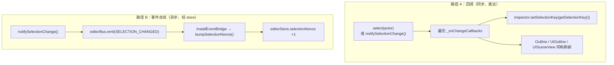

# React 面板组件与状态（Editor UI Components）

> **一句话定位**：编辑器 UI 层由「Zustand store 存状态 + React 面板订阅渲染」构成，store 是底层模块（`SelectionManager` / `BlueprintEditorService` / lint 引擎）与 React 之间**唯一的桥**——组件不直接调底层，底层也不直接碰组件。
>
> **什么时候会用到你**：新增/调整任何面板（大纲、检查器、控制台、状态栏、资产浏览器）；排查「面板不刷新 / 页签打不开或关不掉 / 控制台日志丢失 / 偏好没保存」；给新功能接一条「底层 → UI」的通知。
>
> 代码位置：`src/stores/`（editorStore / editorPrefsStore / projectStore / useCodeLintStore）、`src/components/`（面板组件）、`src/App.tsx`（装配）

---

## 1. 先记住这几个文件

| 文件 | 一句话职责 | 你要改它的场景 |
|---|---|---|
| [editorStore.ts](../../../src/stores/editorStore.ts) | 瞬时运行时态：当前工程、页签、选中、控制台、游戏状态 | 加一个面板要读写的运行时字段或 action |
| [editorPrefsStore.ts](../../../src/stores/editorPrefsStore.ts) | 落盘偏好（localStorage）：布局宽高、视口比例、控制台显隐、工程记忆 | 加一个「关掉编辑器再打开还在」的设置 |
| [projectStore.ts](../../../src/stores/projectStore.ts) | 工程发现：IPC 扫盘 + 失败回退预设列表 | 改工程扫描来源/默认工程列表 |
| [Viewport.tsx](../../../src/components/Viewport.tsx) | 页签宿主：合并持久页签 + 动态页签，驱动预览/游戏生命周期 | 加一种页签类型、改页签打开/关闭行为 |

**关键心智模型**：数据流是**单向**的——底层模块 emit 事件或改全局单例 → `installEventBridge` 翻译成 store 更新（或直接由组件注册回调）→ React 订阅重渲染 → 用户交互再调底层 API。反着走（组件反向 emit 驱动自己）就会死循环。

**第二个容易误解的点**：「选中变化」到 UI 有**两条独立的路**，走的不是同一套机制，详见 §3.2。

---

## 2. 四个 store 的职责分工

四个 store 按「**落不落盘**」和「**谁写**」划分，不是按功能模块划分：

| Store | 是否持久化 | 谁写它 | 谁读它 |
|---|---|---|---|
| `editorStore` | 否（内存） | 组件交互 + `installEventBridge` + AI 事件 | 几乎所有面板 |
| `editorPrefsStore` | 是（localStorage `demostudio-editor-prefs`） | 组件交互 + AI 事件 | App / Viewport / MenuBar / BlueprintEditor |
| `projectStore` | 否 | `discoverProjects()`（IPC 扫盘） | App 启动工程选择器 |
| `useCodeLintStore` | 否 | lint 引擎（CodeLintEngine / AssetLintEngine） | StatusBar / CodeLintPanel |

`editorPrefsStore` 头部注释写明了分离动机：

```ts
/**
 * editorPrefsStore — 编辑器偏好（持久化）
 *
 * 与 editorStore 分离：后者持有瞬时运行时态（gameState/consoleOutput/launchCount），
 * 不应落盘；本 store 全部字段持久化到 localStorage（zustand persist 默认同步 rehydrate）。
 * 布局宽高从 App.tsx 迁入、viewport 偏好从 Viewport.tsx 迁入、面板可见性从 editorStore 迁入。
 */
```

**为什么要拆**：`gameState` / `consoleOutput` / `launchCount` 是每次启动都该重置的运行时态，一旦和偏好混进同一个 store，`persist` 会把「上次的游戏分数、几百行控制台日志」一起写进 localStorage。拆开后只有偏好落盘。

### 2.1 `editorStore`：一屏装不下的运行时态

状态字段按域分组（[editorStore.ts:65](../../../src/stores/editorStore.ts)）：

```ts
export interface EditorState {
  // ─── 工程 ───
  projects: Project[]
  currentProject: Project | null
  showProjectSelector: boolean

  // ─── 游戏 ───
  gameState: GameState
  /** 启动计数器，每次 launchGame 递增，用于触发 Viewport 重新创建游戏实例 */
  launchCount: number

  // ─── 视口页签 ───
  /** 动态页签（蓝图编辑器 / 场景预览，scene/game 为内置持久标签） */
  dynamicTabs: ViewportTabDef[]
  /** 当前活跃的视口页签 id */
  activeTabId: string
```

`launchCount` 是个反直觉设计：它不参与任何显示，存在的唯一目的是**给 `Viewport` 的启动 effect 当依赖**。光靠 `gameState.running`（boolean）无法区分「停止后再次启动」——两次都是 `false → true`，effect 依赖值没变。加一个单调递增的计数器，每次启动 effect 才真正重跑，从而保证 `new Game()` 拿到的是最新代码（`Viewport.tsx:242`）。

### 2.2 `setCurrentProject` 用动态 import 斩断依赖边

```ts
  setCurrentProject: (project) => {
    void import('../projects/registry')
      .then(({ registerProjectAssets, clearProjectAssets }) => {
        // 先注册/清空资产，再切换 currentProject，保证状态一致（资产就绪后才对外可见）
        if (project) {
          registerProjectAssets(project.name)
        } else {
          clearProjectAssets()
        }
        set({ currentProject: project, dynamicTabs: [], activeTabId: 'scene', assetSelection: null })
      })
      .catch((err) => {
        logger.error(`[editorStore] 项目资产注册模块加载失败: ${err instanceof Error ? err.message : String(err)}`)
      })
  },
```

两个要点：

**为什么是 `import()` 而不是顶层 `import`**：源码注释写得很清楚——Agent 独立窗口（`agent.html`）的依赖闭包里也含这个 store，顶层静态导入 `projects/registry` 会把全部游戏资产与 gameplay 脚本拖进 agent 图。动态 import 只在**主编辑器切工程时**才加载。

**为什么先注册资产、后 `set`**：`currentProject` 一变，各面板立刻开始按新工程读资产。若顺序反过来，会有一帧「工程已是新的、资产还是旧的」的不一致窗口。

注意这是个**异步** action——调用后 `currentProject` 尚未更新，别在下一行同步读它。

### 2.3 `editorPrefsStore`：persist 一行接管落盘

```ts
export const useEditorPrefsStore = create<EditorPrefs>()(
  persist(
    (set) => ({
      panels: { /* ... */ },
      consoleVisible: false,
      layout: { left: 220, right: 280, console: 180 },
      viewport: { aspectRatio: '16/9', gizmos: true },
      lastProjectFolder: null,
      recentProjects: [],
      // ...
      pushRecent: (folder) =>
        set((s) => ({
          recentProjects: [folder, ...s.recentProjects.filter((f) => f !== folder)].slice(0, 10),
        })),
    }),
    { name: 'demostudio-editor-prefs' },
  ),
)
```

`persist` 是 zustand 中间件，写一次全 store 落盘，**没有 `partialize`**，即新增字段自动被持久化。`pushRecent` 用「去重置顶 + `slice(0, 10)`」把最近工程列表钉在 10 条。

⚠️ `panels` 字段（五个面板的 `visible`）目前**没有任何组件订阅**——全仓库只有 `editor.togglePanel` 这个 AI 事件在读写它（`EditorInitializer.ts:248`）。UI 上的面板显隐实际由 `consoleVisible` 和各处硬编码决定。这是历史遗留的悬空状态，别把它当数据源用。

### 2.4 `useCodeLintStore`：lint 引擎单向写入

```ts
export const useCodeLintStore = create<CodeLintState>()((set) => ({
  issues: [],
  assetIssues: [],
  panelOpen: false,
  setIssues: (issues) => set({ issues }),
  setAssetIssues: (assetIssues) => set({ assetIssues }),
  setPanelOpen: (panelOpen) => set({ panelOpen }),
  reset: () => set({ issues: [], assetIssues: [], panelOpen: false }),
}))
```

两类检查（代码 / 资产）**共用**这一个 store 和右下角同一个入口：StatusBar 把两者计数相加显示徽标，CodeLintPanel 分两节渲染。写方只有引擎（`CodeLintEngine.ts:292`、`AssetLintEngine.ts:274`），组件只读+改 `panelOpen`。

---

## 3. 事件桥接：底层事件怎么变成 UI 刷新

### 3.1 `installEventBridge` 只有三条映射

```ts
export function installEventBridge(): () => void {
  const unsubs: Array<() => void> = []

  unsubs.push(
    editorBus.on(EditorEvent.SELECTION_CHANGED, () => {
      useEditorStore.getState().bumpSelectionNonce()
    }),
  )

  unsubs.push(
    editorBus.on(EditorEvent.BLUEPRINT_TRANSFORM_DIRTY, (path: string) => {
      useEditorStore.getState().markBlueprintDirty(path)
    }),
  )

  unsubs.push(
    editorBus.on(EditorEvent.BLUEPRINT_SAVED, (path: string) => {
      useEditorStore.getState().markBlueprintClean(path)
    }),
  )

  return () => unsubs.forEach((u) => u())
}
```

位置 [EditorInitializer.ts:67](../../../src/editor/EditorInitializer.ts)，由 `Editor.init()` 调用一次。**要加新的「底层 → UI」通知，就在这里加一行**——不要在组件里直接 `editorBus.on`，那样组件卸载容易忘反注册。

### 3.2 选中刷新有两条路，别搞混

这是本系统最容易踩错的地方。先看两个底层函数（`SelectionManager.ts`）：

```ts
/** 选中某个对象 */
export function select(obj: Selectable | null): void {
  _selected = obj
  _selectionKey++
  for (const cb of _onChangeCallbacks) cb()
  // ...（同步 TransformGizmo attach/detach）
}
```

```ts
/** 触发选中变化通知（带 key 递增，驱动 React 重渲染） */
export function notifySelectionChange(): void {
  _selectionKey++
  for (const cb of _onChangeCallbacks) cb()
  // 通过事件总线通知（不再直接耦合 Zustand store）
  editorBus.emit(EditorEvent.SELECTION_CHANGED)
}
```

两者都会遍历同一个 `_onChangeCallbacks` 多槽集合，**但只有 `notifySelectionChange()` 额外 emit 了 `SELECTION_CHANGED`**。于是形成两条路：



**关键结论**（已在源码核实）：

1. `Inspector` 靠 `onSelectionChange()` 注册的多槽回调刷新，**从未订阅过 `selectionNonce`**：

```ts
export function Inspector() {
  const [selectionKey, setSelectionKey] = useState(getSelectionKey())
  // ...
  useEffect(() => {
    const unsub = onSelectionChange(() => {
      setSelectionKey(getSelectionKey())
      // 切换选中对象时清空搜索，避免残留旧的过滤状态
      setSearchQuery('')
    })
    return unsub
  }, [])
```

2. `selectionNonce` 的全仓库引用点只有四处：`editorStore.ts` 的类型/初值/bump 实现，以及 `EditorInitializer.ts:72` 的 `bumpSelectionNonce()` 调用。**没有任何组件订阅它。**
3. 因此 `select()`（点大纲节点）**不会**让 `selectionNonce` 变化；只有 `notifySelectionChange()`（Gizmo 拖拽 `onDragMove`、预览加载完成、`watchWorldActorChanges` 的 Actor 增删）才会。

**这意味着什么**：给 Inspector 加「选中即刷新」的逻辑，走 `onSelectionChange` 注册即可，不要指望 `selectionNonce`。反过来，如果你新增的面板**只**订阅 `selectionNonce`，那么点击大纲选中时它不会刷新——因为那条路径根本没走事件总线。

### 3.3 单向流的红线

组件可以调底层 API（`SelectionManager.select()`、`BlueprintEditorService.dispatch()`），底层通过事件/回调反向通知。**组件不得在收到 store 更新后再 emit 一个会写回同一个 store 的事件**——典型死循环：`onSelectionChange` 回调里调 `select()`。

---

## 4. 页签生命周期：从双击资产到关闭

### 4.1 打开：按 `assetPath` 去重，id 带类型前缀

入口在资产浏览器双击（[AssetBrowser.tsx:580](../../../src/components/AssetBrowser.tsx)）：

```ts
  const handleFileDoubleClick = (node: TreeNode) => {
    if (node.kind?.kind === 'scene') {
      const label = node.name.replace(/\.scene\.json$/i, '')
      openScenePreview(node.path, label)
    } else if (node.kind?.kind === 'blueprint' || node.kind?.kind === 'widget') {
      const label = node.name.replace(/\.(blueprint|widget)\.json$/i, '')
      openBlueprintEditor(node.path, label)
    } else if (node.kind?.kind === 'config') {
      const label = node.name.replace(/\.(config|table)\.json$/i, '')
      openConfigEditor(node.path, label)
    }
  }
```

三个 action 结构一致，以蓝图为例（`editorStore.ts:292`）：

```ts
  openBlueprintEditor: (assetPath, label) =>
    set((state) => {
      const existing = state.dynamicTabs.find((t) => t.assetPath === assetPath)
      if (existing) {
        return { activeTabId: existing.id, leftPanelTab: 'outline' }
      }
      const newTab: ViewportTabDef = {
        id: `bp:${assetPath}`,
        type: 'blueprint',
        label,
        permanent: false,
        assetPath,
      }
      return {
        dynamicTabs: [...state.dynamicTabs, newTab],
        activeTabId: newTab.id,
        // 打开蓝图后自动切到左侧大纲，方便直接看到 Actor 树
        leftPanelTab: 'outline',
      }
    }),
```

三个约定必须记住：

**去重键是 `assetPath` 不是 `label`**——同一个资产换名重复打开只会激活旧页签。

**页签 id 带类型前缀**：`bp:` 蓝图 / `sp:` 场景预览 / `cfg:` 配置。全靠这个前缀做类型分派：

```ts
  const isBlueprintTab = activeTabId.startsWith('bp:')
  const isScenePreviewTab = activeTabId.startsWith('sp:')
```
```tsx
  const isTabActive = activeTabId === `bp:${assetPath}`
```

**打开后强制切 `leftPanelTab: 'outline'`**——蓝图/场景预览的对象都在大纲树里，不切过去用户看不到东西。

### 4.2 常驻挂载：隐藏 ≠ 卸载

`Viewport` 把持久页签和动态页签拼成一个数组渲染（`Viewport.tsx:82`）：

```tsx
  const allTabs: ViewportTabDef[] = useMemo(() => [
    { id: 'scene', type: 'scene', label: 'Scene', permanent: true },
    { id: 'game', type: 'game', label: 'Game', permanent: true },
    { id: 'uiScene', type: 'uiScene', label: 'UI Scene', permanent: true },
    ...dynamicTabs,
  ], [dynamicTabs])
```

动态页签的内容区是**全部渲染、用 `display:none` 切换**的：

```tsx
      {dynamicTabs.map((tab) => (
        <div
          key={tab.id}
          style={{ flex: 1, display: activeTabId === tab.id ? undefined : 'none' }}
        >
          {tab.assetPath && tab.type === 'blueprint' && (
            <BlueprintEditor assetPath={tab.assetPath} />
          )}
          {tab.assetPath && tab.type === 'scenePreview' && (
            <ScenePreviewEditor assetPath={tab.assetPath} />
          )}
          {tab.assetPath && tab.type === 'config' && (
            <ConfigEditor assetPath={tab.assetPath} />
          )}
        </div>
      ))}
```

所以 `BlueprintEditor` 组件**不会因切页签而卸载**，它的预览管理器、撤销栈、相机位姿都在内存里。代价是：隐藏页签的容器尺寸为 0，预览管理器构造时 canvas 会拿到 1×1，切回来必须主动 `resize()`：

```tsx
  useEffect(() => {
    if (!isTabActive || !previewReady) return
    previewMgrRef.current?.activate(assetPath)
    // 主动 resize：隐藏页签（display:none）重建后 canvas 保持 1x1 兜底尺寸，
    // ResizeObserver 在 display 切换时不可靠——切回页签时强制恢复真实尺寸
    previewMgrRef.current?.resize()
  }, [isTabActive, previewReady])
```

`isTabActive` 还管着快捷键的作用域——撤销/重做只对激活页签生效（`if (!isTabActive) return`）。

### 4.3 关闭：先清缓存，再从 store 摘页签

关闭按钮在 `Viewport` 的页签条里，**顺序不能反**（`Viewport.tsx:574`）：

```tsx
              <span
                onClick={(e) => {
                  e.stopPropagation()
                  // 关闭蓝图页签：清理该资产的撤回缓存（工作副本/撤销栈），重新打开为干净磁盘状态
                  if (tab.type === 'blueprint' && tab.assetPath) {
                    BlueprintEditorService.closeAsset(tab.assetPath)
                  }
                  closeDynamicTab(tab.id)
                }}
```

先 `closeAsset` 清掉内存工作副本与撤销栈，再从 store 摘掉页签触发卸载。反过来会先卸载组件、其清理函数再去访问已被摘除的页签状态。

`closeDynamicTab` 负责激活态回退（`editorStore.ts:345`）：

```ts
  closeDynamicTab: (tabId) =>
    set((state) => {
      const idx = state.dynamicTabs.findIndex((t) => t.id === tabId)
      if (idx === -1) return {}
      const next = [...state.dynamicTabs]
      next.splice(idx, 1)
      let nextActive = state.activeTabId
      if (state.activeTabId === tabId) {
        if (next.length > 0) {
          const fallback = next[Math.min(idx, next.length - 1)]
          nextActive = fallback.id
        } else {
          nextActive = 'scene'
        }
      }
      return {
        dynamicTabs: next,
        activeTabId: nextActive,
        blueprintSelection: state.activeTabId === tabId ? null : state.blueprintSelection,
      }
    }),
```

`Math.min(idx, next.length - 1)` 是边界防御：关掉最后一个页签时 `idx` 会越界，取 `min` 自然落到新的最后一个。`blueprintSelection` 只在「关的正好是当前激活页签」时清空，否则 Inspector 会显示已关闭页签的数据。

**切工程时页签是整体清空的**（`setCurrentProject` 里的 `dynamicTabs: []`），所以切工程不需要逐个调 `closeAsset`。

---

## 5. 控制台：两条互不相干的通道

`editorStore` 里有两个名字相近但完全独立的字段，别混用：

| 字段 | 数据源 | 上限 | 消费者 |
|---|---|---|---|
| `consoleOutput` | 内存：`Logger` 回调 + 命令回显 | **200 条** | `Console` 面板 |
| `consoleErrors` | 磁盘：读 `logs/console_*.log` 过滤 ERROR/WARN | 200 行 | StatusBar 徽标 + `ErrorStatusPanel` |

### 5.1 `consoleOutput`：截断保留最近 200 条

```ts
  addConsoleOutput: (text) =>
    set((state) => ({
      consoleOutput: [...state.consoleOutput.slice(-199), text],
    })),
```

`slice(-199)` 取旧的后 199 条 + 新增 1 条 = 恒定 200 条上限。所有写日志的地方都走这一个 action：`launchGame` / `stopGame` 内部也是同一套拼接：

```ts
        consoleOutput: [...state.consoleOutput.slice(-199), `🎮 启动${name}游戏...`, '', ...tips],
```

注意这里一次推入 3~4 条（标题 + 空行 + 项目专属操作提示），仍然只保留 200 条——**长会话会丢早期日志**。诊断历史问题请直接读 `logs/console_*.log`，不要看面板。

`Console` 组件把 `Logger` 接到这个 action 上（`Console.tsx:20`）：

```tsx
  useEffect(() => {
    logger.setOutputCallback(addConsoleOutput)
  }, [addConsoleOutput])
```

### 5.2 `consoleErrors`：读盘快照，不是实时监听

```ts
  refreshConsoleErrors: () => {
    // 直接读取磁盘日志文件（console_*.log），过滤 ERROR/WARN 行作为报错快照
    if (typeof window !== 'undefined' && typeof window.electronAPI?.readLogFile === 'function') {
      window.electronAPI.readLogFile({ tail: 1000 }).then((content) => {
        if (typeof content !== 'string') return
        const errors = content
          .split('\n')
          .map((l) => l.trim())
          .filter((l) => l && /\]\[(?:ERROR|WARN|CONSOLE:(?:ERROR|WARNING))\]/.test(l))
          .slice(-200)
        set({ consoleErrors: errors })
      }).catch(() => {})
    }
  },
```

三点：它是**按需拉取**（StatusBar 展开面板时调一次），没有文件监听；浏览器模式下 `readLogFile` 不存在，整段静默跳过，徽标永远是 0；`clearConsoleErrors()` 只清内存快照，**不动磁盘日志**，下次展开又会读回来。

---

## 6. 关键方法速查

| 方法 | 位置 | 干什么 | 注意 |
|---|---|---|---|
| `setCurrentProject(project)` | `editorStore.ts:219` | 动态 import 注册资产 → 切工程 + 清页签 | **异步**，调用后不能同步读 `currentProject` |
| `openBlueprintEditor(path,label)` | `editorStore.ts:292` | 开/激活蓝图页签（id `bp:${path}`） | 按 `assetPath` 去重，强制切大纲 |
| `openScenePreview(path,label)` | `editorStore.ts:312` | 开/激活场景预览页签（`sp:`） | 同上去重逻辑 |
| `openConfigEditor(path,label)` | `editorStore.ts:332` | 开/激活配置页签（`cfg:`） | 去重但**不**切大纲 |
| `closeDynamicTab(tabId)` | `editorStore.ts:345` | 摘页签 + 激活态回退 | 蓝图页签须先调 `closeAsset` |
| `addConsoleOutput(text)` | `editorStore.ts:266` | 追加一行控制台输出 | 恒定截断 200 条 |
| `refreshConsoleErrors()` | `editorStore.ts:273` | 读盘刷 ERROR/WARN 快照 | 浏览器模式静默无效 |
| `bumpBlueprintEdit(path)` | `editorStore.ts:369` | nonce+1，触发蓝图重读盘 | 订阅方：Inspector/Outline/BlueprintEditor |
| `bumpSelectionNonce()` | `editorStore.ts:374` | 选中 nonce+1 | **无组件订阅**，见 §3.2 |
| `markBlueprintDirty/Clean` | `editorStore.ts:378/382` | 页签标题 `*` 星标 | 由 `installEventBridge` 驱动 |
| `installEventBridge()` | `EditorInitializer.ts:67` | editorBus → Zustand 三条映射 | 加新通知改这里 |
| `onSelectionChange(cb)` | `SelectionManager.ts:209` | 注册选中变化回调（多槽） | Inspector/Outline 走这条 |
| `select(obj)` | `SelectionManager.ts:166` | 选中 + 遍历回调 | **不** emit `SELECTION_CHANGED` |
| `notifySelectionChange()` | `SelectionManager.ts:217` | 遍历回调 + emit `SELECTION_CHANGED` | Gizmo 拖拽/Actor 增删走这条 |
| `discoverProjects()` | `projectStore.ts:60` | IPC 扫盘，失败回退预设列表 | 见 §8 坑 2 |
| `pushRecent(folder)` | `editorPrefsStore.ts:54` | 最近工程去重置顶，上限 10 | 随 store 整体落盘 |
| `setViewport(patch)` | `editorPrefsStore.ts:52` | 改视口比例/gizmos | `BlueprintEditor` 订阅它驱动 UI 预览 |

---

## 7. 流程影响：牵动哪些功能

### 7.1 上游：谁驱动它

| 上游 | 怎么驱动 | 相关文档 |
|---|---|---|
| 编辑器核心 | `Editor.init()` 内 `installEventBridge()` 装三条 store 映射 | [编辑器核心](../core/core_system.md) |
| 选择与变换 | `select()` / `notifySelectionChange()` 遍历 `_onChangeCallbacks` 刷新 Inspector/Outline | [选择与变换](../core/selection_transform_system.md) |
| 蓝图编辑 | `applyBatch` → `bumpBlueprintEdit(nonce)` → 面板重读盘；`save` → `markBlueprintClean` | [蓝图编辑](../blueprint/blueprint_edit_system.md) |
| 撤销/重做 | `editorBus` 的 `BLUEPRINT_TRANSFORM_DIRTY` → 脏标记；撤销栈状态驱动按钮可用态 | [撤销重做](../blueprint/undo_redo_system.md) |
| 代码/资产检查 | 两个引擎整体覆盖 `useCodeLintStore` 的 `issues` / `assetIssues` | [代码检查](../asset/code_lint_system.md) |
| MCP / AI 事件 | `editor.openBlueprint` / `editor.closeTab` / `editor.toggleConsole` 等直接调 store action | [MCP 集成](../integration/mcp_integration.md) |
| 视口偏好 | `editorPrefsStore.setViewport` 变化 → `UIPreviewManager.setViewportAspect` | [视口系统](../core/viewport_system.md) |

### 7.2 下游：它波及谁

| 下游功能 | 波及点 | 相关文档 |
|---|---|---|
| 视口与预览 | `activeTabId` 决定哪块容器 `display`；`launchCount` 决定游戏实例是否重建 | [视口系统](../core/viewport_system.md) |
| 属性编辑 | `blueprintSelection` + `blueprintEditNonce` 驱动 Inspector 重取数据 | [属性编辑](../core/property_edit_system.md) |
| 蓝图编辑页签 | 页签常驻挂载，`isTabActive` 控制激活登记与快捷键作用域 | [蓝图编辑](../blueprint/blueprint_edit_system.md) |
| UI 锚点编辑 | 运行时 UI 节点选中 → `select()` 挂 AnchorGizmo/BoundsGizmo | [UI 锚点系统](./ui_anchor_system.md) |
| UI 增强能力 | 面板渲染层依赖本系统提供的 store 订阅与页签上下文 | [UI 增强系统](./ui_enhancement_system.md) |
| UI 源格式编译 | 编译产物刷新 → 蓝图页签 `bumpBlueprintEdit` 重读 | [UI 源格式](./ui_source_format_system.md) |
| lint 徽标与 tips 面板 | StatusBar 合并计数、CodeLintPanel 分节渲染 | [代码检查](../asset/code_lint_system.md) |
| 控制台与报错徽标 | `consoleOutput` 200 上限 / `consoleErrors` 读盘快照 | [编辑器核心](../core/core_system.md) |
| MCP 外部调用 | `editor.*` 系列 AI 事件直接读写 store，是外部驱动 UI 的入口 | [MCP 集成](../integration/mcp_integration.md) |

---

## 8. 踩坑清单（都是真踩过的）

**1. `selectionNonce` 是「孤儿信号」，Inspector 根本没订阅它**

现象：改了 `bumpSelectionNonce` 的调用点，Inspector 毫无反应；或者新面板只订阅 `selectionNonce`，点大纲选中时完全不刷新。
原因：Inspector 走的是 `onSelectionChange()` 多槽回调（`SelectionManager.ts:103/169/219` 遍历的是同一个 `_onChangeCallbacks`），而 `select()` 根本不 emit `SELECTION_CHANGED`——只有 `notifySelectionChange()` 会。两条路径不互通。
规则：**面板要响应选中变化就用 `onSelectionChange()` 注册回调**；`selectionNonce` 目前只作为 store 里的一个计数存在，别基于它做功能。

**2. `discoverProjects` 的回退分支几乎不生效**

```ts
    const existing = useProjectStore.getState().projects
    if (!existing.some(p => p.folder === 'snake')) {
      set({ projects: [...existing, ...DEFAULT_PROJECTS.filter(p => !existing.some(e => e.folder === p.folder))], loading: false })
    } else {
      set({ loading: false })
    }
```
现象：IPC 扫盘失败后，工程列表看起来「没变」，以为回退没跑。
原因：`projects` 初始值就是 `DEFAULT_PROJECTS`，里面已含 `snake`，所以 IPC 失败时走的是 `else` 分支——只把 `loading` 置回 false，列表保持预设不变。这其实是正确行为，但读代码时极易误判。
规则：**判断依据是「列表里有没有 snake」而不是「IPC 成功没成功」**。另外 `catch {}` 是空的，扫盘失败不会有任何日志，排查时得自己加断点。

**3. 隐藏页签的 canvas 停在 1×1**

现象：在后台页签打开蓝图，切过去发现预览是 1×1 的小方块或比例错乱。
原因：动态页签是 `display:none` 常驻挂载的，容器尺寸为 0，`ResizeObserver` 在 display 切换时不可靠。
规则：激活页签时**必须主动 `resize()`**（`BlueprintEditor.tsx` 的 `[isTabActive, previewReady]` effect），别指望 ResizeObserver。

**4. `dispose()` 前必须先存选中**

```ts
      // ⚠️ 必须在 dispose() 之前保存选中：dispose() 内部 select(null) 会清空全局选中，
      // 之后 getSelectedActor() 永远返回 null → 重建后选中丢失（大纲高亮 + Inspector 重置）
      const sel = getSelectedActor()
      if (sel) lastSelectRef.current = sel.root.name
```
现象：蓝图编辑保存/撤销后，之前选中的节点不再高亮，Inspector 被重置。
原因：预览管理器的 `dispose()` 内部会 `select(null)`。
规则：任何「重建预览」的清理函数里，取选中都要排在 `dispose()` 之前。

**5. 预览重建期间到达的编辑 ops 会丢**

现象：首开蓝图时快速改属性，改动有时不生效。
原因：`BLUEPRINT_EDIT_OPS` 回调里若 `!mgr?.applyEditOps || !previewReady`，ops 被暂存进 `pendingOpsRef`；重建完成后才消费，且新 ops 直接覆盖旧值。
规则：这是设计上的「快速通道」，结构类编辑（增删节点）不会置位 `skipNextRebuildRef`，照常重建。调试时认 `[BlueprintEditor] 快速通道...` 这几条 console 日志。

**6. 控制台只有最近 200 条**

现象：跑了很久的操作，回头翻控制台前面没了。
原因：`slice(-199)` 硬上限。
规则：**诊断一律读 `logs/console_*.log`**，面板只适合看最近几分钟。报错另有 `consoleErrors`（读盘、最多 200 行）作为第二通道。

**7. 偏好多实例互相覆盖**

现象：开两个编辑器实例，布局/视口比例互相串。
原因：`editorPrefsStore` 全字段写死在 localStorage 的同一个 key `demostudio-editor-prefs`，无实例隔离。
规则：需要隔离时得自己加前缀；目前没有这个机制。

**8. `panels` 是悬空状态**

现象：调 `editor.togglePanel` 返回 `visible: true`，界面却毫无变化。
原因：`editorPrefsStore.panels`（五个面板的可见性）**没有任何组件订阅**——App 用的是 `consoleVisible` 和 `layout`。
规则：别用 `panels` 控制面板显隐，它目前只是个被 AI 事件读写的孤立字段。

---

## 9. 边界条件

| 条件 | 行为 | 怎么应对 |
|---|---|---|
| 浏览器模式（无 `electronAPI`） | `refreshConsoleErrors` 静默跳过；`discoverProjects` 回退预设列表；`loadDefaultScenePreview` 直接 return | 用 Electron 环境，或走 `window.__ai` 桥 |
| `discoverProjects` IPC 失败 / 返回空 | 静默回退 `DEFAULT_PROJECTS`（`catch` 无日志） | 需日志时自行在 catch 补 |
| 打开已存在的资产页签 | 不重复创建，只切 `activeTabId` | 引擎内置去重 |
| 关闭当前激活页签 | 回退到相邻页签；无动态页签时回 `'scene'` | 引擎内置 |
| 关闭的是蓝图页签 | 必须先 `BlueprintEditorService.closeAsset()` 再 `closeDynamicTab()` | 顺序反了会访问已摘除状态 |
| 切换工程 | 清空 `dynamicTabs` + `assetSelection` + 蓝图缓存，`activeTabId` 回 `'scene'` | 引擎内置 |
| `addConsoleOutput` 超 200 条 | 截断保留最近 200 条 | 读 `logs/` |
| `consoleErrors` 为 0 但确实有报错 | 只在展开面板时读盘一次，无实时监听；或浏览器模式读不到 | 点徽标触发 `refreshConsoleErrors()` |
| `clearConsoleErrors()` 后再展开 | 又读回同样的报错（只清内存快照，不删磁盘日志） | 属预期行为 |
| `recentProjects` 超 10 | 去重置顶，只保留 10 | 引擎内置 |
| `setCurrentProject` 后立即读 `currentProject` | 读到旧值（动态 import 异步） | 用 `subscribe` 或 effect 响应 |
| 蓝图页签在后台（未激活） | 组件仍挂载，快捷键（Ctrl+Z/Y）不响应 | 由 `isTabActive` 守卫 |
