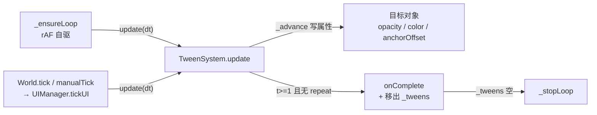
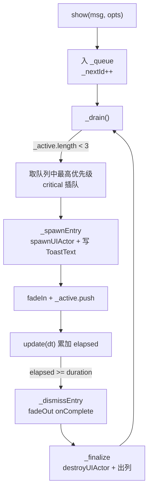
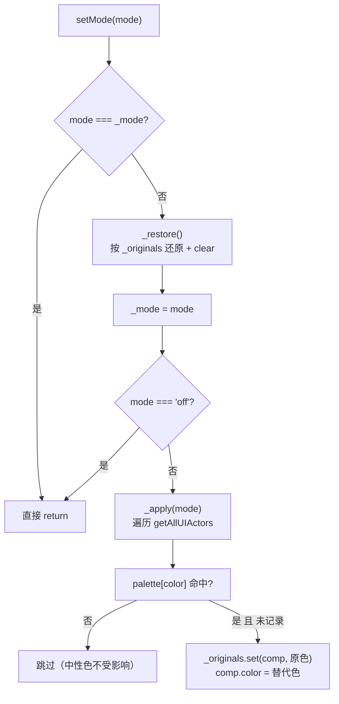

# UI 增强系统（Tween / Toast / Tooltip / 色盲 / 输入提示 / 进度条 / 滚动列表 / 设计级 lint）

> **一句话定位**：八个小功能共同补齐「基础 UI 系统（[UIManager / HUD / 控件组件](../../engine/ui_system.md)）之上缺的游戏 UI 能力」——动效、通知、悬停提示、色盲适配、输入设备感知、进度/列表组件、设计级自动检查。
>
> **什么时候会用到你**：写 gameplay 脚本要淡入淡出/数值补间时；项目启动要接通知/色盲时；做背包/兵营/排行这类可滚动列表时；做血条/进度条时；`.widget.json` 被 lint 报 `ui:font-size` / `ui:small-touch-target` 时；排查「动画不动了」「toast 不弹」「列表拖不动」「列表项堆叠闪烁」时。
>
> 代码位置：引擎侧 `src/engine/ui/TweenSystem.ts`、`ToastSystem.ts`、`UITooltipComponent.ts`、`ColorblindService.ts`、`InputPromptSystem.ts`、`UIProgressBarComponent.ts`、`UIScrollListComponent.ts`；编辑器侧 `src/editor/asset/assetLint/checkers/uiDesignChecker.ts`

---

## 1. 先记住这几个文件

| 文件 | 一句话职责 | 你要改它的场景 |
|---|---|---|
| [TweenSystem.ts](../../../src/engine/ui/TweenSystem.ts) | 补间引擎 + 缓动库 + `fade/fadeIn/fadeOut`；其余七个功能几乎都依赖它 | 加缓动曲线、改驱动方式、动无障碍「减少动效」策略 |
| [ToastSystem.ts](../../../src/engine/ui/ToastSystem.ts) | 通知队列（优先级 + 同时 3 条 + 自动淡出销毁） | 改通知上限/时长、改 widget 文本节点约定 |
| [UIScrollListComponent.ts](../../../src/engine/ui/UIScrollListComponent.ts) | 滚动列表：对象池 + 拖拽 + 回弹 + 程序化滚动条 | 拖拽/回弹/裁剪/闪烁类问题，八成出在这里 |
| [uiDesignChecker.ts](../../../src/editor/asset/assetLint/checkers/uiDesignChecker.ts) | widget 资产的设计级 lint 规则（全 warn） | 加一条 UI 设计检查规则、调阈值 |

其余四个（`ColorblindService` / `UITooltipComponent` / `InputPromptSystem` / `UIProgressBarComponent`）都是独立小模块，用到时再读即可。

**关键心智模型**：这八个功能分两类——**全局单例**（Tween/Toast/Colorblind/InputPrompt，用 `XxxSystem.instance`）和**挂在 Actor 上的组件**（Tooltip/ProgressBar/ScrollList，写在 widget/蓝图资产的 `components` 里）。前者除了 Tween 都需要**在项目启动时显式 attach**，没 attach 就静默失效。

---

## 2. 公共前提：挂接时机（没 attach 就静默失效）

Toast 和 Colorblind 是「需要 UIManager 才能干活」的单例。`FishGameInstance.start()` 里挂接：

```ts
override start(): boolean {
  logger.info(`[Fish] 游戏实例启动, initialMode=${this.initialMode ?? '(未设置, 默认 menu)'}`)
  // Toast 通知系统挂接：widget 资产 + UIManager（动态生成的面板自动获得浮动层偏移）
  ToastSystem.instance.attach(this.world.ui, 'asset/blueprints/ui/toast.widget.json')
  // 色盲模式服务挂接（默认 off；由设置 UI 调用 setMode 切换）
  ColorblindService.instance.attach(this.world.ui)
```

`attach` 本身只存两个引用，不做任何校验（`ToastSystem.ts:85`）：

```ts
attach(ui: UIManager, widgetPath: string): void {
  this._ui = ui
  this._widgetPath = widgetPath
  logger.info(`[ToastSystem] 已挂接 UIManager, widget=${widgetPath}, maxVisible=${this._maxVisible}`)
}
```

> **为什么不校验**：挂接发生在 `start()`，此时磁盘上的 toast widget 还没被读过，也没必要读——只有真正 `show()` 时才需要。代价是**校验被推迟到运行期**，attach 时写错路径不会立刻报错。

未挂接的后果写在 `_spawnEntry` 里（`ToastSystem.ts:168`）：

```ts
private _spawnEntry(entry: ToastEntry): void {
  const ui = this._ui
  if (!ui || !this._widgetPath) {
    // 未挂接：仅记录（不生成 UI，避免静默丢失——控制台提示）
    logger.warn(`[ToastSystem] 未挂接 UIManager/widget，通知被丢弃: "${entry.message}"`)
    this._queue = this._queue.filter((e) => e.id !== entry.id)
    return
  }
  const actor = ui.spawnUIActor(this._widgetPath)
  if (!actor) {
    logger.error(`[ToastSystem] toast widget 生成失败: ${this._widgetPath}，通知丢弃: "${entry.message}"`)
    return
  }
```

> **注意 `_spawnEntry` 里的 out 参数从队列里把自己摘掉**：未挂接时 `show()` 已经把 entry 放进 `_queue` 了，如果不在这里清掉，它会永远占着队列位置（队列不排空，`_drain` 每次都会重新捞到它）。这是「静默失效但不留垃圾」的关键一行。

色盲未挂接同样只 warn 不抛（`ColorblindService.ts:120`）：

```ts
private _apply(mode: Exclude<ColorblindMode, 'off'>): void {
  const ui = this._ui
  if (!ui) {
    logger.warn('[ColorblindService] 未挂接 UIManager，跳过色板应用')
    return
  }
```

**规则**：新项目接入时，在 `GameInstance.start()` 里照抄这两行 attach。排查「toast 不弹」第一件事就是看日志有没有 `[ToastSystem] 已挂接 UIManager`。

`ai.showMessage` 内置了对这个前提的兼容——挂接了走 toast，没挂接退化成日志（`registerBuiltinAIHandlers.ts:155`）：

```ts
// ToastSystem 已挂接（项目启动 attach）→ 显示 toast；未挂接回退日志
if (ToastSystem.instance.attached) {
  ToastSystem.instance.show(msg, {
    priority: p.level === 'error' ? 'critical' : p.level === 'warn' ? 'high' : 'normal',
    duration: p.duration ?? 3,
  })
} else {
  switch (p.level ?? 'info') {
    case 'warn': logger.warn(`[AI][UI] ${msg}`); break
    case 'error': logger.error(`[AI][UI] ${msg}`); break
    default: logger.info(`[AI][UI] ${msg}`)
  }
}
```

---

## 3. Tween 双驱动与减少动效



### 3.1 为什么是双驱动

`tickUI` 每帧调两次 update（`UIManager.ts:471`）：

```ts
tickUI(dt: number) {
  if (!this._running) return
  // 补间系统推进（与 rAF 自驱双保险：rAF 暂停的隐藏页面/测试环境仍可由外部 tick 驱动）
  TweenSystem.instance.update(dt)
  // Toast 队列推进（超时消失/队列补位）
  ToastSystem.instance.update(dt)
```

> **反直觉点**：TweenSystem **自带 rAF 循环**（`_ensureLoop`），游戏运行时 `tickUI` 又调一次 `update(dt)`——看起来会「双倍速」。正常前台时 rAF 与 tick 各有各的 dt，补间按各自 dt 累加，**不会真的双倍速**（rAF 的 dt 来自 `performance.now()` 差值，tick 的 dt 来自渲染循环，两者都推进同一个 `_tweens`，进度累加而非重复计数——代价是前台时推进略快于单一驱动，这是已知的取舍）。双驱动兜底的是 **rAF 停摆的页面**：普通浏览器/Playwright 集成浏览器在页面 hidden 时会暂停 rAF，此时外部 `manualTick` → `tickUI` 驱动仍能推进补间；Electron 主窗口/Agent 窗口已配 `backgroundThrottling: false`，后台 rAF 不再暂停（见 [游戏流程](../../engine/gameflow_system.md)）。

关掉自驱改由外部驱动（测试环境）：

```ts
TweenSystem.instance.autoDrive = false
```

`autoDrive` setter 会立刻停掉 rAF（`TweenSystem.ts:223`）：

```ts
set autoDrive(v: boolean) {
  this._autoDrive = v
  if (!v && this._rafId !== null) {
    cancelAnimationFrame(this._rafId)
    this._rafId = null
  } else if (v && this._tweens.length > 0) {
    this._ensureLoop()
  }
}
```

### 3.2 减少动效：瞬时完成但 onComplete 照跑

这是本系统最容易被写错的地方。`_create` 里第一段就是拦截：

```ts
// 减少动效：不播放动画，直接跳到终点（属性置目标值 + 触发 onComplete）
if (!this._motionEnabled) {
  this._completeImmediate(tw)
  return { kill: () => {}, done: true }
}
```

> **为什么必须触发 onComplete**：Toast 的 `fadeOut(..., { onComplete: () => this._finalize(entry) })` 要靠这个回调销毁 UI。如果「减少动效」只是不播动画也不回调，toast 会**永远停在屏幕上不消失**。所以 `_completeImmediate` 里 `onUpdate` 和 `onComplete` 都要跑一遍：

```ts
private _completeImmediate(tw: InternalTween): void {
  if (tw.killed) return
  const values: Record<string, Tweenable> = {}
  for (const [key, prop] of tw.props) {
    const final = prop.from.map((f, i) => f + prop.delta[i])
    values[key] = prop.isColor ? rgbaToColor(final as RGBA) : (prop.delta.length === 1 ? final[0] : final)
    ;(tw.target as Record<string, unknown>)[key] = values[key]
  }
  tw.killed = true
  tw.onUpdate?.(values)
  tw.onComplete?.()
}
```

自动检测只做一次，手动设置后不再检测（`TweenSystem.ts:410`）：

```ts
private _autoDetectMotion(): void {
  if (this._motionAutoDetected) return
  this._motionAutoDetected = true
  if (typeof window !== 'undefined' && typeof window.matchMedia === 'function') {
    try {
      const reduced = window.matchMedia('(prefers-reduced-motion: reduce)')
      this._motionEnabled = !reduced.matches
      if (reduced.matches) logger.info('[TweenSystem] 检测到系统 prefers-reduced-motion，动画默认瞬时完成')
    } catch {
      // matchMedia 不可用：保持默认 true
    }
  }
}
```

> **坑点**：`_autoDetectMotion` 是**懒执行**的，只有访问 `motionEnabled` getter 时才触发。而 `_create` 里读的是私有字段 `_motionEnabled`，不是 getter——所以**如果没人读过 `motionEnabled`，自动检测根本不会跑**，系统偏好也就不会生效。`setMotionEnabled()` 会先把 `_motionAutoDetected` 置 true 再赋值，保证手动设置不被后续自动检测覆盖。

---

## 4. 浮动层：动态面板为什么能盖过 HUD

Toast 和 Tooltip 都靠 `UIManager.spawnUIActor` 动态生成面板。`spawnUIActor` 末尾有一段：

```ts
// 浮动面板层级基准：游戏运行中动态生成的 UI（地图面板/暂停菜单/兵营面板等）整树
// zOrder += FLOAT_LAYER_BIAS，保证盖过常驻 HUD（three 透明排序按全局 renderOrder，
// 不偏移会被 HUD 内高 zOrder 的文字穿透）。场景切换期生成（HUD 本体）不偏移。
if (this.owner.running) this.applyFloatLayerBias(actor)
```

```ts
private applyFloatLayerBias(actor: Actor): void {
  const walk = (a: Actor): void => {
    for (const comp of a.getComponents(CanvasUIComponent)) {
      comp.zOrder += FLOAT_LAYER_BIAS
    }
    for (const child of a.getChildren()) {
      walk(child)
    }
  }
  walk(actor)
}
```

`FLOAT_LAYER_BIAS = 100`（`UIManager.ts:47`）。

> **两个反直觉点**：
> 1. **`if (this.owner.running)` 这个判断**：场景切换期生成的 HUD **本体不偏移**。因为 HUD 本来就该在最底层，给它 +100 会让后来生成的浮动面板反而盖不住它。
> 2. **遍历的是 `CanvasUIComponent` 而不是 UIImage/UIText**：`UITextComponent` / `UIImageComponent` 都继承自 `CanvasUIComponent`，而 `isMarkerOnly` / `isClickOnly` 的派生类才各自处理。整树 `+= 100` 保证面板内文字与背景的相对层级不变。

`applyFloatLayerBias` 的注释也说明了它的现状——主要留给**程序化 UI** 兜底（树序遍历分配 `reassignTreeOrder` 已让浮动面板天然盖过 HUD）：

```ts
/**
 * 提升一棵 UI 树的 zOrder（浮动面板层级基准，兼容保留）：
 * 树序遍历分配（reassignTreeOrder）已保证浮动面板（HUD 子树末尾）天然盖过
 * 常驻 HUD，此方法保留用于非树序路径的程序化 UI（如 UIScrollList 滚动条）
 * 叠加兜底偏移。
 */
```

滚动列表的滚动条就是走这个兜底：它是 `new GenericActor(...)` 程序化创建的，不经 `spawnUIActor`，所以 zOrder 得自己算：

```ts
// zOrder：低于滑块（+5）高于 item（+2/3）
trackImg.zOrder = FLOAT_LAYER_BIAS + this._zOrderLift + 4
```

```ts
// zOrder：高于轨道（+4）与 item（+2/3）
img.zOrder = FLOAT_LAYER_BIAS + this._zOrderLift + 5
```

---

## 5. Toast：优先级队列 + 淡出销毁



`_drain` 的插队逻辑是一行 reduce（`ToastSystem.ts:155`）：

```ts
private _drain(): void {
  while (this._active.length < this._maxVisible && this._queue.length > 0) {
    // critical 插队：优先取队列中最高优先级
    const idx = this._queue.reduce(
      (best, e, i) => (e.priority > this._queue[best].priority ? i : best),
      0,
    )
    const entry = this._queue.splice(idx, 1)[0]
    this._spawnEntry(entry)
  }
}
```

> **注意**：`_drain` 只在 `while (_active.length < _maxVisible)` 时捞队列。所以「critical 插队」的准确含义是——**有空位时优先弹高优先级**，而不是「把正在显示的低优先级挤掉」。已经显示在屏幕上的普通 toast 不会被后来的 critical 顶掉。

销毁链路的幂等保护值得注意——`fadeOut` 的 `onComplete` 与 `dismissAll()` 会指向同一条 entry：

```ts
private _finalize(entry: ToastEntry): void {
  const ui = this._ui
  const actor = entry.actor
  if (ui && actor && !actor.bPendingDestroy) {
    ui.destroyUIActor(actor)
  }
  const ai = this._active.indexOf(entry)
  if (ai >= 0) this._active.splice(ai, 1)
}
```

> `!actor.bPendingDestroy` + `indexOf >= 0` 双重保护，所以 `_finalize` 重复调用安全。注释里明写了「幂等：重复调用安全」。

---

## 6. Tooltip：悬停延迟由组件自己 Tick 累计

Tooltip 不走全局系统，是挂在控件上的组件。`BeginPlay` 自动补挂 ClickableComponent：

```ts
override BeginPlay(): void {
  super.BeginPlay()
  // 挂载/复用可点击组件（UI 按钮已自带；纯文本/图片控件需补挂）
  let clickable = this.owner.getComponent(ClickableComponent)
  if (!clickable) {
    clickable = new ClickableComponent(this.owner)
    this.owner.addComponent(clickable)
  }
  // UI 层：独立 UI 相机平行射线检测
  clickable.layer = 'ui'
  clickable.onHover = (hit) => {
    if (hit) {
      this._hovering = true
      if (this._hoverStart < 0) this._hoverStart = 0
    } else {
      this._hovering = false
      this._hoverStart = -1
      this._hide()
    }
  }
```

延迟计时在 `Tick` 里（`UITooltipComponent.ts:137`）：

```ts
override Tick(dt: number): void {
  super.Tick(dt)
  // 悬停延迟累计：进入 delay 秒后显示
  if (this._hovering && !this._tooltipActor && this._hoverStart >= 0) {
    this._hoverStart += dt
    if (this._hoverStart >= this._delay) {
      this._hoverStart = -1
      this._show()
    }
  }
}
```

> **为什么用 `Tick` 而不是 `setTimeout`**：`setTimeout` 在游戏暂停/场景切换时不会停，会在 UI 已销毁后触发。用 `Tick` 意味着延迟**随游戏时间走**，且组件 `EndPlay` 后自动停止。代价是 Tick 依赖 `UIManager.tickUI` 的驱动。

生成面板时挂到宿主下，位置随宿主自动跟随（`_show`）：

```ts
const actor = ui.spawnUIActor(this._widgetPath, this.owner)
```

```ts
// 有锚点（anchor != null）时偏移写 anchorOffset；无锚点写 position
if (tsf.anchor) {
  tsf.anchorOffset = [0, offsetY]
} else {
  tsf.setPosition(0, offsetY, 0)
}
```

> **为什么分两条路**：widget 资产的根节点有的配了锚点，有的没配。锚点存在时 `position` 会被 `applyAnchor` 覆盖，必须写 `anchorOffset`；没锚点时 `anchorOffset` 无人消费，只能写 `position`。写错分支表现为 tooltip 贴在宿主中心不偏移。

---

## 7. 色盲：可撤销的语义色替换



核心是「先还原再应用」（`ColorblindService.ts:98`）：

```ts
setMode(mode: ColorblindMode): void {
  if (mode === this._mode) return
  // 先还原（用首次记录的原始色），再应用新模式
  this._restore()
  this._mode = mode
  if (mode !== 'off') this._apply(mode)
  logger.info(`[ColorblindService] 色盲模式 → ${mode}（已替换 ${this._originals.size} 个颜色）`)
}
```

```ts
private _restore(): void {
  if (this._originals.size === 0) return
  for (const [comp, original] of this._originals) {
    if (comp instanceof UIImageComponent) comp.color = original
    else if (comp instanceof UITextComponent) comp.color = original
  }
  this._originals.clear()
}
```

> **为什么「先还原再应用」而不是直接替换**：`_apply` 里查的是 `palette[comp.color]`——**拿当前色去查表**。如果不先还原，从绿盲切到红盲时，组件上已经是绿盲的替代色（如 `#e07b00`），这个色不在任何色板的 key 里，映射直接落空，颜色就**卡在绿盲状态再也切不回来**。先还原到原始色，才能保证每次映射都从同一基准出发。

应用侧的 `!this._originals.has(comp)` 判断是防重复覆盖：

```ts
const replacement = palette[img.color.toLowerCase()]
if (replacement && !this._originals.has(img)) {
  this._originals.set(img, img.color)
  img.color = replacement
}
```

> **为什么不重复记录**：`_originals` 存的是**首次**替换前的颜色。如果同一次会话里重复 set，第二次记录的就是已经被替换过的色，`_restore` 就还原不回去了。

**关于 WeakMap**：注释与早期设计说「原始色存 WeakMap，可撤销」，但**实际实现是普通 `Map<object, string>`**（`ColorblindService.ts:74`）：

```ts
/** 组件 → 原始色（首次应用时记录，切换/还原用） */
private _originals = new Map<object, string>()
```

> 用普通 Map 的差异：`_restore()` 里显式 `clear()` 后引用即释放，功能上等价；但如果一个组件被销毁而 map 未 clear，Map 会**持有组件强引用阻止 GC**，直到下次 `setMode` / `detach`。当前流程里 `_restore` 每次都会 clear，所以不构成实际泄漏——只是别指望靠 WeakMap 自动回收。

---

## 8. InputPrompt：设备检测由输入链路驱动

```ts
setDevice(device: InputDevice): void {
  if (device === this._device) return
  logger.info(`[InputPromptSystem] 输入设备切换: ${this._device} → ${device}`)
  this._device = device
  this.onDeviceChanged?.(device)
}
```

```ts
prompt(kbLabel: string, mouseLabel: string): string {
  return this._device === 'keyboard' ? kbLabel : mouseLabel
}
```

驱动点只有两个（`InputSys.ts`）：`handleKeyDown` 里

```ts
// 输入设备检测：键盘事件 → 设备切换为 keyboard（触发提示文本刷新）
InputPromptSystem.instance.setDevice('keyboard')
```

`handlePointerDown` 里

```ts
// 输入设备检测：鼠标按下 → 设备切换为 mouse（触发提示文本刷新）
InputPromptSystem.instance.setDevice('mouse')
```

> **注意这里不是自驱的**：没有 tick、没有轮询，完全靠输入事件推。`prompt()` 返回的是**当前设备**对应的文本，设备切换后已渲染的文本**不会自动更新**——需要自己挂 `onDeviceChanged` 重刷。另外 `prompt` 只区分 keyboard / 非 keyboard，`touch` 类型在类型里存在但**没有驱动点**（`handlePointerDown` 只写 `'mouse'`）。

---

## 9. ProgressBar：靠锚点决定生长方向

```ts
const ratio = this.ratio
// 水平方向：改宽度（高度保持容器高）；垂直方向：改高度（宽度保持容器宽）
if (this._direction === 'left-to-right' || this._direction === 'right-to-left') {
  tsf.setWorldSize(hostW * ratio, hostH)
} else {
  tsf.setWorldSize(hostW, hostH * ratio)
}
// 锚点已配置（middle-left 等）→ applyAnchor 让 fill 贴边生长；
// 未配置锚点 → fill 中心默认在容器中心，宽度缩小时两侧同时收缩（效果同 center 填充）
tsf.applyAnchor()
```

> **关键**：组件只改**尺寸**，不改位置。「从左往右」还是「从右往左」完全由 fill 子节点的**锚点**决定——`middle-left` 锚点时，宽度变小它贴左边；`middle-right` 时贴右边。忘了配锚点，血条会从中间向两边同时缩短。这是和锚点系统耦合最深的一处，见 [锚点系统](./ui_anchor_system.md)。

容器尺寸为 0 时直接返回，不刷：

```ts
const [hostW, hostH] = hostTsf?.getWorldSize() ?? [0, 0]
if (hostW <= 0 || hostH <= 0) return
```

---

## 10. ScrollList：对象池 + 拖拽 + 橡皮筋

这是八个功能里最复杂的一个。

### 10.1 可视数量自动推导 —— 只有内容超框才能滚

```ts
private _resolveVisibleCount(): number {
  if (this._visibleCount > 0) return this._visibleCount
  const [iw, ih] = this._itemSize
  const step = this._direction === 'vertical' ? ih + this._spacing : iw + this._spacing
  const tf = this.owner.getComponent(UITransformComponent)
  const size = tf?.getWorldSize()
  if (!size) return 5
  const capacity = this._direction === 'vertical' ? size[1] : size[0]
  return Math.max(1, Math.floor(capacity / step))
}
```

> **为什么必须自动推导**：`maxScroll = max(0, totalCount - visibleCount)`。如果 `visibleCount` 固定写死成 5，而容器其实只装得下 3 个，那么 `totalCount=4` 时 `maxScroll=0`——**滚不动**，但视觉上第 4 项已经溢出到容器外了。自动推导保证「溢出了一定能滚，没溢出一定不能滚」。

配套的钳制：

```ts
private _clampScroll(): void {
  const maxScroll = Math.max(0, this._totalCount - this._resolveVisibleCount())
  if (this._scrollOffset > maxScroll) this._scrollOffset = maxScroll
}
```

### 10.2 不裁剪溢出（引擎无 mask）

文件头注释直接写明：

```
注：列表不裁剪溢出可视区（引擎无 mask）；如需裁切，容器外 item 由 active 隐藏。
```

`_layout` 里对超出数据范围的 item 做 `bActive = false`：

```ts
// 出界隐藏（负索引也要隐藏：顶部橡皮筋拖拽时 soft < 0 会让 start = -1，
// 若不隐藏 index < 0 的槽位，会触发 onItemSpawned(item, -1) 刷新出错误内容，
// 且所有可见 item 同时重映射索引重建纹理——表现为拖拽/回弹边界的"跳跃/闪烁"）
if (index < 0 || index >= this._totalCount) {
  // 出界隐藏：清除 memo（重新入界时必然刷新内容）
  item.bActive = false
  this._itemIndices.delete(item)
  continue
}
```

> **注意这是按「数据索引」隐藏，不是按「几何位置」**。item 滚动到容器外但索引仍在 `[0, totalCount)` 范围内时，**它是可见的**——会渲染到容器外面。这就是「不裁剪」的实际表现。

### 10.3 热路径优化：绕过 anchorOffset setter

```ts
const pos = (i - frac) * step
const tsf = item.getComponent(UITransformComponent)
if (tsf) {
  // 热路径：直接 setPosition（基准世界坐标 + 位移），跳过 anchorOffset setter 的
  // applyAnchor 父链遍历与 setWorldSize 尺寸重建——尺寸布局期已设好不变
  const [bx, by] = this._basePositions.get(item) ?? [0, 0]
  const rp = item.root.position
  if (this._direction === 'vertical') {
    item.setPosition(bx, by - pos, rp.z)
  } else {
    item.setPosition(bx + pos, by, rp.z)
  }
}
```

> **为什么用 `(i - frac)` 而不是 `(index - frac)`**：注释里写得非常具体，`index = start + i`，用 `index - frac` 会多出 `start × step` 偏移，导致 ①滚动后内容顶部空出空白 ②拖拽跨整数边界时位置跳跃约 1 个 step。这是真实踩过的坑。

配套的池化初始化里还把 item 根锚点**主动置空**：

```ts
// 解除 item 根锚点：池化 item 位置由列表全权接管（_layout setPosition），
// 若保留蓝图 anchor，item 延迟到来的 BeginPlay → applyAnchor 会用蓝图
// anchorOffset 覆盖排布位置——首次渲染全部叠到锚点处，拖动一下才恢复。
// 置 null 后 applyAnchor 直接跳过（item 子节点锚点不受影响）
baseTsf.anchor = null
baseTsf.anchorOffset = [0, 0]
```

### 10.4 拖拽取消点击（8px 阈值）

拖拽绑定在 item 的 `ClickableComponent` 上（`UIScrollListComponent.ts:521`）：

```ts
private _bindItemDrag(item: Actor): void {
  const clickable = item.getComponent(ClickableComponent)
  if (!clickable) return
  clickable.onDragStart = (sx, sy) => { ... }
  clickable.onDragMove = (sx, sy) => {
    const session = this._dragSession
    if (!session) return
    // 屏幕像素 → UI 世界单位（UI 画布高恒定 5.4，垂直方向始终铺满视口）
    const rect = PhySys.viewportElement?.getBoundingClientRect()
    const worldPerPx = rect && rect.height > 0 ? UI_CANVAS_H / rect.height : 0.02
    ...
    const deltaPx = this._direction === 'vertical' ? sy - session.sy : sx - session.sx
    this._setDragOffset(session.baseOffset - (deltaPx * worldPerPx) / step)
    // 记录本次拖拽是否真正越界（松手仅越界过才回弹，正常滑动不弹）
    const maxScroll = Math.max(0, this._totalCount - this._resolveVisibleCount())
    if (this._scrollOffset < -0.001 || this._scrollOffset > maxScroll + 0.001) {
      this._dragOverscrolled = true
    }
  }
  clickable.onDragEnd = () => this._bounceBack()
}
```

「绑定了 `onDragMove` 就自动取消点击」是 `ClickableComponent` 的契约（`ClickableComponent.ts:196`）：

```ts
if (this.onDragMove) {
  // 拖拽语义：点击延迟到释放（未拖拽）时触发，位移超阈值取消
  this._pendingClick = hit
} else {
  // 普通点击：按下即触发（保持原语义）
  this.onClick?.(hit)
}
```

```ts
handleDragMove(screenX: number, screenY: number): void {
  if (!this._pressed) return
  if (!this._pressScreen) {
    this._pressScreen = [screenX, screenY]
    this.onDragStart?.(screenX, screenY)
  } else {
    const dx = screenX - this._pressScreen[0]
    const dy = screenY - this._pressScreen[1]
    if (dx * dx + dy * dy > ClickableComponent.DRAG_THRESHOLD_PX * ClickableComponent.DRAG_THRESHOLD_PX) {
      this._pendingClick = null
    }
  }
  this.onDragMove?.(screenX, screenY)
}
```

阈值 `DRAG_THRESHOLD_PX = 8`（`ClickableComponent.ts:70`）。

> **这个设计的好处**：未绑定 `onDragMove` 的组件（普通按钮）**完全不受影响**，保持「按下即触发」的原语义。只有明确参与拖拽语义的组件才付出「点击延迟到 mouseup」的代价。

### 10.5 橡皮筋：软钳制 + 松手补间

拖拽期间允许越界，呈现时衰减 1/3：

```ts
private _softOffset(): number {
  const maxScroll = Math.max(0, this._totalCount - this._resolveVisibleCount())
  let o = this._scrollOffset
  if (o < 0) o /= 3
  else if (o > maxScroll) o = maxScroll + (o - maxScroll) / 3
  return o
}
```

松手回弹（`_bounceBack`），且**只有真正越界过才弹**：

```ts
private _bounceBack(): void {
  if (!this._dragOverscrolled) return
  this._dragOverscrolled = false
  const maxScroll = Math.max(0, this._totalCount - this._resolveVisibleCount())
  const target = Math.max(0, Math.min(maxScroll, this._scrollOffset))
  if (Math.abs(target - this._scrollOffset) < 0.001) return
  const start = this._scrollOffset
  this._bounceTween = TweenSystem.instance.to({ v: start }, { v: target }, {
    duration: 0.25,
    easing: 'quadOut',
    onUpdate: (values) => {
      this._scrollOffset = (values.v as number)
      this._layout()
    },
    onComplete: () => {
      this._bounceTween = null
    },
  })
```

> **两个细节**：① 补间目标是个**临时对象 `{ v: start }`**，不是组件本身——因为 `_scrollOffset` 需要走 `_layout()` 才能生效，直接补间组件字段会绕过布局。② 用 `onUpdate` 手动 `this._layout()`，而不是补间 `_scrollOffset` setter（setter 会立即 `_clampScroll()`，把越界值钳掉，回弹就没了）。

### 10.6 refresh() 必须清 memo

```ts
refresh(): void {
  this._itemIndices.clear()
  this._layout()
}
```

> 注释解释了典型踩坑：`totalCount` setter 先触发一次 `_layout`（此时 `onItemSpawned` 还没赋值，memo 已记录索引），随后脚本才赋值回调并调 `refresh`。若不清 memo，`_layout` 会因「索引未变」跳过回调，**首次文本/点击绑定全部丢失**——表现为列表项是空白的，滚一下才出现内容。

---

## 11. 设计级 lint：由 assetLint 对 .widget.json 额外调度

不需要手动触发，也不需要在 widget 资产里声明。`AssetLintEngine` 在正常检查跑完后追加一次（`AssetLintEngine.ts:249`）:

```ts
// widget 资产（UI 蓝图）：额外跑游戏 UI 设计级检查（字号/触控/阴影/zOrder，全部 warn）
if (f.path.endsWith('.widget.json')) {
  const designChecker = getChecker('doc:ui-design')
  if (designChecker) {
    issues.push(...designChecker.run(f.doc, this.makeContext(f.path, '<widget 根>')))
  }
}
return issues
```

`ui_compile`（编译 `.widget.html`）走的是另一条桥接，逻辑一致（`lintBridge.ts:40`）：

```ts
// widget 资产：额外跑 UI 设计级检查（与 AssetLintEngine.validateDoc 一致）
if (filePath.endsWith('.widget.json')) {
  const designChecker = getChecker('doc:ui-design')
```

四条规则（全 warn，不影响通过率）：

| ruleId | 触发条件 | 检查字段 |
|---|---|---|
| `ui:font-size` | `UITextComponent.fontSize < 14` | `properties.fontSize` |
| `ui:no-text-shadow` | 文本无 `shadowColor` 且不是按钮文本（节点名/路径不含 `Btn`） | `properties.shadowColor` |
| `ui:small-touch-target` | 含 `UIButtonComponent` 的节点，世界尺寸换算像素 `min(w,h) < 44` | `properties.worldWidth` |
| `ui:z-index-war` | `CanvasUIComponent.zOrder > 100` | `properties.zOrder` |

像素换算按根画布实际比例推导，不是硬编码 200：

```ts
const pxW = typeof canvas?.width === 'number' ? (canvas.width as number) : 1920
const worldW = typeof tsf?.worldWidth === 'number' ? (tsf.worldWidth as number) : 9.6
return worldW > 0 ? pxW / worldW : 200
```

`ui:z-index-war` 的判据在注释里说明了动机：

```ts
// 4. zOrder 魔数（>100 通常只有 FLOAT_LAYER_BIAS 动态叠加，资产内不应出现）
```

> 因为 §4 的浮动层机制会**运行时** `+= 100`，资产里手写 >100 的 zOrder 基本都是误写——要么是想抬层级但不知道有自动偏移，要么是抄了运行时的实际值。

zOrder 报错信息也点明了惯例区间是 `0~4`。

---

## 12. 关键方法速查

| 方法 | 位置 | 干什么 | 注意 |
|---|---|---|---|
| `TweenSystem.to / fromTo` | `TweenSystem.ts:264` / `:275` | 建补间，返回 `TweenHandle` | 属性解析失败（`parseProp` 返回 null）会静默跳过该属性 |
| `TweenSystem.fade / fadeIn / fadeOut` | `TweenSystem.ts:318` / `:343` / `:348` | 整树补间 opacity | 跳过 `isMarkerOnly` 与 `isClickOnly` 组件 |
| `TweenSystem.update(dt)` | `TweenSystem.ts:295` | 手动推进一帧 | `dt <= 0` 直接返回 |
| `TweenSystem.motionEnabled` (get/set) | `TweenSystem.ts:237` / `:241` | 减少动效开关 | **getter 触发懒自动检测**；setter 关闭时把所有进行中补间瞬时完成 |
| `TweenSystem.setMotionEnabled(v)` | `TweenSystem.ts:254` | 手动设置（覆盖自动检测） | 内部先置 `_motionAutoDetected = true` |
| `TweenSystem.autoDrive` | `TweenSystem.ts:222` | rAF 自驱开关 | 置 false 立即 `cancelAnimationFrame` |
| `ToastSystem.attach(ui, path)` | `ToastSystem.ts:85` | 挂接 UIManager + widget 路径 | 不校验路径存在性 |
| `ToastSystem.show(msg, opts)` | `ToastSystem.ts:102` | 入队并返回 id | 未挂接时 `_spawnEntry` warn 并从队列摘除 |
| `ToastSystem.update(dt)` | `ToastSystem.ts:140` | 推进超时 + 补位 | 由 `UIManager.tickUI` 调用 |
| `ToastSystem._drain` | `ToastSystem.ts:155` | 队列→活动区，critical 插队 | **只在有空位时捞**，不会顶掉已显示的 |
| `ColorblindService.attach(ui)` | `ColorblindService.ts:83` | 挂接 UIManager | 未挂接时 `setMode` 只 warn |
| `ColorblindService.setMode(mode)` | `ColorblindService.ts:98` | 切换/还原色板 | 先 `_restore` 再 `_apply`；同 mode 直接 return |
| `ColorblindService._apply` | `ColorblindService.ts:120` | 遍历 UI 树替换命中色 | 用普通 `Map`（非 WeakMap）存原始色 |
| `InputPromptSystem.setDevice` | `InputPromptSystem.ts:43` | 切换设备 | 仅在变化时触发 `onDeviceChanged` |
| `InputPromptSystem.prompt(kb, mouse)` | `InputPromptSystem.ts:55` | 取当前设备提示文本 | `touch` 无驱动点；只区分 keyboard / 非 keyboard |
| `UITooltipComponent.Tick` | `UITooltipComponent.ts:137` | 累计悬停延迟 | 用 Tick 而非 setTimeout，随游戏时间走 |
| `UITooltipComponent._show` | `UITooltipComponent.ts:156` | 生成面板挂宿主下 | 有锚点写 `anchorOffset`，无锚点写 `position` |
| `UIProgressBarComponent._refresh` | `UIProgressBarComponent.ts:136` | 按比例改 fill 尺寸 | 方向由 fill 的**锚点**决定；宿主尺寸为 0 直接 return |
| `UIScrollListComponent._initialize` | `UIScrollListComponent.ts:303` | 建对象池（`visibleCount + 1`） | 未挂 World 时延迟到 `BeginPlay` |
| `UIScrollListComponent._layout` | `UIScrollListComponent.ts:641` | 按偏移排布 item | 位移用 `(i - frac)`，不是 `(index - frac)` |
| `UIScrollListComponent._bindItemDrag` | `UIScrollListComponent.ts:521` | 绑 item 拖拽 | 绑了 `onDragMove` 即启用拖拽取消点击 |
| `UIScrollListComponent._bounceBack` | `UIScrollListComponent.ts:579` | 越界回弹补间 | 仅 `_dragOverscrolled` 为真才弹；补间临时对象不走 setter |
| `UIScrollListComponent.refresh()` | `UIScrollListComponent.ts:280` | 清 memo 后重排 | **必须调**，否则首次内容不填充 |
| `UIManager.spawnUIActor` | `UIManager.ts:131` | 动态生成 UI | `running` 时整树 `zOrder += 100` |
| `UIManager.applyFloatLayerBias` | `UIManager.ts:314` | 浮动层偏移 | 主要给程序化 UI 兜底 |
| `UIManager.tickUI` | `UIManager.ts:471` | 每帧驱动 Tween + Toast | Tween 双驱动之一 |
| `ClickableComponent.handleDragMove` | `ClickableComponent.ts:212` | 分发拖拽 + 超阈值取消点击 | 阈值 `DRAG_THRESHOLD_PX = 8` |
| `UiDesignChecker.validate` | `uiDesignChecker.ts:74` | 四条设计级规则 | 全 warn，不影响通过率 |

---

## 13. 流程影响：牵动哪些功能

### 上游：谁驱动它

| 上游 | 怎么驱动 | 相关文档 |
|---|---|---|
| 游戏实例启动 | `GameInstance.start()` 调 `ToastSystem.attach` / `ColorblindService.attach` | [游戏流程](../../engine/gameflow_system.md) |
| 世界 Tick | `World.tick` / `World.manualTick` → `UIManager.tickUI` → `TweenSystem.update` + `ToastSystem.update` | [游戏流程](../../engine/gameflow_system.md) |
| 输入系统 | `handleKeyDown` → `setDevice('keyboard')`；`handlePointerDown` → `setDevice('mouse')`；`handlePointerMove` → `PhySys.dispatchDragMove` 驱动列表拖拽 | [输入物理脚本](../../engine/input_physics_script_system.md) |
| UI 管理器 | `spawnUIActor` 提供动态生成 + 浮动层偏移；`getAllUIActors` 供色盲遍历 | [UI 系统](../../engine/ui_system.md) |
| 资产检查引擎 | 对 `.widget.json` 额外调度 `doc:ui-design` 检查器 | [资产预览与检查](../asset/asset_preview_lint_system.md) |
| AI 事件 | `ai.showMessage` 按 `ToastSystem.attached` 决定走 toast 还是日志 | [AI 事件系统](../../engine/ai_system.md) |

### 下游：它波及谁

| 下游功能 | 波及点 | 相关文档 |
|---|---|---|
| 画布渲染 | `fade` 遍历整树改 `opacity`；进度条/列表改子 Actor 尺寸 | [CanvasUIComponent](../../engine/ui_canvas_component.md) |
| 锚点布局 | 进度条 fill 生长方向、tooltip 偏移写入分支、item 根锚点被置 null | [UI 锚点系统](./ui_anchor_system.md) |
| 点击/拖拽分发 | 绑定 `onDragMove` 的 Clickable 自动启用「拖拽取消点击」（8px 阈值） | [输入物理脚本](../../engine/input_physics_script_system.md) |
| widget 资产源格式 | 设计级 lint 对 `.widget.json` 生效，`ui_compile` 走 lintBridge 同一套规则 | [UI 源格式系统](./ui_source_format_system.md) |
| 编辑器面板 | 设计级 lint 结果全 warn，不阻断资产通过率 | [UI 组件系统](./ui_components_system.md) |
| 资产检查面板 | 设计级检查器经 `registerAssetChecker` 注册，结果汇入 assetLint issue 列表 | [资产预览与检查](../asset/asset_preview_lint_system.md) |

---

## 14. 踩坑清单（都是真踩过的）

**1. `_spawnEntry` 未挂接时队列会留垃圾**

现象：Toast 不弹且队列越积越多。原因：`show()` 先入队再 `_drain()`，未挂接时 entry 已进 `_queue`。规则：`_spawnEntry` 里必须 `this._queue = this._queue.filter((e) => e.id !== entry.id)` 把自己摘掉（`ToastSystem.ts:172`）。

**2. 色盲切换必须「先还原再应用」**

现象：绿盲切红盲后颜色卡住不动。原因：`_apply` 拿**当前色**查色板 key，绿盲替代色（`#e07b00`）不在任何色板 key 里，映射落空。规则：`setMode` 里 `_restore()` 必须排在 `_apply()` 前（`ColorblindService.ts:101`）。

**3. `motionEnabled` 的自动检测是懒的**

现象：系统开了「减少动效」但动画照播。原因：`_autoDetectMotion()` 只在访问 `motionEnabled` getter 时触发，而 `_create` 读的是私有字段 `_motionEnabled`。没有人读过 getter，检测就不跑。规则：接入设置 UI 时显式调 `setMotionEnabled()`，别依赖自动检测。

**4. `visibleCount` 写死会导致「溢出但滚不动」**

现象：内容明明超出容器，`scrollBy` 无效。原因：`maxScroll = max(0, totalCount - visibleCount)`，写死的 `visibleCount` 大于容器实际容量时 `maxScroll = 0`。规则：不配或配 ≤0 走自动推导（`_resolveVisibleCount`）。另外 `getPersistentProps` 会在 `visibleCount <= 0` 时**删掉该字段**不写回资产，避免残留 `-1` 触发 assetLint schema 的 `min:1` 报错。

**5. 列表位移公式写错会跳跃一个 step**

现象：滚动后内容顶部空出空白；拖拽跨整数边界时位置跳约 1 个 item 高度。原因：用了 `(index - frac) * step`，而 `index = start + i`，多出 `start × step`。规则：用 `(i - frac) * step`（`UIScrollListComponent.ts:664` 注释原文）。

**6. item 根锚点不置 null 会首次渲染全叠一起**

现象：列表首帧所有 item 叠在锚点处，拖一下才散开。原因：item 的 `BeginPlay` 延迟到来，`applyAnchor` 用蓝图里的 `anchorOffset` 覆盖了 `_layout` 排好的位置。规则：`_initialize` 里 `baseTsf.anchor = null; baseTsf.anchorOffset = [0, 0]`。

**7. `refresh()` 不调则首次内容全空**

现象：列表项是空白的，滚一下才出现内容。原因：`totalCount` setter 先触发 `_layout`（此时 `onItemSpawned` 未赋值，memo 已记录索引），后续赋值回调再调 `refresh` 时索引未变，跳过回调。规则：`onItemSpawned` 赋值后调 `refresh()`，内部会 `_itemIndices.clear()`。

**8. 出界 item 必须隐藏，否则边界闪烁**

现象：拖到列表顶/底时内容跳跃闪烁。原因：`soft < 0` 时 `start = -1`，`index < 0` 的槽位会触发 `onItemSpawned(item, -1)` 刷出错误内容，且所有 item 同时重映射索引重建纹理。规则：`_layout` 里 `index < 0 || index >= totalCount` 就 `bActive = false` 且 `delete memo`。

**9. 回弹补间不能走 `scrollOffset` setter**

现象：拖拽越界松手不回弹，或瞬间跳到边界。原因：setter 里有 `_clampScroll()`，会把越界值立刻钳掉。规则：`_bounceBack` 用临时对象 `{ v: start }` 补间，在 `onUpdate` 里手动写 `_scrollOffset` 再 `_layout()`。

**10. 资产里手写 zOrder > 100 是误写**

现象：lint 报 `ui:z-index-war`。原因：浮动层偏移是**运行时** `+= 100` 自动叠加的，资产惯例区间是 `0~4`。规则：资产内不要写大于 100 的 zOrder。

**11. 程序化 UI 拿不到自动浮动层偏移**

现象：滚动条被列表 item 盖住。原因：滚动条是 `new GenericActor(...)` 创建的，不经 `spawnUIActor`。规则：手动设 `zOrder = FLOAT_LAYER_BIAS + _zOrderLift + 4/5`，并调 `reassignTreeOrder()` 重排树序。

**12. 场景切换期生成的 HUD 不带浮动层偏移**

现象：HUD 盖住了后生成的浮动面板。原因：`spawnUIActor` 里 `if (this.owner.running)` 才偏移，HUD 本体生成时 `running` 尚未置位。规则：这是**有意设计**，别去「修」它。

---

## 15. 边界条件

| 条件 | 行为 | 怎么应对 |
|---|---|---|
| `ToastSystem` 未 attach | `show()` 入队后 `_spawnEntry` warn 并从队列摘除 | 在 `GameInstance.start()` 里 attach |
| toast widget 路径错误 | `spawnUIActor` 返回 null → error 日志 + 通知丢弃 | 检查 `asset/blueprints/ui/toast.widget.json` 存在 |
| toast widget 缺 `ToastText` 节点 | 文本不设置 + warn，面板仍显示 | 按约定命名子节点 |
| `ColorblindService` 未 attach | `setMode` 只改 `_mode` 字段，warn 后跳过应用 | 先 attach |
| 组件颜色不在色板 key 里 | 不替换（中性色不受影响） | 往 `COLORBLIND_PALETTES` 加映射 |
| 同一组件二次替换 | `!_originals.has(comp)` 拦截，不覆盖已记录的原始色 | 引擎内置保护 |
| `_motionEnabled = false` 时建补间 | `_completeImmediate` 跳终点，**onComplete 照常触发** | 语义安全，依赖 onComplete 的销毁逻辑不受影响 |
| `autoDrive = false` 后建补间 | 不启 rAF，需外部 `update(dt)` 驱动 | 测试环境常用 |
| 补间属性全部解析失败 | `props.size === 0` → 立即完成，返回 `done: true` 的空句柄 | 检查属性名/类型 |
| `fade` 目标子树无 `CanvasUIComponent` | warn 并返回 no-op 句柄 | 检查 Actor 树 |
| Tooltip 宿主未挂 World | `_show` warn 跳过 | 挂到已生成的 UI 树 |
| Tooltip widget 缺 `TooltipText` | 文本不设置 + warn | 按约定命名 |
| ProgressBar 宿主尺寸为 0 | `_refresh` 直接 return，不刷 | 等布局完成后再设 value |
| ProgressBar 找不到 fill 子 Actor | warn 一次后不再重试（`_fill` 缓存 null 前的判断） | 改名后调 `refresh()` |
| ScrollList 未配 `itemWidget` | `_initialize` warn 跳过，池为空 | 在资产里配 `itemWidget` |
| ScrollList `owner.world` 未就绪 | `_initialize` debug 日志后返回，延迟到 `BeginPlay` | 引擎内置时序处理 |
| ScrollList item 无 `ClickableComponent` | `_bindItemDrag` 直接 return，拖拽静默不绑（按钮点击不受影响） | item 需含按钮/图片命中组件 |
| ScrollList 内容未溢出 | `maxScroll = 0`，`scrollBy` 被钳制无效；滚动条整体 `bActive = false` | 预期行为，不是 bug |
| ScrollList 溢出部分 | **不裁剪**，item 渲染到容器外（引擎无 mask） | 自行用 `bActive` 控制 |
| `_dragOverscrolled` 为 false | 松手不回弹（界内滑动不弹） | 预期行为 |
| 点击间隔 < `clickCooldown` | 拦截（防连点），默认 500ms | 调 `clickCooldown` 或放慢点击 |
| 拖拽位移 > 8px | 取消待触发的 `onClick`（仅绑了 `onDragMove` 的组件） | 拖拽语义，见 §10.4 |
| 设计级 lint 命中 | 全 warn，不影响资产通过率 | 按提示改字号/触控区/阴影/zOrder |
| 非 `.widget.json` 文件 | 不跑设计级检查（`endsWith` 判断） | 预期行为 |
