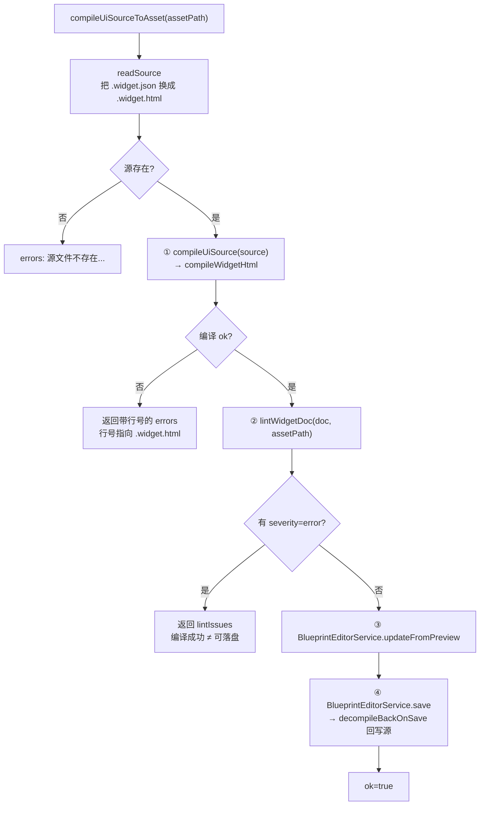
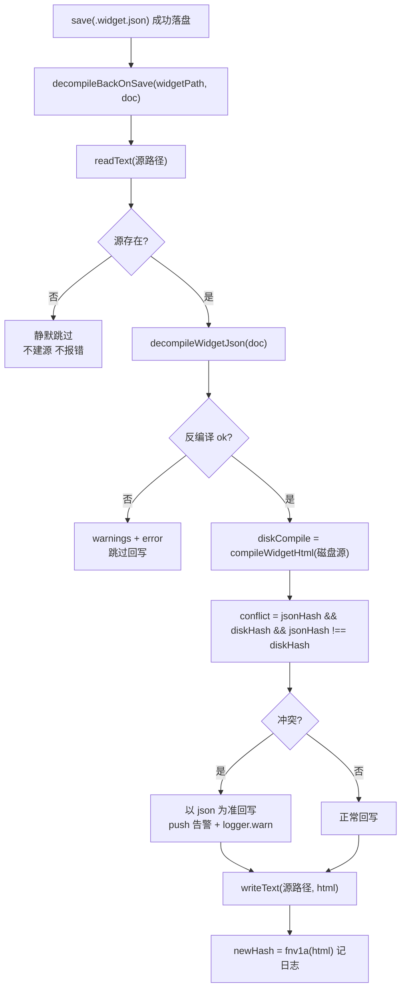

# UI 源格式（UI HTML Source Format）

> **一句话定位**：`.widget.html` 是 widget 资产的**编写层**——编译成 `.widget.json` 后引擎只认 json，保存 json 时又自动反编译回 html，形成双向同步的翻译层。
>
> **什么时候会用到你**：AI/人新建或修改一个 HUD/面板（写 `.widget.html` 再编译）、排查「编译报错行号对不上」「改了源没生效」「源被覆盖了」、映射规则新增组件（要同时动编译端与反编译端）。
>
> 代码位置：`src/editor/asset/uiCompiler/`（编译器）、`src/editor/asset/uiSourceSync.ts`（双向同步）、`src/editor/asset/uiSourceActions.ts`（编辑动作）、`scripts/ui-compiler-cli.mjs` + `scripts/ui-compiler-main.ts`（CLI）

---

## 1. 先记住这几个文件

| 文件 | 一句话职责 | 你要改它的场景 |
|---|---|---|
| [compile.ts](../../../src/editor/asset/uiCompiler/compile.ts) | HTML → widget.json 全管线（解析 → 级联 → 布局求解 → 发射） | 新增标签/属性映射、改 px↔米换算、加编译期校验 |
| [decompile.ts](../../../src/editor/asset/uiCompiler/decompile.ts) | widget.json → 规范形 HTML | 编译端加了映射，**这里必须对称补上**（否则 round-trip 丢信息） |
| [uiSourceSync.ts](../../../src/editor/asset/uiSourceSync.ts) | 保存 json 后反编译回写源 + sourceHash 冲突仲裁 | 改同步策略、改冲突判定 |
| [uiSourceActions.ts](../../../src/editor/asset/uiSourceActions.ts) | 编辑器侧「编译 UI 源」动作：编译 → lint 门槛 → 落盘 | 改落盘/预览同步行为 |

**关键心智模型**：运行时**完全不感知**源格式。引擎、预览、gameplay 只消费 `.widget.json`；`.widget.html` 只是给人/AI 读写的等价表示。所以源格式改坏了不会影响已发布的资产，但**改 json 一定会牵动源**（保存即回写）。

**第二个心智模型**：编译产物是**静态求解后**的具体矩形。CSS 的 flex/块级流在 `solveLayout` 阶段就被算成了确定的位置尺寸，json 里没有"flex 布局"这回事（只有 `UILayoutComponent` 作为运行时重排的可选补充）。反编译因此是"回读像素位置"，不是"还原 CSS 意图"——这是为什么反编译输出看起来啰嗦（每个节点都 `position:absolute` + `left/top`）。

---

## 2. 编译链路：从 `.widget.html` 到落盘的 `.widget.json`

### 2.1 四种入口，最终都汇到 `compileUiSourceToAsset`

| 入口 | 位置 | 说明 |
|---|---|---|
| MCP `ui_compile` | `EditorInitializer.ts:594` | **AI 首选**：内置 lint 门槛 + 自动保存，带 requestId 往返 |
| 控制台 `ui.compile <路径>` | `ConsoleCommands.ts:115` | 相对项目根，输出到控制台 |
| 资产面板右键「🔨 编译 UI 源」 | `AssetBrowser.tsx:451` | 有同名源才显示该项 |
| CLI `node scripts/ui-compiler-cli.mjs compile` | `scripts/ui-compiler-main.ts` | 手工/CI；**编辑器未运行时 lint 降级跳过** |

四个入口共用 [`compileUiSourceToAsset`](../../../src/editor/asset/uiSourceActions.ts)（`uiSourceActions.ts:40`），只有 CLI 走 `ui-compiler-main.ts` 自己的落盘逻辑。

### 2.2 `compileUiSourceToAsset` 内部做的四件事



**① 编译（错误行号面向源文件）**

```ts
const srcPath = assetPath.replace(/\.widget\.json$/i, '.widget.html')
const source = await readSource(srcPath)
if (source === null) {
  out.errors.push({ line: 0, message: `源文件不存在: ${srcPath}（无源资产请先创建 .widget.html）` })
  return out
}
const compiled = compileUiSource(source)
if (!compiled.ok || !compiled.doc) {
  out.errors.push(...compiled.errors)
  logger.warn(`[UiCompile] 编译失败: ${srcPath}: ${compiled.errors.map((e) => `行${e.line} ${e.message}`).join(' | ')}`)
  return out
}
```

注意入参是 `xxx.widget.json`，函数内部**自己换成 `.widget.html`** 去读——所以 MCP/控制台/右键菜单传的都是 json 路径，不是源路径。这个设计让调用方不需要知道源文件是否存在（不存在就报"源文件不存在"，引导去用「🛠️ 生成 HTML 源」）。

**② assetLint 零错误门槛——编译成功 ≠ 可落盘**

```ts
const lint = await lintWidgetDoc(compiled.doc, assetPath)
for (const i of lint.issues) {
  out.lintIssues.push({
    nodePath: i.nodePath, field: i.field, rule: (i as { ruleId?: string }).ruleId ?? (i as { rule?: string }).rule ?? '',
    severity: i.severity, message: i.message,
  })
}
if (!lint.ok) {
  logger.warn(`[UiCompile] 产物未过 assetLint（零错误门槛）: ${srcPath}: ${lint.issues.length} 个问题`)
  return out
}
```

这一步是**双门槛**：编译器只保证"HTML 能翻译成 json"，assetLint 才保证"json 是引擎认的合法资产"（id/name 唯一性、组件 schema、UI 设计级规则）。两者都可能产出违规，所以 `lintIssues` 单独一个字段返回，不混进 `errors`——错误行号在源里，lint 违规定位在 json 的 `nodePath` 里，混在一起就没法改了。

`lint.ok` 只看 `error` 档，warn 档照常落盘但透传给调用方（`lintAdapter.ts` 里 `ok: !issues.some((i) => i.severity === 'error')`）。

**③ ④ 落盘与预览同步**

```ts
await BlueprintEditorService.updateFromPreview(
  assetPath,
  compiled.doc as unknown as Parameters<typeof BlueprintEditorService.updateFromPreview>[1],
)
const saved = await BlueprintEditorService.save(assetPath)
if (!saved.ok) {
  out.errors.push({ line: 0, message: `落盘失败: ${saved.error}` })
  return out
}
```

`updateFromPreview` 把新 doc 灌进工作副本并重建预览，`save` 落盘。**关键连带效应**：`save` 内部对 `.widget.json` 结尾的路径会自动调 `decompileBackOnSave`（见 §3），所以「编译」这个动作最终也会回写一次源——两侧重新等效。

### 2.3 `compileWidgetHtml` 内部：六步管线

编译主流程在 `compile.ts:511`，全程包在一个 `try/catch` 里，所有失败统一转成带行号的 `errors`：

```ts
export function compileWidgetHtml(source: string, options: CompileOptions = {}): CompileResult {
  const errors: CompileError[] = []
  const warnings: CompileWarning[] = []
  nodeIdSeq = 0
  decorationCount = 0
  try {
    // 1. HTML 解析
    const { root: rawRoot } = tokenizeHtml(source)
    assertNoEventAttrs(rawRoot)
    const { root, headNodes, inlineStyles } = unwrapDocument(rawRoot)
```

**为什么 `tokenizeHtml` 是第一步且必须失败即中止**：HTML 解析是唯一无法带错继续的阶段——DOM 树都建不起来，后面级联/布局无从谈起。所以 `tokenizeHtml` 抛的 `ParseError` 直接进 catch，不做部分恢复。

**为什么在入口重置 `nodeIdSeq`**：见 §2.5 确定性输出，这个计数器是模块级变量，不重置的话同一源第二次编译 id 会从 13201 跳到 13250+，产物就不再逐字节一致了。

```ts
    // 3. 样式表：UA + 作者（style/link/@import）
    const bundle = collectStylesheets(headNodes, inlineStyles, options, warnings)
    const uaSheet = tokenizeStylesheet(UA_STYLESHEET, { origin: 0 })
    const allRules = [...uaSheet.rules, ...bundle.rules]
    // @media 静态评估
    for (const pending of bundle.medias) {
      if (evaluateMedia(pending.condition, canvasWidth, canvasHeight, pending.line, warnings)) {
        allRules.push(...pending.rules)
      }
    }

    // 4. 级联 + 继承
    const styleRoot = buildStyleTree(root, null, parseInlineStyle)
    validateTags(styleRoot)
    computeStyles(styleRoot, allRules)
    validateComputedStyles(styleRoot, warnings)

    // 5. 静态布局求解
    const solveCtx: SolveContext = {
      canvasWidth, canvasHeight,
      rootFontSize: resolveRootFontSize(styleRoot, canvasWidth, canvasHeight),
      warnings,
    }
    const rootBox = solveLayout(styleRoot, solveCtx)
```

UA 样式表（`css/ua.ts`）**排在最前面**（`origin: 0`，作者样式 `origin: 1`），这样 `<div>` 默认 `display:block`、`<h1>` 默认字号这类浏览器默认行为才不用在每个源里手写。

`@media` 是**静态评估**——拿 `<widget canvas="WxH">` 声明的尺寸去比 `min-width`/`max-width`，匹配就把规则并进 `allRules`，不匹配就整段丢弃。引擎没有真实视口概念，不存在"运行时重新评估媒体查询"。

第 5 步 `solveLayout`（`layout.ts:144`）是整个编译器最重的一块：把 CSS 盒模型、块级流、内联流、flex（含 wrap/grow）、grid、表格全部算成确定的矩形树。产出的 `Box` 树带着 `x/y/w/h` 和 `pl/pr/pt/pb`、`bl/br/bt/bb`（padding/border 四边），供发射器换算。

```ts
    // 6. 产物骨架
    const doc: Record<string, unknown> = {
      name,
      baseClass: 'Actor',
      sourceHash: fnv1a(source.replace(/^\uFEFF/, '')),
      components: [] as unknown[],
      children: [] as unknown[],
    }
```

`source.replace(/^\uFEFF/, '')` 剥掉 BOM 再算指纹——否则 Windows 编辑器存出来的文件与 Linux/ memory 里的字符串指纹不一致，会导致「源没改却被判冲突」。

### 2.4 发射：映射规则长什么样

以 `emitBox`（`compile.ts:683`）为例，看一个盒子如何变成 json 节点：

```ts
    const nodeName = this.nameOf(el, box, usedNames)
    const node: Record<string, unknown> = {
      name: nodeName,
      baseClass: 'Actor',
      id: nextNodeId(),
      components: [] as unknown[],
      children: [] as unknown[],
    }

    // visibility:hidden → 保留节点（占位）但不渲染
    if (el.computed.get('visibility') === 'hidden') node.active = false

    // ─── UITransform：边盒尺寸 + 定位 ───
    const bbW = box.w + box.pl + box.pr + box.bl + box.br
    const bbH = box.h + box.pt + box.pb + box.bt + box.bb
    const bbX = box.x - box.pl - box.bl
    const bbY = box.y - box.pt - box.bt
    const tfProps = this.buildTransform(box, bbX, bbY, bbW, bbH, parentBox, depth === 0)
```

**为什么尺寸用"边盒"（bb = border-box）而不是内容盒**：运行时 `UITransformComponent.worldWidth/Height` 语义是"这个 Actor 的视觉框"，背景图/边框要铺满它。用内容盒的话，带 padding 的面板背景会比重心框小一圈。发射器每个节点都会补一个 `CanvasUIComponent` 作 marker，承载 `zOrder`/`hitTest`：

```ts
    const markerProps: Record<string, unknown> = { markerOnly: true, name: 'UIMarker', zOrder: 0 }
    const zIndex = el.computed.get('z-index')
    const zOrderProp = el.computed.get('z-order')
    if (zOrderProp !== undefined) markerProps.zOrder = parseInt(zOrderProp, 10) || 0
    else if (zIndex !== undefined && zIndex !== 'auto') markerProps.zOrder = parseInt(zIndex, 10) || 0
    const pe = el.computed.get('pointer-events')
    const hitTest = el.computed.get('hit-test')
    if (pe === 'none') markerProps.hitTest = 'hitTestInvisible'
    else if (hitTest === 'visible' || hitTest === 'block' || hitTest === 'hitTestInvisible') markerProps.hitTest = hitTest
```

`z-order`（引擎专有 CSS 属性）**优先于** `z-index`，两者都写时 `z-index` 被忽略。反过来 `z-index` 是 CSS 标准属性，源里写它更自然，所以两者都支持。

映射不到的组件走 `data-comp` 逃逸通道（`compile.ts:1466`），这是**不丢信息**的保底机制：

```ts
  private emitDataComp(el: StyleElement, node: Record<string, unknown>): void {
    const compName = el.node.attrs['data-comp']
    if (!compName) return
    const baseClass = compName.endsWith('Component') ? compName : `${compName}Component`
    let props: Record<string, unknown> = {}
    const dataProps = el.node.attrs['data-props']
    if (dataProps) {
      try {
        props = JSON.parse(dataProps)
      } catch {
        throw new CompileFail(`data-props 不是合法 JSON: "${dataProps}"`, el.node.line)
      }
    }
    const comps = node.components as Array<{ baseClass: string; properties: Record<string, unknown> }>
    const existing = comps.find((c) => c.baseClass === baseClass)
    if (existing) {
      // 原生映射/已挂载的组件：data-props 并入（显式声明优先），不重复挂载
      existing.properties = { ...existing.properties, ...props }
      return
    }
    if (Emitter.NATIVE_MAPPED_COMPS.has(baseClass) && !dataProps) return
    comps.push({ baseClass, properties: props })
  }
```

三个反直觉点：

- `data-comp="UILayout"` 会补成 `UILayoutComponent` 再查；已存在的同 baseClass 组件是**合并而非替换**（`...existing.properties` 在前，`props` 在后，显式声明优先）。这样 `<div title="x" data-comp="UITooltip" data-props='{"delay":0.5}'>` 能精确覆盖默认 text，不丢 text。
- `NATIVE_MAPPED_COMPS` 里的组件（UIImage/UIButton/UITextInput/UIProgress/UIScrollList/UITooltip）**在没写 `data-props` 时直接 return**——因为原生标签/属性（`title=`、`overflow:auto`）已经发射过它们了，不写 props 就没必要重复处理。
- `data-props` 必须单引号包裹（`data-props='{...}'`），因为 JSON 里是双引号。

### 2.5 确定性输出：sourceHash + 确定性 id

```ts
/** FNV-1a 32 位 hash（sourceHash：源文件内容指纹） */
function fnv1a(str: string): string {
  let h = 0x811c9dc5
  for (let i = 0; i < str.length; i++) {
    h ^= str.charCodeAt(i)
    h = (h + (h << 1) + (h << 4) + (h << 7) + (h << 8) + (h << 24)) >>> 0
  }
  return `fnv1a-${h.toString(16).padStart(8, '0')}`
}

/** 确定性节点 id 生成器（同一源编译两次产物逐字节一致，TC-B8） */
let nodeIdSeq = 0
function nextNodeId(): number {
  nodeIdSeq += 1
  return 13200 + nodeIdSeq
}
```

（编译端在 `compile.ts:70` / `compile.ts:81`；同步端在 `uiSourceSync.ts:51` 有一份**逐字相同**的副本）

**为什么要确定性**：json 是入库的资产文件，会进 git。如果 id 用 `Date.now()` 或随机数，同一份源编译两次就产生无意义 diff，code review 和冲突合并都会被噪声淹没。FNV-1a 只需 32 位、零依赖、在 JS 里用 `>>> 0` 就能保证无符号溢出语义——不用 crypto 是因为 Node 与浏览器实现差异大且是异步的。

**为什么 id 从 13200 起步**：避开旧资产手工分配的低位 id 段，减少与存量 widget.json 撞 id 的概率。

**注意 `fnv1a` 有两份独立实现**：`compile.ts` 和 `uiSourceSync.ts` 各一份。这是有意为之——`uiSourceSync` 需要在**不触发完整编译**的情况下算新 hash（见 §3.2），而 `compile.ts` 的 `fnv1a` 没导出。改算法时两处都要改，改一处就会让「保存后 hash 与重编译 hash 不一致」，表现为每次保存都误报冲突。

---

## 3. 反编译链路与双向同步

### 3.1 反编译：json → 规范形 HTML

[`decompileWidgetJson`](../../../src/editor/asset/uiCompiler/decompile.ts)（`decompile.ts:74`）输出的是**规范形**：每个节点一个 class、全部绝对定位、声明顺序固定。

```ts
    if (!('sourceHash' in root)) {
      warnings.push('该 widget.json 无 sourceHash（非编译器产物或旧资产）：尽力转换，映射不到的组件走 data-comp 逃逸')
    }
```

对旧资产（手工写的、没有 `sourceHash` 的）**不报错只警告**——因为反编译的主要用途之一就是给旧资产生成源（`AssetBrowser` 的「🛠️ 生成 HTML 源」），报错就走不下去了。

反编译最反直觉的一段是**堆叠流还原门** `stackGate`（`decompile.ts:169`）：

```ts
    const tol = 0.11 // px（世界 2 位小数量化噪声上限）
    const kids = (node.children ?? []).filter((c) => c.active !== false)
    if (kids.length === 0) return null
    ...
      if (tf.anchor) return null // 锚点子项 = 显式定位，不入流
      const rot = tf.rotation as [number, number, number] | undefined
      if (rot && (rot[0] !== 0 || rot[1] !== 0 || rot[2] !== 0)) return null
```

它尝试把"看起来是竖排/横排的一堆绝对定位子项"还原成块级流/flex，让生成的源读起来像人写的。**为什么 tol 是 0.11px**：世界坐标在发射时按 `round2`（2 位小数）量化过，米→px 反解回来会带舍入噪声；阈值取 0.11 是"能容忍量化误差、又不会把真的错位当成对齐"。只要有一个子项带 anchor 或 rotation，就放弃还原——那些语义无法用纯流表达，硬还原会丢信息。

另一个对称性设计：`img` 是 void 元素不能带子节点，所以带子节点的 UIImage 反编译时**降级为 div + `background-image`**（`decompile.ts` 的 `emitNode`），编译端对"div 带背景声明"又能对称升回 UIImage。

### 3.2 保存即回写：`decompileBackOnSave`

钩子挂在 `BlueprintEditorService.save`（`BlueprintEditorService.ts:401`）：

```ts
    if (assetPath.endsWith('.widget.json')) {
      const sync = await decompileBackOnSave(assetPath, asset as unknown as Record<string, unknown>)
      if (sync.written) {
        logger.info(`[BlueprintEdit] UI 源已同步回写: ${assetPath.replace(/\.widget\.json$/i, '.widget.html')}${sync.conflict ? '（冲突仲裁：以 json 为准）' : ''}`)
      } else if (sync.error) {
        logger.warn(`[BlueprintEdit] UI 源回写失败（不影响保存）: ${sync.error}`)
      }
    }
```

回写失败**只告警不影响保存结果**——源文件是辅助产物，json 才是资产。这个取舍很关键：源写失败（比如文件被占用/只读）不应该让用户的保存操作失败。

### 3.3 冲突仲裁：双边同改以 json 为准



仲裁逻辑在 `uiSourceSync.ts:94`：

```ts
    // 冲突检测：磁盘源当前编译指纹 vs json 里的 sourceHash
    const jsonHash = (widgetDoc as Record<string, unknown>).sourceHash as string | undefined
    const diskCompile = compileWidgetHtml(existing)
    const diskHash = diskCompile.doc ? (diskCompile.doc.sourceHash as string) : undefined
    const conflict = Boolean(jsonHash && diskHash && jsonHash !== diskHash)
    if (conflict) {
      // 以最后保存方（json）为准：反编译覆盖源（方案 §11.3），并告警
      warnings.push('检测到源文件与 widget.json 同时被改（sourceHash 不一致）：以最后保存方（json）为准，源文件已被反编译结果覆盖')
      logger.warn(`[UiSourceSync] 双边同改冲突，以 json 为准回写源: ${srcPath}`)
    }
```

**判据是 sourceHash 而不是文件 mtime**：mtime 在 git checkout / 文件复制后不可靠，且分辨率不够。用 hash 能精确回答"磁盘上的源，编译出来是不是就是 json 里记的那一份"。

`conflict` 的三个变量缺一不可（`jsonHash && diskHash &&`）：`jsonHash` 为空说明是旧资产（没有源 hash 基线），`diskHash` 为空说明**磁盘源本身编译失败**（源写坏了）——这两种情况都不该判成"冲突"，否则会拿一份编译失败的反编译结果去覆盖用户正在修的源。

**注意回写后没有把 newHash 写回 json**：`newHash` 只进日志（`uiSourceSync.ts:104`）。json 里留的仍是编译时的 hash，直到下次编辑源再编译才会更新。这意味着保存后到下次编译前，json 的 `sourceHash` 与源内容是**暂时不一致**的——但由于回写用的就是 json 反编译的结果，此时二者语义等效，不会误判。

---

## 4. CLI：为什么不再是"两份独立实现"

这是本系统最容易被旧文档误导的地方。打开 `scripts/ui-compiler-cli.mjs`，它只有 45 行，**不含任何映射规则**：

```js
/**
 * 实现说明：本文件只是启动器——用 esbuild JS API 把 scripts/ui-compiler-main.ts
 * （直接 import src/editor/asset/uiCompiler 的 TS 实现）现场打包到临时文件后执行。
 * 单一事实来源，不再维护第二份手工镜像（旧版双实现易漂移，已废弃）。
 * 注意用 esbuild 的 JS API 而非 .cmd 二进制：Node ≥18.20 spawnSync 禁止 .cmd（CVE）。
 */
const requireFromRoot = createRequire(path.resolve(process.cwd(), 'package.json'))
const esbuild = requireFromRoot('esbuild')
const outDir = path.join(os.tmpdir(), 'demostudio-ui-compiler')
fs.mkdirSync(outDir, { recursive: true })
const outFile = path.join(outDir, 'ui-compiler-main.cjs')

esbuild.buildSync({
  entryPoints: [path.resolve(process.cwd(), 'scripts', 'ui-compiler-main.ts')],
  bundle: true,
  format: 'cjs',
  platform: 'node',
  outfile: outFile,
  logLevel: 'error',
  external: ['electron'],
})
```

**历史教训**：CLI 早期是一份自包含的纯 JS 镜像，映射规则手抄了一遍。结果两边漂移——TS 版加了新标签/新属性，CLI 版没有，导致「编辑器里编译通过、命令行编译报错」。现在改成 esbuild 现场打包 `ui-compiler-main.ts`（它 `import { compileWidgetHtml, decompileWidgetJson } from '../src/editor/asset/uiCompiler/index'`），**单一事实来源**。

**为什么用 esbuild 的 JS API 而不 spawn `esbuild.cmd`**：Node ≥18.20 起 `spawnSync` 禁止执行 `.cmd`（安全 CVE 修复），直接 spawn 会失败。

**注意 `external: ['electron']`**：打包时把 electron 排除，否则 Node 环境下解析 electron 模块会失败。

### 4.1 CLI 的 assetLint 门槛与退出码

`ui-compiler-main.ts` 编译成功后自动探测运行中的编辑器去跑 lint（`ui-compiler-main.ts:118`）：

```ts
async function runEditorAssetLint(outPath: string): Promise<number> {
  const port = await findEditorPort()
  if (port === null) {
    console.log('ℹ 未探测到运行中的编辑器实例（:9877+），跳过 assetLint 自动检查（由编辑器内 ui_compile/MCP 兜底）')
    return 0
  }
  ...
  const mine = issues.filter((i) => String(i.file ?? '').replaceAll('\\', '/') === assetRel)
  const mineErrors = mine.filter((i) => i.severity === 'error')
  ...
  if (mineErrors.length > 0) {
    console.error(`❌ assetLint 零错误门槛未过: ${assetRel}（error ${mineErrors.length} / warn ${mineWarns.length}）`)
    return 4
  }
  console.warn(`⚠ assetLint 本资产 ${mine.length} 个 warn（不阻断）: ${assetRel}`)
  return 0
}
```

三个设计点：

- **探测端口段 `:9877` ~ `:9886`**（`LINT_PORT_BASE=9877` / `LINT_PORT_SPAN=10`），`GET /api/status` 返回 `status==='running'` 才算命中，支持多实例。探测超时 800ms/端口，扫全段最坏 8 秒。
- **只过滤本资产的违规**（`mine`）——`run_asset_lint` 扫的是整个工程，别的资产的违规不该阻断本次编译。
- 用 `fetchJson` 带 `AbortController` 超时（lint 扫描最长 30s），任一步失败都**降级跳过**返回 0，不阻断。

还有一处 Windows 专属的坑，注释里写得很直白：

```ts
// 注意：用 exitCode + 自然退出，勿 process.exit()——Windows Node 下 fetch(undici)
// 句柄清理中强退会触发 libuv 断言崩溃（uv_handle_closing）。
runEditorAssetLint(outPath).then((code) => { process.exitCode = code })
```

退出码对照：`0` 成功（含 lint 降级跳过、仅 warn）、`1` 参数错误/未知命令、`3` 编译失败、`4` assetLint error 档阻断、`5` 反编译失败。

---

## 5. 关键方法速查

| 方法 | 位置 | 干什么 | 注意 |
|---|---|---|---|
| `compileWidgetHtml(source, options?)` | `compile.ts:511` | 编译主入口，返回 `{ok, errors, warnings, doc}` | 内部重置 `nodeIdSeq`；所有错误带源行号 |
| `decompileWidgetJson(doc)` | `decompile.ts:74` | 反编译为规范形 HTML | 无 `sourceHash` 只警告不失败 |
| `lintWidgetDoc(doc, filePath)` | `lintAdapter.ts:23` | 单文档 assetLint 桥接 | CLI 环境降级返回 `ok:true` |
| `validateWidgetDoc(doc, filePath)` | `lintBridge.ts:14` | 真实 lint 实现（walk + checker 派发） | `.widget.json` 额外跑 `doc:ui-design` |
| `compileUiSourceToAsset(assetPath)` | `uiSourceActions.ts:40` | 编辑器编译动作：编译→lint→落盘 | 入参传 **json** 路径，内部换源路径 |
| `decompileBackOnSave(widgetPath, doc)` | `uiSourceSync.ts:70` | 保存后反编译回写 + 冲突仲裁 | 失败只告警不影响保存 |
| `sourcePathOf(widgetPath)` | `uiSourceSync.ts:61` | `.widget.json` → `.widget.html` | 大小写不敏感 |
| `compileUiSource(source)` | `uiSourceSync.ts:114` | `compileWidgetHtml` 的薄封装 | 供编辑器编译按钮/MCP 共用 |
| `Emitter.emitBox(...)` | `compile.ts:683` | 盒子 → json 节点（映射主干） | 尺寸用边盒；补 marker 组件 |
| `Emitter.buildTransform(...)` | `compile.ts:1520` | 位置/尺寸/锚点反解 | absolute 走锚点，流内走本地偏移 |
| `Emitter.emitDataComp(el, node)` | `compile.ts:1466` | `data-comp`/`data-props` 逃逸 | 同 baseClass 合并，非替换 |
| `fnv1a(str)` | `compile.ts:70` / `uiSourceSync.ts:51` | sourceHash 指纹 | **两处独立实现，改要双边同步** |
| `nextNodeId()` | `compile.ts:81` | 确定性 id（13200+seq） | 依赖入口处 `nodeIdSeq = 0` |
| `solveLayout(rootEl, ctx)` | `layout.ts:144` | 静态布局求解 | 编译期算完，运行时无布局 |
| `collectStylesheets(...)` | `compile.ts:236` | UA + style/link/@import 收集 | 需 `options.resolveInclude` 才能读外部样式 |
| `runEditorAssetLint(outPath)` | `ui-compiler-main.ts:118` | CLI lint 门槛，返回 exit code | 编辑器未运行返回 0 |
| `findEditorPort()` | `ui-compiler-main.ts:100` | 探测 `:9877+` 编辑器实例 | 探测失败降级，不阻断 |

---

## 6. 流程影响：牵动哪些功能

### 上游：谁驱动它

| 上游 | 怎么驱动 | 相关文档 |
|---|---|---|
| MCP `ui_compile` | 传 `.widget.json` 路径 → `compileUiSourceToAsset`，带 requestId 往返 | [MCP 集成](../integration/mcp_integration.md) |
| 控制台命令 | `ui.compile` / `ui.decompile`（相对项目根） | [编辑器核心](../core/core_system.md) |
| 资产面板右键 | 「🔨 编译 UI 源」/「🛠️ 生成 HTML 源」，按有无源文件切换 | [UI 面板组件](./ui_components_system.md) |
| CLI | `compile` / `decompile` 子命令，esbuild 现场打包 TS 实现 | [MCP 集成](../integration/mcp_integration.md) |
| 编辑器保存 | `BlueprintEditorService.save` 对 `.widget.json` 调 `decompileBackOnSave` | [蓝图编辑](../blueprint/blueprint_edit_system.md) |

### 下游：它波及谁

| 下游功能 | 波及点 | 相关文档 |
|---|---|---|
| 资产检查 assetLint | 产物过零 error 门槛才落盘；CLI 侧 error 档 exit 4 | [资产预览与检查](../asset/asset_preview_lint_system.md) |
| 蓝图编辑 | `updateFromPreview` + `save` 复用其落盘与工作副本体系 | [蓝图编辑](../blueprint/blueprint_edit_system.md) |
| 锚点系统 | `position:absolute + left/top %` ↔ 九宫格 anchor + anchorOffset | [UI 锚点系统](./ui_anchor_system.md) |
| UI 增强 | `title`/`overflow`/`data-script` 等映射承载 tooltip、滚动列表、脚本 | [UI 增强系统](./ui_enhancement_system.md) |
| 引擎 UI 组件 | 产出 `UITransformComponent` / `CanvasUIComponent` / `UILayoutComponent` 等，语义由引擎侧定义 | [引擎 UI 系统](../../engine/ui_system.md) |
| UI 面板（预览/大纲） | 只消费 `.widget.json`，不感知源格式 | [UI 面板组件](./ui_components_system.md) |

---

## 7. 踩坑清单（都是真踩过的）

**1. CLI 与 TS 版曾是两份手工镜像，映射规则漂移**

现象：编辑器里编译通过的源，命令行编译报错（或反之）。原因：早期 `ui-compiler-cli.mjs` 是自包含纯 JS，映射规则手抄一遍，加新标签时只改了一边。规则：现在 CLI 是 esbuild 启动器（§4），**映射规则只改 `src/editor/asset/uiCompiler/` 一处**；不要往 `.mjs` 里加实现代码。

**2. Windows 下 `process.exit()` 会让 CLI 崩溃**

现象：lint 阶段结束后进程偶发 `uv_handle_closing` 断言崩溃。原因：`fetch`(undici) 的连接句柄还在清理中就被强退。规则：lint 分支只设 `process.exitCode`，让进程自然退出（`ui-compiler-main.ts:51`）。

**3. Node ≥18.20 起 `spawnSync` 禁止执行 `.cmd`**

现象：想用 CLI spawn 打包会直接失败。原因：安全 CVE 修复。规则：用 esbuild 的 **JS API**（`requireFromRoot('esbuild').buildSync`），不要调 `esbuild.cmd`。

**4. `fnv1a` 在 `compile.ts` 与 `uiSourceSync.ts` 各有一份**

现象：只改一处的算法 → 保存后 `sourceHash` 与重编译 hash 不一致 → 每次保存都误报冲突。原因：`uiSourceSync` 需要在不跑完整编译的情况下算新 hash，而 `compile.ts` 的 `fnv1a` 未导出。规则：改哈希算法时**两处一起改**（`compile.ts:70` 与 `uiSourceSync.ts:51`）。

**5. px↔米没有全局常数，按根画布比例换算**

现象：照抄别的 widget 的 px 值，尺寸差一倍。原因：toast 是 960px 画布对 4.8m（200px/m），全屏 1920px 对 4.8m（400px/m）。规则：一律走 `pxToWorldX/Y`（`widgetMapping.ts:84`/`:89`），禁止硬编码 px/m。

**6. 冲突判据不能只看 hash 不等**

现象：源写坏了（编译失败）时保存，源被反编译结果覆盖，用户正在修的内容丢失。原因：`diskCompile.doc` 为 undefined 时 `diskHash` 为空，若不做空值判断就会判成"hash 不等 = 冲突"。规则：`conflict = Boolean(jsonHash && diskHash && jsonHash !== diskHash)`，任一为空不算冲突。

**7. 回写后不要把 newHash 写回 json**

现象：手贱把 `newHash` 写回 json 会导致下次编译的基线错乱。规则：`newHash` 只进日志（`uiSourceSync.ts:104`），json 的 `sourceHash` 只在下次编译源时更新。

**8. `@keyframes` / `@font-face` / `@supports` 是硬报错，不是忽略**

现象：源里为了好看加了动画，编译直接失败并指向 `@keyframes` 那一行。原因：这些规则被 `tokenize.ts` 切到 `unsupportedAtRules`，`collectStylesheets` 遍历即抛 `CompileFail`。规则：动效走 `UIScript` + TweenSystem，别写进源样式。

**9. 非 button 元素写 `:hover` 只警告不生效**

现象：`<div class="X">` 加了 `.X:hover { color: red }`，编译成功但 hover 无效果。原因：引擎只有按钮有 hover/pressed 状态机。规则：需要 hover 语义就用 `<button>`，或走 `data-args` 挂脚本自己处理。

**10. 内嵌 `<script>` 直接报错**

现象：想在 widget 里写段 JS。原因：`stripStyleScript` 遇到非空 `<script>` 抛 `CompileFail`。规则：行为一律用 `data-script="脚本路径"`（`compile.ts:1443` 的 `emitDataScript`）。

---

## 8. 边界条件

| 条件 | 行为 | 怎么应对 |
|---|---|---|
| 源文件不存在（旧资产） | `compileUiSourceToAsset` 报「源文件不存在」 | 用右键「🛠️ 生成 HTML 源」反编译生成 |
| 保存 json 时无同名源 | `decompileBackOnSave` 静默跳过，不建源 | 需要源时手动 `ui.decompile` 或右键生成 |
| 保存后回写源失败 | 只 `logger.warn`，保存仍然成功 | 查日志确认文件是否被占用/只读 |
| 源与 json 双边同改 | 以 json 为准覆盖源 + 告警 | 看告警确认被覆盖了什么 |
| 磁盘源本身编译失败 | `diskHash` 为空 → 不判冲突，但**仍会回写覆盖源** | 先修好源再保存 json |
| json 无 `sourceHash`（旧资产） | 反编译只加 warning，尽力转换 | 映射不到的走 `data-comp` 逃逸 |
| 编译成功但 assetLint 有 error | 拒绝落盘，返回 `lintIssues` | 按 `nodePath`/`rule` 修源重编译 |
| assetLint 只有 warn | 正常落盘，warn 透传 | 可忽略 |
| CLI 编译失败 | exit 3，逐行打印 `行 N: 消息` | 按行号修源 |
| CLI lint 检出 error | exit 4，打印 `[rule] nodePath > field` | 修源重编译 |
| CLI 时编辑器未运行 | 打印 ℹ 跳过 lint，exit 0 | 产物未经 lint，AI 一律走 MCP `ui_compile` |
| CLI 端口探测全失败/超时 | 降级返回 0，不阻断 | 同上 |
| `@keyframes`/`@font-face`/`@supports` | 硬报错（带行号） | 删除；动效用 UIScript + TweenSystem |
| `@media` | **支持**（按 canvas 尺寸静态评估） | 只支持 `min/max-width/height` |
| CSS 变量 `--x` / `var()` | **支持**（作用域继承 + 递归替换） | 见 `cascade.ts:284` |
| `<link rel=stylesheet>` / `@import` | 需 `options.resolveInclude`，否则报错 | CLI 传了 fs 实现；编辑器内默认支持 |
| 标签不在映射面 | 硬报错并给替代建议（如 `select` → UIScrollList） | 见 `UNSUPPORTED_TAGS`（`compile.ts:107`） |
| 内嵌 `<script>` | 硬报错 | 用 `data-script="路径"` |
| 非 button 的 `:hover`/`:active`/`:disabled` | 编译警告，声明不生效 | 改用 `<button>` 或脚本 |
| `data-props` 非法 JSON | `CompileFail` 带行号 | 属性值用单引号包裹 |
| 节点重名（手工资产） | 反编译改写为 `Name_2` 并警告 | 编辑器保存前先在 json 里改名 |
| 空容器带 `UILayoutComponent` | 反编译走 `data-comp` 逃逸保留参数 | 保证往返不丢布局组件 |
| `<textarea>` | 合法，等价 `<input>` | 引擎无多行输入，round-trip 统一还原为 input |
| `overflow: hidden/visible/clip` | 不映射滚动列表 | 仅 `auto`/`scroll` 映射 `UIScrollListComponent` |
| `z-order` 与 `z-index` 同写 | `z-order` 优先，`z-index` 被忽略 | 二者择一 |
