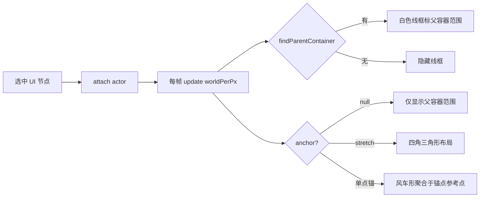

# UI 锚点系统（UI Anchor）

> UI 控件九宫格锚点定位（Unity RectTransform / Anchor Preset 风格）：引擎侧布局算法 + 编辑器侧可视化编辑。
> 代码位置：`src/engine/ui/UITransformComponent.ts` `src/editor/AnchorGizmo.ts` `src/editor/SelectionBoundsGizmo.ts` `src/editor/asset/RuntimeUIEditor.ts` `src/editor/asset/UIPreviewManager.ts`
> 相关文档：[系统总览](../system_overview.md) / [世界 UI 系统](../engine/ui_system.md) / [选择与变换](./selection_transform_system.md)

## 1. 概述

锚点（Anchor）决定 UI 元素中心在**父容器九宫格**上的对齐位置，是 UI 布局自适应的基础：

- **父容器变化 → 子元素位置/尺寸自动跟随**（如视口比例切换 16:9 → 4:3，背景/面板自动铺满）
- 锚点语义对标 Unity Anchor Preset：**元素边缘贴合容器内边（不溢出）**，`anchorOffset` 微调
- 锚点是**数据驱动**的：写进 widget/blueprint 资产的 `UITransformComponent.properties.anchor`，运行时 `applyAnchor()` 计算 position

整体架构：

```
资产（widget.json / blueprint.json）
  └─ UITransformComponent.properties.{ anchor, anchorOffset, worldWidth, worldHeight }
       ├─ 引擎：applyAnchor() 按父容器尺寸计算 position（运行时布局）
       ├─ 编辑器：AnchorGizmo 可视化（父容器范围 + 锚点图标）
       ├─ 编辑器：拖动/把手 resize 回写 anchorOffset（保持持久化一致）
       └─ 检查器：assetLint 校验枚举合法性 + Inspector 枚举下拉编辑
```

## 2. 数据模型

### 2.1 AnchorPreset（九宫格锚点预设）

```ts
export type AnchorPreset =
  | 'top-left' | 'top-center' | 'top-right'
  | 'middle-left' | 'middle-center' | 'center' | 'middle-right'
  | 'bottom-left' | 'bottom-center' | 'bottom-right'
  | 'stretch'
```

| 类别 | 取值 | 语义 |
|---|---|---|
| 单点锚（9 个） | `top-left` / `top-center` / `top-right` / `middle-left` / `middle-center` / `center` / `middle-right` / `bottom-left` / `bottom-center` / `bottom-right` | 元素中心对齐到父容器九宫格的对应参考点，元素边缘不溢出容器 |
| 全锚 | `stretch` | 元素填满父容器：自身尺寸跟随容器，位置恒为父中心 |
| 无锚点 | `null` | 不自动定位，沿用 `position`（普通 3D 变换语义） |

锚点 → 方向因子表（x: -1 左 / 0 中 / +1 右，y: -1 下 / 0 中 / +1 上）：

```ts
const ANCHOR_FACTORS: Record<AnchorPreset, [number, number]> = {
  'top-left': [-1, 1], 'top-center': [0, 1], 'top-right': [1, 1],
  'middle-left': [-1, 0], 'middle-center': [0, 0], 'center': [0, 0], 'middle-right': [1, 0],
  'bottom-left': [-1, -1], 'bottom-center': [0, -1], 'bottom-right': [1, -1],
  'stretch': [0, 0], // 占位：走 applyAnchor 专用分支
}
```

### 2.2 资产字段（widget.json）

```json
{
  "baseClass": "UITransformComponent",
  "properties": {
    "position": [0, 0, 0],
    "rotation": [0, 0, 0],
    "scale": [1, 1, 1],
    "worldWidth": 9.6,
    "worldHeight": 5.4,
    "anchor": "top-center",
    "anchorOffset": [0, 0]
  }
}
```

| 字段 | 类型 | 说明 |
|---|---|---|
| `anchor` | `AnchorPreset \| null` | 九宫格锚点；`null` = 无锚点（沿用 position），`stretch` = 全锚 |
| `anchorOffset` | `[number, number]` | 相对锚点基准的世界偏移 [x, y]，默认 `[0, 0]` |
| `worldWidth` / `worldHeight` | `number` | 元素世界尺寸（由 UITransformComponent 统一承载，渲染组件面板 scale 由此驱动） |

## 3. 引擎实现（UITransformComponent）

### 3.0 使用方法

| 方法 | 签名 | 说明 |
|---|---|---|
| 布局计算 | `applyAnchor(): void` | 无锚点/找不到父容器 → 跳过；stretch → 尺寸=容器 + position(0,0,z)；单点锚 → 公式计算 |
| 容器查找 | `findContainerSize(): [number, number] \| null` | 向上找父容器：显式 uitransform 尺寸优先 → 兜底真实画布 |
| 位置同步 | `syncAnchorOffset(x, y): boolean` | position ↔ 锚点状态互同步；返回 false（无锚点/stretch/无容器）时调用方应直接 `setPosition` |
| 自动补挂 | `ensureTransformForActor(actor)` | UI Actor 自动挂 UITransformComponent（旧 TransformComponent 自动替换） |

```ts
// 引擎/编辑器通用：改 offset 后必须重算布局
comp.anchorOffset = [0.5, -0.2]   // setter 内部触发 applyAnchor 即时重算
```

**触发时机**：

- `BeginPlay()`：UI 树构建完成（所有 attachTo 就绪）后应用一次——构造期树未建好，`findContainerSize` 会找不到父容器，属预期噪音
- `anchor` / `anchorOffset` setter：属性变更即时重算（Inspector 修改、编辑器拖动均走此路径）
- 父容器尺寸变化（视口比例切换）：容器组件自身重算尺寸后子元素重新 applyAnchor 时自动跟随

### 3.1 布局算法 applyAnchor()

**单点锚**：元素边缘贴合容器内边，中心 = 父中心 + 方向因子 ×（父半尺寸 − 自身半尺寸），再叠加 offset：

$$x = f_x \cdot \left(\frac{c_w}{2} - \frac{s_w}{2}\right) + o_x \qquad y = f_y \cdot \left(\frac{c_h}{2} - \frac{s_h}{2}\right) + o_y$$

- $f_x, f_y$：方向因子（ANCHOR_FACTORS）
- $c_w, c_h$：父容器尺寸（findContainerSize）
- $s_w, s_h$：自身尺寸（worldWidth/worldHeight）
- $o_x, o_y$：anchorOffset

**stretch（全锚）**：自身尺寸直接 = 容器尺寸，位置 = 父中心（相对父为 `(0, 0)`）——父容器尺寸变化后再次 applyAnchor 即自动跟随，适合背景/面板铺满。

```ts
applyAnchor(): void {
  if (!this._anchor) return                       // 无锚点：跳过，沿用 position
  const container = this.findContainerSize()      // 找不到父画布：跳过
  if (this._anchor === 'stretch') {
    this.setWorldSize(cw, ch)                     // 全锚：尺寸跟随容器
    this.owner.setPosition(0, 0, z)
    return
  }
  // 单点锚：中心 = 父中心 + 方向因子 × (父半尺寸 − 自身半尺寸) + offset
  this.owner.setPosition(fx * (cw/2 - sw/2) + ox, fy * (ch/2 - sh/2) + oy, z)
}
```

**触发时机**：
- `BeginPlay()`：UI 树构建完成（所有 attachTo 就绪）后应用一次——构造期树未建好，`findContainerSize` 会找不到父容器，属预期噪音
- `anchor` / `anchorOffset` setter：属性变更即时重算（Inspector 修改、编辑器拖动均走此路径）
- 父容器尺寸变化（视口比例切换）：容器组件自身重算尺寸后子元素重新 applyAnchor 时自动跟随

### 3.2 容器查找 findContainerSize()

向上查找最近的父容器尺寸，优先级从高到低：

1. **父 Actor 的 UITransformComponent 且 worldSizeExplicit**（显式设置了 worldWidth/worldHeight）——markerOnly 容器（如 TopBar/BottomBar）也有明确世界尺寸，它就是子元素的布局容器；若跳过它直接找根画布，子元素锚点会相对根画布**再次叠加父容器的锚点偏移 → 双重叠加掉出画布**
2. **兜底**：父 Actor 上的真实画布（非 markerOnly CanvasUIComponent）

```ts
private findContainerSize(): [number, number] | null {
  let p = this.owner.parent
  while (p) {
    const tf = p.getComponent(UITransformComponent)
    if (tf && tf.worldSizeExplicit) return tf.getWorldSize()   // 1. 显式 uitransform 尺寸
    const comp = p.getComponents(CanvasUIComponent).find((c) => !c.isMarkerOnly)
    if (comp) return comp.getWorldSize()                        // 2. 兜底真实画布
    p = p.parent
  }
  return null
}
```

### 3.3 syncAnchorOffset()（position 与锚点状态互同步）

锚点模式下 `position = 锚点基准 + offset`（applyAnchor 逆推公式）。若编辑器直接改 position 而不同步 offset，下次 applyAnchor（节点拖动/布局刷新）会用**旧 offset** 重算 position → 控件瞬移。因此：

```ts
syncAnchorOffset(x, y): boolean {
  // offset = 目标位置 − 锚点基准
  const ox = x - fx * (cw/2 - sw/2)
  const oy = y - fy * (ch/2 - sh/2)
  this._anchorOffset = [ox, oy]
  this.owner.setPosition(x, y, z)
}
```

返回 `false` 的场景（无锚点 / stretch / 找不到父容器）调用方应直接 `setPosition`。

### 3.4 与 UILayoutComponent 联动

布局组件（horizontal / vertical / grid）的定位语义基于锚点：**子项配置 `anchor=center` + `anchorOffset`，布局即写入 anchorOffset（相对父容器中心的偏移）并 applyAnchor 生效**；子项未配置锚点时退回直接 setPosition。因此子项的世界尺寸（worldWidth/worldHeight）决定格子步长 = 子项尺寸 + spacing。

### 3.5 UI Actor 自动补挂

`ensureTransformForActor(actor)`：有 CanvasUIComponent 的 Actor 挂 `UITransformComponent`（含锚点能力），普通 3D Actor 挂 `TransformComponent`。旧数据只有普通 TransformComponent 时自动替换，保证每个 UI Actor 都有锚点能力。

## 4. 编辑器实现

### 4.1 AnchorGizmo（可视化锚点）

选中 UI 节点时（`SelectionManager` 单例访问）在 overlayScene 渲染两层辅助：

**父容器范围**：白色半透明线框（opacity 0.5），标出锚点参考的父容器边界。容器查找与引擎 `findContainerSize` 语义完全一致（显式 uitransform 尺寸优先 → 兜底真实画布）。

**锚点图标**：4 个空心小三角形（环形边框 ShapeGeometry），屏幕恒定尺寸（13px）：

| 锚点类型 | 图标形态 | 位置语义 |
|---|---|---|
| 单点锚 | 风车形：4 个三角形尖角聚合于锚点 | **锚点 = 父容器上的参考点**（top-left → 父左上角，center → 父中心），与元素自身尺寸、anchorOffset 无关（Unity Anchor 语义） |
| stretch | 4 个三角形分布在矩形四角，尖角指向矩形内部 | 对角线方向布局，尖端精确对齐元素四角 |



注意点：
- gizmo 挂在 overlayScene 根下（无父变换），position 是世界语义 → 必须用 `getWorldPosition` 而非 `root.position`（局部），否则子节点选中时画错位
- 跟随全局 gizmos 开关（`gizmos.onEnabledChanged` 委托驱动显隐）
- `renderOrder = 997`，始终渲染在 UI 之上；worldPerPx 非有限值（隐藏视口）时防御跳过

### 4.2 拖动与把手 resize（回写 anchorOffset）

游戏运行时（`RuntimeUIEditor`）与资产预览（`UIPreviewManager`）共用同一交互语义：

**节点拖动**：
- 锚点节点（`anchor` 非空且非 stretch）→ 拖动增量写 **anchorOffset**（`applyAnchor` 重建会覆盖 position，offset 才是持久偏移）
- stretch 例外：offset 不参与定位（applyAnchor 恒填满容器 + position(0,0)），用 position 直接驱动
- 普通节点（无锚点）→ 直接改 position

**把手 resize**（SelectionBoundsGizmo 8 个把手：4 角 + 4 边）：
1. `setWorldSize(newW, newH)` 更新尺寸（同步所有 CanvasUIComponent 面板 scale）
2. 锚点节点：中心位移增量写 anchorOffset + `applyAnchor()`（否则重建覆盖 position）
3. 普通节点：直接 `setPosition` 新中心

**拾取**：raycast 命中 mesh → 找所属 UI Actor；8 个把手指用独立不可见命中 mesh（opacity=0 圆盘）提升命中手感，可见把手由 SelectionBoundsGizmo 渲染。

### 4.3 UIPreviewManager 的持久化闭环

widget 资产预览持有 JSON 可变深拷贝（`_jsonTree`）+ Actor → JSON 节点映射（`_actorJsonMap`），拖动/编辑直接改 JSON，`collectSaveData()` 据此生成保存数据——保证 anchor/anchorOffset 落盘与运行时状态一致。

### 4.4 Inspector 编辑

`UITransformComponent.getEditableProperties()` 暴露（Inspector 按 `type` 渲染）：

| 属性 | 类型 | Inspector 控件 |
|---|---|---|
| `anchor` | enum（11 项 + 「（无）」占位） | 下拉框（即时提交） |
| `anchorOffset` | vec2 | 数值输入 |
| `worldWidth` / `worldHeight` | number | 数值输入 |

`getPersistentProps()` 持久化原始值：`anchor` 输出 `null`（「（无）」仅是 Inspector 显示占位，不落盘）；`position/rotation/scale` 由 collectSaveData 回写。

## 5. 边界条件

| 条件 | 行为/后果 | 处理方式 |
|---|---|---|
| `anchor: null`（无锚点） | `applyAnchor` 跳过，沿用 position | 普通 3D 变换语义 |
| `findContainerSize` 找不到父画布 | 跳过布局（BeginPlay 构造期属预期噪音） | 引擎内置防御 |
| stretch 元素 | offset 不参与定位（恒填满容器 + position(0,0)） | 拖动用 position 直接驱动 |
| 锚点节点改 position | 下次 applyAnchor 用旧 offset 重算 → **控件瞬移** | 必须走 `syncAnchorOffset`（或 Inspector 改 anchorOffset） |
| Inspector 输入框改锚点节点 position | 被 `applyAnchor()` 覆盖（编辑无效） | **已知遗留**（见 property_edit §8） |
| 直接改 position 不同步 offset | 节点拖动/布局刷新时瞬移 | 编辑器拖动统一走 syncAnchorOffset |
| 隐藏视口（clientHeight=0） | `worldPerPx` 非有限值 → gizmo 防御跳过 | 引擎内置 |
| 无 UITransformComponent 的 UI 节点 | gizmo 隐藏所有图标/退化几何包围盒 | 引擎内置（ensureTransformForActor 兜底补挂） |
| gizmo 挂 overlay 根下 | position 是世界语义，读 `root.position`（局部）在子节点嵌套时画错位 | **必须 `getWorldPosition`** |
| `worldWidth/worldHeight <= 0` | 范围框退化用几何包围盒 | 引擎内置 |

## 6. 资产检查（assetLint）

`comp:UITransformComponent` 检查器（`src/editor/asset/assetLint/checkers/componentChecker.ts`）：

- `worldWidth` / `worldHeight`：number，> 0
- `anchor`：枚举校验（11 个合法值，`null` 允许）
- `anchorOffset`：vec2

## 7. 相关文件

| 文件 | 职责 |
|---|---|
| `src/engine/ui/UITransformComponent.ts` | 锚点数据模型 + 布局算法（applyAnchor / findContainerSize / syncAnchorOffset）+ Inspector 属性 |
| `src/editor/AnchorGizmo.ts` | 锚点可视化：父容器线框 + 锚点图标（风车形 / 四角形） |
| `src/editor/SelectionBoundsGizmo.ts` | 范围框 + 8 把手 + 尺寸标签（resize 入口） |
| `src/editor/asset/RuntimeUIEditor.ts` | 游戏运行时 UI 编辑：拾取 / 拖动 / 把手 resize |
| `src/editor/asset/UIPreviewManager.ts` | widget 资产预览：同交互 + JSON 持久化闭环 |
| `src/engine/ui/UILayoutComponent.ts` | 布局组件：基于 anchor=center + anchorOffset 的自动排列 |
| `src/editor/asset/assetLint/checkers/componentChecker.ts` | 资产锚点字段校验 |
