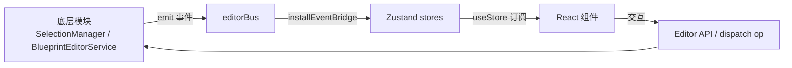

# React 面板组件系统（Editor UI Components）

> 编辑器前端面板：React 组件层 + Zustand 状态管理。
> 代码位置：`src/components/` `src/stores/`
> 相关文档：[系统总览](../system_overview.md) / [编辑器核心](./core_system.md)

## 1. 概述

编辑器 UI 采用 **React + Zustand** 架构：

- **组件层**（`src/components/`）：纯展示/交互面板，通过 store 订阅状态
- **状态层**（`src/stores/`）：Zustand 全局状态，是 UI 与底层模块（Editor/SelectionManager/BlueprintEditorService）之间的桥梁
- **桥接模式**：底层模块 emit 事件 → `installEventBridge` 翻译 → store 状态更新 → React 重渲染

## 2. 面板组件（components/）

### 视口类

| 组件 | 功能 |
|---|---|
| `Viewport` | 编辑视口面板（Scene/Game 页签宿主） |
| `UISceneView` | UI 场景视图 |
| `ScenePreviewEditor` | 场景预览编辑器 |
| `AxisIndicator` | 坐标轴指示器 |

### 编辑类

| 组件 | 功能 |
|---|---|
| `Inspector` | 属性检查器（读取选中对象/组件/蓝图节点信息，按 `EditableProperty` 动态渲染，修改走 BlueprintEditorService） |
| `Outline` | 场景大纲树（选中 → SelectionManager.select）；**预览资产时（bp: 蓝图/widget、sp: 场景预览）右键节点弹 `OutlineContextMenu`**：创建预定义节点/控件（`nodeTemplates.ts`，按预览类型显示 3D/UI 模板组，追加到目标节点子对象最后）、复制、重命名、删除——bp:/widget 走 BlueprintEditorService（addChildToParent/removeChildDeep/renameChildDeep），sp: 走 ScenePreviewManager（addSceneObject/removeSceneObject/duplicateSceneObject/renameSceneObject），均支持撤销/重做 |
| `UiOutline` | UI 大纲树（UI 节点层级） |
| `OutlineContextMenu` | 预览大纲右键浮层菜单（创建/复制/重命名/删除；点击外部或 Esc 关闭，重命名内嵌输入框） |
| `BlueprintEditor` | 蓝图编辑器面板（组件/子 Actor 列表 + 属性编辑） |
| `AssetBrowser` | 资产浏览器（场景/蓝图/widget/配置浏览与预览入口） |

### 工程与全局

| 组件 | 功能 |
|---|---|
| `ProjectSelector` | 全屏项目选择器（启动时选取工程） |
| `ProjectPanel` | 项目管理面板 |
| `NewProjectDialog` | 新建项目对话框 |
| `Console` | 控制台面板（日志展示 + 命令输入） |
| `StatusBar` | 状态栏（FPS / 当前项目 / 运行状态） |
| `MenuBar` | 菜单栏 |
| `KeyboardShortcuts` | 快捷键面板 |
| `LoadingScreen` | 加载界面 |
| `ResizeHandle` | 面板拖拽调整（分栏） |

## 3. 状态管理（stores/）

| Store | 职责 |
|---|---|
| `editorStore` | 编辑器全局状态：当前项目（`Project`：name/description/version/tags/folder/renderMode/defaultScene）、选择 nonce、蓝图 dirty/clean 标记、视口页签（`ViewportTabDef`：scene/game/uiScene/blueprint/scenePreview）、蓝图选择（`BlueprintSelection`：component/child/defaults） |
| `projectStore` | 项目发现/切换（`discoverProjects` 扫描 src/projects） |
| `saveStore` | 保存状态（`saveGame(slot)`） |
| `editorPrefsStore` | 编辑器偏好（Console 显隐等） |

### 关键类型

```ts
interface Project {
  name: string
  description: string
  version: string
  tags: string[]
  folder: string
  renderMode?: '2d' | '3d'        // 正交 2D / 透视 3D（默认）
  defaultScene?: string           // 点击项目时加载的默认场景
}

type ViewportTabDef = {
  id: string
  type: 'scene' | 'game' | 'uiScene' | 'blueprint' | 'scenePreview'
  label: string
  permanent: boolean              // 持久标签 vs 动态标签（蓝图/场景预览）
  assetPath?: string
}
```

## 4. 使用方法

### 4.1 Store 关键 action

| Action | 说明 |
|---|---|
| `openBlueprintEditor(assetPath, label)` | 已存在 tab → 只切 activeTabId；新建 tab + 自动 `leftPanelTab:'outline'` |
| `openScenePreview` / `closeDynamicTab(tabId)` | 打开场景预览 / 关闭动态 tab（激活 tab 关闭时回退相邻 tab 或 'scene'） |
| `setCurrentProject(project)` | 注册/清理项目资产 + 清空 dynamicTabs + activeTabId 回 'scene' |
| `bumpBlueprintEdit(assetPath)` | nonce+1 + lastEditedBlueprintPath（驱动重读盘/重建） |
| `markBlueprintDirty/Clean(path)` | 页签标题 `*` 星标 |
| `addConsoleOutput(text)` | **截断保留最近 200 条**（slice(-199) + 新条） |
| `launchGame/stopGame` | 按项目名注入操作提示 |
| `discoverProjects()` | 优先 `electronAPI.discoverProjectsScan()`；**失败/空回退 `DEFAULT_PROJECTS`**（5 个预设），catch 静默 |
| `saveGame(slot): Promise<boolean>` | 未选游戏/游戏未运行返回 false + 控制台提示 |
| `loadGame(slot)` | 游戏运行中直接 restoreSnapshot；未运行则暂存 `pendingRestore` + 自动 `launchGame()` |

### 4.2 使用示例

```ts
// 组件订阅 store（Inspector 依赖重读）
useEditorStore((s) => s.blueprintEditNonce)
useEditorStore((s) => s.blueprintSelection)
useEditorStore((s) => s.activeTabId)

// 蓝图页签判定：activeTabId.startsWith('bp:')，assetPath = activeTabId.slice(3)
```

### 4.3 触发时机与使用前提

- `editorPrefsStore` 全部字段持久化 localStorage（key `'demostudio-editor-prefs'`）：panels 可见性、layout 宽高、viewport `{ aspectRatio, gizmos }`、lastProjectFolder、recentProjects（去重置顶，上限 10）
- `setViewport` 被 `BlueprintEditor.tsx` 订阅（视口比例变化 → `UIPreviewManager.setViewportAspect`）

## 5. 工作流程

### 5.1 数据流



### 5.2 页签生命周期

```
打开蓝图: openBlueprintEditor → tab 创建（bp:${assetPath}）→ BlueprintEditor 读盘 + 建预览
编辑: applyBatch → bumpBlueprintEdit → nonce 变化 → 重读盘 + 重建预览（恢复相机/选中）
保存: updateFromPreview → save → BLUEPRINT_SAVED → markBlueprintClean
关闭: closeAsset（清缓存恢复注册表）→ closeDynamicTab
切工程: setCurrentProject → clearCache（BlueprintEditorService.clearCache + BlueprintRegistry.clearAll）
```

## 6. 边界条件

| 条件 | 行为/后果 | 处理方式 |
|---|---|---|
| `discoverProjects` IPC 失败 | 静默回退 `DEFAULT_PROJECTS`（catch 无日志） | 引擎内置降级 |
| `saveGame` 未选游戏/未运行 | 返回 false + 控制台提示 | 调用方判返回值 |
| 蓝图 tab 已存在 | 不重复创建，只切 activeTabId | 引擎内置去重 |
| 关闭激活 tab | 回退相邻 tab 或 'scene' + 清 blueprintSelection | 引擎内置 |
| 切项目 | 清空 dynamicTabs + 蓝图缓存 | 引擎内置 |
| `addConsoleOutput` 超 200 条 | 截断保留最近 200 条 | 引擎内置 |
| recentProjects 超 10 | 去重置顶，只保留 10 | 引擎内置 |

## 7. 依赖关系

```
组件层 → stores（editorStore/projectStore/editorPrefsStore/saveStore）
Inspector / BlueprintEditor → BlueprintEditorService.dispatch（编辑蓝图）
Outline / UiOutline → SelectionManager.select / getSceneTree
Viewport → SceneViewport / GameViewport / UIPreviewManager
App.tsx → Editor（逻辑中枢）/ EditorInitializer
```
