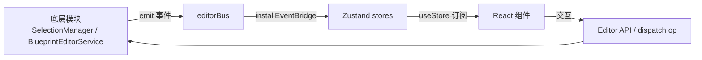

# React 面板组件系统（Editor UI Components）

> 编辑器前端面板：React 组件层 + Zustand 状态管理。
> 代码位置：`src/components/` `src/stores/`
> 相关文档：[系统总览](../system_overview.md) / [编辑器核心](./core_system.md)

## 1. 概述

编辑器 UI 采用 **React + Zustand** 架构：

- **组件层**（`src/components/`）：纯展示/交互面板，通过 store 订阅状态
- **状态层**（`src/stores/`）：Zustand 全局状态，是 UI 与底层模块（Editor/SelectionManager/BlueprintEditorService）之间的桥梁
- **桥接模式**：底层模块 emit 事件 → `installEventBridge` 翻译 → store 状态更新 → React 重渲染

## 2. 面板组件（components/）

### 视口类

| 组件 | 功能 |
|---|---|
| `Viewport` | 编辑视口面板（Scene/Game 页签宿主） |
| `UISceneView` | UI 场景视图 |
| `ScenePreviewEditor` | 场景预览编辑器 |
| `AxisIndicator` | 坐标轴指示器 |

### 编辑类

| 组件 | 功能 |
|---|---|
| `Inspector` | 属性检查器（读取选中对象/组件/蓝图节点信息，按 `EditableProperty` 动态渲染，修改走 BlueprintEditorService） |
| `Outline` | 场景大纲树（选中 → SelectionManager.select） |
| `UiOutline` | UI 大纲树（UI 节点层级） |
| `BlueprintEditor` | 蓝图编辑器面板（组件/子 Actor 列表 + 属性编辑） |
| `AssetBrowser` | 资产浏览器（场景/蓝图/widget/配置浏览与预览入口） |

### 工程与全局

| 组件 | 功能 |
|---|---|
| `ProjectSelector` | 全屏项目选择器（启动时选取工程） |
| `ProjectPanel` | 项目管理面板 |
| `NewProjectDialog` | 新建项目对话框 |
| `Console` | 控制台面板（日志展示 + 命令输入） |
| `StatusBar` | 状态栏（FPS / 当前项目 / 运行状态） |
| `MenuBar` | 菜单栏 |
| `KeyboardShortcuts` | 快捷键面板 |
| `LoadingScreen` | 加载界面 |
| `ResizeHandle` | 面板拖拽调整（分栏） |

## 3. 状态管理（stores/）

| Store | 职责 |
|---|---|
| `editorStore` | 编辑器全局状态：当前项目（`Project`：name/description/version/tags/folder/renderMode/defaultScene）、选择 nonce、蓝图 dirty/clean 标记、视口页签（`ViewportTabDef`：scene/game/uiScene/blueprint/scenePreview）、蓝图选择（`BlueprintSelection`：component/child/defaults） |
| `projectStore` | 项目发现/切换（`discoverProjects` 扫描 src/projects） |
| `saveStore` | 保存状态（`saveGame(slot)`） |
| `editorPrefsStore` | 编辑器偏好（Console 显隐等） |

### 关键类型

```ts
interface Project {
  name: string
  description: string
  version: string
  tags: string[]
  folder: string
  renderMode?: '2d' | '3d'        // 正交 2D / 透视 3D（默认）
  defaultScene?: string           // 点击项目时加载的默认场景
}

type ViewportTabDef = {
  id: string
  type: 'scene' | 'game' | 'uiScene' | 'blueprint' | 'scenePreview'
  label: string
  permanent: boolean              // 持久标签 vs 动态标签（蓝图/场景预览）
  assetPath?: string
}
```

## 4. 数据流



## 5. 依赖关系

```
组件层 → stores（editorStore/projectStore/editorPrefsStore/saveStore）
Inspector / BlueprintEditor → BlueprintEditorService.dispatch（编辑蓝图）
Outline / UiOutline → SelectionManager.select / getSceneTree
Viewport → SceneViewport / GameViewport / UIPreviewManager
App.tsx → Editor（逻辑中枢）/ EditorInitializer
```
