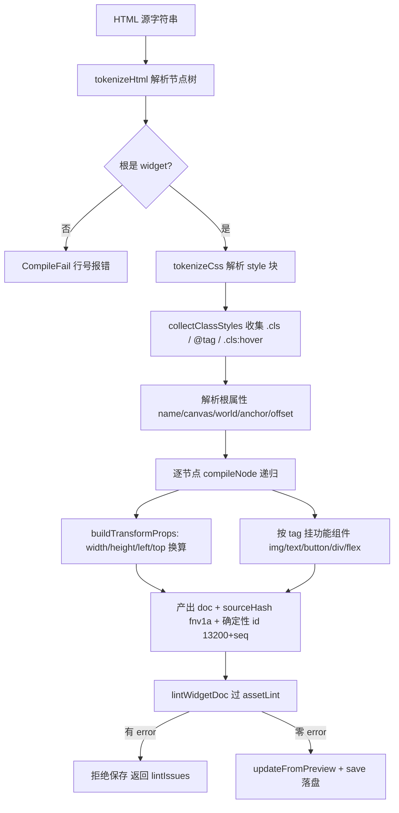
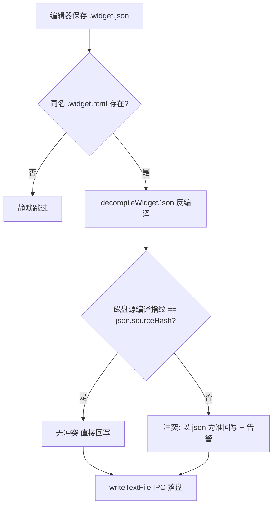

# UI HTML 源格式（UI HTML Source Format）

> widget.json 的 AI 编写层：完整原生 HTML/CSS 单向编译 + 反编译回写，运行时零改动。
> **2026-09-01 升级**：v1 受控子集已升级为完整原生 HTML 映射（完整标签全集/选择器级联继承/
> 盒模型/块级流/内联流/flex wrap+grow/grid/表格/@media/渐变/transform，编译期静态布局求解）。
> 权威映射文档：`devdoc/ui-html-source-format/full-mapping.md`；本文其余"受控子集"表述为历史。
> 代码位置：`src/editor/asset/uiCompiler/`、`scripts/ui-compiler-cli.mjs`
> 相关文档：[系统总览](../system_overview.md) / [资产预览与检查](./asset_preview_lint_system.md) / [蓝图编辑](./blueprint_edit_system.md) / [引擎 UI 系统](../engine/ui_system.md)

## 1. 概述

UI widget 资产是深度嵌套的 JSON 树（每节点 3~4 个组件、世界米制坐标、zOrder/锚点等引擎语义），对 AI 与人手写都不友好。本系统引入 **HTML 源格式（`.widget.html`）** 作为编写层：

- **AI/人写 HTML**：类 CSS 布局表达（width/height/position/flex），所见即所写
- **编译器单向编译**：HTML → widget.json，受控子集之外的写法硬报错（带源行号），绝不静默降级
- **反编译回写**：编辑器保存 .widget.json 时自动反编译回 .widget.html，双边同改以最后保存方为准
- **运行时零改动**：引擎只认 widget.json，渲染/预览/gameplay 完全不感知源格式

| 角色 | 职责 |
|---|---|
| `.widget.html` 源文件 | AI/人编写层（唯一人工编辑入口） |
| `uiCompiler/compile.ts` | HTML → widget.json（受控子集校验 + 映射） |
| `uiCompiler/decompile.ts` | widget.json → HTML（规范形输出，round-trip 等效） |
| `uiSourceSync.ts` | 保存 json 时反编译回写 + 冲突仲裁 |
| `uiSourceActions.ts` | 编辑器动作封装（编译 + lint 零错误门槛 + 保存） |
| `scripts/ui-compiler-cli.mjs` | CLI 入口（自包含纯 JS，与 TS 版映射规则对齐） |
| MCP `ui_compile` 工具 | AI 调用通道（自动过 lint 门槛） |

与相邻系统的边界：资产结构校验（schema/id/name 唯一性）归 assetLint（见 [asset_preview_lint_system.md](./asset_preview_lint_system.md)）；组件运行时语义归引擎 UI 系统（见 [../engine/ui_system.md](../engine/ui_system.md)）；本文档只管"源 ↔ 资产"的翻译层。

## 2. 核心模块

| 模块 | 说明 |
|---|---|
| `src/editor/asset/uiCompiler/miniParser.ts` | 零依赖 HTML/CSS 解析器（tokenizeCss/tokenizeHtml），所有错误带源行号 |
| `src/editor/asset/uiCompiler/widgetMapping.ts` | 映射常量与 px↔米换算（按根画布比例上下文化，无全局常数） |
| `src/editor/asset/uiCompiler/compile.ts` | 编译主流程：`compileWidgetHtml(source) → {ok, errors, doc}` |
| `src/editor/asset/uiCompiler/decompile.ts` | 反编译主流程：`decompileWidgetJson(doc) → {ok, warnings, html}` |
| `src/editor/asset/uiCompiler/lintAdapter.ts` / `lintBridge.ts` | 产物接 assetLint 校验（CLI 环境降级跳过） |
| `src/editor/asset/uiSourceSync.ts` | `decompileBackOnSave`：保存 json 后反编译回写 + 冲突检测 |
| `src/editor/asset/uiSourceActions.ts` | `compileUiSourceToAsset`：读源→编译→lint 门槛→updateFromPreview+save |
| `scripts/ui-compiler-cli.mjs` | Node CLI（自包含纯 JS 实现，映射规则与 TS 版同构，修改须双边同步） |

## 3. 使用方法

### 3.1 源文件写法（受控子集）

```html
<widget name="Toast" canvas="960x180" world="4.8x0.9" anchor="top-center" offset="0,0.55">
  <style>
    .ToastPanel { width: 960px; height: 180px; background-color: rgba(58, 36, 24, 0.92); border-radius: 24px; }
    .ToastText { width: 920px; height: 160px; font-size: 28px; color: #f5e6c8; font-weight: bold; text-align: center; z-order: 1; }
  </style>
  <div class="ToastPanel">
    <text class="ToastText"></text>
  </div>
</widget>
```

元素 ↔ 组件映射：

| 元素 | 产出组件 | 说明 |
|---|---|---|
| `<div>` | 容器 Actor（+UILayout 若 `display:flex`；+UIImage 若带 background/border-radius/opacity） | 纯容器或背景面板 |
| `` | UIImageComponent | void 叶子元素；background-color 作纯色填充 |
| `<text>` | UITextComponent | 文本样式直通（font-size 为画布像素语义） |
| `<button>` | UIButtonComponent + 可选 UIImage 背景 | `:hover color` → UIScript.args.hoverColor |
| `<input>` / `<textarea>` | UITextInputComponent | `placeholder` / `value` 属性直通；引擎单行输入，textarea 仅作 input 别名（round-trip 统一还原为 input） |
| `<progress value max>` | UIProgressBarComponent | HTML 原生属性（min 恒 0）；fill 子 Actor 由源内子元素承载；非默认 min/fillActorName/direction 以 `data-comp` 扩展保留 |
| `overflow: auto` / `overflow-x: auto` | UIScrollListComponent | 任意元素；`overflow-x` → horizontal；扩展属性（itemWidget/spacing 等）以 `data-comp="UIScrollList"` 保留；hidden/visible/clip 报错 |
| `title="..."` 属性 | UITooltipComponent | 任意元素可挂；delay/direction/widgetPath 非默认值以 `data-comp="UITooltip"` 保留 |
| `data-comp` / `data-props` | 任意组件透传 | 逃逸通道；与 overflow/title 等原生映射同用时按 baseClass 合并 properties |
| `data-script` / `data-args` | UIScriptComponent | 任意元素可挂 |

关键约定：`canvas="宽x高"` 为画布像素；`world="宽x高"`（米）声明根世界尺寸，缺省宽 4.8、高按画布比例；px↔米换算按根画布比例（x: `px/canvasWidth×worldWidth`）；CSS 主轴 justify 六值与 align-items 四值（含 stretch）映射 UILayoutComponent；`position:absolute + left/top %` ↔ 九宫格锚点 + anchorOffset 精确反解。

### 3.2 四种入口

```bash
# CLI（手工/CI）——compile 成功后自动经编辑器 MCP HTTP API（:9877+）跑 assetLint 零错误门槛
node scripts/ui-compiler-cli.mjs compile <xxx.widget.html> [输出.json]
node scripts/ui-compiler-cli.mjs decompile <xxx.widget.json> [输出.html]
```

编辑器控制台命令：`ui.compile <路径>` / `ui.decompile <路径>`（相对项目根）。

资产面板右键菜单（widget.json 专属，2026-09-01 起）：有同名 `.widget.html` 的资产显示 **🔨 编译 UI 源**（走完整链路：编译 + assetLint 门槛 + 覆写 json + 反编译回写源）；无源文件的旧资产显示 **🛠️ 生成 HTML 源**（反编译生成 .widget.html 并写回 sourceHash，之后右键菜单自动切换为编译项）。执行反馈输出到底部控制台。

MCP 工具 `ui_compile`（AI 首选）：参数 `{ "asset": "src/projects/fish/asset/blueprints/ui/toast.widget.html" }`，返回 `{ok, errors[{line,message}], lintIssues, warnings}`——内置 assetLint 零 error 门槛，产物自动保存。

自动同步：编辑器保存 `.widget.json` 时若存在同名 `.widget.html`，自动反编译回写（无源文件则静默跳过）。

### 3.3 AI 创建 widget 的标准流程

1. 写 `<描述>.widget.html` 源文件（`asset/blueprints/ui/` 下）
2. 调 MCP `ui_compile` 编译（若报错按行号修源重试）
3. 源文件与 json 双双落库；后续改 UI 优先改源再编译

## 4. 工作流程

### 4.1 编译主流程



### 4.2 双向同步与冲突仲裁



### 4.3 设计要点

- **确定性输出**：sourceHash 为源内容 FNV-1a 指纹；节点 id 从 13200 顺序分配——同一源编译两次产物逐字节一致（TC-B8）
- **换算上下文化**：px↔米按根画布比例换算（toast 960px 画布 = 200px/m，main_menu 1920px = 400px/m），无全局常数；`left/top` 百分比与 px→% 中间换算同样分轴：left 基准画布宽、top 基准画布高（CSS 语义，2026-09-01 修复 parsePos 曾统一除以画布宽导致垂直定位系统性上浮）
- **round-trip 等效**：html → json → html' 语义等效；反编译输出规范形（声明固定顺序、class=节点名），二次编译收敛到省略缺省值的稳定形
- **不丢信息**：映射不到的组件走 `data-comp`/`data-props` 逃逸；UIImage 带子节点时反编译降级 div（img 是 void 元素），编译端 div 带背景声明对称升回 UIImage
- **双边实现同步义务**：CLI 是自包含纯 JS（`scripts/ui-compiler-cli.mjs`），映射规则与 TS 版同构；任何映射规则修改必须 TS 版 + CLI 双边同步

## 5. 边界条件

| 条件 | 行为/后果 | 处理方式 |
|---|---|---|
| CSS `@media`/`@keyframes` 等规则 | 编译硬报错（带行号） | 删除，受控子集不支持 |
| 嵌套/逗号/通配选择器 | 编译硬报错 | 仅 `.cls` / 标签 / `.cls:hover` |
| `position` 非 absolute | 编译报错 | 流内布局交给父容器 flex |
| `flex-direction` 无 `display:flex` | 编译报错 | 补 display: flex |
| 非法颜色/枚举/px 单位 | 编译报错（带行号） | 按提示修正 |
| json 无 sourceHash（旧资产）反编译 | 警告但尽力转换 | 映射不到的组件走 data-comp 逃逸 |
| 保存 json 时无同名源文件 | 静默跳过，不建源 | 需要源时用 `ui.decompile` 手动生成 |
| 源与 json 双边同改（冲突） | 以 json 为准回写源 + 告警 | 检查告警确认覆盖内容 |
| `<widget>` 根下直接文本 | 编译报错 | 包裹到 div/text 中 |
| `<textarea>` | 合法但等价 `<input>` | 引擎无多行输入，round-trip 统一还原为 input |
| `overflow: hidden/visible/clip` | 编译报错 | 仅 `auto`/`scroll` 映射滚动列表 |
| CLI compile 时编辑器未运行 | 跳过自动 assetLint（exit 0），由编辑器内 ui_compile/MCP 兜底 | AI 一律走 MCP ui_compile |
| CLI compile 自动 lint 检出本资产 error | 阻断，exit 4（warn 透传不阻断） | 按输出的 rule/nodePath 修源重编译 |
| flex wrap/reverse、CSS 变量、媒体查询 | 不支持 | 已知限制，方案 §5 明确不做 |

## 6. 依赖关系

```
.widget.html ──compile──> widget.json ──assetLint──> 落盘
      ^                        │
      └────decompile───────────┘（保存时自动回写）
UIPreviewManager / UIPreviewScene ── 只消费 widget.json，不感知源格式
MCP mcp-server.mjs ─> electron/main.ts 白名单 ─> EditorInitializer ─> uiSourceActions
CLI compile ──探测 :9877+ 编辑器实例──> POST /api/command run_asset_lint ──过滤本资产 error──> exit 4 阻断
```

- 产物走 [assetLint 零错误门槛](./asset_preview_lint_system.md)，保存链路复用 [BlueprintEditorService](./blueprint_edit_system.md)
- UILayoutComponent 的 justify/align/stretch 支持由本方案补充（`src/engine/ui/UILayoutComponent.ts`），语义见 [../engine/ui_system.md](../engine/ui_system.md)
