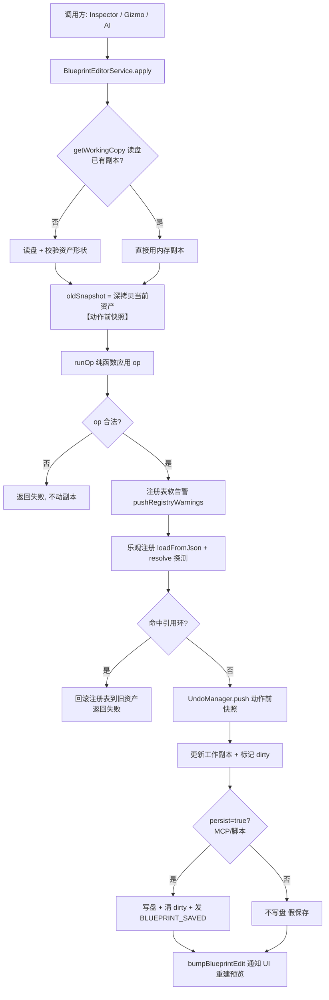
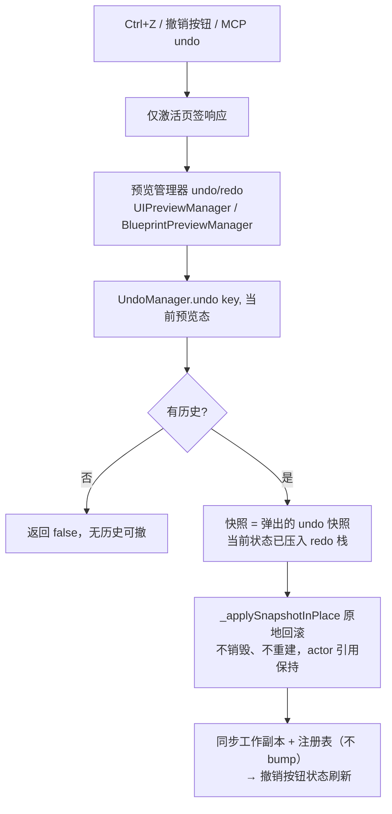
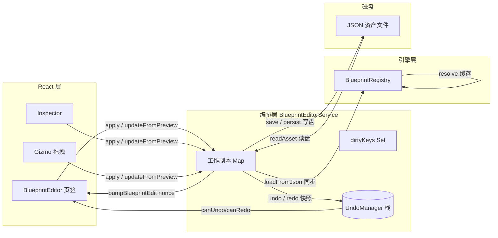

# 蓝图编辑器撤销/重做系统

> 本文档说明 DemoStudio 蓝图（Blueprint）资产编辑器的撤销/重做系统实现原理与完整流程。
> 涉及代码：`src/editor/blueprintEdit/`（UndoManager、BlueprintEditorService）、`src/engine/blueprint/BlueprintRegistry.ts`、`src/components/BlueprintEditor.tsx`、`src/stores/editorStore.ts`。

## 1. 概述

采用 **快照式（Snapshot）撤销**：每次编辑前把完整资产 JSON 深拷贝保存为快照，撤销/重做就是"整份资产替换"。

核心设计决策：

| 决策 | 说明 |
|---|---|
| **假保存（persist=false）** | UI 编辑只改内存工作副本 + 撤销栈，**不写盘**。只有显式保存（Ctrl+S / 保存按钮）或 MCP 调用才落盘 |
| **按资产独立栈** | 以蓝图注册 key（`asset/...`）为粒度维护独立撤销/重做栈，多页签互不干扰 |
| **单资产栈上限 50 条** | 超出丢弃最旧快照（`MAX_STACK = 50`） |
| **操作前快照** | `push` 保存的是**动作前**状态；`undo` 弹出该快照恢复 |
| **新操作清空 redo** | 标准撤销语义：编辑新内容后 redo 历史作废 |
| **关闭即丢弃** | 关闭页签/切工程时清空该资产全部缓存，重新打开回到干净磁盘状态 |

## 2. 文件与职责

```
src/editor/blueprintEdit/
├── UndoManager.ts            # 纯内存快照栈（不碰磁盘）
├── BlueprintEditorService.ts # 编排层：读盘 → 应用 op → 撤销/重做 → 注册表同步 → 通知刷新
└── blueprintOps/             # 纯函数操作集（对 BlueprintAsset 结构做增删改）
```

### UndoManager（快照栈）

```ts
push(key, snapshot)      // 编辑前调用：深拷贝入 undo 栈，清空 redo 栈，超 50 条丢最旧
undo(key, current)       // 弹出 undo 快照；当前状态压入 redo 栈；无历史返回 null
redo(key, current)       // 弹出 redo 快照；当前状态压回 undo 栈
canUndo(key) / canRedo(key)  // UI 按钮可用状态
clear(key)               // 关闭单个资产时清空（重新打开不残留旧历史）
clearAll()               // 切换工程时清空全部
depth(key)               // 调试用栈深
```

快照均为 `JSON.parse(JSON.stringify(v))` 深拷贝，栈间不共享引用，杜绝脏写。

> **⚠️ 栈存储挂 globalThis（HMR 防分裂）**：Vite 热更新后组件可能 import 到带 `?t=` 时间戳的模块副本，与裸 URL 版本并存，类内 `static` 字段会分裂成互不可见的两份（症状：`push` 已执行但 `depth()` 不变）。因此栈 Map 挂在 `globalThis.__demostudioUndoStacks` 上，任意模块图共享同一份。

## 3. 使用方法

### 3.1 触发入口

| 入口 | 说明 |
|---|---|
| 快捷键 | Ctrl+Z 撤销 / Ctrl+Y（或 Ctrl+Shift+Z）重做（`shortcut-undo` / `shortcut-redo` 事件，**仅激活页签响应** `isTabActive` 守卫） |
| UI 按钮 | 撤销/重做按钮（`historyVersion` 驱动重查 `canUndo/canRedo`；`historyBusy` 防连点） |
| MCP | MCP undo/redo 命令（外部 AI 通道） |
| 程序 | `BlueprintEditorService.undo(assetPath)` / `redo(assetPath)` |

### 3.2 使用示例

```ts
// UI 层（BlueprintEditor.tsx）
BlueprintEditorService.undo(assetPath)   // 无历史返回 { ok:false, error:'没有可撤销的历史' }
BlueprintEditorService.redo(assetPath)
const { undo, redo } = UndoManager.depth(assetPath)  // 调试栈深
```

### 3.3 使用前提

- 撤销/重做前资产须有工作副本（`read`/`apply` 建立）；无历史时返回错误而非抛异常
- 撤销/重做**不写盘**，只改内存（dirty 星标保留）

## 4. 核心流程

### 4.1 编辑（apply）— 一条编辑如何进入撤销栈



关键点：

- **撤销快照 = 动作前状态**。`apply` 一开始就深拷贝 `oldAsset`，`runOp` 成功后把这份旧状态 `push` 进栈，所以撤销回去的正是"这次编辑之前的样子"。
- **引用环回滚**：`BlueprintRegistry.resolve()` 探测到循环引用时，注册表与工作副本都回滚到旧资产，**不产生撤销点**（这次失败编辑不污染历史）。
- **MCP 差异**：外部入口（`dispatch`）走 `persist=true`，编辑立即落盘；UI 编辑 `persist=false` 只进内存。

### 4.2 撤销 / 重做（UI/蓝图预览 = 内存原地回滚）



- **原地回滚（唯一应用路径）**：遍历 `_actorJsonMap`（actor → JSON 节点），按节点名在快照树中找对应节点，组件可编辑属性用 `getEditableProperties()` 的 `set` 回写，transform 用 `setPosition/setRotation/setScale` 回写。**不销毁重建** → 选中/gizmo/包围盒/相机零丢失，无需按名称恢复。
- 结构一致性检查：节点数/节点名对不上（快照有增删节点）→ 仅警告跳过，不重建（当前预览仅 transform/属性编辑不会触发）。
- 撤销/重做后 `syncWorkingCopy` 把预览态同步进服务层工作副本（不写盘、不 bump），保证 Inspector 后续编辑基于回滚后状态。
- 重做（Ctrl+Y）与撤销对称：从 redo 栈弹快照，当前状态压回 undo 栈。
- 撤销/重做**不写盘**，只改内存（dirty 星标保留）。
- 页签标题的 `*`（`dirtyBlueprints`）由 `markBlueprintDirty/Clean` 维护：编辑置脏、保存/关闭清脏。

> ⚠️ **重建后必须重新 activate**：预览重建（`bumpBlueprintEdit` 触发）后 `previewReady` 的 false→true 会被 React 批处理合并，`[isTabActive, previewReady]` effect 可能不触发，导致新实例 `_undoKey` 为 null、撤销失效。修复：预览创建 effect 内当页签激活时直接调用 `mgr.activate(assetPath)`（BlueprintEditor.tsx）。

### 4.3 Gizmo 拖拽（预览态 → 撤销点）

拖拽过程中只改预览内存态（**不产生撤销点**）；**松手时** `commitPreviewEdit` 把预览态与基准（`_lastCommitted`）对比：

```
松手 → collectSaveData 收集最新预览态
     → 与基准 _lastCommitted 对比（JSON.stringify）
     → 有变化：基准作为动作前快照 UndoManager.push + 更新基准 + 同步工作副本
     → 无变化（拖回原位）：跳过，不产生空撤销点
     → 发 BLUEPRINT_TRANSFORM_DIRTY 刷新撤销按钮
     → 不 bump、不重建预览
```

统一设计：

- **撤回基准**：`activate(assetPath)` 首次激活时建立（加载后的未编辑状态，独立深拷贝）。`commitPreviewEdit` 对比基准：有变化才 push（基准作动作前快照），再更新基准。
- **基准防污染**：基准必须是独立深拷贝——`collectSaveData` 会原地写回 `_jsonTree`，若基准同引用则被污染，对比恒等导致第二次起编辑不进栈。
- **拖动中零撤回点**：`mousemove` 每帧只改运行时组件属性（实时预览），不碰工作副本与撤销栈。
- **Inspector 直改**：仍走服务层 `applyBatch`（push 快照 + bump 重建预览）；重建后的新实例经 activate 重新建立基准（= 修改后状态），undo 时取栈顶动作前快照原地回滚——两条链路共享同一 UndoManager 栈，协调一致。
- **保存兜底** `updateFromPreview`：仅保存前同步预览内存态到工作副本，**不再产生撤回点**（push 职责已收敛到预览管理器本地提交）。

首次拖拽（无工作副本）会先读盘建立副本，此时撤销快照 = 真实磁盘状态。

### 4.4 保存 / 关闭 / 切工程

| 场景 | 行为 |
|---|---|
| **保存** `save()` | 工作副本 flush 到磁盘 → 清 dirty → 发 `BLUEPRINT_SAVED`。不 bump（由调用方决定重建时机） |
| **关闭页签** `closeAsset()` | 删工作副本 + 清 dirty + `UndoManager.clear`；**异步读盘把注册表恢复成磁盘版本**（防止"关闭未保存的修改仍然生效"）；清页签星标 |
| **切换工程** `clearCache()` | 清空全部工作副本/脏标记/撤销栈 + `BlueprintRegistry.clearAll()` |

> ⚠️ `closeAsset` 是**静默丢弃**：页签带 `*` 未保存标记时点关闭也不会弹确认，直接回到磁盘状态。

## 5. 数据流全景



## 6. UI 联动细节（BlueprintEditor.tsx）

- **快捷键**：`window` 上监听 `shortcut-undo` / `shortcut-redo` 事件（由全局键盘系统转发），**仅激活页签**响应（`isTabActive` 守卫）。
- **撤销/重做按钮**：`historyVersion` 状态驱动重查 `UndoManager.canUndo/canRedo`；`historyBusy` 防连点。
- **选中/相机恢复**：撤销/重做会触发预览重建（`bumpBlueprintEdit`），重建前用 `pendingSelectRef` 记忆选中 Actor，重建后按名称恢复选中与相机位姿，不跳回总览。

## 7. 边界条件

| 条件 | 行为/后果 | 处理方式 |
|---|---|---|
| 撤销/重做无历史 | 返回 `{ ok:false, error:'没有可撤销/重做的历史' }`，不抛异常 | UI 用 canUndo/canRedo 禁用按钮 |
| 栈超 50 条 | 丢弃最旧快照（MAX_STACK=50） | 引擎内置 |
| 快照体积 | 每次编辑存整份资产深拷贝（最多 50 份），资产较大时内存线性增长 | 当前可接受；后续可考虑增量快照 |
| 撤销点粒度 | `apply` 一次一个点；Gizmo 拖拽一次松手一个点（拖拽过程不产生点） | 引擎内置 |
| MCP/脚本编辑 | 立即落盘并产生撤销点 | 引擎内置 |
| `close` 清缓存 | 不写盘；未保存修改**静默丢弃**（无确认弹窗） | 已知语义 |
| 注册表一致性 | 任何修改副本的路径（apply/undo/redo/updateFromPreview）都必须同步 `loadFromJson`，否则游戏运行时 spawn 读到旧数据 | 引擎内置同步 |
| 撤销后新编辑 | 清空 redo 栈（标准语义） | 引擎内置 |

## 8. 调试手段

- `UndoManager.depth(key)` 返回 `{ undo, redo }` 栈深，日志中每个 `apply/undo/redo` 都打印 `undo 栈 X→Y`。
- 服务层日志前缀 `[BlueprintEdit]`：`apply 开始/完成`、`undo`、`redo`、`关闭资产，缓存已清理`、`写盘失败，回滚` 等。
- 栈深异常（如撤销后新编辑 redo 未清空）优先检查：`push` 是否在 `runOp` 成功后调用、redo 栈是否被清。
- **第二次编辑起不进栈（"内容无变化"误判）**：场景预览的基准快照（`_lastCommitted`）与工作树（`_sceneAsset`）必须是**两个对象**——`collectSaveData` 会把实时 transform 原地写回 `_sceneAsset`，若基准同引用则被污染，对比恒等。所有赋值处（`activate`/`commitPreviewEdit`/`commitPropertyEdit`/`markCommitted`/undo/redo）均须对基准做独立深拷贝，且 `loadSceneAsset` 的输入也不得与基准同引用。
