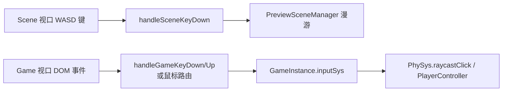

# 视口与场景系统（Editor Viewport）

> 编辑视口与游戏视口的渲染、输入路由与场景初始化。
> 代码位置：`src/editor/SceneViewport.ts` `src/editor/GameViewport.ts` `src/editor/SceneSetup.ts` `src/editor/SceneDefaults.ts`
> 相关文档：[系统总览](../system_overview.md) / [渲染系统](../engine/rendering_system.md)

## 1. 概述

编辑器提供两类视口：

| 视口 | 用途 | 渲染器 |
|---|---|---|
| **Scene 视口** | 编辑场景（fly 飞越 / orbit 轨道 + WASD 漫游） | `PreviewSceneManager` |
| **Game 视口** | 运行游戏预览 | `SceneRendererComponent`（Game 启动时创建） |

## 2. 核心模块

### Scene 视口（SceneViewport.ts）

| 函数/模块 | 说明 |
|---|---|
| `createSceneViewport(containerEl, sharedScene?)` | 创建 Scene 视口 PreviewSceneManager：controlMode='fly'、WASD 控制、`setCameraOrbit(45, 30, 20)` |
| `handleSceneKeyDown` | WASD/QE 飞越漫游键处理（`SCENE_WASD_KEYS`），返回是否消费 |
| `PreviewSceneManager` | 视口渲染器（fly 飞越摄像机 / orbit 轨道控制 + WASD 漫游），来自 `src/editor/asset/ScenePreviewManager.ts` |

### Game 视口（GameViewport.ts）

| 函数 | 说明 |
|---|---|
| `handleGameKeyDown` | 键盘按下 → `inst.inputSys.handleKeyDown(e.key, inst.controller)` |
| `handleGameKeyUp` | 键盘释放 → `inst.inputSys.handleKeyUp` |
| 鼠标路由 | 坐标转换 + InputSys 转发（不再直接调用 PlayerController） |

> 注意：Game 视口渲染器（SceneRendererComponent）由 Game 启动时从 `GameInstance.current.renderContainer` 取 DOM 创建并交给 World 持有，GameViewport 不再负责创建。

### 场景初始化（SceneSetup / SceneDefaults）

| 模块 | 说明 |
|---|---|
| `SceneSetup` | 编辑器场景初始化（共享 Scene 创建、默认内容装配） |
| `SceneDefaults` | 默认场景数据（初始相机、灯光、网格辅助等） |

## 3. 使用方法

### 3.1 入口 API

| 方法 | 签名 | 说明 |
|---|---|---|
| 场景初始化 | `setupScene(containerEl, onReady?): SceneSetupResult` | 返回 `{ sharedScene, sceneMgr, gameMgr（启动前恒 null）, sceneModeRef, cleanup }` |
| 视口创建 | `createSceneViewport(containerEl, sharedScene?)` | 创建后自动 `start()` |
| 相机操作 | `PreviewSceneManager.setCameraOrbit(az, el, dist)` / `focusOn(target, dist?)` / `setCameraMode(mode)` / `setFov(fov)` | 编辑相机控制 |
| 视口控制 | `setInputEnabled(v)` / `setTargetAspect(ratio)` / `resize()` / `setWASDControl(enabled)` | 输入冻结/比例/尺寸 |
| 坐标转换 | `clientToWorld(clientX, clientY, out?): THREE.Vector3` | 屏幕→世界（含 letterbox 缩放） |
| 默认内容 | `addDefaultContent(scene): GenericActor` | 灯光（Ambient/Hemisphere/Key/Fill）+ GridHelper(40,40) |

### 3.2 使用示例

```ts
// Viewport.tsx
const { sharedScene, sceneMgr, gameMgr, cleanup } = setupScene(sceneContainerRef.current, onReady)
// cleanup 时先 setSharedScene(null) / setSceneMgr(null) 再 cleanup()
```

### 3.3 触发时机与使用前提

- **键盘监听**：`viewportFocused` 为 true 时注册（window capture 阶段）；**鼠标监听仅 game 页签 + running 时**挂到 game canvas
- WASD 漫游 W/S 沿视线、A/D 水平侧移、Q/E 沿世界 Y；fly 模式左键旋转俯仰角钳制 `±Math.PI/2.2`
- WebGL contextlost：`preventDefault` 阻止销毁 + `stop()` + warn；restored：`restoreAllTextures()`（遍历场景标记 needsUpdate）→ `start()`

## 4. 工作流程

### 4.1 输入路由链



### 4.2 渲染结构

```
编辑器渲染编排（SceneRenderHost）：
├── 主场景（sharedScene：场景资产内容 + 编辑器辅助）
├── UI 场景（uiScene：CanvasUI 世界内 UI）
└── overlay 场景（gizmo / 选中包围盒 / 把手 / 标签，永远最顶层）
```

### 4.3 设计要点

- `resize()` 容器宽高为 0 直接 return（不报错）
- `dispose()` 必须先 `forceContextLoss()` 再 `renderer.dispose()`，否则 WebGL 上下文泄漏
- `clientToWorld` 用 `getBoundingClientRect`（含 letterbox 缩放），投影到 z=0 平面
- `setInputEnabled(false)` 冻结 OrbitControls，但 mousedown/up 状态始终记录

## 5. 边界条件

| 条件 | 行为/后果 | 处理方式 |
|---|---|---|
| `handleGameKeyDown` 时 game 为 null | 仍 preventDefault + 返回 true（消费） | 引擎内置 |
| 鼠标事件 game 为 null | 静默 return | 引擎内置 |
| `clientToWorld` 无 gameMgr | 返回传入的占位向量原样（无 null 防护） | 调用方传有效 _ptrWorld |
| 容器宽高 0 | `resize()` 直接 return | 引擎内置 |
| WebGL context lost | preventDefault + stop + warn；restored 恢复纹理重启动 | 引擎内置（见 §3.3） |
| 非 scene/game 页签（bp:*） | 键盘返回 false 不消费（InputRouter） | 引擎内置 |
| 视口比例切换 | `setTargetAspect` 同步相机 aspect | 编辑器设置入口 |

## 6. 依赖关系

```
SceneViewport → PreviewSceneManager / OrbitControls / Compositor2D / LightComponent
GameViewport → Game / SceneRendererComponent / InputSys
SceneSetup → SceneDefaults / GenericActor（默认内容）
视口输入 → InputRouter / KeyboardShortcuts（编辑器级按键拦截）
```
