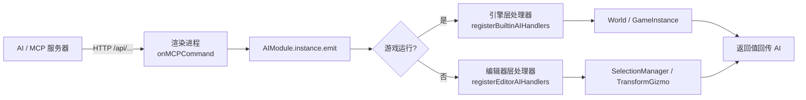

# AI 事件系统（Engine AI）

> AI 经 MCP 控制游戏场景的事件总线：AI 发事件 → 处理器执行 → 返回值回传。
> 代码位置：`src/engine/ai/`
> 相关文档：[系统总览](../system_overview.md) / [游戏流程](./gameflow_system.md)

## 1. 概述

`AIModule` 是引擎内的事件总线单例，让外部 AI（经 MCP 服务器）以"事件"方式控制游戏场景：

```ts
AIModule.instance.emit('ai.spawnActor', { blueprint: '...', position: [...] })
```

**设计目标：**

- **事件模式**：AI 发事件 → 处理器执行 → 返回值回传
- **动态配置**：`register` / `unregister` 动态增删处理器；事件名 + payload 集中定义在 `AIEvents.ts`
- **场景上下文**：`World` / `GameInstance` / `UIManager` 由 Game 生命周期注入（`setWorld` / `setGameInstance`）
- **松耦合**：模块不感知 MCP/编辑器，只提供事件能力；桥接在编辑器层完成

## 2. 核心接口

### AIModule（单例）

| 方法 | 签名 | 说明 |
|---|---|---|
| `instance` | 全局唯一单例（引擎内） | — |
| `emit` | `emit(event, payload = undefined): AIEmitResult` | 发事件，按注册顺序汇总各处理器返回值；无处理器 warn 不抛异常 |
| `register` | `register(event, handler): () => void` | 注册处理器，**返回注销函数** |
| `unregister` / `clearEvent` / `has` / `listEvents` | — | 卸载/清空/查询 |
| `attachContext` / `detachContext` | `(world, gameInstance = null)` | 注入运行上下文（Game.launch/shutdown 调用） |
| `reset()` | — | 回收运行状态（Game.shutdown 调用，GameSingleton 接口） |

### 事件上下文与结果

```ts
interface AIEventContext {
  world: World | null          // 当前运行 World（未运行时为 null）
  gameInstance: GameInstance | null
  readonly running: boolean    // 是否处于游戏运行中
}

type AIEventHandler = (payload: unknown, ctx: AIEventContext) => unknown | void

interface AIEmitResult {
  event: string
  handled: boolean             // 是否有处理器执行
  results: unknown[]           // 各处理器返回值
}
```

## 3. 使用方法

### 3.1 自定义事件

```ts
// 游戏代码注册自定义事件处理器
const unsubscribe = AIModule.instance.register('ai.myEvent', (payload, ctx) => {
  if (!ctx.running) return { ok: false, error: '游戏未运行' }
  // ... 处理逻辑
  return { ok: true }
})
// 卸载用 unsubscribe() 或 unregister
```

### 3.2 内置事件（AIEvents.ts）

| 事件常量 | 载荷类型 | 说明 |
|---|---|---|
| `AI_EVENT_NOTIFY` | `AINotifyPayload` | 通知消息 |
| `AI_EVENT_SPAWN_ACTOR` | `AISpawnActorPayload` | 生成 Actor（按蓝图路径） |
| `AI_EVENT_DESTROY_ACTOR` | `AIDestroyActorPayload` | 销毁 Actor |
| `AI_EVENT_TRANSFORM_ACTOR` | `AITransformActorPayload` | 变换 Actor |
| `AI_EVENT_SET_SCORE` | `AISetScorePayload` | 设置分数 |
| `AI_EVENT_ADD_SCORE` | `AIAddScorePayload` | 增加分数 |
| `AI_EVENT_GAME_OVER` | — | 游戏结束 |
| `AI_EVENT_SWITCH_SCENE` | `AISwitchScenePayload` | 切换场景 |
| `AI_EVENT_GET_STATE` | — | 取游戏状态快照（`AIGameStateSnapshot`） |
| `AI_EVENT_SHOW_MESSAGE` | `AIShowMessagePayload` | 显示消息 |

### 3.3 使用前提

- **游戏须运行中**：引擎层处理器用 `requireWorld(ctx)` 守卫，未运行 → warn + `{ ok: false, error: '游戏未运行' }`
- **spawnActor 立即生效**：`ActorRegistry.create` 分支后立即 `world.manualTick(0)` 提交生成（否则下一帧才进 allActors，随后的 transform/destroy 找不到）

## 4. 工作流程

### 4.1 处理器分层

```
引擎层 registerBuiltinAIHandlers —— 操作 World（生成/销毁/变换/切场景/分数…）
编辑器层 registerEditorAIHandlers —— 操作编辑器选中与 gizmo（ai.selectActor / ai.dragActor）
```

两者互补：引擎处理器在游戏运行时生效；编辑器处理器在编辑态生效（选中/拖动 gizmo）。

### 4.2 桥接架构



- 模块不感知 MCP/编辑器实现，桥接在编辑器层完成（松耦合）
- 自定义事件：游戏代码 `AIModule.instance.register('ai.myEvent', handler)`，卸载用 `unregister`
- HMR 幂等：`registerBuiltinAIHandlers()` 每次先 `clearEvent` 全部内置事件再注册（防止旧处理器残留导致 ai.notify 出现 8 个处理器）

## 5. 边界条件

| 条件 | 行为/后果 | 处理方式 |
|---|---|---|
| `emit` 无处理器 | `logger.warn('事件 "X" 无处理器，已忽略')` + `{ handled: false, results: [] }`，不抛异常 | 引擎内置 |
| 单个处理器抛异常 | `logger.error` 记录 + `results.push(undefined)`，**不中断其他处理器** | 引擎内置 |
| 游戏未运行 | 引擎处理器 `{ ok: false, error: '游戏未运行' }` | 先 launch 游戏 |
| spawnActor 蓝图生成失败 | `{ ok: false, error: '蓝图生成失败: X' }` | 检查蓝图路径/注册 |
| baseClass 未注册 | `'baseClass 未注册: X'` | 检查 ActorRegistry |
| blueprint 与 baseClass 皆缺 | `'缺少 blueprint 或 baseClass'` | payload 至少给一个 |
| 事件名未声明 | 任意字符串可注册（不要求预先声明） | 按需约定 |
| `ai.showMessage` | `duration` 字段预留——**当前实现为日志通知，UI 通道未实现** | 已知限制 |
| Game 无 world 字段 | launch 时 warn，上下文未附加 | GameInstance 需挂载 World |

## 6. 依赖关系

```
AIModule → World / GameInstance（注入上下文）
registerBuiltinAIHandlers → World（spawn/destroy/transform/score/switchScene）
registerEditorAIHandlers → SelectionManager / Gizmo（编辑器层）
Game.launch / Game.shutdown → AIModule.reset()（生命周期回收）
```
