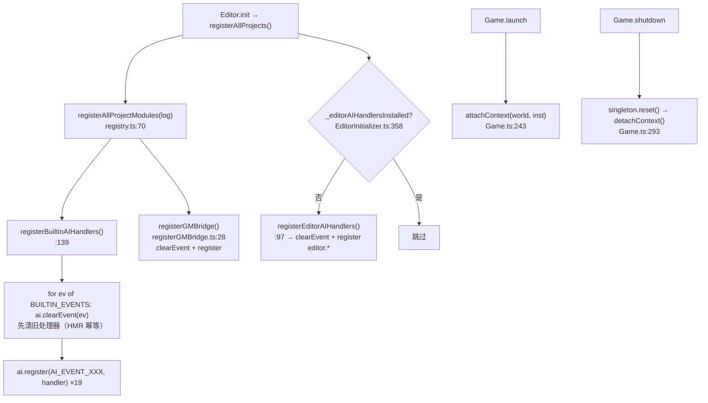

# AI 事件系统（AI Module）

> **一句话定位**：`AIModule` 是引擎内的**事件总线单例**——外部（MCP / HTTP / `window.__ai`）发一个 `ai.xxx` 事件名 + payload，它按注册顺序同步调用处理器，把返回值汇总回传给调用方。
>
> **什么时候会用到你**：新增一个 AI/MCP 可调用的游戏事件时；排查「AI 发了事件但游戏没反应 / 返回值是 null」时；排查「事件被执行了多次」时；搞不清引擎的 `ai.*` 和编辑器的 `editorBus` 该用哪个时。
>
> 代码位置：`src/engine/ai/`

---

## 1. 先记住这几个文件

| 文件 | 一句话职责 | 你要改它的场景 |
|---|---|---|
| [AIModule.ts](../../src/engine/ai/AIModule.ts) | 事件总线本体：`register` / `emit` / 上下文注入 | 改事件派发语义（异步、异常、返回值汇总） |
| [AIEvents.ts](../../src/engine/ai/AIEvents.ts) | 事件字典：事件名常量 + payload 类型 | **新增 AI 事件**（先在这里加常量和 payload 接口） |
| [registerBuiltinAIHandlers.ts](../../src/engine/ai/registerBuiltinAIHandlers.ts) | 引擎层内置处理器：把事件接到 World / GameState / InputSys | 新增事件后**在这里注册处理器** |
| [EditorInitializer.ts](../../src/editor/EditorInitializer.ts) | 编辑器层桥接：MCP `ai_event` → `emit`；`editor.*` 处理器 | 加编辑器面板/选中类事件，或改往返汇总逻辑 |

**关键心智模型**：`AIModule` 只做三件事——**注册**（把函数塞进 `Map<string, AIEventHandler[]>`）、**发送**（`emit` 同步遍历调用）、**注入上下文**（游戏启动时挂 `World` / `GameInstance`）。它**完全不感知 MCP、HTTP、编辑器**，桥接全在 `EditorInitializer` 完成。所以「事件没生效」永远分两段查：有没有被 emit，处理器有没有被 register。

---

## 2. 一条 AI 事件怎么被执行：从外部调用到游戏内响应

### 2.1 谁调用了它

三个真实入口，最终都汇聚到同一行 `AIModule.instance.emit`：

**① MCP / HTTP 往返通道（主链路）**——DSH 的 `emit_ai_event` 工具直接打 HTTP（[emitAIEvent.ts](../../harness/ds-engine-tools/src/tools/emitAIEvent.ts)）：

```ts
// callMCPRaw(port, 'ai_event', { event, payload }) —— 裸 HTTP，不走 engineBridge
const resp = await fetch(`http://127.0.0.1:${port}/api/command`, {
  method: 'POST', headers: { 'Content-Type': 'application/json' },
  body: JSON.stringify({ command, params }),
})
```

反直觉点：DSH 侧**故意不用 `engineBridge.callTool`**，而是裸 HTTP 打 `/api/command`——嵌套 payload 经 bridge 一层序列化后子对象会丢（见 §6 坑 4）。

**② 渲染进程接收并派发**（[EditorInitializer.ts:477](../../src/editor/EditorInitializer.ts)）：

```ts
case 'ai_event': {
  // AI 事件模式：MCP 发送 { event, payload } → AIModule 分发到引擎处理器
  const event = params?.event as string | undefined
  if (!event) {   // 缺 event：走 requestId 回 error，不能静默 break
    if (requestId) window.electronAPI?.sendMCPResponse?.(requestId, { status: 'error', message: '缺少 event 参数' })
    break
  }
  const result = AIModule.instance.emit(event, params?.payload)
```

**③ 浏览器 / Playwright 调试入口**（`EditorInitializer.ts:336`）：

```ts
// 浏览器调试入口（Playwright / 控制台验证用）：window.__ai.emit('ai.selectActor', { name })
;(window as any).__ai = { emit: (event, payload?) => ai.emit(event, payload), listEvents: () => ai.listEvents() }
```

`window.__ai` 是浏览器调试模式下唯一可用入口（无 Electron IPC），Playwright 里 `__ai.emit('ai.getState')` 直接拿快照。

> 注意：`AgentService`（Agent 面板）**不直接碰 AIModule**——它走 DSH agent 的 RPC；Agent 想操作游戏时由 agent 侧调 `emit_ai_event` 工具，再经 ① 的 HTTP 通道进来。别把 AgentService 写成 AIModule 的调用方。

### 2.2 注册链路



**①②③ 注册发生在编辑器启动，不是游戏启动**（[registry.ts:70](../../src/projects/registry.ts)）：

```ts
  registerBuiltinAIHandlers()      // 内置 AI 事件处理器（幂等）
  registerBuiltinGMCommands()      // GM 命令系统（内置命令 + ai.gmCommand 桥接，幂等）
  registerGMBridge()
```

这点极易搞错：**处理器注册与游戏是否运行无关**。`ai.getState` 在游戏没跑时照样有处理器，只是返回 `running: false`。所以「无处理器」和「游戏未运行」是两种完全不同的失败——前者 `handled: false`，后者 `handled: true` 且 `result.ok === false`。

**④ HMR 幂等防护——两个文件两种写法，同一目的。** 引擎层用**清表法**（[registerBuiltinAIHandlers.ts:139](../../src/engine/ai/registerBuiltinAIHandlers.ts)）：

```ts
export function registerBuiltinAIHandlers(): void {
  const ai = AIModule.instance
  for (const ev of BUILTIN_EVENTS) ai.clearEvent(ev)
```

配套的 `BUILTIN_EVENTS` 数组（`:107`）必须与 `ai.register` 的事件**一一对应**，漏一个就漏保一个。编辑器层用**标记法**（[EditorInitializer.ts:355](../../src/editor/EditorInitializer.ts)）：

```ts
  registerAllProjectModules(log)
  // 编辑器层 AI 事件（gizmos 选中/拖动），幂等
  if (!_editorAIHandlersInstalled) { _editorAIHandlersInstalled = true; registerEditorAIHandlers() }
```

而 `registerEditorAIHandlers()` 内部又补了一刀清表：

```ts
  // HMR 场景：模块重载后 _editorAIHandlersInstalled 重置，但 AIModule 单例仍保留旧处理器，
  // 先清除编辑器层事件旧处理器，避免重复注册（ai.selectActor 曾累积到 10 个）
  ai.clearEvent('ai.selectActor'); ai.clearEvent('ai.dragActor')
```

> **为什么两套防护都要有**：Vite HMR 重载模块时 `let _editorAIHandlersInstalled` 被重置为 `false`，但 `AIModule._instance` 是模块级静态单例、旧处理器数组还在内存里。标记只能防「同一会话内重复调用」，防不住「HMR 重载后重新求值」——后者只有 `clearEvent` 能救。历史上 `ai.notify` 累积到 8 个、`ai.selectActor` 累积到 10 个，一次 emit 执行 10 遍选中。

**⑤ 上下文注入与回收**（[Game.ts:235](../../src/engine/gameflow/Game.ts)）：`AIModule` 实现 `GameSingleton`，`reset()` 就是 `detachContext()`，shutdown 时随 `this._singletons` 统一遍历回收（`Game.ts:293`）。**注意处理器不会被回收**——`reset` 只清上下文、不清注册表，所以停游戏后事件依然 `handled: true`，只是 `requireWorld` 返回 null。

### 2.3 发送与派发

`emit` 的核心只有 20 行（[AIModule.ts:149](../../src/engine/ai/AIModule.ts)）：

```ts
  emit(event: string, payload: unknown = undefined): AIEmitResult {
    const list = this.handlers.get(event)
    if (!list || list.length === 0) {
      logger.warn(`[AIModule] 事件 "${event}" 无处理器（未注册？），已忽略`)
      return { event, handled: false, results: [] }
    }
    const ctx: AIEventContext = {
      world: this._world,
      gameInstance: this._gameInstance,
      get running() { return AIModule.instance._world?.running ?? false },   // getter：每次读取都取最新 world
    }
    const results: unknown[] = []
    for (const handler of list) {
      try {
        results.push(handler(payload, ctx))
      } catch (err) {
        logger.error(`[AIModule] 事件 "${event}" 处理器异常: ${(err as Error).message}\n${(err as Error).stack}`)
        results.push(undefined)
      }
    }
    return { event, handled: true, results }
  }
```

四处反直觉：

**① `emit` 完全同步，绝不 await 处理器。** 处理器返回 Promise 时 `results` 里存的是**未决的 Promise 对象**，不是结果。`ai.mouseDrag` 就是 async 处理器（`:618`，内部 `await new Promise(setTimeout)` 逐步移动鼠标）——直接读 `results[0].ok` 只会拿到 `undefined`。

**② await 的责任被推给桥接层**（`EditorInitializer.ts:487`）：

```ts
            // 汇总返回值：倒序取最后一个非 undefined 结果（兼容 async 处理器）
            if (result.handled) {
              for (let i = result.results.length - 1; i >= 0; i--) {
                const r = result.results[i]
                if (r === undefined || r === null) continue
                ret = typeof r === 'object' && typeof (r as any).then === 'function' ? await (r as Promise<unknown>) : r
                break
              }
            }
            const response = { status: 'ok', event, handled: result.handled, result: ret ?? null }
```

**倒序取最后一个非 undefined**，不是取第一个——一个事件可被多层注册（引擎层 + 编辑器层 + 项目自定义），后注册的往往更具体，取第一个会拿到最通用的兜底结果。判 `.then` 用 duck typing 而非 `instanceof Promise`，为的是兼容 thenable 与非原生 Promise。

**③ 无监听者时 warn 不抛异常**，返回 `{ handled: false, results: [] }`。**事件名写错不会报错**——`ai.getStat`（少个 e）静默返回 `status: 'ok', handled: false, result: null`，判断成败必须看 `handled`。**④ 单个处理器抛异常不中断其他处理器**，对应位置塞 `undefined`——异常被吞成 `undefined`，排查只能翻日志里的 `事件 "X" 处理器异常`（带完整 `err.stack`）。

另外 `emit` 在渲染进程主线程同步跑完所有处理器，重活（递归遍历整棵场景树、大量 IO）会卡住渲染进程；主进程因此挂了 20 秒超时兜底（`main.ts:120` `BLUEPRINT_REQ_TIMEOUT = 20000`），超时返回 HTTP 504。

---

## 3. 内置事件与 handler 约定

事件名统一 `ai.` 前缀 + 小写驼峰（`ai.spawnActor`），每个事件一个常量 + 一个 payload 类型。**加新事件两步**：在 `AIEvents.ts` 定义常量与 payload 类型，再在 `registerBuiltinAIHandlers.ts` 注册处理器并把它加进 `BUILTIN_EVENTS`。

挑 5 个代表性事件讲清载荷与用途：

**`ai.getState`（`:279`）**——唯一的无副作用查询，也是**不调 `requireWorld`** 的特例：

```ts
  ai.register(AI_EVENT_GET_STATE, (_payload: unknown, ctx: AIEventContext) => {
    const world = ctx.world
    return {                                     // 全链路 ?. 兜底，未运行也返回合法快照
      running: !!world?.running,
      phase: world?.gameState?.phase ?? 'idle',
      score: world?.gameState?.score ?? 0,
      gameOver: world?.gameState?.gameOver ?? false,
      actorCount: (world?.actorCount ?? 0) + (world?.ui.actorCount ?? 0),
      actors: world ? [ /* 3D Actor + UI Actor 合并 */ ] : [],
    } as AIGameStateSnapshot
  })
```

全链路 `?.` 兜底，**游戏没启动时照样返回合法快照**（`running: false, phase: 'idle'`）——这是判断「游戏跑起来没有」的标准探针，比 `/api/status` 更贴近引擎真实状态。`actorCount` 是 3D Actor 与 UI Actor 之和，两个数都得看。

**`ai.spawnActor`（`:176`）**——唯一会手动推进一帧的写入事件：

```ts
    if (p.blueprint) {
      actor = Instantiate(p.blueprint)
      if (!actor) return { ok: false, error: `蓝图生成失败: ${p.blueprint}` }
    } else if (p.baseClass) {
      actor = ActorRegistry.create(p.baseClass)
      if (!actor) return { ok: false, error: `baseClass 未注册: ${p.baseClass}` }
      spawnActor(actor)
      // 立即提交生成（否则要等下一帧 manualTick 才进入 allActors，随后的 transform/destroy 会找不到）
      world.manualTick(0)
    } else return { ok: false, error: '缺少 blueprint 或 baseClass' }
```

`blueprint` 与 `baseClass` 二选一，都缺 → `缺少 blueprint 或 baseClass`。**只有 `baseClass` 分支调了 `manualTick(0)`**：`ActorRegistry.create` 的 Actor 需显式 `spawnActor` 入册再手动跑一帧让 `commitSpawn` 生效；走 `blueprint` 分支则没有这一句，紧接着的 `transformActor` 会报 `未找到 Actor`（见 §6 坑 3）。

**`ai.gmCommand`（registerGMBridge.ts:32）**——唯一注册在别处的事件，走 `GameInstance.current.gm.execute`，是控制台之外的第二触发渠道：

```ts
export function registerGMBridge(): void {
  const ai = AIModule.instance
  ai.clearEvent(AI_EVENT_GM_COMMAND)   // 不在 BUILTIN_EVENTS 里，自己清表保证幂等
```

找它的处理器别只搜 `registerBuiltinAIHandlers`。

**`ai.mouseClick`（`:522`）**——走完整输入管线，不是简单设状态：

```ts
    // 执行完整点击管线：InputSys.handlePointerDown → PhySys.raycastClick → controller
    const consumed = gi.inputSys.handlePointerDown(p.screenX, p.screenY, worldPos, gi.controller, button)
```

与 `ai.clickActor`（按 Actor 名称直接 `triggerClick()`）是两条路：前者模拟真实屏幕点击（经 raycast，命中受 UI 遮挡影响），后者绕过坐标直接触发按钮。自动化测试优先 `clickActor`，验证输入管线本身才用 `mouseClick`。

其余事件（载荷与用途详见 [AIEvents.ts](../../src/engine/ai/AIEvents.ts)）：

| 事件 | 处理器位置 | 用途 |
|---|---|---|
| `ai.showMessage` | `:145` | `ToastSystem.attached` 时出 toast，否则降级日志（**仍返回 `ok: true`**，见 §6 坑 6） |
| `ai.notify` | `:133` | 通用日志通知，**不需要游戏运行** |
| `ai.destroyActor` | `:194` | 按名称销毁，销毁后 `manualTick(0)` 立即提交 |
| `ai.transformActor` | `:208` | 移动/旋转/缩放，三字段可缺省 |
| `ai.clickActor` | `:248` | 按 name / text / path 触发按钮，path 最精确（取自 `getHUD`） |
| `ai.getActor` / `ai.getHUD` | `:420` / `:624` | 单 Actor 详情（位置/缩放/激活/按钮/组件） / 递归 UI 树，带 `path` 供 clickActor 回查 |
| `ai.scrollCamera` | `:459` | 滚轮缩放（正=拉远，负=拉近） |
| `ai.mouseMove` / `mouseDrag` / `keyPress` / `keyRelease` | `:543` / `:562` / `:596` / `:610` | 模拟输入，`mouseDrag` 是 async |
| `ai.getSceneOutline` | `:733` | 场景 Actor 大纲，`maxDepth` 缺省 6 |

> `ai.getComponent` / `ai.setProperty` / `ai.callActor` 三个泛型 RPC 事件**在 `AIEvents.ts` 有常量和 payload 类型、也在 `BUILTIN_EVENTS` 里，但 `registerBuiltinAIHandlers.ts` 中没有对应的 `ai.register` 调用**——声明了但没实现，emit 返回 `handled: false`。这是当前代码的事实状态，别把它们写进可用事件清单。

---

## 4. 关键方法速查

| 方法 | 位置 | 干什么 | 注意 |
|---|---|---|---|
| `AIModule.instance` | [AIModule.ts:55](../../src/engine/ai/AIModule.ts) | 单例访问入口 | 静态字段，HMR 不重置——幂等防护的根源 |
| `register(event, handler)` | `AIModule.ts:101` | 注册处理器，**返回注销函数** | 不校验事件名是否声明过，任意字符串都能注册 |
| `unregister(event, handler)` | `AIModule.ts:113` | 按引用注销单个 | 传不相等的匿名函数引用会静默失败 |
| `clearEvent(event)` / `clearAll()` | `AIModule.ts:122` / `:137` | 清空该事件处理器 / 清空全部 | HMR 幂等靠 `clearEvent`；两者都只清注册表、保留上下文 |
| `has(event)` / `listEvents()` | `AIModule.ts:127` / `:132` | 查有无处理器 / 列出事件名 | `has` 只看数量；`listEvents` 是 MCP `ai_list_events` 的返回源（`EditorInitializer.ts:582`） |
| `emit(event, payload)` | `AIModule.ts:149` | 同步派发并汇总返回值 | 无处理器 warn 不抛；async 处理器返回未决 Promise |
| `attachContext(world, inst)` | `AIModule.ts:75` | 注入运行上下文 | `Game.launch` 调（`Game.ts:243`） |
| `detachContext()` / `reset()` | `AIModule.ts:82` / `:89` | 清上下文（`reset` 是 `GameSingleton` 实现） | 只清上下文，**不清注册表** |
| `requireWorld(ctx)` | `registerBuiltinAIHandlers.ts:68` | 处理器守卫：无 world 返回 null + warn | 一律返回 `{ ok: false, error: '游戏未运行' }` |
| `findActorByName(world, name)` | `registerBuiltinAIHandlers.ts:77` | 递归查找（3D Actor + UI Actor 树） | 匹配 `a.name` **或** `a.root.name` |
| `registerBuiltinAIHandlers()` | `registerBuiltinAIHandlers.ts:128` | 清表 + 注册 15 个引擎事件 | 幂等；新增事件必须同步 `BUILTIN_EVENTS`（`:100`） |
| `registerGMBridge()` | [registerGMBridge.ts:28](../../src/engine/gm/registerGMBridge.ts) | 注册 `ai.gmCommand` | 不在 `BUILTIN_EVENTS` 内，单独 clearEvent |
| `registerEditorAIHandlers()` | `EditorInitializer.ts:97` | 注册 `ai.selectActor` / `ai.dragActor` | 受 `_editorAIHandlersInstalled`（`:358`）保护 |
| `case 'ai_event'` | `EditorInitializer.ts:477` | MCP → `emit` 的桥接 | 倒序取最后一个非 undefined，兼容 Promise |
| `case 'ai_list_events'` | `EditorInitializer.ts:580` | 回传已注册事件列表 | 必须回 `requestId`，否则 AI 只拿到 ack |

---

## 5. 流程影响：牵动哪些功能

### 5.1 上游：谁驱动它

| 上游 | 怎么驱动 | 相关文档 |
|---|---|---|
| DSH agent `emit_ai_event` 工具 | 裸 HTTP POST `/api/command` → `ai_event` 命令 | [MCP 集成](../editor/integration/mcp_integration.md) |
| Electron 主进程 HTTP API | `main.ts:1751` 判白名单 → 生成 `requestId` 挂起 → IPC `mcp-command` 转发给渲染进程 | [MCP 集成](../editor/integration/mcp_integration.md) |
| 渲染进程 MCP 分发 | `onMCPCommand`（`EditorInitializer.ts:431`）→ `case 'ai_event'` → `emit` | [编辑器核心](../editor/core/core_system.md) |
| Playwright / 浏览器控制台 | `window.__ai.emit(event, payload)`（`EditorInitializer.ts:336`） | [编辑器核心](../editor/core/core_system.md) |
| 引擎初始化 | `registerAllProjectModules`（`registry.ts:70`）→ 两个注册函数 | [游戏流程](./gameflow_system.md) |
| `Game.launch` / `Game.shutdown` | `attachContext(world, inst)` / `singleton.reset()` | [游戏流程](./gameflow_system.md) |
| Agent 面板 | **间接**：AgentService 走 DSH RPC，由 agent 侧调 `emit_ai_event` 进 ① | [Agent 面板](../editor/integration/agent_panel_system.md) |

### 5.2 下游：它波及谁

| 下游功能 | 波及点 | 相关文档 |
|---|---|---|
| World / GameState | `spawnActor` / `destroyActor` 直接改运行状态，含 `manualTick(0)` 强制推进帧 | [游戏流程](./gameflow_system.md) |
| InputSys / PhySys | `mouseClick` / `mouseDrag` / `keyPress` 走完整输入管线（raycast → ClickableComponent → controller） | [游戏流程](./gameflow_system.md) |
| UI 树（UIManager） | `getHUD` / `getActor` / `clickActor` 递归遍历 UI Actor，返回的 `path` 供 clickActor 回查 | [游戏流程](./gameflow_system.md) |
| GM 命令系统 | `ai.gmCommand` → `GameInstance.current.gm.execute`，控制台之外的第二触发渠道 | [游戏流程](./gameflow_system.md) |
| ToastSystem | `ai.showMessage` 挂接时出 toast，未挂接降级日志 | [游戏流程](./gameflow_system.md) |
| MCP 往返响应 | `emit` 返回值经 `requestId` 回传 HTTP；20s 超时返回 504 | [MCP 集成](../editor/integration/mcp_integration.md) |
| 编辑器选中与 Gizmo | `ai.selectActor` / `ai.dragActor` 操作 `SelectionManager` 与预览管理器 | [编辑器核心](../editor/core/core_system.md) |

**与 `editorBus` 的分工**：两条总线互不重叠——`editorBus`（[EditorEvents.ts:45](../../src/editor/EditorEvents.ts)）是**编辑器内部**单向流，底层模块 `emit` 后由 `installEventBridge` 翻译成 Zustand 更新，事件名 `domain:action`、返回值 void、不对外；`AIModule` 是**对外** RPC 通道，事件名 `ai.` / `editor.`、有返回值、经 requestId 回传给 MCP。要能被 AI 调到的能力走 AIModule；只是 UI 想刷新的通知走 editorBus。

---

## 6. 踩坑清单（都是真踩过的）

**1. 事件名拼错，返回 `status: 'ok'` 看不出失败** —— `emit` 无处理器时只 `logger.warn`，返回 `{ handled: false, results: [] }`；桥接层照样包成 `{ status: 'ok', handled: false, result: null }`。规则：**判成败看 `handled`，不看 `status`**；不确定事件名先发 `ai_list_events`。

**2. `ai.selectActor` 一次 emit 执行了 10 遍** —— HMR 重载后 `_editorAIHandlersInstalled` 重置为 `false`，但 `AIModule` 是静态单例、旧处理器数组还在，重复 `register` 往同一数组 push。规则：**引擎层新增事件必须同步进 `BUILTIN_EVENTS`；编辑器层新增事件必须在 `registerEditorAIHandlers` 开头 `ai.clearEvent`**。

**3. `ai.spawnActor` 之后紧跟 `ai.transformActor` 报「未找到 Actor」** —— `ActorRegistry.create` 的 Actor 要下一帧 `manualTick` 才进 `allActors`。规则：`baseClass` 分支内置了 `world.manualTick(0)`，**走 `blueprint` 分支（`Instantiate`）没有这一句**。

**4. DSH 侧嵌套 payload 传到引擎后子对象丢失** —— 经 `engineBridge.callTool` 转发时嵌套对象被序列化成字符串，子字段丢失。规则：DSH 工具直接 `fetch('/api/command')` 打 HTTP，入口做 `typeof payload === 'string' ? JSON.parse(payload) : payload` 兜底。

**5. `ai.mouseDrag` 返回值拿到 `undefined`** —— 它是 async 处理器，`emit` 不 await，`results` 里是未决 Promise。规则：调用方必须自己判 thenable 再 await（`EditorInitializer.ts:487` 的倒序扫描干的就是这个）。

**6. `ai.showMessage` 发了但屏幕没反应，也不报错** —— `ToastSystem.instance.attached` 为 false 时静默降级为日志，返回仍是 `{ ok: true }`。规则：要确认消息上屏，先确认游戏在运行。

**7. 事件已注册但上下文是空的** —— `GameInstance` 无 `world` 字段时 `attachContext` 不会被调用（`Game.ts:245` 只 warn），所有 `requireWorld` 守卫返回 `游戏未运行`。规则：先查日志里有没有 `[AIModule] 上下文已附加`。

**8. 浏览器调试模式下用 DOM 工具操作编辑器拿不到结果** —— 编辑器前端不是常规可点页面，`editor_click` / `editor_read` 连到的是 DevTools 页而非编辑器。规则：一律用 `window.__ai.emit(...)` 或 MCP `ai_event` 走事件通道。

---

## 7. 边界条件

| 条件 | 行为 | 怎么应对 |
|---|---|---|
| `emit` 无处理器 | `logger.warn` + `{ handled: false, results: [] }`，不抛异常 | 判 `handled`；先 `ai_list_events` |
| `ai_event` 缺 `event` 参数 | `{ status: 'error', message: '缺少 event 参数' }`，走 requestId 回传 | 补齐 `event` |
| 单个处理器抛异常 | `logger.error`（含 `err.stack`）+ 该位置塞 `undefined`，**不中断其他处理器** | 翻日志；别只看返回值 |
| 处理器是 async | `results` 存未决 Promise | 调用方自行判 thenable 并 await |
| 游戏未运行（`requireWorld` 守卫） | `{ ok: false, error: '游戏未运行' }`，但 `handled: true`；`ai.getState` 例外，仍返回合法快照 | 先 launch；与「无处理器」区分开；getState 可安全用作状态探针 |
| spawnActor 失败 | 三种错误：`蓝图生成失败: X` / `baseClass 未注册: X` / `缺少 blueprint 或 baseClass` | 按文案定位：蓝图路径、注册名、payload 缺字段 |
| 事件名未事先声明 / `GameInstance` 无 `world` 字段 | 前者任意字符串都能注册不校验；后者 `Game.ts:245` warn，上下文不附加，所有 requireWorld 事件返回「游戏未运行」 | 自定义事件直接 register；后者查日志有无 `[AIModule] 上下文已附加` |
| 处理器重活 / 超 20s | 同步阻塞渲染进程主线程；`BLUEPRINT_REQ_TIMEOUT` 触发后 HTTP 504 | 递归遍历类处理器用 `maxDepth` / `activeOnly` 收敛 |
| 停游戏后 emit | 处理器仍在（注册表不清），仅上下文被清空 → `handled: true` | 与「未注册」区分开 |
| `ai.getComponent` / `setProperty` / `callActor` | 有常量与 payload 类型，但**未注册处理器** → `handled: false` | 当前不可调用，别写进可用清单 |
