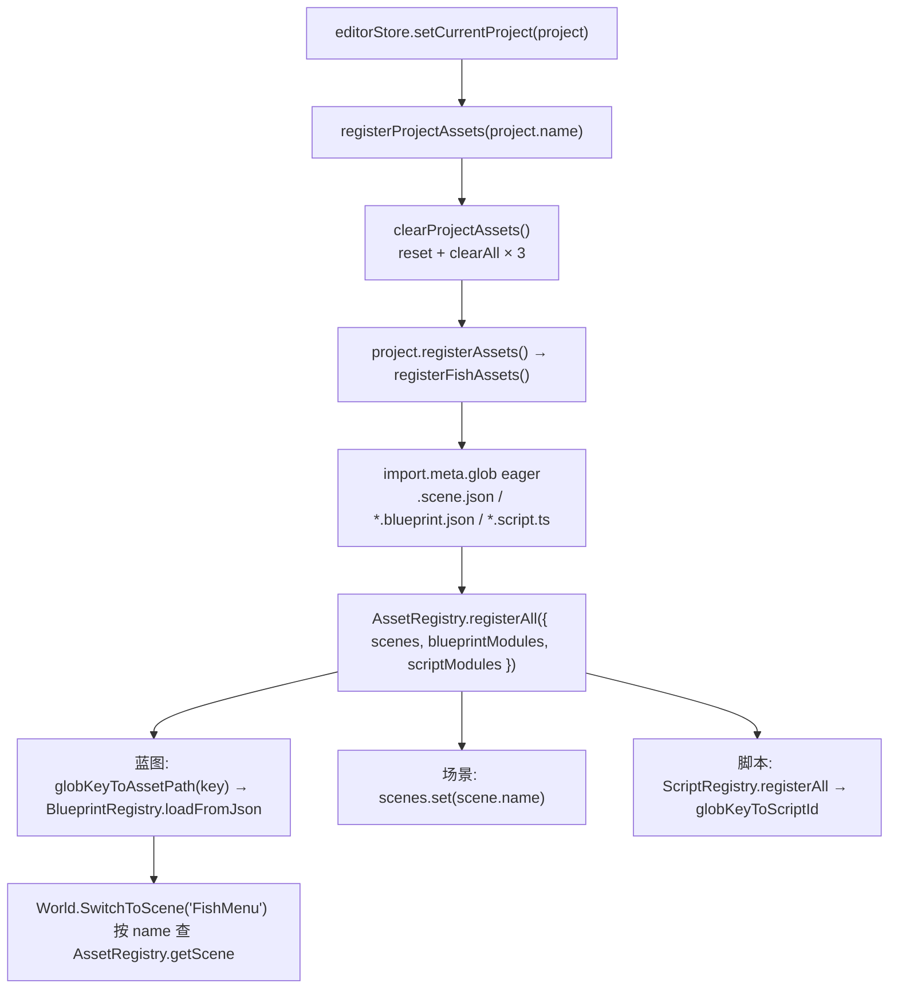

# 资产与工具系统（Asset & Tools）

> **一句话定位**：把 `asset/` 下的 JSON（场景 / 蓝图 / 配置 / 数据表）在运行时变成可查找、可实例化的对象，并为引擎提供「类型字符串 → 工厂」的类型工厂族与配置表缓存。
>
> **什么时候会用到你**：新增 `.scene.json` / `.blueprint.json` / `.config.json` / `.table.json` 后确认有没有注册上；`SwitchToScene` 报「场景未注册」；蓝图或组件 `baseClass` 报「未注册」；`getConfig` 抛「配置未注册」；查对象池为什么回收了正在用的对象。
>
> 代码位置：`src/engine/asset/`、`src/engine/tools/`

---

## 1. 先记住这几个文件

| 文件 | 一句话职责 | 你要改它的场景 |
|---|---|---|
| [AssetRegistry.ts](../../src/engine/asset/AssetRegistry.ts) | 批量注册入口：场景按 `name` 索引，蓝图交 `BlueprintRegistry`，脚本交 `ScriptRegistry` | 新增资产类型、改注册 key 推导规则 |
| [SceneLoader.ts](../../src/engine/asset/SceneLoader.ts) | `SceneAsset` → `THREE.Group` + 节点分类（blueprint/ref/actor） | 加场景节点类型、改 mesh 预览规则 |
| [ConfigRegistry.ts](../../src/engine/tools/ConfigRegistry.ts) | 单例配置 + 数据表两套缓存，同步读 / 异步加载 | 加读取方式、改合并语义、加热更新 |
| [ComponentRegistry.ts](../../src/engine/tools/ComponentRegistry.ts) | 组件「类型字符串 → 工厂 + 配置器」，内置工厂集中注册处 | 新增内置组件、排查「属性被静默丢弃」 |

**关键心智模型**：这里有**两种完全不同的「注册」**，别混为一谈——

1. **资产注册**（数据）：JSON 文件 → 注册表，按**文件路径**做 key，由 `import.meta.glob` 自动完成。
2. **类型工厂注册**（代码）：类型字符串 → 工厂函数，由 `registerBuiltinComponents()` / 项目 `register.ts` 手动完成。

蓝图 JSON 里的 `baseClass: 'FishHouse'` 命中第 2 类；`ref: 'asset/blueprints/x.blueprint.json'` 命中第 1 类。

---

## 2. 资产怎么被加载：从文件到运行时对象

### 2.1 谁触发了加载

资产不是引擎启动时加载的，而是**打开工程时**由编辑器状态层触发（[editorStore.ts](../../src/stores/editorStore.ts):220）：

```ts
void import("../projects/registry")                 // 动态 import：斩断 agent 窗口的依赖边
  .then(({ registerProjectAssets, clearProjectAssets }) => {
    // 先注册/清空资产，再切换 currentProject，保证状态一致（资产就绪后才对外可见）
    if (project) registerProjectAssets(project.name)
    else clearProjectAssets()
    set({ currentProject: project, dynamicTabs: [], activeTabId: "scene", assetSelection: null })
  })
```

> **为什么用动态 `import`**：Agent 独立窗口（`agent.html`）也依赖这个 store，顶层静态导入会把**全部游戏资产和 gameplay 脚本**拖进 agent 的依赖图。动态 import 斩断这条边，只有主编辑器首次切工程时才加载一次。
> **为什么先注册资产再 `set(currentProject)`**：资产未就绪时 UI 就可见的话，场景大纲、蓝图下拉框会读到空注册表。

`registerProjectAssets` 定义在 [registry.ts](../../src/projects/registry.ts):119：

```ts
export function registerProjectAssets(name: string): void {
  clearProjectAssets()   // 清空上一个工程的资产
  const project = projectModuleMap.get(name)
  if (project?.registerAssets) {
    project.registerAssets()
  }
}
// clearProjectAssets() 三件套：AssetRegistry.reset() + BlueprintRegistry.clearAll() + ScriptRegistry.clearAll()
```

三个必须一起清——少清任何一个，切换工程后都会残留上一个工程的资产。

### 2.2 注册链路：`import.meta.glob` 怎么做到「新增文件不用改代码」

[fish/asset/index.ts](../../src/projects/fish/asset/index.ts) 全文就是注册逻辑：

```ts
export function registerFishAssets(): void {
  const sceneModules = import.meta.glob<{ default: SceneAsset }>('./**/*.scene.json', { eager: true })
  const scenes = Object.values(sceneModules).map((m) => m.default as SceneAsset)
  // 蓝图传原始 glob 结果（要 key 推导注册路径）；UI widget 不带 .blueprint 后缀，单独一条 glob
  const bpModules = import.meta.glob<{ default: BlueprintAsset }>(
    ['./blueprints/**/*.blueprint.json', './blueprints/ui/**/*.json'],
    { eager: true },
  )
  const scriptModules = import.meta.glob<{ default: BehaviourScriptConstructor }>(
    '../gameplay/**/*.script.ts',
    { eager: true },
  )

  AssetRegistry.registerAll({ scenes, blueprintModules: bpModules, scriptModules })
}
```

**三个反直觉点**：

**① `{ eager: true }` 决定拿到的是「模块」还是「加载函数」。** eager 模式下 Vite 在构建期就把匹配文件静态打进 bundle，glob 返回 `{ 路径: 模块对象 }`，可直接 `.default` 取内容；非 eager 返回 `{ 路径: () => import(...) }`，必须 `await`。场景/蓝图/脚本都是启动即需且体积可控，所以用 eager。

**② 蓝图传的是「原始 glob 结果」而不是 `Object.values()`。** 场景只要内容，蓝图必须连 key 一起传——**注册 key 由文件路径推导，JSON 里不写 path**。推导函数在 [AssetRegistry.ts](../../src/engine/asset/AssetRegistry.ts):38：

```ts
/** 将 import.meta.glob key（相对 asset/，如 "./blueprints/foo.blueprint.json"）转为注册路径（asset/...） */
function globKeyToAssetPath(key: string): string {
  // "./blueprints/foo.blueprint.json" → "asset/blueprints/foo.blueprint.json"
  const cleaned = key.replace(/^\.\//, '')
  return cleaned.startsWith('asset/') ? cleaned : `asset/${cleaned}`
}
```

所以 `ref` 写的是 `asset/blueprints/troops/barbarian.blueprint.json`——这个字符串**从 glob 目录结构推出**，与 JSON 内容无关。挪动文件 = 改注册 key = 所有引用它的 `ref` 失效。脚本 id 同理（[ScriptRegistry.ts](../../src/engine/script/ScriptRegistry.ts):32，去掉 `../` 前缀与 `.script.ts` 后缀）。

**③ 场景的 key 不走 glob 推导，走 JSON 内的 `name` 字段。** `registerAll` 里场景是 `scenes.set(name, scene)`，蓝图是 `BlueprintRegistry.loadFromJson(path, bp)`。场景缺 `name` 只 warn 跳过：

```ts
const name = scene.name
if (!name) {
  logger.warn('[AssetRegistry] 场景缺少 name，跳过')
  continue
}
AssetRegistry.scenes.set(name, scene)
```



> `ScriptRegistry` 的完整说明见 [脚本系统](./script_system.md)。

### 2.3 `loadScene` 内部：一个 SceneAsset 被拆成两类东西

`loadScene` 在 [SceneLoader.ts](../../src/engine/asset/SceneLoader.ts):46，**只做归集分类，不建任何 mesh、不做实例化**。核心循环：

```ts
for (const node of asset.objects) {
  // ref 节点 — 引用蓝图
  if (node.type === 'ref') {
    refNodes.push({
      ref: node.ref,
      position: node.position ?? [0, 0, 0],
      rotation: node.rotation ?? [0, 0, 0],
      scale: node.scale ?? [1, 1, 1],
      overrides: node.overrides, components: node.components, children: node.children, name: node.name,
    })
    continue
  }
  // actor 节点 — 内联 Actor：收集供 World 层 spawn
  actorNodes.push(node)
}
```

**逐类讲**：场景节点只剩 `ref` / `actor` 两种新格式。`ref` 节点**只收集不建 mesh**，loader 层不认识蓝图内容，必须等 `World` 调 `BlueprintRegistry.resolve` 后才能实例化；`actor` 节点同样只收集，渲染由 spawn 出的 Actor 自带 MeshComponent（编辑器预览经 `PreviewObjectFactoryComponent`）。旧格式几何节点（box/plane/sprite/checkerFloor/gridLines 等）与 `blueprint` 透传节点已从类型与 loader 中**整体移除**——资产里残留会被 assetLint 报 `unknown-kind` error（见 [nodeCheckers.ts](../../src/editor/asset/assetLint/checkers/nodeCheckers.ts) 头部注释）。

返回的 `SceneGroup.group` 现在是空壳（保留字段兼容既有签名），真正的可视对象全部由 `World.loadSceneAsActors` / `ScenePreviewManager.loadSceneAsset` spawn 的 Actor 承担，无需 mesh 级 dispose。

真正的实例化在 [World.ts](../../src/engine/gameflow/World.ts):519 的 `loadSceneAsActors`：先 `loadScene(sceneAsset)`，再把 `actorNodes` / `refNodes` 逐个 spawn 并挂到场景根 Actor 下。

---

## 3. 类型工厂、配置表与对象池

### 3.1 组件 / Actor 工厂：`registerBuiltinComponents` 的幂等防护

`ComponentRegistry.register` 就是 `entries.set(type, { factory, configure })`，**没有任何去重校验**：`Map.set` 对已存在的 key 是「静默覆盖」，后注册的赢。所以**去重防护不在这层，而在调用方**。

防护在 [registerBuiltinComponents.ts:53](../../src/engine/tools/registerBuiltinComponents.ts) 的模块级标记（[registerBuiltinActors.ts:12](../../src/engine/tools/registerBuiltinActors.ts) 同一套写法）：

```ts
let _registered = false

/** 注册所有内置 Component（幂等，重复调用无副作用） */
export function registerBuiltinComponents(): void {
  if (_registered) return
  _registered = true
  // ... 几百行 ComponentRegistry.register(...) 调用
```

> **为什么需要它**：这两个函数在 [registry.ts](../../src/projects/registry.ts):80 被 `registerAllProjectModules` 调用，而后者在 HMR 重载时会再跑一遍。没有标记，每次热更新都会重建全部工厂。

`ComponentRegistry.create` 还藏了一个**很有价值的自诊断**——工厂漏接检测：

```ts
// 用 Proxy 记录工厂实际读了哪些 key，跑完把「传了但没读过」的键报 error
function runWithDropCheck(type: string, context: string, props: PropertyPatch, run: (p: PropertyPatch) => void): void {
  if (!props || typeof props !== 'object') { run(props); return }
  const accessed = new Set<string>()
  const tracked = new Proxy(props, {
    get(target, key) {
      if (typeof key === 'string') accessed.add(key)
      return (target as Record<string | symbol, unknown>)[key]
    },
  })
  run(tracked)
  const dropped = Object.keys(props).filter((k) => !accessed.has(k) && !GENERIC_PROP_KEYS.has(k))
  for (const k of dropped) {
    const dedupe = `${type}:${k}`
    if (warnedDroppedProps.has(dedupe)) continue    // 同类漏接只报一次，避免每实例刷屏
    warnedDroppedProps.add(dedupe)
    logger.error(
      `[ComponentRegistry] "${type}" 工厂未消费属性 "${k}"（${context}）——该字段被静默丢弃，请检查 registerBuiltinComponents 工厂白名单与 assetLint schema 是否同步`,
    )
  }
}
```

> 背景是白名单漏接（历史上 `UIImageComponent.gradient`）以前是**静默丢弃**，只能靠白屏等视觉异常反推。配合「组件新增字段必须同步资产 + assetLint」的约定，这条 error 是最后一道防线。
>
> 两个约束：`name` 在 `GENERIC_PROP_KEYS` 白名单里（工厂不读，调用方在 create 返回后写 `comp.name`）；**异步存引用后再读 props 的工厂检测不到**。

### 3.2 GameMode 工厂

[GameModeRegistry.ts](../../src/engine/tools/GameModeRegistry.ts):20 最简单——`mode` 字符串 → 构造函数，`create(mode)` 未注册返回 `null`。它是**场景资产与 gameplay 之间的唯一接缝**：`SceneAsset.mode` 通过它决定起哪个 GameMode。注册写在项目侧（[fish/register.ts](../../src/projects/fish/register.ts):20）：

```ts
GameModeRegistry.register('menu', FishMainMenuGameMode)   // 项目 register.ts 里一行一个 mode
```

`World.SwitchToScene` 在 [World.ts](../../src/engine/gameflow/World.ts):687 显式校验这道接缝——`if (!mode || !GameModeRegistry.has(mode))` 就 log error 并返回 `false`。

### 3.3 配置表：`ConfigRegistry` 的单例 / 多例语义

两种形态共用一套缓存，但**失败语义不同**，这是最容易踩的坑：

| | 单例配置（`*.config.json`） | 数据表（`*.table.json`） |
|---|---|---|
| 注册默认值 | `registerDefaults(name, defaults)` | 无（无默认值概念） |
| 同步读取 | `getConfig<T>(name): T` | `getTable<Row>(name): DataTable<Row> \| undefined` |
| 未注册时 | **抛 Error**（视为编程错误） | 返回 `undefined` |
| 读取失败 | 不缓存 → 回退默认值 | 不缓存 → 返回 `undefined` |

`getConfig` 的三级回退（[ConfigRegistry.ts](../../src/engine/tools/ConfigRegistry.ts):74）：

```ts
const cached = this.configs.get(name);  if (cached !== undefined) return cached as T
const def = this.defaults.get(name);     if (def !== undefined) return def as T
throw new Error(`[ConfigRegistry] 配置 "${name}" 未注册（需先 registerDefaults / loadConfig）`)
```

> 这个设计让 `loadConfig` 可以 **fire-and-forget**（`void this.loadConfig(...)`）：JSON 经 IPC 异步读，但消费方（GameMode / Pawn 构造）是同步的。竞态下最多首帧用默认值，**不抛错、不返回 undefined**。
>
> 反过来 `getTable` 返回 `undefined` 而不是抛错，因为数据表**经常真的没配**。消费方一律 `?? null` 或 `if` 守卫——[EatFishGameMode.ts](../../src/projects/eatfish/EatFishGameMode.ts):60 即 `ConfigRegistry.getTable<FishArchetype>('eatfish.fish') ?? null`。

半自动注册（[ConfigRegistry.ts](../../src/engine/tools/ConfigRegistry.ts):136）：

```ts
const rel = key.replace(/^\.\//, '')
const name = `${projectName}.${rel.replace(/\.config\.json$/, '')}`   // cannon.config.json → fish.cannon
const path = `src/projects/${projectName}/asset/config/${rel}`
void this.loadConfig(name, path, this.configTransforms.get(name) as ((raw: any) => unknown) | undefined)
```

**规则**：`cannon.config.json` → `fish.cannon`。注意**配置名前缀来自 `ConfigLoaderBase` 构造参数**（`super('fish', log)`），不是 `ProjectModule.name`（那个是 `'ClashMaster'`）。

**`transform` 必须先注册**：`registerGlob` 内部是 `void loadConfig(...)` 立刻发起异步加载，晚注册的 transform 读不到。[FishConfigLoader.ts](../../src/projects/fish/FishConfigLoader.ts) 的顺序是铁律——先 `registerDefaults` / `registerTableTransform`，最后一行才 `registerGlob`。

`mergeConfig`（[ConfigRegistry.ts:222](../../src/engine/tools/ConfigRegistry.ts)）的语义：**顶层键整体替换，不做深合并**。数组尤其危险——JSON 里写了一半数组，不会和默认值的另一半合并，而是整个覆盖。

`DataTable` 构造后**不可变**，没有 mutation API。热更新靠 `ConfigRegistry.reload` **整体替换实例**，避免外部持旧引用时被静默篡改。

### 3.4 对象池 `ObjectPool`

[ObjectPool.ts](../../src/engine/tools/ObjectPool.ts):36。被池化的类必须同时是 `Actor` 且实现 `IPoolable`（`activate` / `deactivate` / `active`），即 `class Xxx extends Actor implements IPoolable`。

`acquire` 的超限策略（:79）：

```ts
acquire(opts?: any): T {
  if (this.free.length === 0) {
    if (this.maxSize > 0 && this.all.length >= this.maxSize) {
      // 达到上限：回收最老的活跃对象（不是拒绝分配）
      for (const obj of this.all) {
        if (obj.active) { this.doRelease(obj); break }
      }
    }
    const obj = this._newInstance()
    this.all.push(obj)
    this.free.push(obj)
  }
  const obj = this.free.pop()!
  obj.activate(opts)
  obj.root.visible = true
  this.totalAllocated++
  return obj
}
```

> **`maxSize` 超限时会「偷」一个正在活跃的对象**，不是拒绝分配。被偷的对象仍被业务逻辑引用，但已 `deactivate` + `root.visible = false`——表现为「子弹飞到一半凭空消失」。容量要按同屏峰值配，[FishObjectPools.ts](../../src/projects/fish/gameplay/game/FishObjectPools.ts):38 给的是子弹 30 / 网 20 / 闪光 30 / 气泡 15 / 兵种每类 50。`maxSize = 0` 表示**不限制**，永不回收。
>
> 隐藏靠 `root.visible = false`，对象**始终留在场景图里**，不参与活跃逻辑但也不销毁。

`_newInstance` 区分两种工厂——ES6 class 不能无 `new` 调用，必须用 `Reflect.construct(f, [])`；箭头函数工厂（无 `prototype`）直接 `f()`。

---

## 4. 关键方法速查

| 方法 | 位置 | 干什么 | 注意 |
|---|---|---|---|
| `AssetRegistry.registerAll` | [AssetRegistry.ts:58](../../src/engine/asset/AssetRegistry.ts) | 批量注册场景/蓝图/脚本 | 蓝图必须传**原始 glob 结果**（要 key） |
| `AssetRegistry.getScene` | [AssetRegistry.ts:100](../../src/engine/asset/AssetRegistry.ts) | 按 `SceneAsset.name` 取场景 | 未注册返回 `null`，不抛错 |
| `AssetRegistry.reset` | [AssetRegistry.ts:126](../../src/engine/asset/AssetRegistry.ts) | 清空场景表（切工程） | 蓝图/脚本要另外清 |
| `BlueprintRegistry.resolve` | [BlueprintRegistry.ts:63](../../src/engine/asset/BlueprintRegistry.ts) | 蓝图 → `ResolvedBlueprint`（带缓存） | 未注册**抛 Error**；**不展开 ref 子节点** |
| `BlueprintRegistry.clearAll` | [BlueprintRegistry.ts:49](../../src/engine/asset/BlueprintRegistry.ts) | 清资产 + 清 resolve 缓存 | 只清资产不清缓存会读到旧数据 |
| `loadScene` | [SceneLoader.ts:49](../../src/engine/asset/SceneLoader.ts) | `SceneAsset` → `SceneGroup` | 只分类不实例化；须调 `dispose()` |
| `ComponentRegistry.create` | [ComponentRegistry.ts:83](../../src/engine/tools/ComponentRegistry.ts) | 按类型字符串造组件（不挂载） | 未注册返回 `null`；跑漏接检测 |
| `ComponentRegistry.configure` | [ComponentRegistry.ts:99](../../src/engine/tools/ComponentRegistry.ts) | 对已有实例应用 props | Actor 自带 TransformComponent 时走这条 |
| `ActorRegistry.create` | [ActorRegistry.ts:28](../../src/engine/tools/ActorRegistry.ts) | 按 `baseClass` 造 Actor | 未注册返回 `null` |
| `GameModeRegistry.create` | [GameModeRegistry.ts:25](../../src/engine/tools/GameModeRegistry.ts) | 按 `mode` 造 GameMode | 未注册返回 `null` |
| `ConfigRegistry.getConfig` | [ConfigRegistry.ts:74](../../src/engine/tools/ConfigRegistry.ts) | 同步读单例配置 | 未注册**抛 Error** |
| `ConfigRegistry.getTable` | [ConfigRegistry.ts:114](../../src/engine/tools/ConfigRegistry.ts) | 同步读数据表 | 未加载返回 `undefined` |
| `ConfigRegistry.registerGlob` | [ConfigRegistry.ts:136](../../src/engine/tools/ConfigRegistry.ts) | 按 glob 批量注册配置 | **transform 必须先注册** |
| `ConfigRegistry.reloadAll` | [ConfigRegistry.ts:176](../../src/engine/tools/ConfigRegistry.ts) | 热更新全部配置/表 | 整体替换 `DataTable` 实例 |
| `DataTable.getRow` | [DataTable.ts:32](../../src/engine/tools/DataTable.ts) | 取单行 | 不存在返回 `undefined` |
| `ObjectPool.acquire` | [ObjectPool.ts:79](../../src/engine/tools/ObjectPool.ts) | 取对象（自动扩容） | 超 `maxSize` 会**回收最老活跃对象** |
| `ObjectPool.release` | [ObjectPool.ts:105](../../src/engine/tools/ObjectPool.ts) | 归还对象 | 已归还会静默 return |
| `ObjectRegistry.reclaimForWorld` | [ObjectRegistry.ts:98](../../src/engine/tools/ObjectRegistry.ts) | 兜底回收某 World 的全部对象 | `EndPlay` 抛错不阻断回收 |
| `registerBuiltinComponents` | [registerBuiltinComponents.ts:56](../../src/engine/tools/registerBuiltinComponents.ts) | 注册全部内置组件工厂 | 模块级 `_registered` 幂等 |

---

## 5. 流程影响：牵动哪些功能

### 5.1 上游：谁驱动它

| 上游 | 怎么驱动 | 相关文档 |
|---|---|---|
| 编辑器切换工程 | `editorStore.setCurrentProject` → `registerProjectAssets` | [../editor/core/core_system.md](../editor/core/core_system.md) |
| 项目注册模块 | `registerAllProjectModules` 调 `registerBuiltinComponents` / `registerBuiltinActors`；`ProjectModule.registerAssets` 挂资产入口 | [../system_overview.md](../system_overview.md) |
| `World.SwitchToScene` | 按 name 查 `AssetRegistry`，按 mode 查 `GameModeRegistry` | [./gameflow_system.md](./gameflow_system.md) |
| 项目 `ConfigLoader` | `registerDefaults` + `registerGlob` 灌入配置缓存 | [./gameflow_system.md](./gameflow_system.md) |
| `ActorManagerComponent.SpawnActorFromBlueprint` | 调 `BlueprintRegistry.resolve` + `ActorRegistry.create` + `ComponentRegistry.create` | [./entity_system.md](./entity_system.md) |

### 5.2 下游：它波及谁

| 下游功能 | 波及点 | 相关文档 |
|---|---|---|
| 场景编辑器预览 | `ScenePreviewManager` 调 `loadScene` 渲染；`dispose()` 不调会泄漏显存 | [../editor/asset/asset_preview_lint_system.md](../editor/asset/asset_preview_lint_system.md) |
| 蓝图编辑器 | `BlueprintEditorService` 用 `getRegisteredPaths` 列蓝图、用 `resolve` 探测可解析性 | [../editor/asset/asset_preview_lint_system.md](../editor/asset/asset_preview_lint_system.md) |
| 资产检查器 assetLint | `AssetSource` 遍历 `getSceneNames` / `getRegisteredPaths` 做全量校验 | [../editor/asset/asset_preview_lint_system.md](../editor/asset/asset_preview_lint_system.md) |
| UI 系统 | `UIManager` 复刻 spawn 流程造 UI Actor；`UIScriptComponent` 按 id 查 `ScriptRegistry` | [./ui_system.md](./ui_system.md) |
| 脚本系统 | `ScriptRegistry` 由 `registerAll` 统一调用，id 从 glob key 推导 | [./script_system.md](./script_system.md) |
| GameMode / Pawn 构造 | 同步 `getConfig` / `getTable` 取数值 | [./gameflow_system.md](./gameflow_system.md) |
| 对象池化实体 | 子弹/渔网/兵种走 `ObjectPool`，超容量会抢活跃对象 | [./entity_system.md](./entity_system.md) |
| 渲染 | `SceneLoader` 建 mesh，`makeMaterial` / `loadTexture` 决定材质 | [./rendering_system.md](./rendering_system.md) |

---

## 6. 踩坑清单（都是真踩过的）
**1. 蓝图挪了目录，所有引用它的 `ref` 全部失效** —— 蓝图注册 key 由 glob 文件路径推导（`globKeyToAssetPath`），JSON 里不存 path。规则：**移动 `.blueprint.json` = 改注册 key**，必须同步改所有 `ref` 引用。
**2. `BlueprintRegistry.resolve` 不展开 ref 子节点** —— 类头注释写着「递归展开为内联数据」，但 `resolveChildren` 的实现是把 ref **原样保留为单节点**（`ref: chdef.ref`），只做环检测和 `clonePatch`。真正的递归在 `ActorManagerComponent.SpawnActorFromBlueprint`（:465 对 `child.ref` 递归调自身）。规则：**想在 resolve 结果里看到内联子节点是错的**，要看到实例化后的树得看 spawn 阶段。
**3. `getConfig` 抛「配置未注册」** —— 配置名是 `{projectName}.{文件名}`，前缀来自 `ConfigLoaderBase` 构造参数（`'fish'`）而不是 `ProjectModule.name`（`'ClashMaster'`）。规则：照 `super('fish', log)` 的值拼名，`cannon.config.json` → `fish.cannon`。
**4. 配置的 transform 没生效** —— `registerGlob` 内部 `void loadConfig(...)` 立即发起异步加载，晚一步注册的 transform 读不到。规则：`registerConfigTransform` / `registerTableTransform` 必须写在 `registerGlob` **之前**。
**5. 配了数组字段却只留下一半** —— `mergeConfig` 对 override 中的键做**整体替换**，含数组，不做元素级合并。规则：JSON 里覆盖数组必须写全量。
**6. 组件属性被静默丢弃** —— 工厂白名单漏接以前只能靠白屏反推。现在 `runWithDropCheck` 会报 `[ComponentRegistry] "X" 工厂未消费属性 "Y"`。规则：见到这条 error 就同步工厂白名单与 assetLint schema。注意 `name` 在白名单里不算漏接；异步工厂检测不到。
**7. 场景切来切去显存一直涨** —— `loadScene` 返回的 `SceneGroup.dispose()` 没调，geometry/material 不释放。规则：每次 `loadScene` 的结果都必须在场景卸载时 `dispose()`；重复调是安全的（`disposed` 标记幂等）。
**8. 切工程后还能看到上一个工程的蓝图** —— `clearProjectAssets` 漏清任何一个注册表都会残留。规则：三个一起调——`AssetRegistry.reset()` + `BlueprintRegistry.clearAll()` + `ScriptRegistry.clearAll()`。
**9. `checkerFloor` 在负坐标区域颜色错乱** —— JS 的 `%2` 对负数返回负值，`colors[-1]` 越界。规则：索引必须取绝对值（`Math.abs((Math.round(x) + Math.round(z)) % 2)`），别把这个 `Math.abs` 优化掉。
**10. 子弹飞一半消失** —— `ObjectPool.acquire` 达到 `maxSize` 时回收**最老的活跃对象**，该对象此时仍被业务逻辑引用。规则：`maxSize` 按同屏峰值配置，不要按平均值配。
**11. 场景资产没出现在大纲里** —— `SceneAsset.name` 缺失时 `registerAll` 只 `logger.warn` 跳过，不报错。规则：查日志 `[AssetRegistry] 场景缺少 name，跳过`。

---

## 7. 边界条件

| 条件 | 行为 | 怎么应对 |
|---|---|---|
| `BlueprintRegistry.resolve` 未注册路径 | `throw new Error('Blueprint "X" 未注册')` | 调用方 try/catch；`SpawnActorFromBlueprint` 已接住 |
| 蓝图 ref 循环引用 | `throw new Error('检测到 Blueprint ref 循环引用')` | `resolving` Set 检测；编辑器层回滚 |
| `getConfig` 未注册 | 抛 Error（视为编程错误） | 先 `registerDefaults` 或 `loadConfig` |
| `getTable` 未加载 | 返回 `undefined`（非编程错误） | 消费方 `?? null` 或 `if` 守卫 |
| `loadConfig` / `loadTable` 读取失败 | 不缓存；配置回退默认值，表返回 `undefined` | 引擎内置降级，fire-and-forget 安全 |
| 无 `electronAPI.readJsonFile` | `readJson` 返回 `null` 并 warn → 全部走默认值 | 浏览器调试模式必然如此，非 bug |
| 顶层 `_` 前缀键 | `stripMeta` 剔除 | 用 `_comment` 在 JSON 里写注释 |
| `AssetRegistry.getScene` 未注册 | 返回 `null` | 调用方判空；`SwitchToScene` 已判并 log error |
| `AssetRegistry.getSceneByMode` | 返回第一个匹配 | **当前无调用方**，属预留 API |
| `ComponentRegistry` 重复注册同名类型 | `Map.set` 静默覆盖，无任何告警 | 靠 `registerBuiltinComponents` 的 `_registered` 幂等标记防护 |
| `ObjectPool` 超限（`maxSize > 0`） | 回收最老的活跃对象 | 按同屏峰值配容量 |
| `ObjectPool` 的 `maxSize = 0` | 不限制，永不回收 | 需手动 `release` / `releaseAll` |
| `resolve` 返回对象被修改 | 只读约定（properties 已 `clonePatch`） | 实例化时用 `clonePatch` 深拷贝 |
| `DataTable` 需要更新 | 无 mutation API | 用 `ConfigRegistry.reload` 整体替换实例 |
| `loadScene` 结果不再使用 | geometry/material 不自动释放 | 必须显式调 `dispose()` |
