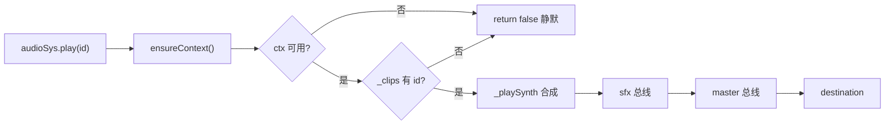

# 音频系统（AudioSys）

> **一句话定位**：WebAudio 三总线 + 程序化合成音效的引擎音频单例，gameplay 代码直接 `audioSys.play()` 发声，随 Game 启动收集、停止统一静默。
> **什么时候会用到你**：给 gameplay 代码加音效/BGM 时；排查"没声音/游戏停了声音还在"时；想给项目注入自定义音效片段时。
> 代码位置：`src/engine/audio/AudioSys.ts`

## 1. 先记住这几个文件

| 文件 | 一句话职责 | 你要改它的场景 |
|---|---|---|
| [AudioSys.ts](../../src/engine/audio/AudioSys.ts) | 全部实现：总线 / 合成 / 播放 / 3D 衰减 / 生命周期 | 加音效类型、调音量曲线、接入音频文件 buffer |
| [Game.ts](../../src/engine/gameflow/Game.ts) | 把 AudioSys 纳入 GameSingleton 收集与回收 | 调整单例回收顺序时 |
| [index.ts](../../src/engine/index.ts) | 导出 `AudioSys` / `audioSys` 与四个公开类型 | 新增公开类型时 |

**关键心智模型**：当前唯一的音源是**程序化合成**——振荡器/白噪声实时算出波形，没有音频文件。`play('hit.light')` 播的不是文件，而是 `registerDefaults()` 预注册的一组 `SynthClipSpec` 规格。`audio.table.json` 消费链路只是注释里的约定，代码中尚无接线（见踩坑 4）。

## 2. 主流程：从 `audioSys.play()` 到扬声器出声

### 2.1 谁在调用它

全部调用方在 arena 项目（fish/clash_master 尚未接入）：

```ts
// src/projects/arena/gameplay/SlimeActor.ts:91 —— 3D 衰减播放，最大可闻 40 米
audioSys.playAt('enemy.hit', this.root.position, { maxDistance: 40 })

// src/projects/arena/gameplay/PlayerCombatComponent.ts:106 —— 连招挥击，2D 全局
audioSys.play(COMBO[this._stage].swingSfx, { volume: 0.8 })

// src/projects/arena/gameplay/ArenaGameMode.ts:189 —— 每帧把玩家位置注入为监听点
audioSys.setListener(p.x, p.y, p.z)
```

注意 `ArenaGameMode.ts:189`：**没有谁自动把相机/玩家位置喂给音频系统**。`playAt` 的距离衰减基准完全依赖游戏侧每帧 `setListener`，这是刻意设计——头注释写明"活跃相机位置钩子已移除：监听点由游戏侧每帧 setListener 注入（解耦渲染层）"。新项目要做 3D 音效，必须在 GameMode/Controller 的 tick 里补这一行，否则 `playAt` 静默回退 2D。

### 2.2 `play()` 内部做的 4 件事



① 惰性建上下文——不在构造时创建 AudioContext：

```ts
// AudioSys.ts:227
private ensureContext(): AudioContext | null {
  if (!this.supported) return null
  if (this._ctx) {
    if (this._ctx.state === 'suspended') void this._ctx.resume().catch(() => {})
    return this._ctx
  }
  try {
    const Ctor = (window.AudioContext ?? (window as unknown as { webkitAudioContext: typeof AudioContext }).webkitAudioContext)
    const ctx = new Ctor()
    const master = ctx.createGain()
    master.connect(ctx.destination)
    const bgm = ctx.createGain()
    const sfx = ctx.createGain()
    bgm.connect(master)
    sfx.connect(master)
    master.gain.value = this._volumes.master * this._volumes.master
    ...
```

首次播放才创建 AudioContext：浏览器 autoplay 策略禁止页面加载即发声，惰性创建 + 每次播放前 `resume()` 让"用户手势后的第一次 play"成为解锁点。`void ... .catch(() => {})` 不 await——resume 失败也只是本次没声，不能让 gameplay 调用链被音频拖死。总线拓扑是 `bgm/sfx → master → destination` 三节点，各自 GainNode 独立调音量。

② 查片段表，未知 id 静默失败：

```ts
// AudioSys.ts:158
play(clipId: string, opts?: PlayOptions): boolean {
  const ctx = this.ensureContext()
  if (!ctx || !this._buses) return false
  const clip = this._clips.get(clipId)
  if (!clip?.synth) return false
  this._playSynth(clip.synth, opts ?? {}, clip.volume ?? 1, this._buses[opts?.bus ?? 'sfx'])
  return true
}
```

返回 `boolean` 而不是抛错：音效缺失不该炸游戏逻辑。代价是拼错 clip id 得不到任何报错，排查"没声音"先打 `audioSys.clipIds` 对照（见踩坑 5）。

③ 合成——包络 → 滤波器 → 发声体：

```ts
// AudioSys.ts:266（节选）
private _playSynth(spec: SynthClipSpec, opts: PlayOptions, clipVolume: number, bus: GainNode): void {
  const t0 = ctx.currentTime
  const peak = (spec.gain ?? 0.5) * clipVolume * (opts.volume ?? 1)
  if (peak <= 0.0001) return
  const env = ctx.createGain()
  env.gain.setValueAtTime(0.0001, t0)
  env.gain.linearRampToValueAtTime(peak, t0 + Math.max(0.002, spec.attack ?? 0.005))
  env.gain.exponentialRampToValueAtTime(0.0001, t0 + dur)
  env.connect(bus)
  ...
  if (spec.kind === 'osc') {
    const osc = ctx.createOscillator()
    osc.frequency.setValueAtTime(Math.max(1, (spec.freqFrom ?? 440) * rate), t0)
    if (spec.freqTo !== undefined) {
      osc.frequency.exponentialRampToValueAtTime(Math.max(1, spec.freqTo * rate), t0 + dur)
    }
    osc.start(t0); osc.stop(t0 + dur + 0.02)
  } else {
    const src = ctx.createBufferSource()
    src.buffer = this._getNoiseBuffer(ctx)
    src.start(t0, Math.random() * 0.5, dur + 0.02)
  }
}
```

三个音量因子连乘（`spec.gain × clip.volume × opts.volume`），任何一层想压音量都不用改别的层。`peak <= 0.0001` 直接 return：WebAudio 里挂一个全零增益节点是纯浪费。噪声源 `start` 偏移随机 0~0.5 秒——同一 clip 连播两次波形不同，避免机关枪式的重复感。振荡器频率扫线（`freqFrom → freqTo` 指数插值）是合成音效"有表情"的关键：`player.die` 从 240Hz 扫到 50Hz 就是下滑的"死亡音"。

④ 自清理——节点播完自动断连：

```ts
osc.onended = () => { osc.disconnect(); env.disconnect() }
```

一次性节点靠 `onended` 回收，不留节点引用表。对比 BGM：持续音层无法靠 `onended`（永远不 end），所以 `_startSynthLayer` 返回停止函数、由 `_bgmSource` 持有。

### 2.3 3D 衰减：`playAt` 是 `play` 的音量预处理器

```ts
// AudioSys.ts:172
playAt(clipId: string, pos: { x: number; y: number; z: number }, opts?: PlayOptions & SpatialOptions): boolean {
  const listen = this._listener
  if (!listen) return this.play(clipId, opts)
  const maxD = opts?.maxDistance ?? 25
  const refD = opts?.referenceDistance ?? 2
  const d = Math.hypot(pos.x - listen.x, pos.y - listen.y, pos.z - listen.z)
  if (d >= maxD) return false
  const falloff = d <= refD ? 1 : 1 - (d - refD) / (maxD - refD)
  const vol = (opts?.volume ?? 1) * falloff * falloff
  return this.play(clipId, { ...opts, volume: vol })
}
```

`playAt` 不碰 WebAudio，只算距离衰减系数再转手 `play`：`referenceDistance` 内全音量、`maxDistance` 外直接 false 不发声、中间线性衰减再**平方**压听感（线性 falloff 在远距离衰减过慢，平方后近处变化平缓、远处收得快）。没有 PannerNode 立体声定位——这是纯音量模型，左右声道不随方位变化。

## 3. 生命周期：GameSingleton 收集与回收

AudioSys 实现了 `reset()`，由 Game 统一纳管：

```ts
// src/engine/gameflow/Game.ts:242 —— launch 时收集
this._singletons = [PhySys, AIModule.instance, AudioSys.instance]

// Game.ts:296 —— shutdown 时统一回收
for (const s of this._singletons) {
  s.reset()
  logger.info(`[Game] 单例已回收: ${s.name}`)
}
```

```ts
// AudioSys.ts:363
reset(): void {
  this.stopBgm(0)
  if (this._ctx && this._ctx.state === 'running') {
    void this._ctx.suspend().catch(() => {})
  }
  this._listener = null
}
```

三个动作：停 BGM、挂起 AudioContext（一次性节点已按时长自然结束，无需逐个 stop）、清监听点。**不销毁 `_ctx` 也不清 `_clips`**——下局游戏直接复用上下文和片段表，重建 AudioContext 有可闻的初始化开销。suspend 而非 close：close 后再播要重建整条总线，suspend 恢复只是 `resume()` 一次调用。

## 4. 关键方法速查

| 方法 | 位置 | 干什么 | 注意 |
|---|---|---|---|
| `play(clipId, opts?)` | [AudioSys.ts:158](../../src/engine/audio/AudioSys.ts) | 2D 一次性播放 | 未知 id 返回 false 不抛错 |
| `playAt(clipId, pos, opts?)` | [AudioSys.ts:172](../../src/engine/audio/AudioSys.ts) | 3D 距离衰减播放 | 未 setListener 时回退 2D |
| `playBgm(clipId, fade?)` | [AudioSys.ts:188](../../src/engine/audio/AudioSys.ts) | BGM 淡入 crossfade | 同曲幂等；仅 synth 音垫 |
| `stopBgm(fade?)` | [AudioSys.ts:215](../../src/engine/audio/AudioSys.ts) | 停 BGM | 自身 fade 参数被忽略，见踩坑 2 |
| `setListener(x, y, z)` | [AudioSys.ts:151](../../src/engine/audio/AudioSys.ts) | 注入 3D 监听点 | 游戏侧每帧调用 |
| `setVolume(bus, v)` | [AudioSys.ts:140](../../src/engine/audio/AudioSys.ts) | 设总线音量 | 平方感性曲线，立即生效 |
| `registerClip(s)` | [AudioSys.ts:118](../../src/engine/audio/AudioSys.ts) | 注册/覆盖片段 | 覆盖内置同名 id 即换音 |
| `ensureContext()` | [AudioSys.ts:227](../../src/engine/audio/AudioSys.ts) | 惰性建 ctx + 总线 | suspended 自动 resume |
| `_playSynth(...)` | [AudioSys.ts:266](../../src/engine/audio/AudioSys.ts) | 合成一次性音效 | 三层音量连乘 |
| `_startSynthLayer(...)` | [AudioSys.ts:312](../../src/engine/audio/AudioSys.ts) | 合成 BGM 持续音垫 | 双振荡器失谐 + 低八度铺底 |
| `registerDefaults()` | [AudioSys.ts:337](../../src/engine/audio/AudioSys.ts) | 注册 18 个内置 synth | 构造时调用 |
| `reset()` | [AudioSys.ts:363](../../src/engine/audio/AudioSys.ts) | Game.shutdown 回收 | 挂起 ctx，不销毁 |

## 5. 流程影响：牵动哪些功能

### 上游：谁驱动它

| 上游 | 怎么驱动 | 相关文档 |
|---|---|---|
| `Game.launch` | 收集进 `_singletons`，绑定运行生命周期 | [gameflow_system.md](./gameflow_system.md) |
| `Game.shutdown` | 调 `reset()` 停 BGM / 挂起 ctx | [gameflow_system.md](./gameflow_system.md) |
| arena gameplay（SlimeActor / PlayerCombatComponent / ArenaGameMode / ArenaPlayerController） | 战斗/受击/跳跃/拾取/开门事件直接 `play`/`playAt` | [gameplay_code_standard.md](../engine/../projects/gameplay_code_standard.md) |
| `engine/index.ts` | 桶导出 `AudioSys` / `audioSys` / 类型 | [system_overview.md](../system_overview.md) |

### 下游：它波及谁

| 下游功能 | 波及点 | 相关文档 |
|---|---|---|
| 音频资产表（规划中） | `audio.table.json` → `registerClips` 的消费链路仅有注释约定，无代码接线 | [asset_tools_system.md](./asset_tools_system.md) |
| 设置存档（规划中） | 三总线音量目前纯内存，无持久化读取方 | [asset_tools_system.md](./asset_tools_system.md) |

AudioSys 不 import 引擎任何其他模块（仅用 `window`/WebAudio 全局），是引擎里最独立的叶子系统——改它不会波及任何现有功能，被谁 import 才需要关心。

## 6. 踩坑清单（都有代码依据）

**1. 页面刚加载就 play 没声音** —— 原因：autoplay 策略下 AudioContext 创建即 suspended，`ensureContext` 虽会 resume，但手势前 resume 被 浏览器拒绝。规则：首个音频调用放在用户交互（点击/按键）之后，编辑器内"点开始游戏"天然满足。

**2. `stopBgm(2)` 的 2 秒淡出没生效** —— 原因：`stopBgm` 首行 `void fadeSeconds` 显式弃参，实际淡出时长是 `playBgm` 当时闭包里捕获的值。规则：淡出节奏在 `playBgm(id, fadeSeconds)` 时定死，中途改时长需先 stop 再重播。

**3. `playAt` 听不出远近** —— 原因：没人调 `setListener`，回退 2D 全音量（这是设计好的回退，不报错）。规则：要 3D 效果，GameMode/Controller tick 里每帧 `audioSys.setListener(玩家位置)`，参照 `ArenaGameMode.ts:189`。

**4. 以为配了 `audio.table.json` 就有音效** —— 原因：消费链路未接线，全库只有 `AudioSys.ts:16` 注释和 fish 的 devdocs 提及，`registerClip` 无任何资产侧调用方。规则：当前自定义音效只能在代码里 `registerClip(s)`；等接线后此处必须更新。

**5. 拼错 clip id 完全无感知** —— 原因：`play` 对未知 id 静默 `return false`。规则：怀疑没声先 `console.log(audioSys.clipIds)` 对照，内置 18 个 id 见 `registerDefaults()`（`ui.click`、`swing`、`hit.light/heavy`、`player.attack1/2/3`、`player.hurt/die`、`enemy.hit/die`、`slime.jump/attack`、`pickup.coin`、`heal`、`dodge`、`door.open`、`combo.ready`）。

## 7. 边界条件

| 条件 | 行为 | 怎么应对 |
|---|---|---|
| 无 AudioContext 环境（SSR/测试桩） | `supported=false`，全 API 静默返回 false/空 | 无需特判，调用方零成本 |
| `ensureContext` 构造失败 | catch 返回 null，播放静默跳过 | 查控制台外的环境问题（如禁用 WebAudio） |
| ctx suspended | 每次播放前自动 `resume()` | 保证用户手势后调用即可 |
| 同 id 重复 `playBgm` | 直接 `return true`，不重播不闪断 | 换曲才 crossfade |
| 距离 ≥ maxDistance | `playAt` 返回 false，不创建节点 | 超远音源零开销 |
| 音量乘积 ≤ 0.0001 | 不发声，不挂节点 | 全零音量无 GPU/CPU 浪费 |
| `spec.duration < 0.02` | 钳到 0.02 秒 | 防极短音产生爆音 |
| 音频文件 buffer 播放 | 不支持，仅 synth（头注释标注二期） | 需要真实音频文件时先扩 `_playSynth` 之外的 buffer 通道 |
