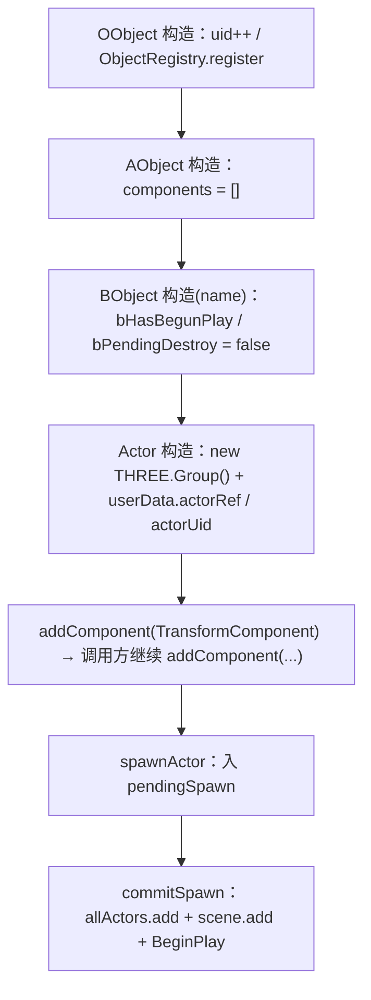

# 实体体系（Engine Entity）

> **一句话定位**：实体体系是「场景里一切看得见的东西」的对象骨架——四级基类 `OObject → AObject → BObject → Actor` 逐级加能力（注册 → 组件容器 → 生命周期 → 场景节点），Actor 再用 `THREE.Group` + 子 Actor 树把对象挂进 Three.js 场景。
> **什么时候会用到你**：写一个新 Actor 行为类时、给 Actor 挂组件时、查「组件为什么没 Tick / 为什么 BeginPlay 没跑 / 为什么删不掉」时、给组件加 Inspector 可编辑属性时、查蓝图实例为什么没吃到 overrides 时。代码位置：`src/engine/entity/`

---

## 1. 先记住这几个文件

| 文件 | 一句话职责 | 你要改它的场景 |
|---|---|---|
| [Actor.ts](../../src/engine/entity/Actor.ts) | 场景对象本体：`root` 变换、子 Actor 树、可见性、销毁入口、属性补丁入口 | 加变换/层级/销毁相关能力；查生命周期不生效 |
| [BObject.ts](../../src/engine/entity/BObject.ts) | 生命周期主人：`BeginPlay / Tick / drawGizmos / EndPlay` 递归组件，外加 `bHasBegunPlay` 防重 | 改生命周期传播规则 |
| [ActorComponent.ts](../../src/engine/entity/ActorComponent.ts) | 组件基类 + `EditableProperty` 契约（`getEditableProperties` / `getPersistentProps`） | 给组件加一个 Inspector 可编辑字段 |
| [ActorManagerComponent.ts](../../src/engine/gameflow/ActorManagerComponent.ts) | Actor 的「生成/销毁/入册」：`SpawnActor` / `commitSpawn` / `SpawnActorFromBlueprint` / `DestroyActor` | 排查「生成了但没进场景」「删不掉」 |

其余（[OObject.ts](../../src/engine/entity/OObject.ts)、[AObject.ts](../../src/engine/entity/AObject.ts)、[AObjectComponent.ts](../../src/engine/entity/AObjectComponent.ts)、[BObjectComponent.ts](../../src/engine/entity/BObjectComponent.ts)）遇到再看。

**关键心智模型**：**① 生命周期不由自己启动**——构造只建对象，`BeginPlay` 由 `commitSpawn` / `World.BeginPlay` 调，`Tick` 只在 `bTickEnabled === true`（**默认 false**）时由 `World.tick` 驱动。**② `attachTo` 的子 Actor 不进 `World.allActors`**——生命周期靠父链递归（父 `BeginPlay` → 子 `BeginPlay`），销毁靠父 `EndPlay` 递归 `destroy()`。**③ `Component.ts` 只是兼容层**——真正的组件基类是 `ActorComponent`，`EditableProperty` 定义在 [ActorComponent.ts:43](../../src/engine/entity/ActorComponent.ts)。

---

## 2. 一个 Actor 的一生：从 new 到 EndPlay

### 2.1 谁创建了 Actor

游戏代码不直接 `new Actor()` 就完事——构造完必须交给世界，否则它永远停在 `pendingSpawn` 队列里，不进场景也不 `BeginPlay`。

```ts
spawnActor(mode.baseCamera)                                                      // 已有实例 → 入队
this.placeGridActor = w.actorMgr.SpawnActorOfType(PlaceGridActor, 'PlaceGrid', { /* ... */ })
spawnFromBlueprint(path, overrides, componentOverrides)                           // 蓝图实例化
```
三条入口最终都汇到 `SpawnActor`（[ActorManagerComponent.ts:99](../../src/engine/gameflow/ActorManagerComponent.ts)）：

```ts
SpawnActor<T extends Actor>(actor: T): T {
  actor.world = this.owner
  this.pendingSpawn.push(actor)
  return actor
}
```

> **这步只做两件事**：写回 `world` 引用、推进 `pendingSpawn` 队列。**没有 `allActors.add`，也没有 `scene.add`**——所以 `new` 完立刻 `getAllActors()` 查不到它。

### 2.2 构造与组件挂载



**构造链：uid 注册 → THREE.Group → 自带变换组件**（[OObject.ts:34](../../src/engine/entity/OObject.ts)、[Actor.ts:36](../../src/engine/entity/Actor.ts)）：
```ts
// OObject 构造（:34）
constructor() {
  this.uid = OObject._nextUid++
  ObjectRegistry.register(this)   // 自动注册到全局对象表（销毁时由 markDestroyed 注销）
}

// Actor 构造
constructor(name = 'Actor') {
  super(name)
  this.root = new THREE.Group()
  this.root.name = name
  this.root.userData.actorRef = this
  this.root.userData.actorUid = this.uid
  // 默认场景组件：Actor 构造即拥有变换能力，与 UE RootComponent 语义一致
  this.addComponent(TransformComponent)
}
```

> **为什么挂全局注册表**：JS 的 GC 只回收「不可达」对象，而 Actor 常被闭包/单例持有强引用。`ObjectRegistry` 解决的是「逻辑已死但仍被引用」的对象——`markDestroyed()` 显式注销，`reclaimForWorld(world)` 按 owner 链兜底回收（[ObjectRegistry.ts:98](../../src/engine/tools/ObjectRegistry.ts)）。**`userData.actorRef` 是编辑器反查的唯一通道**：视口拾取拿到的是 `THREE.Object3D`，`SelectionManager` 靠 `obj.userData?.actorRef` 把它翻回 Actor（[SelectionManager.ts:306](../../src/editor/SelectionManager.ts)），没有它的裸 Group/灯光子对象在大纲里不显示。另外 Actor 构造已自带 `TransformComponent`，蓝图里再声明时不会重复挂载，而是走 `ComponentRegistry.configure` 对已有实例套属性（[ActorManagerComponent.ts:430](../../src/engine/gameflow/ActorManagerComponent.ts)）。

**`addComponent` 的两种重载与「一个 Mesh」硬约束**（[AObject.ts:38](../../src/engine/entity/AObject.ts) / [:70]）：
```ts
// 类版自动 new Cls(this, ...args)（owner 自动传入）；实例版直接使用
const component: AObjectComponent =
  typeof componentOrCls === 'function' ? new componentOrCls(this, ...args) : componentOrCls
// 幂等：同一实例重复添加直接忽略（不重复入列）
if (this.components.includes(component)) { logger.warn(`[AObject] 组件实例重复添加已忽略`); return component }
// 一个 Actor 只能挂一个 mesh（MeshComponent / CapsuleMeshComponent 及子类）：
// 组合多个网格必须拆成子 Actor，保证 Inspector/撤回系统能精确对应"一个 actor ↔ 一个几何"
const isMeshComponent = (c: AObjectComponent): boolean =>
  c.constructor.name === 'MeshComponent' || c.constructor.name.endsWith('MeshComponent')
if (isMeshComponent(component)) {
  const existing = this.components.find(isMeshComponent)   // 已有 Mesh → 拒绝（仍返回实例，不入列）
  if (existing) { logger.error(`[AObject] 拒绝挂载: 已有 ${existing.constructor.name}，组合网格请拆成子 Actor`); return component }
}
```

> **为什么推荐类版 `this.addComponent(BoxMeshComponent, 'ClickZoneMesh')`**：owner 自动传入少写一遍 `this`，且 `...args` 与构造参数编译期严格匹配（不是 `any` 透传）；实例版留给「先配置再挂载」的写法（如 `initClickable` 里先设回调再 `this.addComponent(this.clickable)`，见 [FishHouseActor.ts:103](../../src/projects/fish/gameplay/base/FishHouseActor.ts)）。**Mesh 约束判断用的是类名后缀**：`BoxMeshComponent` / `CapsuleMeshComponent` 全在禁区。被拒时**仍返回组件实例**（不入列），所以拿到返回值不等于挂上了。

### 2.3 BeginPlay 递归传播

`commitSpawn` 是唯一把 Actor 从队列推进世界的门（[ActorManagerComponent.ts:118](../../src/engine/gameflow/ActorManagerComponent.ts)）：

```ts
commitSpawn() {
  if (this.pendingSpawn.length > 0) this._actorListDirty = true
  for (const actor of this.pendingSpawn) {
    if (this.owner.ui.isUIActor(actor)) { this.owner.ui.addUIActor(actor); continue }
    this.allActors.add(actor)
    // 仅顶层 3D Actor 加到场景；已 attachTo 父的子 Actor 已在父 root 下
    if (!actor.parent) this.owner.scene.add(actor.root)
    actor.syncVisibility()
    for (const cb of this._spawnPostCallbacks) { cb(actor) }
    if (this.owner.running) {
      actor.BeginPlay()
      // ref 节点 components 覆盖：BeginPlay 之后应用（代码组件此刻已挂载）
      actor.flushPendingComponentOverrides()
    }
  }
  this.pendingSpawn = []   // 末尾还触发 Pawn 生成完成回调（GameMode 通知 Controller Possess）
}
```

> **`if (!actor.parent)` 的含义**：已在父 `root` 下的子 Actor 不能再 `scene.add`，否则会被 Three.js 从父节点摘走。`flushPendingComponentOverrides` 必须在 `BeginPlay` 之后，是因为 `FishHouseActor` 这类行为类的 `MeshComponent` 要到 `BeginPlay` 里才 `addComponent`（[Actor.ts:55](../../src/engine/entity/Actor.ts)），覆盖得等代码组件挂上才能回写。

递归传播与防重（[BObject.ts:40](../../src/engine/entity/BObject.ts) 与 [Actor.ts:86](../../src/engine/entity/Actor.ts)）：
```ts
// BObject.BeginPlay（:40）
BeginPlay(): void {
  if (this.bHasBegunPlay) return
  this.bHasBegunPlay = true
  for (const c of this.getAllComponents()) { if (c.bEnabled) c.BeginPlay() }
}

// Actor.BeginPlay
override BeginPlay(): void {
  if (this.bHasBegunPlay) return
  super.BeginPlay()
  // 递归子 Actor（内联子节点经 attachTo 挂载，不在 allActors 中，靠父链传播）
  for (const child of this.children) { child.BeginPlay() }
}
```

> **为什么 `Actor.BeginPlay` 自己又判一次 `bHasBegunPlay`**：ref 子 Actor 被 `SpawnActorFromBlueprint` 单独生成再 `attachTo`，会被 `World.BeginPlay` 遍历到一次、再被父链递归到一次。没有这个前置 return，它的组件会 `BeginPlay` 两次（`ClickableComponent` 这类会重复绑回调）。`bEnabled` 的过滤只在组件层：禁用组件不收 `BeginPlay/Tick/EndPlay`，Actor 自身不受影响。

BeginPlay 之后再挂组件会自动补发一次（[BObject.ts:94](../../src/engine/entity/BObject.ts)）：
```ts
// BObject.addComponent 尾部
super.addComponent(component)
if (this.bHasBegunPlay && component.bEnabled) { component.BeginPlay() }   // 补发
return component
```

> **为什么需要这段**：`FishHouseActor.BeginPlay` 里才挂 `BoxMeshComponent` / `LineComponent`（[FishHouseActor.ts:55](../../src/projects/fish/gameplay/base/FishHouseActor.ts)）。没有自动补发，这些组件永远收不到 `BeginPlay`，几何/材质初始化全部缺席。代价是**热挂载的组件必须自己保证幂等**。

### 2.4 Tick 与 EndPlay

```ts
// World.tick（World.ts:250）
private tick(dt: number) {
  this._lastDt = dt
  this.commitActorChanges()   // 1. 处理待生成/销毁（ActorManagerComponent）
  // 2. Tick 3D Actor（bTickEnabled=true 才参与；UI Actor 由 UIManager 独立驱动）
  for (const actor of this.actorMgr.GetAllActors()) {
    if (!actor.bPendingDestroy && actor.bTickEnabled) actor.Tick(dt)
  }
  // 3~6. UI 子系统 / GameMode / 外部回调 / 物理步进
}
```

> **`bTickEnabled` 默认 false**：忘记 `enableTick()` 是「组件 Tick 不跑」的第一嫌疑；它只挡 `World` 的驱动，子树 Tick 仍由父 `Actor.Tick` 递归——但父不跑，子也跟着不跑。**`commitActorChanges` 排在 Tick 之前**保证本帧 spawn 的对象当帧就 `BeginPlay`；**UI Actor 走另一条路**：`commitSpawn` 里判 `ui.isUIActor(actor)` 后交给 `UIManager`，不进 `allActors`，也不走这里的循环。

```ts
// Actor.destroy()（Actor.ts:123）—— 销毁入口之一
destroy() {
  if (this.bPendingDestroy) return
  // 不能在这里预设 bPendingDestroy：DestroyActor 首行靠它短路，会导致 actor 永远进不了销毁队列
  if (this.world) { destroyObject(this); return }
  // 无 world 归属（如 UI 内联子节点：attachTo 挂树、从不经 SpawnActor）
  this.bPendingDestroy = true
  this.EndPlay()
}

// ActorManagerComponent.DestroyActor
DestroyActor(actor: Actor) {
  if (actor.bPendingDestroy) return
  if (this.owner.ui.isUIActor(actor)) { this.owner.ui.destroyUIActor(actor); return }
const spawnIdx = this.pendingSpawn.indexOf(actor)
if (spawnIdx >= 0) {   // 尚未提交生成（pendingSpawn 中）：直接取消生成
  this.pendingSpawn.splice(spawnIdx, 1)
  actor.bPendingDestroy = true
  actor.EndPlay()
  return
}
// 不在 allActors 的 attachTo 子树节点：入队会被 commitDestroy 丢弃 → 永久泄漏，直接本地 EndPlay
if (!this.allActors.has(actor)) { actor.bPendingDestroy = true; actor.EndPlay(); return }
actor.bPendingDestroy = true
this.pendingDestroy.push(actor)
}
```

> **为什么 `destroy()` 里不能预置 `bPendingDestroy`**：`DestroyActor` 首行靠它做幂等短路，`destroy()` 先置位就会让 `DestroyActor` 直接 return，Actor 永远进不了 `pendingDestroy`——历史上这导致 UI 面板/建筑删除全部失效。三个分支对应三种身份：UI Actor 交 UIManager；`pendingSpawn` 里的直接取消生成；`attachTo` 子树节点不进队列、直接本地 `EndPlay`。

```ts
// BObject.EndPlay（:68）—— 组件倒序收尾 + 终态死亡标记
EndPlay(): void {
  const comps = this.getAllComponents()
  for (let i = comps.length - 1; i >= 0; i--) comps[i].EndPlay()
  this.bHasBegunPlay = false
  this.markDestroyed()
}

// Actor.EndPlay —— 递归销毁子 Actor
override EndPlay(): void {
  super.EndPlay()
  for (const child of [...this.children]) { child.destroy() }
}
```

> **组件为什么倒序收尾**：后挂载的组件依赖先挂载的（如 `UIButtonComponent` 的点击层依赖 `uitransform` 尺寸），倒序保证依赖方先走。`[...this.children]` 的拷贝也不可省——`child.destroy()` 会 `detach()` 修改原数组，直接遍历会漏元素。另外**组件也要 `markDestroyed`**：[BObjectComponent.ts:33](../../src/engine/entity/BObjectComponent.ts) 的 `EndPlay` 显式调它，此前为空实现，已销毁对象的组件全留在 `ObjectRegistry` 里被泄漏诊断误报。

---

## 3. 组件与属性补丁是怎么工作的

组件在 `getEditableProperties()` 里声明一个 `EditableProperty`，Inspector 就把它从灰字变成控件（[TransformComponent.ts:75](../../src/engine/entity/TransformComponent.ts)）：

```ts
override getEditableProperties(): EditableProperty[] {
  return [{
    key: 'position', type: 'vec3', step: 0.01,
    get: () => [round3(this.position.x), round3(this.position.y), round3(this.position.z)],
    set: (v) => this.setPosition((v as number[])[0], (v as number[])[1], (v as number[])[2]),
  // rotation / scale 同构
  }]
}
```

Inspector 侧拿 `getProperties()` 的 **key** 去配对（[Inspector.tsx:340](../../src/components/Inspector.tsx)）：

```ts
const editable = (comp.getEditableProperties ? comp.getEditableProperties() : []).find((p) => p.key === k)
// persistent=false（运行时派生值）→ 不注入资产通道，保持 prop.set
const target = assetTarget && editable && editable.persistent !== false ? assetTarget : null
```

> **key 对不上就静默变灰字**：`getProperties()` 决定「有没有这一行」，`getEditableProperties()` 决定「这一行是不是输入框」，两边 key 必须完全一致（camelCase）。**写入走两条通道**：有 `assetTarget`（蓝图预览模式）→ `BlueprintEditorService.applyBatch` 改工作副本并进撤销栈；无 → 直接 `prop.set(v)` 改运行时组件。

蓝图实例化的覆盖由 `Actor.applyPatch` 消化（[Actor.ts:330](../../src/engine/entity/Actor.ts)）：

```ts
applyPatch(patch: PropertyPatch): void {
  const p = patch.position, r = patch.rotation, s = patch.scale
  if (Array.isArray(p)) this.setPosition(p[0], p[1], p[2])
  if (Array.isArray(r)) this.setRotation(r[0], r[1], r[2])
  if (Array.isArray(s)) this.setScale(s[0], s[1], s[2])

  const rest: PropertyPatch = {}
  for (const k of Object.keys(patch)) {
    if (k !== 'position' && k !== 'rotation' && k !== 'scale') rest[k] = patch[k]
  }
  if (Object.keys(rest).length > 0) this.applyCustomDefaults(clonePatch(rest))
}
```

> **先切 transform 三件套，剩下的整包交给 `applyCustomDefaults`**：行为类 override 这个方法读自定义参数（如房屋尺寸）。收到的 patch 已 `clonePatch` 深拷贝，可安全直接赋值；约束是**只赋值字段，绝不触碰 world 或构建几何**——几何构建留给 `BeginPlay`。**别把 `mergePatch` 混进运行时路径**（[deepMerge.ts:45](../../src/engine/tools/deepMerge.ts)）：`patch[key] === null` 的删除语义只在 `mergePatch` 里，而它是**编辑器侧** `blueprintOps.ts` 合并继承链/覆盖用的；运行时 spawn 路径只用 `clonePatch`。

**实例级组件属性覆盖走暂存**（[Actor.ts:55](../../src/engine/entity/Actor.ts)）：

```ts
flushPendingComponentOverrides(): void {
  const defs = this.pendingComponentOverrides
  this.pendingComponentOverrides = null        // 幂等：应用后清空暂存
  if (!defs || defs.length === 0) return
  for (const cdef of defs) {
    if (!cdef.baseClass || !cdef.properties || Object.keys(cdef.properties).length === 0) continue
    const comp = this.getAllComponents().find((c) => c.persistType === cdef.baseClass)
    if (!comp) { console.warn(`[Actor] ${this.name}: 组件覆盖找不到 ${cdef.baseClass}，已跳过`); continue }
    const editables = comp.getEditableProperties ? comp.getEditableProperties() : []
    for (const [k, v] of Object.entries(cdef.properties)) {
      const editable = editables.find((p) => p.key === k && !p.readonly)
      if (editable) { try { editable.set(v as never) } catch { /* 覆盖失败仅告警 */ } }
      else { ;(comp as unknown as Record<string, unknown>)[k] = v }
    }
  }
}
```

> **为什么走 `editable.set` 而不是直接赋值**：`MeshComponent.size` 的 setter 会触发几何重建，直接赋值字段只会改数字、画面不动；未在 `getEditableProperties()` 里声明的键才兜底直接赋值。**按 `persistType` 找组件，不是按类名硬比**：`persistType` 默认返回 `this.constructor.name`（[BObjectComponent.ts:22](../../src/engine/entity/BObjectComponent.ts)），组件无需手动标记。

---

## 4. 关键方法速查

| 方法 | 位置 | 干什么 | 注意 |
|---|---|---|---|
| `OObject` 构造 | [OObject.ts:34](../../src/engine/entity/OObject.ts) | 分配 `uid` + `ObjectRegistry.register` | 全引擎对象统一编号，组件也有 uid |
| `assertValid(action)` | [OObject.ts:55](../../src/engine/entity/OObject.ts) | 已销毁对象被访问时抛错 | 跨对象调用的入口该调它，早暴露 |
| `markDestroyed()` | [OObject.ts:66](../../src/engine/entity/OObject.ts) | 置 `bDestroyed` + 从注册表注销 | 幂等；由 `EndPlay` 调用 |
| `getEditableProperties()` | [ActorComponent.ts:112](../../src/engine/entity/ActorComponent.ts) | 返回可编辑属性列表，基类默认 `[]` | 「能不能编辑」的唯一决定权 |
| `getPersistentProps()` | [ActorComponent.ts:122](../../src/engine/entity/ActorComponent.ts) | 遍历 editable 取当前值，用于落盘 | 默认实现即「注册即落盘」 |
| `addComponent` (AObject/BObject) | [AObject.ts:38](../../src/engine/entity/AObject.ts) / [BObject.ts:94](../../src/engine/entity/BObject.ts) | 类版自动 `new Cls(this, ...args)`；BObject 版在已 BeginPlay 时补发 `BeginPlay` | 同一实例重复添加忽略；Mesh 类只允许一个；热挂组件必须幂等 |
| `getComponent(type)` / `getComponents` | [AObject.ts:96](../../src/engine/entity/AObject.ts) / [:92] | 按类型取首个 / 全部 | 用 `instanceof`，**子类会被父类查询命中**；多实例靠 `name` 区分 |
| `getAllComponents()` | [Actor.ts:139](../../src/engine/entity/Actor.ts) | 收窄为 `ActorComponent[]` | 返回副本，改它不影响挂载 |
| `BObject.BeginPlay` | [BObject.ts:40](../../src/engine/entity/BObject.ts) | `bHasBegunPlay` 置位 + 启用组件逐个 `BeginPlay` | 组件层过滤 `bEnabled` |
| `Actor.BeginPlay` | [Actor.ts:86](../../src/engine/entity/Actor.ts) | 自己防重后再递归 `children` | ref 子节点会走两次，靠防重挡 |
| `Actor.Tick` | [Actor.ts:97](../../src/engine/entity/Actor.ts) | `bPendingDestroy` 短路后递归子树 | 是否被调用由 `bTickEnabled` 决定 |
| `Actor.EndPlay` | [Actor.ts:114](../../src/engine/entity/Actor.ts) | 组件倒序收尾 + 递归 `child.destroy()` | 遍历 `children` 的拷贝 |
| `Actor.destroy()` | [Actor.ts:123](../../src/engine/entity/Actor.ts) | 有 world 走 `destroyObject`，无 world 本地 `EndPlay` | **不能预置 `bPendingDestroy`** |
| `enableTick()` | [Actor.ts:156](../../src/engine/entity/Actor.ts) | 打开 `bTickEnabled` | 默认 false，忘了就不 Tick |
| `set bActive` | [Actor.ts:179](../../src/engine/entity/Actor.ts) | 改激活并**从根重算整条链可见性** | 父失活 → 整棵子树隐藏 |
| `setPreviewHidden(h)` | [Actor.ts:196](../../src/engine/entity/Actor.ts) | 大纲小眼睛的临时隐藏，不写资产 | `visible = effective && !previewHidden` |
| `attachTo(parent)` | [Actor.ts:277](../../src/engine/entity/Actor.ts) | 挂进 `parent.children` + `parent.root.add(root)` | **不进 `allActors`**；已有父先 `detach` |
| `findActorInChildren(type)` | [Actor.ts:295](../../src/engine/entity/Actor.ts) | 在子树里递归找首个匹配 Actor | 只搜子 Actor，不搜组件 |
| `applyPatch(patch)` | [Actor.ts:330](../../src/engine/entity/Actor.ts) | 切出 transform 后把余量交给 `applyCustomDefaults` | 不碰 world、不建几何 |
| `flushPendingComponentOverrides` | [Actor.ts:55](../../src/engine/entity/Actor.ts) | BeginPlay 后按 `persistType` 回写组件覆盖 | 优先 `editable.set` 触发重建 |
| `SpawnActor(actor)` | [ActorManagerComponent.ts:99](../../src/engine/gameflow/ActorManagerComponent.ts) | 设 world + 入 `pendingSpawn` | 不进 `allActors`，不 `scene.add` |
| `commitSpawn()` | [ActorManagerComponent.ts:118](../../src/engine/gameflow/ActorManagerComponent.ts) | 入册 + 加场景 + `syncVisibility` + `BeginPlay` | UI Actor 分流给 UIManager |
| `SpawnActorFromBlueprint` | [ActorManagerComponent.ts:390](../../src/engine/gameflow/ActorManagerComponent.ts) | resolve → 构造 → 挂组件 → 子节点 → 覆盖 → 入队 | 失败返回 null 并 `logger.error` |
| `childTransformViolation` | [ActorManagerComponent.ts:38](../../src/engine/gameflow/ActorManagerComponent.ts) | 校验废弃的顶层 transform 字段 | 存在即报错，且不应用该值 |
| `DestroyActor(actor)` | [ActorManagerComponent.ts:166](../../src/engine/gameflow/ActorManagerComponent.ts) | 三分支：UI / 取消生成 / 子树本地 EndPlay / 入队 | 首行靠 `bPendingDestroy` 幂等短路 |
| `commitDestroy()` | [ActorManagerComponent.ts:210](../../src/engine/gameflow/ActorManagerComponent.ts) | `EndPlay` + 移出场景 + 出册 | 只处理 `allActors` 成员 |
| `World.tick(dt)` | [World.ts:250](../../src/engine/gameflow/World.ts) | commit → Tick 3D Actor → UI → GameMode → 物理 | 3D Actor 需 `bTickEnabled` |
| `World.BeginPlay()` | [World.ts:294](../../src/engine/gameflow/World.ts) | 提交 pendingSpawn 后给未 begin 的 Actor 补 `BeginPlay` | 外部驱动模式入口 |
| `spawnActor` / `spawnFromBlueprint` | [ActorUtils.ts:36](../../src/engine/gameflow/ActorUtils.ts) / [:57] | 游戏代码的统一 spawn 入口 | 无 World 时抛错 / 返回 null |
| `ComponentRegistry.create` | [ComponentRegistry.ts:83](../../src/engine/tools/ComponentRegistry.ts) | 按 type 建组件并 configure | 未注册返回 null；漏接 props 会 `logger.error` |
| `BlueprintRegistry.resolve` | [BlueprintRegistry.ts:63](../../src/engine/asset/BlueprintRegistry.ts) | 展开 ref 子节点，返回扁平 CDO（带缓存） | 结果视为只读；ref 成环抛错 |
| `ensureTransformForActor` | [UITransformComponent.ts:384](../../src/engine/ui/UITransformComponent.ts) | UI Actor 补 `UITransformComponent`，其余补 `TransformComponent` | 按有无 `CanvasUIComponent` 判断 |
| `reclaimForWorld(world)` | [ObjectRegistry.ts:98](../../src/engine/tools/ObjectRegistry.ts) | 按 owner 链兜底回收该 World 的对象 | 切场景查泄漏用它 |

---

## 5. 流程影响：牵动哪些功能

### 上游：谁驱动实体体系

| 上游 | 怎么驱动 | 相关文档 |
|---|---|---|
| `World` / `ActorManagerComponent` | `commitSpawn` / `commitDestroy` / `tick` 驱动 Actor 的入册、BeginPlay、Tick、销毁 | [游戏流程系统](./gameflow_system.md) |
| `BlueprintAsset.Instantiate` / `spawnFromBlueprint` | 蓝图路径创建：resolve → 构造 → 挂组件 → 子节点 → 覆盖 → `SpawnActor` | [资产与工具系统](./asset_tools_system.md) |
| 场景资产加载 `loadSceneAsActors` | 场景节点生成 Actor 后 `attachTo(rootActor)`，ref 节点标 `isRefInstance` | [资产与工具系统](./asset_tools_system.md) |
| `ActorRegistry` / `ComponentRegistry` | 提供类型字符串 → 工厂（含项目 `register.ts` 注册的行为类），未注册即构造失败 | [资产与工具系统](./asset_tools_system.md) |
| `UIManager` | UI Actor 在 `commitSpawn` 分流，不进 `allActors`，独立驱动 | [UI 系统](./ui_system.md) |
| `ObjectPoolManager` | 用 `onSpawnPost` 回调在 `syncVisibility` 之后接管池对象可见性 | [渲染系统](./rendering_system.md) |

### 下游：实体体系波及谁

| 下游功能 | 波及点 | 相关文档 |
|---|---|---|
| Inspector 属性面板 / 蓝图预览重建 | `getProperties()` 定行、`getEditableProperties()` 定控件，key 必须对齐；重建时按 `persistType` 找组件回写，`persistent:false` 切断资产通道 | [属性修改系统](../editor/core/property_edit_system.md) |
| 视口拾取 / 大纲 | 靠 `root.userData.actorRef` 把 `THREE.Object3D` 反查成 Actor；无 `actorRef` 的节点不显示 | [选择与变换系统](../editor/core/selection_transform_system.md) |
| 蓝图撤销/重做 | 属性编辑经 `BlueprintEditorService.applyBatch` 进撤销栈；Actor 引用不变保证选中不丢 | [撤销重做系统](../editor/blueprint/undo_redo_system.md) |
| 资产预览与 lint | 预览实例化的 Actor 树与 assetLint schema 必须与组件字段同步 | [资产预览与检查](../editor/asset/asset_preview_lint_system.md) |
| 渲染 / 物理 / 脚本 | 组件继承 `ActorComponent` 后挂 Actor，`BeginPlay/Tick/EndPlay` 由宿主分发 | [脚本系统](./script_system.md) / [物理系统](./physics_system.md) |
| AI 事件系统 | 沿 `root.parent.userData.actorRef` 向上找父 Actor；`spawnActor` 后需 `manualTick(0)` 才当帧入册 | [AI 事件系统](./ai_system.md) |
| 泄漏诊断 | `ObjectRegistry.snapshot` / `diffSince` / `reclaimForWorld` 依赖 `markDestroyed` 正确调用 | [系统总览](../system_overview.md) |

---

## 6. 踩坑清单（都是真踩过的）

**1. 顶层 `position/rotation/scale` 写了但对象不动** —— 组件优先约定：位置一律写在 `transform` / `uitransform` 组件的 `properties` 里。严格模式下 `childTransformViolation`（[ActorManagerComponent.ts:38](../../src/engine/gameflow/ActorManagerComponent.ts)）发现顶层字段会 `logger.error` 且**不应用该值**。规则：新资产一个顶层 transform 字段都别写。

**2. `new` 完 Actor 查不到、也不渲染** —— `SpawnActor` 只入 `pendingSpawn`，要等 `commitSpawn`（或 `World.BeginPlay`）才 `allActors.add` + `scene.add` + `BeginPlay`。规则：spawn 后若紧接着要改 transform 或销毁，先 `world.manualTick(0)` 提交。

**3. `addComponent(MeshComponent)` 静默失败** —— 一个 Actor 只允许一个 `MeshComponent` 及其子类（[AObject.ts:70](../../src/engine/entity/AObject.ts)），被拒时 `logger.error` 但仍返回组件实例。规则：组合网格拆成子 Actor，各自挂一个 Mesh，再 `attachTo`。

**4. 组件 Tick 不跑** —— `World.tick` 只驱动 `bTickEnabled === true` 的 Actor，而它默认 `false`（[Actor.ts:153](../../src/engine/entity/Actor.ts)）。规则：需要每帧更新的 Actor 在构造或 `BeginPlay` 里调 `enableTick()`。

**5. `destroy()` 里预置 `bPendingDestroy` 导致删不掉** —— `DestroyActor` 首行 `if (actor.bPendingDestroy) return` 会直接短路，Actor 永远进不了 `pendingDestroy` 队列。规则：标记与入队统一交给 `DestroyActor`，不要自己置位（注释原文见 [Actor.ts:125](../../src/engine/entity/Actor.ts)）。

**6. `attachTo` 子节点销毁后泄漏 / 入队被丢弃** —— `commitDestroy` 只处理 `allActors` 成员；子树节点入队会被丢弃。规则：子树节点由父 `EndPlay` 递归 `destroy()` 走本地 `EndPlay` 分支（[ActorManagerComponent.ts:185](../../src/engine/gameflow/ActorManagerComponent.ts)）。

**7. 已销毁对象仍被调用 / 泄漏诊断误报** —— 闭包/单例持有 Actor 引用时 GC 不会回收，且 `BObjectComponent.EndPlay` 曾为空实现、组件不 `markDestroyed` 就一直留在 `ObjectRegistry`。规则：跨对象入口调 `assertValid()`（[OObject.ts:55](../../src/engine/entity/OObject.ts)）早暴露；组件 override `EndPlay` 必须 `super.EndPlay()`（[BObjectComponent.ts:33](../../src/engine/entity/BObjectComponent.ts)）；切场景用 `reclaimForWorld` 兜底。

**8. 蓝图里声明了 `TransformComponent` 出现同名警告或双重变换** —— Actor 构造已自带一个，重复挂载会撞同名组件警告。规则：实例化路径对已存在的 transform 走 `ComponentRegistry.configure` 复用（[ActorManagerComponent.ts:430](../../src/engine/gameflow/ActorManagerComponent.ts)），别手挂第二个。

**9. BeginPlay 之后挂的组件没初始化 / 改了属性画面没变** —— `BObject.addComponent` 会自动补发 `BeginPlay`，但只在 `bEnabled` 为真时，且热挂载的组件 `BeginPlay` 必须幂等。改属性要走 `getEditableProperties()` 的 `set`（`MeshComponent.size` 的 setter 触发几何重建），直接赋值字段只改数字不动画面；`flushPendingComponentOverrides` 也是这个原理。

**10. Inspector 里属性是灰字改不动** —— `getProperties()` 有这一行、但 `getEditableProperties()` 里没有对应 `key`（或 `readonly: true`）。规则：两边 key 用同一个 camelCase 常量。

---

## 7. 边界条件

| 条件 | 行为 | 怎么应对 |
|---|---|---|
| `ComponentRegistry.create` 遇到未注册类型 | 返回 null，实例化打 `logger.error` 并跳过该组件 | 在 `registerBuiltinComponents` 或项目 register 里补注册 |
| `ActorRegistry.create` 遇到未注册 baseClass | 返回 null，`SpawnActorFromBlueprint` 直接返回 null | 检查 `registerBuiltinActors` / 项目 `register.ts` |
| `BeginPlay` 被调两次（ref 子节点） | `bHasBegunPlay` 前置 return 挡住第二次 | 引擎已防重，不要手动重复触发 |
| `EndPlay` 被重复调用 | 允许；`markDestroyed` 幂等，`bHasBegunPlay` 复位 | 组件 `EndPlay` 自身也要幂等 |
| 世界尚未 `running` 时 spawn | `commitSpawn` 跳过 `BeginPlay`，Actor 停在场景里未 begin | 由 `World.Start` / `World.BeginPlay` 统一补发 |
| Actor 无 world 归属（`attachTo` 子树、UI 内联） | `destroy()` 直接本地 `EndPlay`，不进销毁队列 | 正常路径；不要对它调 `destroyActor` |
| 组件 `bEnabled = false` | 不收 `BeginPlay` / `Tick` / `OnDrawGizmos`，但仍在列表里 | 用 `setEnabled` 切换；`removeComponent` 才是真移除 |
| Mesh 类组件挂载被拒 | `logger.error` 后**仍返回组件实例**，不入列；但 `BObject.addComponent` 不看 `super` 的拒绝结果，BeginPlay 后仍会补发 | 别依赖「挂载失败就不会 BeginPlay」；挂载前先查是否已有 Mesh 组件 |
| 顶层 transform 字段与组件同时存在 | 顶层值被忽略，并打 error | 删掉顶层字段，只留组件 `properties` |
| 蓝图 ref 成环 | `BlueprintRegistry.resolve` 抛 `检测到 Blueprint ref 循环引用` | 拆环；`SpawnActorFromBlueprint` 会 catch 并返回 null |
| `getProperties` 与 `getEditableProperties` key 不一致 | 渲染成灰色只读文本，不报错 | 补注册同一 key（§6 坑 10） |
| 已销毁对象被外部调用 | `assertValid` 抛错；未调断言处静默执行 | 跨对象入口加 `assertValid`，销毁时解绑回调 |
