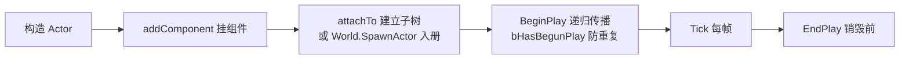

# 实体体系系统（Engine Entity）

> 引擎对象层级与组件系统：`OObject → AObject → BObject → Actor` + 组件组合。
> 代码位置：`src/engine/entity/`
> 相关文档：[系统总览](../system_overview.md) / [资产与工具系统](./asset_tools_system.md)

## 1. 概述

模仿 UE 的对象层级设计，四级对象基类逐级扩展能力：

| 层级 | 类 | 能力 |
|---|---|---|
| L0 | `OObject` | 对象根基：uid、命名、生命周期（BeginPlay/EndPlay/Tick） |
| L1 | `AObject` | 原子对象：组件挂载/查询（`getComponent` / `addComponent`） |
| L2 | `BObject` | 蓝图对象：承接蓝图资产数据（组件列表来自 BlueprintAsset） |
| L3 | `Actor` | 场景实体：拥有 THREE.Group（root）、可见性树、子节点层级、world 引用 |

凡是要出现在 3D 场景里的实体（Pawn / 建筑 / UI / 摄像机 / 装饰）都继承 `Actor`。

## 2. 核心类

| 类 | 说明 |
|---|---|
| `OObject` | 根基类：唯一 uid、名称、BeginPlay/EndPlay/Tick 生命周期 |
| `AObject` | 组件容器：组件注册/查询/遍历 |
| `BObject` | 蓝图数据载体：按蓝图声明实例化组件 |
| `Actor` | 场景对象：`root: THREE.Group`、子 Actor 树、`world`、`blueprintRef`（蓝图实例元数据 + overrides）、`isRefInstance`（ref 子节点标记） |
| `Pawn` | 可操控实体，挂接 `PlayerController` |
| `GenericActor` | 通用 Actor：按注册表/资产数据实例化 |
| `Component` | 组件基类，含 `EditableProperty` 声明式属性元数据（Inspector 据此渲染） |
| `AObjectComponent` | 挂载于 AObject 的组件基类 |
| `BObjectComponent` | 挂载于 BObject 的组件基类 |
| `ActorComponent` | 挂载于 Actor 的组件基类 |
| `SpawnComponent` | 生成逻辑组件 |
| `TransformComponent` | 变换组件（position/rotation/scale，顶层字段已废弃，统一由组件 properties 承载） |

## 3. 使用方法

### 3.1 入口 API

| 方法 | 签名 | 说明 |
|---|---|---|
| 组件挂载 | `actor.addComponent(comp)` / `actor.addComponent(Cls, ...args)` | 给 Actor 挂组件（AObject 提供）；类版自动 `new Cls(this, ...args)`（owner 自动传入，...args 严格匹配构造参数，**推荐**） |
| 组件查询 | `actor.getComponent<T>(Class)` / `getComponents(Class)` | 按类型取组件（首个/全部） |
| 子节点挂载 | `actor.attachTo(child, parent?)` | 建立子 Actor 树（内联子节点经此挂载，不进 `World.allActors`） |
| 生命周期 | `BeginPlay()` / `Tick(dt)` / `EndPlay()` | 构造后由挂载方驱动，递归传播 |

### 3.2 使用示例

```ts
// 项目代码中创建自定义 Actor（继承 Actor 挂组件）
class MyActor extends Actor {
  constructor() {
    super('MyActor')
    this.addComponent(TransformComponent, { position: [0, 1, 0] })
  }
  BeginPlay() {
    super.BeginPlay()
    // 组件就绪后的初始化
  }
}

// 场景内实例化（由 World.SpawnActor 或蓝图实例化路径创建，见游戏流程系统）
const actor = world.SpawnActor(MyActor)
```

### 3.3 触发时机与使用前提

- **生命周期由挂载方驱动**：Actor 由 `World.SpawnActor` / `SpawnActorFromBlueprint` 创建后进入 World 管控；内联子节点由父 `BeginPlay` 递归驱动
- **使用前提**：`Tick` 只对挂入 World 的 Actor 生效；组件构造需要传入 owner 且 owner 必须已注册到对象体系（OObject 构造自动注册）

## 4. 工作流程

### 4.1 主流程



### 4.2 设计要点

**生命周期传播**：

- `Actor.BeginPlay` 递归传播到子 Actor；`bHasBegunPlay` 防止 ref 子节点重复调用
- 内联子节点经 `attachTo` 挂载，不在 `World.allActors` 中，由父链传播生命周期

**场景树与引用**：

- 每个 Actor 拥有 `THREE.Group`，`userData.actorRef` / `userData.actorUid` 反查 Actor
- 子 Actor 树由 `children` / `_parent` 维护（与 THREE 层级平行）
- `blueprintRef = { id, overrides? }`：记录蓝图实例来源与属性补丁（`PropertyPatch`）

**组件与属性补丁**：

- 组件属性改动走 `deepMerge` 的 `PropertyPatch`（`clonePatch` / `mergePatch`），支持蓝图 overrides 覆盖
- 组件用 `EditableProperty` 声明可编辑属性（类型、默认值、资产引用目标），编辑器 Inspector 据此动态渲染（详见 [属性修改系统](../editor/property_edit_system.md)）

## 5. 边界条件

| 条件 | 行为/后果 | 处理方式 |
|---|---|---|
| 组件未注册类型（`ComponentRegistry.create` 返回 null） | 蓝图实例化时该组件被跳过 | 检查注册表；内置组件见资产与工具系统 |
| `BeginPlay` 重复调用 | `bHasBegunPlay` 防止 ref 子节点重复执行 | 引擎内置防重，勿手动重复触发 |
| 组件无 owner 或 owner 已销毁 | 生命周期回调（Tick）不再执行 | 组件随 owner 销毁，勿持有悬垂引用 |
| 子节点未 attachTo 直接构造 | 生命周期/可见性树不包含该节点 | 必须走 attachTo 或 SpawnActor |

## 6. 依赖关系

```
Actor → BObject → AObject → OObject
Actor → World（world 引用，SpawnActor 时设置）
组件体系 → deepMerge（PropertyPatch）
Actor → THREE.Group（root 场景节点）
```

## 7. 注册机制

实体类本身不注册；`Actor` / `Component` 的类型工厂注册见 [资产与工具系统](./asset_tools_system.md)（`ActorRegistry` / `ComponentRegistry`）。
