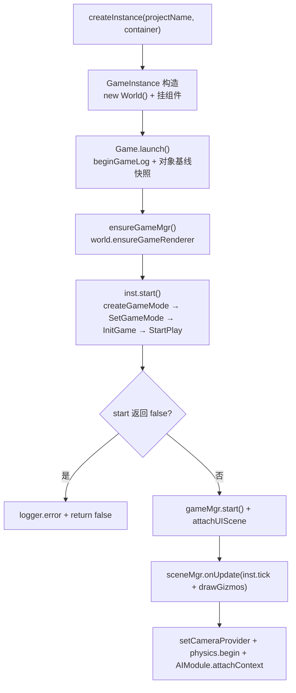
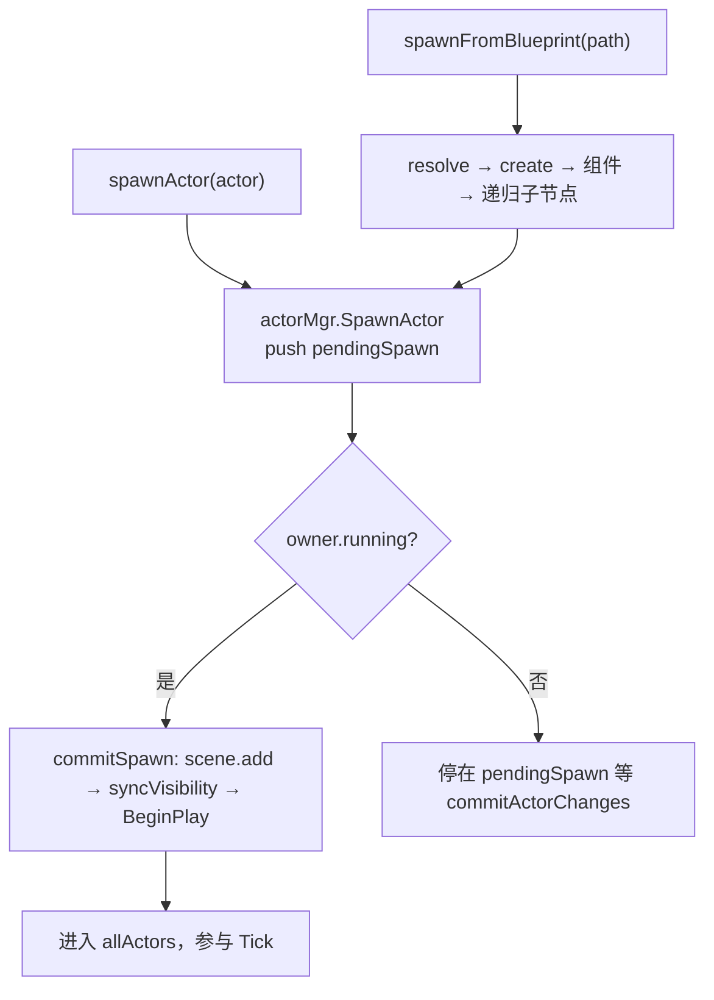

# 游戏流程系统（Game Flow）

> **一句话定位**：一局游戏的运行时骨架——`Game` 管生命周期，`GameInstance` 管项目装配，`World` 管 Actor 集合与 Tick 循环，`GameMode` 管规则，串成 `Game → GameInstance → World → GameMode/GameState` 这条链。
>
> **什么时候会用到你**：点「运行」游戏没起来、Actor 生成了却不显示或不动、切换场景后旧对象残留或泄漏、新增 GameMode 或新项目不知道怎么接、排查对象泄漏告警。
>
> 代码位置：`src/engine/gameflow/`

---

## 1. 先记住这几个文件

| 文件 | 一句话职责 | 你要改它的场景 |
|---|---|---|
| [Game.ts](../../src/engine/gameflow/Game.ts) | 生命周期主人：`createInstance` 造实例、`launch` 拉起、`shutdown` 收摊（含泄漏诊断） | 加一个「随游戏启动/停止」的全局单例 |
| [GameInstance.ts](../../src/engine/gameflow/GameInstance.ts) | 项目装配基类：构造即建 `World`，`start()` 装 GameMode | 新项目接入、改启动钩子 |
| [World.ts](../../src/engine/gameflow/World.ts) | 世界：Actor 生成 / 场景切换 / Tick 循环 / `Destroy` | Actor 生成、场景切换、Tick 顺序 |
| [GameMode.ts](../../src/engine/gameflow/GameMode.ts) | 规则权威：持有 `GameState` + `Controller` + `cameraManager` 并统一驱动 | 写玩法规则、胜负判定 |

**心智模型一**：**Tick 只有一个源头**——`Game.launch` 把 `inst.tick(dt)` 挂到 Scene 视口的 rAF 上，World 自己**不跑 rAF**（`World.Start()` 无调用方，是死代码）。「游戏不动了」先查 rAF 有没有在调 `inst.tick`，别去 World 里找循环。
**心智模型二**：**GameMode 不是 Actor**。`World` 不把它放进 `allActors`，而是显式持有并手动调 `InitGame/StartPlay/BeginPlay/EndPlay/Tick`（[World.ts:172](../../src/engine/gameflow/World.ts)）。

---

## 2. 一局游戏怎么跑起来：从 Game 到 World

### 2.1 谁调用了它

唯一真实入口是 [Viewport.tsx:242](../../src/components/Viewport.tsx)——`editorState.running` 变 true 的 effect：

```ts
const game = new Game(sceneRef.current)
game.setCallbacks({ onScoreChange: (s) => setGameScore(s), onGameOver: () => setGameOver(true) })
if (currentProject) { game.createInstance(currentProject.name, gameContainerRef.current) }
if (!game.instance) return   // createInstance 失败只返回 null，不抛异常
if (!game.launch()) { logger.error('[Viewport] 游戏启动失败（Game.launch 返回 false）'); return }
```

### 2.2 启动链路



**① 造实例**（[Game.ts:129](../../src/engine/gameflow/Game.ts)）：重复调用**自动先 shutdown 旧实例**（切换工程无需手动清理），`setCurrent(inst)` 设置的全局单例是 `spawnActor()` 找 World 的唯一依据，**没有活跃实例时调 spawn 会直接抛错**。

```ts
if (this._instance) { this.shutdown(); this._instance = null }
if (!GameFactoryRegistry.has(projectName)) { logger.warn(`[Game] 工程 "${projectName}" 未注册游戏实例工厂，跳过创建`); return null }
GameInstance.setCurrent(inst)
this._shutdown = false  // 新实例需要新的 shutdown 生命周期
```

**② GameInstance 构造即建好 World**（[GameInstance.ts:43](../../src/engine/gameflow/GameInstance.ts)），两者**同生共死**（一个实例一个 World，不共享）；`EditorGameBridgeComponent` 是编辑器读游戏场景的唯一通道，**只读、绝不注入**：`this.world = new World()` → `addComponent(GameViewportComponent)` → `addComponent(EditorGameBridgeComponent)`。

**③ `launch`**（[Game.ts:170](../../src/engine/gameflow/Game.ts)）开头打对象基线快照——`shutdown` 时 diff 出本局泄漏对象，是排查泄漏的第一现场：

```ts
logger.beginGameLog(this._projectName)
this._objBaseline = new Set(ObjectRegistry.snapshot())
const ok = inst.start()
if (!ok) { logger.error(`[Game] 游戏实例 start() 返回 false，启动失败`); return false }
```

Tick 挂载是全系统最关键的一行，`Game` 只把回调挂到**外部** rAF：`if (this.sceneMgr) { this.removeTick = this.sceneMgr.onUpdate((dt) => { inst.tick(dt); inst.drawGizmos() }) }`。所以 `sceneMgr` 为空时游戏逻辑**完全不走**（无报错、无日志）——这是「游戏起来了但完全静止」的根因之一。物理最后才激活，`physics.begin()` 是**运行时与预览时的分水岭**：游戏 World 调了它碰撞体才注册 body，预览 World 永不 begin，所以预览里没有物理（设计上的隔离，不是 bug）。

**④ `inst.start()` 装配 GameMode**（[GameInstance.ts:96](../../src/engine/gameflow/GameInstance.ts)）：

```ts
const gm = this.createGameMode()
this.world.SetGameMode(gm)
this.world.Stop()
this._unsubGameState = gm.gameState.subscribe(() => { /* onScoreChange / onPhaseChange / onGameOver */ })
gm.InitGame()
gm.StartPlay()
const ctrl = gm.controller
if (!ctrl) { logger.error(`[${this.constructor.name}] StartPlay 后 controller 为空`); return false }
this.onControllerReady(ctrl)
return this.onStart(ctrl)
```

**这里有个真实的重复调用**：`SetGameMode` 内部已调过 `gm.InitGame()` + `gm.StartPlay()`，`start()` 又调一遍。走基类 `start()` 的项目，`InitGame`/`StartPlay`/`SpawnPlayer()` 各执行两次，第二个 Controller 覆盖第一个——规则：这两个方法**必须保持幂等**。**Fish 绕开了这条路径**（[FishGameInstance.ts:170](../../src/projects/fish/gameplay/FishGameInstance.ts)），整个覆写 `start()` 且不调 `super.start()`：`this.loadSaveAsync()` 后按 `initialMode` 分派到 `switchToPhase('base'|'game'|'menu')`。`loadSaveAsync()` 是 **fire-and-forget**（内部 `void this.save.load().then(...)`）——`start()` 必须同步返回 boolean，所以「开局头几帧存档还没就绪」是设计使然，下游靠 `_kvReady` 标志 + `tryRestoreBaseLayout()` 门控处理。

**⑤ `SetGameMode`：World 显式接管 GameMode 生命周期**（[World.ts:172](../../src/engine/gameflow/World.ts)）：

```ts
this.assertValid('调用 SetGameMode') // 已销毁 World 不应再被驱动（旧实例闭包路径）
if (this.gameMode) { this.gameMode.EndPlay() }
gm.world = this
this.gameMode = gm
gm.InitGame()
gm.StartPlay()
if (this._running) { gm.BeginPlay() }
```

三点：换 GameMode 时旧的走 `EndPlay()`，而 `GameMode.EndPlay` 连带结束 `GameState` 和 `Controller`，旧 Controller 因此随场景切换自动销毁；**只有 `_running === true` 才补 `BeginPlay()`**，`SwitchScene` 正是先 `Pause()` 让 `_running = false`、切完再由 `BeginPlay()` 统一补；`assertValid` 防已销毁 World 被旧闭包继续驱动。

### 2.3 每帧怎么走

`inst.tick(dt)` 由项目实现，主流写法是转发给 World（[FishGameInstance.ts:957](../../src/projects/fish/gameplay/FishGameInstance.ts)、[SnakeGameInstance.ts:41](../../src/projects/snake/SnakeGameInstance.ts)）：`this.world.manualTick(dt)`。`World.manualTick` 与私有 `World.tick` **逻辑完全平行**（[World.ts:333](../../src/engine/gameflow/World.ts)），六步顺序严格固定：

```ts
manualTick(dt: number) {
  if (!this._running) return
  this.commitActorChanges()                                                     // 1
  for (const actor of this.actorMgr.GetAllActors()) if (!actor.bPendingDestroy && actor.bTickEnabled) actor.Tick(dt)  // 2
  this.ui.tickUI(dt)        // 3
  this.gameMode?.Tick(dt)   // 4
  for (const cb of this._tickCallbacks) { cb(dt) }  // 5
  this.physics.step(dt)     // 6
}
```

| # | 步骤 | 为什么在这个位置 |
|---|---|---|
| 1 | `commitActorChanges()` | 先落定上一帧请求生成/销毁的 Actor，保证本帧 Tick 集合稳定 |
| 2 | 遍历 Actor `Tick(dt)` | 只 Tick `bTickEnabled` 的；**Actor 默认不开 Tick**，要 `enableTick()` |
| 3 | `ui.tickUI(dt)` | UI Actor 独立驱动，**不进 `allActors`**（否则被第 2 步重复 Tick） |
| 4 | `gameMode?.Tick(dt)` | 内部再驱动 `GameState` → `Controller` → `cameraManager` |
| 5 | 外部 `_tickCallbacks` | 由 `world.onTick(cb)` 注册 |
| 6 | `physics.step(dt)` | **必须最后**：保证本帧所有 Tick 读到的是上一帧求解后的位置 |

第 4 步展开（[GameMode.ts:72](../../src/engine/gameflow/GameMode.ts)）——**World 不再逐个驱动这三个对象，全由 GameMode 集中派发**：`super.Tick(dt)`（组件）→ `gameState.Tick(dt)` → `controller?.Tick(dt)` → `cameraManager.UpdateCamera()`。

**驱动顺序一句话记住**：`Game` → `GameInstance.tick` → `World.manualTick` → `Actor.Tick` + `UIManager` → `GameMode.Tick` →（`GameState` → `Controller` → `cameraManager`）→ `physics.step`。`BeginPlay` 同样由 GameMode 向下派发（[GameMode.ts:51](../../src/engine/gameflow/GameMode.ts)），用 `bHasBegunPlay` 防重——`BObject.BeginPlay` 首行也有这个判断（[BObject.ts:40](../../src/engine/entity/BObject.ts)），但上层不判会让日志与副作用语义混乱。

### 2.4 停止与销毁

`shutdown` 第一件事是**防重标记**（[Game.ts:251](../../src/engine/gameflow/Game.ts)）：`if (this._shutdown) return`。必须防重——React effect cleanup 与切换工程可能同时触发，重复执行会二次 dispose、二次 reset 单例。销毁顺序本身是关键（下列代码连续，来自同一方法）：

```ts
this.removeTick?.()
const bridge = this._instance?.getComponent(EditorGameBridgeComponent)
if (bridge) bridge.gameRunning = false
this._instance?.destroy()       // 项目自己的清理（如 Fish 落盘存档）
this._instance?.teardown()      // 终态化输入子系统
this._instance?.markDestroyed() // 显式终态标记（幂等）
GameInstance.setCurrent(null)
```

`teardown()` 与 `markDestroyed()` 是双保险：`World.Destroy` 内的 `reclaimForWorld` 靠 `world` 字段隐式回收 GameInstance，显式调用保证**未来子类没有 world 字段也不会泄漏**；`setCurrent(null)` 必须在 destroy 之后、渲染器清理之前。之后是项目自己的 `destroy()`（[FishGameInstance.ts:1060](../../src/projects/fish/gameplay/FishGameInstance.ts)）——`this.stop()` → `save.onDestroy()`（自动落盘）→ 解订 `unsubGameState` → `this.world.Destroy()`。Fish 覆写 `start()` 没走基类订阅路径，所以有自己的 `unsubGameState` 字段；**覆写 `destroy()` 时不调 `super.destroy()` 就会漏掉基类的清理**（这里正是如此）。

最后 `World.Destroy()` 收尾（[World.ts:774](../../src/engine/gameflow/World.ts)）：

```ts
this.ui.destroyAll()
gizmos.detach(this.scene)
this.gameMode?.EndPlay()
this.actorMgr.DestroyAllActors()
this.physics.reset()
ObjectRegistry.reclaimForWorld(this)   // 最后一道兜底回收
this.gameRenderer?.dispose()
```

**`ObjectRegistry.reclaimForWorld(this)` 是最后一道兜底**（[ObjectRegistry.ts:98](../../src/engine/tools/ObjectRegistry.ts)）：遍历全局注册表，凡归属本 World 的一律 `EndPlay` + `markDestroyed`。它只做回收标记，场景移除等副作用靠上面的 `DestroyAllActors()` 已完成；**但只认 `world` 字段或 owner 链能上溯到本 World 的对象**——Fish 的 `baseCamera` 就踩过这个坑（见踩坑 4）。

#### 场景切换：旧 World 不销毁，只清 Actor

场景切换**不是销毁 World**，而是在同一个 World 上换内容（[World.ts:427](../../src/engine/gameflow/World.ts)），六步：`Pause()` → `DestroyAllActors()` → `SetGameMode`（旧 GameMode EndPlay）→ `createHUD` → `setup()` → `BeginPlay()`：

```ts
const b = baseline ?? new Set(ObjectRegistry.snapshot().filter((o) => !this.ownedBy(o, newMode)))
this.Pause()
this.DestroyAllActors()
const leftover3D = this.actorMgr.actorCount + this.actorMgr.pendingSpawnCount  // 残留诊断
if (leftover3D > 0) { logger.warn(`[World#${this.id}] SwitchScene 残留诊断：旧场景 Actor 集合未清空`) }
this.SetGameMode(newMode)
if (newMode.HUDClass) { this.ui.createHUD(newMode.HUDClass) }
setup?.()
this.BeginPlay()
```

`baseline` 是精巧设计：**它在 `newMode` 构造之前打快照**（[World.ts:693](../../src/engine/gameflow/World.ts)），否则 newMode 构造期创建的对象（如 Fish 的 `BaseCameraActor`）会被残留诊断误报成「旧场景残留」。

`BeginPlay()` 恢复运行时**必须先提交待生成队列**（[World.ts:294](../../src/engine/gameflow/World.ts)）——顺序反了，Actor 还在队列里就被跳过，永远不 BeginPlay：

```ts
this._running = true
this.commitActorChanges()  // 否则 SpawnActorFromBlueprint 生成的 Actor 永远停在 pendingSpawn
this.ui.beginPlay()
for (const actor of this.actorMgr.GetAllActors()) if (!actor.bHasBegunPlay) { actor.BeginPlay(); actor.flushPendingComponentOverrides() }
if (this.gameMode && !this.gameMode.bHasBegunPlay) this.gameMode.BeginPlay()
```

**GameMode 的 BeginPlay 排在最后**——因为它常常要遍历场景 Actor（如 Fish 的 `collectBuildings()` 收集建筑），必须等场景 Actor 全部 BeginPlay 完。

---

## 3. Actor 是怎么进 World 的



### 路径一：已有实例 → `SpawnActor`

游戏代码标准入口是 [ActorUtils.ts:39](../../src/engine/gameflow/ActorUtils.ts) 的 `spawnActor`——`tryGetWorld()` 依次查 `GameInstance.current?.getWorld()` 和 `PreviewObjectFactoryComponent.getCurrentWorld()`，**这决定了同一份游戏代码在编辑器预览里也能跑**；查不到就**抛错**（不是返回 null）。

`SpawnActor` 本体只有三行（[ActorManagerComponent.ts:99](../../src/engine/gameflow/ActorManagerComponent.ts)），**它是延迟的**——调完后 Actor **还没进场景**，`GetAllActors()` 也查不到：

```ts
actor.world = this.owner
this.pendingSpawn.push(actor)
return actor
```

落地在 `commitSpawn()`（[ActorManagerComponent.ts:118](../../src/engine/gameflow/ActorManagerComponent.ts)）：

```ts
if (this.owner.ui.isUIActor(actor)) { this.owner.ui.addUIActor(actor) }
else {
  this.allActors.add(actor)
  if (!actor.parent) { this.owner.scene.add(actor.root) }
  actor.syncVisibility()
  if (this.owner.running) { actor.BeginPlay(); actor.flushPendingComponentOverrides() }
}
```

四处要记：`if (!actor.parent)` 保证**只有顶层 Actor 加进 scene**（子 Actor 已在父 root 下，重复 add 会被从父节点摘走）；`BeginPlay` 只在 `running` 时调，否则 Actor 进了场景却没初始化；`flushPendingComponentOverrides()` 必须在 `BeginPlay` **之后**（代码动态挂的组件此刻才存在）；Pawn 的 Possess 回调在队列末尾统一触发。

### 路径二：蓝图 → `SpawnActorFromBlueprint`

入口返回 `Actor | null`——失败**返回 null 而非抛错**，`BlueprintRegistry.resolve` 的异常被内部 catch 掉（[ActorManagerComponent.ts:390](../../src/engine/gameflow/ActorManagerComponent.ts)），调用方必须自己判空：

```ts
try { resolved = BlueprintRegistry.resolve(path) } catch (e) {
  logger.error(`[ActorManagerComponent] SpawnActorFromBlueprint("${path}") 解析失败: ${(e as Error).message}`); return null
}
const actor = ActorRegistry.create(resolved.baseClass)
if (!actor) { logger.error(`baseClass "${resolved.baseClass}" 未在 ActorRegistry 注册`); return null }
```

注入时序（**全部在 `SpawnActor` 之前**）是理解蓝图实例化的核心。`TransformComponent` 特判是因为 **Actor 构造时已自带一个**（UE RootComponent 语义），蓝图再声明会「双重挂载」；`ensureTransformForActor` 在数据未显式配置时自动补挂（UI Actor 挂的是含锚点能力的 `UITransformComponent`）：

```ts
const existingTf = cdef.baseClass === 'TransformComponent' ? actor.getComponent(TransformComponent) : null
if (existingTf) { ComponentRegistry.configure(existingTf, cdef.baseClass, cdef.properties); continue }
ensureTransformForActor(actor)
```

**顶层 transform 已废弃**（严格模式「组件优先」）：位置只能写在 `transform`/`uitransform` 组件的 properties 里，写在节点顶层会报 `childTransformViolation` 错误且**值不生效**，蓝图根节点、ref 子节点、内联子节点三处都校验（[ActorManagerComponent.ts:569](../../src/engine/gameflow/ActorManagerComponent.ts)）。

子节点在 `spawnChildObjects` 里递归处理，三种形态：`ref` 子节点**递归调用自身**（各自独立实例化）并打 `isRefInstance = true`（让编辑器大纲把该实例当整体、不展开内部）；`baseClass` 子节点直接 `ActorRegistry.create` + applyPatch + 挂组件；纯容器降级成 `GenericActor`。

```ts
if (child.ref) {
  childActor = this.SpawnActorFromBlueprint(child.ref, { ...(child.overrides ?? {}) })
  if (childActor) childActor.isRefInstance = true
} else if (child.baseClass) { childActor = ActorRegistry.create(child.baseClass) }
if (!childActor && child.children?.length) { childActor = new GenericActor(child.name ?? `Container_${parentActor.name}`) }
childActor.attachTo(parentActor)
if (child.children && child.children.length > 0) { spawnChildObjects(child.children, childActor) }
```

最后是覆盖与元数据：

```ts
// 代码生成的组件（如建筑 MeshComponent）在 BeginPlay 才挂载，此时解析不到——
// 由 commitSpawn / World.BeginPlay 在 BeginPlay 完成后统一 flush 应用
if (componentOverrides?.length) { actor.pendingComponentOverrides = componentOverrides.map((c) => ({ baseClass: c.baseClass, properties: c.properties })) }
if (resolved.name) { actor.root.name = resolved.name }
actor.blueprintRef = { id: path, overrides }
this.SpawnActor(actor)
```

`pendingComponentOverrides` 的延迟应用是最容易踩的时序坑：**组件属性覆盖永远晚于 BeginPlay 生效**，别在 BeginPlay 里读它。

### 场景加载与项目注册

`World.loadSceneAsActors`（[World.ts:519](../../src/engine/gameflow/World.ts)）把场景资产展开成 Actor 树，全部挂到名为 `"Root"` 的 `GenericActor` 下（区别于编辑器默认内容根 `"Default"`）：

| 节点类型 | 处理 | 备注 |
|---|---|---|
| `mesh` / `blueprintNodes`（旧格式） | `GenericActor` + 按 geometry 选 `Plane/Sphere/BoxMeshComponent`；蓝图走 `EditorActorComponent.Instantiate` | 跳过已有 actor/ref 节点的 mesh，避免重复；蓝图实例 `isRefInstance = true` |
| `refNodes` | `EditorActorComponent.Instantiate(rn.ref, overrides, rn.components)` | 递归 `spawnSceneChildren` 挂实例级子对象 |
| `actorNodes` | `actorMgr.spawnInlineActor(an)` | 内联递归，与蓝图子节点逻辑一致 |

按名切换时（[World.ts:671](../../src/engine/gameflow/World.ts)）先查 `AssetRegistry.getScene`，再查 `GameModeRegistry.has(mode)`，任一缺失都 `return false`。

**GameMode 继承 + 注册**（[fish/register.ts:19](../../src/projects/fish/register.ts)）——`mode` 字符串来自 `SceneAsset.mode`，`SwitchToScene` 靠它查表构造；注册中心是 `register` / `create`（未注册返回 null）/ `has` 三个静态方法（[GameModeRegistry.ts:20](../../src/engine/tools/GameModeRegistry.ts)）：

```ts
GameModeRegistry.register('menu', FishMainMenuGameMode)
GameModeRegistry.register('base', FishBaseGameMode)
GameModeRegistry.register('game', FishGameMode)
GameModeRegistry.register('level', FishLevelGameMode)
```

覆写 GameMode 的第一个坑记在 [FishLevelGameMode.ts:132](../../src/projects/fish/gameplay/level/FishLevelGameMode.ts) 的注释里：`override StartPlay()` 首行必须 `super.StartPlay()`，因为基类内含 `SpawnPlayer()`（创建 `FishLevelPlayerController`）——漏掉则 `mode.controller` 为 null → `setupLevelPhase` 拿不到控制器 → `InputSys.handlePointerDown` 无 Controller 可转发 → 点击场景永远放不了兵。

GameInstance 工厂**由项目模块自动注册**（[projects/registry.ts:92](../../src/projects/registry.ts)）：`GameFactoryRegistry.register(project.name, (container) => project.createGameInstance(container))`。所以新项目**不需要手写注册游戏工厂**——只要在 `ALL_PROJECTS` 里导出 `ProjectModule` 即可；但 **GameMode 必须手动 `GameModeRegistry.register`**。

---

## 4. 关键方法速查

| 方法 | 位置 | 干什么 | 注意 |
|---|---|---|---|
| `Game.createInstance` | [Game.ts:129](../../src/engine/gameflow/Game.ts) | 造 GameInstance 并接管单例 | 未注册工厂返回 null；重复调用自动 shutdown 旧实例 |
| `Game.launch` | [Game.ts:170](../../src/engine/gameflow/Game.ts) | 起日志 → 启渲染 → 挂 Tick → 激活物理 | 依赖 `sceneMgr` 提供 rAF |
| `Game.shutdown` | [Game.ts:251](../../src/engine/gameflow/Game.ts) | 注销 Tick → 销毁实例 → 收渲染器 → 回收单例 → 泄漏诊断 | 幂等（`_shutdown` 标记） |
| `GameInstance.start` | [GameInstance.ts:96](../../src/engine/gameflow/GameInstance.ts) | 建 GameMode → 订阅 GameState → `InitGame`/`StartPlay` | 与 `SetGameMode` 重复调这两个方法 |
| `World.SetGameMode` | [World.ts:172](../../src/engine/gameflow/World.ts) | 旧 EndPlay → 换引用 → `InitGame`+`StartPlay` | `running` 时才补 `BeginPlay` |
| `World.BeginPlay` | [World.ts:294](../../src/engine/gameflow/World.ts) | 先提交 pendingSpawn，再逐个 BeginPlay | GameMode 的 BeginPlay 排最后 |
| `World.manualTick` | [World.ts:333](../../src/engine/gameflow/World.ts) | 驱动一帧（提交 → Actor → UI → GameMode → 物理） | `!running` 直接返回 |
| `World.SwitchScene` | [World.ts:427](../../src/engine/gameflow/World.ts) | Pause → 清 Actor → 换 GameMode → HUD → setup → BeginPlay | 带残留诊断，需传 baseline |
| `World.SwitchToScene` | [World.ts:671](../../src/engine/gameflow/World.ts) | 按资产/场景名切换，从注册表造 GameMode | 场景或 mode 未注册返回 false |
| `World.Destroy` | [World.ts:774](../../src/engine/gameflow/World.ts) | 清 UI → GameMode EndPlay → 清 Actor → 物理 reset → 兜底回收 | 由项目 `destroy` 调用 |
| `GameMode.StartPlay` | [GameMode.ts:45](../../src/engine/gameflow/GameMode.ts) | 置 phase=playing → `SpawnPlayer()` | 子类必须 `super.StartPlay()` |
| `GameMode.BeginPlay` | [GameMode.ts:51](../../src/engine/gameflow/GameMode.ts) | 驱动 GameState + Controller 的 BeginPlay | 用 `bHasBegunPlay` 防重 |
| `GameMode.EndPlay` | [GameMode.ts:62](../../src/engine/gameflow/GameMode.ts) | GameState + Controller + cameraManager 一起结束 | `controller` 置 null |
| `GameMode.Tick` | [GameMode.ts:72](../../src/engine/gameflow/GameMode.ts) | 组件 Tick → GameState → Controller → cameraManager | World 不再逐个驱动这三个 |
| `actorMgr.SpawnActor` | [ActorManagerComponent.ts:99](../../src/engine/gameflow/ActorManagerComponent.ts) | 入 pendingSpawn 队列 | **延迟生效**，返回值不是可用 Actor |
| `actorMgr.commitSpawn` | [ActorManagerComponent.ts:118](../../src/engine/gameflow/ActorManagerComponent.ts) | 落地：进 allActors、加场景、BeginPlay | 只 add 无 parent 的顶层 Actor |
| `actorMgr.SpawnActorFromBlueprint` | [ActorManagerComponent.ts:390](../../src/engine/gameflow/ActorManagerComponent.ts) | resolve → 构造 → 组件 → 子节点 → 覆盖 → 入队 | 失败返回 null（内部 catch） |
| `GameModeRegistry.register` | [GameModeRegistry.ts:20](../../src/engine/tools/GameModeRegistry.ts) | mode 字符串 → GameMode 构造函数 | 项目手动注册 |
| `spawnActor` / `spawnFromBlueprint` | [ActorUtils.ts:39](../../src/engine/gameflow/ActorUtils.ts) | 游戏代码标准生成入口 | 无活跃 World 时**抛错** |

---

## 5. 流程影响：牵动哪些功能

### 上游：谁驱动它

| 上游 | 怎么驱动 | 相关文档 |
|---|---|---|
| 编辑器视口 Viewport | `running` 变 true 时 `new Game()` → `createInstance` → `launch` | [视口系统](../editor/core/viewport_system.md) |
| `registerAllProjectModules` | 启动时注册 GameInstance 工厂、内置 Actor/组件、AI 事件、GM 命令 | [资产与工具系统](./asset_tools_system.md) |
| 项目 `register.ts` | `GameModeRegistry.register(mode, ctor)`——未注册则 `SwitchToScene` 返回 false | [gameplay 代码规范](../projects/gameplay_code_standard.md) |
| `AssetRegistry` | 场景按 name 注册后 `SwitchToScene('Name')` 才查得到 | [资产与工具系统](./asset_tools_system.md) |
| AI 事件系统 | `AIModule.attachContext(world, inst)`；游戏内切场景经 `SwitchToScene`（GM 命令/游戏逻辑触发） | [AI 事件系统](./ai_system.md) |
| GM 命令系统 | `GameInstance.gm` 随实例生命周期；控制台 Actor 经 `spawnActor` 进世界 | [GM 命令系统](./gm_system.md) |

### 下游：它波及谁

| 下游 | 怎么波及 | 相关文档 |
|---|---|---|
| Actor / 实体体系 | `SpawnActor` 延迟提交决定 `BeginPlay` 时机；`DestroyActor` 走队列 | [实体体系](./entity_system.md) |
| 输入 / 物理 | Controller 生命周期归 GameMode；`physics.begin()` 是运行时/预览分界，`step` 在每帧最后 | [物理系统](./physics_system.md) |
| UI 系统 | `UIManager` 独立驱动，UI Actor 不进 `allActors`；`HUDClass` 在 `SwitchScene` 时创建 | [UI 系统](./ui_system.md) |
| 渲染系统 | `SceneRendererComponent` 由 `ensureGameRenderer` 创建；相机经 `setCameraProvider` 委托 | [渲染系统](./rendering_system.md) |
| 编辑器大纲 / 只读桥 | `onActorListChanged` 通知刷新；`EditorGameBridgeComponent` 提供只读快照 | [编辑器核心](../editor/core/core_system.md) |
| 蓝图 / 场景预览 | 预览 World 复用同一套 `SpawnActorFromBlueprint`，但 `physics` 永不 begin | [资产预览与检查](../editor/asset/asset_preview_lint_system.md) |
| 存档 | `SaveSlotComponent` 挂 GameInstance，钩子由项目 `stop`/`destroy` 转发 | [资产与工具系统](./asset_tools_system.md) |

---

## 6. 踩坑清单（都是真踩过的）

**1. `spawnFromBlueprint` 后 Actor 不显示/不动** —— `SpawnActor` 只是入队，落地在 `commitSpawn()`，后者只在 `World.tick`/`BeginPlay` 里被调；世界还没 `BeginPlay` 时生成的 Actor 一直停在 `pendingSpawn`。规则：不要假设 `spawnActor()` 返回后 Actor 已可用，需要立即可见就调 `world.manualTick(0)` 强制提交一次（AI 事件处理器就是这么做的，[registerBuiltinAIHandlers.ts:190](../../src/engine/ai/registerBuiltinAIHandlers.ts)）。
**2. 场景切换后新场景 Actor 全没初始化** —— `BeginPlay()` 里 `commitActorChanges()` 必须排在逐个 `BeginPlay` 之前（[World.ts:294](../../src/engine/gameflow/World.ts)）。
**3. 覆写 `StartPlay` 忘了 `super.StartPlay()` → 点击场景无反应** —— 基类 `StartPlay` 内含 `SpawnPlayer()`（[GameMode.ts:93](../../src/engine/gameflow/GameMode.ts)），漏掉则 `mode.controller` 为 null，`start()` 直接 `return false`，InputSys 无 Controller 可转发。
**4. GameMode 自己 new 的 Actor 泄漏** —— `reclaimForWorld` 只认 `world` 字段或 owner 链能上溯到本 World 的对象。GameMode 构造里 `new BaseCameraActor()` 时还没有 world 归属；正常路径由 `extraSetup` 里 `spawnActor(mode.baseCamera)` 托管，但**裸调 `SwitchToScene`（不执行 extraSetup，如 GM 命令切场景）时无人托管**就永久泄漏。规则：GameMode 自己 new 的 Actor，必须在 `EndPlay` 里自己 `destroy()` 兜底（[FishLevelGameMode.ts:171](../../src/projects/fish/gameplay/level/FishLevelGameMode.ts) 即如此）。
**5. 顶层 `position/rotation/scale` 写了不生效** —— 严格模式（组件优先）：位置一律写在 `transform`/`uitransform` 组件的 properties 里。顶层字段存在即报 `childTransformViolation` 错误且**不应用该值**；蓝图根节点、ref 子节点、内联子节点三处都校验。
**6. 切换工程/重复启动导致二次 dispose** —— `shutdown` 靠 `_shutdown` 布尔标记防重（effect cleanup 和切换工程可能同时触发），`createInstance` 里也内置了「已有实例先 shutdown」。规则：外部不要再包一层自己的防重，会与引擎状态机打架。
**7. `SwitchScene` 残留诊断误报** —— baseline 必须在 `newMode` **构造之前**打快照（[World.ts:693](../../src/engine/gameflow/World.ts)），否则 newMode 构造期创建的对象被算成「旧场景残留」；直接调 `SwitchScene` 时用 `ownedBy(o, newMode)` 过滤兜底。
**8. 组件属性覆盖不生效** —— ref 节点的 `componentOverrides` 若覆盖的是代码在 `BeginPlay` 才挂的组件，实例化阶段解析不到，引擎暂存到 `actor.pendingComponentOverrides`，等 `commitSpawn`/`BeginPlay` 里 `flushPendingComponentOverrides()` 再应用。规则：**组件属性覆盖永远晚于 BeginPlay 生效**，别在 BeginPlay 里读它。
**9. 编辑器预览里有 Actor 但没物理** —— `physics.begin()` 只在 `Game.launch` 里调，预览 World 的 `physics` 从未 begin，碰撞体组件检查 active=false 自然不注册 body。这是**设计上的隔离**，不是 bug。
**10. 走基类 `start()` 时 `InitGame`/`StartPlay` 被调用两次** —— `SetGameMode` 内一次、`start()` 内一次（[GameInstance.ts:96](../../src/engine/gameflow/GameInstance.ts)），`SpawnPlayer()` 也随之两次。规则：让这两个方法保持幂等，或像 Fish 那样整个覆写 `start()` 绕开基类路径。
**11. `start()` 里不能 await** —— 返回类型是 `boolean`，异步存档必须 fire-and-forget；下游靠 ready 标志 + 门控函数处理「头几帧数据未就绪」。
**12. 蓝图未注册或引用循环** —— `BlueprintRegistry.resolve` 抛错被 catch 转成 `return null` + error 日志。规则：**`spawnFromBlueprint` 的返回值必须判空**，真正的错误信息在上一行日志里。

---

## 7. 边界条件

| 条件 | 行为 | 怎么应对 |
|---|---|---|
| `createInstance` 工程未注册工厂 | `logger.warn` + 返回 null | 确认项目已导出进 `ALL_PROJECTS` |
| `launch()` 无实例 / `inst.start()` 返回 false | `logger.error` + `launch` 返回 false，不进入运行态 | 先 `createInstance`；查 `StartPlay` 是否漏了 `super.StartPlay()` |
| 重复 `createInstance` / 重复 `shutdown` | 前者自动 shutdown 旧实例；后者幂等直接 return | 引擎内置，外部不要再包防重 |
| `sceneMgr` 为空 | Tick 不挂载，游戏无报错但完全静止 | 检查 `new Game(sceneMgr)` 是否传了视口宿主 |
| `GameInstance.current` 为 null | `spawnActor` 直接**抛错**（非返回 null） | 仅在游戏运行期或预览 World 有效期内调用 |
| 蓝图未注册 / `baseClass` 未注册 / ref 循环 | `SpawnActorFromBlueprint` 返回 null + 日志 | 调用方判空 |
| 场景名未注册 / `mode` 未注册 | `SwitchToScene` 返回 false + error 日志 | 先注册场景与 GameMode |
| 无渲染容器（非 Electron） | `ensureGameRenderer` 返回 null，游戏仍启动（无渲染） | 浏览器预览走 Mock，属预期 |
| 已销毁 World 被旧闭包驱动 | `assertValid` 抛错（`SetGameMode`/`SwitchToScene` 入口） | 销毁时解绑定时器/回调 |
| 顶层 transform 字段已废弃 | 存在即报错，值不生效 | 改写到 `transform`/`uitransform` 的 properties |
| `Actor.bTickEnabled` 默认关闭 | Actor 不参与 Tick | 需要每帧更新就 `enableTick()` |
