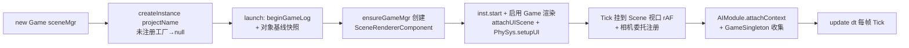
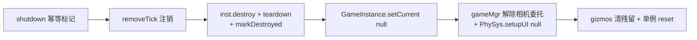

# 游戏流程系统（Engine Gameflow）

> UE 风格游戏流程：`Game → GameInstance → World → GameMode/GameState`，驱动 Actor 生命周期与 Tick 循环。
> 代码位置：`src/engine/gameflow/`
> 相关文档：[系统总览](../system_overview.md) / [实体体系](./entity_system.md)

## 1. 概述

游戏流程系统是引擎的运行时骨架，职责：

- **生命周期**：`Game` 管理游戏实例的创建/启动/停止
- **世界管理**：`World` 模仿 UE World，管理 Actor 注册、场景切换、Tick 循环
- **规则承载**：`GameMode`（游戏规则）/ `GameState`（全局状态）供项目继承覆写
- **渲染挂载**：`SceneRendererComponent` 创建游戏视口渲染器
- **存档**：`SaveSlotComponent` 提供键值存档槽

## 2. 核心类

| 类 | 说明 |
|---|---|
| `Game` | 游戏入口类：创建并包装 GameInstance、管理 Tick/Camera 同步注册、输入路由。`launch()` / `shutdown()` / `update(dt)` |
| `GameInstance` | 游戏实例抽象基类（项目继承）：`start/tick/syncCamera/stop/destroy` + `controller`。静态 `current` 为全局活跃实例；持有 `inputSys` 与 `renderContainer` |
| `GameInstanceCallbacks` | 回调接口：`onScoreChange` / `onPhaseChange` / `onGameOver` |
| `World` | 核心世界管理（继承 AObject）：持有 `THREE.Scene`、`gameMode`、`ui`（UIManager）、注册/查询 Actor、场景切换 |
| `GameMode` | 游戏规则基类（项目继承）：生成/胜负/分数逻辑 |
| `GameState` | 全局游戏状态 |
| `ActorManagerComponent` | Actor 的生成/创建/销毁/查询承载组件（World 保留同名转发方法兼容外部 API） |
| `SceneRendererComponent` | 游戏视口渲染器组件（由 World.ensureGameRenderer 创建，DOM 取自 `GameInstance.current.renderContainer`） |
| `SaveSlotComponent` | 存档组件（`KVValue` 键值存储，内存优先 + 手动/自动 flush 落盘） |
| `OObjectFactory` | OObject 族对象工厂 |
| `ThreeObjectFactory` | Three 对象族工厂（生成 Mesh/Sprite 等 Three 对象） |

## 3. 使用方法

### 3.1 入口 API

| 方法 | 签名 | 说明 |
|---|---|---|
| 创建实例 | `Game.createInstance(projectName, shared?, container?)` | 未注册工程 → warn 返回 null；重复创建先 shutdown 旧实例 |
| 启动 | `Game.launch(): boolean` | 无实例 → 返回 false；启动 GameInstance + 游戏渲染器 + Tick 挂载 + AIModule 上下文 |
| 停止 | `Game.shutdown()` | 幂等（`_shutdown` 标记）；销毁实例、回收单例、恢复相机 |
| 切换场景 | `World.SwitchToScene(sceneAsset \| sceneName, extraSetup?)` | 按资产或场景名切换 |
| 生成 Actor | `World.SpawnActorFromBlueprint(path, overrides?): Actor \| null` | 蓝图实例化，失败返回 null（内部 catch resolve 抛错） |
| 加载场景 | `World.loadSceneAsActors(sceneAsset): number` | 展开 SceneGroup 并实例化 ref 节点，返回生成数 |

### 3.2 使用示例

```ts
// 项目注册（register.ts / 项目入口）
GameFactoryRegistry.registerGame('fish', (shared, container) => new FishGameInstance(shared, container))

// 启动（Viewport / 编辑器层）
const game = new Game(...)
game.createInstance('fish', sharedScene, renderContainer)
game.launch()

// 场景切换（GameMode 内）
world.SwitchToScene('FishMenu')   // 按场景名
world.SwitchToScene(sceneAsset)   // 或按资产对象
```

### 3.3 触发时机与使用前提

- `createInstance` 必须先于 `launch()`；`launch` 前需 `setRenderers(sceneMgr)` 关联 Scene 视口（否则无 rAF Tick 源）
- 输入统一经 `GameInstance.inputSys` 路由（Viewport 不直接调用 PlayerController）
- 场景资产须先经 `AssetRegistry.registerAll` 注册，`SwitchToScene` 才能按名找到

## 4. 工作流程

### 4.1 游戏启动



- `GameSingleton`（`PhySys` / `AIModule` 等）由 `Game.launch` 收集、`Game.shutdown` 统一 `reset()` 回收，生命周期绑定 Game
- 输入统一经 `GameInstance.inputSys` 路由（Viewport 不直接调用 PlayerController）

### 4.2 场景切换（World.SwitchScene）

```
销毁旧场景 Actor → ui.destroyAll() → 若 newMode.HUDClass 则 ui.createHUD()
→ 加载新 SceneAsset（SceneLoader） → 实例化 blueprint/ref 节点
```

### 4.3 游戏停止（Game.shutdown）



## 5. 边界条件

| 条件 | 行为/后果 | 处理方式 |
|---|---|---|
| `createInstance` 工程未注册 | warn + 返回 null，不创建 | 先确认 `GameFactoryRegistry.registerGame` 已调用 |
| `launch()` 无实例 | `logger.error` + 返回 false | 先 createInstance |
| `inst.start()` 返回 false | 启动失败，返回 false | 检查 GameInstance.start 实现 |
| 重复 `createInstance` | 自动 shutdown 旧实例再新建 | 引擎内置，无需手动清理 |
| 重复 `shutdown` | 幂等，第二次直接返回 | 引擎内置 |
| `SpawnActorFromBlueprint` 蓝图未注册/ref 循环 | `BlueprintRegistry.resolve` 抛错被 catch → 返回 null + `logger.error` | 检查蓝图路径与引用 |
| 游戏实例无 world 字段 | `launch` 时 warn，AI 上下文未附加 | GameInstance 需挂载 World |
| 非 Electron 环境 | `ensureGameRenderer` 无容器时为 null，游戏仍可启动（无渲染） | 编辑器预览走 PreviewSceneManager |

## 6. 依赖关系

```
Game → GameInstance → World → ActorManagerComponent / UIManager / SceneRendererComponent
World → GameModeRegistry / AssetRegistry / ObjectRegistry / SceneLoader / ThreeObjectFactory
GameInstance → InputSys / PlayerController
```

## 7. 项目接入

项目在 `register.ts` 注册 `GameInstanceFactory` 与 `GameModeRegistry`：

- `GameFactoryRegistry.registerGame(projectName, factory)` — 注册游戏工厂
- `GameModeRegistry.register(modeName, ctor)` — 注册游戏模式
- 场景资产按 name 注册后可 `World.SwitchToScene('SceneName')` 切换

详细见 [资产与工具系统](./asset_tools_system.md) 与 [项目系统总览](../system_overview.md#三项目系统srcprojects)。
