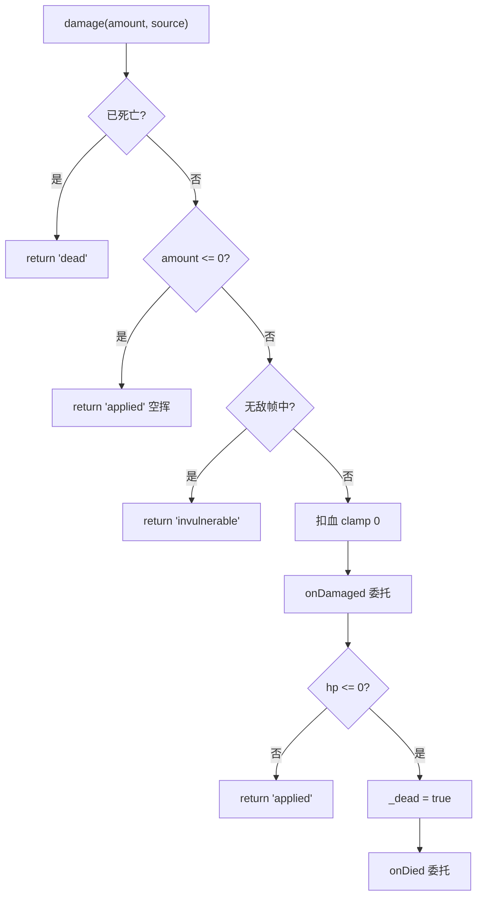
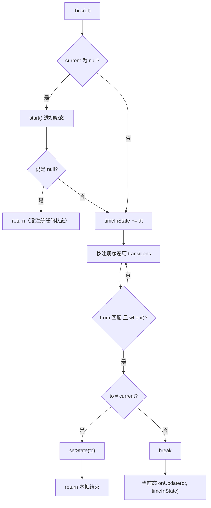

# gameplay 通用组件（HealthComponent / StateMachineComponent）

> **一句话定位**：引擎级两块通用战斗积木——血量/伤害结算（HealthComponent）与表驱动有限状态机（StateMachineComponent），arena 项目在用，fish 项目的手写版是它们的前身。
> **什么时候会用到你**：给 Actor 加血量/受击/死亡逻辑时；给敌人写巡逻/追击/攻击 AI 状态流转时；排查"无敌帧不消失/状态机不切状态"时。
> 代码位置：`src/engine/gameplay/HealthComponent.ts`、`src/engine/gameplay/StateMachineComponent.ts`

## 1. 先记住这几个文件

| 文件 | 一句话职责 | 你要改它的场景 |
|---|---|---|
| [HealthComponent.ts](../../src/engine/gameplay/HealthComponent.ts) | 血量结算：damage/heal/revive + 无敌帧 + 阵营 | 加护甲/暴击等伤害规则、接掉落逻辑 |
| [StateMachineComponent.ts](../../src/engine/gameplay/StateMachineComponent.ts) | 表驱动 FSM：状态表 + 转换表 + 首 Tick 自动启动 | 加并行状态/嵌套状态（先想清楚，明确不做行为树） |
| [registerBuiltinComponents.ts](../../src/engine/tools/registerBuiltinComponents.ts) | 两个组件的场景资产工厂注册 | 给组件加可在资产里配的 props |
| [SlimeActor.ts](../../src/projects/arena/gameplay/SlimeActor.ts) | 两个组件的完整装配范本（血量 + 六态 FSM） | 写新敌人时照抄结构 |

**关键心智模型**：这两个组件只做**数值与状态判定**，不做任何表现——受击特效、死亡动画、切状态的动画播放在哪，全部由游戏代码订阅委托或在 `onEnter/onExit` 里干。头注释写明 HealthComponent 是"从 fish 手写的 TroopHealth / GameMode 建筑血量 Map 下沉为引擎组件"的产物，fish 的 [TroopHealthComponent.ts](../../src/projects/fish/gameplay/battle/troops/TroopHealthComponent.ts) 是它的 gameplay 层前身（耦合了 GameMode 回调），新项目一律用引擎版。

## 2. HealthComponent：一次 `damage()` 结算了什么

### 2.1 调用方与装配

```ts
// src/projects/arena/gameplay/SlimeActor.ts:73 —— 装配
this.health = this.addComponent(HealthComponent)

// src/projects/arena/gameplay/SlimeActor.ts:112 —— 接触伤害，source 传自己
otherHealth.damage(SLIME_DAMAGE, this)

// src/projects/arena/gameplay/PlayerCombatComponent.ts:168 —— 攻击结算
const health = target?.getComponent(HealthComponent)
```

场景资产里也能直接挂：[registerBuiltinComponents.ts:796](../../src/engine/tools/registerBuiltinComponents.ts) 注册了工厂，支持 `maxHp/team/invulnDuration` 三个 props，创建后立即 `resetHp()`。这意味着 `.blueprint.json` 里配 `HealthComponent {maxHp: 50, team: 'enemy'}` 零代码生效。

### 2.2 damage 的四道门



```ts
// HealthComponent.ts:76
damage(amount: number, source?: unknown): DamageResult {
  if (this._dead) return 'dead'
  if (amount <= 0) return 'applied'
  if (this._invulnTimer > 0) return 'invulnerable'
  if (this._hp < 0) this._hp = this.maxHp
  this._hp = Math.max(0, this._hp - amount)
  this._invulnTimer = this.invulnDuration
  this.onDamaged?.(amount, source)
  if (this._hp <= 0) {
    this._dead = true
    this.onDied?.(source)
  }
  return 'applied'
}
```

返回值是三态 `DamageResult`（`'applied' | 'invulnerable' | 'dead'`），调用方能区分"打中但被无敌帧挡了"和"鞭尸"。`_hp = -1` 是**未初始化哨兵**：读 `hp` 时 `< 0` 就读作 `maxHp`，允许"先配 maxHp、忘了 resetHp 也能直接打"。扣血后立刻把 `invulnDuration` 填进计时器——受击无敌帧是**自动**的；闪避无敌是**手动**的，走 `grantInvulnerability(seconds)`（取与剩余无敌时间的较大值，避免短授予覆盖长授予）。

### 2.3 无敌帧衰减靠 Tick

```ts
// HealthComponent.ts:115
override Tick(dt: number): void {
  if (this._invulnTimer > 0) {
    this._invulnTimer = Math.max(0, this._invulnTimer - dt)
  }
}
```

无敌帧是计时器不是计数器，随 owner 的 Tick 衰减——**owner 没 `enableTick()` 就永远无敌**（见踩坑 1）。

### 2.4 hp 可编辑字段是"状态注入通道"

```ts
// HealthComponent.ts:131（节选）
{
  // 直接写血量（状态注入通道：ai.setProperty / GM / 调试；不走 damage 事件管线，
  // 不触发 onDamaged/onDied——只同步死亡标记）
  key: 'hp', type: 'number', min: 0,
  get: () => this.hp,
  set: (v) => {
    this._hp = Math.max(0, Math.min(this.maxHp, v as number))
    this._dead = this._hp <= 0
  },
},
```

Inspector / AI `setProperty` / GM 改血量走 `set` 直写，**故意绕过** damage 管线：调试灌血不应该触发受击特效和死亡委托，只同步 `_dead` 标记保证状态一致。这是 Inspector 双通道设计在战斗组件上的体现，见 [property_edit_system.md](../editor/core/property_edit_system.md)。

## 3. StateMachineComponent：一帧 Tick 跑了什么

### 3.1 表驱动：状态表 + 转换表

```ts
// src/projects/arena/gameplay/SlimeActor.ts:227 —— 转换表（注册序即优先级）
this.fsm
  .addTransition({ from: 'idle', to: 'dead', when: () => this.health.isDead })
  .addTransition({ from: 'idle', to: 'chase', when: () => distToTarget() < AGGRO_RANGE })
  .addTransition({ from: 'chase', to: 'dead', when: () => this.health.isDead })
  .addTransition({ from: 'windup', to: 'attack', when: () => this._attackTimer <= 0 })
  // ... 六态：idle / chase / windup / attack / recover / dead
```

`from: '*'` 表示任意状态；转换条件 `when()` 是闭包，所以**状态和转换只能在代码里注册**，场景资产工厂只支持 `initial` 一个 prop（`registerBuiltinComponents.ts:811` 注释："回调无法 JSON 表达"）。

### 3.2 Tick 判定循环



```ts
// StateMachineComponent.ts:93（节选）
override Tick(dt: number): void {
  if (this._current === null) {
    this.start()
    if (this._current === null) return
  }
  this._timeInState += dt
  for (const t of this._transitions) {
    if (t.from !== '*' && t.from !== this._current) continue
    if (t.when()) {
      if (t.to !== this._current) {
        this.setState(t.to)
        return // 切换后本帧不再执行新状态 onUpdate（下帧起跑）
      }
      break
    }
  }
  this._states.get(this._current)?.onUpdate?.(dt, this._timeInState)
}
```

三个反直觉点，都是刻意的：

1. **切换后本帧直接 return**——新状态的 `onUpdate` 下帧才起跑，保证 `onEnter` 与首帧 `onUpdate` 不在同一帧挤在一起（不然入场逻辑和持续逻辑会打架）。
2. **`when()` 命中但 `to === current` 时 break 不 setState**——同态"自转换"不重放 `onEnter`。想要"重新进入当前状态"的语义必须显式 `setState(同名)`（它内部有 `if (this._current === name) return true` 幂等守卫，强制重进得先去别的状态再回来，或自行清状态）。
3. **首 Tick 自动 `start()`**——不需要游戏代码记得调 `start()`，`addState` 注册的第一个状态自动成为 `initial`。但 `initial` 为空字符串时永远停在 null（见踩坑 4）。

### 3.3 当前状态是 AI 快照的一等公民

```ts
// src/engine/ai/registerBuiltinAIHandlers.ts:254 —— GET_STATE 快照
const health = a.getComponent(HealthComponent)
if (health) {
  ;(base as { hp?: number; maxHp?: number }).hp = Math.round(health.hp * 10) / 10
  ;(base as { maxHp?: number }).maxHp = health.maxHp
}
const fsm = a.getComponent(StateMachineComponent)
if (fsm && fsm.current) {
  ;(base as { state?: string }).state = fsm.current
}
```

挂了这两个组件的 Actor 自动在 `ai.getState` 快照里带出 `hp/maxHp/state` 字段——AI 调试时不用任何额外接线就能看到敌人当前状态。这也是头注释写"进 ai.getState 输出（AI 调试刚需）"的落点，详见 [ai_system.md](./ai_system.md)。

## 4. 关键方法速查

| 方法 | 位置 | 干什么 | 注意 |
|---|---|---|---|
| `damage(amount, source?)` | [HealthComponent.ts:76](../../src/engine/gameplay/HealthComponent.ts) | 四道门伤害结算 | 三态返回值；自动上无敌帧 |
| `heal(amount)` | [HealthComponent.ts:92](../../src/engine/gameplay/HealthComponent.ts) | 治疗 clamp maxHp | 死亡不可治疗；返回实际治疗量 |
| `revive(fraction?)` | [HealthComponent.ts:103](../../src/engine/gameplay/HealthComponent.ts) | 复活按比例填充 | 清死亡标记与无敌帧 |
| `resetHp(hp?)` | [HealthComponent.ts:66](../../src/engine/gameplay/HealthComponent.ts) | 初始化/重置血量 | 对象池复用、开局配置后调用 |
| `grantInvulnerability(sec)` | [HealthComponent.ts:110](../../src/engine/gameplay/HealthComponent.ts) | 手动无敌（闪避用） | 取较大值不覆盖 |
| `Tick(dt)` | [HealthComponent.ts:115](../../src/engine/gameplay/HealthComponent.ts) | 无敌帧衰减 | owner 必须 enableTick |
| `addState(state)` | [StateMachineComponent.ts:58](../../src/engine/gameplay/StateMachineComponent.ts) | 注册状态 | 重名覆盖；首个自动为 initial |
| `addTransition(t)` | [StateMachineComponent.ts:65](../../src/engine/gameplay/StateMachineComponent.ts) | 注册转换 | 注册序即优先级 |
| `setState(name)` | [StateMachineComponent.ts:71](../../src/engine/gameplay/StateMachineComponent.ts) | 强制切换 | 未知状态 warn + false |
| `Tick(dt)` | [StateMachineComponent.ts:93](../../src/engine/gameplay/StateMachineComponent.ts) | 转换判定 + onUpdate | 切换后本帧 return |

## 5. 流程影响：牵动哪些功能

### 上游：谁驱动它

| 上游 | 怎么驱动 | 相关文档 |
|---|---|---|
| Actor 组件 Tick 链 | owner `enableTick()` 后每帧调 `Tick`（无敌帧衰减 / FSM 判定） | [entity_system.md](./entity_system.md) |
| `ComponentRegistry` 场景工厂 | 蓝图/场景资产按名挂载 + props 注入 | [asset_tools_system.md](./asset_tools_system.md) |
| arena gameplay | SlimeActor / ArenaPlayerPawn / PlayerCombatComponent 装配与调用 | [gameplay_code_standard.md](../engine/../projects/gameplay_code_standard.md) |
| AI 事件 `GET_STATE` / `setProperty` | 快照读 hp/state；setProperty 直写 hp | [ai_system.md](./ai_system.md) |

### 下游：它波及谁

| 下游功能 | 波及点 | 相关文档 |
|---|---|---|
| fish TroopHealthComponent | 引擎版的前身，功能重叠；fish 迁移后应删除 | [battle_system.md](../engine/../projects/battle_system.md) |
| UI 血条（规划中） | `ratio` getter 专为血条准备，订阅 `onDamaged` 刷新 | [ui_system.md](./ui_system.md) |
| Inspector 属性面板 | `getEditableProperties` 提供四个可编辑字段 | [property_edit_system.md](../editor/core/property_edit_system.md) |

## 6. 踩坑清单（都有代码依据）

**1. 挂了 HealthComponent 永远无敌 / FSM 不切状态** —— 原因：owner 没 `enableTick()`，两个组件的 `Tick` 根本不被调用。规则：装配处显式 `enableTick()`，且 Actor 的 `Tick` 里不能漏 `super.Tick(dt)`（组件链由它驱动，[SlimeActor.ts:277](../../src/projects/arena/gameplay/SlimeActor.ts) 注释原话"绝不能漏"）。

**2. GM/AI 灌血没触发受击表现** —— 原因：`hp` 可编辑字段是状态注入通道，直写内部字段、不进 damage 管线、不发委托（代码注释明确"不走 damage 事件管线"）。规则：需要触发表现一律走 `damage()`，直写只用于调试与状态同步。

**3. 转换规则顺序错了，窄条件永远轮不到** —— 原因：Tick 按注册序判定，首个命中即切（`return`）。若 `idle→chase` 注册在 `idle→dead` 之前，死亡瞬间若同时满足追击条件就会先进 chase，下一帧才进 dead，动画顺序错乱。规则：**必达转换（如死亡）永远最先注册**。

**4. 场景里挂了 StateMachineComponent 却永远"（未启动）"** —— 原因：工厂只支持 `initial` prop，状态/转换必须代码注册；一个状态都没注册时 `initial` 为空，首 Tick `start()` 判 `if (this.initial)` 失败，`current` 永远 null。规则：蓝图挂 FSM 组件只是占位，必须在对应 Actor 脚本里 `addState/addTransition`。

**5. 以为"自转换"会重放入场逻辑** —— 原因：Tick 里 `to === current` 时 break 不调 `setState`，`onEnter` 不重放。规则：重进状态需先切到中间态再切回，或把"每次触发都要跑"的逻辑从 `onEnter` 挪到 `onUpdate`/事件回调。

## 7. 边界条件

| 条件 | 行为 | 怎么应对 |
|---|---|---|
| 对象池复用未 `resetHp` | `_hp` 保留上一世残值 | 复用时必须 `resetHp()`（工厂已内置） |
| `damage` 负数/零 | 返回 `'applied'` 但不扣血不触发委托 | 空挥与实伤由调用方区分 |
| `heal` 溢出 | clamp 到 maxHp，返回实际增量 | UI 加血飘字用返回值 |
| `revive(0)` | 至少复活 1 滴血（`Math.max(1, ...)`） | 全灭复活不会卡 0 |
| FSM 未注册任何状态 | `current` 恒 null，Tick 空转 | getProperties 显示"（未启动）"可诊断 |
| `setState` 未知状态 | `logger.warn` + return false，不崩溃 | 警告里列出所有现有状态名 |
| 两个组件同帧互杀 | 死亡转换 `when: () => this.health.isDead` 每态都注册 | 参考 SlimeActor 的转换表写法 |
