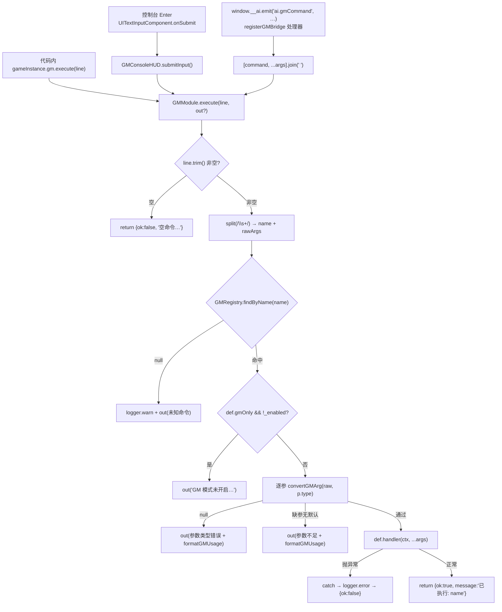

# GM 命令系统（GM Module）

> **一句话定位**：运行时调试命令系统——一条命令 = 一个 `*.gm.ts` 文件，由 `import.meta.glob` 自动注册进 `GMRegistry`，`GMModule.execute(line)` 把「命令名 参数…」文本行解析成类型化参数并同步执行 handler。
>
> **什么时候会用到你**：给项目加一条调试命令（加钱/跳关/清存档）、排查「命令没生效 / 提示未知命令 / 参数报错」、改 GM 控制台面板样式或交互、从 AI / Playwright 远程驱动游戏状态。
>
> 代码位置：`src/engine/gm/`（引擎核心）+ `src/projects/<项目>/gameplay/gm/*.gm.ts`（项目命令）

---

## 1. 先记住这几个文件

| 文件 | 一句话职责 | 你要改它的场景 |
|---|---|---|
| [GMModule.ts](../../src/engine/gm/GMModule.ts) | 实例级执行器：解析命令行、GM 开关、控制台开关、全局键盘/滚轮钩子 | 加执行期校验、改控制台开合或快捷键 |
| [GMRegistry.ts](../../src/engine/gm/GMRegistry.ts) | 静态注册表：`id → GMCommandDef`，含 glob 批量注册与 id 推导 | 改注册规则/id 推导/查重行为 |
| [GMCommand.ts](../../src/engine/gm/GMCommand.ts) | 命令类型定义 + `convertGMArg` 类型转换 + `formatGMUsage` 用法格式化 | 加参数类型、改用法/默认参数文本 |
| [GMConsoleHUD.ts](../../src/engine/gm/GMConsoleHUD.ts) | 游戏内控制台面板（资产驱动、fail-fast）：输出区 / 输入框 / 命令列表 / 搜索 | 改面板交互、绑定点、层级 |

**关键心智模型**：注册表是**静态**的（`GMRegistry`，进程级，跨游戏实例共享），执行器是**实例**的（`GameInstance.gm`，每局一个）。所以命令定义只注册一次、全局可见，但 `enabled` 开关、控制台面板跟着某一局游戏实例走——切工程/重开局，命令还在，开关复位。

---

## 2. 一条 GM 命令怎么被执行：从输入到生效

### 2.1 谁注册了命令

命令有两类来源，注册时机完全不同。

**① 内置命令 —— 编辑器启动时注册一次**

`src/projects/registry.ts` 的 `registerAllProjectModules`（由 `EditorInitializer.registerAllProjects` → `Editor.ts:50` 调用）：

```ts
// 注册 GM 命令系统（内置命令 + ai.gmCommand 桥接，幂等）
registerBuiltinGMCommands()
registerGMBridge()
```

内置命令共 5 条，定义在 [registerBuiltinGMCommands.ts](../../src/engine/gm/builtin/registerBuiltinGMCommands.ts) 的 `BUILTIN_COMMANDS` 数组里，id 一律 `builtin/xxx`：`help`（列出全部命令 + `formatGMUsage` 用法）、`list`（只列名）、`clear`（清空输出区）、`gm.enable`、`gm.disable`。其中只有 `gm.disable` 标了 `gmOnly: true`——**它是唯一被自己关掉后拒绝执行的命令**，其余命令都不受 GM 开关影响。

**② 项目命令 —— 项目 `register.ts` 里一行 glob，新增文件零改代码**

[register.ts:25](../../src/projects/fish/register.ts)：

```ts
GMRegistry.registerProjectGlob(
  import.meta.glob('./gameplay/gm/*.gm.ts', { eager: true }) as Parameters<typeof GMRegistry.registerProjectGlob>[0],
)
```

glob 的 key 就是相对路径，id 由它推导（[GMRegistry.ts:26](../../src/engine/gm/GMRegistry.ts)）：

```ts
function globKeyToGMId(key: string): string {
  return key
    .replace(/^\.\//, '')   // 去掉 './' 前缀
    .replace(/\.gm\.ts$/, '') // 去掉 '.gm.ts' 后缀
}
```

`./gameplay/gm/addCoins.gm.ts` → `gameplay/gm/addCoins`。**这里最容易踩的是只剥 `./` 不剥 `../`**——`ScriptRegistry` 的 `globKeyToScriptId` 剥的是 `../`（脚本 glob 从 `asset/index.ts` 出发，要上一级到 `gameplay/`），GM 的 glob 从项目根 `register.ts` 出发，剥 `./`。两边写法看起来几乎一样，**照抄 ScriptRegistry 的正则会让 id 变成 `../gameplay/gm/addCoins`**。

与 `ScriptRegistry` 的其余差异：

| 维度 | GMRegistry | ScriptRegistry |
|---|---|---|
| 注册入口 | 项目 `register.ts` 直接调 `registerProjectGlob` | 项目 `asset/index.ts` → `AssetRegistry.registerAll` → `ScriptRegistry.registerAll` |
| glob 起点 | 项目根（`./gameplay/gm/`） | `asset/` 目录（`../gameplay/base/`） |
| 剥前缀 | `^\./` | `^\.\./` |
| 存的内容 | 命令**对象**（单例定义） | 脚本**类构造器**（每次 `create` new 一个） |
| 跳过条件 | 无默认导出、无 `handler`、缺 `name`/`description` | 无默认导出 |
| 清空时机 | 工程切换由调用方决定（`clearAll` 现无调用方） | `clearProjectAssets()` 调 `ScriptRegistry.clearAll()` |

**③ 重复注册防护（幂等）**

`GMRegistry.register` 对同一 id 直接 `set` 覆盖，只在定义**实质不同**时才 warn（[GMRegistry.ts:36](../../src/engine/gm/GMRegistry.ts)）：

```ts
static register(id: string, def: GMCommandDef): void {
  const old = GMRegistry.entries.get(id)
  GMRegistry.entries.set(id, def)
  if (old) {
    // 仅在定义实质不同时 warn（HMR 重载同一模块 → 同函数对象 → 跳过无害覆盖）
    const isSameDef = old.name === def.name && old.description === def.description
    if (!isSameDef) {
      logger.warn(`[GMRegistry] 命令 "${id}" 重复注册，已覆盖（旧 name=${old.name} → 新 name=${def.name}）`)
    }
  } else {
    logger.debug(`[GMRegistry] 注册命令: ${id} (name=${def.name})`)
  }
}
```

这个「实质不同才 warn」是 HMR 兜底：Vite 热重载会重跑 `register.ts`，同一 id 重新注册是**预期行为**，如果无条件 warn，日志会被刷屏。**注意它不校验 `name` 唯一性**——两个不同 id 的命令可以叫同一个 `name`，注册时不报，`findByName` 返回先注册的那个。旧文档写的「重名在注册时已 warn」是错的。

### 2.2 调用链路



**入口 A —— 游戏内控制台**：输入框回调在资产加载时就挂好了（[GMConsoleHUD.ts:165](../../src/engine/gm/GMConsoleHUD.ts)）：

```ts
if (isInput && !this._input) {
  this._input = comp
  comp.onSubmit = () => this.submitInput()
}
```

`submitInput` 执行 → 回显 `> line` → 回显 `result.message` → 清空输入框 → 重新聚焦（[GMConsoleHUD.ts:240](../../src/engine/gm/GMConsoleHUD.ts)）：

```ts
protected submitInput(): void {
  if (!this._input) return
  const line = this._input.value
  if (!line.trim()) return
  const result = this._gm.execute(line)
  this.appendOutput(`> ${line}`)
  if (result.message) this.appendOutput(result.message)
  this._input.clear()
  this._input.focus()
}
```

注意这里 `execute(line)` **不传 `out` 回调**——handler 里的 `ctx.output` 会走 `GMModule.execute` 内部那条 `this._console?.appendOutput(text)`（见 2.3），所以 handler 的输出会**先于** `> line` 这行被追加。控制台上看到的是「命令输出在前、回显命令行在后」，这是真实顺序，不是 bug 但很反直觉。

**入口 B —— AI / MCP 桥接**：[registerGMBridge.ts:32](../../src/engine/gm/registerGMBridge.ts) 把 payload 拼回文本行，与控制台**共用同一个 `execute`**：

```ts
ai.register(AI_EVENT_GM_COMMAND, (payload: unknown): AIGMCommandResult => {
  const p = (payload ?? {}) as AIGMCommandPayload
  const command = p.command ?? ''
  if (!command) {
    logger.warn('[GM-Bridge] ai.gmCommand 缺少 command')
    return { ok: false, message: '缺少 command 字段' }
  }
  const line = [command, ...(p.args ?? [])].join(' ')
  // …
  const outputs: string[] = []
  const result = gm.execute(line, (text) => { outputs.push(text) })
  const message = outputs.length > 0 ? outputs.join('\n') : result.message
  return { ok: result.ok, message }
})
```

两个细节决定了 AI 看到什么：**一是 `message` 优先用 handler 的 `ctx.output` 文本**，没有输出才退回 `已执行: xxx`——所以想让 AI 读到结果，命令必须 `ctx.output(...)`；**二是 `args` 是字符串数组**，类型照样走 `convertGMArg`，`{command:'addCoins', args:['100']}` 和控制台敲 `addCoins 100` 完全等价。

注册前先 `ai.clearEvent(AI_EVENT_GM_COMMAND)`，HMR 重载不会叠加处理器。

关于 MCP：`editor/mcp-server.mjs` 目前**没有 `send_command` 工具**，它的 `ListToolsRequestSchema` 只列出 `ui_compile` / `get_scene_outline` / `get_ui_outline` / `get_assets` 加 `mcp-cdp.mjs` 的 `cdp_*`。主进程的 `/api/command`（`electron/main.ts:1758`）支持 `ai_event` 往返，但 mcp-server 没把这个命令包成工具。**当前从 MCP 触发 GM 命令的可行路径是 `cdp_evaluate` 执行 `window.__ai.emit('ai.gmCommand', {command, args})`**，或直接在浏览器里调 `window.__ai`（`EditorInitializer.ts:336` 暴露）。`send_command` 只存在于 `doc/harness/dsh_vscode_demostudio_prd.md` 的规划里，尚未实现。

### 2.3 参数解析与回显

核心在 [GMModule.ts:159](../../src/engine/gm/GMModule.ts)——`ctx.output` 是**双通道**：既回调外部 `out`（AI 桥接收集），又追加到控制台面板：

```ts
const ctx: GMCommandContext = {
  gameInstance: this._instance,
  output: (text) => {
    out?.(text)
    this._console?.appendOutput(text)
  },
  logger,
}
try {
  logger.info(`[GM] 执行命令: ${name} ${rawArgs.join(' ')}`)
  def.handler(ctx, ...args)
  return { ok: true, message: `已执行: ${name}` }
} catch (err) {
  const msg = `命令执行异常: ${name}（${(err as Error)?.message ?? String(err)}）`
  logger.error(`[GM] ${msg}`)
  out?.(msg)
  return { ok: false, message: msg }
}
```

`catch` 包住 handler 是硬要求：**一条命令炸了不能拖垮游戏循环**。`logger.info` 打出的是 `rawArgs.join(' ')`（原始参数），不是转换后的值——排查参数问题时日志里看到的是用户输入原样。

参数转换在 [GMCommand.ts:67](../../src/engine/gm/GMCommand.ts)，`convertGMArg` 对非法输入返回 `null`（不抛异常）：`int` 用 `/^-?\d+$/`、`float` 用 `/^-?\d+(\.\d+)?$/`（**`1.` 和 `.5` 都不合法**）、`bool` 只认 `true/1/false/0`（大小写不敏感）、`string` 原样返回。

**失败分支的完整清单**（都在 `GMModule.execute` 里，逐条 `logger.warn` + `out?.(msg)` + `return {ok:false}`）：

| 失败点 | 返回的 message |
|---|---|
| 空行 / 全空白 | `空命令（输入 help 查看全部命令）` |
| `findByName` 未命中 | `未知命令: <name>（输入 help 查看全部命令）` |
| `gmOnly` 且开关关闭 | `GM 模式未开启: <name>（输入 gm.enable 开启）` |
| 必填参数缺失且无 `default` | `参数不足: <用法>（<p.name>: <p.desc ?? p.type>）` |
| 类型转换返回 `null` | `参数类型错误: <p.name> 应为 <type>（收到 "<raw>"）；用法 <用法>` |
| handler 抛异常 | `命令执行异常: <name>（<err.message>）` |

参数循环里有个反直觉分支（`GMModule.ts`:129 起）：`required === false` 且无 `default` 的参数缺参时执行 `break`——**直接中止参数填充，后面所有参数都不再解析**，而不是跳过继续。所以可选参数必须写在参数表末尾，否则中间一个可选参数缺省会把它后面的必填参数一起吃掉，最终报「参数不足」但指向的是中间那个可选参数。

**命令未注册时的行为是「静默 + warn」**：`/logger.warn/` 写日志、`out` 回显提示，但不抛异常、不中断。游戏继续跑。这就是为什么打错命令名的现场表现只是控制台多一行红字，排查时直接搜日志 `[GM] 未知命令`。

---

## 3. 游戏内控制台 GMConsoleHUD

**开关**：`G+M` 打开 / `Esc` 关闭，由 [InputSys.ts:111](../../src/engine/input/InputSys.ts) 在每个按键最前面拦截：

```ts
handleKeyDown(key: string, controller?: PlayerController | null): void {
  InputPromptSystem.instance.setDevice('keyboard')
  // GM 模块全局键盘钩子（控制台打开 → 消费输入；G+M → 开关面板）
  if (GMModule.handleGlobalKeyDown(key)) return
  controller?.ProcessInput(key, 'pressed')
}
```

`handleGlobalKeyDown` 的三段优先级（`GMModule.ts`:269）：面板已开 → `Escape` 关面板并消费、`Shift/Control/Alt` 直接消费（不进输入框）、其余转 `console.handleInputKey(key)`；面板未开 → `g` 记 `_gKeyDown = true` 并**返回 false 不消费**（游戏里单按 G 照常生效），`m` 且 G 按住 → 开面板并消费 M。`_gKeyDown` 是**静态字段**，靠 `handleGlobalKeyUp` 清，防止组合键状态残留。

**面板是资产驱动且 fail-fast**：`panelAssetPath` getter 返回 `null` 时构造直接抛错，不回退程序化构建（[GMConsoleHUD.ts:113](../../src/engine/gm/GMConsoleHUD.ts)）：

```ts
if (!this.panelAssetPath) {
  throw new Error(
    `[GMConsoleHUD] 未配置 panelAssetPath（GM 面板为资产驱动强制，请在子类指定 widget 资产路径）`,
  )
}
this.loadPanelFromAsset()
```

`panelAssetPath` 用 **getter 而不是实例字段**，因为基类构造函数里就要读它，而子类实例字段要到 `super()` 返回后才初始化——用字段会读到 `undefined`。项目侧覆写两个 getter 即可换皮（[FishGMConsoleHUD.ts](../../src/projects/fish/gameplay/gm/FishGMConsoleHUD.ts)）：`panelAssetPath` 指向 `asset/blueprints/ui/gm_panel.widget.json`，`readyMessage` 返回主题欢迎语。

`loadPanelFromAsset` 做四件事：`spawnUIActor` 生成资产树 → `attachTo(this)` → 递归给每个 `CanvasUIComponent` 的 `zOrder` 加 `GM_ZORDER_BASE`（1000，远高于 `UIManager.FLOAT_LAYER_BIAS = 100`，保证盖过任何浮动面板）→ 按组件名绑定控件。绑定规则有两种约定（[GMConsoleHUD.ts:158](../../src/engine/gm/GMConsoleHUD.ts)）：

```ts
const bind = (a: Actor): void => {
  const nodeName = a.root.name
  for (const comp of a.getComponents(UITextInputComponent)) {
    const isInput = comp.name === 'GM_InputText' || nodeName === 'GM_InputBox'
    const isSearch = comp.name === 'GM_SearchInput' || nodeName === 'GM_SearchInput'
    if (isInput && !this._input) {
      this._input = comp
      comp.onSubmit = () => this.submitInput()
    }
    if (isSearch && !this._searchInput) {
      this._searchInput = comp
      comp.onTextChanged = (value) => this.applySearchFilter(value)
    }
  }
  // …
}
```

**定位节点比较的是 `root.root.name`（Group 名），不是 `Actor.name`**——`spawnUIActor` 只设 Group 名，`Actor.name` 恒为类名（`'Actor'`）。缺 `GM_OutputText`/`GM_InputText` 时先 `destroyUIActor` 销毁已生成的资产树再抛错，避免泄漏成孤儿面板（[GMConsoleHUD.ts:182](../../src/engine/gm/GMConsoleHUD.ts)）。

**输入交互**：`handleInputKey`（[GMConsoleHUD.ts:431](../../src/engine/gm/GMConsoleHUD.ts)）里 `Tab` 是**在搜索框和输入框之间切焦点，不是命令补全**；焦点所在框接收全部按键；`Enter` 在 `UITextInputComponent.handleKey` 里触发 `onSubmit` 并**返回 true 但不清空**（清空由 `submitInput` 负责）。输入框支持 `Backspace/Delete/Arrow/Home/End/Ctrl+A/C/X/V` 与 Shift 框选，点击定位光标走 `setCursorFromClick`。

**关于历史与补全，如实说明**：当前**没有**上下箭头翻命令历史，**没有** Tab 命令名补全。等价能力是搜索框（`applySearchFilter` 按 name / 路径 id / description 小写包含过滤，实时刷新命令列表）与命令按钮列表（点击用 `formatGMExecutable(def)` 把「命令名 + 默认参数」填进输入框，必填 `int` 填 1、`float` 填 `1.0`、`bool` 填 `true`、必填 `string` 无默认值则跳过）。想加历史就在 `GMConsoleHUD` 里加缓冲并在 `handleInputKey` 里接 `ArrowUp/ArrowDown`。

**输出与层级**：`appendOutput` 保留最近 `MAX_OUTPUT_LINES = 12` 行，超出丢最旧。`getOutputLines()` / `getLayerSummary()` 是给 Playwright 断言用的快照口。`EndPlay` 先调 `gm.notifyConsoleDestroyed()` 再摘 paste 监听——**顺序不能反**，否则场景切换连带销毁面板时 `GMModule._console` 会悬空。

---

## 4. 关键方法速查

| 方法 | 位置 | 干什么 | 注意 |
|---|---|---|---|
| `GMModule.execute(line, out?)` | [GMModule.ts:104](../../src/engine/gm/GMModule.ts) | 解析并执行一行命令，返回 `{ok, message}` | 同步；handler 异常被 catch，不抛给调用方 |
| `GMModule.openConsole()` | [GMModule.ts:189](../../src/engine/gm/GMModule.ts) | 开建面板（幂等），挂到 `world.ui.hud` 下 | 无 `world` 时只 warn 返回，不建面板 |
| `GMModule.closeConsole()` | [GMModule.ts:213](../../src/engine/gm/GMModule.ts) | 销毁面板 | 面板已 `bPendingDestroy` 时只清引用，不重复 destroy |
| `GMModule.notifyConsoleDestroyed()` | [GMModule.ts:240](../../src/engine/gm/GMModule.ts) | 外部销毁回调（场景切换） | 只清引用 |
| `GMModule.handleGlobalKeyDown(key)` | [GMModule.ts:269](../../src/engine/gm/GMModule.ts) | 键盘钩子，返回 true 表示已消费 | 静态；`GameInstance.current` 为空直接 false |
| `GMModule.handleGlobalScroll(delta)` | [GMModule.ts:310](../../src/engine/gm/GMModule.ts) | 面板打开时滚轮滚命令列表 | 无 `_cmdList` 返回 false，滚轮穿透给游戏 |
| `GMModule.setConsoleFactory(f)` | [GMModule.ts:46](../../src/engine/gm/GMModule.ts) | 注入项目自定义面板子类 | 传 `null` 恢复引擎默认（`panelAssetPath` 为 null → 构造抛错） |
| `GMRegistry.registerProjectGlob(modules)` | [GMRegistry.ts:83](../../src/engine/gm/GMRegistry.ts) | 批量注册 glob 结果，id 由路径推导 | 缺默认导出/handler/name/description 的模块 warn 后跳过 |
| `GMRegistry.findByName(name)` | [GMRegistry.ts:66](../../src/engine/gm/GMRegistry.ts) | 按调用名线性查表 | 重名返回先注册的，重名本身不 warn |
| `GMRegistry.getAll()` | [GMRegistry.ts:61](../../src/engine/gm/GMRegistry.ts) | 返回 `[id, def][]`（按注册顺序） | `help` / 命令按钮列表的数据源 |
| `convertGMArg(raw, type)` | [GMCommand.ts:67](../../src/engine/gm/GMCommand.ts) | 字符串 → int/float/bool/string | 非法返回 `null`；float 不接受 `1.` / `.5` |
| `formatGMUsage(def)` | [GMCommand.ts:92](../../src/engine/gm/GMCommand.ts) | 生成 `<a:int> [b:bool]` 用法串 | 报错文本里附的就是它 |
| `formatGMExecutable(def)` | [GMCommand.ts:105](../../src/engine/gm/GMCommand.ts) | 生成可直接执行的命令行（填默认参数） | float 整数值补 `.0`，否则会被解析成 int |
| `registerGMBridge()` | [registerGMBridge.ts:28](../../src/engine/gm/registerGMBridge.ts) | 注册 `ai.gmCommand` 处理器 | 先 `clearEvent` 再注册，HMR 幂等 |
| `registerBuiltinGMCommands()` | [registerBuiltinGMCommands.ts:92](../../src/engine/gm/builtin/registerBuiltinGMCommands.ts) | 注册 5 条内置命令 | 同 id 覆盖语义，重复调用不产生重复条目 |
| `GMConsoleHUD.loadPanelFromAsset()` | [GMConsoleHUD.ts:137](../../src/engine/gm/GMConsoleHUD.ts) | 加载资产树 + 抬层级 + 绑定控件 | fail-fast，缺关键组件抛错 |
| `GMConsoleHUD.submitInput()` | [GMConsoleHUD.ts:240](../../src/engine/gm/GMConsoleHUD.ts) | 执行 → 回显 → 清空 → 聚焦 | `execute` 不传 `out`，靠 `ctx.output` 落面板 |
| `GMConsoleHUD.handleInputKey(key)` | [GMConsoleHUD.ts:431](../../src/engine/gm/GMConsoleHUD.ts) | 键盘路由：Tab 切焦点 / 转交输入框 | Tab 不是补全；无输入框时仍返回 true 消费 |
| `GMConsoleHUD.applySearchFilter(q)` | [GMConsoleHUD.ts:302](../../src/engine/gm/GMConsoleHUD.ts) | 按 name/id/description 过滤命令 | 过滤后 `scrollOffset = 0` 回顶部 |
| `GMConsoleHUD.appendOutput(text)` | [GMConsoleHUD.ts:334](../../src/engine/gm/GMConsoleHUD.ts) | 追加输出，滚动窗口 12 行 | `MAX_OUTPUT_LINES = 12`（`GMConsoleHUD.ts:38`） |
| `GameInstance.teardown()` | [GameInstance.ts:171](../../src/engine/gameflow/GameInstance.ts) | 调 `this.gm.dispose()` 关面板复位开关 | 由 `Game.shutdown` 在实例 destroy 之后调用 |

**fish 项目现有命令**（`src/projects/fish/gameplay/gm/`）：`addCoins(amount:int)`、`addElixir(amount:int)`、`addTroop(troopId:string, count:int)`、`fastTrain(scale:float，默认 0.01)`、`unlockBattle`（每兵种注入 999 军队）、`winLevel`、`clearEnemies`、`resetSave`——共 8 条，加 5 条内置。

---

## 5. 流程影响：牵动哪些功能

### 上游：谁驱动它

| 上游 | 怎么驱动 | 相关文档 |
|---|---|---|
| 输入系统 | `InputSys.handleKeyDown/KeyUp/handleScroll` 在转发给 Controller 前先调 `GMModule` 三个静态钩子，返回 true 即吞掉按键 | [./script_system.md](./script_system.md) |
| AI 事件总线 | `ai.gmCommand` 事件 → `registerGMBridge` → `GMModule.execute` | [./ai_system.md](./ai_system.md) |
| MCP / 编辑器集成 | 主进程 `/api/command` 的 `ai_event` 往返到渲染进程；MCP 侧当前需经 `cdp_evaluate` 调 `window.__ai.emit` | [../editor/integration/mcp_integration.md](../editor/integration/mcp_integration.md) |
| 项目注册 | 项目 `register.ts` 的 glob 与 `setConsoleFactory` 决定命令集与面板皮肤 | [../projects/clash_master.md](../projects/clash_master.md) |
| 游戏流程 | `GameInstance` 构造挂载 `readonly gm`，`teardown` 调 `gm.dispose()` | [./gameflow_system.md](./gameflow_system.md) |

### 下游：它波及谁

| 下游功能 | 波及点 | 相关文档 |
|---|---|---|
| 世界 UI | 面板经 `world.ui.spawnUIActor` 生成、`attachTo(world.ui.hud)`、`destroyUIActor` 回收；层级靠 `GM_ZORDER_BASE` 抬升 | [./ui_system.md](./ui_system.md) |
| 画布渲染层级 | `CanvasUIComponent.zOrder` 整树 +1000，与 `UIManager.reassignTreeOrder` / `FLOAT_LAYER_BIAS` 共同决定谁在最上层 | [./ui_canvas_component.md](./ui_canvas_component.md) |
| 资产系统 | 面板结构以 widget 资产为唯一事实源，资产改动直接影响绑定成败 | [./asset_tools_system.md](./asset_tools_system.md) |
| 项目玩法状态 | handler 经 `ctx.gameInstance` duck-typed 改资源/军队/关卡/存档，等价玩家操作 | [../projects/clash_master.md](../projects/clash_master.md) |
| 场景切换 | HUD 被回收时 `EndPlay` → `notifyConsoleDestroyed`，面板随场景一起消失 | [./gameflow_system.md](./gameflow_system.md) |

---

## 6. 踩坑清单

**1. 照抄 `ScriptRegistry` 的 id 推导正则，命令 id 带着 `../`**
现象：命令能注册、能执行，但 id 是 `../gameplay/gm/addCoins`，日志和搜索过滤里都带脏前缀。
原因：`globKeyToScriptId` 剥 `^\.\./`，GM 的 glob 从项目根出发必须剥 `^\./`。
规则：写新注册器时先确认 glob 起点目录，再决定剥哪个前缀——两个函数的后缀规则（`.script.ts` / `.gm.ts`）也不同。

**2. `*.gm.ts` 写了但提示「未知命令」，日志只有一行 warn**
现象：控制台回显 `未知命令: xxx`，游戏照常跑，没有任何报错弹窗。
原因：三选一——文件不在 `gameplay/gm/` 目录下（glob 不匹配）、模块缺默认导出或 `handler` 不是函数、缺 `name`/`description`；这几种情况 `registerProjectGlob` 都是 **warn 后 `continue` 跳过该文件**，不抛错。
规则：加完命令先看启动日志里 `[GMRegistry] 项目命令批量注册: N 个` 的 N 是否 +1；没加就是被跳过了，搜 `[GMRegistry] 命令模块 … 已跳过`。

**3. `GMModule` ↔ `GameInstance` 循环 import**
现象：模块顶层互相 import 时，其中一个拿到 `undefined`。
原因：ESM 顶层求值顺序。
规则：`GMModule` 对 `GameInstance` 用**值导入**但只在方法体内访问（`GameInstance.current`），模块顶层不求值，经 ESM live binding 安全。同理命令 handler 里访问项目能力必须 `ctx.gameInstance as unknown as {...}` duck-typed，**禁止 import 项目类**，否则引擎层反向依赖项目层。

**4. 想给 `UITextComponent` / `UITransformComponent` 传构造选项报错**
现象：`anchor: null` 报类型错、`name` 不在 `UITextComponentOptions` 里。
原因：`UITransformComponentOptions.anchor` 是 `AnchorPreset | undefined`（`UITransformComponent.ts:51`），不接收 `null`；`UITextComponentOptions` 无 `name` 字段。
规则：不传 `anchor` 字段即默认无锚点；组件名创建后再赋值 `comp.name = 'xxx'`。资产里同理——**绑定用的 `name` 必须写在组件定义顶层（与 `baseClass` 同级）**，写进 `properties.name` 不生效。

**5. 按节点名找不到资产里的控件**
现象：`findActorByName(actor, 'GM_CmdList')` 返回 null，命令按钮/发送按钮静默不绑（只 warn）。
原因：比较的是 `root.root.name`（Group 名），而 `Actor.name` 恒为类名 `'Actor'`。
规则：资产里的 `name` 字段就是 Group 名，可以直接用；但**不要**拿 `actor.name` 做定位。

**6. 命令按钮列表首屏文本空白**
现象：`totalCount` 已设、item 也生成了，但文字是空的。
原因：`list.totalCount = n` 的 setter 内部已触发一次 `_layout`，此时 `onItemSpawned` 还没赋值。
规则：`totalCount` 和 `onItemSpawned` 都赋完后再调一次 `list.refresh()`（[GMConsoleHUD.ts:293](../../src/engine/gm/GMConsoleHUD.ts)）。

**7. `visibleCount` 手写 5 反而限制布局**
现象：命令列表可视数量固定，改容器尺寸后对不上。
原因：`UIScrollListComponent` 的 `visibleCount <= 0` 时按容器尺寸自动推导（`_resolveVisibleCount`）。
规则：资产里**省略 `visibleCount`** 让它自动推导；基类也不设这个值。旧文档正文与注释里「`visibleCount=5`」的说法与代码不符。

**8. 面板打开时按 G 没反应 / 点了输入框没聚焦**
现象：组合键状态残留，或点击输入框后焦点没切过去。
原因：`_gKeyDown` 是静态字段，只有 `handleGlobalKeyUp` 会清；而资产声明的 `ClickableComponent` 无法配 `layer`（schema 无此字段），导致点击事件进不了 UI 集合。
规则：代码创建 `ClickableComponent` 时**必须在 `addComponent` 之前**设 `clickable.layer = 'ui'`（`bindClickToFocus`），因为 `PhySys.register` 在 `BeginPlay` 注册时就按 layer 分流。

**9. 命令里 `await` 之后的操作没生效**
现象：handler 返回 Promise，结果没等。
原因：`GMCommandHandler` 是同步类型，`execute` 直接 `def.handler(ctx, ...args)` 不 await。
规则：handler 内不要写异步；需要延时就交给游戏 tick。

**10. 点了命令按钮，输入的内容却跑进了搜索框**
现象：点 `GM_CmdList` 里的命令按钮，命令名确实填进了输入框，但接着打字却出现在搜索框，命令列表被过滤掉。
原因：`buildCommandButtons` 的 `button.onClick` 只做 `_input.value = formatGMExecutable(def)` + `_input.focus()`，**没有 blur 搜索框**；而 `handleInputKey` 的第一判断是 `if (this._searchInput?.focused)`，搜索框仍聚焦时按键全归它。对比 `bindClickToFocus` 的点击处理是**先 blur 对面再 focus 本框**。
规则：任何切换焦点的入口都要成对写 `blur()` + `focus()`；新增聚焦入口时照抄 `bindClickToFocus` 的写法，别只写 focus。

---

## 7. 边界条件

| 条件 | 行为 | 怎么应对 |
|---|---|---|
| 空行 / 全空白输入 | `submitInput` 直接 return（连回显都没有）；`execute('')` 返回 `{ok:false, '空命令…'}` | 引擎内置，无需处理 |
| 未知命令 | `logger.warn` + `out` 回显提示，**不抛异常、不中断游戏** | 搜日志 `[GM] 未知命令`；核对 glob 目录与 `name` |
| `gmOnly` 命令且开关关闭 | 返回 `GM 模式未开启: <name>` | 先执行 `gm.enable`（它自己不受开关限制） |
| 可选参数（`required:false` 且无 `default`）缺参 | `break` 中止参数填充，其后参数全部不解析 | 可选参数一律放参数表末尾 |
| 参数类型非法 / float 写 `1.` `.5` | `convertGMArg` 返回 `null` → 报「参数类型错误」+ 用法 | 按 `formatGMUsage` 输出的参数类型写 |
| handler 抛异常 | catch → `logger.error` + `{ok:false}`，游戏循环继续 | 看日志 `命令执行异常`；handler 内自己做前置校验并 `ctx.output` 提示 |
| 调用名 `name` 重复（不同 id） | 注册不 warn，`findByName` 返回先注册者 | 同项目内保持 `name` 唯一 |
| 游戏未运行时发 `ai.gmCommand` | 返回 `{ok:false, message:'GM 命令需要游戏运行中'}` | 先启动游戏 |
| 无 `world` 时 `openConsole()` | 只 `logger.warn` 返回，面板不建 | 菜单阶段等无 world 场景按 G+M 无效属预期 |
| 面板被场景切换连带销毁 | `EndPlay` → `notifyConsoleDestroyed()` 清引用 | 引擎内置，避免 `_console` 悬空 |
| 面板打开期间按键 | 全部被消费（含 `Shift/Control/Alt`），不穿透游戏；`Esc` 由 `GMModule` 先截获关面板，不进输入框 | 引擎内置 |
| 浏览器模式（Playwright）无 `electronAPI` | GM 命令不受影响（不依赖 `electronAPI`），但 MCP HTTP 链路不可用 | 用 `window.__ai.emit('ai.gmCommand', …)` |
