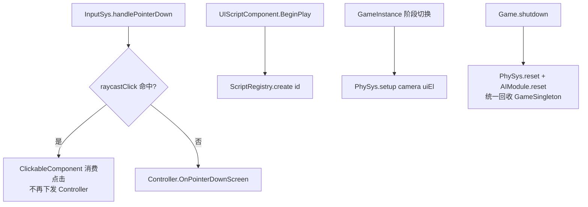

# 输入 / 物理 / 脚本系统（Engine Input·Physics·Script）

> 输入路由、射线拾取物理、行为脚本注册三大支撑系统。
> 代码位置：`src/engine/input/` `src/engine/physics/` `src/engine/script/`
> 相关文档：[系统总览](../system_overview.md) / [渲染系统](./rendering_system.md)

## 1. 输入系统（input/）

### 核心类

| 类 | 说明 |
|---|---|
| `InputSys` | 输入系统（由 GameInstance 管理，继承 BObject）：Viewport 将全部输入转发至此，负责调用 PhySys 射线检测 + 转发到当前阶段 Controller |
| `InputComponent` | 输入组件：`ProcessMouseButton` 等广播；`InputEventType` 事件类型 |
| `PlayerController` | 玩家控制器：驱动 Pawn 的输入逻辑（`OnPointerDownScreen` 等） |

### 使用方法

| 方法 | 签名 | 说明 |
|---|---|---|
| 指针按下 | `InputSys.handlePointerDown(sx, sy, worldPos?, controller?, button=0): boolean` | 左键参与点击检测；返回是否被消费 |
| 指针移动/抬起 | `handlePointerMove(sx, sy, worldPos?, controller?)` / `handlePointerUp(worldPos?, controller?, button=0)` | 转发 |
| 键盘 | `handleKeyDown(key, controller?)` / `handleKeyUp(key, controller?)` | 转发到 Controller |
| 滚轮 | `handleScroll(delta, controller?)` | 无 controller 直接 return |
| 按键绑定 | `InputComponent.BindAction(action, key, eventType, callback)` | 项目侧绑定输入 |
| 滚动/鼠标绑定 | `BindScroll(cb)` / `BindMouseButton(cb)` / `BindPointerMove(cb)` | 返回**取消订阅函数** |

```ts
// 项目控制器绑定示例（projects/fish/gameplay/game/FishPlayerController.ts）
this.inputComponent.BindAction('Cannon1', '1', 'pressed', () => c.SetLevel(1))
```

### 输入路由设计

```
GameViewport（DOM 事件）→ GameInstance.inputSys → PhySys.raycastClick / Controller
```

- 所有输入方法统一经由 `GameInstance.inputSys` 路由，GameViewport 不再直接调用 PlayerController
- 鼠标语义：
  - 左键（button=0）参与 `ClickableComponent` 点击检测
  - 右键不触发点击检测，但广播 `ProcessMouseButton` 给订阅者（如摄像机右键平移）
  - 被 ClickableComponent 消费的点击不再下发 Controller（跨帧 clickConsumed 标记防误触）

## 2. 物理系统（physics/）

### 核心类

| 类 | 说明 |
|---|---|
| `PhySys` | 物理系统全局单例（GameSingleton）：全局复用 `THREE.Raycaster`（避免每帧 new）、管理 `ClickableComponent` 注册表、提供 `screenToRay` / `raycastClick` / `raycastHover` |
| `ClickableComponent` | 可点击组件：BeginPlay/EndPlay 自动 register/unregister；`layer` 属性分流（`'ui'` = UI 层 / 其他 = 世界层） |

### 使用方法

| 方法 | 签名 | 说明 |
|---|---|---|
| 配置 | `PhySys.setup(camera, uiEl)` | 由 GameInstance 阶段切换时调用更新相机 |
| UI 相机 | `PhySys.setupUI(camera \| null)` | Game launch 注入 UI 相机，shutdown 置 null |
| 射线 | `screenToRay(sx, sy, camera?): Raycaster \| null` | 未 setup/宽高 0 返回 null |
| 点击 | `raycastClick(sx, sy): boolean` | UI 层优先命中即消费，再世界层 |
| 悬停/释放 | `raycastHover(sx, sy)` / `raycastRelease()` | 拖出按钮外松手也能恢复，幂等 |

### 设计要点

- **按层分流**：世界层用主相机射线检测；UI 层用 UI 相机平行射线检测（屏幕空间）
- **按下分发**：记录 `_pressedClickable`，mouseup 时向其分发释放；注销的组件不再接收释放（防残留引用）
- **生命周期**：`PhySys.setup(camera, uiEl)` 由 GameInstance 阶段切换时调用更新相机；Game.shutdown 时 `reset()` 回收
- **ClickableComponent 边界**：`hitTest` 手动过滤不可见目标（THREE.Raycaster 不检查 visible）；`clickCooldown` 默认 500ms 防连点；已销毁直接拒绝；命中先 `onPress` 再 `onClick`

## 3. 脚本系统（script/）

### 核心类

| 类 | 说明 |
|---|---|
| `BehaviourScript` | 行为脚本基类（游戏逻辑脚本，无参构造） |
| `ScriptRegistry` | 脚本注册中心：「脚本 id → 构造器」映射，供 `UIScriptComponent` 在 BeginPlay 时按资产 `script` id 实例化 |

### 使用方法

| 方法 | 签名 | 说明 |
|---|---|---|
| 创建 | `ScriptRegistry.create(id): BehaviourScript \| null` | 未注册返回 null |
| 注册 | `register(id, ctor)` / `registerAll(scriptModules)` | 批量注册 |
| 查询 | `has(id)` / `getRegisteredIds()` | — |

```ts
const script = ScriptRegistry.create('gameplay/base/BaseHud')  // 未注册返回 null
```

### 注册方式（数据驱动）

- 项目 `asset/index.ts` 用 `import.meta.glob({ eager: true })` 扫描所有 `*.script.ts`
- 传入 `AssetRegistry.registerAll({ scriptModules })` 自动注册
- id 由文件路径自动推导：`'../gameplay/base/BaseHud.script.ts'` → `'gameplay/base/BaseHud'`（去 `../` 前缀与 `.script.ts` 后缀）
- `registerAll` 缺默认导出的模块 `logger.warn` 跳过

## 4. 跨系统协作



## 5. 边界条件

| 条件 | 行为/后果 | 处理方式 |
|---|---|---|
| `PhySys` 未 setup 或视口宽高 0 | `screenToRay` 返回 null | 调用前判空 |
| 左键点击被 UI/建筑消费 | 返回 true，Controller 收不到 | 引擎内置语义（防同击双触发） |
| `handleScroll` 无 controller | 直接 return | 引擎内置 |
| `InputComponent.bEnabled=false` | `ProcessInput` 返回 false + `logger.info` | 引擎内置 |
| 无匹配按键绑定 | `logger.info`（NO MATCH 列出全部绑定） | 检查 BindAction 绑定 |
| `ScriptRegistry.create` 未注册 id | 返回 null（不抛异常） | 调用方判空；检查 glob 扫描 |
| 组件 EndPlay | 自动注销 PhySys + 清空输入绑定 | 引擎内置 |
| 隐藏对象点击 | `hitTest` 手动过滤 visible=false，不响应射线 | 引擎内置 |

## 6. 依赖关系

```
InputSys.handlePointerDown
  ├─ PhySys.raycastClick（ClickableComponent 命中 → 消费点击）
  └─ Controller.OnPointerDownScreen（未被消费时下发）

UIScriptComponent.BeginPlay → ScriptRegistry.create(id) → 脚本实例
PhySys.setup(camera, uiEl) ← GameInstance 阶段切换
PhySys.reset() / AIModule.reset() ← Game.shutdown 统一回收 GameSingleton
```
