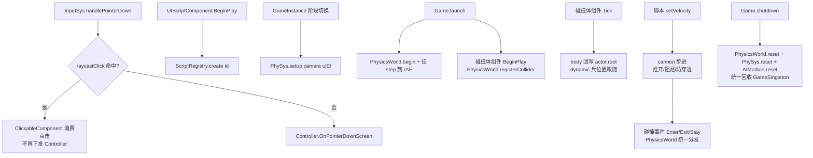

# 输入 / 物理 / 脚本系统（Engine Input·Physics·Script）

> 输入路由、射线拾取物理、刚体碰撞物理、行为脚本注册四大支撑系统。
> 代码位置：`src/engine/input/` `src/engine/physics/` `src/engine/script/`
> 相关文档：[系统总览](../system_overview.md) / [渲染系统](./rendering_system.md) / [寻路系统](./navigation_system.md)

## 1. 输入系统（input/）

### 核心类

| 类 | 说明 |
|---|---|
| `InputSys` | 输入系统（由 GameInstance 管理，继承 BObject）：Viewport 将全部输入转发至此，负责调用 PhySys 射线检测 + 转发到当前阶段 Controller |
| `InputComponent` | 输入组件：`ProcessMouseButton` 等广播；`InputEventType` 事件类型 |
| `PlayerController` | 玩家控制器：驱动 Pawn 的输入逻辑（`OnPointerDownScreen` 等） |

### 使用方法

| 方法 | 签名 | 说明 |
|---|---|---|
| 指针按下 | `InputSys.handlePointerDown(sx, sy, worldPos?, controller?, button=0): boolean` | 左键参与点击检测；返回是否被消费 |
| 指针移动/抬起 | `handlePointerMove(sx, sy, worldPos?, controller?)` / `handlePointerUp(worldPos?, controller?, button=0)` | 转发 |
| 键盘 | `handleKeyDown(key, controller?)` / `handleKeyUp(key, controller?)` | 转发到 Controller |
| 滚轮 | `handleScroll(delta, controller?)` | 无 controller 直接 return |
| 按键绑定 | `InputComponent.BindAction(action, key, eventType, callback)` | 项目侧绑定输入 |
| 滚动/鼠标绑定 | `BindScroll(cb)` / `BindMouseButton(cb)` / `BindPointerMove(cb)` | 返回**取消订阅函数** |

```ts
// 项目控制器绑定示例（projects/fish/gameplay/game/FishPlayerController.ts）
this.inputComponent.BindAction('Cannon1', '1', 'pressed', () => c.SetLevel(1))
```

### 输入路由设计

```
GameViewport（DOM 事件）→ GameInstance.inputSys → PhySys.raycastClick / Controller
```

- 所有输入方法统一经由 `GameInstance.inputSys` 路由，GameViewport 不再直接调用 PlayerController
- 鼠标语义：
  - 左键（button=0）参与 `ClickableComponent` 点击检测
  - 右键不触发点击检测，但广播 `ProcessMouseButton` 给订阅者（如摄像机右键平移）
  - 被 ClickableComponent 消费的点击不再下发 Controller（跨帧 clickConsumed 标记防误触）

## 2. 物理系统（physics/）

### 核心类

| 类 | 说明 |
|---|---|
| `PhySys` | 射线拾取全局单例（GameSingleton）：全局复用 `THREE.Raycaster`（避免每帧 new）、管理 `ClickableComponent` 注册表、提供 `screenToRay` / `raycastClick` / `raycastHover` |
| `ClickableComponent` | 可点击组件：BeginPlay/EndPlay 自动 register/unregister；`layer` 属性分流（`'ui'` = UI 层 / 其他 = 世界层） |
| `PhysicsWorld` | 刚体碰撞物理世界（GameSingleton，cannon-es）：固定步长 1/60 + accumulator、碰撞事件（Enter/Exit/Stay）、查询 API（overlapTest / queryAll） |
| `ColliderComponent` | 碰撞体组件基类（抽象）：BeginPlay 创建 cannon body 注册进 PhysicsWorld、EndPlay 销毁注销；dynamic 模式下 body 为碰撞权威每帧回写 actor.root；`setVelocity` 速度注入；`syncStaticPosition` 移动后同步 |
| `BoxColliderComponent` / `CircleColliderComponent` / `CapsuleColliderComponent` | 三个具体碰撞体组件（注册进 ComponentRegistry，蓝图 baseClass 引用；属性经 `properties` 配置） |
| `colliderGizmos` | 碰撞盒线框可视化开关（默认显示，快捷键 V 切换；Game 视口 gizmos 与预览视口 ColliderDebugDrawer 共用） |

### PhysicsWorld 使用方法

| 方法 | 签名 | 说明 |
|---|---|---|
| 步进 | `PhysicsWorld.step(dt)` | 固定步长 + accumulator 累计模拟（Game.launch 挂到 Scene 视口 rAF，tick 之后调用）；暂停/禁用返回 false |
| 查询 | `overlapTest(pos, halfX, halfZ, opts?)` | 盒重叠测试（opts: exclude 排除 / group 按碰撞层过滤） |
| 查询 | `queryAll(pos, radius, opts?)` | 圆形范围查询全部命中（返回 `{ collider, body }[]`） |
| 暂停 | `setPaused(paused)` | Game 暂停时物理同步暂停 |
| 生命周期 | `begin()` / `reset()` | Game.launch 激活运行态 / Game.shutdown 统一回收 |

### 碰撞体组件（Blueprint 配置）

```json
{
  "baseClass": "BoxColliderComponent",
  "properties": {
    "size": [1.6, 1.6, 1.6],
    "bodyType": "static",
    "group": "building",
    "mask": ["troop", "building"]
  }
}
```

| 属性 | 说明 |
|---|---|
| `size` / `radius` / `length` / `height` | 形状尺寸（Box 盒 / Circle 圆柱 / Capsule 胶囊） |
| `bodyType` | `static`（建筑，不可推动）/ `dynamic`（兵，会被推挤） |
| `mass` | 质量（dynamic 生效；兵小质量 + 高线性阻尼） |
| `group` / `mask` | 碰撞分层：层名 `default` / `troop` / `building`（2 的幂位）；mask 数组指定与哪些层碰撞，空数组 = 全部 |
| `offset` | 碰撞体中心相对顶层 Actor 的偏移 |
| `linearDamping` | 线性阻尼（dynamic 速度衰减） |
| `lockY` | 锁定 y（俯视角默认 true，禁弹跳） |

### 碰撞事件（Unity 式）

```ts
// 脚本组件在 BeginPlay 订阅（EndPlay 解除，防残留）
collider.onCollisionEnter = (e) => { /* e.other: ColliderComponent（对方） */ }
collider.onCollisionExit  = (e) => { /* 离开接触 */ }
collider.onCollisionStay  = (e) => { /* 持续接触（每物理步进一次） */ }
```

- 事件由 PhysicsWorld 步进后统一分发：对比上一帧接触对集合，新增 → Enter、消失 → Exit、持续 → Stay
- 碰撞分层过滤：mask 不含对方 group 的接触不产生事件（cannon 层过滤）

### 物理驱动模式（关键设计）

- **dynamic 兵**：`setVelocity(vx, vz)` 每帧注入移动速度（速度 = 路径方向 × speed），cannon 求解器天然处理推开/阻尼/防穿透；body 为**碰撞权威**，`ColliderComponent.Tick` 把 body.position 回写顶层 Actor（沿 parent 链上溯，碰撞体挂在模型子 Actor 也能驱动实体根）；锁 y + 锁旋转（fixedRotation）
- **static 建筑**：生成时同步一次位置；基地拖动移动后调 `syncStaticPosition()` 更新 body
- **Game 级单例**：生命周期绑定 Game（launch 激活 / shutdown 回收），编辑器预览 World 不注册 body（`PhysicsWorld.active` 判定）

### 设计要点

- **按层分流**：世界层用主相机射线检测；UI 层用 UI 相机平行射线检测（屏幕空间）
- **按下分发**：记录 `_pressedClickable`，mouseup 时向其分发释放；注销的组件不再接收释放（防残留引用）
- **生命周期**：`PhySys.setup(camera, uiEl)` 由 GameInstance 阶段切换时调用更新相机；Game.shutdown 时 `reset()` 回收
- **ClickableComponent 边界**：`hitTest` 手动过滤不可见目标（THREE.Raycaster 不检查 visible）；`clickCooldown` 默认 500ms 防连点；已销毁直接拒绝；命中先 `onPress` 再 `onClick`
- **物理降级**：cannon 初始化失败 → `logger.error` + 禁用物理（游戏可继续，仅无碰撞/查询返回空）；碰撞体 BeginPlay 检测 `PhysicsWorld.enabled && PhysicsWorld.active`，预览模式不注册
- **固定步长**：`step(dt)` 用 accumulator（累计 dt 消耗 1/60 步进），单帧最多补 3 步（防页面 hidden 恢复后大 dt 连击）

## 3. 脚本系统（script/）

### 核心类

| 类 | 说明 |
|---|---|
| `BehaviourScript` | 行为脚本基类（游戏逻辑脚本，无参构造） |
| `ScriptRegistry` | 脚本注册中心：「脚本 id → 构造器」映射，供 `UIScriptComponent` 在 BeginPlay 时按资产 `script` id 实例化 |

### 使用方法

| 方法 | 签名 | 说明 |
|---|---|---|
| 创建 | `ScriptRegistry.create(id): BehaviourScript \| null` | 未注册返回 null |
| 注册 | `register(id, ctor)` / `registerAll(scriptModules)` | 批量注册 |
| 查询 | `has(id)` / `getRegisteredIds()` | — |

```ts
const script = ScriptRegistry.create('gameplay/base/BaseHud')  // 未注册返回 null
```

### 注册方式（数据驱动）

- 项目 `asset/index.ts` 用 `import.meta.glob({ eager: true })` 扫描所有 `*.script.ts`
- 传入 `AssetRegistry.registerAll({ scriptModules })` 自动注册
- id 由文件路径自动推导：`'../gameplay/base/BaseHud.script.ts'` → `'gameplay/base/BaseHud'`（去 `../` 前缀与 `.script.ts` 后缀）
- `registerAll` 缺默认导出的模块 `logger.warn` 跳过

## 4. 跨系统协作



## 5. 边界条件

| 条件 | 行为/后果 | 处理方式 |
|---|---|---|
| `PhySys` 未 setup 或视口宽高 0 | `screenToRay` 返回 null | 调用前判空 |
| 左键点击被 UI/建筑消费 | 返回 true，Controller 收不到 | 引擎内置语义（防同击双触发） |
| `handleScroll` 无 controller | 直接 return | 引擎内置 |
| `InputComponent.bEnabled=false` | `ProcessInput` 返回 false + `logger.info` | 引擎内置 |
| 无匹配按键绑定 | `logger.info`（NO MATCH 列出全部绑定） | 检查 BindAction 绑定 |
| `ScriptRegistry.create` 未注册 id | 返回 null（不抛异常） | 调用方判空；检查 glob 扫描 |
| 组件 EndPlay | 自动注销 PhySys + 清空输入绑定 | 引擎内置 |
| 隐藏对象点击 | `hitTest` 手动过滤 visible=false，不响应射线 | 引擎内置 |
| cannon 世界初始化失败 | `logger.error` + 物理禁用（游戏可继续，仅无碰撞） | 引擎内置降级 |
| 编辑器预览 World 的碰撞体 | 不注册 body（`PhysicsWorld.active=false`） | 引擎内置（防污染游戏运行时） |
| 物理暂停（Game 暂停） | `step` 返回 false，body 静止 | `setPaused` 控制 |
| 旧蓝图无碰撞组件 | 不报错不崩溃，仅 assetLint 警告 | 兼容行为 |
| 查询 API 在物理禁用时 | 返回空/ false（静默降级） | 调用方无需判物理可用性 |

## 6. 依赖关系

```
InputSys.handlePointerDown
  ├─ PhySys.raycastClick（ClickableComponent 命中 → 消费点击）
  └─ Controller.OnPointerDownScreen（未被消费时下发）

UIScriptComponent.BeginPlay → ScriptRegistry.create(id) → 脚本实例
PhySys.setup(camera, uiEl) ← GameInstance 阶段切换
PhysicsWorld.begin() / step(dt) / reset() ← Game.launch / rAF / Game.shutdown
ColliderComponent.BeginPlay/EndPlay → PhysicsWorld.registerCollider/unregisterCollider
PhysicsWorld.dispatchCollisionEvents → ColliderComponent.onCollisionEnter/Exit/Stay
ColliderComponent.Tick → body 回写顶层 Actor.root（dynamic）
NavigationModule.rebuild ← PhysicsWorld.queryAll（静态碰撞体 AABB 栅格化，见 navigation_system.md）
PhySys.reset() / PhysicsWorld.reset() / AIModule.reset() ← Game.shutdown 统一回收 GameSingleton
```
