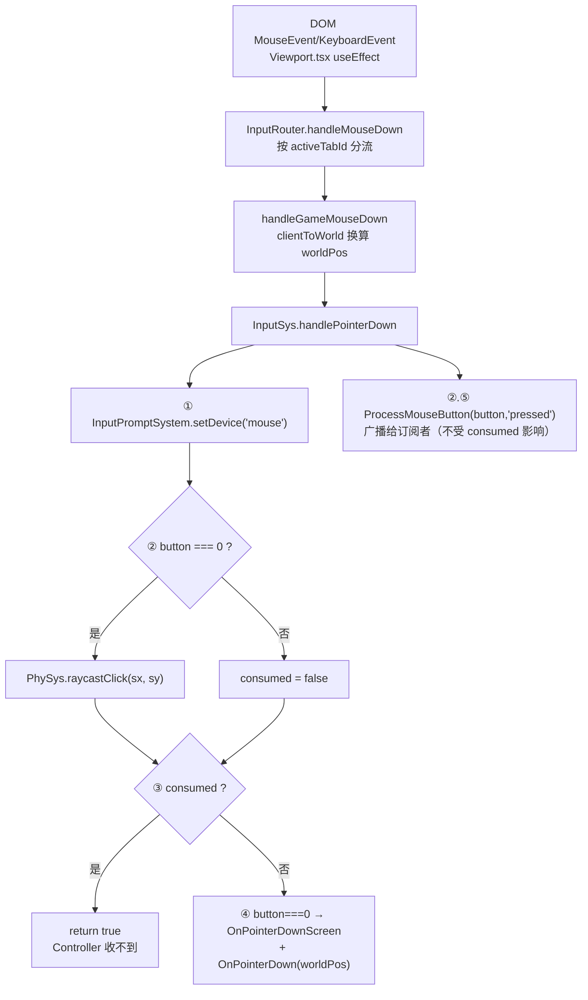

# 输入系统（Input）

> **一句话定位**：输入系统是「DOM 事件 → 游戏语义」的**唯一翻译层**——视口把原生事件全部转发给它，它先做设备态记录、再让 PhySys 抢一次点击，没被 UI/建筑吃掉才下发给当前阶段的 PlayerController。
>
> **什么时候会用到你**：排查「点击没反应 / 点一下触发两件事 / 拖拽时卡 / 按键不生效」、新增一种输入（手柄、触控、组合键）、给项目 Controller 加鼠标或滚轮行为、理解为什么右键不会误触 UI。
>
> 代码位置：`src/engine/input/`

---

## 1. 先记住这几个文件

| 文件 | 一句话职责 | 你要改它的场景 |
|---|---|---|
| [InputSys.ts](../../src/engine/input/InputSys.ts) | 路由中枢：收 `handle*` 调用，决定这一击归 PhySys 还是 Controller | 加新输入类型（触控/手柄）、改按键优先级、改左右键语义 |
| [InputComponent.ts](../../src/engine/input/InputComponent.ts) | 订阅总线：挂在 Controller 上，存 Action 绑定与滚轮/鼠标/指针三类监听器 | 项目侧绑定按键、加一种可订阅的输入事件 |
| [PlayerController.ts](../../src/engine/input/PlayerController.ts) | 输入终点：持有 `inputComponent`，暴露 `OnPointerDownScreen` 等空实现供子类 override | 加一个新的鼠标虚方法、改 Possess 时的绑定清理 |
| [GameViewport.ts](../../src/editor/GameViewport.ts) | 视口侧转发：把 MouseEvent/KeyboardEvent 翻译成 InputSys 的方法参数 | 改变坐标换算方式、改哪些 DOM 事件进游戏 |

**关键心智模型**：`InputSys` **不监听任何 DOM 事件**。它是一组纯粹的 `handle*` 方法，由视口的 `useEffect` 挂上原生监听器后调进来。所以「输入没反应」的第一现场永远在绑定层，不在 `InputSys` 内部。

---

## 2. 一次点击怎么走进游戏：从 DOM 事件到 Controller

### 2.1 谁绑定了它

绑定发生在 React 视口 [Viewport.tsx](../../src/components/Viewport.tsx)，鼠标和键盘是**两个独立的 `useEffect`**，各自带自己的 cleanup：

```ts
// ─── 鼠标输入路由（仅 Game 标签 + 游戏运行时）───
useEffect(() => {
  if (activeTabId !== 'game' || !editorState.running) return
  const canvas = gameSceneRef.current?.renderer.domElement
  if (!canvas) return

  const ctx = { sceneMgr: sceneRef.current, gameMgr: gameSceneRef.current, game: gameRef.current, activeTabId }

  const onMove = (e: MouseEvent) => handleMouseMove(e, ctx, _ptrWorld)
  const onDown = (e: MouseEvent) => handleMouseDown(e, ctx, _ptrWorld)
  const onUp = (e: MouseEvent) => handleMouseUp(e, ctx, _ptrWorld)
  const onWheel = (e: WheelEvent) => handleWheel(e, ctx)
  // 阻止右键菜单，保证右键拖拽平移（摄像机）时不会弹出浏览器菜单
  const onContextMenu = (e: MouseEvent) => e.preventDefault()

  canvas.addEventListener('mousedown', onDown)
  window.addEventListener('mousemove', onMove)
  window.addEventListener('mouseup', onUp)
  canvas.addEventListener('wheel', onWheel, { passive: false })
  canvas.addEventListener('contextmenu', onContextMenu)

  return () => {
    canvas.removeEventListener('mousedown', onDown)
    window.removeEventListener('mousemove', onMove)
    window.removeEventListener('mouseup', onUp)
    canvas.removeEventListener('wheel', onWheel)
    canvas.removeEventListener('contextmenu', onContextMenu)
  }
}, [activeTabId, editorState.running])
```

> **为什么 `mousedown` 挂 canvas、而 `mousemove`/`mouseup` 挂 window**：按下必须落在画布上才算点游戏；但按下之后的移动和松开常发生在画布外（拖出窗口、拖到面板上松手）。挂 window 才能保证**拖拽一定有始有终**——`mouseup` 收不到，`PhySys._pressedClickable` 就永远清不掉，按钮会卡在按下态、`isDragging` 恒为 true，之后所有 hover 射线都被跳过。
>
> 这就是 **cleanup 契约**：每个 `addEventListener` 必须有配对的 `removeEventListener`，依赖数组里的 `activeTabId` / `editorState.running` 一变，React 先执行 cleanup 再重建。少了任何一行解绑，切页签或停止游戏后旧监听器仍指向已销毁的 `GameInstance`，`game?.instance` 拿到 null 时静默 `return`——表现为「停止后按键偶尔还能驱动上一局的角色」。

键盘是另一段，门控条件不同——它要求**视口获得焦点**：

```ts
useEffect(() => {
  if (!viewportFocused) return

  const ctx = { sceneMgr: sceneRef.current, gameMgr: gameSceneRef.current, game: gameRef.current, activeTabId }
  const onDown = (e: KeyboardEvent) => handleKeyDown(e, ctx)
  const onUp = (e: KeyboardEvent) => handleKeyUp(e, ctx)

  window.addEventListener('keydown', onDown, true)
  window.addEventListener('keyup', onUp, true)
  return () => {
    window.removeEventListener('keydown', onDown, true)
    window.removeEventListener('keyup', onUp, true)
  }
}, [activeTabId, viewportFocused])
```

> 键盘用**捕获阶段**（第三个参数 `true`）并挂在 window 上：编辑器有输入框、AI 面板等大量可聚焦元素，捕获阶段能保证视口聚焦时先于这些元素拿到按键。失焦时另有一段 effect 调 `sceneRef.current?.clearWASDKeys()`，防止切走时按键卡在按下态。

事件进来后由 [InputRouter.ts](../../src/editor/InputRouter.ts) 按页签分流，`'game'` 才进游戏管线：

```ts
export function handleMouseDown(
  e: MouseEvent,
  ctx: InputRouterContext,
  _ptrWorld: THREE.Vector3,
): void {
  handleGameMouseDown(e, ctx.game, ctx.gameMgr, _ptrWorld)
}
```

最终由 [GameViewport.ts](../../src/editor/GameViewport.ts) 做坐标换算并调用 InputSys：

```ts
export function handleGameMouseDown(
  e: MouseEvent,
  game: Game | null,
  gameMgr: SceneRendererComponent | null,
  _ptrWorld: THREE.Vector3,
): void {
  logger.debug(`[GameViewport] mousedown button=${e.button} at (${e.clientX}, ${e.clientY})`)
  const inst = game?.instance
  if (!inst) return
  const controller = inst.controller
  const worldPos = clientToWorld(e.clientX, e.clientY, gameMgr, _ptrWorld)
  inst.inputSys.handlePointerDown(e.clientX, e.clientY, worldPos, controller, e.button)
}
```

> `controller` 在这里现取而不是缓存：`inst.controller` 随游戏阶段切换会换对象（menu → base → game 各有自己的 Controller）。`worldPos` 是复用的同一个 `_ptrWorld` 向量（`clientToWorld` 内部 `?? _ptrWorld` 兜底），所以下游 Controller **不能长期持有这个引用**——下一帧就被覆盖了，要留存必须 `.clone()`。

### 2.2 事件归一化



逐段讲代码（[InputSys.ts](../../src/engine/input/InputSys.ts) `handlePointerDown`）：

**① 先切设备态，再干别的**

```ts
// 输入设备检测：鼠标按下 → 设备切换为 mouse（触发提示文本刷新）
InputPromptSystem.instance.setDevice('mouse')
```

> **为什么放在方法第一行**：这次点击之后经常紧接着 `return`（被 UI 消费、或者 controller 为 null）。设备态是给 UI 提示文本用的（"按 E 交互" / "点击交互"），只要玩家动过鼠标就该切。放在后面会漏掉被 UI 消费的那一击——玩家点了半天按钮，提示还显示键盘版。`setDevice` 内部有 `if (device === this._device) return`，同设备重复调用不触发 `onDeviceChanged`，所以高频调用没有副作用。

**② 只有左键参与点击检测**

```ts
// 仅左键参与点击检测（右键用于摄像机平移等，不应误触 UI/建筑点击）
const consumed = button === 0 ? PhySys.raycastClick(screenX, screenY) : false
// 广播鼠标按钮事件（外部组件可 BindMouseButton 订阅，如摄像机右键平移）
controller?.inputComponent.ProcessMouseButton(button, 'pressed')
```

> 右键语义完全不同：它**不参与** `raycastClick`，但**照样广播** `ProcessMouseButton`。这样摄像机云台能收到右键做平移，而右键永远不会误触到一个 UI 按钮或建筑。注意广播在 `consumed` 判断之前——**订阅者不受 UI 消费影响**，这是有意的：按下的物理事实对所有订阅者都成立。

**③ 被消费就到此为止**

```ts
// 已被 ClickableComponent 消费（UI 按钮/建筑点击）→ 不再下发 controller，
// 避免同一击既触发按钮又触发放置/移动等地面逻辑（跨帧 clickConsumed 标记会吞掉下一次点击）
// Bug 定位用：点击未生效时，controller 为 null 表示本阶段 Controller 缺失
//（查对应 GameMode 的 StartPlay() 是否漏调 super.StartPlay()）
if (consumed) return true
```

> 这是整套输入最关键的**互斥规则**：一击只能有一个归属。命中 UI 按钮就绝不能同时触发地面放兵，否则玩家点「建造」按钮会顺带在按钮背后的地图上放一个兵。返回值 `boolean` 就是给调用方（AI 事件、模拟点击）判断这一击是否被 UI 吃掉。

**④ 剩下的才给 Controller**

```ts
// 左键才走控制器点击逻辑（右键语义交给订阅者）
if (button === 0) {
  controller?.OnPointerDownScreen(screenX, screenY)
  if (worldPos) controller?.OnPointerDown(worldPos)
}
return consumed
```

> 屏幕坐标先发、世界坐标后发，两个都是可选的虚方法。`worldPos` 判空是因为 AI 模拟点击（`ai.mouseDrag`）只传屏幕坐标。全部用 `controller?.` 可选链：**阶段切换瞬间 controller 就是 null**，此时输入静默丢弃，不抛异常。

### 2.3 分派到下游

移动的归一化在 `handlePointerMove`，这里藏着拖拽与悬停的取舍：

```ts
// 拖拽中（鼠标按住未松）跳过 hover 射线检测：悬停提示/高亮在拖拽期间无意义，
// 且每个 UI clickable 的 hitTest 都会强制刷新父链矩阵（updateWorldMatrix），
// 拖拽滚动时每帧跑全套射线是卡顿的主要来源之一
if (!PhySys.isDragging) PhySys.raycastHover(screenX, screenY)
// 拖拽移动分发：按住（如滚动列表 item）期间持续收到屏幕坐标，实现拖拽滚动
PhySys.dispatchDragMove(screenX, screenY)
controller?.OnPointerMoveScreen(screenX, screenY)
// 广播指针移动事件（外部组件可 BindPointerMove 订阅，如摄像机右键拖拽平移）
controller?.inputComponent.ProcessPointerMove(screenX, screenY)
if (worldPos) controller?.OnPointerMove(worldPos)
```

> `isDragging` 就是 `PhySys._pressedClickable !== null`（[PhySys.ts:227](../../src/engine/physics/PhySys.ts)）——**按下命中过任意 Clickable 就算拖拽中**，哪怕鼠标一像素没动。所以「按住按钮不动」期间 hover 也是停的，这是有意的：按下的那个元素已经拿到按下态，不需要 hover 来刷新外观，省下的是每个 clickable 一次 `updateWorldMatrix(true, false)` 全父链矩阵刷新，滚动列表拖拽时这笔开销按帧算。

拖拽与点击的区分不在 InputSys，而在 [ClickableComponent.ts](../../src/engine/physics/ClickableComponent.ts)：

```ts
private static readonly DRAG_THRESHOLD_PX = 8
```

```ts
handleDragMove(screenX: number, screenY: number): void {
  if (!this._pressed) return
  if (!this._pressScreen) {
    this._pressScreen = [screenX, screenY]
    this.onDragStart?.(screenX, screenY)
  } else {
    const dx = screenX - this._pressScreen[0]
    const dy = screenY - this._pressScreen[1]
    if (dx * dx + dy * dy > ClickableComponent.DRAG_THRESHOLD_PX * ClickableComponent.DRAG_THRESHOLD_PX) {
      this._pendingClick = null
    }
  }
  this.onDragMove?.(screenX, screenY)
}
```

> **为什么是 8px**：人的手在鼠标上无法绝对静止，按下到松开之间常有 1~3px 抖动。阈值设成 0 会让大量正常点击被判成拖拽、按钮永不触发；8px 是「明显是拖，不是抖」的经验分界。注意比较的是**平方距离**（`dx*dx + dy*dy > 8*8`），省一次 `Math.sqrt`。
>
> 另一点反直觉：**首次移动不判定、只记录基准点**（`_pressScreen` 从 null 变成坐标）。所以第一次移动永远安全，判定从第二次开始。基准点是「按下后第一次移动到的位置」而不是按下点——这样按下时的微小抖动不会被累积进位移。
>
> 这个 8px 阈值**只对绑定了 `onDragMove` 的组件生效**（`handleClick` 里 `if (this.onDragMove)` 才延迟点击）。普通按钮移动鼠标不会取消点击，仍走「按下即 `onClick`」的老语义。

释放走 `handlePointerUp`：

```ts
// 广播鼠标按钮事件（如摄像机右键平移结束）
controller?.inputComponent.ProcessMouseButton(button, 'released')
// 左键才走点击释放逻辑：分发按中对象的释放（长按保持按下，松手才恢复）
if (button === 0) {
  PhySys.raycastRelease()
  if (worldPos) controller?.OnPointerUp(worldPos)
}
```

> `raycastRelease` **不做射线**（[PhySys.ts:212](../../src/engine/physics/PhySys.ts)）——它直接对 `_pressedClickable` 分发 `handleRelease`。这是刻意的：鼠标拖到按钮外面再松手，按钮也必须恢复，做射线的话这次释放就丢了。`ClickableComponent.handleRelease` 里 `dragged` 判定用的是「`_pressScreen` 是否非空」，即**有没有真的移动过**，和 8px 阈值是两套独立判据。

---

## 3. 设备态与暂停

设备态由 [InputPromptSystem.ts](../../src/engine/ui/InputPromptSystem.ts) 持有，是**运行时全局单例**（不是 GameSingleton，不随游戏停止回收）：

```ts
setDevice(device: InputDevice): void {
  if (device === this._device) return
  logger.info(`[InputPromptSystem] 输入设备切换: ${this._device} → ${device}`)
  this._device = device
  this.onDeviceChanged?.(device)
}
```

> 只有两个入口写它：`handleKeyDown` → `'keyboard'`，`handlePointerDown` → `'mouse'`。`'touch'` 类型已定义但**当前无写入方**（无触控事件接入）。UI 侧通过 `prompt(kbLabel, mouseLabel)` 拿对应文案，或订阅 `onDeviceChanged` 主动刷新。

键盘和滚轮比鼠标多一层 **GM 控制台拦截**：

```ts
handleKeyDown(key: string, controller?: PlayerController | null): void {
  // 输入设备检测：键盘事件 → 设备切换为 keyboard（触发提示文本刷新）
  InputPromptSystem.instance.setDevice('keyboard')
  // GM 模块全局键盘钩子（控制台打开 → 消费输入；G+M → 开关面板）
  if (GMModule.handleGlobalKeyDown(key)) return
  controller?.ProcessInput(key, 'pressed')
}
```

```ts
handleScroll(delta: number, controller?: PlayerController | null): void {
  // GM 模块全局滚轮钩子（控制台打开 → 命令列表滚动，消费不穿透游戏）
  if (GMModule.handleGlobalScroll(delta)) return
  if (!controller) return
  // 输入系统触发到 Controller 的输入组件（外部组件可 BindScroll 订阅）
  controller.inputComponent.ProcessScroll(delta)
  // 兼容：仍调用 OnScroll 虚方法（子类旧实现）
  controller.OnScroll(delta)
}
```

> 控制台打开时 `handleGlobalKeyDown` 返回 true，**游戏完全收不到按键**（除 `Escape` 用于关闭）。`handleScroll` 是唯一一个 `controller` 为空就 `return` 的输入方法——滚轮没有「广播给所有订阅者」的语义，必须挂在某个 Controller 的 `inputComponent` 上。注意它同时调了 `ProcessScroll`（新订阅制）和 `OnScroll`（旧虚方法），是迁移期的双通道兼容。

暂停分三个层次，都不是 InputSys 内部的开关：

| 层次 | 实现位置 | 效果 |
|---|---|---|
| 游戏未运行 | `Viewport.tsx:427` 的 `if (activeTabId !== 'game' || !editorState.running) return` | 鼠标监听器根本不挂 |
| 视口失焦 | `Viewport.tsx:411` 的 `if (!viewportFocused) return` | 键盘监听器不挂，且 `clearWASDKeys()` 清按键态 |
| 游戏停止 | `Game.shutdown` → `instance.teardown()` → `inputSys.EndPlay()` | InputSys 终态化，注册注销 |

> 所以**没有「输入暂停」标志位**。停止游戏时是整条链路被拆掉：DOM 监听器由 React cleanup 移除、InputSys 由 `GameInstance.teardown()` 终态化、PhySys 由 `Game.shutdown` 里的 `PhySys.setupUI(null)` 断开 UI 相机。遗留的 `_pressedClickable` 在 `PhySys.clear()` 里清空——不清的话它的闭包链指向已销毁的旧 World，会被再次命中并驱动旧世界。

---

## 4. 关键方法速查

| 方法 | 位置 | 干什么 | 注意 |
|---|---|---|---|
| `handlePointerDown` | [InputSys.ts:36](../../src/engine/input/InputSys.ts) | 按下：切设备态 → 左键 `raycastClick` → 广播 → 未消费才下发 Controller | 返回值 = 是否被 Clickable 消费；右键从不参与点击检测 |
| `handlePointerMove` | [InputSys.ts:63](../../src/engine/input/InputSys.ts) | 移动：非拖拽时 `raycastHover` → `dispatchDragMove` → 两个 Controller 回调 | `worldPos` 是复用向量，不可留存 |
| `handlePointerUp` | [InputSys.ts:85](../../src/engine/input/InputSys.ts) | 释放：广播 released → 左键 `raycastRelease` + `OnPointerUp` | 不做射线，拖出元素外松手也能恢复 |
| `handleKeyDown` | [InputSys.ts:107](../../src/engine/input/InputSys.ts) | 键盘按下：切设备态 → GM 钩子优先 → `ProcessInput` | GM 返回 true 时游戏完全收不到 |
| `handleKeyUp` | [InputSys.ts:116](../../src/engine/input/InputSys.ts) | 键盘释放：清 GM 组合键状态 → `ProcessInput` | 不切设备态 |
| `handleScroll` | [InputSys.ts:127](../../src/engine/input/InputSys.ts) | 滚轮：GM 钩子优先 → `ProcessScroll` + `OnScroll` | 唯一无 controller 直接 return 的输入方法 |
| `InputPromptSystem.setDevice` | [InputPromptSystem.ts:43](../../src/engine/ui/InputPromptSystem.ts) | 记录最近输入设备，变化时回调 | 同设备重复调用直接 return |
| `ProcessInput` | [InputComponent.ts:107](../../src/engine/input/InputComponent.ts) | 遍历 bindings 匹配 key + eventType 触发回调 | `bEnabled=false` 返回 false 并打日志 |
| `BindAction` / `BindScroll` / `BindMouseButton` / `BindPointerMove` | [InputComponent.ts:42](../../src/engine/input/InputComponent.ts) / `:50` / `:61` / `:72` | 绑定按键或订阅某类输入事件 | 后三者返回**取消订阅函数**；`BindAction` 不返回 |
| `ClearBindings` | [InputComponent.ts:126](../../src/engine/input/InputComponent.ts) | 清空全部绑定与监听器 | `EndPlay` 自动调用；`Unpossess` 也调 |
| `PlayerController.ProcessInput` | [PlayerController.ts:43](../../src/engine/input/PlayerController.ts) | 转交 `inputComponent.ProcessInput` | **`!this.pawn` 时返回 false**，未 Possess 的 Controller 吃不到键盘 |
| `OnPointerDownScreen` / `OnPointerMoveScreen` | [PlayerController.ts:69](../../src/engine/input/PlayerController.ts) / `:71` | 屏幕坐标输入的空实现，供子类 override | 只在未被 Clickable 消费时被调用 |
| `OnPointerDown` / `OnPointerMove` / `OnPointerUp` / `OnScroll` | [PlayerController.ts:52](../../src/engine/input/PlayerController.ts) / `:50` / `:54` / `:56` | 世界坐标 / 滚轮的空实现 | 需 `worldPos` 非空才触发 |
| `initRaycaster` | [PlayerController.ts:66](../../src/engine/input/PlayerController.ts) | 空方法，注释说由 GameInstance 调用 `phySys.setup()` | **当前无任何调用方**，属历史遗留 |
| `handleClick` | [ClickableComponent.ts:181](../../src/engine/physics/ClickableComponent.ts) | 命中判定：先 `onPress` 再 `onClick`（绑了 onDragMove 则延迟到释放） | `clickCooldown` 默认 500ms 防连点 |
| `handleDragMove` | [ClickableComponent.ts:212](../../src/engine/physics/ClickableComponent.ts) | 首次移动记基准，之后超 8px 阈值取消待触发点击 | 仅 `_pressed` 时生效 |
| `handleRelease` | [ClickableComponent.ts:231](../../src/engine/physics/ClickableComponent.ts) | 恢复按下态、触发延迟的 `onClick`、`onDragEnd` | 无射线；拖出元素外仍触发 |
| `handleGameMouseDown` 等 6 个 | [GameViewport.ts:89](../../src/editor/GameViewport.ts) 起 | 视口侧事件 → InputSys 的转发函数 | 每个都先 `if (!inst) return` |

---

## 5. 流程影响：牵动哪些功能

### 上游：谁驱动它

| 上游 | 怎么驱动 | 相关文档 |
|---|---|---|
| React 视口 `Viewport.tsx` | `useEffect` 挂 DOM 监听器，按 `activeTabId` + `editorState.running` 门控 | [../editor/core/viewport_system.md](../editor/core/viewport_system.md) |
| `InputRouter` / `GameViewport` | 按页签分流 + `clientToWorld` 换算后调 `handle*` | [../editor/core/viewport_system.md](../editor/core/viewport_system.md) |
| AI 事件 `ai.mouseClick` / `mouseMove` / `mouseDrag` / `keyPress` / `keyRelease` | 绕过 DOM 直接调 `inputSys.handle*` 走完整管线，靠返回值判断是否被 UI 消费 | [./ai_system.md](./ai_system.md) |
| `GameInstance` | 持有 `inputSys`（`readonly inputSys = new InputSys()`），提供 `controller` | [./gameflow_system.md](./gameflow_system.md) |

### 下游：它波及谁

| 下游功能 | 波及点 | 相关文档 |
|---|---|---|
| PhySys 射线拾取 | `raycastClick` / `raycastHover` / `raycastRelease` / `dispatchDragMove` 全部由 InputSys 调用；`isDragging` 由 InputSys 读取 | [./physics_system.md](./physics_system.md) |
| `ClickableComponent` | 点击/悬停/拖拽释放的唯一触发者，含 8px 拖拽阈值与 500ms 冷却 | [./physics_system.md](./physics_system.md) |
| PlayerController | `OnPointerDownScreen` 等屏幕坐标虚方法、`ProcessInput` 键盘分发 | [./gameflow_system.md](./gameflow_system.md) |
| `InputComponent` 订阅者（摄像机云台、放兵长按） | `ProcessMouseButton` / `ProcessPointerMove` / `ProcessScroll` 广播，**不受 UI 消费影响** | [./rendering_system.md](./rendering_system.md) |
| `InputPromptSystem` 设备态 | `setDevice('keyboard'/'mouse')` 驱动提示文本切换 | [../editor/ui/ui_enhancement_system.md](../editor/ui/ui_enhancement_system.md) |
| GM 控制台 | `handleKeyDown` / `handleScroll` 的优先拦截点，消费后游戏收不到 | [./gm_system.md](./gm_system.md) |
| 行为脚本（UIScriptComponent 绑定 onDragMove 等） | 脚本化的点击/拖拽逻辑靠 InputSys 分派才跑得起来 | [./script_system.md](./script_system.md) |

---

## 6. 踩坑清单

**1. 点击「没反应」，日志里 controller 为 null** —— 本阶段没有 Controller。`InputSys` 用 `controller?.` 静默丢弃，不会报错。查对应 `GameMode.StartPlay()` 是否漏调 `super.StartPlay()`（`GameInstance.start()` 里 `if (!ctrl)` 会打 `logger.error`）。

**2. 点一次按钮，同时触发了地面放兵** —— 有人在 `handlePointerDown` 之外又直接调了 Controller。`if (consumed) return true` 是唯一的互斥点，绕过 `InputSys` 直接调 `OnPointerDownScreen` 就丢掉了这层保护。

**3. 按钮卡在按下态、hover 全都失效** —— `mouseup` 没被收到。`mousemove`/`mouseup` 必须挂 window 而不是 canvas，且 cleanup 必须配对执行；否则 `PhySys._pressedClickable` 清不掉，`isDragging` 恒为 true，`raycastHover` 被永久跳过。

**4. 停止游戏后旧角色偶尔还能被驱动** —— DOM 监听器泄漏。`Viewport.tsx` 里每个 `addEventListener` 都要有对应的 `removeEventListener`，依赖数组变化时才拆得干净。

**5. 拖拽列表时按钮被误触发** —— 组件没绑 `onDragMove`。8px 阈值只在 `handleClick` 的 `if (this.onDragMove)` 分支里启用，普通点击组件走「按下即 `onClick`」，移动鼠标不取消。

**6. 切走窗口后角色一直朝一个方向跑** —— WASD 按键态残留。视口失焦的 effect 依赖 `viewportFocused`，失焦时调 `sceneRef.current?.clearWASDKeys()`。

**7. 控制台打开时按键同时驱动了游戏** —— 拦截逻辑在 `InputSys.handleKeyDown` 里调 `GMModule.handleGlobalKeyDown` 并 `return`。任何绕开 InputSys 直接监听 DOM 的组件都会穿透控制台。

**8. 滚轮不生效，但鼠标正常** —— `handleScroll` 是唯一无 controller 直接 `return` 的输入方法。当前阶段 Controller 缺失时，其它输入静默丢弃、滚轮直接 return，现象一致但代码路径不同。

**9. worldPos 存下来之后变成别的值** —— `clientToWorld` 复用外部传入的 `_ptrWorld` 向量。Controller 里要留存必须 `.clone()`。

---

## 7. 边界条件

| 条件 | 行为 | 怎么应对 |
|---|---|---|
| 右键（button=2）按下 | 不参与 `raycastClick`，但照样广播 `ProcessMouseButton` | 右键功能走 `BindMouseButton` 订阅，不要指望 `OnPointerDownScreen` |
| 点击被 Clickable 消费 | `handlePointerDown` 返回 true，Controller 收不到这次点击 | 引擎内置语义（防同击双触发），需要双响应就合并到一个 Clickable 里 |
| `worldPos` 为 undefined | `OnPointerDown` / `OnPointerMove` / `OnPointerUp` 不触发，屏幕坐标版本照常 | AI 模拟点击只传屏幕坐标时是正常路径 |
| controller 为 null | 除 `handleScroll` 外全部可选链静默丢弃 | 查 GameMode 的 `StartPlay()` 是否漏调 super |
| `handleScroll` 无 controller | 直接 `return`，连订阅者都收不到 | 滚轮必须由具体 Controller 承载 |
| `InputComponent.bEnabled=false` | `ProcessInput` 返回 false + `logger.info`；`ProcessScroll`/`ProcessMouseButton`/`ProcessPointerMove` 静默 return | 临时禁用输入直接拨这个开关 |
| 无匹配按键绑定 | `logger.info` 打 `NO MATCH` 并列出全部 `key:eventType` | 看日志里的 bindings 列表核对 `BindAction` 参数 |
| Controller 未 Possess（`pawn` 为 null） | `PlayerController.ProcessInput` 直接返回 false，键盘不生效 | 先 `Possess(pawn)`；解绑走 `OnUnpossess` 的 `ClearBindings` |
| 按住按钮不动 | `isDragging` 为 true → hover 射线全程跳过 | 预期行为，省父链矩阵刷新开销 |
| 按下后抖动 1~3px | 未超 8px 阈值，仍算点击 | 阈值只对绑了 `onDragMove` 的组件生效 |
| 拖出元素外松手 | `raycastRelease` 无射线，仍向 `_pressedClickable` 分发释放 | 保证按钮不卡按下态 |
| 组件在按下期间被销毁 | `PhySys.unregister` 把 `_pressedClickable` 置 null，不再接收释放 | 防残留引用，无需调用方处理 |
| GM 控制台打开 | 键盘/滚轮被 `GMModule` 消费，游戏收不到（`Escape` 用于关闭） | 调试时先关控制台 |
| 游戏停止 / 切换页签 | React cleanup 移除全部监听器，`teardown()` 终态化 InputSys，`PhySys.clear()` 清注册表 | 无需手动干预；新监听器必须带 cleanup |
| 视口失焦 | 键盘监听器不挂，`clearWASDKeys()` 清按键态 | 点回视口恢复 |
| `PhySys` 未 setup 或视口宽高为 0 | `screenToRay` 返回 null，`raycastClick` 返回 false | 点击落到 Controller（表现为穿透 UI），检查相机是否就位 |
