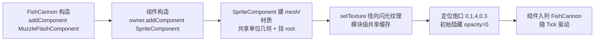
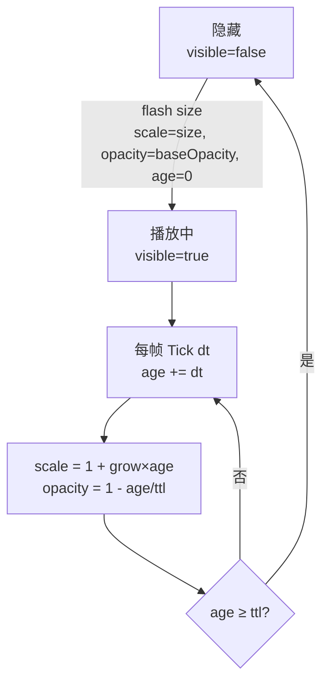

# MuzzleFlashComponent（炮口闪光组件）

> 鱼潮（ClashMaster）项目级特效组件：开炮瞬间的炮口闪光（放大 + 淡出），mesh/材质/动画全部内聚在组件内部，拥有者（FishCannon）零渲染代码、只触发。
> 代码位置：`src/projects/fish/gameplay/game/comp/MuzzleFlashComponent.ts`
> 相关文档：[实体体系](./entity_system.md) / [渲染系统](./rendering_system.md) / [系统总览](../system_overview.md)

## 1. 概述

`MuzzleFlashComponent` 是炮台（`FishCannon`）开炮时的炮口闪光特效组件。组件构造时通过 `owner.addComponent(SpriteComponent, ...)` **组合**引擎精灵组件自动创建闪光面片（引擎内部经 ThreeFactoryComponent 创建并挂 root，项目代码零裸 `new THREE`），初始隐藏；开炮时拥有者调用 `flash(size)` 触发，随后组件的 `Tick` 自管"放大 + 淡出"动画，到期自动隐藏。

| 角色 | 干什么 |
|---|---|
| `MuzzleFlashComponent` | 闪光状态机：隐藏 → 显示 → 放大淡出 → 隐藏（本组件） |
| `SpriteComponent`（组合） | 实际渲染面片：共享单位几何 + 每实例材质，`EndPlay` 自动释放 |
| `FishCannon`（拥有者） | 只负责触发：`getComponent(MuzzleFlashComponent)?.flash(size)` |

**设计动机**：旧实现把 `flashMat` / `flashMesh` / 闪光动画字段直接写在 `FishCannon` 里（拥有者裸 `new THREE.MeshBasicMaterial` / `new THREE.Mesh`），违反"组件优先"与"项目代码禁止裸 new THREE"约定；迁移后 `FishCannon` 闪光相关代码净删除（约 30 行 → 1 行挂载 + 1 行触发），行为逐帧等价。

## 2. 核心属性

| 属性 | 类型 | 默认 | 说明 |
|---|---|---|---|
| `ttl` | number | `0.15` | 闪光总时长（秒），到期自动隐藏 |
| `grow` | number | `6` | 每秒放大系数：`scale = 1 + grow × age` |
| `baseOpacity` | number | `0.9` | `flash()` 触发瞬间的不透明度 |

面片固定参数（构造时设定，与旧实现一致）：

| 参数 | 值 | 说明 |
|---|---|---|
| 位置 | `(0, 1.4, 0.3)` | 炮口位置（炮台本地坐标，随 root 旋转自动跟随） |
| 朝向 | 法线 +Z | 面向 -Z 方向的相机 |
| 初始尺寸 | 1×1（共享单位平面） | 尺寸变化只改 scale，不重建几何 |
| 初始状态 | `visible = false`、`opacity = 0` | 不触发不渲染 |
| 深度写入 | `depthWrite = false` | 透明面片不写深度，避免干扰其他透明对象排序 |
| 纹理 | 径向闪光（canvas 绘制） | 模块级共享缓存，所有炮台共用一份 |

## 3. 使用方法

### 3.1 挂载（构造时）

```ts
// FishCannon 构造内（类版 addComponent，owner 自动传入）
this.addComponent(MuzzleFlashComponent)
```

### 3.2 触发（开炮时）

```ts
// FishCannon.tryFire 内（组件不存在时静默跳过）
this.getComponent(MuzzleFlashComponent)?.flash(cfg.netRadius * 2.6)
```

`flash(size)` 语义：设 `scale = (size, size, 1)` → `opacity = baseOpacity` → 显示 → 重置年龄（每发子弹触发一次，反复复用同一面片）。

### 3.3 动画参数调优（可选）

```ts
const flash = cannon.getComponent(MuzzleFlashComponent)
if (flash) {
  flash.ttl = 0.2          // 更长的闪光
  flash.grow = 8           // 更快的放大
  flash.baseOpacity = 1    // 更亮
}
```

## 4. 工作流程

### 4.1 构造与挂载



### 4.2 闪光状态机



## 5. 边界条件与资源释放

| 项 | 行为 |
|---|---|
| 组件未挂载时触发 | `getComponent(...)?.flash(...)` 可选链静默跳过（不报错） |
| 高频连射 | 每次 `flash()` 重置年龄重新播放，无对象池、无泄漏（复用同一面片） |
| 场景切换销毁 | 随 `FishCannon.EndPlay` 递归销毁：`SpriteComponent` 材质由引擎 `ThreeObjectComponent.EndPlay` 自动 dispose |
| 纹理生命周期 | 径向闪光纹理为**模块级共享缓存**（`_flashTex`），跨场景常驻、不随组件释放（有意为之，避免重复创建） |
| 几何生命周期 | 单位平面为 `SpriteComponent` 静态共享几何（`disposeGeometry: false`），引擎统一管理 |
| 与对象池特效（FishFlash）的区别 | `FishFlash` 是池化 Actor（通用光环特效）；本组件是炮台常驻组件（每炮台一份，免池化调度） |
| 已知限制 | 触发瞬间 opacity 恒为 `baseOpacity`（不支持外部传透明度；如需可扩展 `flash(size, opacity?)`） |

## 6. 迁移对照（行为等价性）

| 旧实现（FishCannon 内联） | 新实现（MuzzleFlashComponent） |
|---|---|
| `flashMesh.position.set(0, 1.4, 0.3)` | 构造时 `sprite.mesh.position.set(0, 1.4, 0.3)` |
| `flashMat.opacity = 0`、`visible = false` | `setOpacity(0)`、`mesh.visible = false` |
| 触发：`scale = netRadius*2.6`、`opacity = 0.9`、`visible = true`、`age = 0` | `flash(netRadius * 2.6)`：scale / baseOpacity=0.9 / 显示 / age=0 |
| Tick：`scale = 1 + 6×age`、`opacity = max(0, 1 - age/0.15)`、到期隐藏 | `Tick` 同式（`ttl = 0.15`、`grow = 6`），逐帧一致 |
