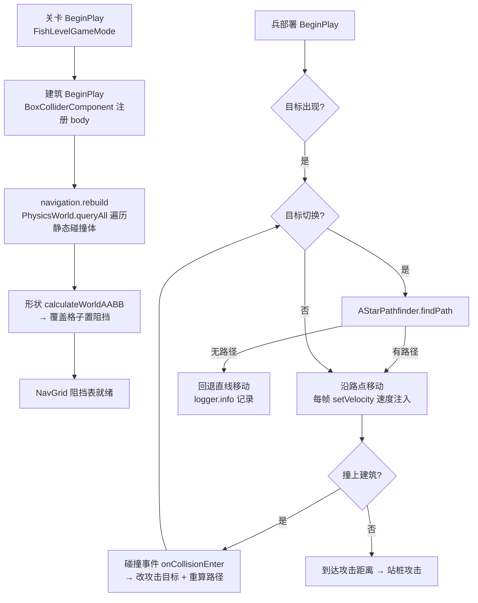

# 寻路系统（Engine Navigation）

> 网格 A* 寻路：阻挡格从静态碰撞体自动栅格化，兵沿路径绕墙移动；无路径回退直线。
> 代码位置：`src/engine/navigation/`
> 相关文档：[系统总览](../system_overview.md) / [输入物理脚本系统](./input_physics_script_system.md) / [ClashMaster 项目](../projects/clash_master.md) / [战斗系统](../battle_system.md)

## 1. 核心类

| 类 | 说明 |
|---|---|
| `NavigationModule` | 寻路模块门面：组合 NavGrid + AStarPathfinder，项目侧入口（`rebuild()` / `findPath()` / `isBlockedAt()`） |
| `NavGrid` | 阻挡网格：从 PhysicsWorld 静态碰撞体 AABB 自动栅格化；稀疏存储（Map 行 → Set 列） |
| `AStarPathfinder` | A* 寻路（八方向 + 二叉堆 open list）：禁止对角穿墙、目标格被占时螺旋外扩找最近可走格 |

## 2. 使用方法

```ts
// 战斗 GameMode（fish 示例）：关卡初始化时重建阻挡格
readonly navigation = new NavigationModule()   // 默认 cellSize=1, halfExtent=32

override BeginPlay() {
  this.navigation.rebuild()                    // 从静态建筑碰撞体栅格化（返回阻挡格数）
}

// 兵每帧：目标切换时寻路
const path = this.navigation.findPath(fromPos, toPos)  // THREE.Vector3[] | null
if (path) {
  // 沿路点移动（每帧取 path[0] 方向注入速度；到点 shift）
} else {
  // 无路径 → 回退直线移动（现状行为）
}

// 直接查点
this.navigation.isBlockedAt(x, z)              // 该位置是否被静态建筑阻挡
```

### 参数

| 参数 | 默认 | 说明 |
|---|---|---|
| `cellSize` | 1 | 格子边长（世界单位；与建筑网格吸附 1 单位对齐） |
| `halfExtent` | 32 | 网格半径（格子索引范围 ±32，越界视为阻挡） |
| `findPath` 的 `maxExpand` | 4096 | 最大展开节点数（防超大地图死循环；超限视为无路径） |

## 3. 工作流程



### 关键决策

- **仅静态建筑为障碍**：`rebuild` 只收集 `bodyType === 'static'` 的碰撞体（动态兵不参与）
- **重算时机**：目标切换/被挡改目标时重算一次，**不做每帧重算**（64×64 网格单次 < 1ms）
- **无路径回退直线**：寻路失败（围死/无通道）→ 直线移动，不中断游戏
- **被挡改目标**：兵撞上建筑（碰撞事件 Enter）→ 目标覆盖为阻挡物（部落冲突式语义）→ 重算路径
- **飞行兵**：不挂碰撞体、不参与寻路阻挡，直线飞越（现状语义）

## 4. 边界条件

| 条件 | 行为/后果 | 处理方式 |
|---|---|---|
| 寻路无路径（四面围死） | `findPath` 返回 null | 调用方回退直线移动（兵不卡死不报错） |
| 起点在阻挡格（贴墙出生） | 允许从阻挡格出发（只展开非阻挡邻居） | A* 内置 |
| 目标格被占（建筑在目标点） | 螺旋外扩（半径 6）找最近可走格 | A* 内置 |
| 对角穿墙 | 两个相邻正交格均阻挡时禁止斜走 | A* 内置 |
| 物理禁用（cannon 初始化失败） | `rebuild` 无静态碰撞体 → 阻挡表为空 | 所有路径 = 直线（游戏可继续） |
| 网格越界 | 视为阻挡（防走出地图） | NavGrid 内置 |
| 关卡切换 | 新关卡 BeginPlay 重新 `rebuild`（旧网格随旧 World 销毁） | 项目侧调用 |

## 5. 依赖关系

```
NavigationModule
  ├─ NavGrid.rebuildFromStaticColliders
  │    └─ PhysicsWorld.queryAll（静态碰撞体）→ shape.calculateWorldAABB → 格子置阻挡
  └─ AStarPathfinder.findPath（八方向 A* + 螺旋目标修正）

TroopMoveComponent（fish 项目）→ NavigationModule.findPath → setVelocity 注入速度
FishLevelGameMode.BeginPlay → navigation.rebuild()（战斗关卡初始化一次）
```
