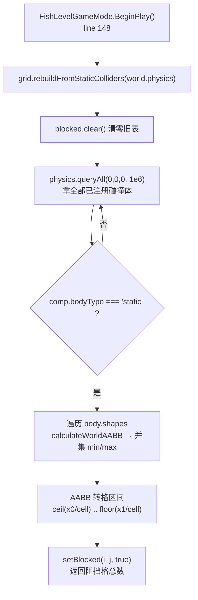

# 导航系统（Navigation）

> **一句话定位**：把「世界里的静态建筑碰撞体」栅格化成一张阻挡表，再用 A\* 在上面算出一条从 A 到 B 的路径点序列 —— 引擎只负责**算路**，不负责走路。
>
> **什么时候会用到你**：给兵/AI 加绕墙移动、调寻路频率或卡死判定、排查「兵卡在建筑里」「兵绕远路」「兵不走了」、新增需要避障的移动单位。
>
> 代码位置：`src/engine/navigation/`

---

## 1. 先记住这几个文件

| 文件 | 一句话职责 | 你要改它的场景 |
|---|---|---|
| [NavigationModule.ts](../../src/engine/navigation/NavigationModule.ts) | 门面：持有 `grid` + `pathfinder`，对外暴露 `findPath` / `isBlockedAt` / `pickBuildingSlot` | 加新的对外寻路能力；改路径点返回格式 |
| [NavGrid.ts](../../src/engine/navigation/NavGrid.ts) | 阻挡栅格：世界坐标 ↔ 格坐标换算 + 从静态碰撞体 AABB 栅格化 | 改格子尺寸、改障碍来源、加动态障碍 |
| [AStarPathfinder.ts](../../src/engine/navigation/AStarPathfinder.ts) | A\* 搜索：八方向、二叉堆 open list、回溯出路径 | 改启发式 / 对角规则 / 展开上限 |

**关键心智模型**：这一层是**纯计算、无状态驱动**的。它不知道「兵」是什么，也不会移动任何东西；`rebuild` 谁调用它才跑，`findPath` 谁问它才算。移动由调用方拿路径点自己注入速度完成（见 §3）。

---

## 2. 一次寻路怎么算出来：从起点终点到路径点

### 2.1 谁调用了它

全仓 grep `NavigationModule` / `NavGrid` / `findPath`，**真实调用方只有两个文件**（都在 fish 项目，引擎侧只有 `src/engine/index.ts:212-214` 的 re-export）：
```ts
// src/projects/fish/gameplay/level/FishLevelGameMode.ts:122（构造函数内，只 new 一次）
import { NavigationModule } from '@/engine/navigation/NavigationModule'
readonly navigation: NavigationModule
this.navigation = new NavigationModule()
// src/projects/fish/gameplay/battle/troops/TroopMoveComponent.ts:220
this.path = this.gm.navigation.findPath(pos, edgePoint)
```
调用链很窄，但**是接线的**：`FishLevelGameMode` 持有实例并在 `BeginPlay` 建网格（§2.2），`TroopMoveComponent` 每 24 帧寻一次路并沿路点走（§3）。

### 2.2 网格构建

**① 栅格化全过程**（[NavGrid.ts:64](../../src/engine/navigation/NavGrid.ts)，连续代码）
```ts
rebuildFromStaticColliders(physics: PhysicsWorld): number {
  this.blocked.clear()
  let count = 0
  const min = new CANNON.Vec3()
  const max = new CANNON.Vec3()
  for (const hit of physics.queryAll(new THREE.Vector3(0, 0, 0), 1e6)) {
    const comp = hit.collider
    if (comp.bodyType !== 'static') continue
    const body = hit.body
    if (body.shapes.length === 0) continue
    // 逐 shape 求世界 AABB 再取并集（支持复合建筑）；y 轴（y0/y1）被 void 丢弃
    let x0 = Infinity, z0 = Infinity
    let x1 = -Infinity, z1 = -Infinity
    for (let s = 0; s < body.shapes.length; s++) {
      body.shapes[s].calculateWorldAABB(body.position, body.quaternion, min, max)
      if (min.x < x0) x0 = min.x
      if (min.z < z0) z0 = min.z
      if (max.x > x1) x1 = max.x
      if (max.z > z1) z1 = max.z
    }
    if (!Number.isFinite(x0)) continue
    const i0 = Math.ceil(x0 / this.cellSize)
    const i1 = Math.floor(x1 / this.cellSize)
    const j0 = Math.ceil(z0 / this.cellSize)
    const j1 = Math.floor(z1 / this.cellSize)
    for (let j = j0; j <= j1; j++) {
      for (let i = i0; i <= i1; i++) {
        this.setBlocked(i, j, true)
        count++
      }
    }
  }
  return count
}
```
半径 `1e6` 是**故意的**：`queryAll` 是圆形范围查询（[PhysicsWorld.ts:247](../../src/engine/physics/PhysicsWorld.ts)），传覆盖全图的半径等于「遍历所有已注册碰撞体」，再用 `bodyType === 'static'` 自己筛 —— 复用物理侧已注册的碰撞体集合，不必让导航再维护一份静态清单；代价是**开销与碰撞体总数成正比**（动态兵的碰撞体也被遍历一次才 `continue` 掉），好在只在关卡初始化跑一次。`calculateWorldAABB(body.position, body.quaternion, ...)` 直接算世界包围盒、**不依赖物理步进**，所以 `rebuild` 在 `BeginPlay` 里创建完就能拿到正确包围盒，不必等物理 tick。

**② 区间换算 —— 全系统最反直觉的一段**，务必对照坐标约定（[NavGrid.ts:29](../../src/engine/navigation/NavGrid.ts)）理解：
```ts
worldToCell(x: number, z: number): [number, number] {
  return [Math.round(x / this.cellSize), Math.round(z / this.cellSize)]
}
cellToWorld(i: number, j: number): [number, number] {
  return [i * this.cellSize, j * this.cellSize]
}
```
格子 `(i,j)` 代表的是**一个点（格中心）**，不是一块面积。所以「AABB 覆盖哪些格」=「哪些格中心落在 AABB 内」= `ceil(下界)` 到 `floor(上界)`。用 `floor` 而非 `ceil` 收上界正是为了**不外扩**：改成 `Math.ceil(x1 / cell)` 的话，一个 3×3 建筑会膨胀成 4×4 阻挡区，兵就永远走不进两栋楼之间的 1 格缝隙。

**③ 越界即阻挡**（[NavGrid.ts:39](../../src/engine/navigation/NavGrid.ts)）
```ts
isBlocked(i: number, j: number): boolean {
  if (Math.abs(i) > this.halfExtent || Math.abs(j) > this.halfExtent) return true
  return this.blocked.get(j)?.has(i) ?? false
}
```
`halfExtent` 默认 32 配 `cellSize` 默认 1，可用范围 **65×65 格、以原点为中心**。这个边界不落在 `blocked` 表里，而是 `isBlocked` 每次现判 —— 好处是零存储、改 `halfExtent` 立即生效；代价是**世界不以原点布局时，大片区域会静默变成墙**。存储用 `Map<j, Set<i>>` 稀疏行式结构，只存阻挡格。

### 2.3 A\* 搜索

**① 起点终点预处理**（[AStarPathfinder.ts:29](../../src/engine/navigation/AStarPathfinder.ts)）
```ts
findPath(fromX, fromZ, toX, toZ, maxExpand = 4096): Array<[number, number]> | null {
  const [si, sj] = grid.worldToCell(fromX, fromZ)
  const [ti, tj] = grid.worldToCell(toX, toZ)
  const startBlocked = grid.isBlocked(si, sj)
  let goal = this.findNearestFree(ti, tj)
  if (!goal) return null
```
两个**不对称**的处理：**起点被挡允许**（兵贴墙/出生在边缘格时仍从这格出发，展开邻居时才被 `isBlocked` 挡住），**终点被挡要修正**（`findNearestFree` 螺旋外扩半径 6 找最近可走格）。不改终点的话「攻击这栋楼」会直接返回 null —— 楼本身即阻挡格；外扩后兵贴到楼边，正是「走到墙边打墙」的语义。

**② 启发式：octile distance**
```ts
const h = (i: number, j: number) => {
  const dx = Math.abs(i - goal![0])
  const dz = Math.abs(j - goal![1])
  return dx + dz + (Math.SQRT2 - 2) * Math.min(dx, dz)
}
```
八方向的标准 admissible 启发式：先按曼哈顿距离走 `dx+dz` 步，其中 `min(dx,dz)` 步可走对角（每步代价从 2 降为 `√2`，增量即 `√2-2`）。**不能用欧几里得距离**：它会低估八方向代价，导致 A\* 扩展更多节点。

**③ 主循环 + 八邻域**（连续代码）
```ts
let expanded = 0
let goalKey = -1
while (open.length > 0) {
  const cur = openPop()!
  if (expanded++ > maxExpand) return null   // 超限：视为无路径
  const ck = key(cur.i, cur.j)
  if (cur.g > (gScore.get(ck) ?? Infinity)) continue  // 过期堆节点
  if (cur.i === goal[0] && cur.j === goal[1]) { goalKey = ck; break }
  for (let dj = -1; dj <= 1; dj++) {
    for (let di = -1; di <= 1; di++) {
      if (di === 0 && dj === 0) continue
      const ni = cur.i + di
      const nj = cur.j + dj
      if (grid.isBlocked(ni, nj)) continue
      // 禁止对角穿墙：两正交邻格均阻挡时不可斜走
      if (di !== 0 && dj !== 0 && (grid.isBlocked(cur.i + di, cur.j) || grid.isBlocked(cur.i, cur.j + dj))) continue
      const ng = cur.g + (di !== 0 && dj !== 0 ? Math.SQRT2 : 1)
      const nk = key(ni, nj)
      if (ng < (gScore.get(nk) ?? Infinity)) {
        gScore.set(nk, ng)
        cameFrom.set(nk, ck)
        openPush({ i: ni, j: nj, g: ng, f: ng + h(ni, nj) })
      }
    }
  }
}
if (goalKey < 0) return null
```
三个各自独立的坑都藏在这段里：

- `open` 是就地实现的二叉堆（`openPush`/`openPop`），**没有 decrease-key**，同一格会被 push 多次。`cur.g > gScore.get(ck)` 是唯一防线 —— 弹出旧 g 值节点时直接丢弃。删掉它不报错，但会退化成重复扩展。
- `maxExpand` 默认 4096 是**硬保险**（65×65 全图 4225 格，正常搜索远达不到）。放大地图时它保证寻路不无限吃 CPU，而是返回 null 交给调用方兜底。
- 对角代价 `Math.SQRT2`（否则八方向路径退化成锯齿台阶）；**禁止对角穿墙**那行最易漏写 —— 两堵墙的内凹角处，若两正交邻格都被挡，斜穿等于「切墙角」穿实体。少这行，兵会从两栋建筑对角相接处直接走过去。

**④ 回溯与出参**
```ts
const cells: Array<[number, number]> = []
let k = goalKey
while (k !== sk) {
  cells.push([(k % stride) - grid.halfExtent, Math.floor(k / stride) - grid.halfExtent])
  const prev = cameFrom.get(k)
  if (prev === undefined) break
  k = prev
}
cells.reverse()
const path: Array<[number, number]> = cells.map(([i, j]) => grid.cellToWorld(i, j))
if (startBlocked && path.length > 0) path.unshift([fromX, fromZ])
return path.length > 0 ? path : null
```
`gScore` / `cameFrom` 都是 `Map<number, ...>`，key = `(j + halfExtent) * stride + (i + halfExtent)`，把二维坐标压成一个整数 —— 比字符串 key 快得多。回溯**不含起点格**（循环条件 `k !== sk`），因为起点即兵当前位置。`unshift([fromX, fromZ])` 是给「贴墙出发」打的补丁：起点被挡时兵实际不在格中心，插入自身真实坐标让第一段平滑出发、避免先横跳到格心。

`NavigationModule.findPath`（[NavigationModule.ts:34](../../src/engine/navigation/NavigationModule.ts)）再包一层，把 `[x, z]` 元组提升为 `THREE.Vector3`（`new THREE.Vector3(x, 0, z)`），无路径返回 `null`。

**出参约定**：`Vector3[] | null`，`y` 恒为 0、**不含起点**、含终点格中心；空数组也不会返回（`path.length > 0 ? path : null`），调用方只需判 `null`。

---

## 3. 路径怎么被消费

**唯一消费方**是 [TroopMoveComponent.ts](../../src/projects/fish/gameplay/battle/troops/TroopMoveComponent.ts)（fish 项目兵移动组件），每帧 `Tick` 里做三件事：

**① 终点不是建筑中心，而是攻击距离边界**（`Tick` 内）
```ts
const edgeX = center.x - (dx / Math.max(distToCenter, 0.0001)) * attackDist
const edgeZ = center.z - (dz / Math.max(distToCenter, 0.0001)) * attackDist
```
**不这么写，A\* 会绕到建筑背后去** —— 中心格被 `findNearestFree` 螺旋外扩后落在哪一侧不确定，兵就会绕远路。定点在射线上后，路径终点永远在面朝兵那一侧。

**② 24 帧才寻一次路**（`REPATH_INTERVAL = 24`，line 34）
```ts
const needRepath = (() => {
  if (!canRepath) return false
  if (this.pathFailCooldownSec > 0) return false
  if (this.stuckTicks > 36) return true
  if (this.pathTarget !== target) return true
  if (!this.path || this.path.length === 0) return false
  const wp = this.path[0]
  return Math.hypot(wp.x - pos.x, wp.z - pos.z) > this.gm.navigation.grid.cellSize * 2
})()
```
四个触发条件：卡死超 36 帧、目标切换、路径为空、或**首路点已偏离 2 格以上**（兵被物理挤离原路径）。注意 `cellSize * 2` 读的是 `grid.cellSize` 而非写死常量 —— 改网格分辨率时阈值自动跟随，别替换成字面量。

**③ 沿路点走 + 失败兜底**
```ts
this.path = this.gm.navigation.findPath(pos, edgePoint)
if (this.path && this.path.length >= 2) {
  logger.info(`[Battle] ${this.troop.name} A* 寻路成功（${this.path.length} 路点） → ${target.type.name}`)
  this.stuckTicks = 0
} else {
  logger.warn(`[Battle] ${this.troop.name} A* 寻路失败，回退直线 → ${target.type.name}`)
  this.path = null
  this.pathFailCooldownSec = 0.15
}
```
失败时 `path = null`，方向回退成直指终点的 `dx2/dz2`，兵继续直线移动 —— **游戏不中断**。成功后每帧取 `path[0]` 方向，距离小于 0.2 就 `shift()` 掉取下一个，最后 `this.collider.setVelocity((dirX / d) * speed, (dirZ / d) * speed)`（line 265）注入物理速度。

飞行兵不参与：`BeginPlay` 里 `if (this.troop.flying) return` 提前返回，`collider` 保持 null，`Tick` 走「无碰撞体 → 直线移动」分支（`pos.x += ...`），完全不经过 A\*。

---

## 4. 关键方法速查

| 方法 | 位置 | 干什么 | 注意 |
|---|---|---|---|
| `new NavigationModule(cellSize=1, halfExtent=32)` | [NavigationModule.ts:20](../../src/engine/navigation/NavigationModule.ts) | 建 grid + pathfinder | 每关一个实例，随 GameMode 构造 |
| `findPath(from, to)` | [NavigationModule.ts:34](../../src/engine/navigation/NavigationModule.ts) | 世界坐标 → `Vector3[] \| null`，y=0 | **不含起点**；null = 无路径，要兜底 |
| `rebuild(physics)` | [NavigationModule.ts:26](../../src/engine/navigation/NavigationModule.ts) | 门面版重建，转发到 grid | **当前无调用方**：项目侧直调 `grid.rebuildFromStaticColliders` |
| `isBlockedAt(x, z)` | [NavigationModule.ts:41](../../src/engine/navigation/NavigationModule.ts) | 查某点是否阻挡 | 内部即 `worldToCell` + `isBlocked` |
| `pickBuildingSlot(center, spanIdx)` | [NavigationModule.ts:56](../../src/engine/navigation/NavigationModule.ts) | 按 `rank*8+sub` 分配建筑环绕站位 | 与 `pickBuildingSlotInto`（[:112](../../src/engine/navigation/NavigationModule.ts)）、`enumerateStandPoints`（[:92](../../src/engine/navigation/NavigationModule.ts)）、`spiralOffsets`（[:145](../../src/engine/navigation/NavigationModule.ts)）同属站位分配组，**当前均无调用方** |
| `worldToCell(x, z)` / `cellToWorld(i, j)` | [NavGrid.ts:29](../../src/engine/navigation/NavGrid.ts) / [:34](../../src/engine/navigation/NavGrid.ts) | 坐标换算（四舍五入 / 格中心） | 格代表**中心点**不是面积 |
| `isBlocked(i, j)` | [NavGrid.ts:39](../../src/engine/navigation/NavGrid.ts) | 查阻挡，越界算阻挡 | 每次现判 halfExtent，不落表 |
| `setBlocked(i, j, value)` | [NavGrid.ts:45](../../src/engine/navigation/NavGrid.ts) | 单格标记 / 清除 | 清除时空行被 delete，不留空 Set |
| `rebuildFromStaticColliders(physics)` | [NavGrid.ts:64](../../src/engine/navigation/NavGrid.ts) | 从静态碰撞体 AABB 栅格化，返回阻挡格数 | **真正被项目侧调用**的是这个 |
| `freeCellsAround(ci, cj, minR, maxR)` | [NavGrid.ts:112](../../src/engine/navigation/NavGrid.ts) | 环形可走格（格坐标） | **当前无调用方**：A\* 用 `findNearestFree` |
| `blockedCount` | [NavGrid.ts:136](../../src/engine/navigation/NavGrid.ts) | 诊断用阻挡格总数 | 每次遍历全表，只适合日志 / 调试 |
| `findPath(fromX, fromZ, toX, toZ, maxExpand=4096)` | [AStarPathfinder.ts:29](../../src/engine/navigation/AStarPathfinder.ts) | A\* 求路，返回 `[x,z][] \| null` | 内部用元组，不经 `NavigationModule` 拿不到 `Vector3` |
| `findNearestFree(i, j)` (private) | [AStarPathfinder.ts:147](../../src/engine/navigation/AStarPathfinder.ts) | 目标被占时螺旋外扩（半径 6） | 只做终点修正，起点不做 |

---

## 5. 流程影响：牵动哪些功能

### 上游：谁驱动它

| 上游 | 怎么驱动 | 相关文档 |
|---|---|---|
| `FishLevelGameMode.BeginPlay` | `navigation.grid.rebuildFromStaticColliders(world.physics)` 建网格（line 148），日志打印阻挡格数 | [./gameflow_system.md](./gameflow_system.md) |
| `PhysicsWorld` / 碰撞体组件 | 提供 `queryAll` 与 `body.shapes` 的 AABB；`bodyType='static'` 决定谁能当障碍 | [./physics_system.md](./physics_system.md) |
| `TroopMoveComponent.Tick` | 每 24 帧调 `navigation.findPath(pos, edgePoint)` | [../projects/battle_system.md](../projects/battle_system.md) |
| 关卡切换 / `setupLevelPhase` | 新关卡新 `FishLevelGameMode` → 新 `NavigationModule`，旧网格随旧 World 丢弃 | [../projects/level_system.md](../projects/level_system.md) |

### 下游：它波及谁

| 下游功能 | 波及点 | 相关文档 |
|---|---|---|
| 兵移动（`TroopMoveComponent`） | 路径点直接决定 `setVelocity` 方向；寻路失败 → 直线兜底 | [../projects/battle_system.md](../projects/battle_system.md) |
| 兵索敌 / 被挡改目标 | 撞上 static 建筑 → `setTroopTargetOverride` + 清空 path 重算 | [../projects/battle_system.md](../projects/battle_system.md) |
| 建筑包围盒与碰撞体 | 建筑 `size` / 碰撞体改动会改变栅格结果，进而改变所有路径 | [./entity_system.md](./entity_system.md) |
| `OnDrawGizmos` 调试可视化 | 蓝色折线画出 `this.path`，玫红圆环画寻路终点 | [./rendering_system.md](./rendering_system.md) |

---

## 6. 踩坑清单

**1. 门面方法 `rebuild()` 没人用，项目侧绕过去了** —— 类注释写 `nav.rebuild(world.physics)`，但 grep 全仓 `.rebuild(` 只有 `NavigationModule.ts:27` 的定义自身，实际调用点是 `FishLevelGameMode.ts:148` 的 `navigation.grid.rebuildFromStaticColliders(...)`。**规则**：改重建逻辑要改 `NavGrid.rebuildFromStaticColliders`。

**2. 改 `cellSize` 会同时改变「路点偏离阈值」** —— `TroopMoveComponent.ts:208` 写的是 `wpd > grid.cellSize * 2` 而非写死的 2。**规则**：调小 cellSize 会让重算更频繁，这个耦合是故意的，别改成字面量。

**3. 格子是「中心点」不是「面积」，外扩一格就走不进缝隙** —— 栅格化用 `ceil(下界) / floor(上界)` 严格贴合。**规则**：要给障碍留边距，应在 AABB 求完后统一加 pad，而不是把 `floor` 改成 `ceil`（后者让相邻的墙连成一片）。
**4. 地图不以原点为中心 → 大面积静默变墙** —— `isBlocked` 对 `|i| > halfExtent` 返回 true，可用区只有 `[-32, 32]`。**规则**：扩地图必须同步改 `new NavigationModule(cellSize, halfExtent)` 第二参；内存是稀疏的，放大几乎不花钱。
**5. 物理被禁用时网格是空的，但游戏照样跑** —— `queryAll` 开头 `if (!this.enabled) return hits`（[PhysicsWorld.ts:249](../../src/engine/physics/PhysicsWorld.ts)）→ 零阻挡格 → 所有路径退化成直线。**规则**：排查「兵穿墙」先看日志 `寻路网格已构建（阻挡格 N 个）` 的 N 是否 0；N=0 基本等于物理没起来或 `bodyType` 不是 `static`。
**6. 起点被挡与终点被挡的处理不对称** —— 起点被挡照常出发（`startBlocked` 只在最后 `unshift` 自身坐标），终点被挡才螺旋外扩。**规则**：别把「兵卡在墙里出不来」当成 `findNearestFree` 的 bug，起点侧根本不修正，那属于卡死检测（`stuckTicks > 36`）的管辖范围。
**7. 删掉 `cur.g > gScore.get(ck)` 会让 A\* 变慢但不报错** —— 二叉堆无 decrease-key，靠这行丢弃过期节点。**规则**：调 A\* 性能前先确认它还在。

---

## 7. 边界条件

| 条件 | 行为 | 怎么应对 |
|---|---|---|
| 无路径（四面围死 / 展开超 4096） | `findPath` 返回 `null` | 调用方回退直线，`pathFailCooldownSec = 0.15` 冷却，不报错不卡死 |
| 起点在阻挡格（贴墙出生） | 允许出发，首路点前 `unshift` 自身真实坐标 | 内置；仍出不来靠 `stuckTicks > 36` 强制重路径 |
| 终点格被占（目标在建筑内） | `findNearestFree` 螺旋外扩半径 6；半径内全是阻挡则返回 null | 项目侧更推荐把终点定在建筑外（§3 ① 的 edgePoint） |
| 对角穿墙（两正交邻格均阻挡） | 禁止斜走 | 内置；改动八邻域时务必保留该判断 |
| 网格越界（`\|i\| > halfExtent`） | `isBlocked` 返回 true（可用区仅 `[-32, 32]`） | 扩地图同步调大 `halfExtent` |
| 物理禁用 / cannon 未初始化 | `queryAll` 返回空 → 阻挡表为空 → 全直线 | 查日志阻挡格数是否为 0 |
| 动态物体（兵、弹丸） | 不参与栅格（只收 `bodyType === 'static'`） | 兵之间不避让，靠物理挤压；**当前无动态避障** |
| 飞行兵 | `BeginPlay` 提前 return，`collider` 为 null，走直线 | 不查网格，可直接飞越建筑 |
| 关卡切换 | 新 GameMode 新建 `NavigationModule`，旧网格随旧 World 销毁 | 无需手动清理 |
| 建筑被摧毁 / 布局变化 | 阻挡表**不会自动更新**，摧毁后的格子仍是阻挡 | 需手动重调 `rebuildFromStaticColliders`；当前战斗流程未调用 |
| 路径点是格中心、y 恒为 0 | 不适用多层 / 3D 寻路 | 有高度差场景需另做方案 |


